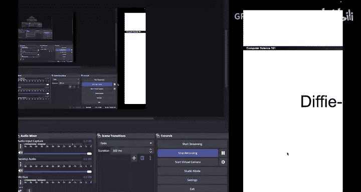
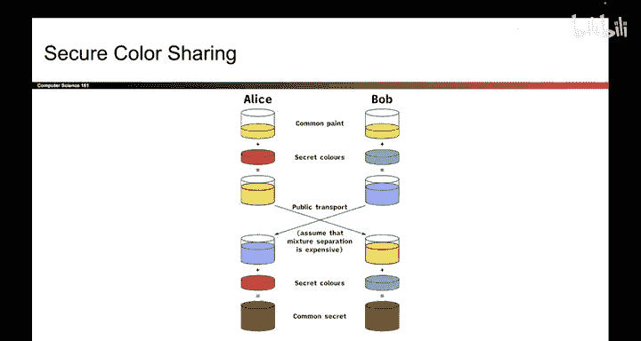

# 139：安全颜色共享（类比）

在本节课中，我们将学习迪菲-赫尔曼密钥交换的基本思想。我们将从一个简单的颜色混合类比开始，理解两个人在不安全的信道上如何协商出一个共享的秘密，而窃听者却无法获知这个秘密。

上一节我们介绍了对称密钥方案需要一个共享的秘密密钥。本节中我们来看看，如何在不安全的信道上安全地建立这个共享密钥。

## 颜色共享类比

为了理解迪菲-赫尔曼密钥交换的工作原理，我们从一个类比开始。在这个类比中，爱丽丝和鲍勃希望在一个不安全的信道上共享一个秘密颜色。爱丽丝不能直接将秘密颜色发送给鲍勃，因为那样窃听者夏娃也会知道这个秘密。

因此，他们将使用一种众所周知的公共颜料来伪装这个秘密。以下是具体的步骤：

1.  **建立公共颜色**：爱丽丝、鲍勃和夏娃都知道一个公共颜色，例如黄色。这个颜色用于帮助伪装秘密。
2.  **生成个人秘密**：爱丽丝生成她那一半的秘密，例如红色。鲍勃生成他那一半的秘密，例如青色。
3.  **交换伪装后的秘密**：
    *   爱丽丝将她的秘密红色与公共黄色混合，得到橙色。她将橙色发送给鲍勃。
    *   鲍勃将他的秘密青色与公共黄色混合，得到蓝色。他将蓝色发送给爱丽丝。
4.  **计算共享秘密**：
    *   爱丽丝收到鲍勃的蓝色（青色+黄色）后，加入自己的秘密红色，最终混合得到红色+青色+黄色。
    *   鲍勃收到爱丽丝的橙色（红色+黄色）后，加入自己的秘密青色，最终也混合得到红色+青色+黄色。

这样，爱丽丝和鲍勃就协商出了相同的最终颜色（红色+青色+黄色），这个颜色就是他们的共享秘密。

## 类比的安全性分析

现在，如果你是窃听者夏娃，你会看到什么？你只能看到在信道上传输的橙色和蓝色。即使你知道公共颜色是黄色，并且知道橙色是红色和黄色的混合物，你也无法将黄色从橙色中分离出来以还原出原始的红色。分离颜料在物理上是非常困难的。同样，你也不能从蓝色中分离出青色。

这个类比的关键在于假设**分离混合颜料是困难的**。因此，夏娃即使看到了伪装后的秘密，也无法恢复出爱丽丝和鲍勃的个人秘密，从而无法计算出最终的共享秘密。

## 重新表述颜色共享方案

让我们用略微不同的颜色再次阐述这个方案，以便为后续的数学解释做铺垫。

以下是步骤的详细说明：

1.  **生成个人秘密**：爱丽丝生成她的秘密颜色 **A**（琥珀色）。鲍勃生成他的秘密颜色 **B**（蓝色）。
2.  **确定公共颜色**：所有人（包括夏娃）都知道公共颜色 **G**（绿色）。
3.  **交换伪装秘密**：
    *   爱丽丝将她的秘密 **A** 与公共颜色 **G** 混合，得到 **G A**（绿琥珀色），并将其发送给鲍勃。
    *   鲍勃将他的秘密 **B** 与公共颜色 **G** 混合，得到 **G B**（绿蓝色），并将其发送给爱丽丝。
4.  **计算共享秘密**：
    *   爱丽丝收到 **G B**，然后加入自己的秘密 **A**，得到 **G A B**（绿琥珀蓝色）。
    *   鲍勃收到 **G A**，然后加入自己的秘密 **B**，也得到 **G A B**（绿琥珀蓝色）。

爱丽丝和鲍勃成功协商出了相同的共享秘密 **G A B**。

## 夏娃面临的挑战

夏娃知道公共颜色 **G**，也看到了信道上的 **G A** 和 **G B**。她可能试图混合这些颜色来获得秘密，但即使她将 **G A** 和 **G B** 混合，得到的结果也是 **G A G B**，其中包含了过多的绿色成分，与爱丽丝和鲍勃得到的 **G A B** 并不相同。

这个类比在此处略有延伸，但核心思想是：即使夏娃知道公共成分和伪装后的秘密，由于无法逆向分离出原始的个人秘密，她也就无法计算出最终的共享秘密。

本节课中我们一起学习了迪菲-赫尔曼密钥交换的核心思想，通过一个颜色混合的类比，理解了双方如何在不安全的信道上建立一个共享的秘密，而第三方无法破解。这个类比的关键在于“混合容易，分离难”的特性。接下来，我们将用实际的数学运算来替换这个颜色类比，正式学习迪菲-赫尔曼密钥交换算法。