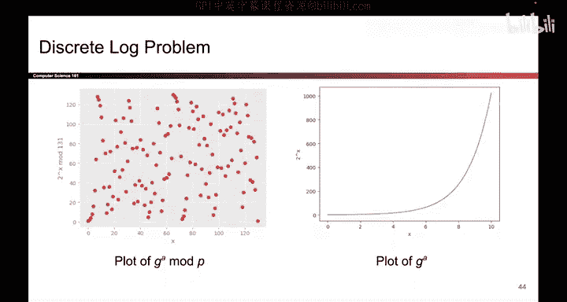
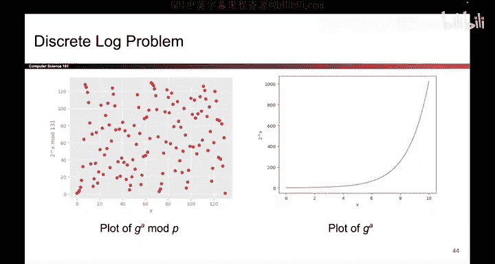
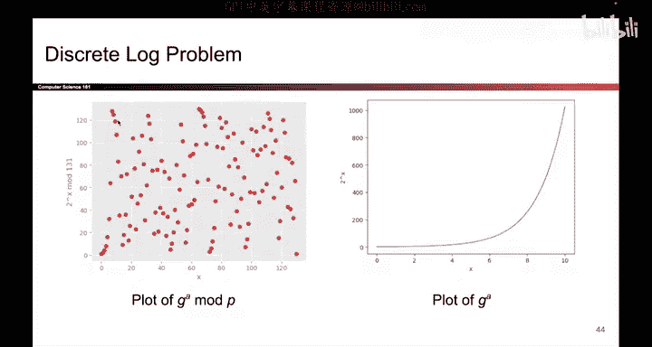
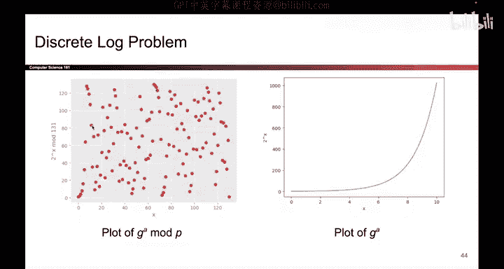

# 140：离散对数问题与Diffie-Hellman问题 🔐

在本节课中，我们将要学习两个核心的密码学难题：离散对数问题和Diffie-Hellman问题。它们是现代非对称加密和密钥交换协议（如Diffie-Hellman密钥交换）的数学基础。我们将通过简单的比喻和直观的图表来理解它们为何难以解决。

上一节我们介绍了“混合颜料”的比喻，本节中我们来看看其背后的数学原理。

## 离散对数问题

离散对数问题是密码学中的一个核心难题。它描述了一个在模运算下看似简单，实则极难逆向计算的过程。

首先，让我们描述一下这个问题是什么。所有人都知道一个大质数 **P** 和一个数字 **G**。技术上，这个数字 **G** 必须是模 **P** 下的一个“生成元”，但这对于我们的理解并非最关键。

问题是这样陈述的：所有人都知道数字 **G** 和 **P**。现在，如果我选择一个秘密数字 **a**，计算 **G^a mod P**，并把这个结果给你。对你来说，要找出我选择了哪个 **a** 值来计算这个结果是极其困难的。这就是离散对数问题：给定 **G^a mod P**，很难找到 **a**。

起初，这看起来可能有些矛盾，似乎你只需要取对数就能找到原始的 **a**。为了理解为什么离散对数问题如此困难，让我们看一些图片。

在右边的图中，我绘制了 **G^a**（没有取模 **P**）的曲线。如果我们不是在模运算的空间里工作，你说得对，解决这个问题会相当容易。如果我选择一个大的秘密 **a**，那么 **G^a** 也会很大，你就能告诉我我选择了多大的 **a** 值。例如，如果我选择了一个大的 **a** 值，我会输出这些大数字中的一个，你就能告诉我我一定选择了一个大的 **a** 值。如果我选择了一个小的 **a** 值，我会输出这些较小的值中的一个，你就能告诉我我选择了一个小的 **a** 值。

然而，如果我们在模 **P** 的空间里工作，即我们取所有这些数字并计算它们对 **P** 取模的结果，情况就突然变了。这个图不再有任何可识别的模式。如果我取一个小的 **a** 值并计算 **G^a mod P**，结果可能是一个大数字。或者，如果我取一个大数字并计算 **G^a mod P**，它也可能是一个大数字。又或者，如果我取一个中等大小的 **a** 值并计算 **G^a mod P**，它同样可能是一个大数字。所以，仅仅因为我告诉你一个大数字，并不意味着我选择的 **a** 是大、是小还是中等，这根本不清楚。

无论我告诉你 **G^a mod P** 的哪个值，你都很难从这个图中识别出任何能帮助你找到原始 **a** 值的模式。所以，如果我告诉你我计算了 **G^a mod P**，并且结果是这里的这个值（Y轴上的值），你无法知道我在X轴上为 **a** 选择了哪个值。它可能是一个大值，但也可能是这些较小的值之一，这并不明确。这就是离散对数问题，而这张图解释了它为何如此难以解决。

## Diffie-Hellman问题

离散对数问题有一个近亲，叫做Diffie-Hellman假设。同样在这个假设中，所有人都知道一些公共值 **G** 和 **P**。

现在将要发生的是：我将秘密选择两个值 **a** 和 **b**（你不知道），然后计算 **G^a mod P** 和 **G^b mod P**，并将这两个值呈现给你。Diffie-Hellman假设指出，你无法计算出 **G^(a*b) mod P**。如果我给你 **G^(a*b) mod P** 和一个随机数 **R**，你无法告诉我哪个是正确答案，哪个是随机值。

这个问题之所以困难的直觉在于：如果你想计算 **G^(a*b) mod P**，最好的方法是先计算出 **a**，然后用 **G^b** 的 **a** 次方来得到 **G^(a*b) mod P**。但当然，这样做是困难的，因为给定 **G^a mod P** 去得到原始的 **a** 就是在解决离散对数问题，而我们刚刚说过这非常困难。

所以，两者的区别非常微妙。你可以把离散对数问题和Diffie-Hellman假设看作是近亲。而这些问题的难度，正是为我们解锁“安全颜色共享”的数学版本的关键。

---

本节课中我们一起学习了离散对数问题和Diffie-Hellman问题。我们了解到，在模运算下，指数运算的结果会变得混乱无序，使得从结果逆向推导出指数变得极其困难。离散对数问题是直接寻找秘密指数 **a**，而Diffie-Hellman问题则是要求在已知 **G^a** 和 **G^b** 的情况下计算 **G^(a*b)**，其安全性同样依赖于离散对数问题的困难性。这两个难题构成了许多现代安全通信协议的基础。