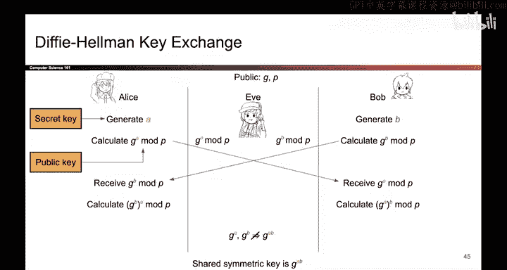
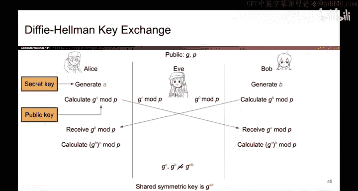

# 141：Diffie-Hellman密钥交换 🔑

在本节课中，我们将要学习Diffie-Hellman密钥交换协议。这是一种允许两个人在不安全的公开信道上安全地建立一个共享密钥的方法。其安全性基于我们上一节介绍的离散对数问题的计算困难性。

上一节我们介绍了离散对数问题，本节中我们来看看如何利用它来构建一个安全的密钥交换协议。

## 协议概述与公开参数

Diffie-Hellman密钥交换本质上是我们之前讨论过的“安全颜色混合”方案的数字版本，它使用离散对数问题来伪装交换过程中的秘密。

协议开始前，所有参与者（例如Alice、Bob和窃听者Eve）都知道一些公开的数值。这些参数包括：
*   一个大的质数 **P**
*   一个整数 **G**，它是模P下的一个原根

这些参数是公开的，任何人都可以知道。

## 生成与交换“伪装”的秘密

现在，Alice和Bob各自生成自己的一半秘密。

以下是他们各自的操作步骤：
*   **Alice** 生成一个私密的随机数 **A**。这是她的一半秘密。为了伪装这个秘密，她计算 `G^A mod P`，并将这个结果通过公开信道发送给Bob。
*   **Bob** 生成一个私密的随机数 **B**。这是他的一半秘密。同样，他计算 `G^B mod P`，并将这个结果通过公开信道发送给Alice。

此时，窃听者Eve可以观察到在信道上传输的两个值：`G^A mod P` 和 `G^B mod P`。

## 计算共享密钥

在收到对方发送的“伪装”秘密后，Alice和Bob可以分别计算出相同的共享密钥。

具体计算过程如下：
*   **Alice** 收到了Bob发来的 `G^B mod P`。她利用自己的私密数字A进行计算：`(G^B)^A mod P = G^(B*A) mod P`。
*   **Bob** 收到了Alice发来的 `G^A mod P`。他利用自己的私密数字B进行计算：`(G^A)^B mod P = G^(A*B) mod P`。

由于 `G^(A*B) mod P` 与 `G^(B*A) mod P` 的结果完全相同，因此Alice和Bob成功地获得了一个共享的秘密值，这个值可以作为他们后续通信的对称密钥。

## 安全性分析：为什么Eve无法获得密钥？

Diffie-Hellman密钥交换的安全性基于一个核心假设：给定 `G^A mod P` 和 `G^B mod P`，在计算上不可能推导出 `G^(A*B) mod P`。

其背后的原理是离散对数问题的困难性。如果Eve想要计算出共享密钥，她首先需要从 `G^A mod P` 中反推出A，或者从 `G^B mod P` 中反推出B，然后再进行计算。而求解A或B的过程正是困难的离散对数问题。

Eve也无法通过其他简单操作（如将两个公开值相乘）来获得密钥，因为：
`(G^A mod P) * (G^B mod P) = G^(A+B) mod P`
这与我们需要的 `G^(A*B) mod P` 完全不同。指数运算不满足这种线性关系。

## 总结

本节课中我们一起学习了Diffie-Hellman密钥交换协议。总结如下：
1.  该协议利用离散对数问题的计算困难性，允许Alice和Bob在不安全的信道上建立一个共享的秘密密钥。
2.  双方通过交换经过指数运算伪装的公开值，并利用各自的私密数进行计算，最终得到相同的共享密钥。
3.  窃听者Eve虽然能截获所有公开信息，但由于无法解决离散对数问题，她无法推导出Alice和Bob共享的那个秘密密钥。

这就是Diffie-Hellman密钥交换的完整故事。