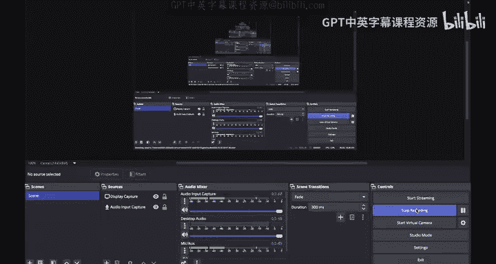

# 143：Diffie-Hellman中间人攻击 👥🔓

在本节课中，我们将要学习Diffie-Hellman密钥交换协议的一个关键弱点：中间人攻击。我们将详细拆解攻击者Mallory如何通过篡改通信消息，破坏Alice和Bob之间通信的机密性和完整性。

---

## 协议回顾与攻击场景

上一节我们介绍了Diffie-Hellman密钥交换的基本流程。本节中我们来看看，当存在一个能够篡改消息的攻击者Mallory时，协议的安全性如何被破坏。

Diffie-Hellman密钥交换对窃听者Eve是安全的，但我们尚未考虑攻击者Mallory。Mallory能够篡改我们传递的消息。事实证明，Mallory可以对Diffie-Hellman密钥交换发起一种攻击。

## 攻击过程详解

以下是Mallory实施中间人攻击的详细步骤：

1.  **Alice发起通信**
    Alice像往常一样生成她的私钥 `a`，计算 `g^a mod p` 并将其发送到通信信道。

2.  **Mallory拦截并篡改发给Bob的消息**
    正常情况下，该消息会被Bob接收。但由于Mallory的存在，她可以拦截该消息并将其替换为一个不同的值。具体来说，Mallory会将其替换为 `g^m mod p`。Mallory选择她自己的私钥 `m`，计算 `g^m mod p`，并将这个消息发送给Bob。因此，Bob期望收到 `g^a mod p`，但由于Mallory的篡改，他实际收到了 `g^m mod p`。

3.  **Mallory在相反方向进行同样的篡改**
    Bob生成私钥 `b`，计算 `g^b mod p` 并希望将其发送给Alice。然而，Mallory再次介入。她收到 `g^b mod p`，拦截它，将其替换为 `g^m mod p`，并将该值发送给Alice。因此，Alice期望收到 `g^b mod p`，但她实际收到了 `g^m mod p`。

4.  **Alice和Bob计算错误的共享密钥**
    Alice和Bob并不知道值已被篡改。他们如何区分 `g^b` 和 `g^m`？他们并不知道自己应该收到哪一个。因此，他们双方都感觉一切正常。
    *   Alice会将她收到的值（她以为是 `g^b`，但实际是 `g^m mod p`）进行 `a` 次幂运算，从而计算出 `g^(a*m) mod p`。这个值是不正确的，但这就是Alice推导出的密钥。
    *   同样，Bob会将他收到的值（他以为是 `g^a mod p`，但实际是 `g^m mod p`）进行 `b` 次幂运算，从而推导出 `g^(b*m) mod p`。这个值也是不正确的。

5.  **Mallory掌握双方密钥**
    Mallory导致Alice和Bob推导出了不同的秘密。更糟糕的是，Mallory自己可以推导出这两个秘密。
    查看Mallory知道的所有值：她知道 `m`（她自己选择的），她知道Alice发送的 `g^a mod p`，也知道Bob发送的 `g^b mod p`。利用这三个值，她可以推导出Alice和Bob推导出的秘密：
    *   她可以取 `g^a mod p`，用她自己的私钥 `m` 进行幂运算，从而推导出 `g^(a*m) mod p`，即Alice推导出的秘密。
    *   同样，她从Bob那里收到了 `g^b mod p`，她知道自己的秘密 `m`，因此可以推导出 `g^(b*m) mod p`，即Bob的秘密。

## 攻击后果

现在情况变得非常严重。Mallory成为了一个完全的中间人。

例如，如果Alice用她认为的共享密钥加密某条消息并发送给Bob，Mallory可以拦截它，用她知道的 `g^(a*m) mod p` 解密，随心所欲地篡改消息，然后用 `g^(b*m) mod p` 重新加密，再发送给Bob，而Bob对此一无所知。

然后，当Bob发送消息时，他会用 `g^(b*m) mod p` 加密，Mallory可以拦截、解密、阅读并任意修改。当她完成后，可以用 `g^(a*m) mod p` 加密，将这条被篡改的消息发送给Alice，而Alice也对此一无所知。

因此，Mallory现在拥有读取和修改Alice与Bob之间通信的全部能力，而Alice和Bob却毫不知情。

## 攻击的本质与协议缺陷

我们已经展示了存在一种攻击，使得能够篡改消息的Mallory可以破坏Diffie-Hellman的安全性，并破坏任何使用Diffie-Hellman生成密钥的方案的完整性和机密性。

所以，这是可以对Diffie-Hellman密钥交换实施的一种攻击。

Diffie-Hellman密钥交换的一个主要问题是，它无法抵御使用刚才所见的攻击的中间人对手。换一种方式表述同一点：**Diffie-Hellman不提供身份认证**。

换句话说，你成功地与某人完成了一次交换，但你并不知道你是与谁完成的交换。

以另一种等价的方式来看我们之前看到的图示：这里发生了两次成功的Diffie-Hellman密钥交换。
*   Alice进行了一次密钥交换。她以为她是和Bob进行的，但实际上，Mallory介入了。Alice和Mallory完成了一次成功的交换，双方都知道了秘密 `g^(a*m) mod p`。所以Alice确实成功进行了一次密钥交换，只是她以为对象是Bob，而实际对象是Mallory。
*   同样，Bob以为他成功地与Alice进行了一次密钥交换，但实际上，他与Mallory完成了一次成功的密钥交换，因为Bob和Mallory现在共享密钥 `g^(b*m) mod p`。

因此，看待这张图的另一种方式是：发生了两次成功的密钥交换，但它们不是发生在Alice和Bob之间，而是发生在Alice与Mallory、以及Mallory与Bob之间，因为Mallory介入了他们中间。

这就是当我们说Diffie-Hellman不提供身份认证时的含义：你不知道你是在与Bob交换密钥，还是Mallory已经介入，导致你实际上是在与Mallory交换密钥。

## Diffie-Hellman的其他限制

Diffie-Hellman的另一个问题是它是一个**主动协议**。Alice和Bob需要同时在线。他们需要主动交换 `g^a mod p` 和 `g^b mod p` 才能推导出共享秘密。如果只有一方在线，则无法推导出共享秘密。

因此，在Alice当前不在线（例如在度假、小睡）而Bob想要加密某些内容并发送给Alice供其稍后阅读的场景中，Diffie-Hellman无法支持此类操作。我们必须设计一些不同的方案来支持双方不同时在线的通信。

---

## 总结

本节课中我们一起学习了Diffie-Hellman密钥交换协议的中间人攻击。我们了解到：
1.  攻击者Mallory可以通过拦截并替换通信双方交换的公开参数（`g^a mod p` 和 `g^b mod p`），使双方分别与她建立不同的共享密钥。
2.  由于Mallory知道所有中间值，她能够解密双方发送的任何加密消息，并进行读取和篡改。
3.  该攻击的根本原因在于**Diffie-Hellman协议本身缺乏身份认证机制**，无法确保通信对象的真实性。
4.  此外，Diffie-Hellman是一个需要双方同时在线的主动协议，这限制了其在异步场景下的应用。

为了解决这些安全问题，在实际应用中，Diffie-Hellman通常需要与数字签名等身份认证技术结合使用（例如在TLS/SSL协议中），以抵御中间人攻击并确认通信双方的身份。