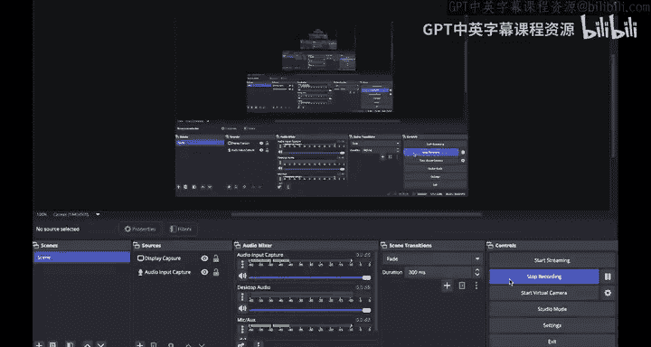
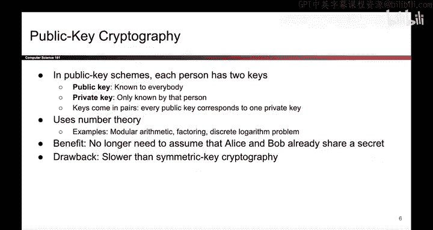

# 145：公钥密码学入门 🗝️

在本节课中，我们将学习公钥密码学的基本概念。我们将回顾伪随机数生成器和Diffie-Hellman密钥交换，然后重点介绍公钥密码学的核心思想、其组成部分以及它与对称密钥密码学的区别。

## 回顾：伪随机数生成器与Diffie-Hellman密钥交换

上一节我们介绍了伪随机数生成器（PRNG）。由于真正的随机性代价高昂，我们设计了PRNG算法。该算法输入少量真正的随机性，能够高效生成大量看似随机的输出。从攻击者的角度来看，当PRNG的输出在计算上与真正的随机比特无法区分时，它就是安全的。我们展示了PRNG的几种不同构造方法，例如基于HMAC的构造。

在上一节的后半部分，我们讨论了Diffie-Hellman密钥交换。Alice选择她的秘密部分A，将其伪装成 `G^A mod P` 发送给Bob。Bob选择他的秘密部分B，将其伪装成 `G^B mod P` 发送给Alice。双方收到对方伪装的秘密后，用自己持有的秘密指数进行计算，最终双方都能推导出共享密钥 `G^(A*B) mod P`。离散对数问题确保了像Eve这样的攻击者无法推导出共享密钥。

然而，Diffie-Hellman密钥交换存在一些问题。它无法抵抗中间人攻击，不提供真实性。我们在演示Mallory的攻击时展示了这一点，Mallory能让Alice和Bob推导出不同的密钥，并且这些密钥Mallory都知道。另一个问题是，双方必须同时在线。

## 公钥密码学概述

本节我们将探讨公钥密码学。观察我们的密码学路线图，我们现在位于表格的右侧部分。我们将研究使用非对称密钥模型的方案。其中一些方案提供机密性，另一些则提供完整性和身份验证。

在所有我们将看到的公钥密码学方案中，每个人都拥有两个密钥，它们构成一个关联对。每个人都拥有一个众所周知的公钥和一个只有自己知道的私钥。密钥成对出现，每个公钥恰好对应一个私钥，不能互换。每个人都只拥有一对密钥。

公钥密码学的许多方案涉及大量数论知识，例如模运算、大数分解以及我们上次提到的离散对数问题。公钥密码学的一个好处是，我们不再需要假设Alice和Bob事先神奇地共享了一个秘密。仅使用每个人的公钥和私钥，这些方案就能工作。

然而，公钥密码学的一个主要缺点是它比对称密钥密码学慢得多。回想一下，在对称密钥密码学中，我们只是对比特进行混洗，这是计算机非常擅长的事情。相比之下，在公钥密码学中，我们使用了所有这些花哨的数论知识，这些你可能在CS70课程中见过。我不知道你怎么想，但我从未完成过任何一次CS70考试，我总是时间不够用。所以，这或许表明，与对称密钥密码学相比，数论运算相当慢。

## 总结

本节课我们一起回顾了伪随机数生成器和Diffie-Hellman密钥交换的机制与局限。随后，我们重点学习了公钥密码学的核心模型，即每个人都拥有一对关联的公钥和私钥。我们了解到公钥密码学基于复杂的数论问题，其优势在于无需预先共享秘密，但代价是计算速度远慢于对称密钥密码学。