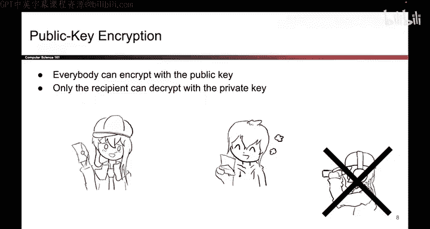
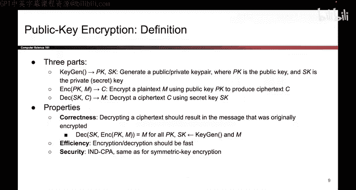

# 146：公钥加密

在本节课中，我们将学习公钥加密方案。公钥加密方案提供机密性，但不提供完整性或真实性。这些方案的运作方式是：任何人都可以加密消息，但只有接收者才能使用其私钥解密。

## 概述

公钥加密是一种允许任何人使用接收者的公钥加密消息，但只有拥有对应私钥的接收者才能解密的加密方法。它解决了对称加密中密钥分发的问题。

## 公钥加密的工作原理

上一节我们介绍了公钥加密的基本概念，本节中我们来看看其具体的工作方式。

任何人想要发送消息给我，都可以使用我的公钥来加密要发送给我的消息。然而，唯一能够解密这些消息的人是我，即消息的接收者，因为解密消息需要使用私钥。当消息被加密后，希望像Eve这样的窃听者无法弄清楚消息的内容。

## 公钥加密的形式化定义

更正式地，我们可以将公钥加密定义为需要实现的三个不同函数。

以下是构成公钥加密方案的三个核心算法：

1.  **密钥生成算法 (Key Generation)**：如果有人想要一个公钥-私钥对，你需要描述如何生成这些密钥。这里我们使用 `SK` 来表示私钥（因为“公钥”和“私钥”的英文首字母相同，我们使用不同的缩写，用 `SK` 表示私钥）。这个细节不重要，只是我们采用的一种表示方式。
2.  **加密算法 (Encryption)**：一旦有了密钥，任何人都可以加密消息。加密算法输入一个公钥 `PK` 和一个消息 `M`，输出一个密文 `C`。因为输入是公钥，所以任何人都能够加密消息。
3.  **解密算法 (Decryption)**：另一方面，解密方法输入一个私钥 `SK` 和密文 `C`，输出原始消息 `M`。因为解密函数输入的是私钥，这意味着只有消息的接收者，即拥有私钥的人，才能解密消息。

## 公钥加密方案的要求

了解了基本构成后，我们来看看一个好的公钥加密方案需要满足哪些要求。

一个好的公钥加密方案应该是**正确**的。所谓正确性，是指如果有人用公钥加密一条消息，我们用对应的私钥解密它（请记住，密钥是成对生成的，当你生成一个密钥对时，你会得到一对密钥），那么你应该总是能取回原始消息。

公钥加密应该是**相对高效**的。我们不会正式定义这意味着什么，但它应该花费合理的时间。

其**安全定义**是 **IND-CPA**（选择明文攻击下的不可区分性），这与对称密钥加密方案的安全定义相同。

## 总结

本节课中我们一起学习了公钥加密。我们了解到公钥加密通过使用一对数学上相关的密钥（公钥和私钥）来提供机密性。公钥可以公开分享用于加密，而私钥必须由接收者秘密保存用于解密。一个好的方案需要满足正确性、效率，并达到IND-CPA的安全标准。这为在不安全信道上的安全通信奠定了基础。