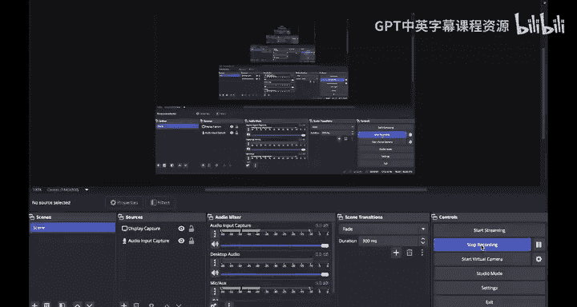
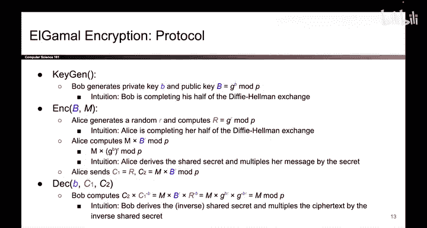

# 147：ElGamal 加密方案 🧮



在本节课中，我们将要学习第一个公钥加密方案——ElGamal 加密。我们将看到它如何解决Diffie-Hellman密钥交换的两个主要问题，并允许在接收方离线时发送加密消息。

## 概述与背景

上一节我们介绍了公钥密码学的概念，本节中我们来看看ElGamal加密方案的具体实现。

ElGamal加密方案受到Diffie-Hellman密钥交换的启发。Diffie-Hellman允许Alice和Bob在不安全的信道上共享一个秘密，但它存在两个问题。首先，Diffie-Hellman本身不传输消息，它只生成一个共享秘密值 `G^(AB) mod P`。其次，它要求通信双方必须同时在线。ElGamal加密旨在解决这两个问题，它支持直接加密和解密消息，并且允许接收方（Bob）离线。

## 密钥生成 🔑

以下是Bob生成密钥对的步骤：

1.  Bob选择一个随机数作为私钥：`b`（一个随机整数）。
2.  Bob计算对应的公钥：`B = G^b mod P`。

至此，Bob生成了一个密钥对：私钥 `b` 由自己秘密保存，公钥 `B` 则公开给所有人。这本质上就是Bob预先完成了Diffie-Hellman密钥交换中他自己那一半的计算。

## 加密过程 🔒

现在，假设Bob正在离线“睡觉”。Alice如何加密消息并发送给他呢？

以下是Alice加密消息 `M` 的步骤：

1.  Alice生成一个随机数：`r`。
2.  Alice计算 `R = G^r mod P`。这相当于Alice完成了Diffie-Hellman密钥交换中她自己那一半的计算。
3.  利用Bob的公钥 `B` 和自己的随机数 `r`，Alice可以推导出共享秘密：`S = B^r mod P = G^(br) mod P`。
4.  Alice使用这个共享秘密来加密消息。加密操作是乘法：`C2 = M * S mod P`。
5.  Alice将密文发送给Bob。密文由两部分组成：`(R, C2)`。其中 `R` 是Alice的临时公钥，`C2` 是加密后的消息。

整个过程可以在Bob离线的情况下完成。

## 解密过程 🔓

最终，Bob醒来并收到了密文 `(R, C2)`。他需要解密以获取原始消息 `M`。

以下是Bob解密的步骤：

1.  为了解密，Bob需要“撤销”Alice的加密操作。Alice将消息乘以了共享秘密 `S = G^(br)`。要恢复消息，Bob需要乘以 `S` 的模逆元，即 `S^{-1} = G^(-br) mod P`。
2.  Bob利用自己的私钥 `b` 和收到的 `R` 来计算这个逆共享秘密：`S^{-1} = R^{-b} mod P = G^(-br) mod P`。
3.  得到逆共享秘密后，Bob将其与密文 `C2` 相乘：`M = C2 * S^{-1} mod P = (M * G^(br)) * G^(-br) mod P = M mod P`。

这样，共享秘密与其逆元相互抵消，Bob就成功恢复出了原始消息 `M`。

## 核心公式与代码描述

以下是ElGamal加密方案的核心数学描述：

*   **密钥生成**：
    *   私钥：`sk = b` (随机整数)
    *   公钥：`pk = B = G^b mod P`
*   **加密** (输入：消息 `M`, 公钥 `B`)：
    1.  选择随机数 `r`
    2.  计算 `R = G^r mod P`
    3.  计算共享秘密 `S = B^r mod P = G^(b*r) mod P`
    4.  计算密文 `C2 = M * S mod P`
    5.  输出密文 `(R, C2)`
*   **解密** (输入：密文 `(R, C2)`, 私钥 `b`)：
    1.  计算逆共享秘密 `S^{-1} = R^{-b} mod P = G^(-b*r) mod P`
    2.  恢复消息 `M = C2 * S^{-1} mod P`

用伪代码表示如下：
```python
# 密钥生成
sk = random_int()          # 私钥 b
pk = pow(G, sk, P)        # 公钥 B

# 加密
def encrypt(M, pk):
    r = random_int()
    R = pow(G, r, P)
    S = pow(pk, r, P)     # 共享秘密 S = B^r
    C2 = (M * S) % P
    return (R, C2)

# 解密
def decrypt(ciphertext, sk):
    R, C2 = ciphertext
    S_inv = pow(R, -sk, P) # 逆共享秘密 S^{-1} = R^{-b}
    M = (C2 * S_inv) % P
    return M
```

## 总结



本节课中我们一起学习了ElGamal公钥加密方案。我们了解到，ElGamal本质上是Diffie-Hellman密钥交换的一种变体，通过调整操作顺序并引入乘法加密，实现了两个重要改进：**支持直接加密任意消息**，以及**允许接收方离线**。发送方（Alice）利用接收方（Bob）预先发布的公钥完成“半次”密钥交换并加密消息；接收方随后使用自己的私钥完成另“半次”交换，计算出逆共享秘密来解密密文。这个方案清晰地展示了如何将密钥交换协议转化为一个完整的公钥加密系统。