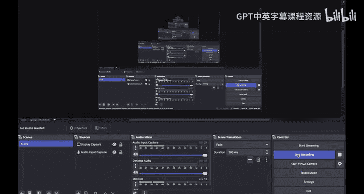
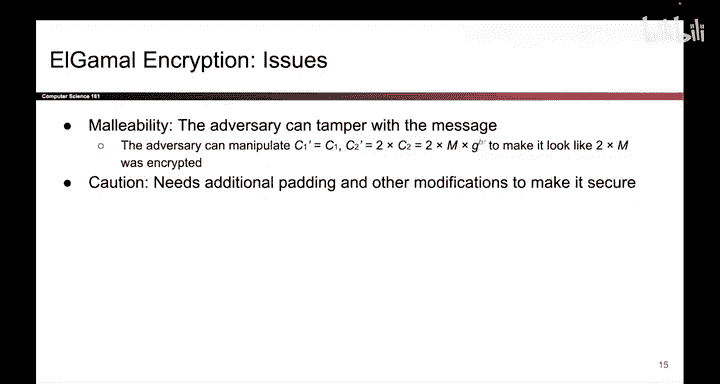

# 148：ElGamal加密的安全性、可延展性与局限性 🔐



在本节课中，我们将要学习ElGamal加密方案的安全性基础、其存在的可延展性攻击漏洞，以及该方案在更高级安全定义下的局限性。

---

## 安全性论证：基于Diffie-Hellman问题

上一节我们介绍了ElGamal加密的流程，本节中我们来看看其安全性的理论基础。ElGamal加密的安全性论证与Diffie-Hellman密钥交换的安全性论证非常相似，这很合理，因为ElGamal加密正是基于Diffie-Hellman密钥交换构建的。

Diffie-Hellman密钥交换的安全性依赖于Diffie-Hellman问题，而该问题本身又基于离散对数问题的困难性。Diffie-Hellman问题描述如下：

**公式：**
给定 `g^a mod p` 和 `g^b mod p`，计算 `g^(ab) mod p` 是困难的。

我们假设这个问题是成立的，因为离散对数问题本身是困难的，目前除了求解离散对数外，尚未发现解决此问题的有效方法。

在ElGamal加密中，攻击者Eve可以在不安全的信道上看到以下值：
1.  Bob的公钥 `B = g^b mod p`（公开给所有人）。
2.  Alice发送的密文，它包含两个部分：
    *   `R = g^r mod p`（用于完成Diffie-Hellman密钥交换）。
    *   `C2 = M * (g^(br) mod p)`（用共享密钥加密的消息）。

**代码表示：**
```
B = pow(g, b, p)      # Bob的公钥
R = pow(g, r, p)      # 密文第一部分
C2 = M * pow(g, b*r, p) % p  # 密文第二部分
```

观察 `R = g^r mod p` 和 `B = g^b mod p`，这正是Diffie-Hellman问题中给出的两个值。根据Diffie-Hellman问题的假设，即使Eve知道这两个值，她也无法计算出共享秘密 `g^(br) mod p`。

由于Eve无法推导出 `g^(br) mod p`，她就无法逆转加密过程来获取原始消息 `M`。如果她想得到 `M`，就需要将 `C2` 乘以 `g^(-br) mod p`，但她并不知道这个值。因此，窃听者Eve无法在ElGamal加密中恢复原始消息。这并非一个严格的证明，但解释了ElGamal加密提供机密性的直观原因。

---

## 可延展性攻击：缺乏完整性的证明

虽然ElGamal加密提供了机密性，但它**不提供完整性**。攻击者可以对ElGamal加密实施一种名为“可延展性”的攻击。

在这种攻击中，中间人攻击者Mallory可以篡改消息，导致Bob解密出一个可预测的、被修改过的消息。这是一个微妙的概念，让我们通过一个例子来理解。

假设Mallory看到一段密文，她并不知道密文的具体内容。但基于可延展性攻击，她能够以某种可预测的方式修改这段密文，使得Bob解密出的消息也以某种可预测的方式被改变。

例如，如果攻击的目的是使解密后的消息值翻倍，那么这意味着：
*   如果Alice发送的消息是数字25，Mallory执行攻击后，Bob解密会看到50。
*   如果Alice的原始消息是70，Bob解密后会看到140。

无论Alice发送的原始值是什么，也无论Mallory是否知道密文内容，她都能执行攻击，使得Bob解密出的数字总是原始值的两倍。这就是可延展性攻击：即使不知道密文，也能使Bob获得一个可预测的、被修改过的消息。

---

## 攻击演示：如何使消息翻倍

了解了攻击的概念后，我们具体看看Mallory是如何实现让消息翻倍的。

回顾ElGamal加密方案，Alice发送的密文是两个值 `(R, C2)`，其中 `C2 = M * (g^(br) mod p)`。

以下是Mallory的攻击步骤：

1.  Mallory拦截密文 `(R, C2)`。
2.  她将密文的第二部分 `C2` 替换为 `2 * C2`（即将其值翻倍）。
3.  她将篡改后的密文 `(R, 2*C2)` 转发给Bob。

当Bob解密时，他会计算：
```
解密结果 = (2 * C2) * (R^{-b} mod p) mod p
        = 2 * [M * (g^(br) mod p)] * (g^{-br} mod p) mod p
        = 2 * M mod p
```

**公式推导：**
`Decrypt(R, 2*C2) = 2 * C2 * R^{-b} = 2 * M * g^{br} * g^{-br} = 2 * M`

因此，Bob最终解密得到的是 `2 * M`，即原始消息的两倍。所以，ElGamal加密容易受到这种可延展性攻击，攻击者只需修改密文的第二部分，就能可预测地改变解密后的消息内容。

---

## 重要警告：IND-CPA安全性

最后需要强调的一个重要警告是：我们目前所展示的ElGamal加密方案，**实际上并不具备IND-CPA（在选择明文攻击下的不可区分性）安全性**。

我们之前没有讨论的一些非常微妙的细节，导致我们展示的这个基础方案并不完全安全。如果你希望ElGamal加密达到IND-CPA安全级别，必须添加一些额外的、我们在此不会深入讨论的修正措施。

因此，请记住：我们展示的基础ElGamal方案并非IND-CPA安全的，但经过适当修改后，它可以被增强以达到该安全标准。

---

## 总结

本节课中我们一起学习了：
1.  **ElGamal加密的安全性**：其机密性基于Diffie-Hellman问题的困难性，攻击者无法从公钥和密文中计算出共享秘密。
2.  **可延展性攻击**：ElGamal加密不提供消息完整性。攻击者可以在不知道明文的情况下篡改密文，使接收方解密出一个可预测的、被修改的值（例如原始值的两倍）。
3.  **方案的局限性**：基础的ElGamal加密方案不具备IND-CPA安全性，需要额外的修正才能满足更高级别的安全定义。



理解这些安全属性和局限性，对于在实际应用中正确、安全地使用加密方案至关重要。