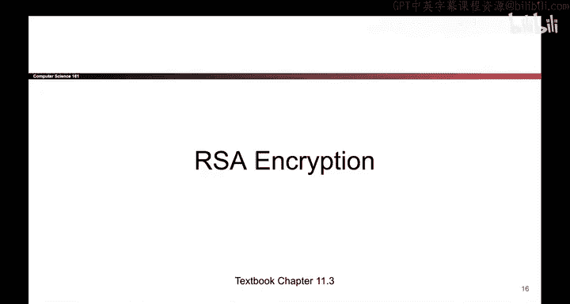
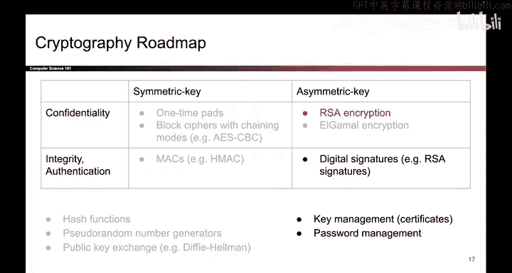
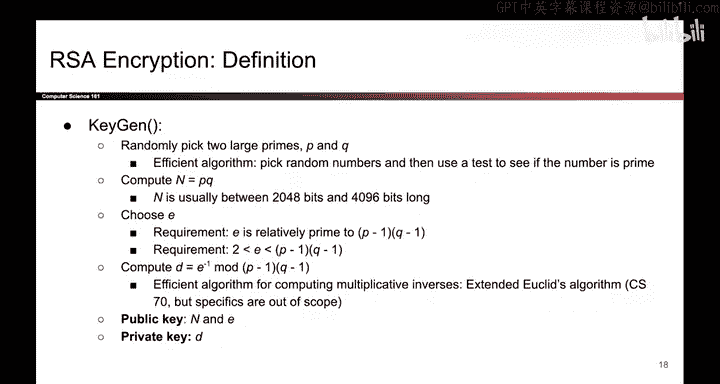

# 149：RSA加密算法 🧮





在本节课中，我们将学习第二种公钥加密方案——RSA加密。我们将了解其密钥生成、加密和解密过程，并探讨其背后的数学原理，确保初学者也能理解这一经典算法的工作原理。

---

## 密钥生成 🔑

上一节我们介绍了公钥加密的基本概念，本节中我们来看看RSA加密的具体实现。首先，我们需要生成一对密钥：公钥和私钥。

以下是生成RSA密钥的步骤：

1.  **选择两个大质数**：随机选取两个大质数 `P` 和 `Q`。在实际操作中，可以通过随机选取大数并使用高效的素性测试来完成。
2.  **计算模数 n**：计算 `n = P * Q`。通常 `P` 和 `Q` 足够大，使得 `n` 的长度在2000到4000比特之间。
3.  **选择公钥指数 e**：选择一个整数 `e`，它必须与 `(P-1)*(Q-1)` 互质（即最大公约数为1）。`e` 不能等于 `(P-1)*(Q-1)`、`1` 或 `0`。
4.  **计算私钥指数 d**：计算 `d`，使其满足 `d ≡ e^{-1} mod (P-1)*(Q-1)`。`d` 是 `e` 在模 `(P-1)*(Q-1)` 下的乘法逆元，可以使用扩展欧几里得算法高效计算。

完成计算后，**公钥** 是数字对 `(n, e)`，需要公开。**私钥** 是数字 `d`，必须严格保密。

---

## 加密与解密过程 🔐

现在我们已经生成了密钥，接下来看看如何使用它们进行加密和解密。这个过程比密钥生成更直观。

**加密算法** 接收公钥 `(e, n)` 和明文消息 `M`，然后计算密文 `C`：
```
C ≡ M^e mod n
```
**解密算法** 接收私钥 `d` 和密文 `C`，然后计算还原的明文：
```
M ≡ C^d mod n
```
简单来说，加密是进行 `e` 次方运算（`e` 代表加密），解密是进行 `d` 次方运算（`d` 代表解密）。



---

## 正确性证明 📐

前面的定义可能显得有些神秘。为了证明RSA加密确实有效，我们需要证明：对任何消息 `M`，先加密再解密总能得到原始消息。

也就是说，我们需要证明：
```
(M^e mod n)^d mod n = M
```
根据加密和解密公式，这等价于证明：
```
M^{e*d} mod n = M
```
由于我们在密钥生成时确保了 `d` 是 `e` 模 `(P-1)*(Q-1)` 的逆元，即 `e*d ≡ 1 mod (P-1)*(Q-1)`，根据欧拉定理和数论原理，可以推导出上述等式成立。这确保了RSA加解密的正确性。

---


本节课中我们一起学习了RSA加密算法。我们了解了其密钥生成的详细步骤，包括选择质数、计算模数和指数。我们明确了加密和解密的数学操作，并理解了其正确性所依赖的数论基础。RSA是当今广泛使用的公钥加密算法，理解其原理是掌握现代密码学的关键一步。