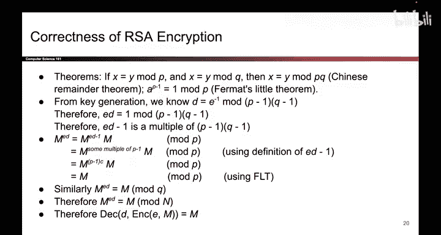

# 150：RSA正确性证明 🔐

在本节课中，我们将学习RSA加密算法为何正确的证明。这是一个包含较多数学推导的过程，但我们会一步步拆解，确保初学者也能理解。

## 概述 📋

RSA加密的正确性证明，核心在于证明：对于任意消息 `M`，先进行加密运算 `M^E mod N`，再进行解密运算 `(M^E)^D mod N`，最终能得到原始消息 `M`。我们将借助一些已知的数论定理来完成这个证明。

## 预备知识 📚

在开始证明前，我们需要接受两个已证明的数论定理作为事实。这些定理通常在离散数学课程中学习，我们在此直接使用。

**定理一：中国剩余定理的推论**
如果一个数 `X` 满足：
*   `X ≡ y (mod P)`
*   `X ≡ y (mod Q)`
那么，这个数 `X` 也必然满足：
*   `X ≡ y (mod P*Q)`
其中 `P` 和 `Q` 是互质的素数。在RSA中，`N = P*Q`。

**定理二：费马小定理**
如果 `P` 是一个素数，那么对于任意整数 `a`（`a` 不是 `P` 的倍数），有：
*   `a^(P-1) ≡ 1 (mod P)`
在RSA中，我们使用的 `P` 和 `Q` 都是大素数。

## 密钥关系的推导 🔑

上一节我们介绍了两个核心定理，本节中我们来看看RSA公钥 `(E, N)` 和私钥 `(D, N)` 之间定义的关系如何为我们提供证明的关键线索。

RSA私钥指数 `D` 被定义为公钥指数 `E` 在模 `(P-1)(Q-1)` 下的乘法逆元。这意味着：

*   `E * D ≡ 1 (mod (P-1)(Q-1))`

根据模运算的定义，上式等价于：

*   `E * D - 1 = k * (P-1)(Q-1)`，其中 `k` 是某个整数。

这个等式表明，`(E*D - 1)` 是 `(P-1)(Q-1)` 的整数倍。这个结论将是后续证明的基石。

## 证明策略 🧠

我们已经掌握了定理和密钥关系，现在可以规划证明路线。我们的目标是证明 `(M^E mod N)^D mod N = M`，即 `M^(E*D) mod N = M`。

直接证明 `mod N` 比较困难，因为我们的定理和推导关系主要涉及 `P` 和 `Q`。因此，我们采用分而治之的策略：
1.  首先证明 `M^(E*D) ≡ M (mod P)`。
2.  接着证明 `M^(E*D) ≡ M (mod Q)`。
3.  最后，利用**定理一（中国剩余定理推论）**，由以上两点得出结论：`M^(E*D) ≡ M (mod N)`。

## 证明步骤详解（模 P）➗

现在，让我们执行证明策略的第一步：在模 `P` 的世界里进行推导。

我们从目标式 `M^(E*D) mod P` 开始。

**步骤 1：拆分指数**
利用指数运算法则 `a^(b+c) = a^b * a^c`，我们可以将表达式重写：
*   `M^(E*D) = M^((E*D - 1) + 1) = M^(E*D - 1) * M`

**步骤 2：代入密钥关系**
根据上一节的推导，我们知道 `(E*D - 1)` 是 `(P-1)(Q-1)` 的倍数，因此也必然是 `(P-1)` 的倍数。我们可以将其表示为：
*   `E*D - 1 = (P-1) * t`，其中 `t` 是某个整数（`t = k*(Q-1)`）。
代入上式：
*   `M^(E*D) mod P = M^((P-1)*t) * M mod P`

**步骤 3：应用费马小定理**
根据**定理二（费马小定理）**，对于素数 `P`，有 `M^(P-1) ≡ 1 (mod P)`。
因此：
*   `M^((P-1)*t) mod P = [M^(P-1)]^t mod P = 1^t mod P = 1`

**步骤 4：得出结论**
将结果代回：
*   `M^(E*D) mod P = 1 * M mod P = M mod P`
至此，我们成功证明了 `M^(E*D) ≡ M (mod P)`。

## 证明步骤详解（模 Q）➗

上一节我们在模 `P` 下完成了证明，本节中我们以完全相同的逻辑处理模 `Q` 的情况。过程是对称的。

**步骤 1：拆分指数**
*   `M^(E*D) = M^(E*D - 1) * M`

**步骤 2：代入密钥关系**
由于 `(E*D - 1)` 也是 `(Q-1)` 的倍数，可表示为：
*   `E*D - 1 = (Q-1) * s`，其中 `s` 是某个整数。
代入：
*   `M^(E*D) mod Q = M^((Q-1)*s) * M mod Q`

**步骤 3：应用费马小定理**
对素数 `Q` 应用费马小定理：`M^(Q-1) ≡ 1 (mod Q)`。
因此：
*   `M^((Q-1)*s) mod Q = [M^(Q-1)]^s mod Q = 1^s mod Q = 1`

**步骤 4：得出结论**
*   `M^(E*D) mod Q = 1 * M mod Q = M mod Q`
我们证明了 `M^(E*D) ≡ M (mod Q)`。

## 最终整合与结论 🎯

我们已经分别证明了以下两个同余式成立：
*   `M^(E*D) ≡ M (mod P)`
*   `M^(E*D) ≡ M (mod Q)`

现在，应用我们在开头介绍的**定理一（中国剩余定理推论）**。因为 `M^(E*D)` 和 `M` 这两个数，在模 `P` 和模 `Q` 下都同余，那么在它们模 `P` 和 `Q` 的乘积 `N` 下也必然同余。即：

*   `M^(E*D) ≡ M (mod N)`

这正是我们需要证明的结论：`(M^E mod N)^D mod N = M`。因此，RSA的加密和解密过程是正确的，能够完好地恢复原始消息。

## 总结 📝

本节课中我们一起学习了RSA加密算法的正确性证明。我们回顾一下核心步骤：
1.  **利用定义**：从私钥 `D` 是 `E` 模 `(P-1)(Q-1)` 的逆元出发，得到关键等式 `E*D - 1 = k*(P-1)(Q-1)`。
2.  **分而治之**：分别证明在模 `P` 和模 `Q` 下，`M^(E*D)` 都等于 `M`。证明中核心用到了**费马小定理**。
3.  **合二为一**：利用**中国剩余定理的推论**，将模 `P` 和模 `Q` 下的结论合并，最终得到在模 `N` 下 `M^(E*D) ≡ M`，从而完成证明。

这个证明虽然涉及一些数学推导，但逻辑链条清晰，展示了RSA算法背后优雅而坚实的数学基础。