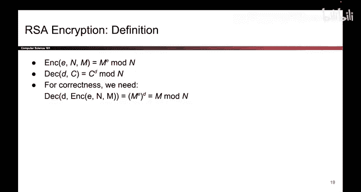
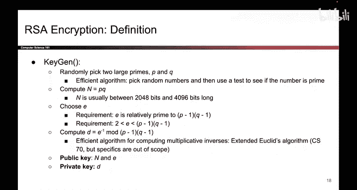

# 152：混合加密

在本节课中，我们将要学习混合加密的概念。这是一种结合了公钥加密和对称加密优势的技术，旨在解决公钥加密在处理速度和消息长度上的限制。

## 公钥加密的优势与挑战

上一节我们介绍了公钥加密方案。公钥加密非常出色，它允许爱丽丝和鲍勃在没有共享密钥的情况下进行安全通信。

然而，公钥加密也存在一些问题。第一个问题是速度慢。我们之前讨论过，公钥加密涉及的操作，如模幂运算、大素数乘法或选择大素数，都远比对称加密中的位移或异或等操作要慢得多。

第二个问题，我们之前没有明确指出，但在此需要强调的是，公钥加密只能加密**小消息**。为了理解原因，让我们回顾一下这些方案的定义方式。

以下是具体分析：

*   **ElGamal加密的限制**：在ElGamal加密中，消息被定义为模 `p` 下的值。这意味着你只能加密 `0` 到 `p-1` 之间的消息。如果你尝试加密更大的消息，鲍勃解密时会产生歧义。因为爱丽丝加密 `M`、`M + p`、`M + 2p` 等消息时，鲍勃解密后都会得到 `M mod p`。这些消息在模 `p` 下是等价的，无法确定爱丽丝原本想发送的是哪一个。因此，爱丽丝能发送的消息被限制在 `0` 到 `p-1` 之间的数字。

*   **RSA加密的限制**：RSA加密存在同样的问题。消息被定义为模 `n` 下的值，这意味着所有发送的消息必须在 `0` 到 `n-1` 之间。由于 `n` 是一个2000到4000比特的数字，这意味着爱丽丝发送的消息最多只能有几千比特。同样，ElGamal中的消息也被限制在几千比特以内。这对于大量数据来说是不够的，这是公钥密码学的一个主要问题：你无法一次性加密大量数据。

## 混合加密的解决方案

为了解决上述问题，我们可以使用一种称为**混合加密**的技术。它试图同时获得公钥加密和对称加密的好处。

其工作原理如下：当爱丽丝想给鲍勃发送消息时，她首先生成一个对称密钥 `K`。她使用公钥加密来加密这个密钥 `K`，这是可行的，因为 `K` 本身是一个很小的值。然后，她将这个加密后的密钥发送给鲍勃。

接下来，她使用对称密钥 `K` 来快速加密她真正想要发送的长消息。这一步利用了对称加密速度快的优势。最后，她将加密后的消息发送给鲍勃。

当鲍勃收到消息时，他收到两部分内容。首先，他收到加密的密钥。他使用公钥密码学来解密，得到对称密钥 `K`。一旦他拥有了对称密钥 `K`，他就可以用它来快速解密爱丽丝发送的原始长消息。

整个过程分为两步：
1.  使用公钥加密来加密一个对称密钥。
2.  使用对称密钥来加密消息本身。

鲍勃解密时，先使用公钥解密得到对称密钥 `K`，然后用 `K` 解密整个消息。这就是混合加密。

## 总结

本节课中，我们一起学习了混合加密。我们了解到，公钥加密虽然解决了密钥分发问题，但在速度和消息长度上存在限制。混合加密巧妙地结合了两种技术的优点：它使用公钥加密来安全地传输一个小的对称密钥，然后利用对称加密的高效性来加密实际的长消息。这种方法既保证了安全性，又实现了高效的大数据加密，是现代许多密码系统的实际应用方式。