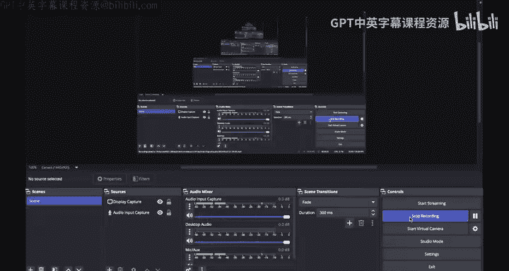
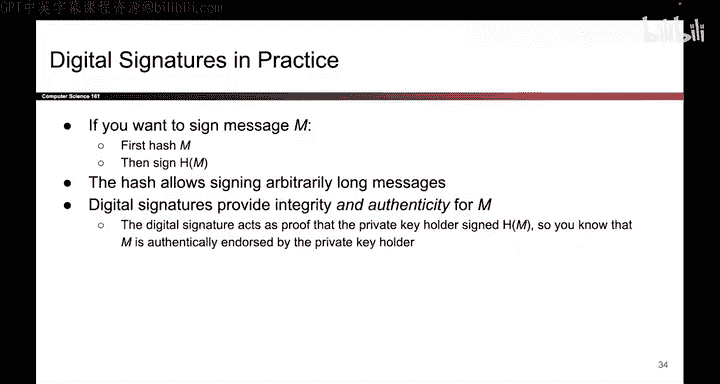

# 153：数字签名 - 定义 📜

在本节课中，我们将要学习数字签名的基本概念。数字签名是公钥密码学的一个重要应用，它能够提供信息的完整性和认证性，而无需通信双方预先共享密钥。

---

上一节我们介绍了公钥密码学的整体框架，本节中我们来看看数字签名的具体定义和工作原理。

数字签名的工作方式都遵循一个相似的流程。如果我想发送一条消息，我会用我的**私钥**对其进行签名。这意味着只有我知道私钥，因此只有我能为这条消息生成签名。当我将消息和签名一起发送出去后，任何人都可以使用我对应的**公钥**来验证消息是否被篡改。签名应具备这样的特性：如果消息在传输中被篡改，或者签名本身被篡改，那么当验证者使用公钥进行验证时，验证算法会输出“否”，表明签名无效。

更正式地说，一个数字签名方案由三个算法定义。

以下是构成数字签名方案的三个核心算法：

1.  **密钥生成算法**：`(pk, sk) <- Gen()`。当用户需要一个密钥对时，此算法会生成一对公钥 `pk` 和对应的私钥 `sk`。
2.  **签名算法**：`σ <- Sign(sk, m)`。此算法使用私钥 `sk` 对消息 `m` 进行签名，并输出签名 `σ`。
3.  **验证算法**：`b <- Verify(pk, m, σ)`。此算法使用公钥 `pk`、消息 `m` 和签名 `σ` 进行验证。如果签名有效，则返回 `true`；否则返回 `false`。

因此，要定义一个数字签名方案，必须完整地设计这三个算法。

---

一个优秀的数字签名方案需要满足几个关键属性。

以下是数字签名方案需要满足的核心属性：

*   **正确性**：如果某人用私钥正确签署了一条未被篡改的消息，那么使用对应的公钥进行验证时，结果应为 `true`。
*   **高效性**：签名和验证算法应该足够快速，以便于实际应用。
*   **安全性**：方案必须是**不可伪造的**。这与我们之前讨论消息认证码时的概念非常相似。其核心思想是：攻击者即使能够获取到对一些任意消息的签名（用于学习签名模式），最终也必须能在不知道私钥的情况下，为一个新的消息伪造出一个有效的签名。如果攻击者无法做到这一点，那么这个方案就是安全的。

---

关于数字签名，还有几个重要的注意事项。

以下是使用数字签名时需要注意的几个要点：

*   **消息长度限制**：数字签名基于与公钥加密相同的数论原理，这意味着它能直接签名的消息长度是有限的（例如，在模 `n` 运算下，只能签名 `0` 到 `n-1` 范围内的消息）。为了解决这个问题，标准的做法是**先对消息进行哈希运算**，然后对哈希值进行签名。哈希值长度固定且较短，从而可以支持任意长度的消息。
*   **提供完整性与认证性**：在我们的威胁模型下，数字签名同时提供了完整性和认证性。回想消息认证码，当多人共享对称密钥时，你无法确切知道消息和MAC来自谁。但在数字签名中，由于私钥只由一人持有，因此如果签名验证通过，你就可以确信消息一定来自持有该私钥的人。

---

本节课中我们一起学习了数字签名的定义、核心算法、所需属性以及关键注意事项。数字签名通过公钥密码学实现了对信息来源的强认证和消息完整性的保护，是构建安全通信和信任体系的基础工具。