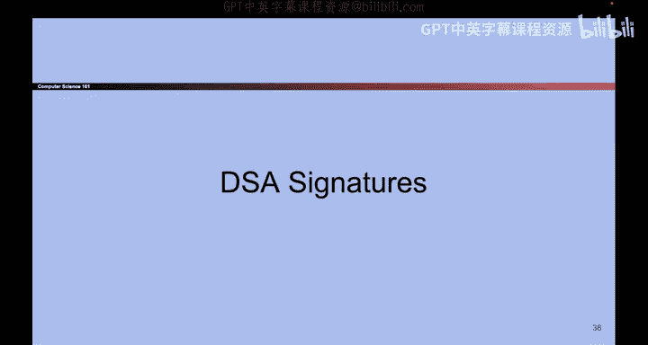

# 154：数字签名 - 实现

## 概述
在本节课中，我们将要学习数字签名的具体实现方式，包括基于RSA的数字签名方案，并简要了解基于Diffie-Hellman的DSA签名。我们还将回顾公钥密码学的核心概念。

---

## RSA数字签名实现

上一节我们介绍了数字签名的概念，本节中我们来看看如何用RSA算法实现它。

RSA数字签名的核心思想与RSA加密相同，但步骤顺序相反。回顾RSA加密：取消息`M`，计算 `M^E mod N` 得到密文，再用私钥`D`计算 `(M^E)^D mod N` 恢复出`M`。数学上，先计算`D`次方再计算`E`次方同样能恢复原消息：`(M^D)^E ≡ M (mod N)`。RSA签名正是利用了这种可交换性。

### 密钥生成
密钥生成算法与RSA加密完全相同：
*   公钥是 `(N, E)`，其中 `N` 是两个大素数的乘积。
*   私钥是 `D`，满足 `E * D ≡ 1 (mod φ(N))`，其中 `φ(N) = (P-1)(Q-1)`。

### 签名过程
使用私钥`D`对消息`M`进行签名：
1.  计算消息的哈希值：`H = Hash(M)`。
2.  计算签名：`σ = H^D mod N`。

**注意**：直接对`M`进行运算仅限于短消息。对于任意长度的消息，我们总是先计算其哈希值`H(M)`，再对哈希值进行签名运算 `H(M)^D mod N`。这解决了消息长度限制问题。

### 验证过程
任何人可以使用公钥`(E, N)`验证签名：
1.  收到消息`M`和签名`σ`。
2.  计算消息的哈希值：`H = Hash(M)`。
3.  从签名中恢复哈希值：`H' = σ^E mod N`。
4.  比较 `H` 和 `H'`。如果相等，则签名有效；否则无效。

验证的原理是：`σ^E = (H(M)^D)^E = H(M)^(D*E) ≡ H(M) (mod N)`。

---

## 其他数字签名方案简介

除了RSA，还有其他基于不同数学难题的数字签名方案。

以下是另一种常见的数字签名方案：
*   **DSA (Digital Signature Algorithm)**：这是一种基于Diffie-Hellman密钥交换原理的数字签名方案。与ElGamal加密方案类似，DSA的安全性也依赖于离散对数问题的困难性。该方案比RSA签名更复杂，涉及更多的计算步骤和参数。

**请注意**：DSA的具体细节不在本课程考核范围内。如果您对此感兴趣，可以查阅课程提供的额外资料幻灯片。

---

## 公钥密码学总结

本节课中我们一起学习了公钥密码学的核心组成部分及其实现。

回顾整个公钥密码学体系，其核心是每个人都拥有一对密钥：一个公开的公钥和一个保密的私钥。
*   为了加密信息，发送方使用接收方的**公钥**进行加密。
*   为了解密信息，接收方使用自己的**私钥**进行解密。
*   我们期望公钥加密能提供与对称加密（如AES）类似的安全性，例如IND-CPA安全。

我们介绍了两种主要的公钥加密方案：
1.  **ElGamal加密**：基于Diffie-Hellman密钥交换。可以想象加密时Bob在“睡觉”，由Alice完成所有工作；解密时Bob“醒来”完成他那部分的Diffie-Hellman计算。
2.  **RSA加密**：基于大整数分解的困难性。我们证明了其正确性，但其安全性依赖于分解大数`N`的难度。

**重要提示**：课程中展示的基础版ElGamal和RSA方案本身并不满足IND-CPA安全。在实际应用中，必须引入随机填充等机制来修复这些细微的安全缺陷，才能达到真正的IND-CPA安全。

公钥加密方案功能强大，但通常计算较慢，且对加密消息的长度有限制。因此，我们引入了**混合加密**方案来结合双方优点：
*   使用公钥加密一个临时的**对称密钥**。
*   使用这个对称密钥加密实际要发送的**长消息**。
*   这样既获得了公钥加密的便利性（无需预先共享密钥），又获得了对称加密的高效性。

最后，我们探讨了**数字签名**，它在非对称密钥模型中提供了完整性和真实性保障。我们详细讲解了RSA数字签名，它使用了与RSA加密相同的数学原理，但顺序相反：先用**私钥**签名，再用**公钥**验证。同样，通过先对消息进行哈希处理，可以实现对任意长度消息的签名。

这就是公钥密码学的主要内容。希望本课程能帮助你建立起清晰的理解。我们下次再见！