# 001：课程概述

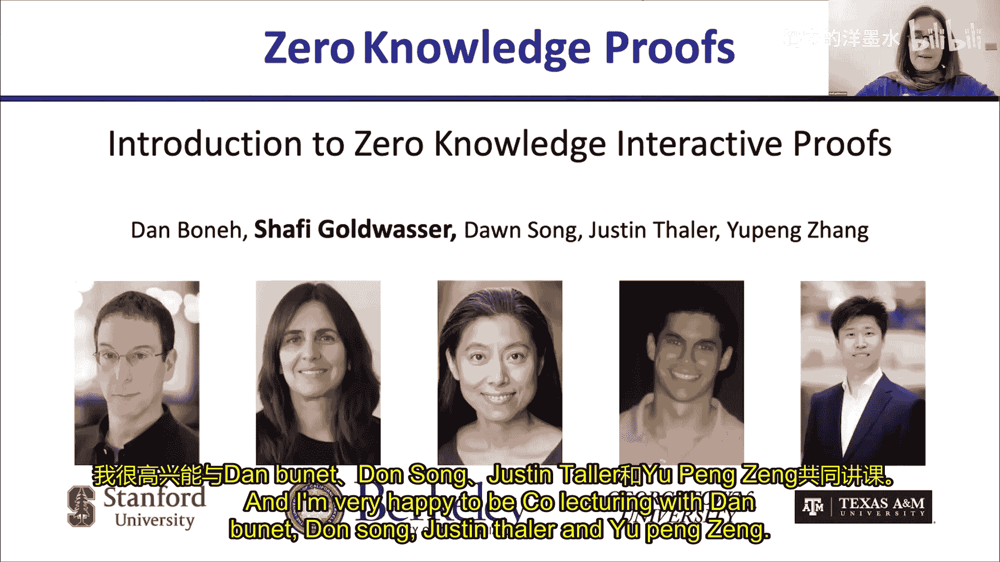

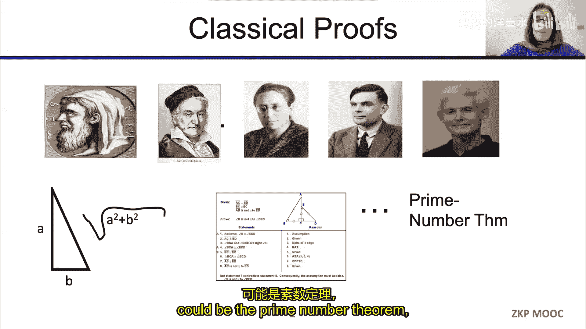

在本节课中，我们将要学习零知识证明的基本概念。我们将从经典证明开始，逐步引入交互式证明和零知识证明的核心思想，并通过具体例子理解其工作原理。

## 经典证明与NP证明

上一节我们介绍了课程主题，本节中我们来看看证明的传统定义。当我们谈论经典证明时，通常会想到一系列公理和推导步骤，最终得出定理。然而，在计算机科学中，我们更关注**高效可验证的证明**，即NP证明。

在NP证明模型中，存在一个**证明者**和一个**验证者**。证明者向验证者发送一个证明字符串。验证者是一个多项式时间算法，它读取证明字符串并决定是否接受该证明。

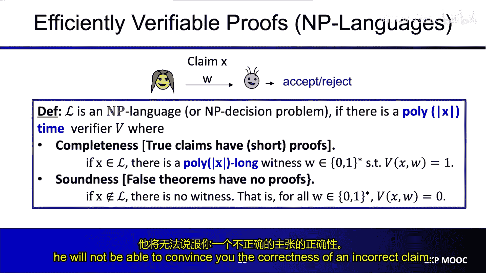

以下是NP证明需要满足的两个核心条件：

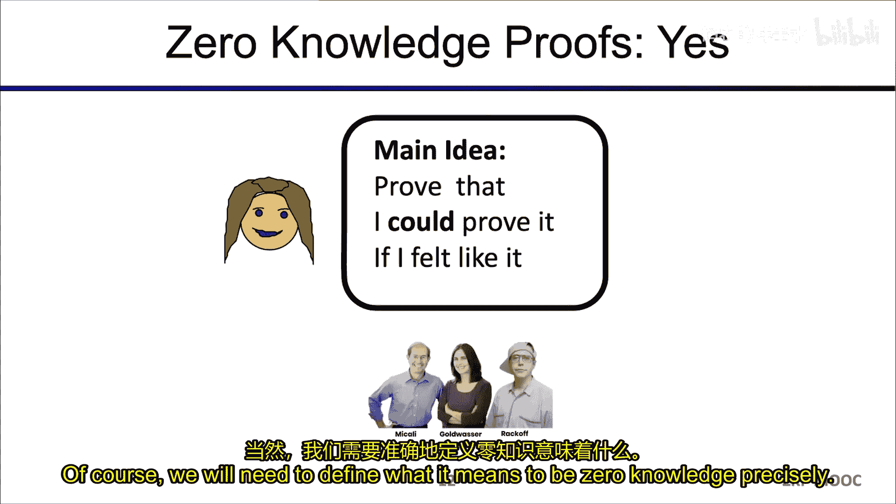

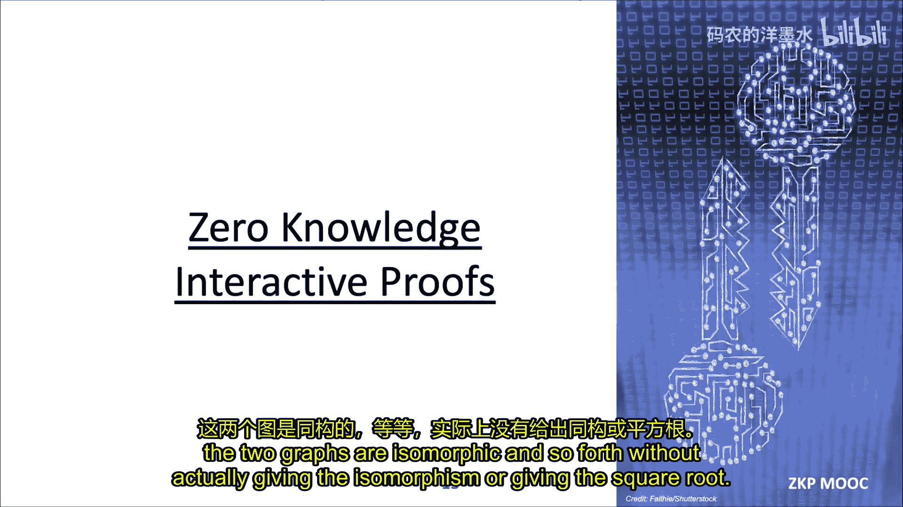

*   **完备性**：如果陈述为真，那么诚实的证明者可以提供一个证明字符串，使验证者总是接受。
*   **可靠性**：如果陈述为假，那么任何证明者（即使是恶意的）都无法提供一个能使验证者接受的证明字符串。

我们可以用以下公式来描述一个NP语言L：存在一个多项式时间验证算法V，使得对于所有输入x：
*   如果 x ∈ L，则存在一个字符串w（见证），使得 V(x, w) = 1（接受）。
*   如果 x ∉ L，则对于所有字符串w，都有 V(x, w) = 0（拒绝）。

**示例**：证明一个数n是两个大素数的乘积。证明者可以直接发送这两个素数因子p和q。验证者只需检查 p * q == n 以及 p 和 q 是否为素数即可。

然而，这种证明方式会向验证者泄露额外的信息（即因子本身）。我们能否在不泄露这些信息的情况下证明陈述的正确性？这就是零知识证明要解决的问题。

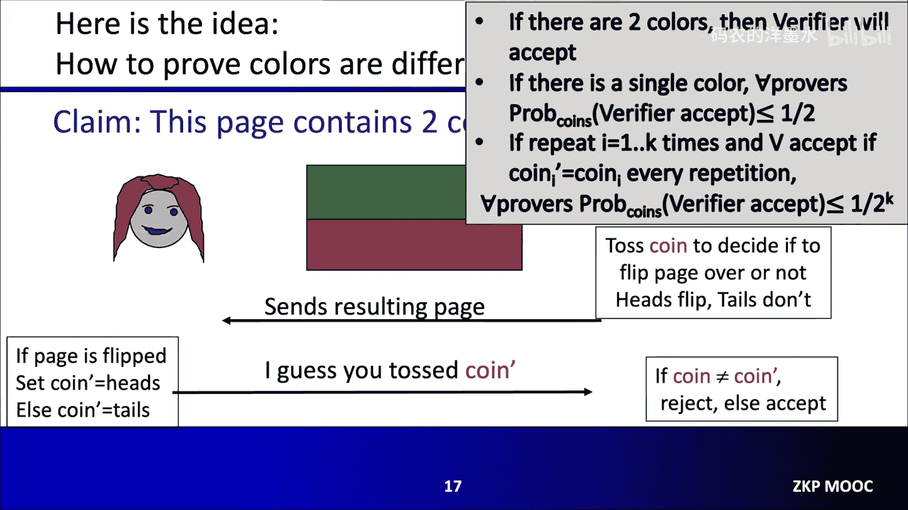

## 交互式证明与零知识证明简介

上一节我们介绍了NP证明，本节中我们来看看如何超越NP证明模型。零知识证明的核心目标是：**证明者能让验证者相信某个陈述为真，但不会向验证者泄露任何超出该陈述真实性以外的信息**。

为了实现这一目标，我们需要对证明模型进行两项关键修改：

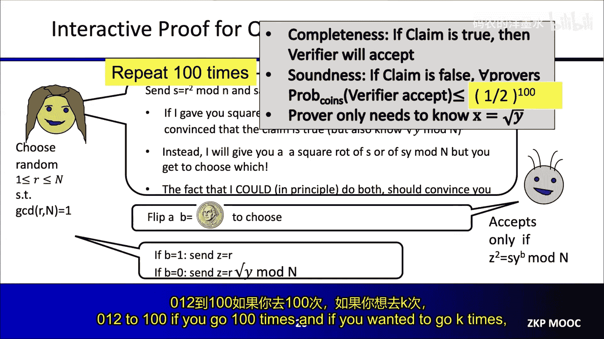

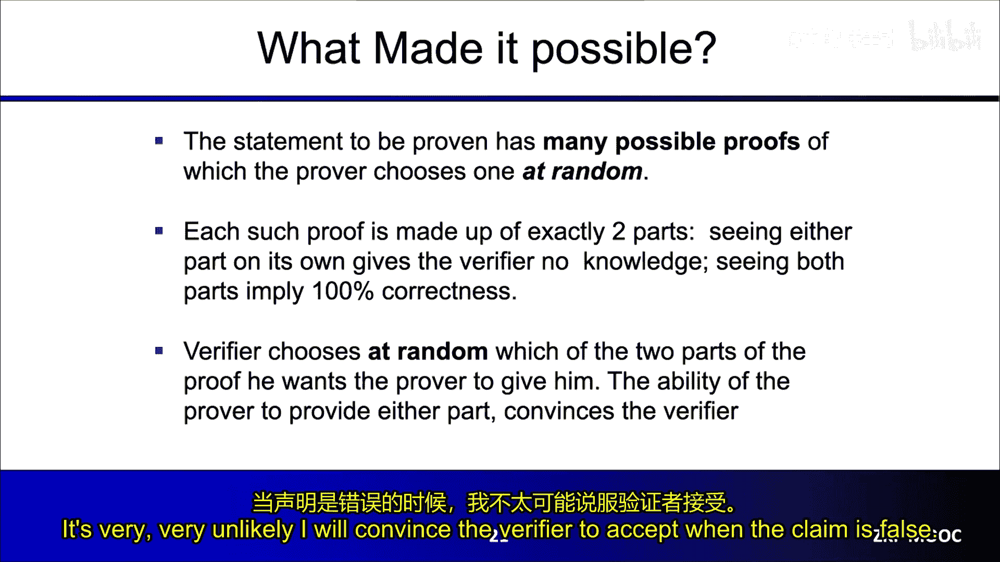

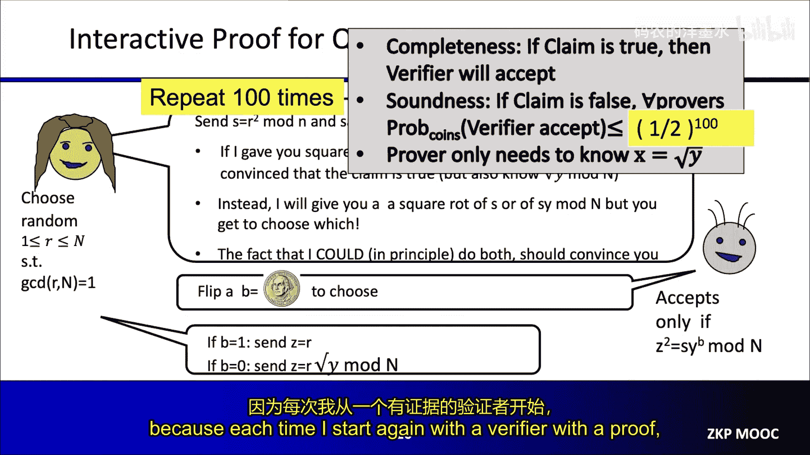

1.  **交互**：证明不再是一个单向的消息，而是证明者和验证者之间进行多轮问答。
2.  **随机性**：验证者被允许抛掷随机硬币，并根据结果向证明者提出不可预测的问题。

由于引入了随机性，我们允许验证者有极小的概率出错（例如，接受一个错误的陈述）。但这个错误概率必须是可以忽略不计的。

**一个直观的例子（非数学）**：假设证明者不是色盲，而验证者是色盲。证明者想向验证者证明一张纸有两种颜色，而不是单一颜色。
1.  验证者私下抛硬币。如果是正面，他将纸翻转；如果是反面，则不动。
2.  验证者将纸交给证明者看。
3.  证明者根据纸张是否被翻转，猜出验证者抛硬币的结果并告知验证者。
4.  验证者对比结果。如果一致，则接受“纸有两种颜色”的陈述；否则拒绝。

**分析**：
*   如果纸确实有两种颜色，证明者总能分辨是否被翻转，从而总是猜对，验证者总是接受。
*   如果纸只有一种颜色，证明者无法分辨，只能随机猜测，猜对的概率最多是1/2。
*   通过重复这个过程k次，验证者错误接受（即纸只有一种颜色但证明者每次都猜对）的概率将降至 (1/2)^k，这是一个可忽略的小概率。

这个例子展示了如何通过交互和随机性，在不传递“颜色信息”本身（零知识）的情况下，传递“存在两种颜色”这一知识。

## 第一个数学示例：二次剩余

现在，让我们看一个数学上的零知识证明例子。问题是：证明者想向验证者证明一个数y是模n下的**二次剩余**，即存在某个x，使得 y ≡ x^2 (mod n)，但**不泄露x的值**。

以下是协议步骤：

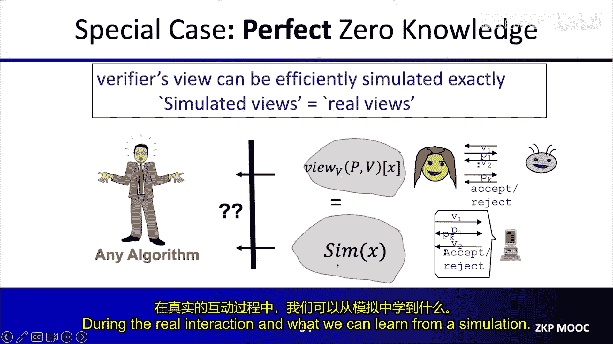

1.  证明者随机选择一个数r（满足1 ≤ r < n 且 gcd(r, n)=1），计算 s ≡ r^2 mod n，并将s发送给验证者。
2.  验证者随机抛一枚硬币，得到一个比特b ∈ {0, 1}。如果b=0，他要求证明者提供s的平方根（即r）；如果b=1，他要求提供s*y的平方根（即r*x mod n）。
3.  证明者根据b的值，发回相应的答案z（r 或 r*x）。
4.  验证者检查收到的z是否满足：z^2 ≡ s * y^b mod n。如果满足，则接受；否则拒绝。

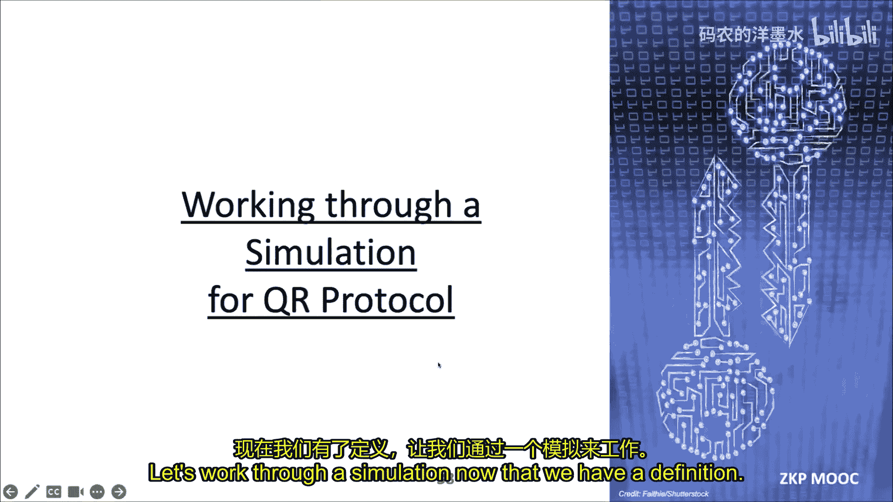

**分析**：
*   **完备性**：如果y确实是二次剩余（证明者知道x），那么无论b是0还是1，证明者都能正确回答，验证者总是接受。
*   **可靠性**：如果y不是二次剩余，那么对于证明者发送的某个s，他不可能同时知道s和s*y的平方根。因此，当验证者随机选择b时，证明者只有1/2的概率能回答验证者选择的那一个问题。重复k轮，验证者被欺骗的概率仅为(1/2)^k。
*   **零知识性**：验证者在每次交互中，要么得到一个随机数r，要么得到一个随机数r*x。由于r是随机选择的，这两个值看起来都是随机的，没有泄露关于x的信息。形式上，可以构造一个**模拟器**，在不接触真实证明者的情况下，生成与真实交互**不可区分**的对话记录。

这个协议不仅证明了y是二次剩余，而且是一个**知识证明**——它证明了证明者确实知道x。因为如果有一个提取器能够以“回退”的方式运行证明者两次（第一次问b=0，第二次问b=1），他就能从两次回答中计算出x = (r*x) / r。

## 定义：交互式证明与零知识

上一节我们通过例子建立了直观理解，本节中我们正式定义相关概念。

一个针对语言L的**交互式证明系统**由一对交互式算法(P, V)构成，其中验证者V是概率多项式时间算法。它满足：
*   **完备性**：对于所有 x ∈ L，Pr[〈P, V〉(x) 接受] = 1。
*   **可靠性**：对于所有 x ∉ L 和所有（计算能力无限制的）证明者算法P*， Pr[〈P*, V〉(x) 接受] ≤ ε(|x|)，其中ε是一个可忽略函数。

所有拥有交互式证明的语言类记为IP。

一个交互式证明系统是**零知识的**，如果对于任意（可能恶意的）概率多项式时间验证者V*，都存在一个概率多项式时间模拟器Sim，使得对于所有 x ∈ L，以下两个分布是计算不可区分的：
*   **真实视图** View_{V*}[〈P, V*〉(x)]：V*在与真实证明者P交互后看到的全部信息（包括其随机硬币和收到的消息）。
*   **模拟视图** Sim(x)：模拟器仅凭输入x（而没有证明者的秘密知识）生成的输出。

**模拟范式**是零知识定义的核心：它意味着验证者从交互中学到的一切，都可以由他自己在本地模拟生成，因此交互没有给他带来任何新的计算能力。

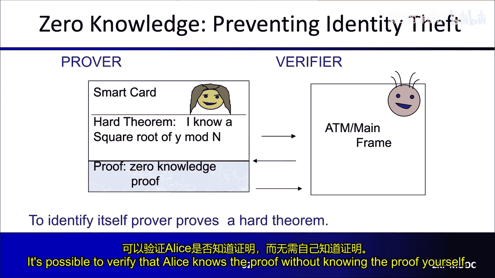

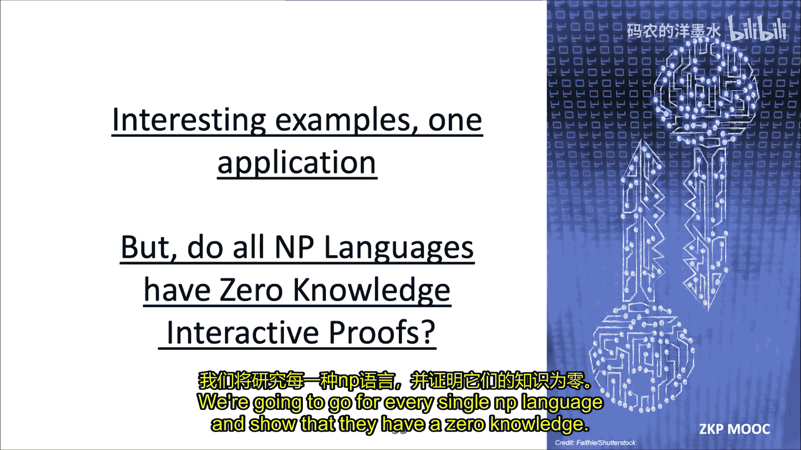

零知识还有更强的变体：**完美零知识**（模拟分布与真实分布完全相同）和**统计零知识**（两个分布统计上接近）。

## 图同构的零知识证明

另一个重要的例子是**图同构**问题。给定两个图G0和G1，证明者想向验证者证明它们同构（即存在一个顶点的一一映射，保持边的关系），但**不泄露具体的同构映射**。

协议与二次剩余协议结构相似：
1.  证明者随机选择一个置换π，并计算图H = π(Gb)（即随机地将其中一个图进行置换），将H发送给验证者。
2.  验证者随机选择b ∈ {0, 1}，要求证明者提供从Gb到H的同构映射。
3.  证明者发回相应的映射（如果b=0，则发π；如果b=1，则发π ∘ φ，其中φ是G0到G1的已知同构）。
4.  验证者检查收到的映射是否正确。如果正确，则接受；否则拒绝。

**分析**：完备性和可靠性与二次剩余例子类似。这也是一个完美零知识证明，并且是知识证明（提取器可以通过两次询问提取出同构映射φ）。

## 应用：身份认证与协议设计

零知识证明有两个直接而重要的应用：

1.  **身份认证**（如Fiat-Shamir方案）：用户可以将一个秘密（如大数n的平方根x）作为私钥，公开y = x^2 mod n作为公钥。登录时，用户通过零知识证明向服务器证明自己知道x，而无需传输x本身。这避免了密码泄露的风险。
2.  **协议设计工具**：在复杂的安全协议中，可以要求参与方在发送每条消息时，附上一个零知识证明，证明其发送的消息是根据协议规则、其私有输入和随机性正确计算得出的。这可以强制参与者诚实执行协议，同时不泄露其私有状态，从而简化安全分析。

## 所有NP问题都有零知识证明吗？

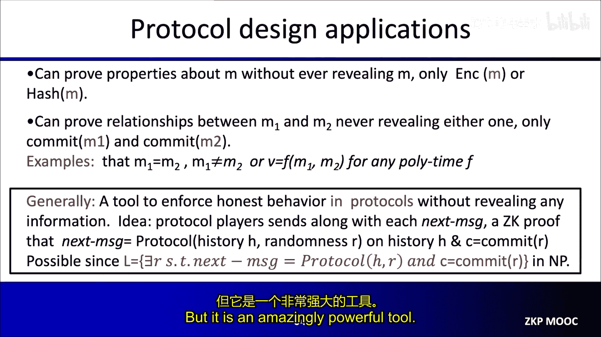

一个强大的结论是：**在单向函数存在的假设下，每一个NP语言都存在一个（计算性的）零知识交互式证明**。

证明思路基于NP完全性：
1.  首先，为一个特定的NP完全问题（如**图三着色问题**）构造一个零知识证明。
2.  然后，对于任何NP语言L，将实例x通过NP完全归约转换为一个图G_x。
3.  最后，对G_x运行图三着色问题的零知识证明。由于归约是公开的，这等价于对原始陈述x ∈ L的零知识证明。

**图三着色问题的零知识证明协议概要**：
*   证明者拥有一个三着色方案（用三种颜色给图顶点着色，使得任意边两端颜色不同）。他首先随机置换颜色标签，然后对每个顶点的颜色进行**承诺**（将其“锁在信封里”），将所有承诺发送给验证者。
*   验证者随机选择一条边，要求证明者打开该边两个端点的颜色承诺。
*   证明者打开这两个承诺，验证者检查两个颜色是否不同。
*   重复以上步骤多次。如果验证者每次检查都通过，则接受。

**关键点**：
*   **完备性**：如果图可三着色，诚实的证明者总能通过检查。
*   **可靠性**：如果图不可三着色，那么至少有一条边两端颜色相同或无效。每轮验证者随机选中这条“坏边”的概率至少为1/|E|。重复足够多次后，证明者侥幸过关的概率可忽略。
*   **零知识性**：模拟器可以“投机”地提前猜验证者会问哪条边，然后只为这条边的两个端点生成不同的随机颜色承诺，为其他顶点生成任意承诺。由于承诺的隐藏性，模拟视图与真实视图计算不可区分。这里用到了**承诺方案**这一密码学原语，而承诺方案可以从单向函数构造。

## 交互式证明的强大能力

交互式证明的概念本身，即使不考虑零知识，也极大地拓展了我们对“可证明性”的认识。

*   **NP vs IP**：NP证明可以看作交互式证明的特例（只有一轮，且验证者确定性地计算）。但交互式证明更强大。例如，**图非同构**问题（证明两个图不同构）没有已知的短NP证明，但却存在简单的交互式证明协议。
*   **IP = PSPACE**：一个里程碑式的结果表明，交互式证明所能证明的语言类IP，恰好等于**PSPACE**（多项式空间可解决的问题类）。这包含了大量比NP更难的问题。
*   **多证明者交互式证明**：如果允许验证者同时与多个互不通信的证明者交互，能力会进一步增强，并导致了**PCP定理**的发现。PCP定理说，任何NP证明都可以被改写成一种特殊形式，使得验证者只需随机检查其中常数个比特，就能以高概率判断证明的正确性。
*   **非交互式证明**：在随机预言机模型下，通过Fiat-Shamir变换，可以将某些特定结构的交互式证明（验证者只发送随机挑战）转化为**非交互式**证明，即证明者生成一个单一的证明字符串，无需与验证者实时交互。这在区块链等应用中至关重要。

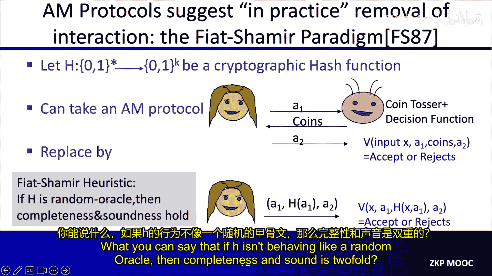

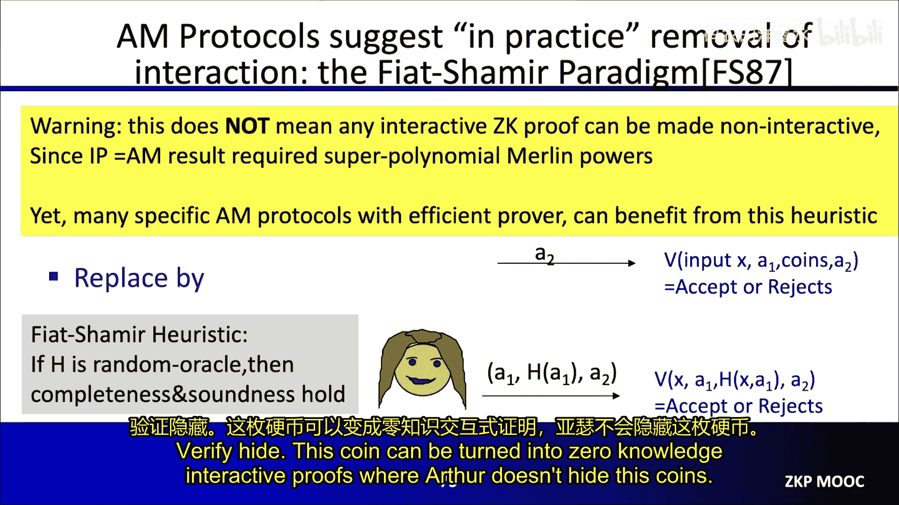

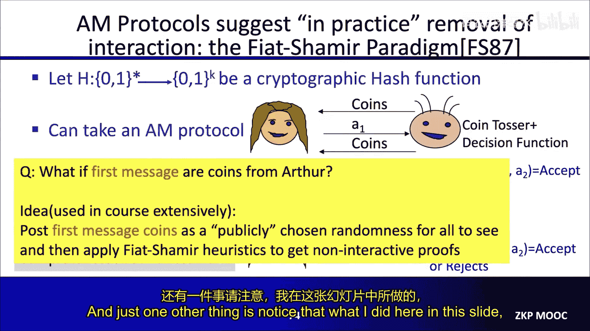

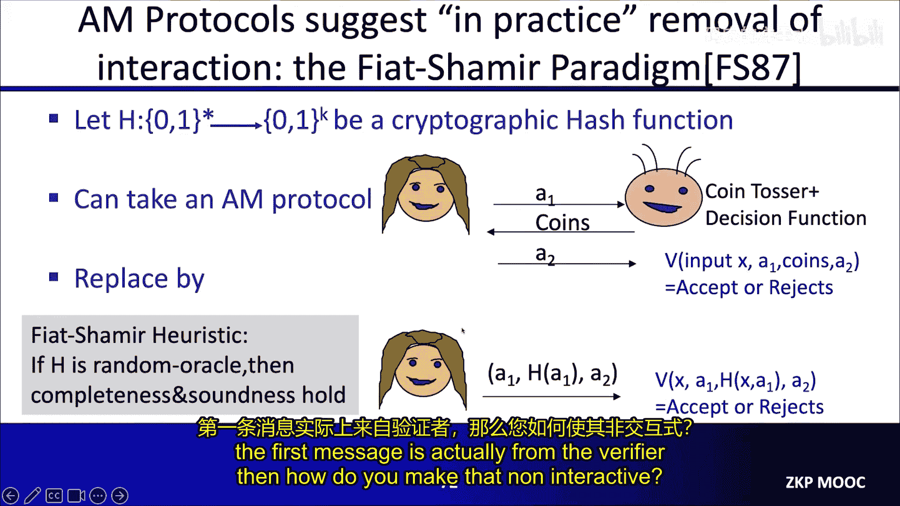

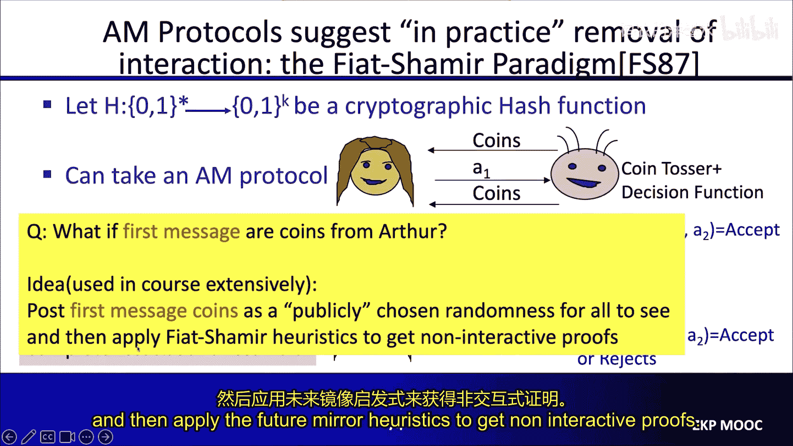

## 总结

本节课中我们一起学习了零知识证明的基础。我们从经典证明和NP证明出发，指出了其可能泄露多余信息的局限性。为了克服这一点，我们引入了**交互**和**随机性**，定义了**交互式证明系统**，并进一步通过**模拟范式**定义了**零知识性**——即验证者学不到任何超出陈述真实性的信息。

我们通过**二次剩余**和**图同构**的例子，具体阐述了零知识证明协议如何工作，并分析了其完备性、可靠性和零知识性。我们还看到了零知识证明在**身份认证**和**安全协议设计**中的强大应用。

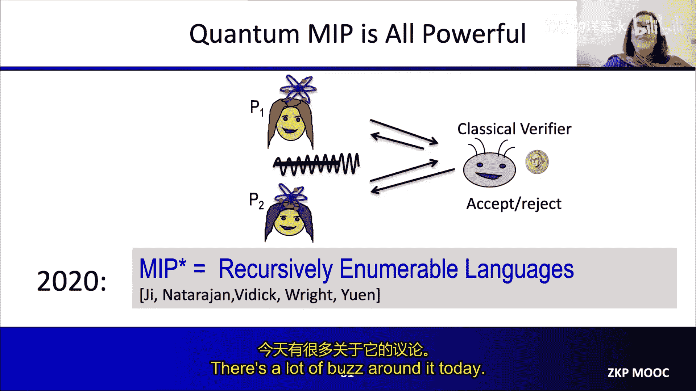

最后，我们了解到一个深刻的结论：在合理的密码学假设下，**所有NP问题都有零知识证明**。这通过将任意NP问题归约到**图三着色问题**并为其构造零知识证明来实现。交互式证明的概念本身也深刻影响了计算复杂性理论，揭示了交互和随机性如何极大地扩展了可高效验证的陈述范围。