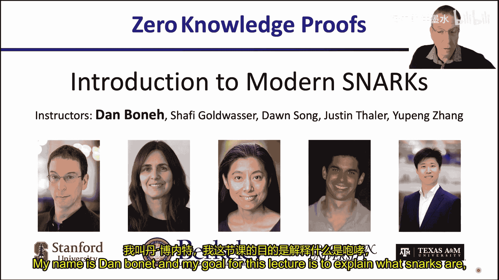
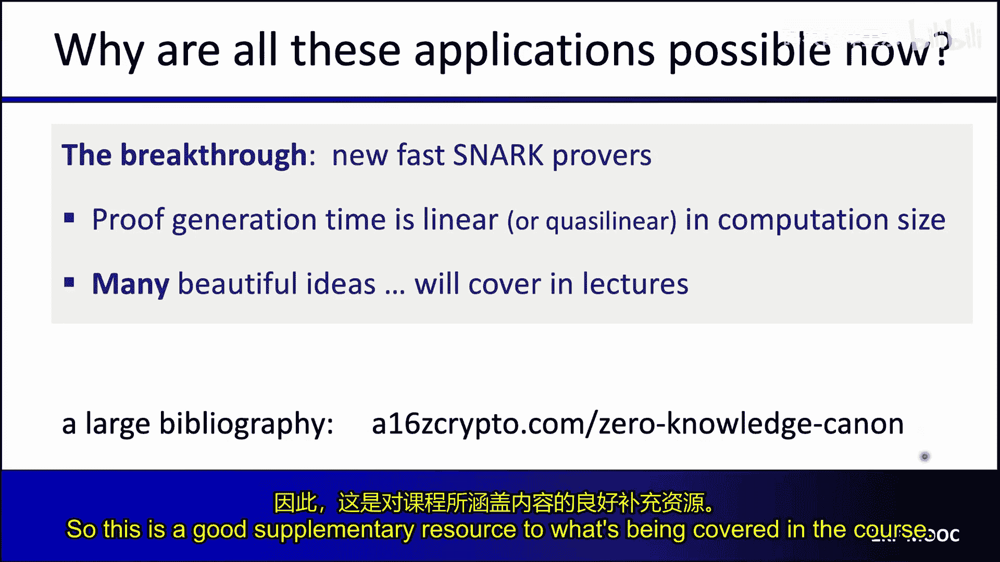
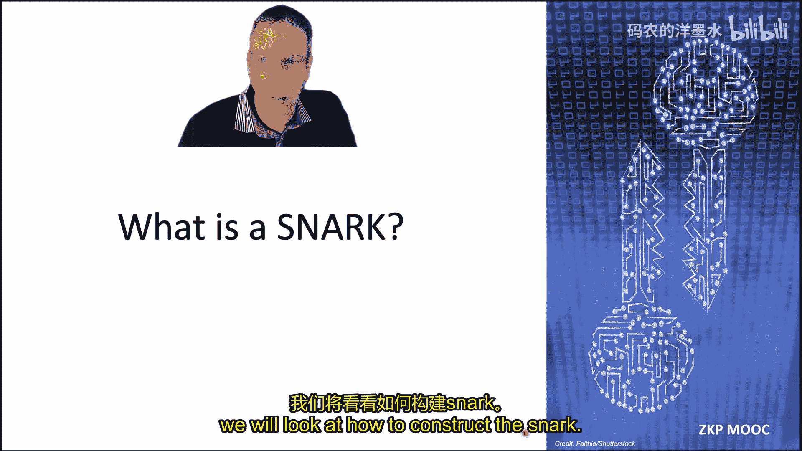
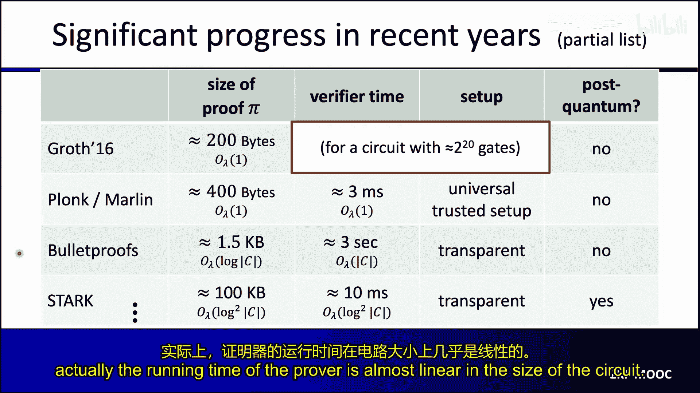
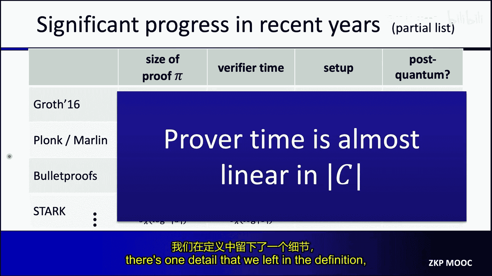
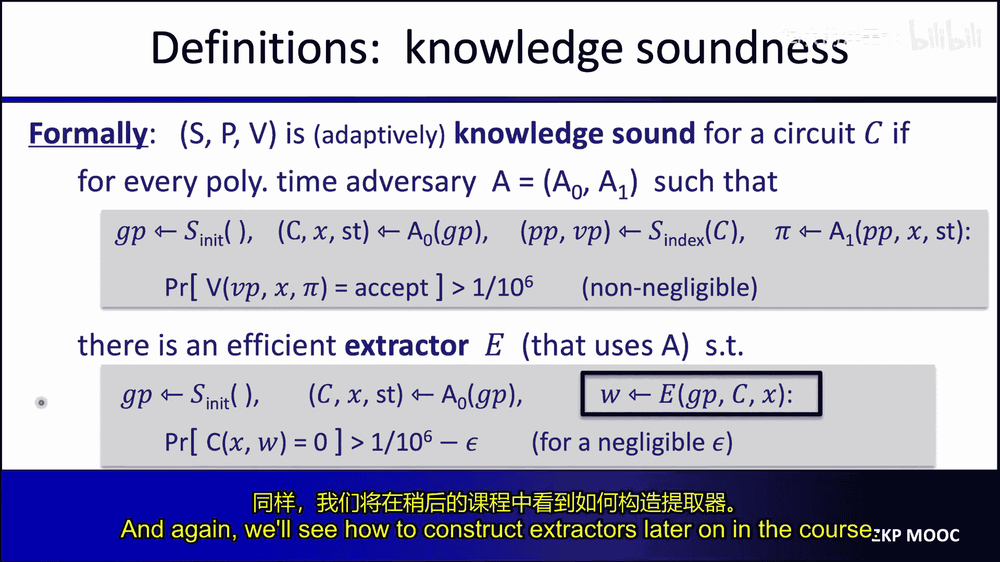
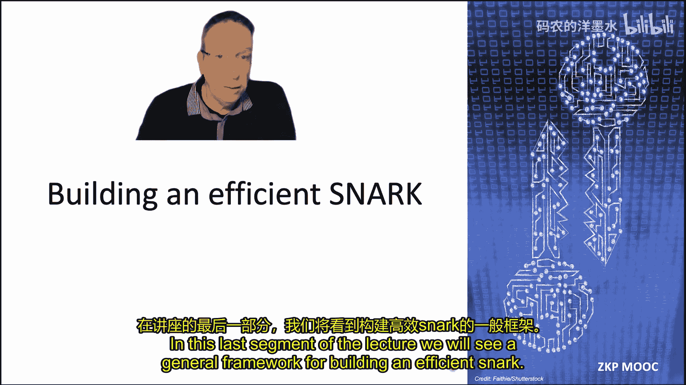
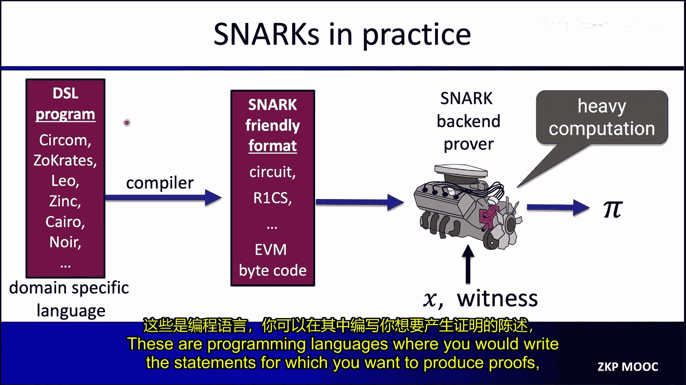
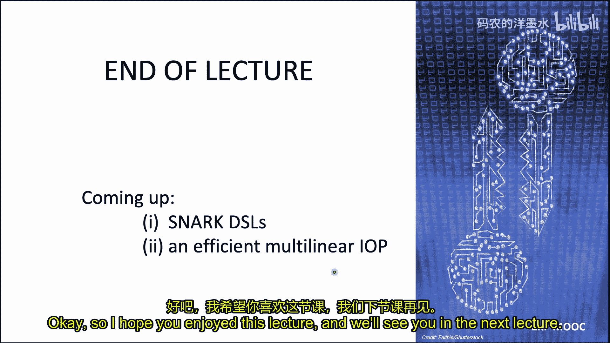

# 002：现代SNARK构造概述 🚀

在本节课中，我们将要学习现代SNARK（简洁非交互式知识论证）的基本概念、应用场景以及其核心构造范式。我们将从SNARK的定义出发，探讨其为何在区块链和隐私计算领域至关重要，并最终理解构建高效SNARK的通用框架。

## 什么是SNARK？ 🤔

在上一讲中，我们介绍了交互式零知识协议。从本讲开始，我们将专注于非交互式协议及其应用。我们将聚焦于SNARK，即“简洁非交互式知识论证”。

SNARK本质上是一个简洁的证明，用于证明某个陈述为真。一个典型的陈述可能是：“我知道一个消息M，使得其SHA-256哈希值为0”。证明者希望向验证者证明他知道这样的M。

一个平凡的证明是直接发送消息M。但如果M很大（例如1GB），那么这个证明就非常庞大，验证者也需要重新计算哈希，工作量巨大。而SNARK的证明总是非常简短，并且验证速度极快。这听起来有违直觉：即使消息长达1GB，证明者也能用一个极短的证明来说服验证者，且验证工作量极小。这就是SNARK的魔力。

我们还可以为SNARK增加零知识属性，使其成为ZK-SNARK。这意味着证明不仅简短、验证快速，而且不会泄露关于秘密消息M的任何新信息。

## SNARK的商业应用与驱动力 💼

目前，SNARK领域存在巨大的商业兴趣。许多公司正在开发SNARK软件、使用SNARK或构建SNARK硬件加速器。这种兴趣源于一个可以追溯到上世纪80年代末、90年代初的核心理念：一个“缓慢而昂贵”的计算机可以验证一群“不可靠且运行不受信任软件”的超级计算机的工作。

如今，这个“缓慢而昂贵的计算机”的典型例子就是Layer 1区块链。区块链本身可以被视为一台计算机，但其运行速度相对较慢，且操作成本高昂。这催生了SNARK的几类关键应用。

### 区块链驱动的应用（无需隐私）

1.  **计算外包与ZK Rollup**：这是扩展区块链的关键技术。一个链下服务可以处理一批交易（例如100或1000笔），并向L1链证明这批交易中的所有交易都是有效的且被正确处理。L1链无需逐一验证这些交易，只需验证一个非常简短、快速的SNARK证明即可。这可以将L1链的吞吐量提升数百倍。
2.  **区块链互操作性（跨链桥）**：目标是将资产从一个链转移到另一个链。目标链需要确信源链确实锁定了该资产。实现方式是向目标链提供一个SNARK证明，证明源链的共识协议确实同意该资产已被锁定。目标链只需验证这个简短的证明，而无需运行源链的整个共识验证过程。

在这两类应用中，证明的**非交互性**至关重要。证明将被大量区块链验证者验证，因此不能要求证明者与每个验证者进行交互式证明。非交互式证明允许所有验证者在无需与证明者交互的情况下独立验证证明。

### 需要隐私的应用（使用ZK-SNARK）

1.  **公链上的隐私交易**：在公链上处理交易数据被加密或提交（而非公开）的隐私交易。需要附上零知识证明来论证交易是有效的（例如，由发起者正确签名、没有创造或损失资金）。多个项目正使用ZK-SNARK实现此目的。
2.  **合规性证明**：交易数据在链上被加密或提交，不为公众所见。交易发起者需要证明该交易符合当地的银行法规。这同样通过附加零知识证明来实现。
3.  **交易所偿付能力证明**：交易所希望证明其资产大于对客户的负债。它需要在不泄露具体资产数额和客户负债细节的情况下，零知识地证明资产大于负债。

### 非区块链应用示例：对抗虚假信息 🛡️

一个与区块链无关的优雅应用是打击虚假信息。新闻文章中常嵌入图片，但图片可能与文章描述的事件完全无关。行业正在开发技术解决方案，例如C2PA（内容来源和真实性）标准。

C2PA旨在为新闻文章中的图片提供真实的来源证明。其构想是在每台相机中嵌入一个制造商设置的、无法提取的密钥。每次拍照时，相机会用该密钥对图片及其元数据（如时间、地点）进行签名。

然而，新闻机构在发布图片前通常会进行处理（如下采样、裁剪、灰度化），这破坏了原始签名，导致读者设备无法验证。

**SNARK为此提供了完美的解决方案**：
编辑软件会生成一个ZK-SNARK证明 `π`，证明以下陈述：
> “我知道一个原始图像及其有效的C2PA签名，并且我发送给你的编辑后图片，是经过授权操作（如裁剪、缩放）处理原始图像后的结果，且你收到的图片元数据与原始图像元数据一致。”

读者的设备只需验证这个简短的SNARK证明（约1KB，验证时间约10毫秒）。如果验证通过，则向用户显示元数据，证明图片的真实性。对于新闻机构，为一张高分辨率图片生成此类证明只需几分钟，且证明生成是高度可并行化的。

这个应用同样**要求证明是非交互式的**，因为新闻机构是向所有读者广播同一个证明，而非与每个读者交互。

## 为何现在成为可能？⚡

这些应用在五到十年前是无法实现的。现在的突破在于新一代SNARK系统支持**非常快速的证明者**。证明生成时间与计算规模呈线性或拟线性关系。正是证明者效率的大幅提升，使得我们能够为大型计算生成证明。

这得益于一系列关于**多项式性质证明**的优雅思想，是代数和多项式理论的巧妙应用。我们将在后续课程中深入探讨。

## 精确定义SNARK 🔬

要精确定义SNARK，我们首先需要固定一个计算模型：**算术电路**。

### 算术电路

我们首先定义一个有限域 `F = {0, 1, ..., p-1}`，其中 `p` 是一个大素数。在该域上可以进行模 `p` 的加法和乘法运算。

一个算术电路是一个函数，它接受 `n` 个域元素作为输入，并产生一个域元素作为输出。电路由标量输入、变量输入以及加法、减法、乘法门组成。我们可以将算术电路视为计算一个多变元多项式，但它更是一个评估该多项式的“配方”。我们用 `|C|` 表示电路 `C` 中的门数量。

算术电路非常强大，可以表示任何多项式时间计算。例如：
*   **哈希函数电路**：计算 `H - SHA256(M)`。如果 `SHA256(M) = H`，则输出0。实现SHA-256大约需要20,000个算术门。
*   **数字签名验证电路**：输入公钥、消息和签名，如果签名有效则输出0。

我们区分两种电路：
1.  **非结构化电路**：门之间的连线可以是任意的。
2.  **结构化电路**：电路由层层重复的相同操作构成，可以看作是一个虚拟机的重复执行步骤。

### 从NARK到SNARK

首先定义NARK（非交互式知识论证）。它应用于一个算术电路 `C(x, w)`，其中 `x` 是公开陈述，`w` 是秘密证据。目标是证明者向验证者证明他知道一个 `w` 使得 `C(x, w) = 0`。

一个预处理NARK包含三个算法 `(S, P, V)`：
*   **S (Setup)**：以电路 `C` 的描述为输入，输出证明者参数 `PP` 和验证者参数 `VP`。
*   **P (Prove)**：以 `PP`, `x`, `w` 为输入，生成证明 `π`。
*   **V (Verify)**：以 `VP`, `x`, `π` 为输入，输出接受或拒绝。

NARK需满足两个属性：
1.  **完备性**：如果证明者确实知道有效的 `w`，那么验证者总是会接受其生成的证明。
2.  **知识可靠性**：如果验证者接受了来自证明者的证明，那么证明者“确实知道”一个使得 `C(x, w)=0` 的 `w`。这里的“知道”意味着存在一个提取器，能够从成功的证明者那里提取出有效的 `w`。

**SNARK（简洁NARK）** 在NARK的基础上增加了**简洁性**要求：
*   **证明长度**：必须亚线性于证据 `w` 的长度（不能直接发送 `w`）。
*   **验证时间**：必须亚线性于电路 `C` 的大小（验证者不能重新运行整个电路）。

实际上，我们通常要求更强的简洁性：
*   **强简洁性**：证明长度和验证时间至多是对数级于电路大小 `|C|`，甚至最好是**常数级**（与电路大小无关）。

这引出了一个关键点：验证者甚至没有时间读取整个电路 `C`。这就是为什么需要**预处理步骤**。算法 `S` 会读取整个电路并生成一个“摘要”（即验证者参数 `VP`），其大小至多对数级于 `|C|`，但仍允许验证者验证关于电路的计算。

**ZK-SNARK** 则是一个同时满足零知识属性的SNARK。

平凡的SNARK（即发送 `w` 作为证明）不满足上述任何一点：证明可能很长、验证可能需要重算复杂电路、并且泄露了秘密 `w`。

### 预处理（Setup）的类型

预处理步骤生成证明者和验证者参数，其中验证者参数是电路的摘要。该步骤需要使用随机数 `r`。

1.  **每电路可信设置**：为每个需要证明的电路单独运行。随机数 `r` 必须对证明者保密，通常通过“可信设置仪式”完成，之后销毁生成 `r` 的机器。
2.  **通用可信设置**：分为两个算法。
    *   `S_init`：一次性运行，生成全局参数 `GP`。同样需要保密 `r` 并销毁机器。
    *   `S_index`：确定性算法，以电路 `C` 和 `GP` 为输入，生成 `PP` 和 `VP`。任何人都可以运行并验证。
    优点：一次可信设置可用于无数个电路。
3.  **透明设置**：最佳方案。设置过程无需任何秘密数据，任何人都可以验证其正确运行，无需可信仪式。

### 现有SNARK系统示例（部分）

| 系统 | 证明大小 | 验证时间 | 设置类型 | 特点 |
| :--- | :--- | :--- | :--- | :--- |
| **Groth16 (2016)** | ~200 字节 | ~1.5-2 毫秒 | 每电路可信设置 | 证明和验证均为常数 |
| **Plonk / Marlin (2019)** | ~400 字节 | 稍长，但仍为常数 | 通用可信设置 | 一次设置，多电路使用 |
| **Bulletproofs** | ~1.5 KB (对数级) | 线性于电路大小 | **透明** | 证明短，但验证慢 |
| **STARKs** | ~100 KB (对数级) | 对数级 | **透明** | 透明设置，证明较大 |

所有现代SNARK系统的证明者时间都几乎是电路大小的线性时间，这正是推动SNARK革命的关键。

### 知识可靠性的形式化定义

知识可靠性意味着：如果验证者以不可忽略的概率接受了敌手证明者生成的证明，那么必然存在一个高效的提取器 `E`，能够通过与敌手交互，提取出一个有效的证据 `w`。

具体定义涉及一个分为两阶段的敌手 `(A0, A1)`：
1.  `A0` 接收全局参数，输出想要证明的电路 `C`、陈述 `x` 以及一些内部状态。
2.  运行 `S_index` 为电路 `C` 生成参数。
3.  `A1` 接收证明者参数、陈述 `x` 和状态，生成一个证明 `π`。
如果 `V` 以概率 `ε` 接受这个证明，那么存在提取器 `E`，它可以通过与 `A1` 交互，以大约 `ε` 的概率提取出一个满足 `C(x, w)=0` 的 `w`。

## 构建SNARK的通用框架 🏗️

现代SNARK的构建通常遵循一个通用范式，包含两个核心组件：
1.  **功能性承诺方案**：一个密码学对象。
2.  **交互式预言机证明**：一个信息论对象。

将两者结合，并通过Fiat-Shamir变换转化为非交互式，即可得到针对一般电路的SNARK。

### 1. 功能性承诺方案

首先回顾普通承诺方案。包含两个算法：
*   `Commit(m, r) -> com`：用随机数 `r` 承诺消息 `m`，生成承诺 `com`。
*   `Verify(com, m, r) -> accept/reject`：验证打开。

需满足**绑定性**（不能对同一承诺打开为两个不同消息）和**隐藏性**（承诺不泄露消息）。

**功能性承诺方案** 则允许我们对一个函数 `f`（来自某个函数族 `F`）进行承诺。证明者承诺到函数 `f`，发送承诺 `com_f`。后来，对于验证者选择的任意输入 `x`，证明者可以输出 `y = f(x)` 以及一个证明 `π`，说服验证者“所承诺的函数 `f` 在 `x` 点的值确实是 `y`，且 `f` 属于函数族 `F`”。

验证者只知道 `com_f`, `x`, `y` 和 `π`，而不知道 `f` 的具体内容。证明 `π` 本身是一个小型的SNARK，证明关系：`f(x)=y`, `f ∈ F`, 且 `Commit(f, r) = com_f`。

#### 重要的功能性承诺类型

1.  **多项式承诺**：承诺到单变元多项式 `f ∈ F_{≤d}[X]`（次数 ≤ d）。之后可打开其在任意点 `u` 的值 `f(u)=v`。
2.  **多线性承诺**：承诺到多线性多项式（每个变元次数 ≤ 1）。
3.  **向量承诺**：承诺到一个向量 `u`，之后可打开其任意位置 `i` 的值 `u_i`。Merkle树就是一种向量承诺。
4.  **内积承诺**：承诺到向量 `u`，之后可证明对于任意向量 `v`，内积 `<u, v>` 等于某个值。

这些类型可以相互构造。多项式承诺是构建SNARK最核心的组件之一。

#### 多项式承诺方案示例

*   **KZG10**：使用双线性群，需要可信设置。证明和验证均为**常数时间/大小**，与多项式次数 `d` 无关。是目前最广泛使用的方案。
*   **Dory**：无需可信设置，但较慢。
*   **基于FRI**：仅使用哈希函数，透明设置，但证明较大（约100KB）。
*   **Bulletproofs**：使用椭圆曲线，透明设置，证明大小为对数级，但**验证时间为线性级**。
*   **Dark**：基于未知阶群，透明设置，但较慢。

**平凡的多项式承诺方案**（直接哈希所有系数）不是有效的多项式承诺，因为其“打开证明”（即发送所有系数）的大小和验证时间都是线性于次数 `d` 的。

#### 多项式承诺的核心观察：零测试与相等测试

一个关键观察是：对于一个非零的 `d` 次单变元多项式 `f`，在一个随机点 `r` 上，`f(r)=0` 的概率至多是 `d/p`（`p` 是域的大小）。如果 `p` 很大（如 `2^256`），而 `d` 相对较小（如 `2^40`），那么这个概率可以忽略不计。

这意味着，**如果我们在随机点 `r` 上发现 `f(r)=0`，那么我们就可以以极高的置信度断定 `f` 是恒等于零的多项式**。这是构建SNARK的基石。

由此可以推导出**多项式相等测试协议**：
1.  验证者有两个多项式 `f` 和 `g` 的承诺。
2.  验证者随机选择点 `r`，发送给证明者。
3.  证明者计算 `y_f = f(r)`, `y_g = g(r)`，并生成相应的评估证明 `π_f`, `π_g` 发送给验证者。
4.  验证者验证两个评估证明，并检查 `y_f == y_g`。
如果 `f` 和 `g` 是两个不同的多项式，它们在随机点 `r` 上相等的概率至多是 `d/p`。因此，如果验证通过，验证者可以相信 `f ≡ g`。

这个协议是**交互式**的。我们可以使用 **Fiat-Shamir 变换** 将其转化为**非交互式**。核心思想是：让证明者自己用哈希函数模拟验证者的随机挑战。具体来说，证明者计算 `r = Hash(com_f, com_g)`，然后生成响应。验证者用同样的方式计算 `r` 并进行验证。在随机预言机模型下，可以证明这能产生一个知识可靠的SNARK。

### 2. 交互式预言机证明

IOP是一种证明系统，它能够将针对特定函数族（如多项式）的功能性承诺方案，“提升”为针对任意电路的SNARK。

一个IOP用于证明电路 `C(x,w)=0`。其结构如下：
1.  **预处理**：算法生成验证者参数 `VP`，其中包含一些函数（作为“预言机”）。在后续编译为实际SNARK时，这些预言机将被功能性承诺替代。
2.  **交互协议**：进行 `t` 轮。
    *   在每一轮，证明者发送一个函数（的预言机）给验证者。
    *   验证者回复一些随机数据。
3.  **验证**：最后，验证者利用其拥有的所有预言机（来自 `VP` 和证明者），在它选择的点上进行查询，并根据查询结果决定是否接受证明。

IOP本身是**信息论**对象，其安全性（知识可靠性、零知识性）可以无条件证明。提取器在IOP层面被给予所有函数的明文（而不是承诺），因此可以更容易地提取证据 `w`。

#### IOP示例：集合包含证明

假设电路要证明：公开集合 `X` 是秘密集合 `W` 的子集。
1.  证明者构造多项式 `f(Z)`，以 `W` 中所有元素为根。
2.  证明者构造多项式 `g(Z)`，以 `X` 中所有元素为根（验证者也可自行构造 `g`）。
3.  如果 `X ⊆ W`，则 `g` 整除 `f`，商 `q(Z) = f(Z)/g(Z)` 是一个多项式。
4.  证明者发送 `f` 和 `q` 的预言机给验证者。
5.  验证者随机选择 `r`，查询得到 `w = f(r)`, `q' = q(r)`，并自行计算 `v = g(r)`。
6.  验证者检查 `v * q' == w`。
根据Schwartz-Zippel引理，如果等式在随机点成立，则 `f ≡ g * q` 以极高概率成立，从而 `g` 整除 `f`，即 `X ⊆ W`。提取器可以通过求 `f` 的根来得到 `W`。

### 组合框架：IOP动物园 🐘

构建SNARK的通用范式是：
1.  选择一个功能性承诺方案（如多项式承诺）。
2.  设计一个与之兼容的IOP（如多项式IOP）。
3.  将IOP中的“预言机”替换为该功能性承诺方案的“承诺”。
4.  将交互式协议通过Fiat-Shamir变换转化为非交互式。

这就形成了所谓的“IOP动物园”：
*   **多项式承诺 + 多项式IOP** → SNARK。例如：Sonic, Marlin, Plonk。
*   **多线性承诺 + 多线性IOP** → SNARK。例如：Spartan, Clover, HyperPlonk。
*   **向量承诺 + 向量IOP** → SNARK。例如：STARK, Breakdown, Orion。

现代SNARK大多采用这种模块化方式构建，将IOP构造与承诺方案构造分离，提高了设计的清晰度和灵活性。

## SNARK实践流程 🛠️

在实际应用中，开发者不会直接编写算术电路。典型流程如下：
1.  **领域特定语言**：开发者使用像Cairo、ZoKrates、Circom这样的DSL编写程序逻辑。
2.  **编译器**：将DSL程序编译成SNARK友好的格式，如算术电路、R1CS约束系统，或EVM字节码。
3.  **SNARK后端证明器**：以SNARK友好格式、公开陈述 `x` 和证据 `w` 作为输入，运行高效的证明生成算法，输出最终证明 `π`。这是计算最密集的环节，也是大量优化工作的焦点。

## 总结 📚

在本节课中，我们一起学习了：
1.  **SNARK的核心概念**：它是一种能生成简短、快速验证、并可选择具备零知识性的非交互式证明系统。
2.  **SNARK的广泛应用**：从区块链扩容（Rollup）、跨链桥到隐私交易、合规证明，乃至非区块链领域的图像真实性验证。
3.  **SNARK的精确定义**：基于算术电路模型，满足完备性、知识可靠性和简洁性（强简洁性要求证明和验证时间至多对数级）。
4.  **预处理设置的类型**：分为每电路可信设置、通用可信设置和理想的透明设置。
5.  **构建SNARK的通用范式**：其核心是结合**功能性承诺方案**（密码学组件，如多项式承诺）和**交互式预言机证明**（信息论组件），并通过Fiat-Shamir变换实现非交互性。
6.  **关键技术与观察**：多项式零测试/相等测试是SNARK可行性的基石，Schwartz-Zippel引理将其推广到多变元情况。
7.  **实践流程**：开发者通过高级DSL编程，经编译器生成中间表示，最后由高效的SNARK后端生成证明。

在接下来的课程中，我们将深入探讨具体的SNARK DSL、多项式承诺方案（如KZG）的构造，以及第一个高效的多线性IOP示例，从而构建出我们第一个完整的现实世界SNARK系统。