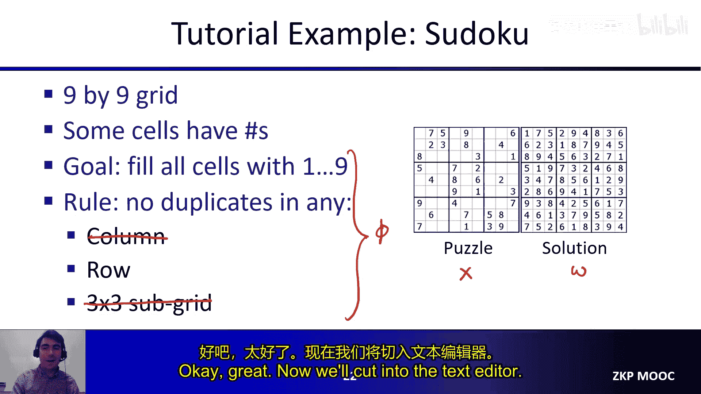
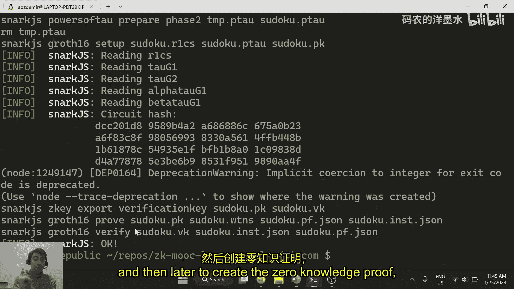
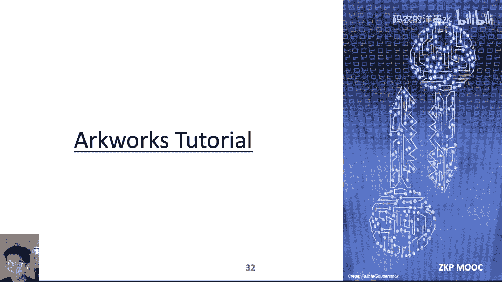
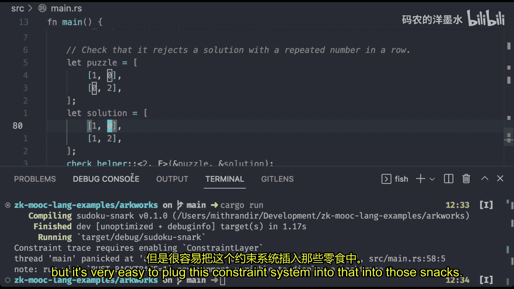
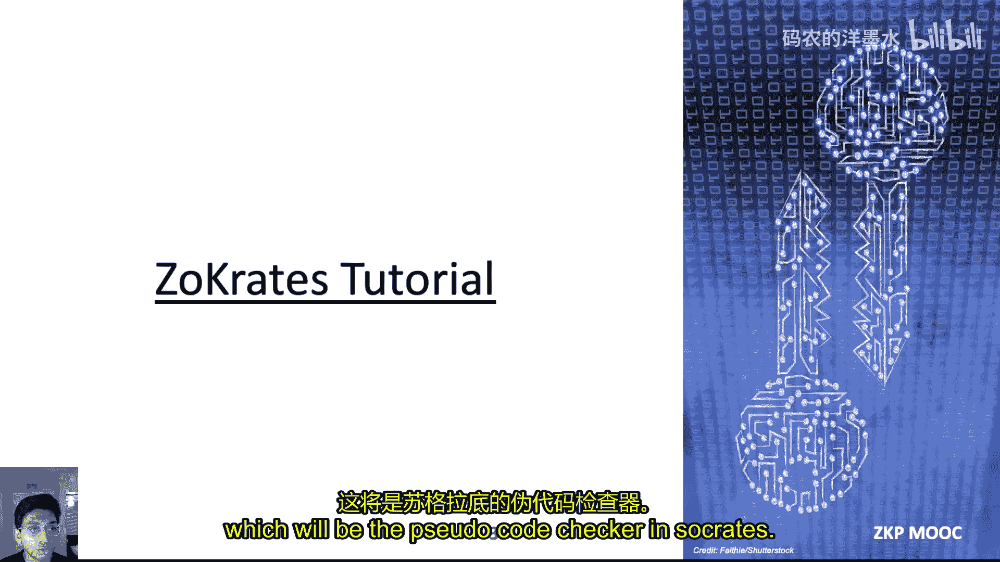
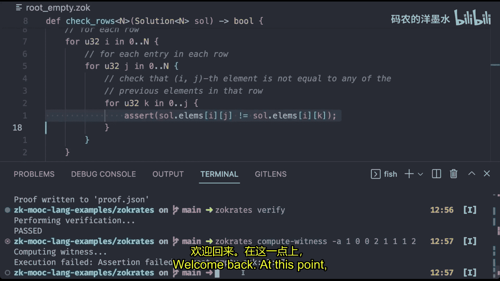
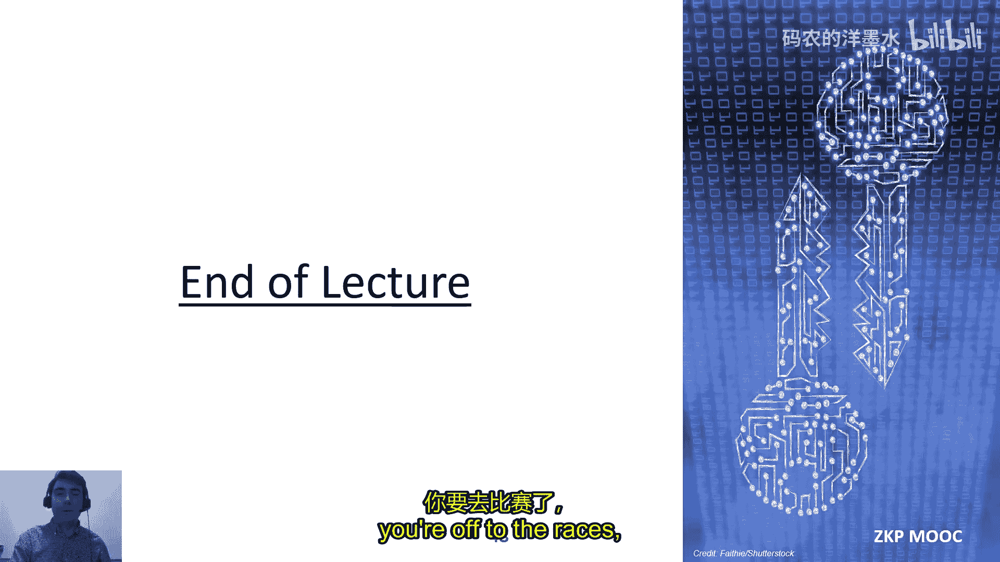

# 003：编程零知识证明

## 概述

在本节课中，我们将要学习如何将应用想法转化为零知识证明系统能够理解的格式。我们将探讨三种主要方法：使用硬件描述语言（如Circom）、使用高级语言中的库（如Arkworks）以及使用专门的编程语言及其编译器（如ZoKrates）。每种方法都有其优缺点，我们将通过实例来理解它们的工作原理。

---

## 从想法到算术电路

上一节我们介绍了零知识证明的基本概念，本节中我们来看看如何将应用逻辑转化为证明系统能处理的形式。

零知识证明系统不理解高级编程语言（如C、Python），它们理解的是**算术电路**或**约束系统**。因此，我们需要将想法转化为这种格式。

### 什么是算术电路？

算术电路类似于布尔电路，但其中的逻辑门（如AND、OR）被替换为**加法**和**乘法**门。所有运算都在一个**素数域**上进行，即整数模一个大素数 `p`。

例如，设 `p = 5`：
*   加法：`4 + 5 = 9 mod 5 = 4`
*   乘法：`4 * 4 = 16 mod 5 = 1`

算术电路可以看作是一个**有向无环图**：
*   **节点**：输入、加法/乘法门、常数、等式检查。
*   **边**：连接节点的导线，承载数值。

### 另一种表示：R1CS（秩1约束系统）

R1CS是另一种广泛使用的谓词表示方法。它定义如下：
*   公开输入 `x` 表示为 `L` 个域元素 `x1, ..., xL`。
*   私有输入 `w` 表示为 `M` 个域元素 `w1, ..., wM`。
*   谓词本身是 `n` 个约束的集合，每个约束形式为 `alpha * beta = gamma`，其中 `alpha`、`beta`、`gamma` 都是变量的**仿射组合**（线性组合加上常数）。

例如，约束 `w2 * (w3 - w2 - 1) = x1` 是有效的R1CS约束，因为 `alpha = w2`，`beta = (w3 - w2 - 1)`，`gamma = x1`。

R1CS也可以用矩阵来定义：给定三个矩阵 `A`、`B`、`C`，谓词成立当且仅当 `(A * z) ⊙ (B * z) = C * z`，其中 `z = [1, x, w]`，`⊙` 表示逐元素乘法。

---

## 方法一：使用硬件描述语言（HDL）—— Circom

上一节我们了解了算术电路和R1CS，本节中我们来看看如何使用Circom这种硬件描述语言来直接构建它们。

Circom是一种用于描述R1CS的HDL。与编程语言不同，HDL的核心对象是**导线**、**门**和**子电路**，核心操作是**连接导线**和**创建子电路**。

### Circom 基础语法

以下是Circom的一些核心概念和操作：

1.  **定义模板（电路）**：使用 `template` 关键字。
2.  **声明信号（变量）**：使用 `signal` 关键字声明输入和输出。
3.  **赋值与约束**：
    *   `<-`：为信号赋值（见证计算）。
    *   `===`：创建R1CS约束。
    *   `<==`：同时执行赋值和创建约束（简写）。

以下是一个简单的乘法电路示例：
```circom
template Multiply() {
    signal input x;
    signal input y;
    signal output z;

    z <== x * y;
}

component main {public [x]} = Multiply();
```

### Circom 高级特性

Circom支持模板参数、数组和循环，这些在编译时确定，有助于构建参数化电路。

以下是一个检查重复平方的电路示例：
```circom
template RepeatedSquare(n) {
    signal input x;
    signal output y;
    signal xs[n+1];

    xs[0] <== x;
    for (var i = 0; i < n; i++) {
        xs[i+1] <== xs[i] * xs[i];
    }
    y <== xs[n];
}



component main {public [x]} = RepeatedSquare(1000);
```

### Circom 教程：实现数独行约束检查器

现在，让我们通过一个简化的数独行约束检查器来实践Circom编程。我们只检查每一行没有重复数字。

以下是实现步骤的核心代码逻辑：
1.  **构建“不相等”组件**：检查两个输入是否不相等。
2.  **构建“互异”组件**：检查一个数组内的所有元素是否互不相同。
3.  **构建主电路**：将数独谜题（公开）和解（私有）作为输入，对每一行应用“互异”组件，并确保解中的数字在1-9范围内且与谜题中已给出的数字匹配。

（注：完整的Circom代码涉及循环、组件实例化和约束连接，具体实现可参考课程提供的示例代码库。）

编译并运行此Circom程序后，可以生成相应的R1CS，并用于后续的零知识证明生成与验证。

---

## 方法二：使用库方法 —— Arkworks

上一节我们使用Circom直接描述电路，本节中我们来看看如何在高级语言（如Rust）中使用库来构建约束系统。

这种方法的核心是**约束系统对象**，它维护着R1CS的矩阵 `A`、`B`、`C` 以及变量的赋值状态。主要操作包括：
*   `cs.add_var(...)`：创建新变量。
*   `LinearCombination::zero()` 和 `lc.add(...)`：创建线性组合。
*   `cs.enforce_constraint(...)`：添加约束（`lc_a * lc_b == lc_c`）。

### 库方法的优势



通过利用宿主语言（如Rust）的特性（结构体、枚举、运算符重载等），我们可以创建更高级、更易用的抽象。

例如，我们可以定义一个 `Boolean` 结构体，并重载 `&` 运算符，使得编写 `a & b` 就能自动生成对应的“与”门约束和见证计算，大大提升了开发体验和代码可读性。

### Arkworks 教程：实现数独检查器

让我们使用Arkworks的R1CS标准库来实现数独检查器。该库提供了许多常用原语（如整数、布尔值）的约束版本。

以下是实现的核心思路：
1.  **定义类型**：利用Rust泛型定义适用于任意大小 `N` 和域的数独谜题与解的类型。
2.  **检查行唯一性**：遍历每一行，对于行中的每个元素，检查它是否不等于该行中它之前的所有元素。这可以通过Rust的迭代器和切片语法简洁表达。
3.  **检查谜题与解匹配**：同时遍历谜题和解的每个对应单元格。断言：解中的数字必须在1-9范围内；并且，如果谜题中某单元格非零，则解中对应单元格必须与之相等。
4.  **测试**：编写测试用例，验证代码能接受有效解并拒绝无效解。

（注：具体代码涉及Arkworks特定的API调用，如分配变量、创建约束等，可参考课程示例。）

这种方法生成的约束系统可以轻松接入Groth16、Marlin等支持R1CS的零知识证明后端。

---



## 方法三：使用专用编程语言 —— ZoKrates

上一节我们使用库在宿主语言中显式构建约束，本节中我们来看看如何通过更符合直觉的编程语言来自动生成约束。

ZoKrates就是这样一种高级语言，它允许开发者像编写普通程序一样编写零知识证明的逻辑，然后由编译器将其编译为R1CS。

### ZoKrates 语言特性

ZoKrates支持许多现代语言特性：
*   **自定义类型**：通过 `struct` 定义。
*   **主函数**：程序入口 `main`，可以指定输入是公开还是私有。
*   **变量与断言**：使用 `assert` 关键字来施加约束，条件可以是任何布尔表达式。
*   **泛型、数组、循环、条件表达式**。

一个简单的ZoKrates程序示例如下：
```zokrates
def main(field x, private field y0, private field y1) -> bool:
    assert(x == y0 * y1)
    return true
```

### ZoKrates 的权衡



优点是**开发体验好**，语法直观，易于学习。缺点是**控制力减弱**，所有私有输入必须在 `main` 函数开始时提供，无法在程序执行过程中动态计算见证值，优化也更多地依赖编译器。

### ZoKrates 教程：实现数独检查器

在ZoKrates中实现数独检查器的逻辑与Arkworks版本非常相似，但语法更简洁。

以下是核心步骤：
1.  **定义类型**：使用二维数组定义谜题和解。
2.  **检查行唯一性**：使用嵌套的 `for` 循环遍历每一行和每个元素，内层循环检查当前元素不等于该行中之前的所有元素，使用 `assert` 进行约束。
3.  **检查匹配与范围**：遍历每个单元格，使用 `assert` 确保解的数字在1-9之间，并且满足“谜题单元格为0或等于解单元格”的条件。
4.  **编译与证明**：使用ZoKrates命令行工具进行编译、设置、计算见证、生成证明和验证。



（注：具体命令和文件操作可参考课程演示。）

---

## 总结与对比

本节课中我们一起学习了三种编程零知识证明的方法。现在我们来总结和对比它们。

### 三种方法的定位

我们可以从两个维度来理解这些工具：
1.  **描述对象**：是描述**电路合成**还是描述**程序**。
2.  **语法形式**：是**独立语言**还是**嵌入**在宿主语言中。

*   **Circom (HDL)**：独立语言，描述电路合成。
*   **Arkworks (库)**：嵌入在Rust中，描述电路合成。
*   **ZoKrates (PL)**：独立语言，描述程序。



### 优缺点分析

以下是每种方法的优缺点：

*   **Circom**
    *   **优点**：语法优雅，对约束有直接、清晰的控制。
    *   **缺点**：学习曲线较陡（HDL思维），抽象能力有限（无用户自定义类型等）。

*   **Arkworks (库方法)**
    *   **优点**：在保持对约束直接控制的同时，能利用宿主语言（Rust）的全部表达能力进行抽象。
    *   **缺点**：需要掌握宿主语言，通常需要手动优化约束数量。

*   **ZoKrates (编程语言)**
    *   **优点**：最容易学习，语义符合程序员直觉，语法可以设计得非常优雅。
    *   **缺点**：放弃了一些控制权，中间见证由编译器自动生成，优化可能更困难。

### 生态与未来

除了我们介绍的三种，生态中还有许多其他工具，例如Noir、Leo、Cairo等。尽管这些工具在输入表示和语法上各不相同，但它们最终都生成少数几种约束系统（如R1CS、AIR）。这意味着它们共享许多底层技术，例如布尔值表示、整数运算、控制流编码等。

未来的方向可能是创建更统一的基础设施或库，来封装这些通用技术，使得构建新的ZK编程语言更加容易。



**核心结论**：无论选择哪种方法，其共同目标都是将高级想法转化为**约束系统**，这是生成零知识证明的关键第一步。选择哪种工具取决于你对控制力、开发效率和语言熟悉度的权衡。