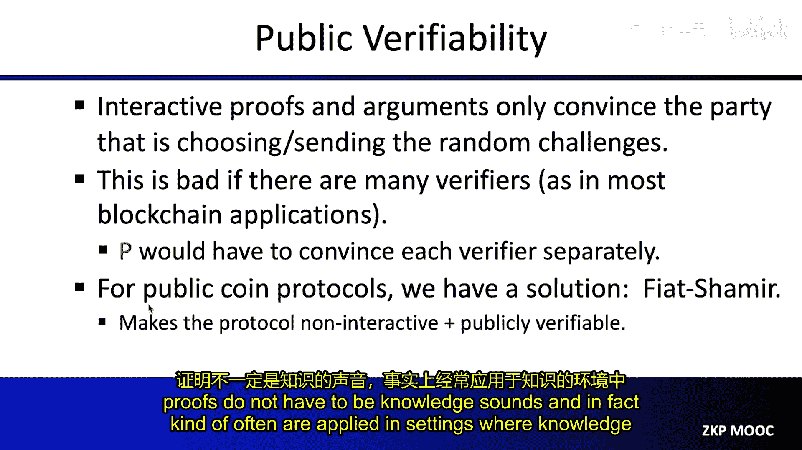
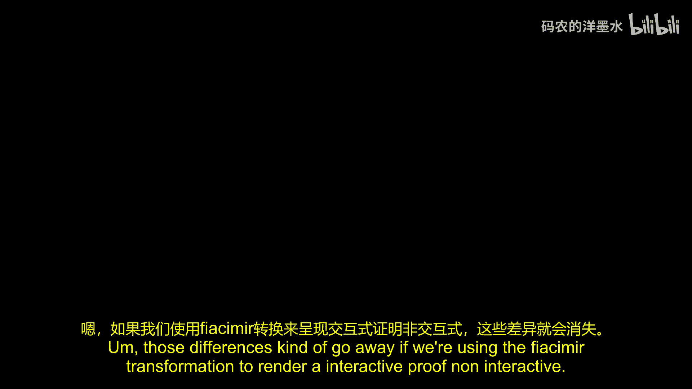
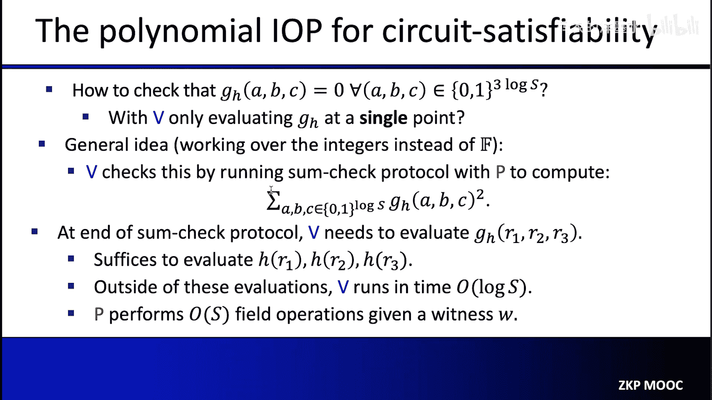

# 004：交互式证明

在本节课中，我们将学习零知识证明中的一个核心概念：交互式证明。我们将了解什么是交互式证明，它与我们最终目标——简洁非交互式知识论证（SNARK）——有何区别与联系，并学习一个名为“和校验协议”的经典交互式证明。最后，我们将看到如何利用这些工具构建一个用于电路可满足性问题的SNARK。

## 概述：什么是SNARK？

首先，让我们回顾一下SNARK的定义。SNARK是“简洁非交互式知识论证”的缩写。它本质上是一个关于某个陈述为真的简洁证明。

*   **简洁**：意味着证明本身很短，并且验证速度很快。
*   **非交互式**：意味着证明者和验证者之间不需要进行多轮消息交换。证明可以是一个独立的字符串，例如发布到区块链上供任何人验证。
*   **知识论证**：意味着如果证明者所声称的陈述不成立，那么任何计算能力有限的证明者都无法伪造出一个能说服验证者的证明。

一个简单的应用示例是：证明者声称知道一个消息 `M`，使得其哈希值 `hash(M) = 0`。一个平凡的证明系统是直接发送消息 `M` 本身。但如果 `M` 很大（例如一个1GB的视频文件），这个证明既不短，验证（重新计算哈希）也不快。SNARK的目标就是提供比这种平凡证明系统更优的验证成本。

## 交互式证明 vs. SNARK

在深入交互式证明之前，我们需要明确它与SNARK的三个主要区别。

1.  **交互性**：交互式证明要求证明者和验证者进行多轮对话（挑战与响应）。而SNARK是非交互式的。
2.  **健全性类型**：交互式证明要求**统计健全性**。这意味着，无论证明者拥有多么强大的计算能力（即使是无限算力），只要其初始声明是假的，验证者几乎总能发现并拒绝。SNARK是**知识论证**，它只要求对**多项式时间**的作弊证明者保持健全性。如果作弊者能破解某些密码学假设（如找到哈希碰撞），则可能伪造证明。
3.  **知识性**：SNARK要求**知识健全性**，即证明必须能表明证明者“知道”某个证据（例如，知道那个哈希为0的消息 `M`）。而交互式证明通常只要求**标准健全性**，即证明陈述为真，但不一定要求证明者“知道”证据本身。

有些场景下标准健全性有意义而知识健全性无意义（例如，证明一个复杂程序的输出是42，这里没有“证据”的概念）。而在密码学应用中（如证明知道一个私钥），知识健全性才是关键。

对于交互式证明，一个关键限制是：只有实际参与交互、生成随机挑战的验证者才会被说服。旁观者无法确信挑战是真正随机的。这限制了其在区块链等需要公开验证的场景中的应用。

幸运的是，对于“公开掷币”协议，我们可以通过 **Fiat-Shamir 变换** 将其转化为非交互式。该变换的核心思想是：将验证者生成的随机挑战，替换为对证明者已发送消息的哈希值。这样，证明者可以自行模拟出挑战，从而生成一个无需交互、可公开验证的证明字符串。本课程后续构建的SNARK都会应用此变换。

## 从交互式证明到SNARK的蓝图

我们的目标是构建一个用于**电路可满足性**问题的SNARK。即，证明者声称知道一个证据 `W`，使得电路 `C` 在输入 `W` 后输出特定值（例如0）。

平凡证明是直接发送 `W` 并让验证者重新计算电路。但这不满足“简洁”要求：`W` 可能很长，且电路计算可能很慢。

交互式证明可以帮助解决**验证速度**问题：证明者可以发送 `W`，然后通过一个交互式证明来说服验证者 `C(W)=0` 成立，而验证者无需亲自计算整个电路。

但这仍未解决**证明长度**问题，因为 `W` 本身还是被完整发送了。

最终的解决方案结合了密码学承诺：
1.  证明者不再直接发送 `W`，而是使用一个**密码学承诺方案**，对 `W` 生成一个简短的承诺。
2.  然后，证明者和验证者运行一个交互式论证（基于交互式证明改造而来），证明被承诺的 `W` 满足 `C(W)=0`。
3.  在此过程中，证明者会根据需要，仅**揭示**关于被承诺的 `W` 的少量信息，足以让验证者完成交互式协议中的检查。
4.  最后，应用 Fiat-Shamir 变换将整个流程变为非交互式，从而得到一个SNARK。

这里用到的承诺方案通常是**函数承诺**，例如多项式承诺、多线性多项式承诺或向量承诺。它们允许证明者先承诺一个函数（如多项式），后续再应验证者请求，揭示该函数在特定点的取值，并提供一个小证明证实该取值与承诺一致。

## Merkle树：一个经典的向量承诺

让我们看一个具体的向量承诺例子：**Merkle树**。它用于承诺一个向量 `U = (u1, u2, ..., ud)`。

*   **承诺阶段**：将向量元素作为叶子节点，两两哈希，层层向上，最终得到一个根哈希值。这个根哈希就是承诺。
*   **揭示阶段**：当验证者请求向量中第 `i` 个元素 `ui` 时，证明者发送 `ui` 以及从 `ui` 到根哈希路径上所有节点的**兄弟节点哈希值**。这被称为认证路径。
*   **验证阶段**：验证者利用 `ui` 和收到的兄弟哈希，沿着路径重新计算哈希，最终看是否得到与之前承诺一致的根哈希。

Merkle树的绑定安全性依赖于底层哈希函数的抗碰撞性。认证路径的大小和验证时间都是 `O(log d)`。

我们可以尝试用Merkle树来构造一个多项式承诺：将一个度数为 `d` 的多项式 `F` 在所有域元素上的取值作为一个向量进行Merkle承诺。当验证者请求 `F(r)` 时，就打开相应的叶子节点。

但这存在两个问题：
1.  **证明者效率低**：证明者需要计算并存储多项式在所有域元素（可能非常多）上的取值。
2.  **无法保证多项式结构**：Merkle树只承诺了一组值，验证者无法确信这组值来自一个低次多项式。

后续课程将介绍如何解决这些问题，构建真正高效的多项式承诺方案。

## 核心工具：多线性扩展与和校验协议

在介绍具体的交互式证明协议前，需要两个技术工具。

### 多线性扩展

对于一个定义在布尔超立方 `{0,1}^L` 上的函数 `f`，其**多线性扩展** `f̃` 是一个定义在更大域 `F^L` 上的多线性多项式（每个变量的次数最多为1），并且在 `{0,1}^L` 上与 `f` 完全一致。

多线性扩展具有“距离放大”的特性：如果两个布尔函数 `f` 和 `g` 哪怕只在一点上不同，它们的多线性扩展 `f̃` 和 `g̃` 也将在几乎整个 `F^L` 上都不同。这使得通过少量点值检查来探测布尔函数间的差异成为可能。

给定 `f` 在所有 `2^L` 个布尔输入上的取值，存在 `O(2^L)` 时间的算法可以计算其多线性扩展 `f̃` 在任何点 `r ∈ F^L` 上的值。

### 和校验协议

和校验协议是一个经典的交互式证明，用于解决以下问题：
*   **验证者**拥有对一个 `L` 变元多项式 `g` 的预言访问（可以请求 `g` 在任意点的值）。
*   **验证者**想计算 `H = Σ_{b∈{0,1}^L} g(b)`，即 `g` 在所有布尔输入上的取值之和。
*   直接计算需要 `2^L` 次查询和加法，代价高昂。

和校验协议的目标是让验证者将此繁重计算外包给证明者，而验证者只需做 `O(L)` 次本地计算和**1次**对 `g` 的查询。

**协议过程（简化描述）**：
1.  证明者声明总和 `C1 = H`。
2.  **第1轮**：证明者发送一个单变量多项式 `s1(x1)`，声称它等于 `h1(x1) = Σ_{b2,...,bL∈{0,1}} g(x1, b2, ..., bL)`。注意 `h1` 虽然定义涉及巨大求和，但其本身是低次多项式。
3.  验证者检查 `C1 = s1(0) + s1(1)`。然后随机选取点 `r1`，并验证 `s1(r1) = h1(r1)`。但验证者不知道 `h1(r1)`。
4.  于是问题归约到验证一个新声明：`s1(r1) = Σ_{b2,...,bL∈{0,1}} g(r1, b2, ..., bL)`。这变成了一个关于 `L-1` 个变量的类似求和问题。
5.  双方递归地进行上述过程，每一轮绑定一个变量到一个随机值。
6.  **最后一轮（第L轮）**：证明者发送多项式 `sL(xL)`，声称它等于 `g(r1, r2, ..., r{L-1}, xL)`。
7.  验证者随机选取 `rL`，并直接通过一次预言查询获得 `g(r1, ..., rL)` 的值，检查是否等于 `sL(rL)`。

如果证明者初始声明错误，验证者以极高概率拒绝。通信复杂度为 `O(L·d)`，其中 `d` 是 `g` 在每个变量上的次数。验证者时间为 `O(L·d)` 加上一次 `g` 的查询。

## 应用示例：计算图中的三角形数量

我们用一个具体问题展示和校验协议的威力：计算一个 `n` 个顶点图的三角形数量。输入是图的邻接矩阵 `A`（`n×n` 矩阵，`A[i][j]=1` 表示有边）。

直接计算需要 `O(n^3)` 或基于矩阵乘法的 `O(n^2.373)` 时间。我们将给出一个验证者时间为 `O(n^2)` 的交互式证明。

**关键步骤**：
1.  将邻接矩阵 `A` 视为一个定义在 `{0,1}^{log n} × {0,1}^{log n}` 上的函数。令 `Ã` 为其多线性扩展。
2.  定义一个新的三变量组多项式 `g(X, Y, Z) = Ã(X,Y) · Ã(Y,Z) · Ã(X,Z)`，其中 `X, Y, Z` 各为 `log n` 维变量。
3.  可以验证，三角形数量等于 `Σ_{x,y,z ∈ {0,1}^{log n}} g(x, y, z)`。
4.  对多项式 `g` 应用和校验协议。
    *   协议轮数：`3 log n`。
    *   每轮通信：`g` 在每个变量上次数为2，所以每轮证明者发送一个二次多项式（3个系数）。
    *   验证者最终需要求值 `g(r1, r2, r3) = Ã(r1,r2) · Ã(r2,r3) · Ã(r1,r3)`。
    *   根据之前结论，验证者可以在 `O(n^2)` 时间内计算 `Ã` 在这三个点上的值（因为需要读取整个矩阵来模拟预言）。
5.  因此，验证者总时间为 `O(n^2)`，远优于自己计算三角形数量。

## 构建SNARK for Circuit Satisfiability

现在，我们整合所有概念，勾勒一个基于和校验协议的电路可满足性SNARK框架。电路 `C` 有 `S` 个门，证明者声称知道证据 `W` 使得 `C(W) = y`。

**核心思想**：证明者不直接发送证据 `W`，而是承诺于整个电路计算的**正确执行轨迹** `T`。轨迹 `T` 是一个长度为 `S` 的向量，记录了当电路以 `W` 为输入运行时，每个门的输出值。

**步骤1：将轨迹编码为多项式**
1.  为每个门分配一个 `log S` 比特的标签。
2.  将轨迹 `T` 视为一个定义在布尔超立方 `{0,1}^{log S}` 上的函数：`T(门标签) = 该门输出值`。
3.  证明者计算 `T` 的多线性扩展 `H`，并（通过多项式承诺）将其发送给验证者。

**步骤2：构造校验多项式**
我们需要验证 `H` 确实扩展了一个正确的轨迹。正确性意味着每个门的赋值与其输入门的赋值符合电路逻辑（加法门输出等于输入和，乘法门输出等于输入积）。
1.  定义两个“布线谓词”的多线性扩展 `add̃` 和 `mul̃`。例如，`add̃(a,b,c)=1` 当且仅当门 `a` 是加法门且其两个输入来自门 `b` 和 `c`。
2.  构造一个三变量组多项式 `G_H(a,b,c)`，其设计使得：`G_H` 在所有布尔输入 `(a,b,c) ∈ {0,1}^{3 log S}` 上等于0，当且仅当 `H` 扩展了一个正确轨迹。
    `G_H` 的具体形式混合了 `add̃`, `mul̃` 和 `H` 在点 `a, b, c` 的取值，用于编码门之间的约束关系。
3.  关键性质：验证者要计算 `G_H` 在某点 `(r1, r2, r3)` 的值，只需要知道 `H(r1)`, `H(r2)`, `H(r3)` 以及 `add̃(r1,r2,r3)` 和 `mul̃(r1,r2,r3)` 的值。

**步骤3：使用和校验协议验证**
现在问题转化为：验证 `G_H` 在所有布尔输入上为零。
1.  一个技巧是验证 `Σ_{(a,b,c) ∈ {0,1}^{3 log S}} (G_H(a,b,c))^2 = 0`。在整数域上，该和为零当且仅当 `G_H` 在所有布尔输入上为零。
2.  对多项式 `(G_H)^2` 应用和校验协议。
    *   协议轮数：`3 log S`。
    *   验证者最终需要求值 `(G_H(r))^2` 在某随机点 `r` 的值。这需要知道 `G_H(r)`，进而需要知道 `H` 在三个点以及布线谓词在某点的值。
    *   `H` 的点值可通过多项式承诺的“打开”功能获得。布线谓词的点值可以预先计算并承诺，或由证明者提供并证明。
3.  如果和校验协议通过，则验证者以极高概率相信 `G_H` 在布尔超立方上为零，即 `H` 扩展了一个正确轨迹，从而证明者确实知道一个有效的证据 `W`。

**步骤4：转化为SNARK**
1.  上述过程是一个交互式论证。
2.  应用 Fiat-Shamir 变换，将验证者的随机挑战替换为证明者消息的哈希，从而获得一个非交互式论证。
3.  结合多项式承诺方案来承诺多项式 `H`，最终得到一个完整的SNARK。

在这个SNARK中，证明者复杂度主要来自多项式承诺方案的操作（如承诺和生成打开证明）以及计算和校验协议中的消息。验证者复杂度则是对数级的多项式处理加上少量的多项式承诺验证和点值计算。

## 总结

本节课我们一起学习了交互式证明及其在构建SNARK中的核心作用。

1.  我们首先明确了SNARK（简洁非交互式知识论证）的目标与特性。
2.  我们对比了交互式证明与SNARK在交互性、健全性类型和知识性上的关键区别。
3.  我们了解了如何利用密码学承诺（如Merkle树、多项式承诺）与Fiat-Shamir变换，将交互式证明转化为非交互式SNARK的蓝图。
4.  我们学习了多线性扩展这一重要工具，它能将布尔函数“放大”到更大域上，便于检测微小差异。
5.  我们深入探讨了经典的**和校验协议**，它允许验证者将大量求和工作外包，自己仅做少量计算和一次查询。
6.  我们看到了和校验协议的一个应用实例：高效验证图中三角形数量的计算。
7.  最后，我们勾勒了如何利用和校验协议构建一个用于电路可满足性问题的SNARK框架，其核心是将电路执行轨迹编码为多项式，并利用和校验协议验证该多项式满足电路约束。

交互式证明是构建现代SNARK的基石之一。理解其原理，特别是和校验协议，是深入掌握零知识证明技术的关键一步。在接下来的课程中，我们将看到更多基于这些思想的复杂协议和优化。