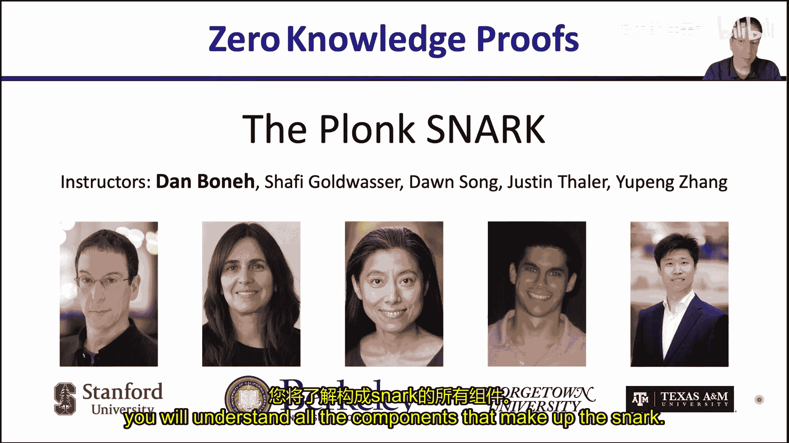
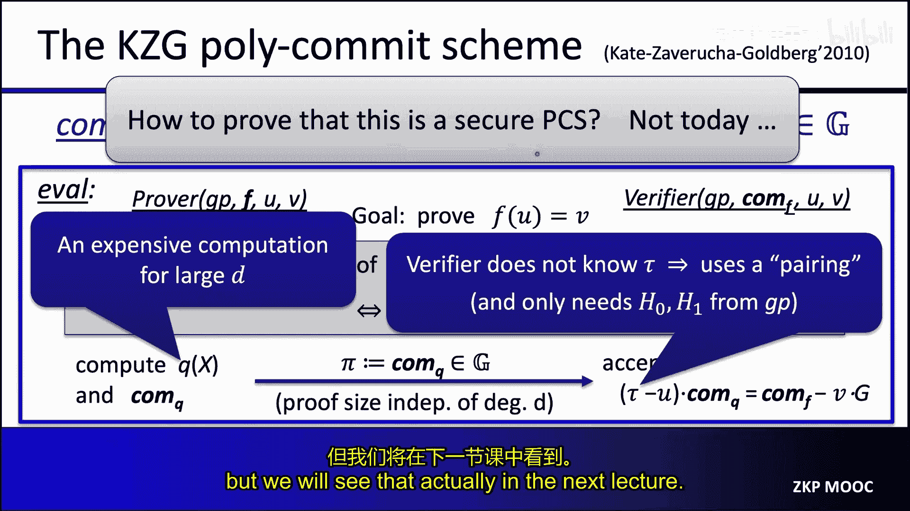
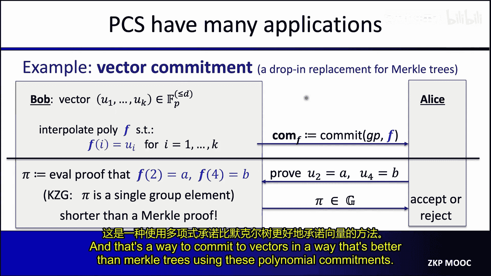
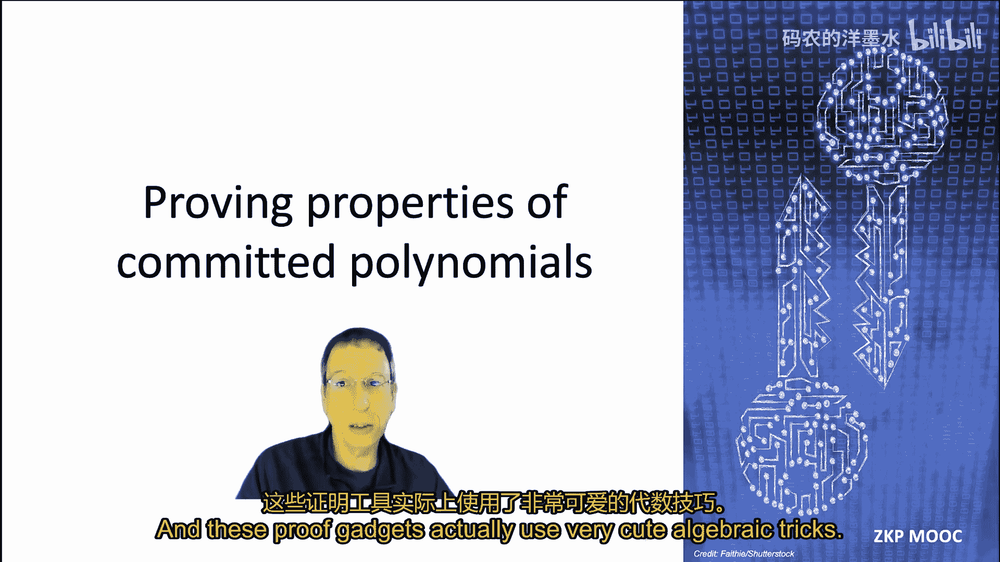
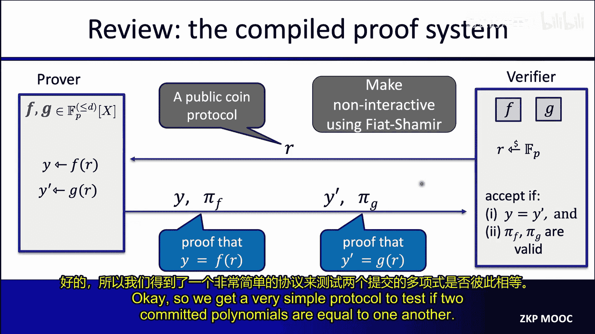
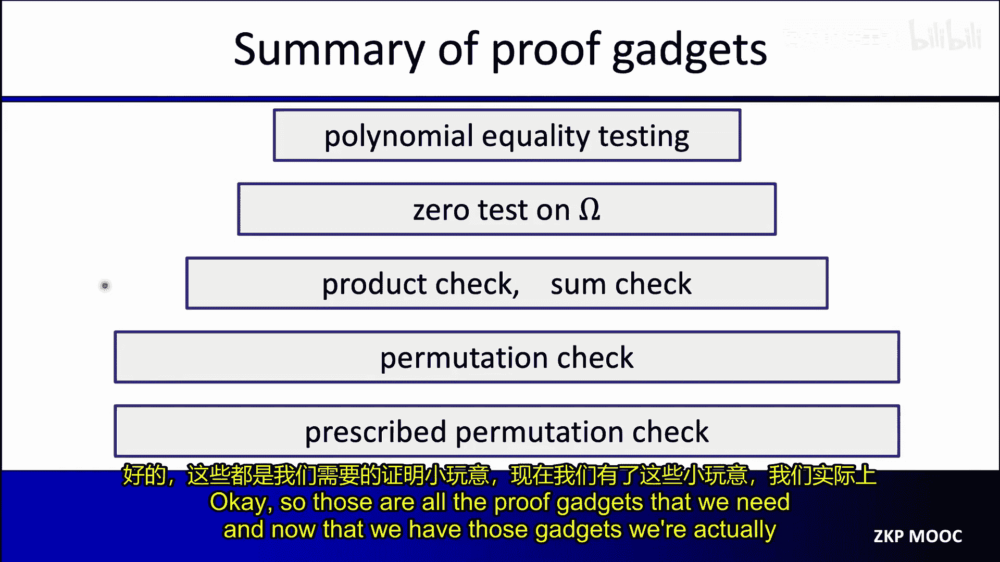
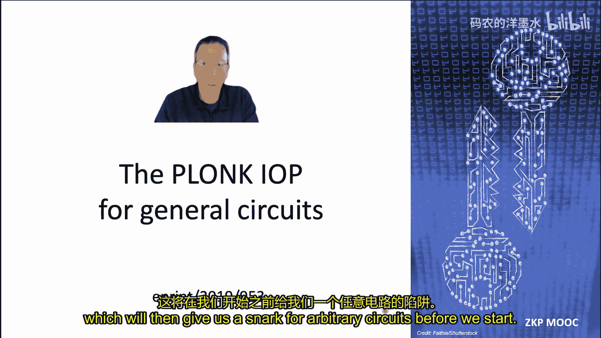
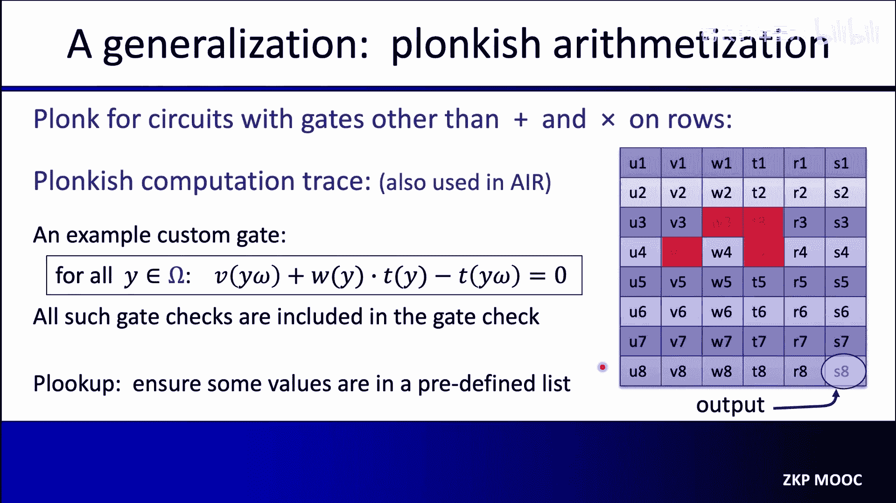
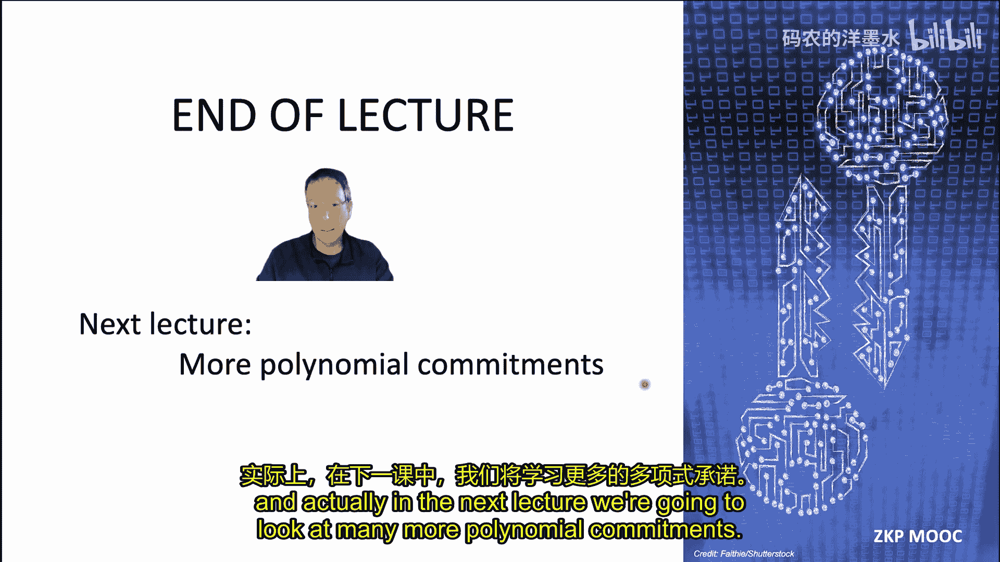

# 005：Plonk SNARK

## 概述

在本节课中，我们将学习如何构建一个广泛使用的SNARK系统——Plonk。我们将以模块化的方式逐步展开，确保在课程结束时，您能理解构成该SNARK的所有组件。事实上，我们将看到的许多组件本身就非常有趣且实用。

首先，让我们回顾一下SNARK的典型构建方式。我们从一个多项式承诺方案开始，将其与一个多项式交互式预言证明结合，从而得到我们想要的通用电路SNARK。

为了实现这一点，让我先提醒您什么是多项式承诺方案，然后我们将看一个具体的多项式承诺方案构造。

## 多项式承诺方案

一个多项式承诺方案允许承诺者对一个定义在有限域 **F_p** 上的特定多项式 **F** 进行承诺，且被承诺多项式的次数受限于某个上界 **D**。

承诺者承诺多项式 **F** 后，可以在其选择的任意点打开该多项式。具体来说，对于有限域中的公开值 **u** 和 **v**，承诺者可以说服验证者，被承诺的多项式满足 **F(u) = v**，并且该多项式的次数至多为 **D**。在这个证明中，验证者只知道次数的上界、对多项式的承诺以及值 **u** 和 **v**。

对于一个多项式承诺方案，我们希望证明大小和验证者时间至多是 **D** 的对数级别。例如，简单地将多项式发送给验证者是不可接受的，因为这会导致证明大小与 **D** 呈线性关系，验证时间也会是线性的，因为验证者必须评估多项式。我们的目标是构建非常简短且验证速度极快的评估证明。

一个非常广泛使用的多项式承诺方案叫做 **KZG** 多项式承诺方案，以开发者 Catez、Verruche 和 Goldberg 的名字命名。接下来，我们解释这个方案的工作原理。

首先，我们固定一个有限循环群 **G**。这个群包含 **p** 个元素，我们将其表示为 **0, g, 2g, 3g, ..., (p-1)g**。该群有一个加法规则，允许我们将两个元素相加。例如，给定元素 **2g** 和 **3g**，我们可以将它们相加得到元素 **5g**。请记住，这个加法是在模 **p** 下进行的。

现在我们有了这个阶为 **p** 的群 **G**，让我们看看承诺方案实际上是如何工作的。

首先，我们有一个设置过程来生成一些全局参数。设置过程将接受一个安全参数 **λ**，并采样一个随机的域元素 **τ**，然后按如下方式构造全局参数：全局参数的第一个元素是生成元 **g**，我们将其表示为 **h_0**。第二个元素是 **τ * g**，我们称之为 **h_1**，然后是 **τ^2 * g, τ^3 * g, ..., τ^D * g**，我们将其表示为 **h_D**。因此，全局参数总共包含 **D+1** 个群元素。

重要的是，生成全局参数后，运行设置过程的实体必须删除这个域元素 **τ**。这非常关键。如果 **τ** 泄露，那么就可以破坏承诺方案，即可以产生不正确的评估证明。因此，必须确保没有人知道 **τ** 的值。我们需要信任运行设置过程的实体删除 **τ**。在下一讲中，我们将讨论运行此设置过程的方法，以确保没有人知道 **τ** 是什么。我们通过在许多参与方之间运行设置过程来实现这一点，只要其中一方是诚实的，就没有人知道 **τ**，从而确保全局参数是安全的。

现在，假设某个可信方运行了设置过程，生成了全局参数，然后删除了值 **τ**。

要对多项式 **F** 进行承诺，我们使用一个承诺字符串，它本身是一个群元素。因此，`comm(F)` 只是群中的一个元素，定义为被承诺多项式 **F** 在 **τ** 处的取值乘以生成元 **g**，这基本上给了我们一个群元素。

现在您可能会想，我刚刚告诉您 **τ** 已被删除，所以没有人知道 **τ** 的值。那么承诺者如何在不了解 **τ** 的情况下计算 **F(τ) * g** 呢？答案是承诺者实际上将使用全局参数来承诺多项式 **F**。

让我们看看这是如何完成的。我们将多项式 **F** 以系数形式写出。承诺多项式 **F** 的方法基本上是计算 **f_0 * h_0 + f_1 * h_1 + ... + f_D * h_D**。展开后，您会发现我们只是将全局参数的各种元素的值代入。例如，**h_2** 被替换为 **τ^2 * g**，一旦我们将 **g** 从括号中提出，就得到 **F(τ) * g**。实际上，我们在这里计算的承诺字符串就是 **F(τ) * g**，它作为对多项式的承诺。

我想指出的一点是，这是一个绑定性承诺，承诺者现在被绑定到多项式 **F**，但它不是一个隐藏性承诺，因为多项式 **F** 的某些信息被泄露了。具体来说，我们泄露了 **F(τ) * g**。这对我们的目的来说是可以接受的，一个绑定的但不隐藏的承诺就足够了。

现在我们知道如何承诺一个多项式了。下一个问题是如何进行评估证明。这是这里有趣的地方。

我在这里再次写下了承诺算法：对多项式 **F** 的承诺就是 **F(τ) * g**。问题是，我们如何进行评估证明？这里，证明者拥有全局参数、多项式 **F** 以及 **u** 和 **v**。另一方面，验证者只有对多项式 **F** 的承诺，它没有明文的多项式 **f**。证明者希望说服验证者，被承诺的多项式满足 **F(u) = v**。

让我向您展示这是如何完成的技巧。首先，您注意到如果 **F(u) = v**，这意味着 **u** 必须是多项式 **F - v** 的一个根。如果我们评估多项式 **F - v** 在点 **u** 处，会得到 0，这意味着 **u** 是多项式 **F - v** 的一个根。我们用 **F_hat** 表示这个多项式。

现在，**u** 是 **F_hat** 的一个根意味着什么？这意味着线性多项式 **x - u** 必须整除 **F_hat**。如果 **u** 是 **F_hat** 的一个根，那么 **F_hat** 必须将线性多项式 **x - u** 作为其因子之一。但这意味着存在某个商多项式 **Q**，使得 **Q * (x - u) = F - v**。我们得到了这个多项式等式，当且仅当 **F(u) = v**。我们将反复使用这个事实。

使用这个事实，评估证明的工作方式如下：证明者将计算商多项式 **Q**，并实际上承诺这个商多项式 **Q**。因此，它将计算对应于这个商多项式的承诺的单个群元素，实际上，这个单个承诺将构成我们的评估证明 **π**。因此，证明者向验证者发送一个群元素，这个群元素作为对多项式 **Q** 的承诺。这已经足以说服验证者 **F(u) = v**。

这里有趣的一点是，证明大小远优于 **D** 的对数级别；证明大小是常数大小，即群 **G** 中的单个元素。因此，我们拥有如此简短的评估证明是相当了不起的。这就是为什么 KZG 多项式承诺方案如此受欢迎。

现在验证者如何验证这个证明？验证者将简单地检查这个多项式等式在点 **τ** 处成立。让我们将 **τ** 代入这个关系式，我们得到 **x - u** 变为 **τ - u** 乘以对多项式 **Q** 的承诺，应该等于对多项式 **F** 的承诺减去对常数多项式 **v** 的承诺。验证者验证这个多项式等式实际成立的方式是验证它在随机点 **τ** 处成立。我们知道，如果两个多项式在一个随机点处一致，那么只要它们有界次数，这两个多项式极大概率是相等的。

这里，验证者检查这个关系在点 **τ** 处成立，这意味着这个多项式等式实际上成立。

再次，当您查看这个等式时，您可能会想，验证者实际上如何检查这个等式成立？验证者不知道 **τ**，那么验证者如何实际检查这个关系成立？答案是，为了做到这一点，验证者使用一种称为配对的代数工具。我暂时不解释这一点，实际上我们将在下一讲中更详细地了解这是如何工作的。但有趣的是，这个配对允许验证者检查下面这个等式是否按需成立，而无需实际知道值 **τ**。事实证明，它只需要全局参数中的 **h_0** 和 **h_1**，因此即使全局参数可能相当大，验证者也只需要 **GP** 中的前两个元素来验证评估证明。

我们看到证明实际上是常数大小，事实上，验证证明所花费的时间也与次数 **D** 无关。这是可能实现的，这有点了不起，但这是使 SNARK 成为可能的基本事实。

现在我应该指出，计算商多项式对证明者来说可能是一个相当大的计算。事实上，如果多项式 **F** 的次数很高，比如多项式的次数是十亿或更多，那么现在证明者必须操作次数为十亿的多项式来构造这个商多项式并承诺它。

这就是我想说的关于 KZG 构造以及我们如何进行评估证明的全部内容。您可能想知道为什么这是安全的，特别是为什么这个评估证明能说服验证者 **F(u) = v**。我们将在下一讲中看到为什么这是安全的。

KZG 多项式承诺方案实际上具有许多非常有趣的特性，我们将在整个讲座中使用。

首先，将承诺方案推广到不仅仅承诺单变量多项式实际上并不困难。事实上，我们可以承诺 **k** 变量多项式。

两个、三个、四个、五个变量等的多项式，这实际上是我们上一讲所需要的，但我们在这里不会使用它，我们只承诺单变量多项式。

有趣的是，KZG 还支持非常高效的批量证明。假设我对许多多项式进行了承诺，在这种情况下，我承诺了 **n** 个不同的多项式。假设证明者希望说服验证者，这些多项式中的每一个在多个点处都评估为特定值。对于所有的 **i** 和 **j**，证明者希望说服验证者 **F_i** 在点 **u_{i,j}** 处等于 **v_{i,j}**。假设它有五个多项式和十个点，它希望说服验证者这五个多项式在这十个点中的每一个都评估为特定值。在这种情况下，它将是五个乘以十个，即五十个打开证明。了不起的是，我们实际上可以将所有这些证明批量处理成一个单一的证明。因此，即使表面上看起来这需要五十个评估证明，实际上，KZG 具有这样的特性：所有这些证明都可以批量处理成一个群元素。因此，只需要一个群元素就足以证明所有这些多项式在所有不同点的所有这些打开。

我们也将大量使用这个特性。

我想提到的 KZG 的另一个特性是它还支持线性时间承诺。证明者承诺一个多项式的时间实际上只是多项式次数的线性时间。让我们看看为什么这是真的。

首先，如果我们有多项式以所谓的系数表示形式写出，即我们实际上将多项式 **f** 写成这些单项式的和，这是描述多项式的标准方式，那么计算对多项式 **f** 的承诺，正如我们所见，可以在线性时间内完成，它基本上是群 **G** 中的线性数量的乘法。因此，这将在多项式次数上花费线性时间。

然而，还有另一种表示多项式的方式，实际上我们将使用这种方式，即所谓的点值表示。什么是点值表示？这里我们固定一堆输入，例如 **a_0** 到 **a_D**，并给出多项式在这些点 **a_0** 到 **a_D** 处的评估值。您可以看到，这些 **D+1** 对实际上定义了一个多项式。例如，需要三个点来确定一个抛物线，所以当 **D=2** 时，这将需要三个点。一般来说，如果我们有一个次数为 **D** 的多项式，我们需要它在 **D+1** 个点处的评估值来完全确定该多项式。

问题是，如果我们有多项式的点值表示，我们如何快速承诺该多项式？简单的答案可能是：让我们取给定的点值表示，将其转换为系数表示 **f_0** 到 **f_D**，然后像之前看到的那样，在线性时间内承诺系数表示 **f_0** 到 **f_D**。问题在于，从点值表示转换到系数表示实际上需要 **D log D** 的时间，使用一种称为数论变换的算法，它与快速傅里叶变换密切相关。我们不会讨论这个。您只需要知道，从点值表示到系数表示需要 **D log D** 的时间。但我们希望以 **D** 的线性时间，即真正线性于 **D** 的时间来承诺一个多项式。这个 **log D** 有点碍事，当多项式的次数相当大时，如果多项式的次数是 2^20 或 2^30，**log D** 就像一个 20 或 30 的因子，会减慢承诺多项式的时间。我们希望节省这个时间，简单地拥有一个在 **D** 上线性运行的承诺算法。

问题是，如何做到这一点？事实证明，我们可以做得相当漂亮。再次假设我们有多项式的点值表示。我们可以做的是查看所谓的拉格朗日插值，这是一种从其点值表示插值多项式的方法。拉格朗日插值的工作方式基本上是，我们将 **F** 在某个点 **τ** 处的值计算为一些拉格朗日多项式的和。这些是 **λ_i**，这些拉格朗日多项式将在 **τ** 处评估，乘以 **F(a_i)**，这些是给我们的值。

现在，拉格朗日多项式不依赖于多项式的值。它们只依赖于点 **a_0** 到 **a_D**。实际上，我可以向您展示这些拉格朗日多项式是什么。让我们写出它们的表达式。这里，**λ_i** 在点 **τ** 处，我写出了它的表达式。您可以看到，**τ** 只出现在分子中，其他所有内容都是标量常数。因此，您可以看到这些多项式是由这个方程定义的，它们只依赖于我们评估多项式的点，而不依赖于多项式的实际值。

这被称为拉格朗日插值。如果您以前没有见过拉格朗日插值，我建议您阅读一下，因为这实际上是一项非常重要的技术。它在操作多项式时经常出现。

那么，这如何帮助我们呢？我们将要做的是将全局参数转换为所谓的拉格朗日形式。这基本上只是一个线性变换，任何人都可以执行这个变换，从全局参数的原始格式转换到拉格朗日形式。这不涉及任何秘密，任何人都可以做到，这只是一个线性变换，然后任何人都可以自行计算。但是，这个拉格朗日形式是什么？基本上，我们不是让全局参数为 **g, τg, τ^2g, τ^3g, ..., τ^Dg**，而是要用拉格朗日系数替换它。因此，**h_0_hat** 将是 **λ_0(τ) * g**，**h_1_hat** 将是 **λ_1(τ) * g**，直到 **λ_D(τ) * g**。这基本上将成为新的全局参数。再次强调，这与原始全局参数完全等价。您可以通过线性变换在旧全局参数和新全局参数之间来回转换。这是一个相当简单的变换。

但这样做的好处是，现在即使我们被给予点值形式的多项式，我们也可以在线性时间内承诺该多项式，因为根据拉格朗日插值公式，我们知道要计算 **F** 在点 **τ** 处的值，我们只需取拉格朗日系数的线性组合。具体来说，要计算 **F(τ) * g**，我们可以简单地取我们被给予的多项式值的线性组合乘以修改后的全局参数中的群元素。现在您可以看到，多项式值和全局参数元素之间的简单内积给出了对多项式 **F** 的承诺。再次，您看到这在次数 **D** 上是线性时间运行的。这比 **D log D** 好得多。当 **D** 像 2^20 或 2^30 时，这个算法将比简单方法快 20 到 30 倍。

因此，通常当人们编写全局参数时，他们以拉格朗日基的形式编写，而不是我们之前看到的标准方式。

我想告诉您的关于 KZG 承诺的最后一点是另一个有趣的特性，值得记住，那就是我们可以相对快速地一次生成许多证明。再次假设证明者有某个多项式 **f**，让我们固定有限域的某个子集，我们将其表示为 **Ω**，假设这是我们的有限域 **F_p** 的一个大小为 **D** 的子集。假设证明者需要为多项式 **f** 为所有 **a ∈ Ω** 构造评估证明。因此，它需要为每个 **a ∈ Ω** 一个 KZG 评估证明 **π_a**。简单的方法，您会一次生成一个评估证明。每个评估证明需要 **D** 的时间来生成。因此，如果您必须生成 **D** 个证明，简单生成这些 **D** 个证明将需要 **D^2** 的时间。

2020 年有一个非常聪明的算法，称为 FK 算法。它表明，如果 **Ω** 恰好是有限域的一个乘法子群，那么实际上我们可以在 **D log D** 的时间内生成所有 **D** 个证明。这比 **D^2** 好得多。如果 **Ω** 只是大小为 **D** 的有限域的任意子集，事实证明我们仍然可以更快地完成，但现在需要 **D log^2 D** 的时间，仍然比 **D^2** 好得多。顺便说一下，这种差异是当我们选择子集 **Ω** 时，我们实际上将其选择为有限域的乘法子群的原因之一，我们稍后会看到。

最后，我想提一下，正如我们所见，KZG 多项式承诺方案存在一些问题。首先，KZG 承诺方案需要一个可信设置来生成全局参数。具体来说，我们必须确保没有人知道秘密值 **τ**。如果有一个单一的实体生成参数，它必须在完成后擦除 **τ**。通常人们做的是使用分布式协议生成全局参数，我们将在下一讲中看到，这样只要协议中有一方是诚实的，就没有人知道值 **τ**，全局参数就是安全的。

KZG 的另一个问题是全局参数的大小与 **D** 的大小呈线性关系。因此，如果 **D** 像十亿，那么全局参数的大小将是许多 GB，相当大。因此，一个自然的问题是，我们是否可以在与 KZG 相同的假设下构建多项式承诺方案，但不需要可信设置，并且全局参数要小得多。事实证明，这是可以做到的。有一个叫做 Dory 的承诺方案，同样非常漂亮。我在这里放了一篇论文的链接，以防您想了解 Dory 的工作原理。

首先，没有可信设置。因此，我们不必信任任何人在生成参数时忘记任何秘密信息。对多项式的承诺仍然是一个与次数 **D** 无关的单个群元素，就像在 KZG 中一样。然而，现在评估证明更大了。在 KZG 中，评估证明是常数大小，它是一个群元素。在这里，评估证明将是次数 **D** 的对数级别。因此，它们比 KZG 证明要大得多。此外，对于验证者检查证明，验证者现在必须工作与 **log D** 成正比的时间，而在 KZG 中，验证者只需要工作与次数 **D** 无关的常数时间。

因此，知道这个方案存在是好的，但由于证明更大且验证时间更长，这些证明并不像 KZG 承诺方案那样被广泛使用，在大多数应用中，人们最终使用 KZG 承诺方案。

现在我想提一下，多项式承诺方案有许多应用。它们不仅用于构建 SNARK。让我向您展示一个非常简单的应用。这些多项式承诺方案为我们提供了 Merkle 树的直接替代品。

如果您记得，Merkle 树允许我们承诺一个向量。如果我有一个向量 **u_1** 到 **u_K**，我可以使用 Merkle 树承诺这个向量，然后，我可以使用一个非常简短的证明说服验证者 **u_5** 等于特定值，这就是 Merkle 树让我们做的。我们可以承诺一个大的向量，然后只在一点打开该向量，并快速说服验证者该点被正确打开。

事实证明，多项式承诺方案实际上让我们做同样的事情，但更好。让我们看看如何做到。首先，我们承诺一个向量 **u_1** 到 **u_K** 的方式如下：我们将插值一个多项式 **f**，使得对于所有 **i** 从 1 到 **K**，**f(i) = u_i**。这定义了一个次数为 **K-1** 的多项式，因为它由 **K** 个点定义。我们继续承诺这个多项式，并将该承诺发送给验证者 Alice。

使用 KZG 承诺方案，这将是一个发送给 Alice 的单个群元素。现在，假设 Alice 希望证明者说服她向量的第二个元素是值 **a**，第四个元素是值 **b**。证明者可以做的就是产生一个评估证明，证明 **f(2) = a** 和 **f(4) = b**，并将此评估证明发送给 Alice，Alice 将检查证明并接受或拒绝该证明。

我告诉过您关于批量证明的事情。KZG 承诺的有趣之处在于，简单来说，我们需要两个评估证明来证明这两个陈述，但实际上，使用批量证明，这两个陈述可以用一个群元素来证明。因此，证明者所要做的就是发送一个群元素，验证者将相信 **u_2 = a** 且 **u_4 = b**。这实际上比 Merkle 证明短得多，如果您记得，如果您需要在 **L** 个点打开，您将必须提供 **L** 个 Merkle 证明。每个 Merkle 证明的大小将是 **log K**。因此，您将不得不发送 **L * log K** 个哈希值，而使用 KZG 承诺方案在 **L** 个点打开向量，您只需要发送一个与 **L** 和 **K** 都无关的单个群元素。这非常了不起，比 Merkle 证明短得多。

如果您想了解更多关于使用多项式承诺方案的向量承诺，我建议您查找术语“Verkle 树”。这是一种使用这些多项式承诺来承诺向量的方式，比 Merkle 树更好。

好的，这把我们带到了...

## 证明承诺多项式的性质

欢迎回来。在上一节中，我们看到了如何使用 KZG 承诺方案承诺一个有界次数的多项式。在本节中，我们将看到如何证明一个被承诺多项式的性质。这些证明小工具实际上使用了非常巧妙的代数技巧。让我们开始吧。

首先，证明承诺多项式的性质意味着什么？在我们的设置中，证明者将拥有一些多项式，比如 **F** 和 **G**，以明文形式可用。验证者将只有对这些多项式的承诺。我将使用框中的多项式来表示对多项式的承诺。这可以是对多项式的 KZG 承诺或使用任何其他承诺方案的承诺。

现在，证明者试图做的是，它希望说服验证者多项式 **f** 和 **G** 满足某些性质，我们将看到许多关于这意味着什么的例子。因此，我们将这些证明系统呈现为交互式预言证明。我的意思是，验证者将向证明者发送一些随机消息，证明者将发回一些可能依赖于验证者数据的多项式，最后验证者将在 **F_p** 中的一些随机点查询一些被承诺的多项式，然后它将决定接受或拒绝。

在描述这些证明系统时，我只说验证者在某个点查询 **F** 和 **G**，但在您的脑海中，您应该已经将其编译成一个真实的证明系统，其中验证者在某个点查询 **f** 和 **g** 意味着什么？这意味着验证者将向证明者发送一些点，证明者将用多项式在这些点处的评估值以及一个评估证明来响应，以证明证明者正确评估了被承诺多项式在请求的点处。

让我们做一个简单的例子，通过回忆这个整个领域的基本构建块之一来做到这一点，即基本上如何测试两个被承诺的多项式彼此相等，我们称之为多项式相等性测试，我们用于此的基本工具是我们在之前的讲座中已经看到的。让我非常简要地提醒您那是什么。假设我们在一个大素数域上工作，并且假设我们的多项式有界次数，比如次数小于 2^40，这样次数相对于域的大小可以忽略不计。那么，如果我们想测试两个多项式 **f** 和 **G** 相等，我们使用这个基本事实：如果我们在有限域中选择一个随机点，并测试这两个多项式在这个随机点处相等，如果值相等，那么这两个多项式也极大概率相等。事实上，正如您可能记得的，我们看到犯错的概率最多是 **D / p**，这是可以忽略不计的。这为我们提供了一种非常简单的方法来测试两个被承诺的多项式是否彼此相等。同样，我们选择一个随机点，并检查这两个多项式在随机点处是否相等。

因此，再次强调，证明者将以明文形式拥有多项式 **f** 和 **G**。这些是有界次数的多项式，以次数 **D** 为界。验证者将拥有对这些多项式 **f** 和 **G** 的承诺。同样，这些框中的 **f** 和 **g** 表示对多项式的承诺。

现在，交互式预言证明的工作方式非常简单。基本上，验证者将在有限域中选择一个随机点，它将向证明者发送一个随机点，并要求证明者评估多项式 **f** 和 **G** 在这个随机点 **r** 处。因此，我将此描述为查询 **f** 和 **G** 在 **r** 处。验证者然后将学习 **f(r)** 和 **G(r)**，如果两者相等，它将接受，并说“是的，这两个被承诺的多项式确实是同一个多项式”。

再次强调，只是为了确保这一点非常清楚。当我们将其编译为实际的证明系统时，验证者将发送一个随机点。证明者将评估多项式 **f** 和 **G** 在随机点处，并将发回评估值 **y** 和 **y'**，以及评估证明，以证明评估是相对于被承诺多项式正确完成的。验证者将验证，事实上，这两个评估值彼此相等，并且评估证明是有效的，如果是这样，它将接受。

但再次强调，作为简写，当我们描述这些证明小工具时，我只说验证者查询多项式 **F** 和 **G** 在点 **r** 处，然后检查两个评估值相同，在您的脑海中，我希望您将其编译成一个证明系统，其中评估由证明者完成，证明者发回评估值和证明，证明评估是相对于被承诺多项式正确完成的。

当然，您注意到这是一个公开掷币协议。验证者在这里所做的只是发送随机域元素，它不保留任何秘密。因此，我们可以使用 Fiat-Shamir 变换将其编译成非交互式协议。

好的，我们得到了一个非常简单的协议来测试两个被承诺的多项式是否彼此相等。

关于这个非常简单的协议，我想再提一点，那就是当我们使用 KZG 承诺时，如果您记得我们描述 KZG 承诺的方式，我们将其描述为确定性承诺方案，这意味着如果两个多项式彼此相等，它们的承诺也将彼此相等。因此，您应该问，为什么我们要描述这样一个复杂的协议，如果验证者可以自行测试 **F** 是否等于 **G**？它简单地测试它拥有的两个承诺是否彼此相等，如果是，它就已经自行知道这两个多项式相等了。嗯，事实证明，如果我们做一些稍微复杂的事情，就需要这个协议。特别是，也许证明者有一堆多项式 **F, G1, G2, G3**，而验证者只有对这些多项式的承诺。证明者想要向验证者证明的是，实际上 **F** 恰好等于所有三个多项式 **G1 * G2 * G3** 的乘积。现在验证者不能仅仅检查承诺的相等性，因为它没有对三个多项式乘积的承诺，它只有对这些多项式各自的承诺。因此，我们将做的是，验证者将在随机点查询所有四个多项式，然后如果 **f(r) = G1(r) * G2(r) * G3(r)**，它将接受相等性为真。是的，验证者在这里需要做一点工作，基本上必须计算 **G1(r) * G2(r) * G3(r)** 的乘积，并测试其是否等于 **f(r)**。

事实上，只要 **3D / p** 可以忽略不计，这个协议就是完备且可靠的。**3D** 的原因是因为多项式 **G1 * G2 * G3** 的次数是 **3D**，因此可靠性误差，即验证者犯错的概率，最多为 **3D / p**，当然，如果 **p** 足够大，这将是一个可以忽略的值。

好的，现在我们理解了多项式相等性测试是如何工作的，让我们将其投入使用，我们将从三个非常重要的单变量证明小工具开始。为了呈现这些小工具，让我们固定有限域的某个子集，我将其称为子集 **Ω**，假设这是我们的有限域 **F_p** 的一个大小为 **K** 的子集。

现在，假设我有一个次数为 **D** 的特定多项式，多项式的次数，比如说，远大于 **Ω** 的大小。假设验证者对这个多项式 **f** 有一个承诺。

证明者希望向验证者证明的关于这个多项式的事情如下。

第一个是所谓的零测试。什么是零测试？在零测试中，证明者希望说服验证者，实际上多项式 **f** 在集合 **Ω** 上恒等于 0。现在我想强调，这并不意味着多项式 **f** 在 **Ω** 之外处处为 0。多项式 **F** 可以在 **Ω** 之外取任意值，但在集合 **Ω** 上，多项式必须为 0。因此，**F** 不是零多项式。它恰好只在集合 **Ω** 上为 0。您注意到，因为多项式的次数可能远大于集合 **Ω** 的大小，多项式 **f** 在 **Ω** 之外非零而在 **Ω** 上完全为 0 是完全合理的。好的，我们将其称为零测试。这是证明系统中一个非常重要的构建块，我将在一分钟内向您展示如何进行零测试。

证明者可能希望说服验证者的下一件事是所谓的和校验，即 **f** 在集合 **Ω** 上的评估值之和。您看到这里我们对 **Ω** 中的所有元素求和，并求和 **f** 在这些元素上的评估值，该和恰好等于 0。因此，同样，和校验是一个非常重要的证明小工具，将在课程中反复出现，目标是让证明者说服验证者评估值之和恰好等于 0。类似地，还有一个积校验，除了使用乘积外，其他相同。因此，不是证明和等于 0，现在证明者希望说服验证者，如果您取多项式 **F** 在 **Ω** 的点上的所有评估值的乘积，该乘积评估为 1。

好的，这些是证明者希望说服验证者的三件基本事情，我们将为不同的多项式应用这三个不同的任务。

好的，我想向您展示这些协议是如何工作的。因此，首先，我们必须引入一个非常重要的概念，称为消失多项式。好的，让 **Ω** 再次成为我们有限域的子集，它的大小为 **k**。

集合 **Ω** 的消失多项式，我们表示为 **Z_Ω**，基本上是一个在集合 **Ω** 上处处为 0 的多项式。是的，该多项式定义为 **∏_{a ∈ Ω} (x - a)**，显然，如果您代入集合 **Ω** 中的任何值，这个消失多项式将评估为 0。在 **Ω** 之外，当然，多项式可以评估为任意值，但在集合 **Ω** 上，这个多项式将始终评估为 0。现在，当然，消失多项式 **Z_Ω** 的次数恰好是集合 **Ω** 的大小，在我们的情况下恰好是 **K**。因此，请记住，这是一个次数为 **K** 的多项式，在 **Ω** 上处处为 0。

现在有一个特定的集合 **Ω** 对我们来说非常非常重要，那就是集合 **Ω**，它恰好是有限域的一个乘法子群。我是什么意思？让我们固定有限域中的某个元素 **ω**。并假设 **ω** 是一个本原 **K** 次单位根。这意味着基本上 **ω^K = 1**，但 **ω** 的幂次小于 **K** 时不等于 1。因此，我们可以将 **Ω** 设置为 **ω** 的所有幂次。是的，所以 **1, ω, ω^2, ..., ω^{K-1}**。这将是有限域的一个大小为 **K** 的子集。

在这种情况下，您可能记得高中代数，在 **K** 阶的所有本原单位根处为 0 的多项式就是多项式 **x^K - 1**。事实上，很容易看出，如果您代入这些点中的任何一个，那么 **x^K - 1** 将评估为 0。关于这个多项式的有趣之处，以及我们喜欢这个特定集合 **Ω** 的原因是，如果您想在点 **r** 处评估消失多项式，那么评估它基本上只需要计算 **r^K** 并减去一。计算 **r^K** 可以使用重复平方算法仅用大约 **log K** 次域操作完成。这表明，如果我们使用这个特定的集合 **Ω**，那么它的消失多项式可以在集合大小的对数时间内评估。再次强调，这将非常重要，因为我们的验证者将不得不自行评估 **Z_Ω**，我们希望该评估超级快。

好的，现在我们理解了什么是消失多项式，让我们描述我们的第一个证明系统，即零测试。

这里的设置是，证明者有一个次数为 **D** 的多项式 **F**，验证者对这个多项式 **F** 有一个承诺，证明者希望说服验证者的是，这个多项式在整个集合 **Ω** 上恰好为 0。

好的，我们将使用一个非常简单的引理来做到这一点，即如果 **F** 实际上在整个集合 **Ω** 上为 0，这意味着 **Ω** 的所有元素都是多项式 **F** 的根，这意味着实际上 **F** 必须能被 **Ω** 的消失多项式 **Z_Ω** 整除，在我们的情况下是 **x^K - 1**。事实上，这是一个当且仅当的条件。是的，如果 **F** 为 0，那么它是可整除的；如果 **F** 实际上可整除，那么它必然在 **Ω** 上处处为 0。因此，这个引理实际上就是我们将要使用的。

因此，证明系统的工作方式如下。基本上，证明者将计算一个商多项式，即 **f** 除以 **Z_Ω**。现在您意识到，如果 **f** 实际上在 **Ω** 上为 0，那么除以消失多项式将得到一个多项式。这个除法的结果将是一个多项式，因为 **F** 可被消失多项式整除。如果 **F** 在 **Ω** 上不为 0，那么这个除法不会得到一个多项式。是的，它将导致某个有理函数，该函数将有一个分母，不会是一个干净的多项式。

因此，证明者接下来要做的是，它将向验证者发送对这个商 **Q** 的承诺。我想强调的是，证明者能够承诺这个商多项式 **Q** 的唯一原因是，如果 **Q** 恰好是一个多项式。KZG 承诺方案只允许我们承诺有界次数 **D** 的多项式，我们不能使用 KZG 承诺一般的有理函数。因此，证明者能够承诺商多项式的事实，正是我们将用来证明 **F** 可被消失多项式整除的。

但验证者不知道证明者实际上承诺了正确的商。证明者可能承诺了垃圾。因此，验证者必须检查这个商确实是 **f** 除以消失多项式。因此，我们使用我们通常的多项式相等性测试来做到这一点。验证者将在有限域中选择一个随机点 **r**，它将在点 **r** 处查询多项式 **Q** 和多项式 **f**，然后它将学习 **Q(r)** 和 **f(r)**，然后如果 **f(r) = Q(r) * Z_Ω(r)**，它将接受。现在，如果左边和右边在一个随机点处彼此相等，正如我们所说，这意味着它们极大概率作为多项式相等。因此，这意味着实际上 **f = Q * Z_Ω**，这再次意味着，实际上 **f** 可被消失多项式整除，因此验证者可以安全地得出结论，**f** 在整个集合 **Ω** 上为 0。

这里有趣的是，您注意到验证者从证明者那里获得了值 **F(r)** 和 **Q(r)**，以及证明这些评估是正确完成的证明，但它必须自行评估消失多项式，这就是为什么我们希望消失多项式是高效可计算的，以便验证者可以非常快地完成此操作。当我们使用这个特定的 **Ω** 时，我们说这可以在 **k** 的对数时间内完成。

正如我们刚刚论证的，基本上只要 **D / p** 可以忽略不计，这个协议就是完备且可靠的。我们需要 **D / p** 可以忽略不计的原因是，当 **D / p** 可以忽略不计时，我们知道如果两个多项式在一个随机点处一致，那么这两个多项式极大概率作为多项式相等。

在运行时间方面，验证者唯一要做的就是验证两个打开证明，并且必须自行评估消失多项式，正如我们所说，这需要 **log K** 的时间。因此，验证者的工作基本上是 **O(log K)** 加上两次多项式查询。您可能记得在上一节中，我们说过查询可以批量处理成一个。因此，实际上，这甚至可以减少到一次多项式查询。证明者必须做什么？