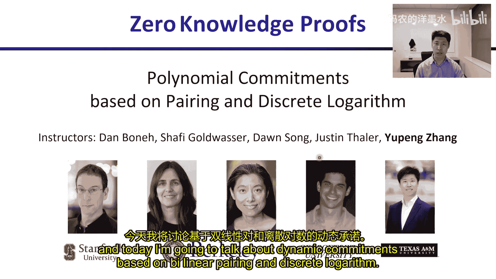
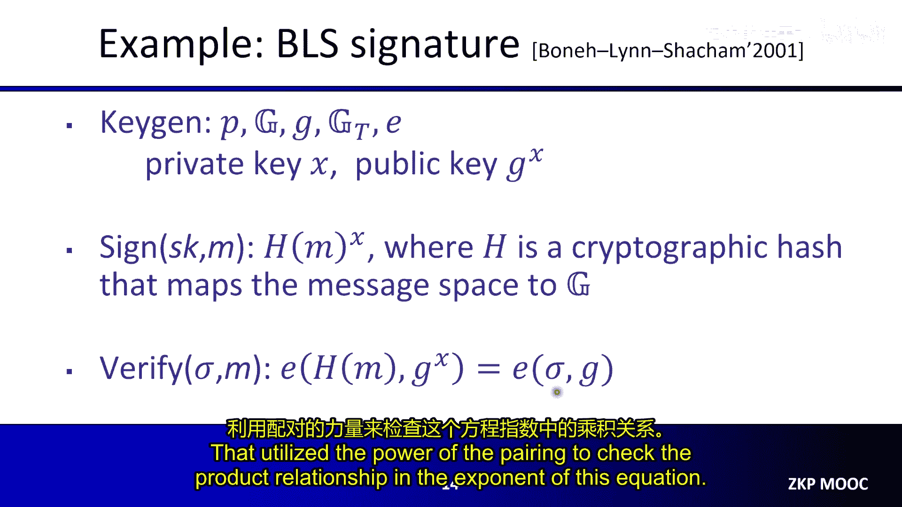
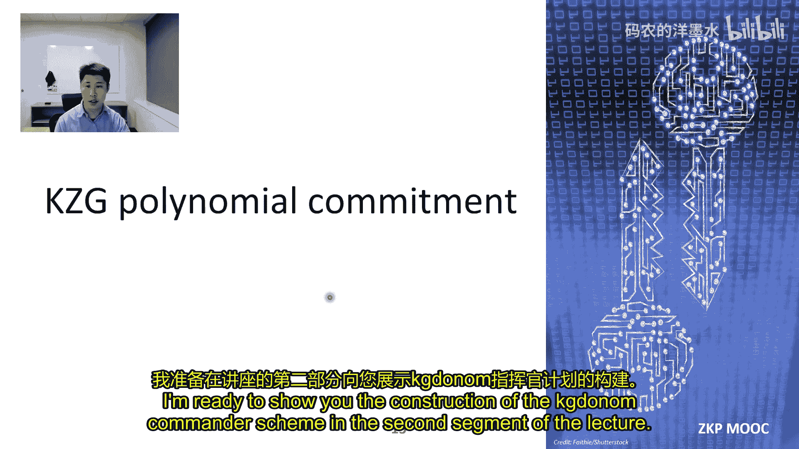
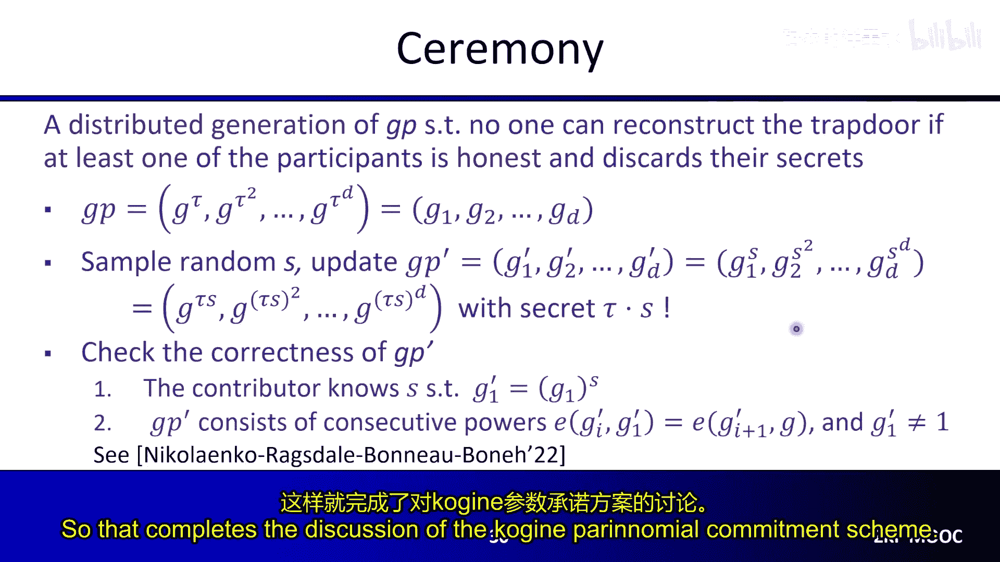
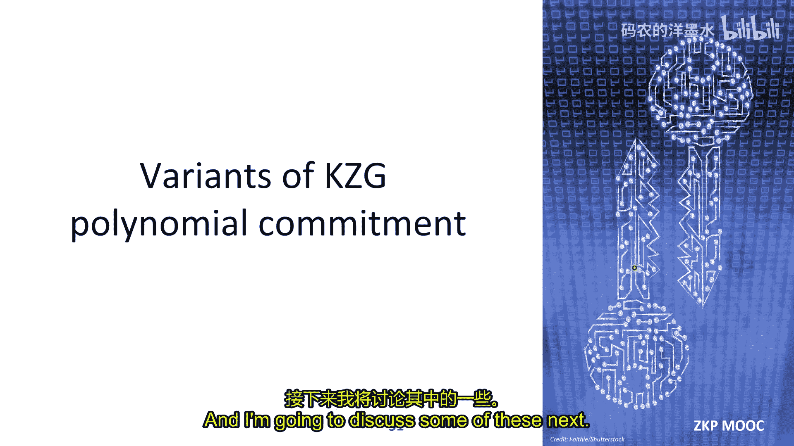
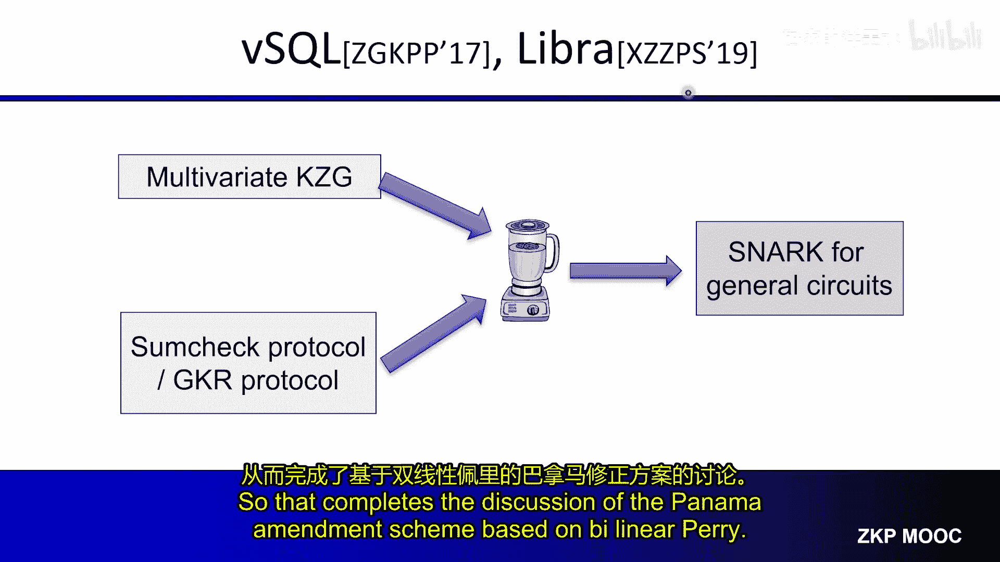
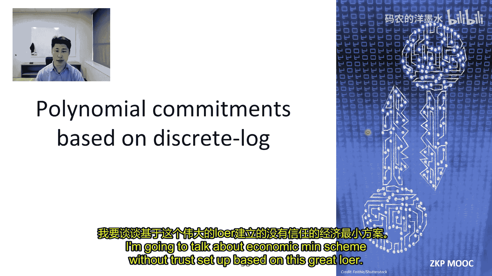
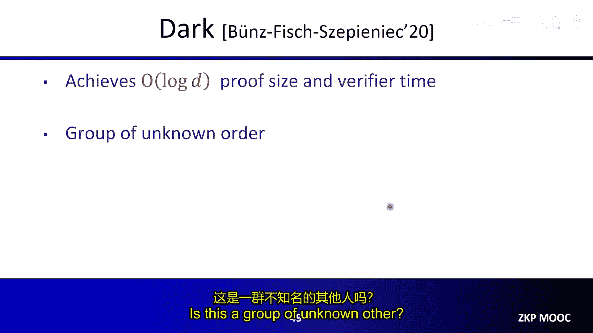
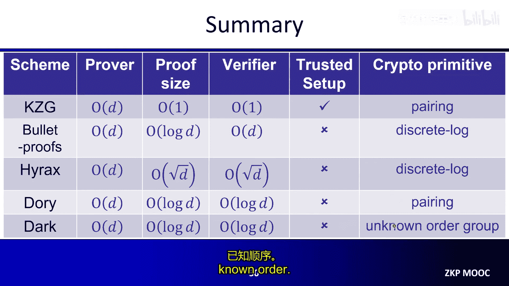
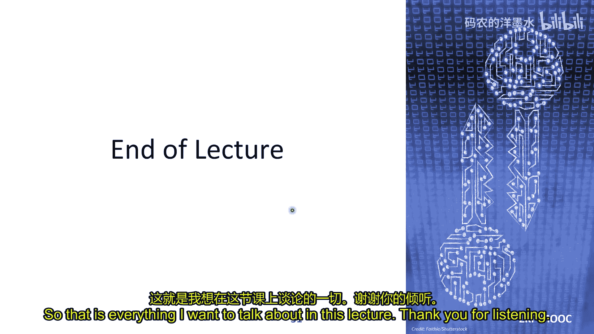

# 006：基于配对和离散对数的多项式承诺

在本节课中，我们将学习基于双线性配对和离散对数的多项式承诺方案。多项式承诺是构建高效零知识证明系统的核心组件。我们将首先介绍必要的数学和密码学背景，然后深入讲解经典的KZG多项式承诺方案及其变体，最后探讨无需可信设置（如Bulletproofs）的方案。

## 背景知识：群、离散对数与双线性配对

上一节我们介绍了多项式承诺的基本概念，本节中我们来看看构建这些方案所需的数学基础。

### 群

群是一个集合及其上的一个运算，满足四个性质。我们以整数集和加法运算为例：
*   **封闭性**：对于集合中的任意两个元素a和b，a+b的结果仍在集合中。
*   **结合律**：对于任意a, b, c，有(a+b)+c = a+(b+c)。
*   **单位元**：存在一个元素e（对于整数加法是0），使得对任意a，有e+a = a+e = a。
*   **逆元**：对于任意元素a，存在一个元素b（对于整数a是-a），使得a+b = e。

密码学中常用的群是模素数p的乘法群，集合为{1, 2, ..., p-1}，运算为模p乘法。

### 生成元与离散对数

对于一个群，如果存在一个元素g，使得通过计算g的不同幂次（g^1, g^2, ...）可以遍历群中的所有元素，则称g为生成元。此时，群可以表示为{g^1, g^2, ..., g^(p-1)}。

**离散对数问题**定义为：给定群元素y，找到x使得g^x = y。这是一个公认的计算困难问题，构成了许多密码学协议的基础。

**计算性Diffie-Hellman假设**是另一个相关假设：给定g^x和g^y，无法高效计算g^(xy)。该假设强于离散对数假设。

### 双线性配对

双线性配对涉及一个基群G（生成元为g）、一个目标群G_T和一个配对运算e。配对运算满足以下性质：
给定输入g^x和g^y，输出e(g^x, g^y) = e(g, g)^(xy)。

配对的核心能力是**验证指数上的乘积关系**，而无需计算它。例如，给定g^x, g^y和声称的g^(xy)，可以通过检查e(g^x, g^y)是否等于e(g^(xy), g)来验证。

一个经典应用是BLS签名方案：
*   私钥为x，公钥为g^x。
*   对消息m的签名为σ = H(m)^x，其中H是哈希到群G的函数。
*   验证时，检查e(H(m), g^x)是否等于e(σ, g)。如果签名正确，则等式成立，因为e(H(m), g^x) = e(H(m)^x, g) = e(σ, g)。

## KZG多项式承诺方案

有了双线性配对的背景，我们现在可以深入讲解KZG多项式承诺方案。

KZG方案由Kate、Zaverucha和Goldberg于2010年提出。它包含四个算法：密钥生成、承诺、求值证明生成和验证。

### 方案构造

该方案工作在一个双线性群上，支持度数≤d的单变量多项式。

**1. 密钥生成**
*   随机选择一个秘密值τ。
*   计算全局参数GP = (g, g^τ, g^(τ^2), ..., g^(τ^d))。
*   **关键步骤**：必须彻底删除τ。这个需要可信方执行并丢弃τ的步骤称为**可信设置**。如果τ泄露，任何人都可以生成假证明。

**2. 承诺**
对于多项式f(x) = f0 + f1*x + ... + fd*x^d，承诺计算为：
`comm_f = g^(f(τ)) = g^f0 * (g^τ)^f1 * (g^(τ^2))^f2 * ... * (g^(τ^d))^fd`
证明者可以使用全局参数GP计算此承诺，而无需知道τ。

**3. 求值证明生成**
当验证者查询点u时，证明者需要证明v = f(u)。核心是利用多项式等式：
`f(x) - f(u) = (x - u) * q(x)`
其中q(x)是商多项式，次数为d-1。
证明者计算q(x)，然后生成证明：
`π = g^(q(τ))`
同样，这可以使用GP计算。

**4. 验证**
验证者需要检查多项式等式在秘密点τ处成立，即检查：
`g^(f(τ) - v) = g^((τ - u) * q(τ))`
虽然无法直接计算右边，但可以利用配对来验证指数上的关系。验证者检查以下等式：
`e(comm_f / g^v, g) = e(g^τ / g^u, π)`
如果证明正确，根据配对性质，该等式成立。

### 安全性分析

KZG方案的正确性由多项式等式保证。其可靠性基于一个称为**q-强双线性Diffie-Hellman假设**的变体。简化的安全证明思路如下：
1.  假设敌手能生成一个错误的求值v* (≠ f(u))和一个能通过验证的假证明π*。
2.  根据验证等式，可得 `e(comm_f / g^v*, g) = e(g^(τ-u), π*)`。
3.  将comm_f写作g^(f(τ))，并将v*分解为f(u) + δ（其中δ ≠ 0）。
4.  利用多项式等式，将左边重写为 `e(g, g)^((τ-u)*q(τ) + δ)`。
5.  通过代数变换，最终可以导出 `e(g, g)^(δ/(τ-u))` 可由敌手计算得出，这便打破了q-强双线性DH假设，与假设矛盾。

在证明中，我们默认了敌手“知道”多项式f，使得comm_f = g^(f(τ))。这需要引入**指数知识假设**来保证，但会带来开销（承诺和验证规模翻倍）。实践中，常在**通用群模型**下证明安全性，该模型捕获了所有已知的对离散对数问题的攻击，从而允许我们使用单元素承诺和单配对验证。

### 方案特性与扩展

KZG方案的主要特性如下：
*   **需要可信设置**。
*   **承诺和证明大小恒定**（各1个群元素）。
*   **验证时间恒定**（1个配对运算）。
*   承诺和证明生成复杂度为O(d)次群指数运算。

为了缓解可信设置问题，可以采用**仪式**：多个参与者依次贡献随机性来生成最终参数，只要至少一个参与者诚实删除其秘密，整体秘密τ就是安全的。

KZG方案有多个重要变体：
*   **多变量扩展**：基于多项式等式 `f(x⃗) - f(u⃗) = Σ (xi - ui)*qi(x⃗)`。证明包含k个元素，验证需要k个配对。
*   **零知识化**：通过在承诺和证明中引入随机掩码，使验证者无法从承诺中获取任何关于多项式的信息。
*   **批量打开**：对于单个多项式的多个求值点，可以构造一个**单个证明**来同时证明所有求值。其核心是构造一个插值多项式h(x)使得h(ui)=f(ui)，然后证明`f(x)-h(x)`能被`Π (x-ui)`整除。此技术可进一步扩展至多个多项式在多个点的批量打开。

结合之前课程的多项式IOP（如Plonk），KZG承诺可以用于构建高效通用的zk-SNARK方案。

## 基于离散对数的透明多项式承诺

KZG方案性能优异，但需要可信设置。本节我们探讨无需可信设置的方案，以Bulletproofs为例。

### Bulletproofs多项式承诺

Bulletproofs的核心思想是**递归缩减**：将一个关于高次多项式求值的声明，逐步缩减为一个关于低次（最终为常数）多项式求值的声明。

**1. 设置与承诺**
*   **透明设置**：全局参数GP是d+1个随机的群元素(g0, g1, ..., gd)，无秘密。
*   **承诺**：对于多项式f(x)（系数为f0,...,fd），承诺为 `comm_f = g0^f0 * g1^f1 * ... * gd^fd`。这是一个Pedersen向量承诺。

**2. 递归缩减协议（单轮）**
假设初始多项式次数为3（系数f0, f1, f2, f3），求值点为u，声称值为v。
*   **证明者**：
    1.  将多项式分为“左半部”系数(f0, f1)和“右半部”系数(f2, f3)。
    2.  计算左半部在u的求值 `vL = f0 + f1*u`，右半部求值 `vR = f2 + f3*u`。注意 `v = vL + vR * u^2`。
    3.  计算两个交叉承诺：
        *   `L = g2^f0 * g3^f1` （用“右半部”的基对“左半部”系数承诺）
        *   `R = g0^f2 * g1^f3` （用“左半部”的基对“右半部”系数承诺）
    4.  发送(vL, vR, L, R)给验证者。
*   **验证者**：
    1.  检查 `v = vL + vR * u^2`。若不成立则拒绝。
    2.  发送一个随机挑战数r给证明者。
*   **缩减**：
    双方共同将原实例缩减为一个新实例：
    *   **新多项式**：`f'(x) = (r*f0 + f2) + (r*f1 + f3)*x`。次数减半。
    *   **新求值点**：仍为u。
    *   **新声称值**：`v' = r*vL + vR`。
    *   **新承诺**：验证者计算 `comm_f' = L^r * comm_f * R^(r^-1)`。
    *   **新基**：验证者更新全局参数为 `(g0' = g0^(r^-1) * g2, g1' = g1^(r^-1) * g3)`。可以验证，`comm_f'` 正是用新基 `(g0', g1')` 对新多项式 `f'` 的Pedersen承诺。

**3. 递归与完成**
上述过程递归进行log(d)轮，直到多项式次数为常数（例如0或1）。在最后一轮，证明者直接发送这个常数多项式（即其系数），验证者用最终的承诺基验证其求值是否正确。若所有轮次验证通过，则原始求值声明成立。

### 方案特性与后续改进

Bulletproofs方案特性：
*   **透明设置**，无需信任。
*   承诺大小恒定（1个群元素）。
*   证明大小O(log d)（每轮发送O(1)个元素）。
*   **验证者时间O(d)**（主要开销在于每轮更新基向量，这是线性操作）。

为了改进Bulletproofs的线性验证时间，后续研究提出了多种方案：
*   **Halo**：通过将多项式系数表示为二维矩阵，进行行承诺和列缩减，将证明大小和验证时间降至O(√d)，并可在两者之间灵活权衡。
*   **Dory**：通过**内配对乘积论证**，将验证者更新基向量的线性计算工作委托给证明者，并高效验证该委托的正确性，从而将验证时间降至O(log d)，同时证明大小保持O(log d)。
*   **Dark**：在未知阶群中实现了O(log d)的证明大小和验证时间，其构造思想与上述Bulletproofs递归缩减类似。

## 总结

本节课中我们一起学习了基于双线性配对和离散对数的多项式承诺方案。

我们首先介绍了KZG方案，它基于双线性配对，具有证明和承诺大小恒定、验证快速的优点，但需要可信设置。我们还讨论了其多变量、零知识、批量打开等变体。

为了消除可信设置，我们研究了基于离散对数的透明方案。以Bulletproofs为例，它通过递归缩减将问题规模不断减半，实现了对数级的证明大小，但验证时间是线性的。后续的Halo、Dory和Dark等方案从不同角度进行了优化，最终实现了对数级的证明大小和验证时间，且无需可信设置。

这些多项式承诺方案是构建现代高效零知识证明系统的基石，与不同的多项式IOP结合，可以构造出功能强大且性能各异的zk-SNARK。