# 007：基于纠错码的多项式承诺 📜

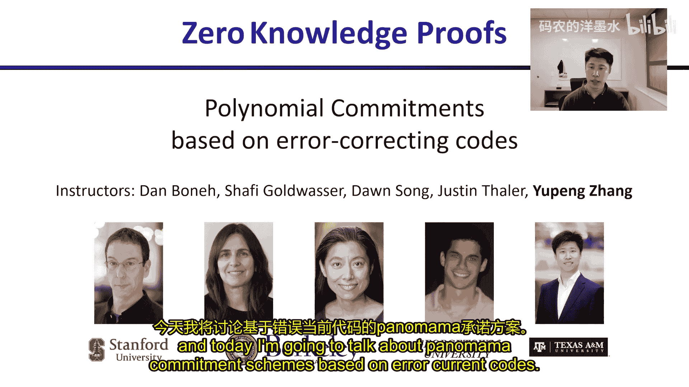

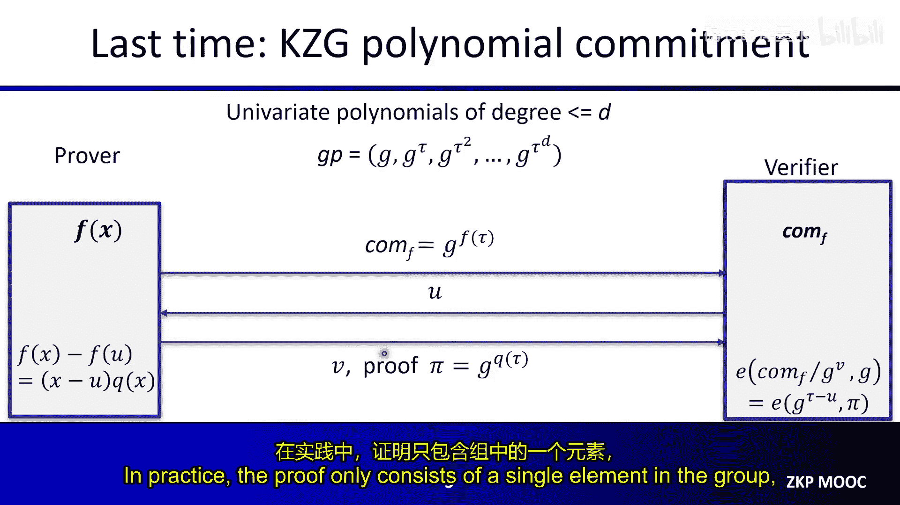

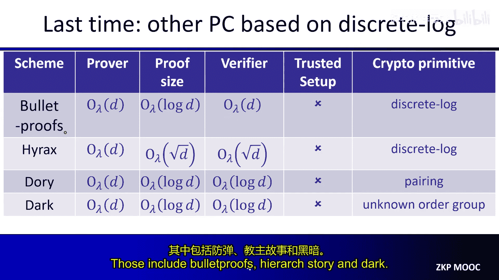

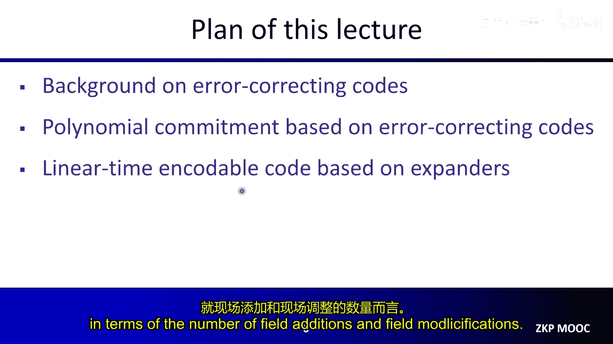

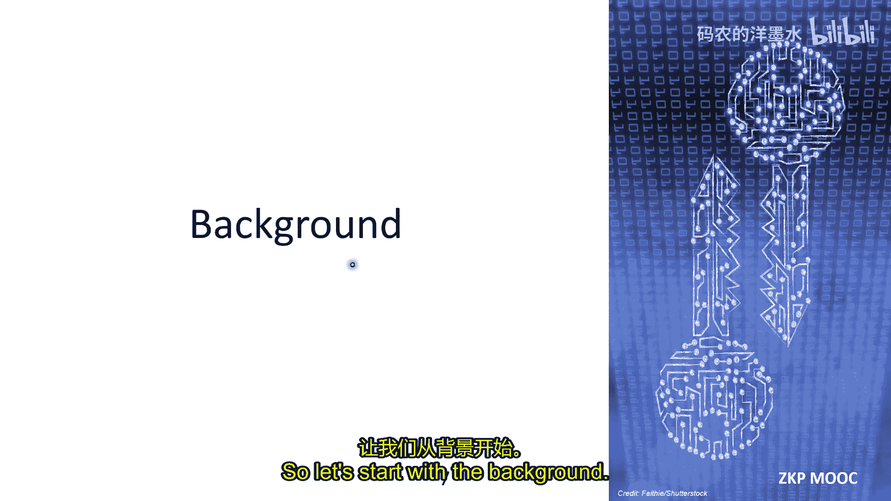

在本节课中，我们将学习一种新型的多项式承诺方案，它基于纠错码构建。这类方案具有透明设置、证明生成速度快且可能具备后量子安全性等优点，但通常伴随较大的证明体积。我们将从纠错码的基础知识开始，逐步构建出完整的承诺方案，并探讨如何利用扩展图构造线性时间可编码的纠错码。

## 背景知识：纠错码 📡

上一节我们介绍了基于双线性配对和离散对数问题的多项式承诺方案。本节中，我们来看看基于纠错码的方案。首先，我们需要理解一些关于纠错码的基础概念。

纠错码是信息论和编码理论中一个被深入研究的课题，用于在网络传输中纠正错误。一个纠错码将一个大小为 `K` 的消息编码为一个大小为 `N` 的码字，其中 `N` 严格大于 `K`。纠错码的一个重要概念是最小距离。

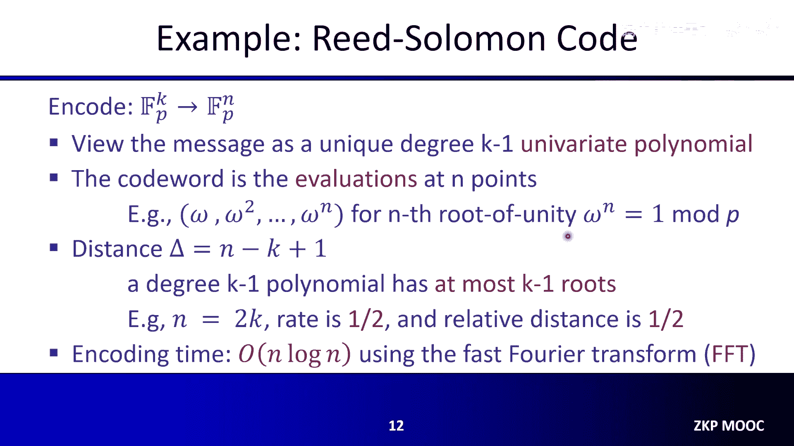

两个码字之间的距离是它们之间不同位置的数量，这被称为汉明距离。取任意两个码字之间距离的最小值，称为 `Δ`，这就是该纠错码的最小距离。`N`、`K` 和 `Δ` 是码的三个重要参数，我们称其为 `[N, K, Δ]` 码。

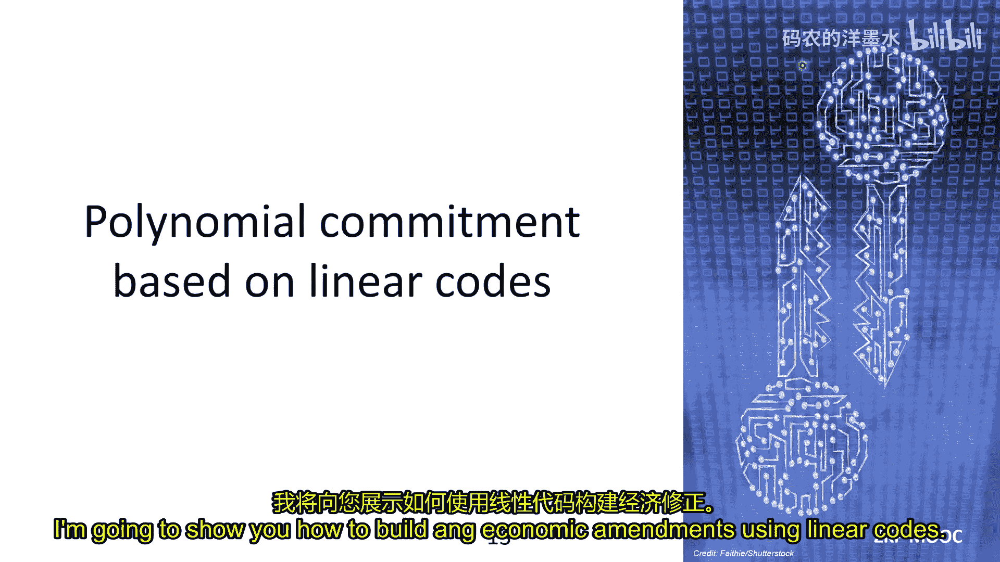

以下是关于纠错码的一些关键术语：
*   **码率**：定义为 `K/N`，表示码字中有意义信息的比例，我们希望它尽可能接近 1。
*   **相对距离**：定义为 `Δ/N`，表示任意两个码字之间不同位置的比例，对于纠错目的，我们希望它尽可能大。
*   **线性码**：最常见的码类型，要求任何码字的线性组合仍然是码字。这意味着编码算法可以表示为消息 `M` 与一个大小为 `K × N` 的生成矩阵 `G` 之间的向量-矩阵乘法：`C = M * G`。对于线性码，最小距离等于任何非零码字的最小非零元素数量（即码字的重量）。

一个经典的线性码构造是**里德-所罗门码**。它定义在一个大小为 `P` 的有限域上。算法将大小为 `K` 的消息编码为大小为 `N` 的码字。方法是将消息视为一个唯一的 `K-1` 次多项式（可以看作是在 `K` 个固定公共点上的多项式插值），然后将该多项式在另外 `N` 个预定义的公共点（例如单位根）上进行求值。里德-所罗门码的距离是 `N - K + 1`，这是一个非常好的性质。

## 基于线性码的多项式承诺方案 🧩

有了纠错码的背景知识，我们现在可以探讨如何利用线性码来构建多项式承诺方案。本节介绍的方法源自2017年的Ligero和Bünz等人论文，该方案具有平方根大小的证明和平方根的验证成本。

该多项式承诺方案的核心思想是识别多项式求值中的矩阵结构。假设多项式的系数数量 `D` 是某个整数的完全平方数。我们可以将系数排列成一个 `√D × √D` 的矩阵 `F`。那么，多项式在点 `u` 的求值 `F(u)` 可以分解为两个步骤：首先计算向量 `a`（由 `u` 导出）与矩阵 `F` 的乘积，得到一个中间向量；然后计算该中间向量与另一个由 `u` 导出的向量 `b` 的内积。

通过这种观察，我们可以将多项式承诺问题简化为一个向量-矩阵乘积的论证问题。如果有一个证明大小为 `O(√D)` 的方案来证明第一步计算正确，那么验证者就可以本地完成第二步内积计算，从而得到一个总证明大小为 `O(√D)` 的多项式承诺方案。

因此，接下来的重点是如何设计一个方案，在不直接向验证者发送矩阵 `F` 的情况下，测试这个向量-矩阵乘积的计算。思路是使用线性纠错码来编码由多项式系数定义的矩阵 `F`。

### 方案构建

以下是方案的具体步骤：

**1. 承诺阶段**
*   使用一个线性码对矩阵 `F` 的每一行进行编码。原始矩阵维度是 `√D × √D`，编码后得到一个维度为 `√D × N` 的编码矩阵，其中 `N` 是码字长度。我们通常使用恒定码率的线性码，因此 `N` 渐进等于 `√D`。
*   然后，我们使用默克尔树按列对这个编码后的矩阵进行承诺。将每一列视为默克尔树的一个叶子节点，计算出的树根哈希值就是多项式的承诺。密钥生成非常简单，只需要从一个哈希函数族中采样一个哈希函数，无需可信设置。

**2. 评估与验证阶段**
评估算法大致分为两步：邻近性测试和一致性测试。

*   **邻近性测试**：主要目标是测试承诺的矩阵是否确实由按行编码的码字组成。步骤如下：
    1.  验证者发送一个长度为 `√D` 的随机向量 `r`。
    2.  证明者计算 `r` 与承诺矩阵的乘积，得到一个长度为 `N` 的向量 `w`，并发送给验证者。
    3.  验证者随机选择 `t` 个列索引，要求证明者打开这些列（即提供列值以及对应的默克尔树路径证明）。
    4.  验证者进行三项检查：(a) 向量 `w` 是否是该线性码的一个有效码字；(b) 打开的列是否与默克尔树承诺一致；(c) 对于每个打开的列，计算 `r` 与该列的内积，结果是否等于 `w` 向量在对应位置的值。
    如果所有检查通过，则以压倒性概率可以断定承诺的矩阵接近一个正确编码的矩阵。

*   **一致性测试**：在邻近性测试之后，目的是测试由求值点 `u` 导出的向量与原始系数矩阵 `F` 的乘积是否等于证明者声称的结果 `m`（一个长度为 `√D` 的向量）。步骤如下：
    1.  证明者发送消息 `m`，它应该是 `u` 与矩阵 `F` 的乘积结果。
    2.  验证者使用相同的线性码将 `m` 编码为一个码字 `w‘`。
    3.  验证者使用在邻近性测试中打开的相同 `t` 个列。
    4.  验证者检查：对于每个打开的列，计算 `u` 与该列的内积，结果是否等于 `w‘` 向量在对应位置的值。
    如果检查通过，则说明 `u * F = m` 成立。

最后，验证者本地计算 `m` 与向量 `b`（由 `u` 导出的第二部分）的内积，即可得到最终的多项式求值结果 `F(u)`。

### 方案特性与权衡

基于线性码的多项式承诺方案具有以下特性：
*   **优点**：透明设置（无信任假设），全局参数小；证明生成速度快（仅涉及域加法和乘法，无需群指数运算）；可能是后量子安全的；与域无关（可在任意域上工作）。
*   **缺点**：证明体积通常较大（在原始方案中为 `O(√D)`，可达数十MB）；由于缺乏代数结构，证明难以聚合。

一些后续研究，如Breakdown和Orion论文，通过证明组合等技术进一步减少了证明体积，例如从 `O(√D)` 降低到 `O(log² D)`，但证明体积仍然相对较大。因此，在选择方案时，需要在证明生成速度、安全假设和证明体积之间进行权衡。

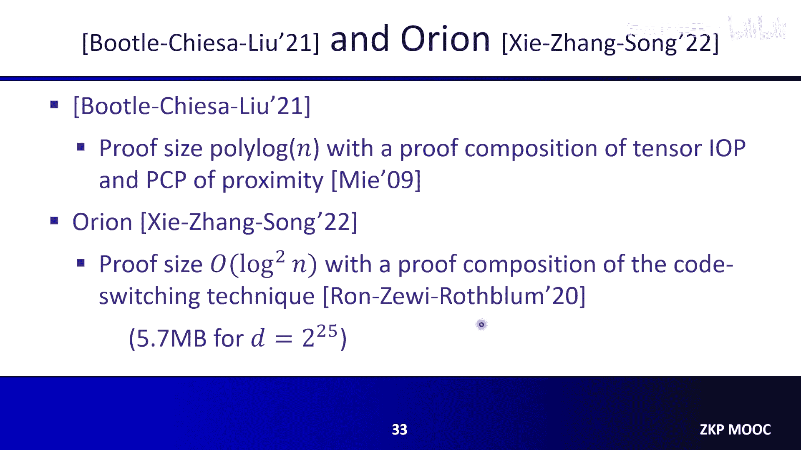

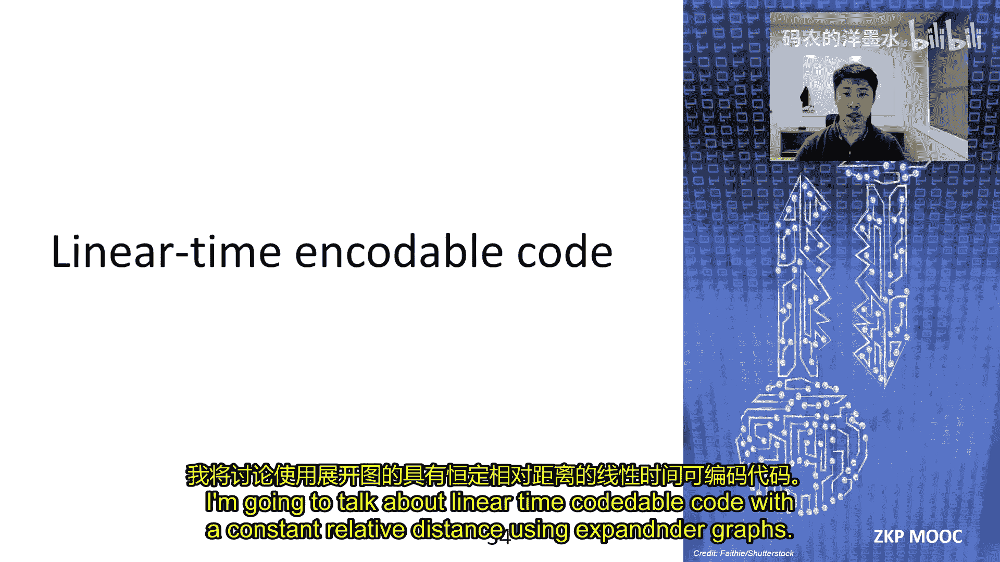

## 基于扩展图的线性时间可编码纠错码 ⚡

在最后一节，我们将探讨如何利用扩展图构造具有恒定相对距离的线性时间可编码纠错码。这类码被用于构建具有线性证明者时间的SNARK方案。

这种码由Daniel Spielman在1996年提出，后来由Druk和Ishai在2014年推广到有限域。它依赖于一种称为扩展图的经典对象。扩展图具有良好的扩展性，即图的任何子集都会连接到许多邻居节点。

我们使用一种称为**损失扩展图**的二分图。在二分图中，左侧节点集代表消息符号，右侧节点集用于编码。左侧每个节点有恒定度数 `g` 的边连接到右侧。损失扩展图要求对于左侧任何大小不超过某个阈值的子集 `S`，其邻居集合的大小至少为 `(1 - β) * g * |S|`，这几乎是最大可能的扩展。

简单的编码想法是将消息放在左侧节点，然后对右侧每个节点，将其所有邻居左侧节点的值求和，作为编码输出。这是一个线性码，且编码时间是线性的。然而，这种简单求和方法不能直接获得良好的相对距离。

### 递归编码算法

实际的编码算法更为复杂，是一个递归过程，旨在构建一个码率为 `1/4` 的码：
1.  **系统部分**：将原始消息 `m`（长度 `K`）直接复制为码字的第一部分。
2.  **第一次扩展**：将消息 `m` 通过一个损失扩展图（左侧大小 `K`，右侧大小 `K/2`），得到向量 `m1`。
3.  **递归编码**：假设我们已有一种能将长度为 `K/2` 的消息编码为长度为 `2K` 的码字 `c1` 的好码（具有恒定相对距离 `δ`）。我们对 `m1` 应用这个编码，得到 `c1`，作为码字的第二部分。
4.  **第二次扩展**：将 `c1`（长度 `2K`）通过另一个损失扩展图（左侧大小 `2K`，右侧大小 `K`），得到向量 `c2`，作为码字的第三部分。
最终的码字是 `(m, c1, c2)`，总长度为 `4K`。对于递归步骤中所需的“好码”，我们递归地应用相同的算法，直到消息规模变为常数，此时可以使用任何好码（如里德-所罗门码）。

通过分析可以证明，这样构造的码具有恒定的相对距离。证明思路是分情况讨论消息和中间码字的重量，并利用损失扩展图的扩展性质来保证只要输入非零，编码过程中至少会产生一定比例的非零输出。

### 构造与优化

在实践中，我们需要找到可用的损失扩展图。存在确定性的显式构造，但具体效率不高。另一种方法是随机采样图，因为随机图以高概率是好的扩展图，但失败概率是 `1/poly`，并非可忽略。

在Breakdown和Orion等后续工作中，提出了改进：
*   **Breakdown**：使用带随机权重的边进行加权求和，而不是简单求和，这显著提高了码的距离。
*   **Orion**：提出了一种测试算法，可以将随机采样到坏扩展图的失败概率从 `1/poly` 降低到可忽略的程度。

## 总结 📝

本节课我们一起学习了基于纠错码的多项式承诺方案。我们从纠错码的基础知识入手，介绍了如何利用线性码和默克尔树来构造承诺方案，其核心是邻近性测试和一致性测试两个交互步骤。这类方案提供了透明设置和快速证明生成的优点，但代价是较大的证明体积。

此外，我们还深入探讨了基于扩展图的线性时间可编码纠错码的构造，这是实现线性时间证明者的关键工具。通过递归地使用损失扩展图，可以构造出具有恒定相对距离且编码时间为线性的纠错码。

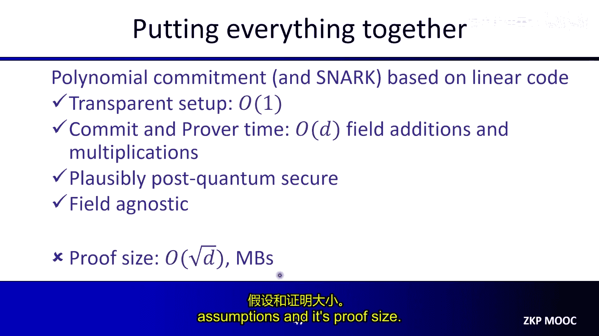

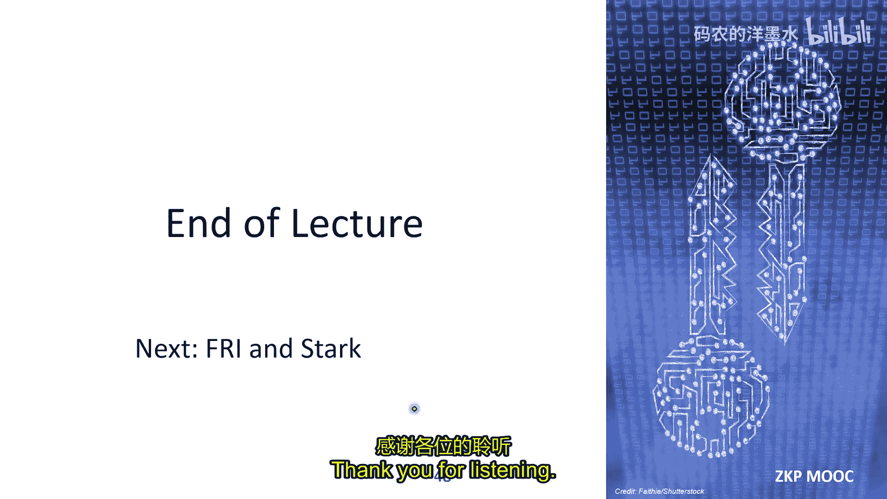

这些基于纠错码的构造为构建后量子安全、高效且无需信任设置的零知识证明系统提供了重要的技术路径。在下一讲中，我们将讨论FRI协议和STARK构造。