# 008：基于 FRI 的多项式承诺与 Fiat-Shamir 变换

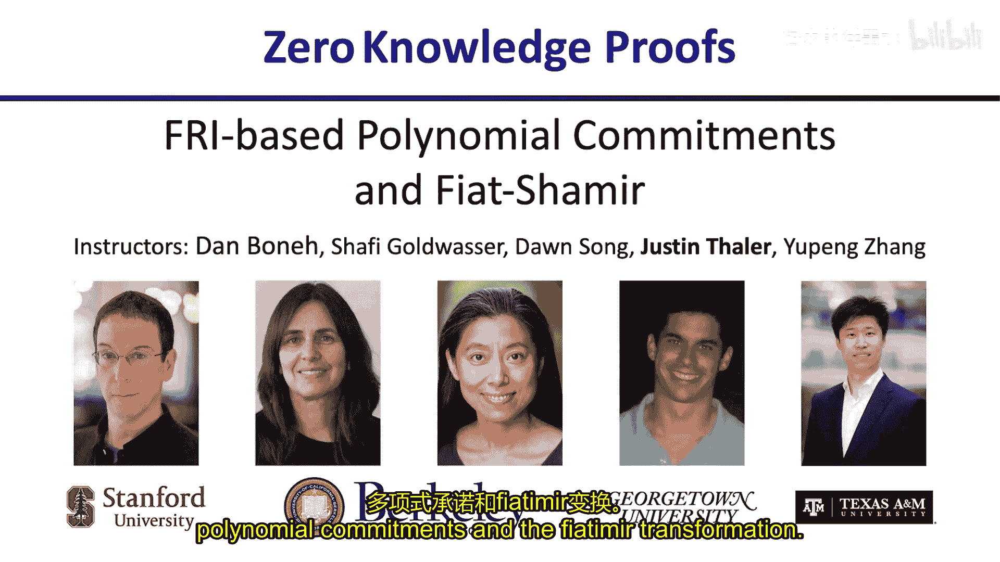

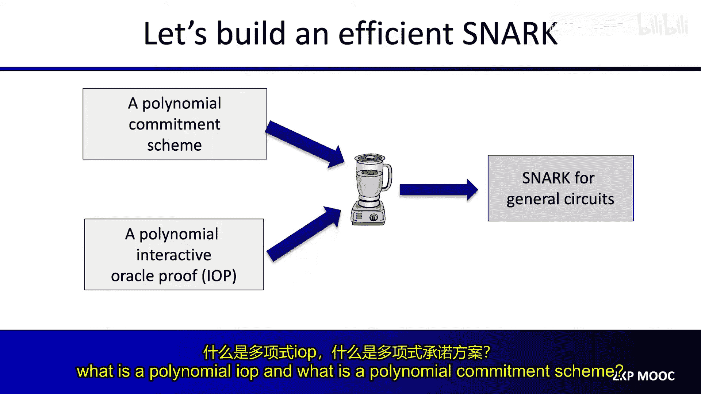

在本节课中，我们将要学习基于 FRI 的多项式承诺方案，并深入探讨 Fiat-Shamir 变换的具体细节及其安全性考量。

## 概述：多项式 IOP 与多项式承诺

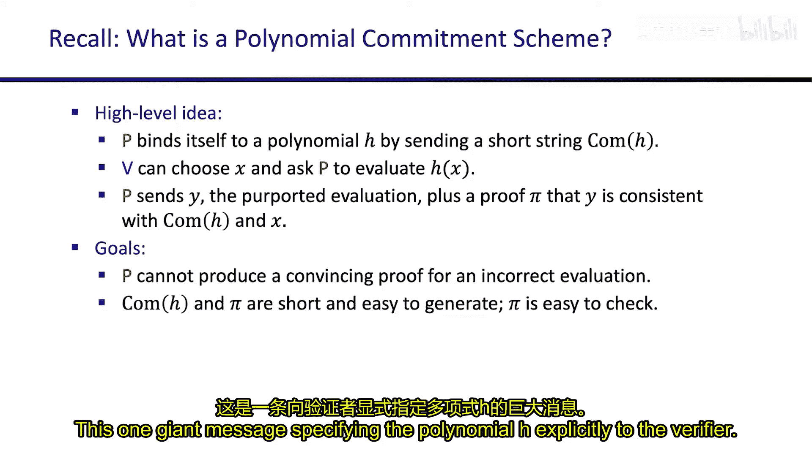

大多数 SNARK 的设计都结合了两个核心组件：一个称为多项式承诺方案的密码学协议，以及一个称为多项式交互式预言证明的交互式协议。你可以将几乎任何多项式 IOP 与任何多项式承诺方案组合起来，得到一个简洁的交互式论证，然后应用 Fiat-Shamir 变换使其变为非交互式，从而获得一个 SNARK。

到目前为止，我们已经了解了多种不同的多项式 IOP 和多项式承诺方案，它们各自都有独特的性能权衡。将不同的多项式 IOP 与多项式承诺方案组合，会继承相应的优缺点。

上一节我们回顾了多项式 IOP 和多项式承诺的基本概念，本节中我们来看看基于 FRI 的具体实现。

## 多项式 IOP 与多项式承诺回顾

多项式 IOP 的一个常见特例是，证明者首先向验证者指定一个多项式 H。这个多项式 H 通常非常大，例如，如果它是一个单变量多项式，其度数可能与证明者声称知道满足赋值的电路规模一样大。因此，我们不希望验证者必须读取该多项式的完整描述。

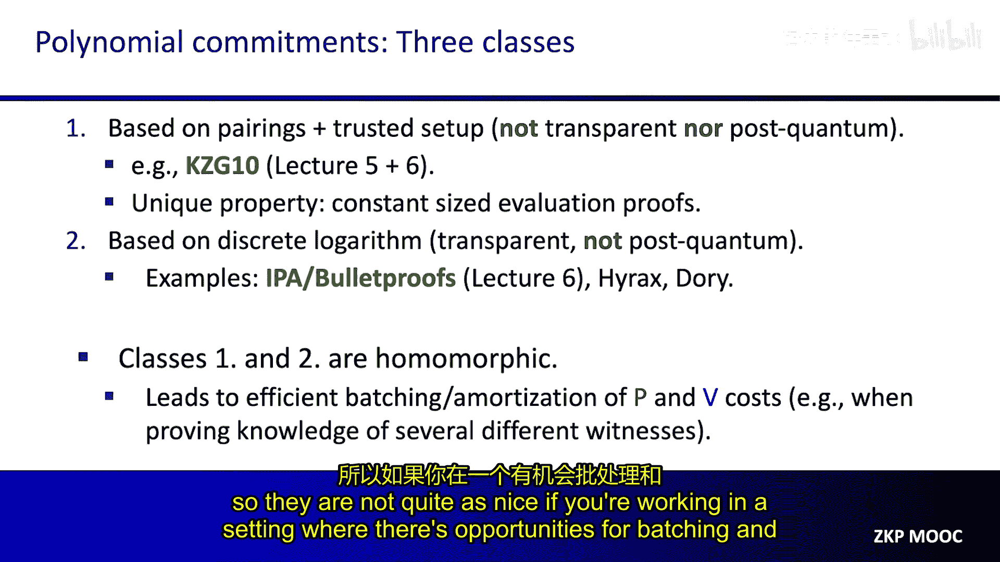

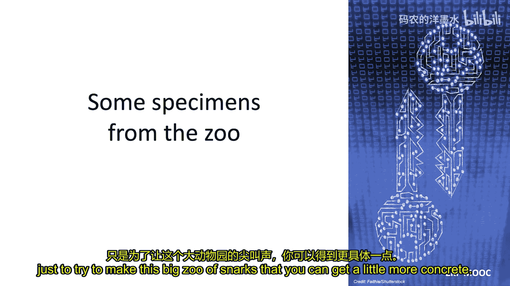

在多项式 IOP 中，验证者只被允许在单个自选的点上评估 H。在验证者评估 H 之后，证明者和验证者执行一个标准的交互式证明。除了指定多项式 H 的第一个特殊消息外，证明者的其他所有消息都很短，并由验证者完整读取。最终，验证者决定是否接受证明者的声明。

多项式承诺方案是一种密码学协议，它本质上正是将多项式 IOP 转化为简洁交互式论证所需的东西。具体来说，它允许证明者在不显式发送这个大多项式 H 的描述给验证者的情况下，模拟多项式 IOP。相反，证明者会向验证者发送对 H 的一个简洁密码学承诺。之后，多项式承诺方案必须支持验证者选择一个输入 X，并要求证明者评估所承诺的多项式 H 在 X 处的值，然后说服验证者证明者返回的评估值确实等于所承诺多项式在 X 处的评估值。我们称之为多项式承诺方案的评估证明。

这样，验证者只需接收一个哈希值或密码学群元素来承诺多项式，之后接收请求的评估值及其正确性证明，从而有效地以简洁的方式运行多项式 IOP。

## 现有方案的性能概览

以下是已知多项式 IOP 和多项式承诺方案的简要分类，以及它们组合后的一些流行 SNARK 的优缺点。

### 多项式 IOP 分类

多项式 IOP 主要分为三类：
1.  **基于求和检查协议**：例如 Spartan、Breakdown、Orion。这些通常具有最快的证明者速度。
2.  **基于多变量求和检查协议**：例如 Aurora。
3.  **恒定轮次多项式 IOP**：例如 Marlin 和 Plonk。这些通常验证成本更低，但证明者成本更高。

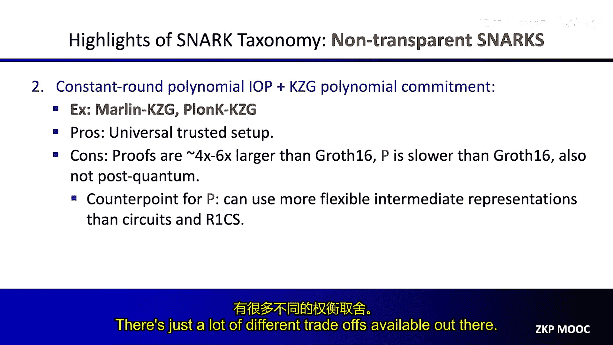

### 多项式承诺方案分类

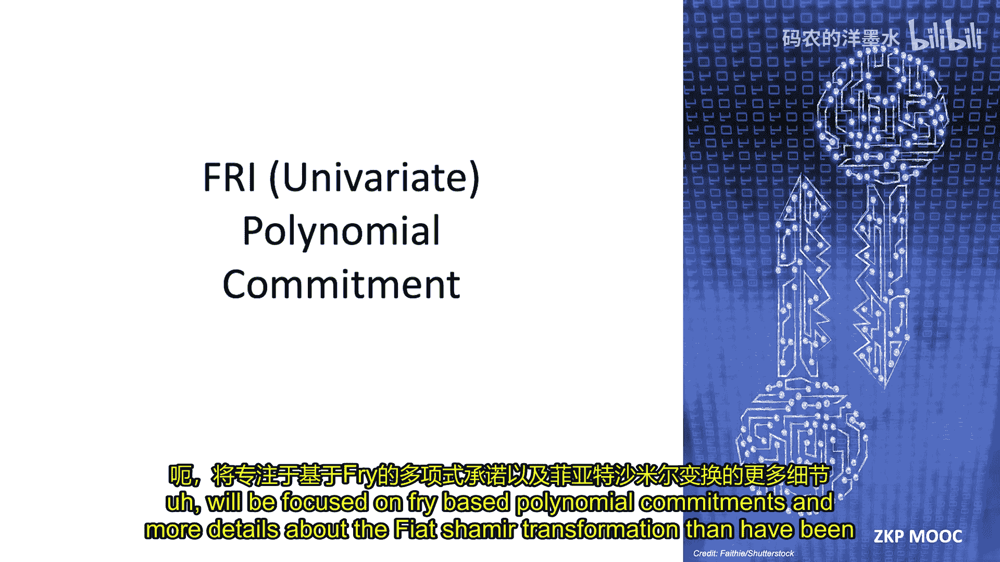

多项式承诺方案主要分为三类：
1.  **基于配对友好群和可信设置**：例如 KZG 承诺。优点是评估证明和承诺本身是恒定大小的群元素。缺点是需要可信设置，且非后量子安全。
2.  **基于离散对数问题，无需可信设置**：例如 IPA、Bulletproofs、Dory。优点是透明的，但非后量子安全。
3.  **仅基于哈希**：例如 FRI、Ligero、Orion。优点是透明且可能是后量子安全的。FRI 在此类别中拥有最短的评估证明。

这三类方案的验证成本依次递增：KZG 为常数，Bulletproofs 等为对数，FRI 等为多对数。

### 流行 SNARK 示例

以下是当前一些流行 SNARK 的简要总结：

**透明 SNARK**：
*   **Halo2 (使用 Bulletproofs)**：结合了 Plonk IOP 和 Bulletproofs 承诺。优点是证明最短，缺点是在非摊销设置下验证者速度慢。
*   **基于 FRI 的 SNARK**：例如 STARKs、Fractal、Aurora。优点是透明且可能是后量子安全的，证明在同类中最短（但仍为数百KB），并且可以在更小的域上工作以获得更快的算术运算。
*   **基于求和检查的快速证明者 SNARK**：例如 Spartan、Breakdown、Orion。优点是证明者速度最快，缺点是证明通常更大。

**非透明 SNARK**：
*   **Groth16**：基于线性 PCP，验证成本最佳（证明仅3个群元素，验证只需少量配对操作）。缺点是需要电路特定的可信设置，证明者较慢，且非后量子安全。
*   **Marlin 和 Plonk (使用 KZG)**：优点是可信设置是电路无关的。缺点是证明比 Groth16 大，证明者比 Groth16 慢，但能应用于更广泛的电路类别。

设计空间非常丰富，理解所有可能的性能权衡需要掌握许多不同的思想和技术。

## 基于 FRI 的多项式承诺

现在，让我们深入探讨基于 FRI 的多项式承诺方案。

### 问题定义与初始尝试

我们考虑一个在素数域 F_p 上的单变量多项式 Q，其次数小于 k。在一个单变量多项式承诺方案中，我们希望证明者能够承诺 Q，之后根据验证者选择的输入 r 揭示 Q(r)，并证明该评估值与所承诺的多项式一致。

在之前的讲座中，我们曾尝试让证明者 Merkle 承诺 Q 在所有域元素上的评估。但这有两个问题：
1.  证明者时间与域大小成正比，而不是与多项式度数 k 成正比，效率低下。
2.  Merkle 树无法向验证者保证所承诺的函数（其评估值是树的叶子）的次数最多为 k-1。

### FRI 的改进：在单位根子集上承诺

FRI 通过让证明者仅承诺 Q 在一个精心选择的子集 Ω 上的评估来解决第一个问题。这个集合 Ω 的大小为 `ρ^{-1} * k`，其中 `ρ^{-1}` 是一个常数，称为 FRI 膨胀因子（`ρ` 称为 Reed-Solomon 码的速率）。

由于证明者只对大小为 `ρ^{-1} * k` 的集合 Ω 进行评估和 Merkle 承诺，因此在证明者时间和验证成本之间存在很强的权衡：膨胀因子越大，证明者时间越长（因为需要评估更多的点），但验证成本（包括证明长度和验证时间）越低。

具体来说，验证成本（哈希评估次数）约为：
`(λ / log(ρ^{-1})) * log²(k)`
其中 λ 是安全参数。每个 FRI 验证者查询提供大约 `log(ρ^{-1})` 比特的安全性，因此需要大约 `λ / log(ρ^{-1})` 次查询来达到 λ 比特安全。

集合 Ω 由域中所有 n 次单位根组成，其中 `n = ρ^{-1} * k`，且 n 是2的幂。单位根具有很好的代数性质，例如，如果 ω 是一个本原 n 次单位根，那么所有 n 次单位根就是 ω 的幂：{1, ω, ω², ..., ωⁿ⁻¹}。这些单位根在乘法下构成一个子群。

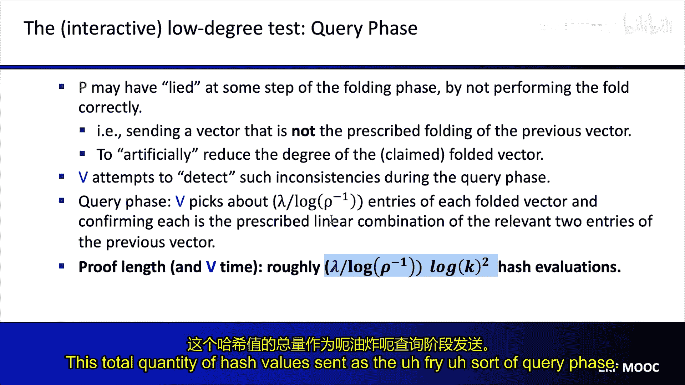

### FRI 的低度测试：折叠阶段

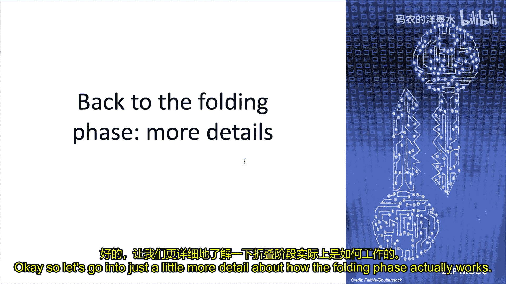

Merkle 承诺本身不保证向量具有低度结构。FRI 的核心思想是让验证者通过交互式“低度测试”来检查所承诺的向量是否接近一个低度多项式。

FRI 的低度测试包括两个阶段：折叠阶段和查询阶段。

在折叠阶段，证明者和验证者进行对数轮（log k 轮）交互。在每一轮中，验证者发送一个随机域元素 r，证明者则“折叠”当前承诺的向量。折叠过程将向量长度减半，并且如果证明者是诚实的，折叠后向量所对应多项式的度数也会减半。

折叠的数学原理是将多项式 Q 拆分为偶次部分 Q_e 和奇次部分 Q_o，使得 `Q(x) = Q_e(x²) + x * Q_o(x²)`。然后，折叠后的多项式定义为 `Q_fold(z) = Q_e(z) + r * Q_o(z)`，其中 z = x²。可以证明，这等价于将 Q 在单位根 x 和 -x 处的评估值进行特定线性组合，得到在 z 处的评估值。

经过 log k 轮折叠后，如果证明者是诚实的，最终向量应该对应一个常数多项式（度数为0）。

### FRI 的低度测试：查询阶段

在折叠阶段之后是查询阶段。验证者会从每个折叠轮次产生的承诺向量中随机查询多个位置（数量约为 `λ / log(ρ^{-1})`）。对于每个查询，证明者需要返回该位置的评估值以及相应的 Merkle 认证路径。验证者检查这些值是否满足折叠过程中定义的线性关系。

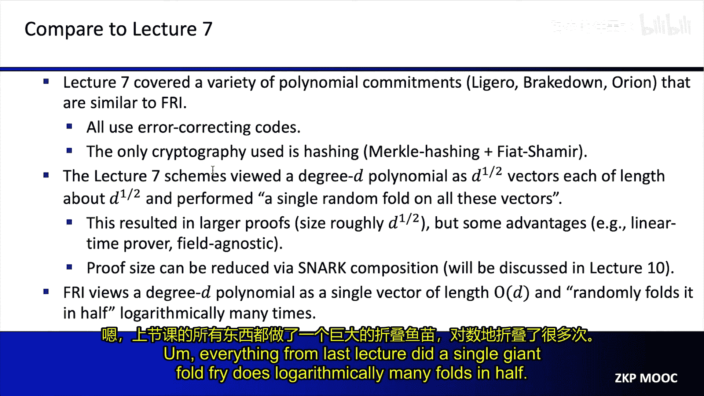

如果证明者在任何一轮折叠中作弊（没有正确执行折叠），那么在查询阶段，验证者有很大概率会发现不一致。

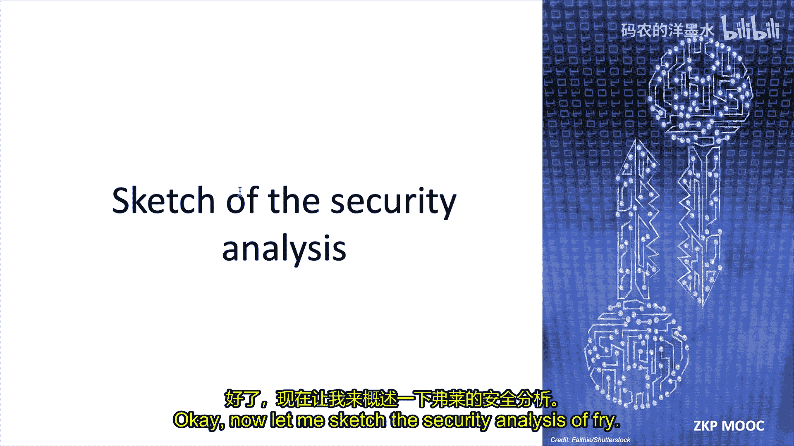

### 安全性分析

FRI 的安全性基于以下关键主张：如果一个作弊的证明者承诺的多项式 Q 距离最近的低度（k-1）多项式 H 的相对汉明距离为 δ，那么它通过所有 FRI 验证者检查的概率最多约为 `(k / |F|) + (1 - δ)^t`，其中 t 是查询次数。

第一项 `k/|F|` 是证明者在折叠阶段“幸运地”遇到能异常降低度数的随机挑战 r 的概率。第二项 `(1-δ)^t` 是即使没有幸运折叠，所有 t 次查询都未能检测到折叠不一致的概率。

需要注意的是，已知的最佳攻击表明，对于任何 Q（无论其距离低度多项式多远），存在一种攻击策略能以至少 `ρ^t` 的概率通过验证。这表明如果 FRI 的猜想安全性成立，那么它是紧的。

### 从 FRI 到多项式承诺方案

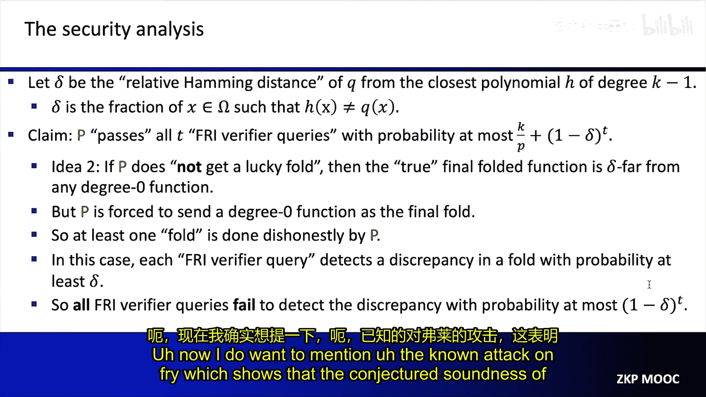

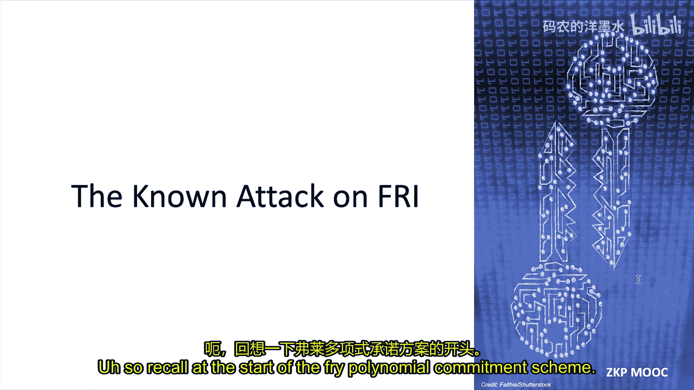

单纯的 FRI 低度测试只能让验证者相信所承诺的向量“接近”某个低度多项式，而不是完全等于一个特定的低度多项式。为了构建完整的多项式承诺方案，我们需要解决两个问题：
1.  验证者可能请求评估的点 r 不在单位根集合 Ω 中。
2.  验证者只知道 Q 接近某个低度多项式 H，但不知道 H 具体是什么。

解决方案利用了与 KZG 承诺类似的一个事实：对于度数小于 d 的多项式 Q，`Q(r) = v` 当且仅当存在一个度数小于 d 的多项式 W，使得 `(Q(x) - v) = W(x) * (x - r)`。

在承诺方案中，当验证者请求 Q(r) 的评估值 v 时，证明者声称 `Q(r) = v`。验证者可以要求证明者对函数 `(Q(x) - v) / (x - r)` 应用 FRI 低度测试，以证明其度数小于 d-1。如果通过测试，则能以高概率保证所声称的 v 等于“最接近 Q 的低度多项式 H”在 r 处的值 `H(r)`。

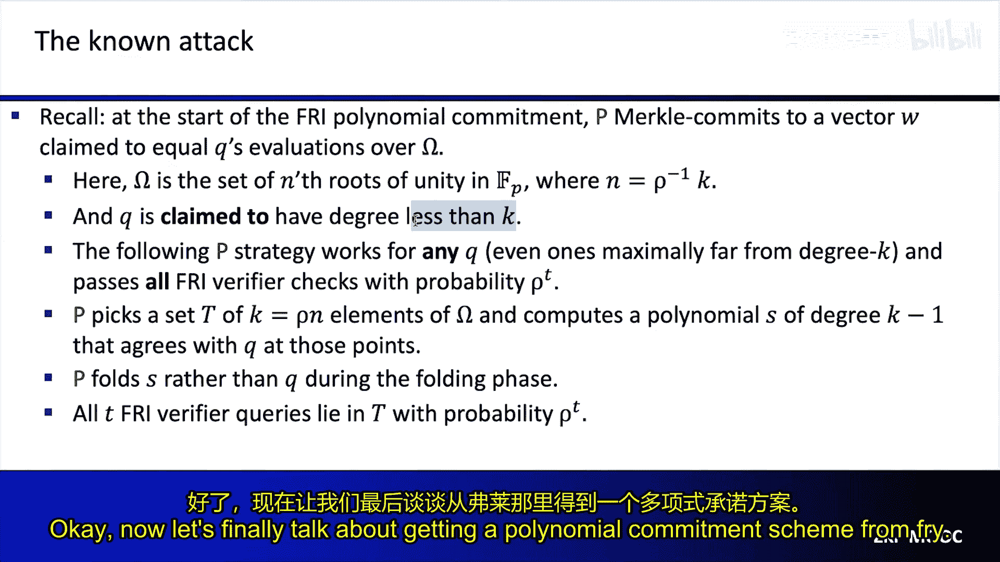

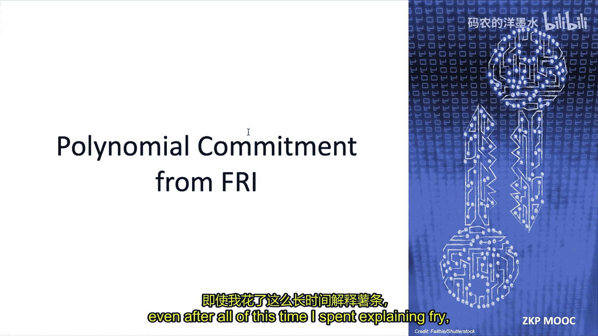

实际上，目前部署的 FRI 通常作为一种“列表多项式承诺方案”使用，它只将证明者绑定到一小组低度多项式，但这对于 SNARK 的安全性来说已经足够。

## Fiat-Shamir 变换与具体安全性

几乎所有 SNARK 都使用 Fiat-Shamir 变换将交互式论证转化为非交互式。本节将详细讨论其工作原理和安全性考量。

### Fiat-Shamir 变换原理

以一个三轮交互协议（证明者发送 α，验证者回复随机挑战 β，证明者最后发送 γ）为例。Fiat-Shamir 变换将挑战 β 替换为对证明者第一条消息 α（以及公开输入 x）的哈希值：`β = Hash(α, x)`。哈希函数被建模为随机预言机。

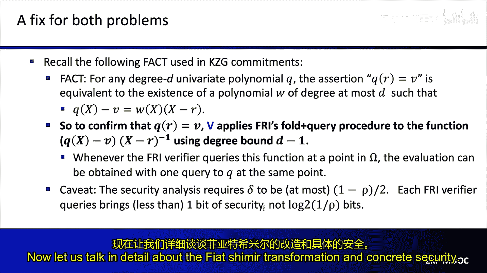

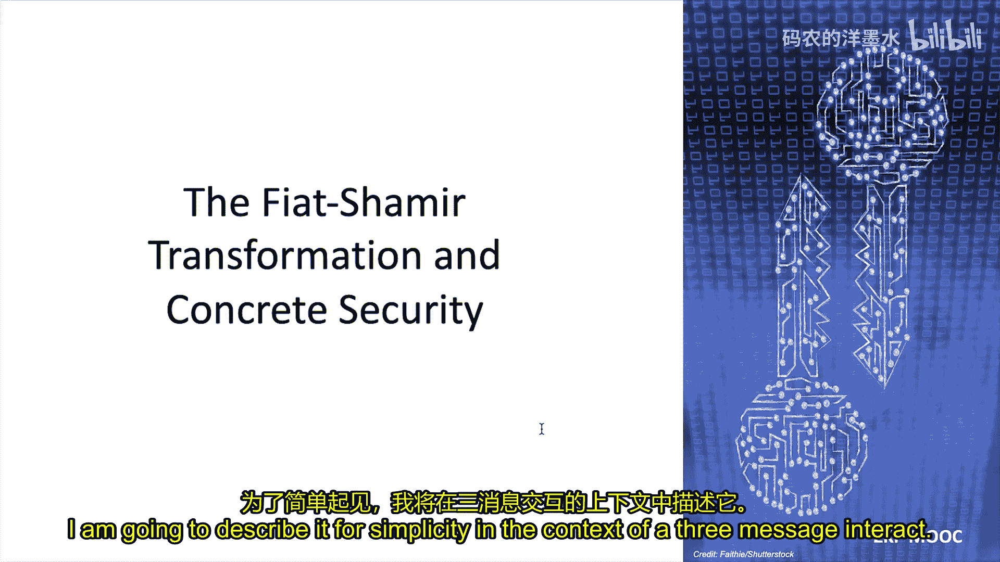

**重要提示**：为了确保适应性安全（即使对手能自适应地选择输入 x），必须将公开输入 x 包含在哈希计算中。忽略这一点是一个常见错误。

### 研磨攻击

应用 Fiat-Shamir 变换后，一个始终可用的攻击是“研磨攻击”。作弊的证明者可以反复尝试不同的第一条消息 α，直到找到一个能哈希产生“幸运”挑战 β 的 α（所谓幸运，是指对于这个 β，作弊者能轻易计算出使验证者接受的响应 γ）。

对于一个具有 2^(-λ) 声错误（即 λ 比特安全性）的交互式协议，研磨攻击在尝试 2^b 次哈希后成功的概率约为 2^(-λ + b)。这与许多其他密码原语（如碰撞抵抗哈希函数的生日攻击）的攻击成功率随计算量增长的速度不同，研磨攻击的成功率增长更快。

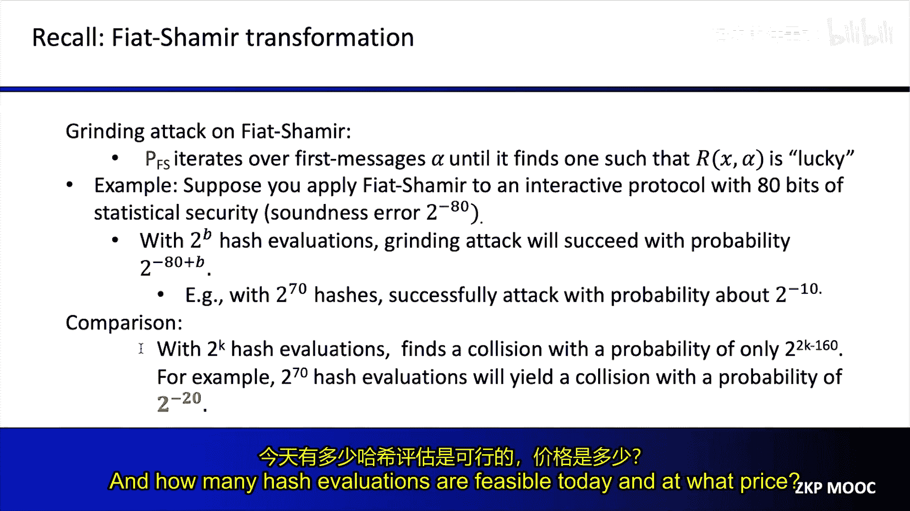

### 交互式 vs 非交互式环境下的安全级别

在交互式设置中，作弊者必须与验证者实际交互才能知道挑战 β，从而知道攻击是否成功。如果协议具有 λ 比特安全性，作弊者平均需要与验证者交互约 2^λ 次才能成功一次，这很容易被检测和阻止。

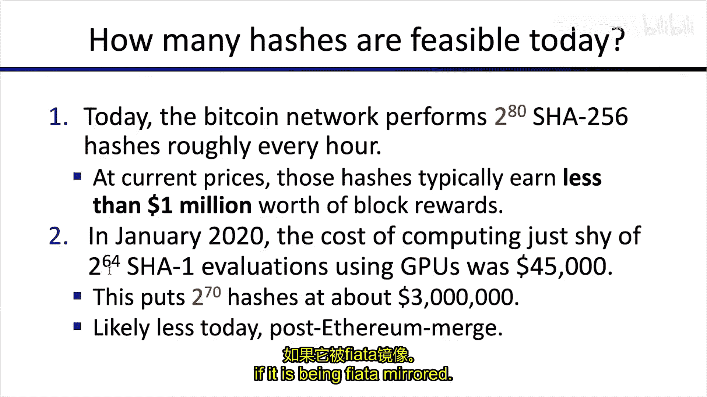

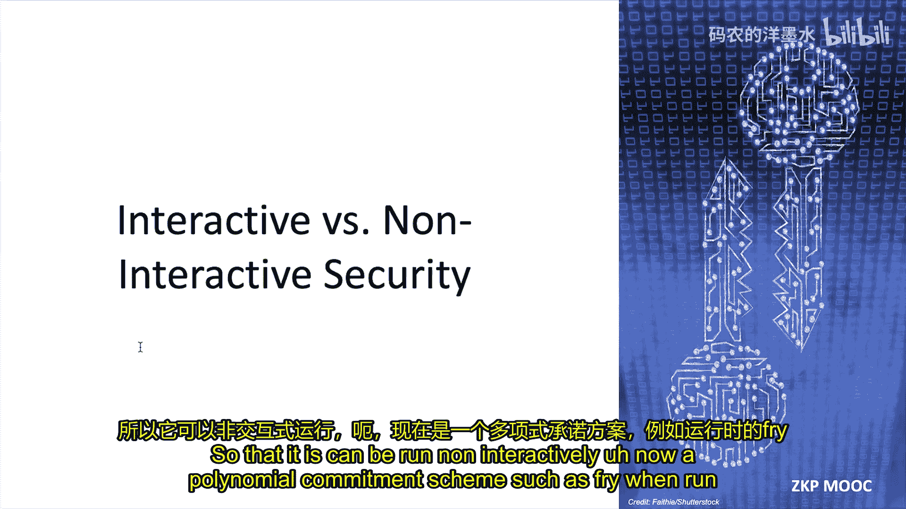

在非交互式设置中，作弊者可以本地进行研磨攻击，无需与验证者交互。因此，要达到相同的实际安全水平，非交互式协议需要比交互式协议高得多的安全参数 λ。例如，60比特安全性在交互式设置中可能足够，但在非交互式设置中则远远不够，因为 2^60 次哈希计算在现代硬件上是可行的。

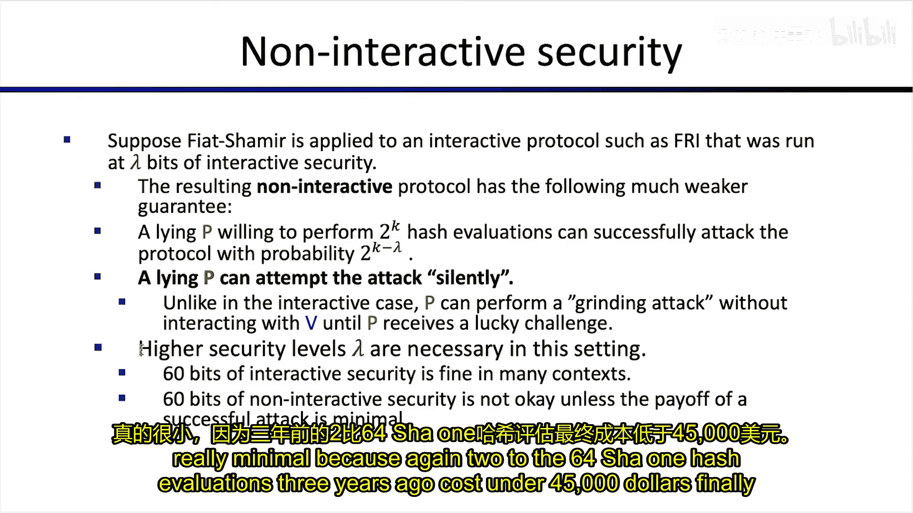

### 多轮协议与轮次逐轮可靠性

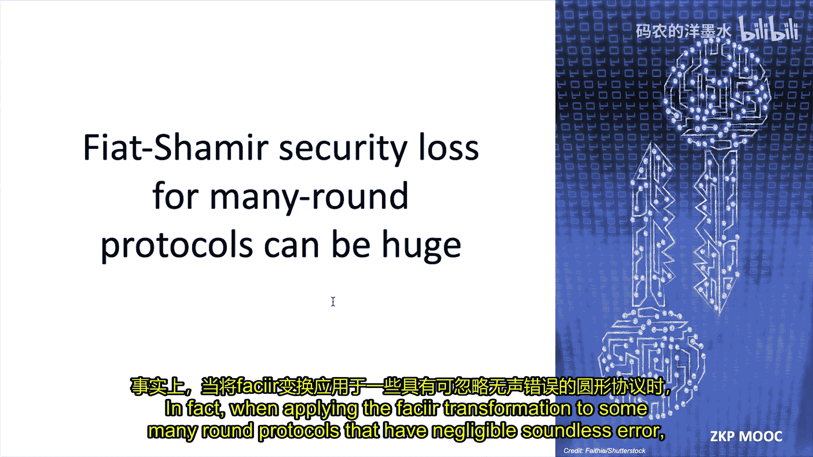

将 Fiat-Shamir 应用于多轮交互式协议可能导致灾难性的安全性损失。一个经典的例子是：将一个声错误为 1/2 的协议顺序重复 λ 轮，可以得到声错误为 2^(-λ) 的协议。但对其应用 Fiat-Shamir 后，作弊者可以“逐轮研磨”，依次为每一轮找到幸运消息，总成本仅为 O(λ) 次哈希，从而使非交互式协议完全不安全。

为了避免这种安全性损失，需要证明原始的交互式协议满足“轮次逐轮可靠性”。这意味着作弊者不能通过在许多轮中分别获得一点点“幸运”来累积成功，而必须在一轮中就获得极大的幸运。已知像求和检查协议这样的多轮协议是满足轮次逐轮可靠性的。

**一个重要说明**：FRI 是一个对数轮次的协议，目前通常以非交互式方式部署（通过 Fiat-Shamir）。据我所知，尚未有公开证明表明 FRI 满足轮次逐轮可靠性。这是一个当前分析中的空白，协议设计者应意识到这一点，因为如果不满足该性质，应用 Fiat-Shamir 可能导致实际安全性远低于预期。

## 总结

在本节课中，我们一起学习了：
1.  **基于 FRI 的多项式承诺方案**：它通过让证明者在单位根子集上进行 Merkle 承诺，并结合一个交互式的“折叠-查询”低度测试，实现了透明且可能后量子安全的承诺方案。其性能在证明者时间、证明大小和验证时间之间存在可调的权衡。
2.  **Fiat-Shamir 变换的深入细节**：我们回顾了其工作原理，重点讨论了研磨攻击及其对安全性的影响，比较了交互式与非交互式设置下所需安全级别的差异，并强调了将 Fiat-Shamir 应用于多轮协议时，验证轮次逐轮可靠性的重要性。

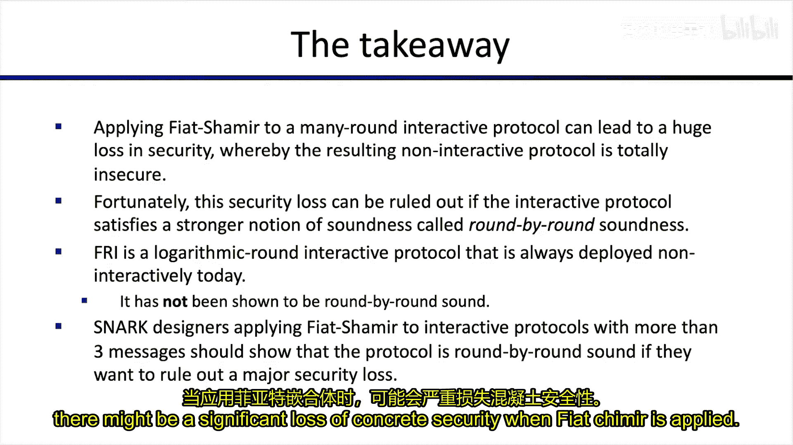

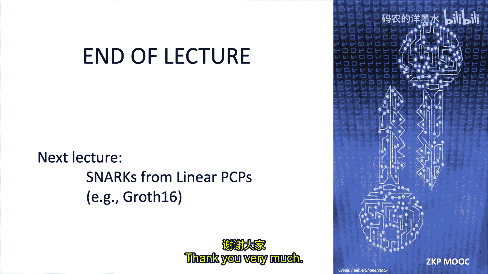

理解这些细节对于设计和评估使用 FRI 和 Fiat-Shamir 的密码协议至关重要。下一讲将涵盖基于线性 PCP 的 SNARK，例如 Groth16。