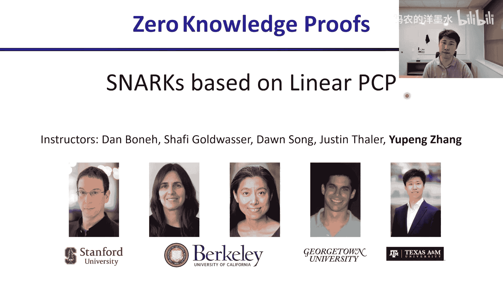
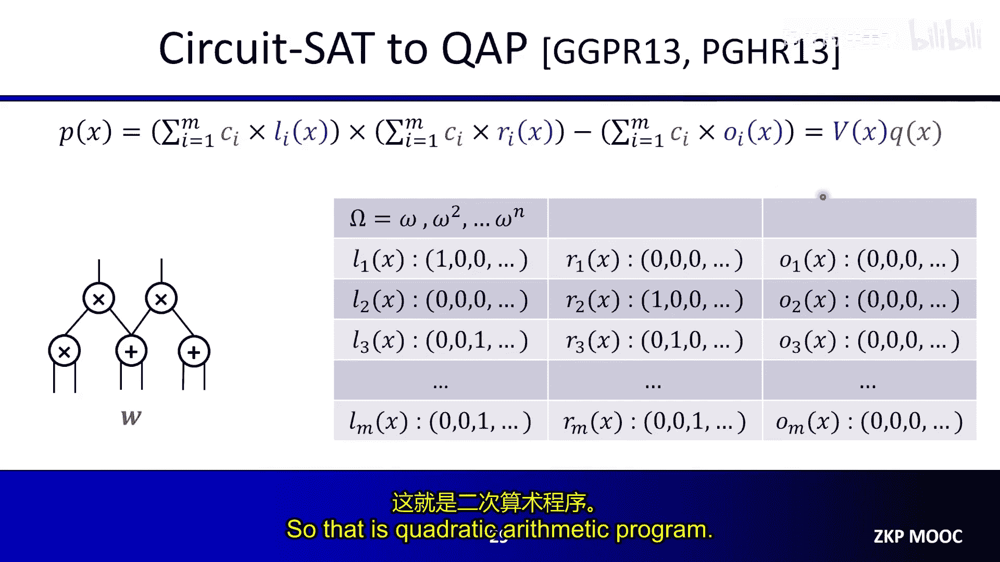
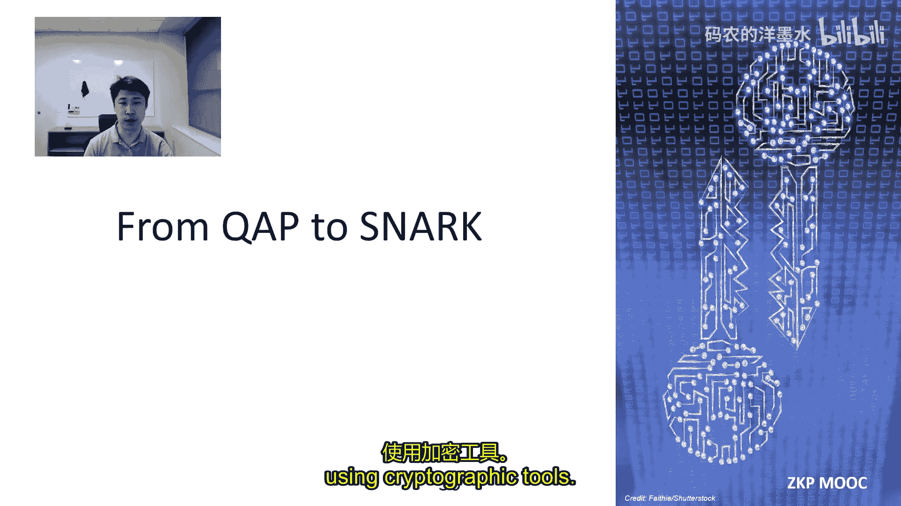
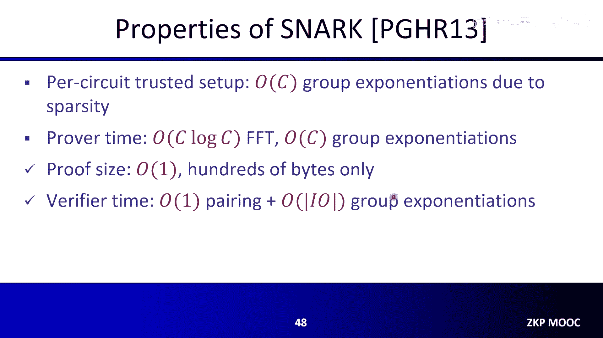
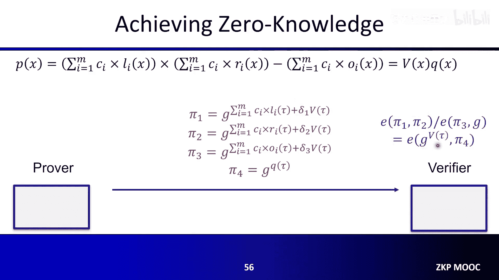
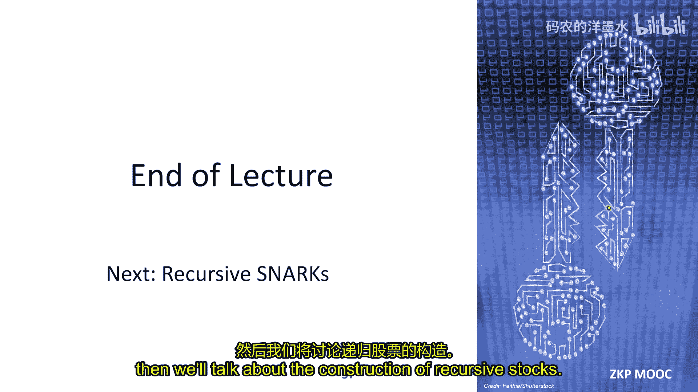

# 009：基于线性 PCP 的 SNARKs

在本节课中，我们将要学习基于线性 PCP（概率可检查证明）和 QAP（二次算术程序）构造 SNARKs 的技术。这种技术是构建最早一批高效 SNARK 实现的基础，其特点是证明尺寸极短，验证速度极快。

## 概述

我们将首先回顾 SNARKs 的发展脉络，然后深入探讨二次算术程序（QAP）的核心构造。接着，我们将学习如何利用双线性配对将 QAP 编译成一个具有恒定尺寸证明的 SNARK。最后，我们将介绍该框架的一些重要变体，包括对 R1CS 约束系统的支持、Gro16 方案的优化以及如何实现零知识性。

## 第一部分：二次算术程序（QAP）

上一节我们回顾了 SNARKs 的发展历程，本节中我们来看看如何将电路可满足性问题转化为一个多项式方程，即二次算术程序。

### 计算轨迹与选择子多项式

我们的目标是证明一个算术电路 C 存在一个满足的赋值 w，使得 C(w) = y。为了做到这一点，我们首先定义计算的“轨迹”。

*   **轨迹定义**：对于 QAP，我们将轨迹定义为电路中所有乘法门的输入和输出值组成的向量。加法门的输出值不直接包含在轨迹中，但会通过后续的多项式定义被隐式处理。

假设电路有 m 个这样的值（包括输入和乘法门输出），n 个乘法门。我们将轨迹表示为一个向量 **c** = (c1, c2, ..., cm)。

接下来，我们为电路中的每个乘法门 j (j=1,...,n) 定义一个公开的“选择子多项式”集合。这些多项式编码了电路中各条线如何连接到乘法门。

以下是定义这些多项式的步骤：

1.  **左输入选择子多项式 L_i(x)**：对于轨迹中的每个值 c_i，我们定义一个多项式 L_i(x)。该多项式在点集 {ω^1, ω^2, ..., ω^n}（其中 ω 是 n 次单位根）上的取值规则为：如果 c_i 是第 j 个乘法门的左输入，则 L_i(ω^j) = 1，否则为 0。然后，我们通过插值法得到唯一的 n-1 次首一多项式 L_i(x)。

2.  **右输入选择子多项式 R_i(x)**：类似地，定义 R_i(x)。如果 c_i 是第 j 个乘法门的右输入，则 R_i(ω^j) = 1，否则为 0。通过插值得到 R_i(x)。

3.  **输出选择子多项式 O_i(x)**：定义 O_i(x)。如果 c_i 是第 j 个乘法门的输出，则 O_i(ω^j) = 1，否则为 0。通过插值得到 O_i(x)。

这些多项式被称为“选择子多项式”，因为当我们在特定点（如 ω^j）计算它们的线性组合时，可以“选择”出对应乘法门的输入或输出值。

### 主多项式与 QAP 方程

基于选择子多项式和轨迹向量，我们定义三个“主”多项式：

*   **L(x) = Σ_{i=1}^{m} c_i * L_i(x)**
*   **R(x) = Σ_{i=1}^{m} c_i * R_i(x)**
*   **O(x) = Σ_{i=1}^{m} c_i * O_i(x)**

这些多项式的关键性质在于：
*   **L(ω^j)** 恰好等于第 j 个乘法门的左输入值。
*   **R(ω^j)** 恰好等于第 j 个乘法门的右输入值。
*   **O(ω^j)** 恰好等于第 j 个乘法门的输出值。

现在，我们定义**主多项式 P(x)**：
**P(x) = L(x) * R(x) - O(x)**

如果轨迹 **c** 是电路的正确赋值，那么对于每一个乘法门 j，都有 `左输入 * 右输入 - 输出 = 0`。这意味着：
**P(ω^j) = 0, 对于所有 j = 1, ..., n**

这个条件等价于：多项式 P(x) 在点集 {ω^1, ..., ω^n} 上取值为零。这进一步等价于：存在一个多项式 Q(x)，使得：
**P(x) = V(x) * Q(x)**
其中 **V(x) = Π_{j=1}^{n} (x - ω^j)** 称为**消失多项式**，它在给定点集上为零。

因此，电路可满足性问题被转化为一个多项式方程问题：证明者需要证明他知道一个轨迹向量 **c** 和一个商多项式 Q(x)，使得上述等式成立。

### 小结

在本节中，我们学习了如何将电路可满足性问题编码为二次算术程序。核心思想是利用选择子多项式将电路结构信息公开化，并将计算正确性条件转化为一个多项式可除性条件：**P(x) 必须能被消失多项式 V(x) 整除**。这为后续使用密码学工具进行高效证明奠定了基础。

## 第二部分：从 QAP 到 SNARK

上一节我们介绍了如何构造 QAP，本节中我们来看看如何利用密码学工具，特别是双线性配对，将 QAP 编译成一个具有恒定尺寸证明的 SNARK。

### 线性 PCP 模型

在深入构造之前，我们先理解一下线性 PCP 模型。它是经典 PCP 模型的推广：
*   **证明者**：生成一个由向量 **c** 定义的线性函数作为预言机。对于查询向量 **q**，预言机返回内积 **<c, q>**。
*   **验证者**：向该预言机提交多个线性查询（即向量），并根据返回的标量值验证陈述的正确性。

QAP 可以看作线性 PCP 的一个实例。验证者可以通过向由 **c** 和 Q(x) 的系数构成的预言机提交特定的线性查询，来随机检查等式 P(x) = V(x) * Q(x) 在某个随机点是否成立。

然而，我们不会直接使用这个交互式模型，而是使用密码学原语将其编译成非交互式证明。

### 使用双线性配对的 SNARK 构造

我们使用双线性配对群 (G1, G2, G_T)，其阶为 p，生成元为 g。双线性配对 e: G1 × G2 -> G_T 满足 e(g^a, g^b) = e(g, g)^{ab}。

构造的核心是在一个秘密点 τ（在可信设置阶段生成后必须删除）上“在指数中”计算 QAP 多项式。

以下是构造步骤：

1.  **可信设置（电路特定）**：
    *   生成随机数 τ, α, β。
    *   计算并发布**证明密钥**（给证明者）：
        *   对于所有 i ∈ [m]（秘密导线索引）：`g^{L_i(τ)}, g^{α * L_i(τ)}, g^{R_i(τ)}, g^{α * R_i(τ)}, g^{O_i(τ)}, g^{α * O_i(τ)}`
        *   对于所有 i ∈ [m]（秘密导线索引）：`g^{β * (L_i(τ) + R_i(τ) + O_i(τ))}`
        *   `g^{τ}, g^{τ^2}, ..., g^{τ^{n-1}}` （用于计算商多项式）
        *   `g^{β}, g^{α}`
    *   计算并发布**验证密钥**（给验证者）：
        *   `g^{V(τ)}` （消失多项式在 τ 处的值）
        *   对于所有 i ∈ [m]（公开输入/输出导线索引）：`g^{L_i(τ)}, g^{R_i(τ)}, g^{O_i(τ)}`
        *   `g^{β}, g^{α}, e(g, g)^{αβ}`

2.  **证明生成**：
    证明者使用轨迹 **c** 和计算出的商多项式 Q(x) 的系数，利用证明密钥计算以下群元素作为证明 π：
    *   **π_L = g^{ Σ_{i∈I_mid} c_i * L_i(τ) }** （使用 `g^{L_i(τ)}` 计算）
    *   **π_R = g^{ Σ_{i∈I_mid} c_i * R_i(τ) }** （使用 `g^{R_i(τ)}` 计算）
    *   **π_O = g^{ Σ_{i∈I_mid} c_i * O_i(τ) }** （使用 `g^{O_i(τ)}` 计算）
    *   **π_Q = g^{ Q(τ) }** （使用 `g^{τ^k}` 计算）
    *   **π_C = g^{ Σ_{i∈I_mid} c_i * β * (L_i(τ) + R_i(τ) + O_i(τ)) }** （使用 `g^{β*(L_i+R_i+O_i)(τ)}` 计算，用于一致性检查）

3.  **验证**：
    验证者执行以下步骤：
    a.  **重构完整承诺**：利用公开输入/输出值及其对应的验证密钥中的项，计算完整的左、右、输出多项式承诺：
        *   `π_L' = π_L * Π_{i∈I_io} (g^{L_i(τ)})^{c_i}`
        *   `π_R' = π_R * Π_{i∈I_io} (g^{R_i(τ)})^{c_i}`
        *   `π_O' = π_O * Π_{i∈I_io} (g^{O_i(τ)})^{c_i}`
    b.  **检查 QAP 主方程**：验证以下配对等式：
        *   **e(π_L', π_R') / e(π_O', g) = e(g^{V(τ)}, π_Q)**
        这个等式在指数中对应检查：`L(τ)*R(τ) - O(τ) = V(τ)*Q(τ)`。
    c.  **检查系数一致性**：验证证明者在计算 π_L, π_R, π_O 时使用了相同的系数 **c**：
        *   **e(π_L * π_R * π_O, g^{β}) = e(π_C, g)**
        如果使用不同的系数，证明者将无法通过此检查。

### 安全性考虑与优化

上述构造（基于 PGHR13/Pinocchio）解决了几个关键问题：
1.  **知识性**：通过知识指数假设（KOE）或通用群模型（GGM），确保证明者必须按照预设形式使用证明密钥来生成证明。
2.  **系数一致性**：通过额外的项 `g^{β*(L_i+R_i+O_i)(τ)}` 和证明元素 π_C，确保 π_L, π_R, π_O 由相同的轨迹向量 **c** 计算而来。
3.  **公开输入/输出**：通过将公开值相关的计算移交给验证者，支持电路的公开部分。

该 SNARK 的特性包括：
*   **证明尺寸**：恒定（Pinocchio 中为 5 个群元素，约数百字节）。
*   **验证时间**：近乎恒定（主要成本是几次双线性配对运算，小于 1 毫秒）。
*   **证明时间**：与电路大小成线性关系，涉及 FFT 和线性次数的群指数运算。
*   **主要缺点**：需要针对每个电路进行可信设置。

### 小结

在本节中，我们学习了如何利用双线性配对将 QAP 编译成一个高效的 SNARK。核心思想是在一个秘密点 τ 的指数上进行多项式计算和验证。通过精心设计的可信设置和验证方程，我们能够获得一个证明尺寸极小、验证速度极快的非交互式论证系统。

## 第三部分：变体与扩展

上一节我们介绍了基于 QAP 的经典 SNARK 构造，本节中我们来看看该框架的一些重要变体和扩展。

### 支持 R1CS 约束系统

算术电路是 R1CS 的一个特例。R1CS 提供了更通用的约束形式：
**(A · c) ⊙ (B · c) = (C · c)**
其中 A, B, C 是公开的 m×n 矩阵，c 是轨迹向量，⊙ 表示逐分量乘法。

将 QAP 推广到支持 R1CS 非常简单：只需将选择子多项式 L_i(x), R_i(x), O_i(x) 在点 ω^j 的取值从 {0, 1} 扩展到任意公开的域元素（即矩阵 A, B, C 的第 j 行第 i 列的值）。插值和后续的 QAP 构造过程完全不变。

这种矩阵视角将 SNARK 的构造分解为两个核心子问题：
1.  **线性检查**：证明一个承诺向量与一个公开矩阵的乘积等于另一个承诺向量。
2.  **哈达玛积检查**：证明两个承诺向量的逐分量乘积等于第三个承诺向量。

这个视角也被许多其他 SNARK 系统（如 Bulletproofs, Marlin, Spartan）所采用。

### Groth16 优化：三元素证明

Groth16 方案在 Pinocchio 的基础上进一步优化，将证明尺寸减少到仅 **3 个群元素**，这是目前已知的最短证明之一。

核心思想是巧妙地重组证明元素和验证方程。简化的直觉如下：
*   将原本的 π_L 和 π_R 与随机掩码 α, β 结合。
*   将 π_O, π_Q 和用于一致性检查的项合并到一个新的证明元素 π 中。
*   通过调整可信设置和验证方程，最终只需要 (π_A, π_B, π_C) 三个群元素，并通过一个配对等式完成验证：
    **e(π_A, π_B) = e(π_C, g) * e(一些公开的验证密钥项)**

具体的构造涉及更复杂的代数变换，但其根源仍然是 QAP 和线性 PCP 框架。

### 实现零知识性

原始的 QAP SNARK 证明是确定性的，可能会泄露关于见证的部分信息。为了实现零知识性，需要在证明中加入随机性。

基本思路是在指数中添加一个随机倍数 δ 的消失多项式 V(τ)：
*   例如，将 π_L 修改为 `g^{ Σ c_i*L_i(τ) + δ_L * V(τ) }`。
*   由于 V(τ) 是公开验证密钥的一部分，且在主方程检查中会被消去（因为配对等式的右边包含 e(g^{V(τ)}, π_Q)），这种随机化不会破坏验证的有效性。
*   同时，随机数 δ 使得证明在统计上隐藏了真实的轨迹向量 **c**，从而实现了零知识。

无论是 Pinocchio 还是 Groth16，都可以通过类似的方法（添加适当的随机化项）来获得零知识版本。

### 总结

在本节课中，我们一起学习了基于线性 PCP 和二次算术程序构造 SNARKs 的技术。

我们首先深入探讨了 QAP 的构造，它将电路可满足性问题转化为一个多项式可除性问题。接着，我们学习了如何利用双线性配对，通过电路特定的可信设置，将 QAP 编译成一个证明尺寸恒定、验证高效的 SNARK。最后，我们介绍了该框架的重要变体：支持更通用的 R1CS 约束系统、实现超短证明的 Groth16 方案，以及如何为这些构造添加零知识性。

这种基于线性 PCP 的 SNARK 是最早实现并广泛应用的技术之一，其极短的证明和快速的验证使其在许多隐私计算和区块链场景中具有独特优势，尽管其电路特定的可信设置是一个需要考虑的权衡点。