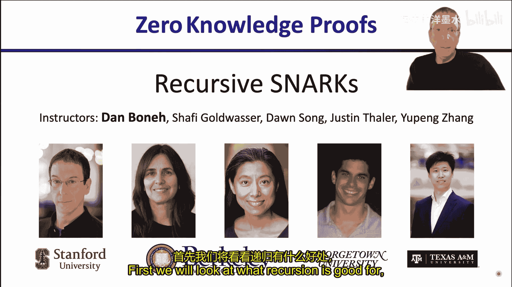
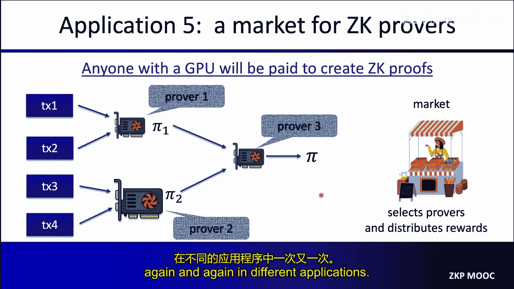
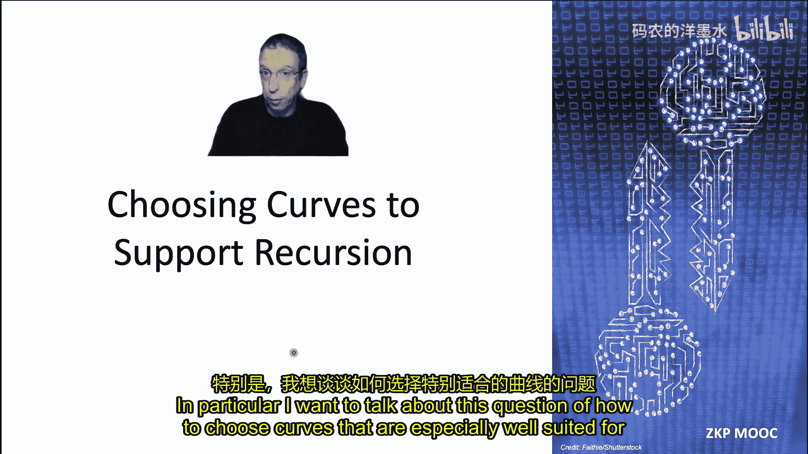
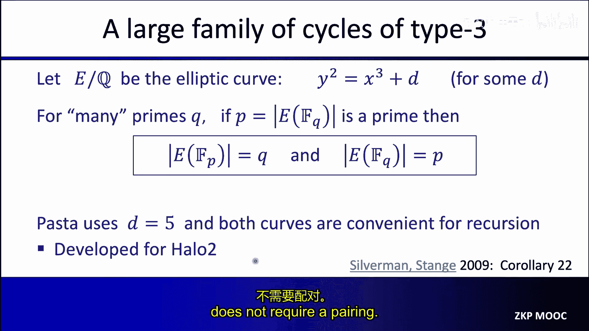
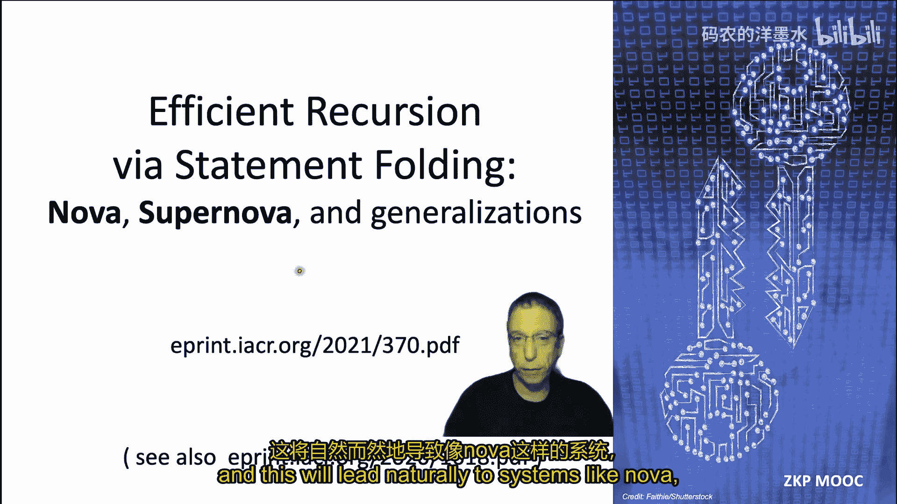
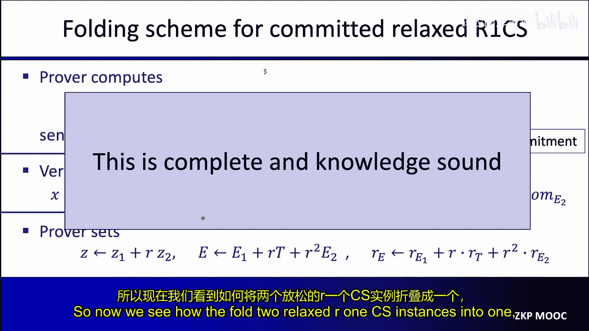
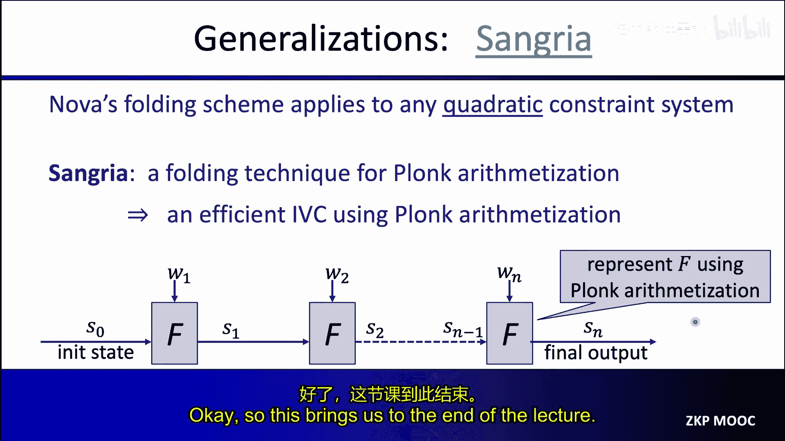
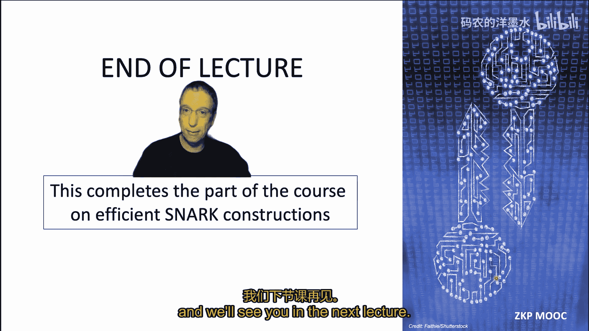

# 010：递归的 SNARKs 🌀

在本节课中，我们将要学习一个引人入胜的概念：递归的 SNARK。首先，我们会探讨递归有什么用处，然后我们将了解如何构建高效的递归 SNARK。

## 概述：什么是递归 SNARK？

首先，我们快速回顾一下构成一个 SNARK 的三个算法。一个预处理 SNARK 是一个由三个算法组成的元组：S（设置）、P（证明）和 V（验证）。

*   **设置算法 S**：接收一个电路，对其进行预处理，输出证明者的公共参数和验证者的公共参数。
*   **证明算法 P**：使用证明者参数、公开陈述 X 和见证 W 来生成一个证明 π。
*   **验证算法 V**：使用验证者参数、公开陈述 X 和证明 π 来决定是接受还是拒绝该证明。

在之前的课程中，我们看到了几种 SNARK 构造。例如，我们研究了 Groth16 和 PlonK SNARK。特别是使用 KZG 多项式承诺方案的 PlonK。这些构造能产生很短的证明，但证明者的生成时间不是线性的，实际上是 `O(N log N)`，其中 N 是计算的大小。我们称之为拟线性时间证明者。

我们还研究了其他 SNARK 构造，特别是基于 FRI 的构造以及基于编码的构造（如 Brakedown、Orion、Orion+）。这些系统在实践中拥有更快的证明者，但不幸的是，它们生成的证明更长。

一个自然的问题是：我们能否鱼与熊掌兼得，即拥有一个既快速又能生成非常简短证明的证明者？为了开始回答这个问题，让我们先看看 SNARK 递归的一般原理。

## 递归证明的原理

当我们谈论证明递归时，我们指的是什么？让我们从两层 SNARK 递归开始解释。

通常，当我们应用一个 SNARK 时，我们有一个陈述 X 和一个见证 W，我们生成一个证明，表明见证 W 是陈述 X 的有效见证。

在递归 SNARK 中，其思想不是直接生成实际的证明，而是生成一个“关于证明的知识”的证明。换句话说，我们不是证明我们知道陈述 X 的一个见证 W，而是证明我们知道一个“关于陈述 X 的见证 W 的证明”。

让我们看看这是如何运作的。假设我们从一个陈述 X 和一个见证 W 开始。我们像往常一样，使用我们的证明系统（SNARK）来生成一个证明 π，证明见证 W 是陈述 X 的有效见证。这个证明 π 证明了我们知道一个 W，使得 C(x, W) = 0。

但这并不是我们停止的地方。现在我们要做的是，在这个证明 π 之上运行另一个证明系统。这个外层证明系统的公开陈述仍然是陈述 X，但其见证实际上是来自内层系统的证明 π。

因此，第二层系统实际上是在证明：我知道一个证明 π，该证明表明见证 W 是陈述 X 的有效见证。我们不是直接证明见证的知识，而是证明一个“证明该见证有效”的知识。

我们最终得到一个证明 π‘。它实际上证明的是：这个第二层证明 π’ 知道一个 π，使得 π 是陈述 X 的有效证明。因此，证明 π‘ 所处理的电路实际上是内层系统验证算法 V 的电路。

我们通常将第一层系统称为**内层系统**，它实际上是在证明相对于电路 C 的见证 W 的知识。第二层系统（外层系统 S‘, P‘, V‘）实际上是相对于一个实现了内层系统验证算法 V 的电路来生成证明。

所以你可以看到，π‘ 是一个递归证明，因为我们是在证明一个“证明的知识”，而不是直接证明一个“见证的知识”。这个图景在本节课中非常重要，递归的全部意义在于，与其直接证明见证的知识，不如证明一个“见证存在”的证明的知识。

## 递归的应用

### 应用一：证明压缩（兼顾速度与长度）

让我们看看递归的第一个应用：构建一个既拥有快速证明者，又能产生简短证明的系统。

假设内层证明系统（SPV）拥有快速的证明者，但可能产生较大的证明。例如，证明者和验证者在这个系统中都很快，但最终的证明 π 相当长（例如，100 KB）。

我们想要做的是将这个证明压缩成更短的东西。我们可以运行外层系统，它可能拥有较慢的证明者，但能产生较短的证明。现在，外层证明系统将再次证明：内层系统的验证者会接受见证证明 π。这将产生一个外层证明 π‘，它可能只有 1 KB 长。

这里的要点是：想象一下我们实际要证明见证知识的电路 C 非常巨大。直接使用外层系统为电路 C 构造证明会相当慢（因为证明者慢），虽然会产生小证明，但生成那个证明需要很长时间。

相反，我们可以这样做：使用这个内层证明系统为巨大的电路 C 快速生成一个证明（我们试图证明 W 是有效见证）。这比使用外层证明系统运行得更快，但会产生一个大证明。然后，我们只在内层系统的验证器电路上运行外层系统。因此，如果内层系统的验证器电路比我们试图用内层系统证明的原始电路 C 小得多，那么外层系统的工作速度将比我们试图直接用外层系统为原始电路 C 生成证明要快得多。

通过这种方式，我们实现了两全其美。我们使用快速的证明者来处理直接查看 W 的大型电路，但这会产生一个大证明。然后我们使用证明者较慢的内层系统，但现在它只应用于一个小得多的电路（即内层系统的验证器）。最终结果将只是一个 1 KB 长的证明。我们得到了一个快速的总体证明者，并且最终证明实际上很短。

这只有在内层系统的验证器电路比我们试图证明的实际陈述简单得多时才适用。这对于证明非常复杂的陈述非常有用，例如在证明 ZK EVM 的大规模执行时经常出现。

当然，当验证者想要验证 W 确实存在时，证明者实际上知道使得 C(x, W) = 0 的 W，它将验证递归证明 π‘，而证明 π 永远不会被实际世界中的验证者看到。

### 知识可靠性的论证

你可能会想，这为什么是可靠的呢？让我们快速论证一下为什么这个递归构造能提供知识可靠性。

固定某个电路 C。它接收 n 个域元素作为陈述，m 个域元素作为见证，并输出 0 或 1，基本上说明见证对陈述是否有效。

快速回顾一下知识可靠性的定义。我们说一个 SNARK (S, P, V) 对于电路 C 是知识可靠的，如果以下条件成立：对于每一个恶意的多项式时间证明者 A，存在一个高效的提取器 E，满足以下性质：对于所有我们可以想象的陈述 Y，如果我们的恶意证明者能够产生有效证明的概率（即恶意证明者能够为陈述 Y 生成令人信服的证明的概率），那么无论这个概率是多少，提取器在陈述 Y 上运行时，实际上能够从该恶意证明者中提取出一个见证，并且它产生有效见证的概率大于恶意证明者能够说服验证者的概率减去某个小的 ε（可忽略误差）。这个 ε 被称为知识误差。

我们想要证明我们的两层递归 SNARK 对于特定电路 C 是知识可靠的。让 C‘ 是外层系统实际使用的电路。C‘ 基本上是一个运行内层系统验证器的电路，使用证明 π 作为见证。

假设我们有一个令人信服的证明者 A，它对于外层系统 (S‘, P‘, V‘) 和电路 C‘ 是令人信服的。我们需要构建一个提取器，它不提取证明 π（那不是我们想要的），我们想要的是一个实际上为原始电路 C 提取见证的提取器。

我们的提取器将这样工作：给定一个陈述 X 以及内层系统的验证参数。我们知道外层系统对于电路 C‘ 是知识可靠的（根据假设）。这意味着存在一个提取器 E‘，可以从证明者 A 中提取一个证明 π，使得电路 C‘ 被满足。换句话说，内层验证算法在给定提取的证明 π 时会输出“是”。

但现在看这个 E‘，E‘ 是一个输出证明 π 的电路，该证明说服了内层证明系统。换句话说，E‘ 现在成为了内层证明系统的一个令人信服的证明者。那么，因为内层证明系统本身是知识可靠的，我们知道存在一个提取器 E，可以从提取器 E‘（将 E‘ 视为恶意证明者）中提取一个见证，使得 C(x, W) = 0。

所以这是一个两步提取过程。我们首先从外层证明系统中提取一个证明，然后现在我们有了一个来自外层证明系统的证明提取器，我们可以运行内层证明系统的提取器，并获得我们感兴趣陈述的实际见证。

我们的提取器（由先后运行两个提取器组成）成功的概率恰好是 A 说服外层证明系统的概率减去两个知识误差之和。因为两个知识误差都是可忽略的，它们的和也是可忽略的，所以总体提取成功。

这就是为什么两层递归构造是可靠的，因为我们可以从外层证明系统中提取，然后再从内层证明系统中提取，从而得到我们感兴趣的实际见证。

我们必须稍微注意的一点是，这些提取器的运行时间可能会随着递归的进行而变得越来越差。想象一下，外层证明系统的提取器 E‘ 的运行时间是恶意证明者运行时间的两倍。内层证明系统也是如此。那么我们整体提取器的运行时间将是给定恶意证明者运行时间的四倍。对于两层递归，这完全可以接受，四倍时间仍然是多项式时间。

但是，想象在一个 n 层递归系统中。如果我们必须重复这个过程 n 次，我们最终得到的最终提取器将以 2^n 倍于原始恶意证明者的时间运行，这不再是多项式时间。所以我们必须小心，递归深度实际上只能是对数于安全参数的，否则我们最终会得到一个运行时间过长的提取器。人们可能认为这只是我们证明技术的一个产物。也许有另一种证明技术可以避免这种指数级增长。但通常，我们会尝试将递归深度限制为最多安全参数的对数，这实际上避免了这个问题。但在某些应用中，我们会忽略这个技术问题，给出一个使用线性递归深度的构造。通常，只要我们有一个线性递归深度的构造，我们通常可以将其转换为对数递归深度的构造。

### 递归中的另一个问题：随机预言机

递归中还有另一个问题需要指出。当我们构造 SNARK 系统时，我们经常使用 Fiat-Shamir 变换将交互式证明系统转换为非交互式的。Fiat-Shamir 变换引入了随机预言机的概念，证明者和验证者通过使用哈希函数（我们将其建模为随机预言机）来生成挑战，以使证明系统非交互。

问题是，当我们进行递归时，我们最终会得到一个验证器电路，其中嵌入了随机预言机门。但现在，递归证明者必须处理内层证明系统的验证器电路，如果这个验证器电路中有随机预言机门，递归证明者就不知道如何处理这些门。这些不是计算门，它们调用随机预言机，而证明者无法处理。

因此，在递归实际工作之前，我们必须以某种方式摆脱这些随机预言机门。对此有一个标准的答案：在开始递归过程之前，我们用具体的哈希函数实例化验证器电路中的所有随机预言机。我们用具体的哈希函数（如 SHA-256 或其他更适合我们算术电路的哈希函数，如 Poseidon）替换随机预言机。关键是，我们用非常具体的哈希函数替换了随机预言机。

当然，一旦我们脱离了随机预言机模型，我们就不再拥有 SNARK 系统是知识可靠的安全证明。我们必须假设，在此之后，证明系统仍然是知识可靠的。我们可以通过它在随机预言机模型中成立这一事实来证明这个假设是合理的，但严格来说，一旦我们实例化了随机预言机，现在我们必须做出另一个假设，即实例化后的系统仍然是安全的。

关键是，现在我们有了一个实例化的系统，其中验证器电路不再使用随机预言机门，而是使用具体的哈希函数。因此，验证器电路是一个具体的电路，这现在允许我们进行递归，因为外层证明者现在可以实际处理内层 SNARK 系统的验证器电路。当然，为了证明由此产生的递归 SNARK 是安全的，我们必须依赖这个有些“丑陋”的假设，即这个用真实哈希函数替换了随机预言机的具体系统仍然是知识可靠的。

### 总结与更多应用

总结我们目前的讨论，我们看到的递归的第一个应用与证明压缩有关。当然，这个构造可以推广到三层递归、四层递归等等，停在两层递归并没有什么神奇之处。

接下来我想展示的下一个应用是为了**流式证明生成**。流式证明生成是什么意思？想象一下，我们有一个证明者，例如在 Rollup 中，它需要一次证明许多陈述。它需要证明一大堆交易（比如 100 笔交易）都是有效的。这意味着它实际上试图证明它知道 W1, W2, ..., Wn，使得 W1 是 x1 的有效见证，W2 是 x2 的有效见证，依此类推。它试图证明这个陈述的合取。

这样做的问题是，如果你必须为这整个合取生成一个单一的、庞大的证明，那实际上可能非常昂贵且构建缓慢。特别是，你只能在拥有了所有要证明的 n 个陈述之后才能开始构建这个证明。但在现实中，情况并非如此。当你构建一个 Rollup 系统时，公众会一次发送给你一笔交易。你可以等到有 1000 笔交易后再开始一次性为所有 1000 笔交易生成证明。但我们希望做的是，一旦第一笔交易可用，就开始生成证明交易有效的证明。我们称之为流式证明生成，因为我们不想等到所有陈述都可用后才生成证明，我们希望在陈述发送给我们的过程中就开始生成证明。

同样，递归是实现这一点的非常好的方法。让我们看看两个世界来解释这个问题。想象我们有 100 笔交易正在发送给我们。天真地，正如我们所说，我们只能在最后一笔交易提交后才能开始为这 10 笔交易生成证明。因此，在最后一笔交易提交和我们实际可以将证明提交到 Layer 1 链之间会有相当长的延迟。

我们希望做得更好。我们使用递归来做得更好。我们将获取前 10 笔交易，然后为它们生成一个证明。然后我们为第二批 10 笔交易生成一个证明。依此类推。所以你看，我们已经在交易还在流入时就开始生成证明了。最后，一旦所有交易都可用，我们要做的就是获取我们生成的 10 个证明，并生成一个“证明的证明”。我们生成一个证明，表明这 10 个证明是有效的，最后，这成为我们提交到 Layer 1 链的证明。

关键是，现在在所有 100 笔交易被接收后，我们唯一要做的就是为最后 10 笔交易的批次生成一个证明，以及一个“证明的证明”。这两个操作都比在收到所有交易后为所有交易生成一个单一的整体证明要快得多。因此，我们在最后一笔交易被接收和我们能够将东西发布到 Layer 1 之间的延迟要短得多。

这又是递归的另一个非常巧妙的应用，可以将其视为在陈述一次一个地流向您时加速证明生成的一种方式。

### 应用三：增量可验证计算

我们还有两个应用要展示，然后我们将开始研究如何构建高效的递归证明。

下一个应用实际上是一个重要的应用，称为**增量可验证计算**。这也可以用来大大加速证明生成。

这里的设置是，我们有一个通过迭代某个固定函数 F 来完成的非常长的计算。计算从某个初始状态 S0 开始，第一个输入 ω1 到来，我们应用函数 F，得到一个新状态 S1。另一个输入到来，我们得到一个新状态 S2。我们一直这样做，直到最终得到最终状态 Sn。

我们的目标基本上是生成一个简洁的证明，证明者知道见证 ω1 到 ωn，使得最终输出 Sn 实际上是正确的。换句话说，Sn 是将 ω1 到 ωn 应用于初始状态 S0 的结果。验证者当然知道函数 F，因为那是公共函数。它知道我们运行函数 F 的步数。它有初始状态和最终状态，它只想验证最终状态是正确的。

这实际上在实践中经常发生，尤其是在你将 F 视为微处理器时。想象 F 字面上实现了一个简单的微处理器，那么这里发生的是，我们实际上是在逐步遍历计算的状态。由于 F 是一个图灵完备的微处理器，这基本上捕获了通过运行这个微处理器许多许多周期而发生的任意计算。

既然我们提到了通过迭代函数 F 完成的长时间计算，我忍不住要联系到 Deep Thought。正如你可能从《银河系漫游指南》中记得的那样，Deep Thought 是一个由文明建造的计算机。文明问计算机“生命、宇宙和一切的答案是什么”。计算机说：“哦，这是一个非常有趣的问题。我需要 700 万年才能找出答案。”于是它工作了 700 万年。这就是我们在这里想到的长时间计算，在 700 万年后，它说答案是 42。这不是一个非常有帮助的答案，但那就是答案。这就是一个人们可能也想为其生成一个简洁证明的非常长计算的例子，证明计算是正确完成的，因此 42 确实是生命、宇宙和一切问题的正确答案。这样我们就不必相信 Deep Thought 的话了。

#### IVC 的构造

构造是一个非常自然的想法。在每一步，我们当然会输出该步骤的状态，但我们也会输出一个证明，表明计算直到该步骤都是正确的。具体来说，对于 i = 1 到 n，在步骤 i，证明者将输出当前状态 Si 以及一个证明 πi。这个证明证明了证明者有一个见证，即前一个状态 S(i-1)、当前步骤的输入 ωi 以及前一个状态正确的证明 π(i-1)。见证必须满足以下属性：首先，如果我们将 F 应用于这个前一个状态和 ωi，我们得到当前状态。这证明了 Si 是正确的。更重要的是，我们证明了前一个状态的证明 π(i-1) 实际上是相对于前一个计算状态的有效证明。

同样，在每一步，我们输出当前状态和一个证明，该证明证明：a) 当前状态相对于前一个状态是正确的，并且 b) 前一个状态的证明相对于前一个状态也是正确的。

我想简要地说服你，这意味着最后一个证明 πn 连同最终输出 Sn 证明了，实际上，证明者知道 ω1 到 ωn，使得输出 Sn 确实是正确的。为什么这是真的？我们需要构建一个提取器来证明知识可靠性。我们想要证明证明者知道使 Sn 正确的 ω1 到 ωn。我们将在 πn 上运行提取器。提取器将从 πn 中提取什么？它将提取前一个状态的有效见证。这个在点 n-1 的有效见证向我们证明 F(S(n-1)) = Sn，并且 π(n-1) 是前一个陈述的有效证明。现在我们将再次运行提取器，每次运行它，我们都会提取前一个状态，直到最开始，我们将提取 S0，然后电路只是检查 S0 确实是正确的初始状态。

因为我们可以迭代地运行提取器，并提取计算中的所有状态，并且我们知道所有这些状态实际上都是正确的，我们可以由此推断 πn 证明了 Sn 确实是计算的正确输出。

这是对提取器如何工作的高级描述，但这实际上可以变成一个正式的论证，对你来说，通过反复应用提取器，我们实际上可以恢复整个计算轨迹，并且该计算轨迹必须是正确的，这可能是一个很好的练习。

在这一点上，你可能想知道我之前所说的线性递归深度与对数递归深度的问题。我不会在这里深入细节，但要知道，实际上 IVC 也可以仅使用对数深度递归来证明是安全的。

#### IVC 的应用

让我们谈谈 IVC 的一些应用。第一个应用是我们已经讨论过的，你可以将一个长时间的计算分解为一系列小步骤，例如，如果函数 F 实现了一个微处理器，如 RISC-V 或 EVM 的步骤。现在证明者要做的就是一次证明计算的一个步骤，而不是在计算的整个生命周期上证明一个单一的整体证明。我们只是证明这个函数 F 的一个步骤，而不是一次证明所有东西。因为我们只证明一个步骤，这是一个足够简单的证明，它大大减少了证明者的内存需求。现在内存需求只是证明计算的一个步骤所需的内存。这就是人们喜欢做递归的原因之一，它允许我们证明非常非常大的陈述，否则我们可能无法证明，例如由于内存限制，但我们可以一步一步地做，这实际上根本不需要那么多内存。

我想提到的 IVC 还有另外两个非常巧妙的应用。第一个是构建一个单一的简短简洁证明，证明区块链的当前状态是正确的。我可以将整个区块链的有效性证明压缩成一个单一的简洁证明。我们这样做的方式是，让 S0 成为链的初始状态，让 Sn 成为链的当前状态。那么 ω1 到 ωn 就是我们每一步提供给 F 的输入，基本上是有效的交易区块，从 S0 到 S1 的转换只是说明 ω1 是一个有效的交易区块，以及这些交易如何改变链的状态。因此，证明 Sn 是正确的，就是一个简短的证明，验证速度快，表明所有区块都是有效的，并且它们确实导致了当前状态 Sn，这已经使验证者相信 Sn 是正确的。

没有这种机制，如果一个新验证者启动并想要验证 Sn 是正确的，它将不得不下载所有区块并自己重新运行它们，直到获得 Sn。只有这样，它才相信区块链是正确的。有了这些 IVC 方法，当一个新验证者启动并想要验证链的当前状态时，它所要做的就是验证证明 π。当然，它必须确保每个人都同意相同的 Sn。这是一个共识问题。但验证这个 Sn 是否正确是通过一个非常简短和简洁的证明来完成的。这在 Mina 区块链中使用，你可以通过字面上只验证一个证明来验证整个链的状态。

我想提到的另一个应用是所谓的**可验证延迟函数**，其目标是以一种计算无法通过并行性加速的方式计算一个函数。我们想要一个顺序计算，但要以这样的方式完成：一旦你计算出最终答案，实际上很容易说服别人 Sn 是正确的。我们这样做的方式基本上是使用哈希链。我们从 S0 开始，一遍又一遍地应用哈希，最终得到 Sn。这通常表示为 H^n(S0)。IVC 证明现在将使用一个验证速度快的简短证明来证明 Sn 是正确的。我们再次使用 IVC 的原因是，证明者实际上可以一步一步地做这个证明，而不必求助于如果它想一次性完成整体证明所需的大量内存。因此，IVC 允许我们以相对较少的内存对这些长时间计算进行证明。

### 应用四：ZK 证明者市场

我将给你的最后一个应用，然后我们将停止讨论应用并开始讨论构造，那就是这个即将到来的 ZK 证明者市场。人们家里有 GPU，也许用于游戏设备等，他们并不总是使用这些 GPU，他们可能想租出 GPU 以便其他人可以使用它们。然后将会有一个这些证明者的市场，市场接收需要被证明的陈述，例如，需要通过 ZK Rollup 证明的一堆交易。市场将从公众那里接收这些交易集合，然后将其分配给当前可用于进行证明的各种 GPU。

但是，我们不想将所有交易的整个工作分配给单个 GPU。我们希望将其分解成多个部分。因此，市场可能会将“证明交易 1 和 2 是正确的”分配给一个证明者，并同时将“证明交易 3 和 4 是正确的”分配给另一个证明者。现在，我们有了这两对交易的两个证明。第三个证明者现在将构建一个“证明的证明”，证明 π1 和 π2 是正确的，这样最终的证明将是 π，这就是将被推送到 Layer 1 链的东西。

这又是递归出现的一个例子，我们可以并行地让多个实体证明各种交易是正确的，然后我们递归地生成一个“证明的证明”，这就是实际被推送到链上的东西。

你可以看到递归有许多许多应用。SNARK 不仅用于证明陈述是正确的，还用于证明“证明的证明”，正如你所见，这在不同应用中一次又一次地出现。

## 递归的技术问题：算术与曲线选择

现在我们已经理解了递归证明能为我们做的所有美妙事情，我想谈谈进行递归时出现的一个技术问题。特别是，我想谈谈如何选择特别适合递归证明的曲线的问题。

首先，让我们快速回顾一下什么是两层 SNARK 递归。基本上，有一个内层证明系统 (S, P, V)，有一个公开陈述 X，证明者 P 将产生一个证明 π，证明它知道陈述 X 的有效见证 W。这就是证明 π 所证明的。然后，外层证明系统基本上将使用证明 π 作为见证，并产生一个证明 π‘，证明证明者 P’ 知道一个将被内层证明系统接受的证明 π。因此，P‘ 不是直接证明它知道一个见证 W，而是证明它知道一个证明 π，该证明将被内层证明系统的验证者接受。

现在让我们快速回顾一下这些证明系统在高层次上是如何工作的。固定某个电路 C 和一个陈述 X。为了证明我知道一个见证 w 使得 C(x, w) = 0，我们使用对多项式的承诺。例如，我们可能承诺于单变量多项式或多变量多项式，但让我们暂时关注单变量多项式。证明者承诺于一个基本上编码了计算轨迹的多项式，然后它证明实际上计算轨迹是一个有效的计算轨迹。

我们如何承诺于一个单变量多项式？例如，我们可以使用 KZG 证明系统。为此，我们基本上需要一个阶为 p 的群。我们的电路是为有限域 Fp 中的算术运算定义的，所以我们进行模 p 的加法和乘法。因此，为了承诺于定义在 Fp 上的多项式，我们需要一个阶为 p 的群。使用这样的群，实际上，对 Fp 上多项式的 KZG 承诺是群 G 中的一个单一群元素。

但重要的是要记住，如果我们要支持在 Fp 中进行算术运算的电路，那么为了承诺于 Fp 上的多项式，我们需要一个阶为 p 的群 G。问题是如何表示群 G？为此，我必须引入一个有趣的概念，称为**代数群**。

### 代数群

我们说群 G 是定义在域 Fq 上的代数群，如果实际上群 G 包含在 Fq^L 中。这意味着群 G 中的每个元素都表示为域 Fq 上的一个 L 元组。这个 L 元组表示群 G 中的一个元素。除此之外，群运算本身可以通过 Fq 上的多项式来计算。特别是，存在多项式 F1 到 FL，使得如果我给你群 G 中的两个元素 A 和 B（A 是 Fq 上的一个 L 元组，B 是另一个 L 元组），那么 A + B 的和可以通过将多项式 F1 到 FL 应用于点 (A, B) 来计算。因此，群运算本身可以通过简单地应用定义在域 Fq 上的多项式来计算。

此外，在任何代数群中，有许多 L 元组表示群中的相同元素。因此，我们还需要一个算法，给定群中的两个 L 元组，测试它们是否实际上对应于群中的相同元素。这是一个更机械的事情。更重要的是要理解，群的阶是 p，它有 p 个元素，但它是定义在 Fq 上的，意味着元素是 Fq 上的 L 元组，加法是使用定义在 Fq 上的多项式实现的。

举个例子，如果 G 是定义在 Fq 上的椭圆曲线点群，那么这就是一个代数群的例子。群运算可以使用多项式计算，在这种情况下，每个元素是一个三元组，群运算可以使用三个多项式计算，输出两个给定点的和。这个群可能有某个阶 p，结果证明 p 将相对接近 q。

### 递归中的算术问题

现在，当我们在做递归证明时，我们面临的问题是什么？结果证明我们有一个算术问题。假设 G 又是一个定义在 Fq 上的阶为 p 的群。

如果群 G 的阶是 p，这意味着证明者可以支持为定义在 Fp 上的电路做证明。电路中的加法和乘法是定义在 Fp 上的。但是因为验证者需要在群 G 中验证多项式求值证明，它实际上需要在 Fq 中进行运算，因为该群中的群运算是使用模 q 的加法和乘法完成的。

同样，证明者将支持定义在 Fp 上的电路，但验证者需要在 Fq 中进行运算以验证证明。因此，证明者 P‘ 使用验证者 V 的电路进行证明，但存在不匹配，因为 P’ 支持在 Fp 中的运算，但验证电路使用在 Fq 中的运算。

问题是如何解决这个技术问题。结果证明有一堆解决方案，有些好，有些不太好。

### 解决方案一：域模拟

第一个想到的解决方案是所谓的**域模拟**。让我们将验证者需要的 Fq 中的算术实现为 Fp 上的一个电路。现在证明者支持 Fp 上的电路，这些电路实现了 Fq 上的算术。因此，现在证明者可以为验证者电路生成证明，因为现在验证者电路是作为 Fp 上的电路实现的。同样，验证者需要在 Fq 中进行的每一次加法和乘法都将以某种方式转化为 Fp 中的许多加法和乘法。

当然，问题是这会大大增加验证电路的大小，因为 Fq 中的每一个算术运算现在都变成了 Fp 中的许多算术运算，现在证明者真的非常慢。实际上，这在现实世界中会出现，例如，验证一个 KZG 求值证明需要做所谓的配对，而使用域模拟实现配对是巨大的。如果证明者必须实现一个验证 KZG 证明的电路，并且它使用域模拟来做到这一点，验证电路会变得相当大，结果证明者变得相当慢。

### 解决方案二：寻找匹配的群（不可行）

我们希望做得更好。一个更好的想法是：让我们找到一个代数群 G，它的阶是 p，并且它也定义在 Fp 上。这样做的好处是，现在证明者和验证者都将使用 Fp 上的算术。因为群的阶是 p，这意味着证明者可以有效地为定义在 Fp 上的电路生成证明。并且因为这个群定义在 Fp 上，这意味着验证者需要 Fp 上的运算来完成其验证工作。因此，验证者所做的和证明者支持的之间有一个非常好的匹配。

但我们没有这么幸运。不幸的是，宇宙就是不想让我们拥有这样的对象。可以证明，在这样的群中，离散对数问题总是非常容易。因此，一个定义在 Fp 上的阶为 p 的群总是会有一个简单的离散对数，因此不能用于多项式承诺。所以这行不通。

### 解决方案三：群链

还有其他我们可以使用的解决方案吗？结果证明答案是肯定的。接下来想到的是所谓的**群链**。让我们尝试使用一个群链，其想法如下：让我们找到群 G1 和 G2，使得 G1 的阶为 p，因此证明者可以处理定义在 Fp 上的电路，但该群定义在 Fq 上，因此验证者需要 Fq 中的运算。G2 的阶为 q，因此证明者可以处理 Fq 中的电路。你注意到这里有一个匹配，并且该群定义在 Fr 上。

这幅图景有趣的是，内层证明者可以处理 Fp 上的电路。验证者将需要在 Fq 中进行运算。但幸运的是，外层证明者现在可以相当廉价地处理 Fq 上的运算。因此，这里有一个很好的匹配，好事将会发生。

让我们看看，实际上我们如何使用链进行两层递归。这正是我们刚才所说的。内层证明系统在 G1 中使用多项式承诺，这意味着证明者 P 支持定义在 Fp 上的电路。电路中的加法和乘法是在 Fp 上的，但因为承诺在 G1 中，验证者将需要在 Fq 中进行算术运算以验证证明。

外层证明系统将在 G2 中使用多项式承诺。它使用 G2 中的多项式承诺这一事实意味着证明者 P‘ 将支持 Fq 上的电路。因此，需要在 Fq 中进行算术运算的验证者电路现在非常容易地被支持 Fq 上算术的证明者 P’ 所支持。因此，外层证明者为该验证者电路做证明是相当廉价的。

这是一个非常巧妙的想法，使我们能够比如果我们必须进行域模拟时更快地进行证明递归。当然，如果我们有一个更长的群链，我们可以支持更多层的递归。

### 解决方案四：群循环（更优）

结果证明，有一个比简单地使用链更好的想法。结果证明，我们实际上可以使用**群循环**。什么是群循环？这里的想法是找到群 G1 和 G2，使得 G1 的阶为 p 并且定义在 Fq 上，而 G2 的阶为 q 并且定义在 Fp 上。这个结构的有趣之处在于，它允许我们进行许多层递归，我们在 G1 和 G2 之间来回跳跃。

也许你脑子里不完全清楚我们如何在 G1 和 G2 之间来回跳跃。让我们用一幅图来说明。我们的第一个证明将证明它知道陈述 X 的见证 W。这里 C 是一个定义在 Fp 上的电路，使用 Fp 中的算术，这意味着证明者 P 需要一个大小为 p 的群。那正是 G1。但 G1 当然包含在 Fq 中，因此验证者将需要 Fq 中的运算来验证 π1。我们需要在 Fq 中进行运算。

好的，下一个证明者 P‘ 将使用群 G2。正如我们所说，电路使用 Fq 中的运算。幸运的是，群 G2 的大小为 q，因此得到了很好的支持，并且它包含在 Fp 中。因此，P’ 的验证者将进行模 p 的运算。所以我们需要一个阶为 p 的群来进行下一层递归，但幸运的是，我们可以直接跳回 G1。G1 的阶为 p，因此可以支持 v‘ 需要做的运算，这些运算是 Fp 中的运算。因此证明者 P 将使用包含在 Fq 中的 G1，依此类推。

因此，当证明者需要为 Fp 上的电路生成证明时，它使用 G1。然后下一个证明者将需要为 Fq 上的电路生成证明，它将使用 G2。下一个证明者将需要为 Fp 上的电路生成证明，因此它将再次使用 G1，我们在两个群之间来回跳跃。

我希望这很清楚。这是一个非常巧妙的想法。我链接了定义这个想法的原始论文，如果你想了解更多，可以看看这篇论文，之后也有许多其他论文探索了使用循环进行高效递归证明的想法。

### 循环的类型与 Pasta 曲线

结果证明，存在三种类型的长度为 2 的循环。首先，如果你记得对于 KZG 多项式承诺，我们需要使用所谓的配对群，即支持双线性配对的群。因此，首先想到的是，我们能否找到两个群 G1 和 G2 形成一个循环，并且它们恰好是一个配对群？是的，G1 和 G2 都支持配对。不幸的是，结果证明，这类群的最佳构造导致相对较大的群，因此不经常使用。

我们可以做的另一件事是找到一个循环，其中 G1 是一个配对群（因此我们可以使用 KZG），但 G2 是一个常规群（因此它不支持配对）。这意味着如果我们想在 G2 上做多项式承诺方案，我们必须使用一个无配对的多项式承诺方案。例如，我们在之前的讲座中讨论了 Bulletproofs，还有其他不需要配对的多项式承诺方案。问题是它们的求值证明实际上相当大，因此使用 G2 的证明者最终会得到相当大的证明，但使用 G1 的证明者将拥有非常短的证明，因为 KZG 求值证明实际上非常短。因此，当我们在 G1 和 G2 之间来回跳跃时，我们只需要确保递归的最后一步以 G1 结束，这样最终证明就很短。

最后，还有另一种方法，其中群 G1 和 G2 都不是配对群，它们形成一个循环，但两者都不是配对群。在这种情况下，我们必须在这两个群中都使用非配对多项式承诺方案。我们可能最终会得到稍大的证明，但也不是太糟糕。结果证明，对 G1 和 G2 都使用非配对群还有其他一些好处。实际上，有一对非常著名的曲线，称为 **Pasta 曲线**（Pallas 和 Vesta）。这对 Pasta 曲线 G1 和 G2 正是为递归 SNARK 设计的。

#### 如何构造 Pasta 曲线？

结果证明，有一个构建此类曲线的一般理论。让我们看看它是如何工作的。正如我们所说，基本上有一个非常大的这类两个循环的家族，其中没有一个支持配对。

我必须假设一点椭圆曲线的知识。如果你对此不熟悉，可以跳过这一部分，它与我们以后要做的任何事情无关。

让我们看一个由这种特定形式指定的椭圆曲线：y^2 = x^3 + D，其中 D 是某个常数。结果证明，当我们看这种特定形式的曲线时，对于许多素数 q，如果让 p 是定义在 Fq 上的曲线点的数量，并且这个数 p 恰好是一个素数，那么有一个定理（归功于 Silverman 和 Stange）表明，定义在 Fp 上的曲线 E 的点的数量等于 q，而定义在 Fq 上的曲线 E 的点的数量等于 p。

因此，这一条椭圆曲线实际上给了我们两个群，一个定义在 Fp 上，一个定义在 Fq 上，并且它们形成了一个循环。Pasta 使用了这种曲线的一个特定形式，特别是当 D = 5 时，对于特定的素数 p 和 q，结果证明这给了我们两条形成循环的曲线，并且它们都非常适合递归。这些 Pasta 曲线实际上是为 Halo 2 证明系统开发的，只要我们在使用不需要配对的多项式承诺方案，它们就可以非常方便地用于递归。

## 更高效的递归：陈述折叠与 Nova

在最后一个部分，我想向你展示一些使用称为**陈述折叠**的技术进行非常高效递归的优雅想法。这将自然地引出像 Nova、SuperNova 和其他一些系统。

首先，为什么我们需要更好的递归技术？如果你想想我们在讲座前几部分看到的证明递归，在这些方案中，证明者 P 必须为一个电路构建证明，该电路内部实际上包含了整个证明系统的验证算法。证明系统的验证算法需要验证多项式承诺方案的求值证明。结果证明，在算术电路内部验证这些求值证明可能相当昂贵。

第一个想法，实现 Halo 系统基本上允许我们将所有与多项式承诺方案相关的求值证明验证从证明者必须构建证明的电路 C 中移出。因此，在 Halo 中，验证算法的一大块是在证明者必须构建证明的电路 C 之外完成的。

Nova 将这一点推向了下一步，它进一步简化了证明者必须构建证明的那部分验证算法。结果，实际上，当我们进行递归时，证明者实际上不必为整个验证电路构建证明，它只需要为非常少量的检查构建证明，这正是我们将要看到的。因此，这种 Nova 技术使我们能够比以前更快地构建证明递归。

### 折叠方案

这种魔法是通过折叠方案的概念完成的。折叠方案的想法是将两个有效实例压缩成一个。让我们看看这意味着什么。

像往常一样，固定一个电路 C。我们将为电路 C 构建一个折叠方案。那么，什么是 C 的折叠方案？基本上，它是两个参与方之间的协议，我们称之为折叠证明者和折叠