# 011：从实践到理论

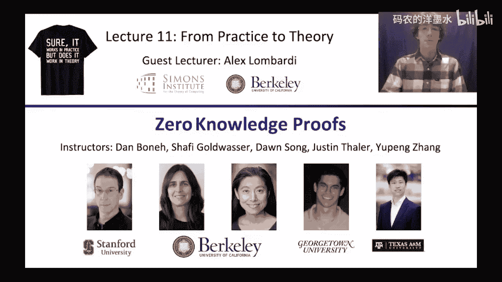

## 概述

在本节课中，我们将探讨密码学证明系统的一些理论层面。这包括一些源自上世纪八九十年代该领域奠基时期的重要思想，以及一些近几年的最新研究成果。我们将从交互式零知识协议的理论问题入手，深入分析Fiat-Shamir变换的理论基础及其在随机预言机模型中的局限性，最后探讨如何基于可证伪的密码学假设构建安全的证明系统。

## 密码学证明系统概述

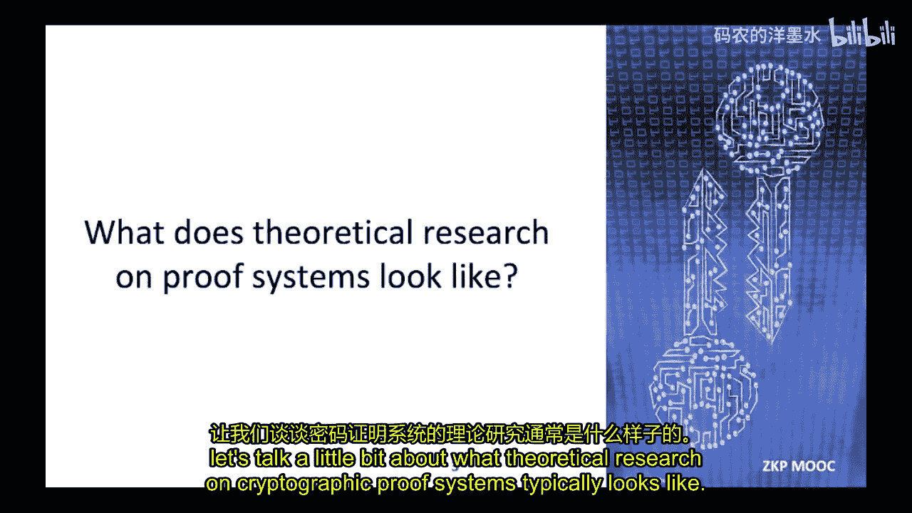

密码学证明系统是理论和应用密码学数十年来最重要的基石之一。

在实践层面，你们在本课程中主要学习的是SNARKs，由于其在区块链领域的潜在应用，目前具有很高的实践相关性。但在区块链出现之前，证明系统对于实际的互联网安全（例如整个身份验证或数字签名的概念）仍然至关重要，本质上就是一种证明系统。因此，互联网上的任何安全通信都依赖于它。

在理论层面，证明系统，尤其是零知识证明系统，一直是密码学构造中的“瑞士军刀”。其中最突出的例子是安全多方计算。这是一种密码学原语，旨在使一群互不信任的参与方能够基于各自的私有输入联合计算任意函数。零知识证明可以将一个半诚实的协议（即仅在假设所有参与者都严格按照协议规定执行时才安全的协议）编译成一个完全安全的协议，其中不假设对手可能偏离协议。零知识证明以一种非常直接的方式被使用：让每一方证明他们正在按照协议规定行事。

更广泛地说，零知识证明是任何希望强制执行特定行为、同时又要保守秘密的场景中的关键工具，这在密码学的各种情境中都会出现。

## 理论研究的范畴

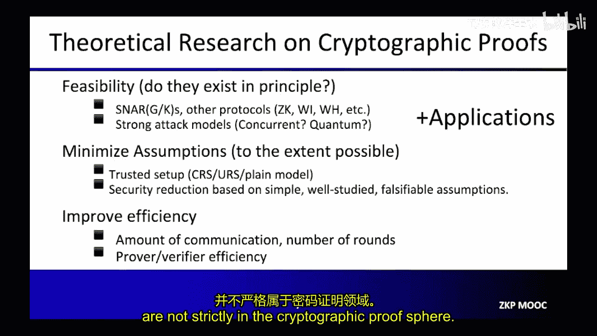

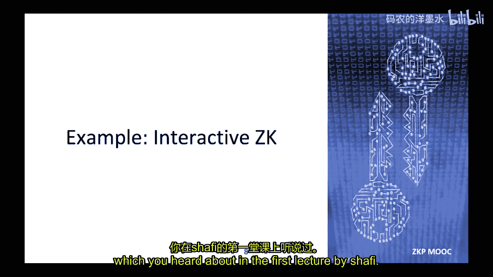

关于密码学证明系统的理论研究通常涉及三个相互重叠的范畴。

首先，大量思考集中在可行性问题上：具有X、Y、Z等属性的协议在原则上是否存在？这方面最突出的例子当然是SNARKs。直到今天，我们仍在试图理解关于SNARKs在数学上是否存在，我们能说些什么。在本讲座中，我将深入探讨相关问题。但除了SNARKs，还有大量其他类型的协议，例如满足零知识或较弱隐藏属性（如见证不可区分性、见证隐藏性）的非交互式协议。你可以列出希望协议具备的任何一组优良属性，这些属性可能受到某些应用的启发，然后从数学上提问：这样的证明系统是否存在？这个问题通常非常复杂，并且可能取决于你考虑的敌手模型。例如，如果你考虑一个可能同时开启多个协议并发执行的敌手，并试图联合利用这些执行来破坏安全性，问题会变得更难。如果敌手能够访问量子设备，情况也可能更加困难，例如，协议是否对量子攻击保持零知识就很不明确。因此，会出现许多可行性问题。

其次，我们希望尽可能最小化构造中所做的假设。让我举几个具体例子。在非交互式协议中，你通常有某种可信设置：要么假设存在一个由第三方建立的结构化参考字符串，证明者和验证者可以访问；要么假设他们可以访问一串随机硬币（这是一个较弱的假设）；要么什么都不假设，这称为“明文模型”，即没有设置。不同类型协议的可行性当然可能取决于你假设了哪种设置。我们希望为所考虑的任何协议，尽可能使用最弱的设置。

此外，我们希望基于（最好是简单、经过充分研究的）“可证伪”假设，为我们的协议提供安全性证明或安全性归约。我将在讲座中间部分更详细地讨论这一点。

最后，尤其是在可行性问题得到解决之后，我们也会考虑提高各种协议效率。有许多维度你可能希望改进效率：在交互式设置中，你可能希望最小化通信轮数（有时非交互式不可能，但你仍然希望最小化通信轮数）；你可能希望最小化通信量，即证明者和验证者之间发送的比特数；你可能希望优化证明者和验证者的计算效率。最后一点，尤其是证明者的计算效率，是你们在课程中到目前为止听到的很多内容。但幻灯片上列出的所有想法，更广泛地代表了理论研究者经常思考的问题。

当然，除此之外，我们还思考如何将各种密码学证明系统应用于严格意义上不属于密码学证明领域的其他应用。

## 交互式零知识协议的理论问题

前面的讨论有些抽象，现在让我们深入探讨一个具体的理论问题例子，即讨论交互式零知识协议时出现的问题，这在Shafi的第一讲中已经介绍过。

当我们讨论交互式零知识协议时，我们处于一个没有可信设置的环境中。证明者和验证者可以互相发送消息，但没有可信第三方，也没有他们可以访问的公共随机字符串。他们发送的就是他们能看到的全部信息。

在这种设置下，零知识比在有可信设置的非交互式设置中要棘手得多。原因在于，你希望你的协议能够抵抗任意的多项式时间验证者，这些验证者可能遵循也可能不遵循协议规范。在非交互式设置中，验证者没有作弊的协议可循，他们只是收到一条消息。但现在，他们可能发送本不应该发送的消息，这可能会破坏安全性，因此你的分析需要排除这种可能性。

尽管如此，我们在第一讲中看到，可以为任何NP语言构建一个零知识证明系统。你们看到的基础协议在三轮消息中具有某种逆多项式级别的可靠性误差。这很好，但并不是我们真正想要的。我们希望一个协议中，证明者只能以某种指数级小的概率欺骗验证者，因此我们需要考虑如何减少该协议中的误差。

有几种方法可以做到这一点。一种方法是顺序地重复该协议多次，你可以证明这是有效的，这将降低可靠性误差但保持零知识。然而，这会导致一个具有数万轮通信的协议，这是任何人都不愿意运行的。

另一种你可以尝试的方法是并行重复该协议多次，这是一种非常常见的做法。你可以证明，正如预期的那样，这降低了可靠性误差，至少在这种特定情况下是如此，而且对于任何统计可靠的协议来说都是如此。但事实证明，这种并行重复变换实际上并不能保持协议的零知识性，因此在交互式设置中你必须更加小心。

让我们看看问题出在哪里。让我们回顾一下第一讲中的协议。

你们看到的其中一个协议是，证明者希望说服验证者某个公开已知的图是三着色的。如果证明者知道该图的一种三着色方案，协议的工作方式如下：

首先，证明者获取其对图的着色并进行随机化，为每种颜色分配一个随机的0、1或2。
然后，证明者对这些随机化的颜色进行承诺。因此，对于图中的每个顶点，证明者承诺一个数字0、1或2，并将所有这些承诺发送给验证者。这些承诺将证明者绑定到着色分配上，但此时验证者并不知道颜色是什么。
这些消息发送后，验证者从图中采样一条随机边（我们称之为挑战）并将其发送给证明者。
然后，要求证明者打开这条边上两个顶点的颜色。如果证明者确实承诺了一个三着色，那么验证者将看到两种不同的颜色，并且如果确实看到两种不同的颜色，验证者将接受。
这是可靠的，因为证明者在边被采样之前就已经对着色进行了承诺。因此，无论这个着色是什么，如果它不是有效的三着色，验证者至少有逆多项式的机会采样到一条证明者无法打开并给出可接受响应的边。
另一方面，它在直觉上是零知识的，因为对于验证者可能询问的任何固定边，证明者将打开两个随机的不相等颜色，验证者似乎并没有从看到两个随机的不相等颜色中学到任何东西。

为了形式化这一点，我们转向模拟范式，这在第一讲中也介绍过。快速回顾一下，以下是你如何为这个协议编写零知识模拟器。

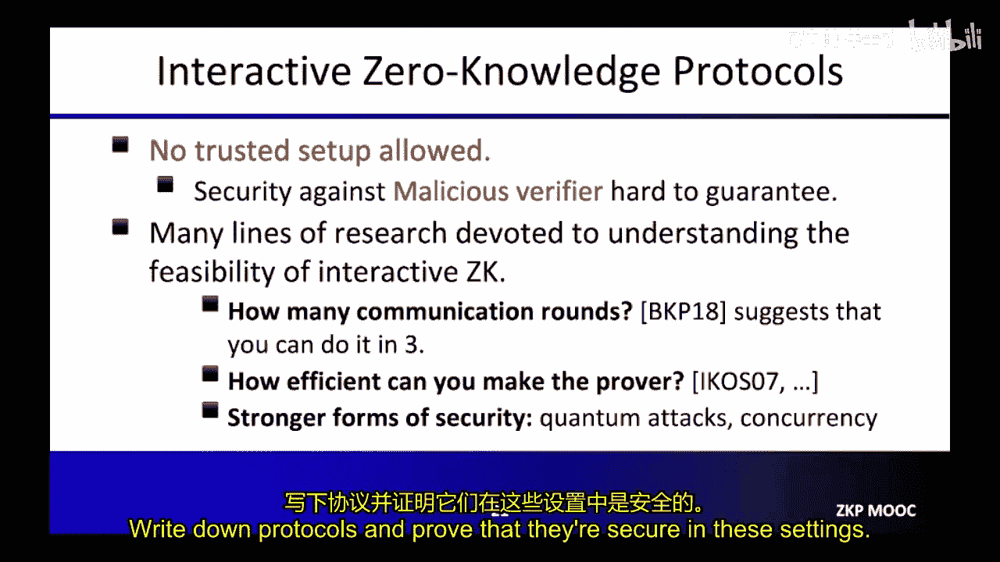

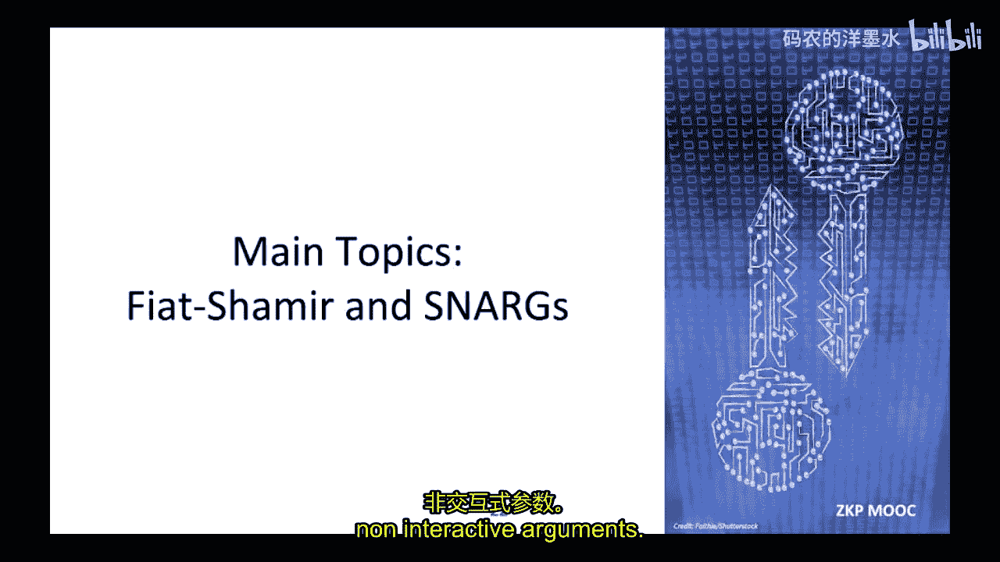

我们从一个任意的验证者V*开始，它可能不按规范行为。它可能不采样随机边，而是精心挑选一条特定的边，希望了解一些信息。这条边可能是证明者第一条消息的函数。尽管如此，我们希望证明我们可以在不知道图的三着色方案的情况下模拟验证者的视图。

我们这样做的方式如下：我们反复猜测一条随机边。然后，我们承诺一种尊重这条特定边的着色，即我们确保这条边的两个顶点被分配了一对随机的不相等颜色。例如，你可以承诺其他地方全为零。然后你发送这些承诺，接着运行验证者，验证者可能恶意地选择某条边。如果验证者发送的边等于你的猜测，那么你可以发送打开信息，这看起来完全像验证者在真实协议中会看到的那样。如果你的猜测错误，那么我们回滚验证者，回滚整个执行，重新开始，提出新的猜测、新的承诺等。

由于承诺是隐藏的，验证者不知道我们猜测了哪条边，而我们的猜测实际上具有逆多项式的正确概率。因此，经过多项式次数的尝试后，我们将成功创建一个看起来像验证者在协议真实执行中会看到的记录。

这就是你证明该协议是零知识的方式。

如果我们并行重复这个协议多次会发生什么？让我们看看哪里出了问题。

假设我们有T次该协议的重复，并且我们认为T相当大。具体来说，它至少需要达到安全参数的数量级，以使可靠性误差变小。但是，如果有大量重复，那么我们刚刚描述的模拟策略就不再有效了，它不是高效的。原因在于，验证者可能发送的消息至少有2^T种。如果你随机猜测其中之一，那么它只会在概率为2^{-T}的情况下匹配验证者发送的内容，因此你需要重复2^T次才能成功模拟。这样模拟器将无法在多项式时间内运行，因此该协议不满足零知识属性，至少我们还没有证明它满足。

这是对我们讨论的模拟策略为何不适用于并行重复协议的解释。但事实证明，从道义上讲，该协议不应被视为零知识的。Dwork、Naor、Reingold和Stockmeyer在1999年的一个结果表明了这种有趣的“两难”局面：对于这个并行重复协议，你可能期望两件事为真：一是它可能是零知识的，二是你可能能够为该协议实例化Fiat-Shamir变换。他们表明，这两者中至少有一个必须是假的。因此，要么你无法为该协议实例化Fiat-Shamir变换，要么如果你能为该协议实例化Fiat-Shamir变换，那么该交互式协议对恶意验证者而言就不是零知识的。我不会深入细节，但要点基本上是，你在这里无法模拟的恶意验证者是通过哈希证明者的消息来恶意生成其挑战的。

这里的启示是，我们不应该期望这个协议是零知识的。正确的直觉是Fiat-Shamir变换应该是可能的（我们将在本课程后面讨论），但因此，我们不认为这个协议是零知识的。

这是思考交互式零知识协议理论时出现的一个问题例子。并行重复不保持零知识这一事实引发了许多由此产生的问题，因此有许多研究方向致力于规避这个问题。

例如，由于这个问题，尚不清楚为了以零知识证明某事，你需要多少轮通信。即，一个实际达到小可靠性误差的零知识协议的最小通信轮数是多少？Bansal、Kalai和Paneth最近的一项工作给出了一个仅需三轮通信的构造，我们知道这必须是最优的（因为少于三轮是不可能的），他们给出了一个三轮消息协议的候选构造。

以下是你可以提出的其他一些问题：暂且不论通信轮数，零知识协议中证明者的效率能有多高？因此，有许多研究工作致力于编写比刚才给出的三着色零知识协议具有更好证明者效率的协议。特别是，如果你想证明某个其他陈述，而该陈述本身不具有三着色图的结构，那么为了使用我们刚刚讨论的协议，你必须将你关心的问题归约为三着色问题，而这种归约会带来巨大的开销，以至于在计算完这种归约后，你绝不会想实际运行三着色协议。另一方面，确实存在其他零知识协议的构造，对证明者来说效率要高得多，这些可能具有实际相关性。其中一些与本课程中学到的一些协议（如Bulletproofs）相关。

最后，正如我们在引言中已经提到的，除了我们目前讨论的定义之外，你可能还希望零知识协议具有更强的安全形式。例如，你可能希望协议对量子攻击是零知识的，我们实际上还没有论证这一点，因为我们描述的“回滚”过程由于一些微妙的原因在验证者是量子时不适用。类似地，我们讨论的回滚过程在敌手开启了零知识协议的多个并发执行并试图从这些执行的联合视图中学习信息的设置中也不适用。因此，关于如何在这些设置中编写协议并证明其安全性，有许多思考和技术。

## 转向Fiat-Shamir变换与SNARKs的理论

刚才我们简要探讨了交互式零知识协议的世界，但在本讲座的剩余部分，我想讨论Fiat-Shamir变换的理论方面以及简洁非交互式论证的存在性问题。

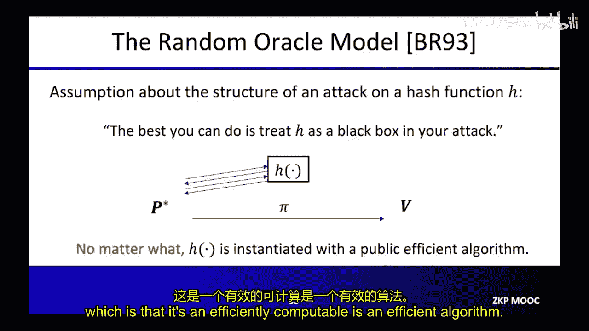

首先快速回顾一下简洁非交互式论证的定义。我们有一个NP语言，一个由字符串X表示的声明，诚实的证明者将拥有一个见证W，用于证明陈述X为真。证明者和验证者共享一个公共参考字符串，它可能是一些随机硬币，或者是通过可信设置生成的。然后，证明者使用其可能很长的见证W生成一个简短、易于验证的证明π，发送给验证者，验证者可以用它来检查X是否为真。只要证明者确实拥有X的见证W，验证者几乎总是应该接受。另一方面，如果陈述X实际上是假的，那么对于任何高效的策略P*，无论该策略生成什么证明，都应该使验证者以很高的概率拒绝。最后，正如我所说，我们希望证明是简短的，所以我们认为其长度是陈述和见证长度的多对数级别，并且验证应该非常快，大约是这个时间量级，并对输入有一些读取访问。

这就是我们想要的。我们已经在本课程中看到了使用交互式预言证明和随机预言机构造SNARKs的方法。还有另一个使用线性PCPs的构造家族，你们也简要看到过，但今天我们将重点讨论基于随机预言的构造。

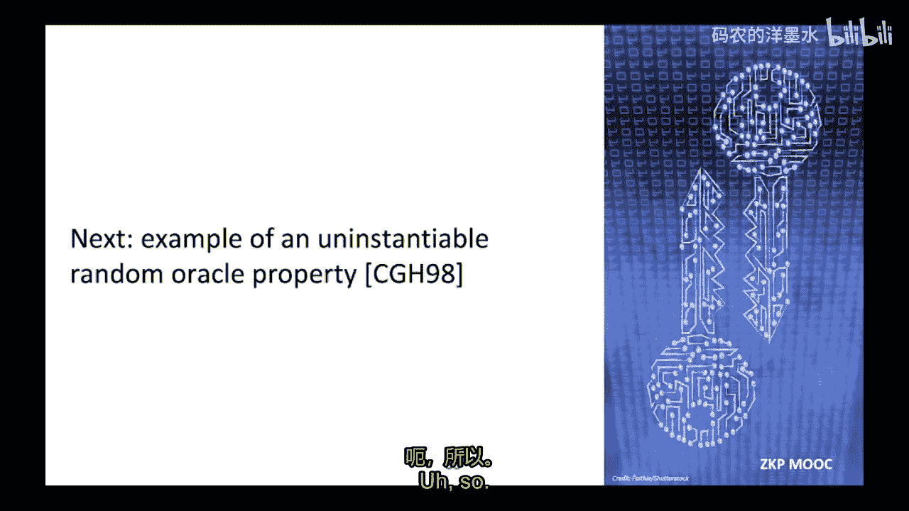

使用随机预言将IOP转换为SNARK意味着什么？这是通过Fiat-Shamir变换完成的，你们也已经学过，但快速回顾一下：这是一个强大且非常通用的提议，用于从交互式协议中移除交互性。只要交互式协议中的验证者消息是真正的随机字符串，你就可以用哈希函数H替换与验证者的交互，证明者通过哈希自己的消息或哈希记录前缀来生成下一个验证者消息。屏幕上显示的是三轮消息的情况，所以你可以认为验证者挑战是对第一条消息α（可能连同陈述X，这里没有写出）的哈希。

事实证明，如果你将这个哈希函数建模为随机预言，那么这个变换将安全地编译任何常数轮的公开掷币交互式协议。实际上，它能编译比这更多的协议，但为了讨论简单，我们现在只考虑常数轮协议。

我认为我们实际上还没有在课程中看到这个的证明。所以我要做的第一件事是概述一个证明，即在随机预言模型中，这个编译器是有效的。

现在我们应该更具体一些。将H建模为随机预言意味着什么？粗略地说，随机预言模型是关于哈希函数攻击结构的一个假设。原则上，对于Fiat-Shamir协议，证明者被给予哈希函数的描述，并且它可以以任何它喜欢的方式使用这个哈希函数描述来尝试生成其证明。但随机预言模型假设，敌手策略所能做的最好的事情就是将哈希函数描述视为一个黑盒，一个接收消息α并输出消息β的盒子，并且该策略只会将哈希函数作为预言机进行查询，而不会使用哈希函数的实现细节。因此，在Fiat-Shamir的情况下，随机预言模型是一类试图通过在假陈述上查询哈希函数多次来生成可接受证明的攻击，而不实际查看哈希函数的实现细节。

粗略地说，如果你只将哈希函数视为黑盒，那么将其视为一个均匀随机函数是合理的。例如，哈希函数可以是一个伪随机函数，那么如果你只查询它，它就与真正的随机函数不可区分。

因此，非常具体的说法是，Fiat-Shamir在随机预言模型中有效，这意味着如果你只查询哈希函数而不查看其实现，那么非交互式协议的最佳证明者策略不会比交互式协议的最佳证明者策略好太多，并且存在一个随轮数增长的安全损失。对于现在的证明，我们将重点关注三轮消息的情况。

我们需要证明的是，任何非交互式协议的成功证明者都可以转换为交互式协议的成功证明者。因此，我们从这个证明者P*开始，它查询哈希函数多次，最终生成一个记录α, β, γ发送给验证者。我们想说，我们可以在交互式设置中模拟这一点。

这里安全证明的关键思想是，由P*生成的第一条消息α本质上必须来自P*对哈希函数H所做的一次查询。事实上，这可以在不失一般性的情况下假设，如果你真的需要，你总是可以假设每当证明者要输出某些东西时，首先查询哈希函数消息α。但现在的要点是，我们假设证明者只对哈希函数进行多项式次数的查询，因为它运行在多项式时间内，或者更一般地说，它运行在某个有界的时间内，因此它对哈希函数的查询次数是有界的。

我们可以利用这一点来实际攻破三轮消息协议。想法如下：如果我们想在交互式协议中欺骗验证者，我们有一个在非交互式设置中欺骗验证者的随机预言策略。如果证明者对哈希函数进行了Q次查询，那么本质上在Q个位置中有一个位置，它正在为交互式协议在假陈述上生成一个可接受的记录。我们攻破交互式协议的方式是：我们进行猜测，猜测哪一次查询将是成功的那一次。然后，在交互式协议中，我们将通过运行左侧策略并自己进行I-1次哈希函数查询来生成第一条消息α（其中I是我们猜测的将起作用的查询索引）。然后，我们将第I次查询本应发送的内容发送给验证者，我们不对那个α查询哈希函数，只是发送给验证者。然后验证者发回一个随机字符串β，我们基本上假装这是哈希函数的输出。然后，为了生成我们的最后一条消息γ，我们继续运行左侧策略，直到它最终输出一个记录，我们选择Fiat-Shamir证明者选择的任何γ并输出它。

基本上，这将以概率1/Q乘以非交互式证明者获胜的概率攻破交互式协议。因为如果我们碰巧猜对了非交互式证明者输出的α对应的查询，那么如果我们的猜测正确，我们就在交互式设置中正确地模拟了随机预言攻击。因此，这表明你的安全性只比交互式协议的安全性差1/Q倍。对于一个2R轮的协议，一般来说你的安全损失大约增长为1/Q^R，尽管对于满足更细粒度可靠性概念（如逐轮可靠性）的协议，你可以做得更好。

这就是Fiat-Shamir在随机预言模型中的合理假设下有效的证明。但现在让我们重新审视随机预言模型所做的这个假设。正如我们之前所说，该模型假设，尽管你被给予了某个哈希函数H的描述，但为了破坏Fiat-Shamir协议的目的，攻击所能做的最好的事情就是将该哈希函数视为黑盒，向其插入一堆输入，获取一些输出，并利用这些来尝试破坏安全性。

实际上，哈希函数并不是你可以作为黑盒调用的随机函数，而是像SHA-256这样的东西，可能加盐了一些身份、时间戳和随机字符串等，但它是像SHA-256这样的东西。所以这就是实践中的情况。但即使在理论上，无论怎样，你都将用某个高效可计算的公共算法来实例化这个哈希函数，因为它需要是证明者和验证者都能在合理时间内实际计算的东西。

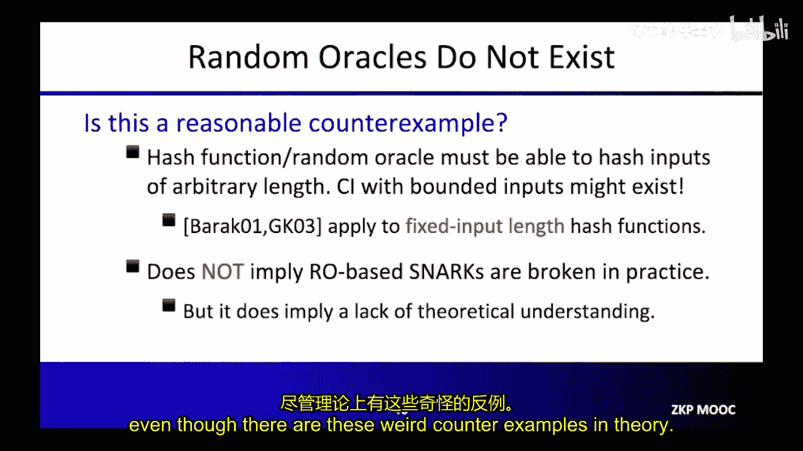

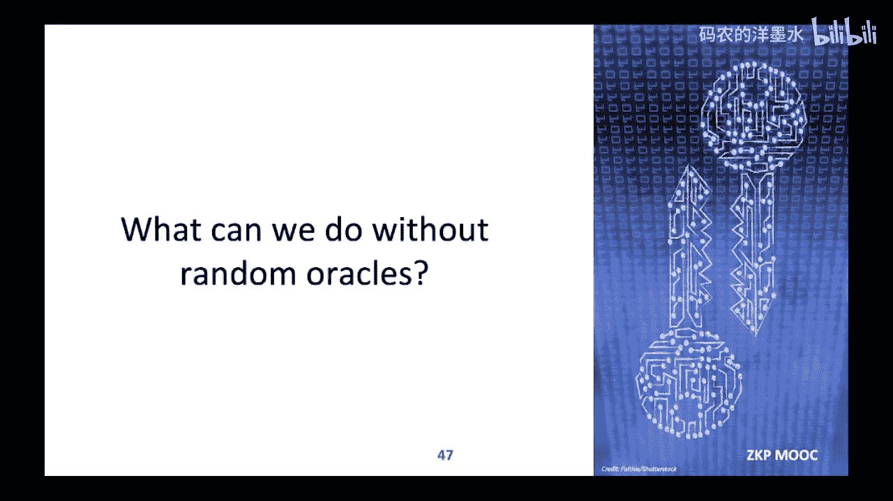

因此，模型将H视为随机函数与现实（即它是高效可计算的算法）之间存在不匹配。这是一个明显的理论问题：高效的公共算法无法计算随机函数。

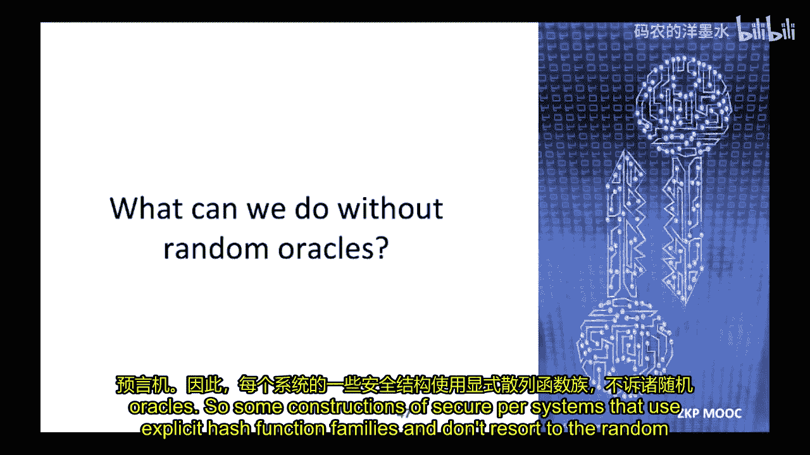

尽管如此，你可能仍然希望，对于你实际关心的任何安全属性，如果你能证明该安全属性在随机预言模型中成立，那么一个合理的哈希函数实例化也将满足该安全属性。这就是随机预言启发式背后的逻辑。当然，你不仅仅要希望它有效，你还可以尝试攻击你实现的任何特定协议。因此，该启发式得到了Fiat-Shamir范式在实践中尚未被真正攻破这一事实的支持。但理论研究者正试图更原则性地理解这种变换何时以及为何实际有效。

我要向你们展示的第一件事是一个负面结果：我们将看到随机预言具有的一个安全属性，该属性在随机预言模型中成立，但可证明地无法对任何高效可计算的哈希函数族成立。这是对随机预言启发式的一个违反。

这里有一族非常重要的安全属性。对于每个将字符串映射到固定长度（比如安全参数长度）字符串的函数F，都有一个安全属性。我们说，一个哈希函数或哈希函数族对于这个函数F是“关联不可行”的，如果给定哈希函数H的描述，很难找到一个哈希函数的输入x，使得hash(x)等于F(x)。

这是一个非常广泛的安全属性。你可以在这里插入任何你喜欢的函数F，你会得到一个不同的安全属性。但很容易看出，对于任何固定的函数F，你在随机预言模型中得到F-关联不可行性。也就是说，一个随机预言将满足这个安全属性。原因很简单：在随机预言模型中，攻击者只是对哈希函数进行多项式次数的查询，并且对于每次对哈希函数的查询x，你会得到一个随机输出字符串y。每次你这样做时，y等于f(x)的概率是2^{-λ}（λ是安全参数），这个概率非常小。因此，即使你这样做多项式次，你也极不可能找到一个x使得hash(x)等于f(x)。这对每个固定的函数F都成立。

因此，这是一个随机预言具有的非常合理的安全属性，所以你可能会期望，如果你用SHA或某个合理的哈希函数实例化随机预言，你也会得到这个安全属性。但事实证明，情况并非如此。存在一个特定的函数F，使得对于任何高效可计算的哈希函数族H，H对于这个函数F不是关联不可行的。

因此，随机预言启发式对于这种关联不可行性的概念完全失败。

如果你以前没见过这个，现在是个好时机暂停一下，思考一下你是否能想出一个函数F来证明这个主张。你能想出一个坏的F，使得对F的关联不可行性是不可能的吗？这是理论计算机科学中一个非常普遍的思想的例子，称为“对角化”。

我给你一点时间思考一下你是否能想出一个F。

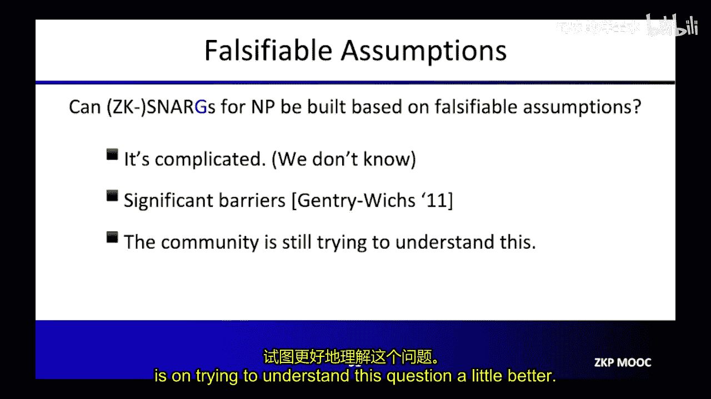

这里有一个函数F，它展示了不可能性。F将任意字符串x作为输入，它会将这个字符串x解释为一个程序P的描述（你总是可以在字符串和程序之间建立某种映射，具体是什么并不重要）。然后，F(x)等于P(x)。也就是说，你运行x描述的程序，输入是x本身。

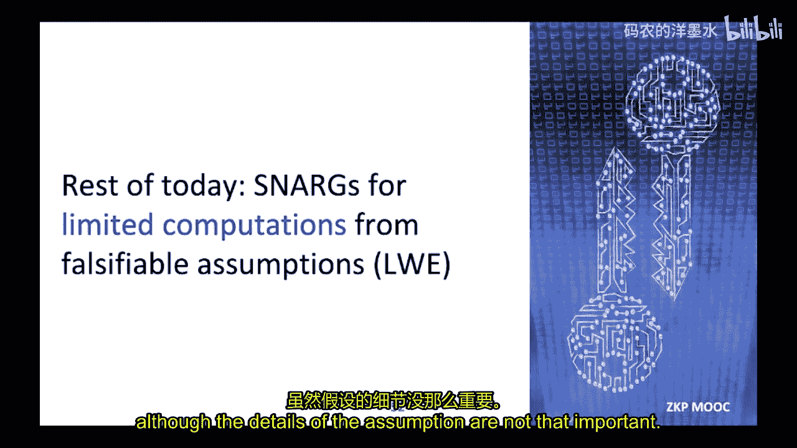

这看起来有点奇怪，这是合理的，因为它展示了这个随机预言不可能性。以下是你为什么不能对实际的哈希函数族拥有对这个F的关联不可行性的原因。

取任何哈希函数族H，我们可以写下一个非常简单的攻击来打破对这个F的关联不可行性。给定这个族中的一个哈希函数h，我们想找到一个输入x，使得hash(x)等于F(x)。我们要选择的输入x就是h本身的描述。我们拿到一个哈希函数，然后将其描述插入到它自身中。你可以看到，根据定义，对于这个特定的x选择，hash(x)将等于F(x)，因为F(x)做了什么？F(x)将x插入到x描述的程序中。x是h的描述，因此，F(x)等于h(x)。这样我们就打破了关联不可行性，仅仅给定h的描述，我们就能高效地找到一个输入，使得hash(x)总是等于F(x)，而F是某个固定函数。

随机预言不具有这个属性，所以这是一个对随机预言成立但对任何实际哈希函数族都不成立的性质。是的，这就是反例。写下来很简单，但要真正理解它可能需要相当长的时间，所以请务必花些时间思考这里到底发生了什么。

让我们再多讨论一下这个反例。比如，它有多合理？它应该如何让你思考随机预言的可实例化性？

这个反例在这里要求一个相当人为的安全属性。特别是，这只是对需要能够接受任意长输入的哈希函数的随机预言启发式的反例。具体来说，你的哈希函数需要能够哈希至少与哈希函数本身描述一样长的输入。因此，这个反例并不排除对有界输入长度的函数的关联不可行性，这一点非常重要，并且将在讲座末尾出现，因为我们实际上要构建满足较弱形式关联不可行性的哈希函数，它们确实存在。

另一方面，实际上还有其他对随机预言成立、但可证明地对任何仅涉及固定长度输入的哈希函数族都不成立的哈希函数安全属性。这不再关乎关联不可行性，但对于固定长度哈希函数，存在其他安全属性的反例。事实上，这些反例是针对Fiat-Shamir启发式的。Barak和Goldwasser、Kalai等人有两个这样的结果，他们构建了交互式协议，其中Fiat-Shamir启发式在随机预言模型中适用于这些协议（特别是常数轮协议），因此我们知道Fiat-Shamir应该有效。但尽管如此，他们表明，对于任何高效可计算的哈希函数族H，使用H的Fiat-Shamir协议是不安全的。因此，对于任何特定的H，都存在攻击，但对于随机预言，则没有攻击。

这是一个非常直接的反例，表明尽管我们有Fiat-Shamir的随机预言安全性证明，但在实例化时实际上必须小心。有些协议无论如何都不会有效。

因此，理论研究者正试图真正理解随机预言启发式何时实际适用，何时我们可以将其视为证据，表明当你在现实世界中实例化时，所得协议实际上是安全的。

关于负面结果，我们再注意几点。首先，我们在刚刚看到的攻击中，通过在其自身描述上运行哈希函数来破坏安全属性。所以你可以问：这在实践中有相关性吗？你会在其自身描述上运行哈希函数吗？如果你的协议从不关心这样的事情，那么你也许可以说这个反例与实践无关。你有时可以这么说，但有趣的是，通过递归组合构建的SNARKs在某种意义上确实在其自身描述上调用哈希函数，虽然不是完全像我们在攻击中写的那样，但至少表面上类似。这是因为当你进行递归SNARK组合时，你所做的是给出一个SNARK证明，证明SNARK验证者本应接受某个其他SNARK证明，因此你正在证明关于SNARK验证者的事情，而SNARK验证者正在运行哈希函数。因此，你想要给出一个关于哈希函数的SNARK。

需要明确的是，这绝不是说实践中的递归SNARKs被攻破了，我们实际上没有攻击。但这确实表明，在安全和不安全的实例化之间存在一条难以描述的界限，作为理论研究者，我们仍在试图理解这条界限到底是什么，以解释为什么实践中的构造是安全的，尽管理论上有这些奇怪的反例。

## 无随机预言的安全证明系统

既然我们已经看到了随机预言模型的一些严重理论问题，我将在讲座的剩余部分告诉你们一些我们可以在没有随机预言的情况下做的事情，即一些使用显式哈希函数族且完全不依赖随机预言模型的安全证明系统的构造。

那么，当我们没有随机预言时，我们做什么？我们基于什么来保证安全？理论研究者喜欢做的是利用所谓的“可证伪假设”。我们希望构建一个证明系统或可能其他密码学原语，并证明该原语或协议是安全的，假设某个具体的算法任务在多项式时间内或某个不太大的时间内是不可行的。

可证伪假设的一些例子是：在某些群上计算离散对数是困难的；或者，我们可以假设求解随机噪声线性方程是困难的，这称为“带错误学习”问题，这是在模p整数环上的噪声线性方程。这是理论密码学中两个非常常见的假设。但你也可以做出像SHA-256是抗碰撞的这样的假设。所以SHA-256本身并不是一个不可证伪的对象，不可证伪的是随机预言模型。你仍然可以采用像SHA这样的具体实例，并假设它是抗碰撞的，这是一个合理的可证伪假设，我们有相当多的信心。

这些是可证伪假设的例子。密码学中通常的工作方式是，我们基于可证伪假设构建一些密码学原语或协议，但构造效率非常低。因此，提高构造效率的一种方法通常是修改构造并利用随机预言，因为随机预言可以免费为你解决许多技术问题，它们通常可以简化密码学构造，代价是这种建模假设。

例如，幻灯片上列出了一些例子。但特别是对于非交互式零知识协议，暂且不考虑简洁性，假设你只想要非交互式零知识，我们既有基于Fiat-Shamir和随机预言模型的构造，也有基于可证伪假设的构造。拥有基于可证伪假设的构造的一个优势是，即使我们最终在现实世界中使用基于随机预言的协议，基于可证伪性的构造也是另一个证据，表明用SHA-256实例化的随机预言构造是合理的做法。

我们目前的目标是理解基于可证伪密码学假设可以构建哪些类型的协议。

我们从带K的SNARKs开始，这里我们问是否可以在可证伪假设的基础上构建简洁的非交互式知识论证。这里的答案很快就是：不能。许多不可能性结果都有附带条件，但这里的直觉应该是：不，你不应该期望能够做到这一点。

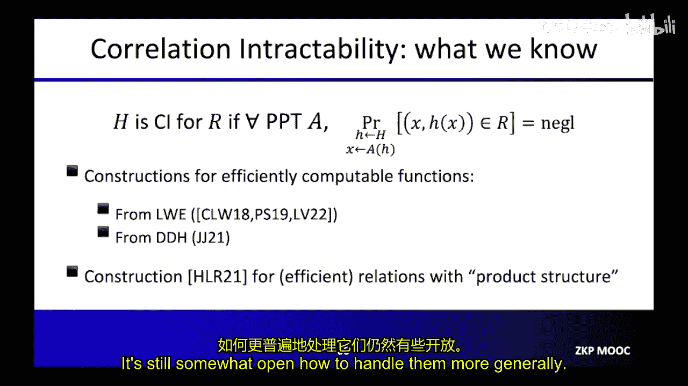

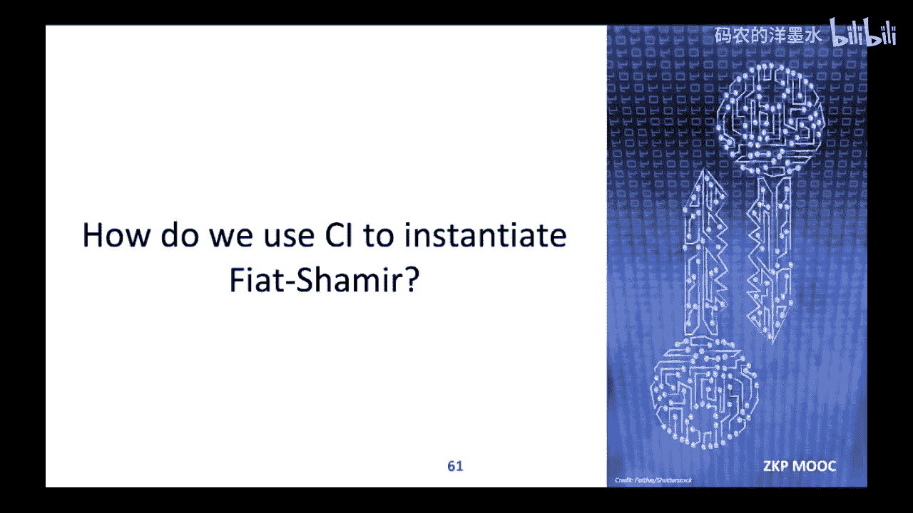

问题出在哪里？问题在于，知识论证要求你能够从任何成功的证明者中提取一个NP见证。但证明者只输出一个简短的证明字符串。因此，如何从一个简短的证明字符串中提取一个长的NP见证，这真的很不清楚。我们已有的构造实现这一点的方式是做出一个实际上只是假设掉这个问题的假设。该假设说，哦，神奇地存在某种方法可以从一个短字符串中提取一个长字符串。

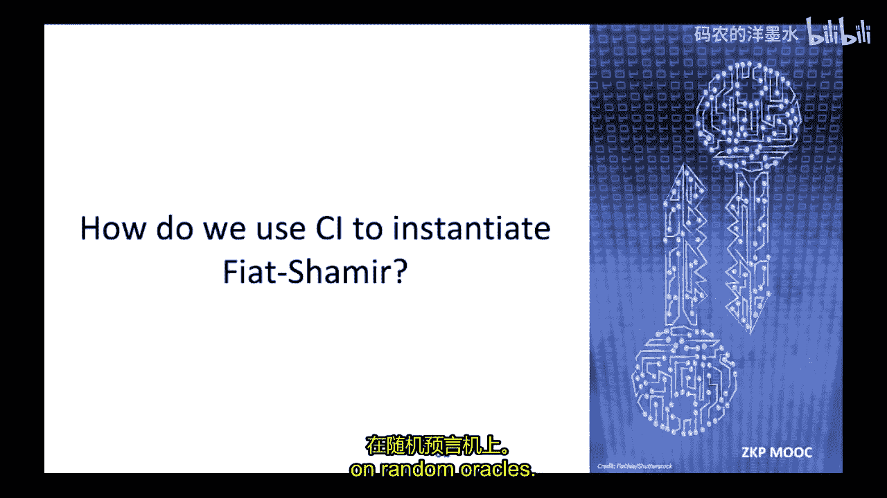

随机预言给了我们这一点，因为在随机预言模型中，你可以考虑敌手对预言机进行的所有函数调用的历史，这可以给你一个长字符串，即使证明本身很短。基于线性PCPs的构造不使用随机预言，但它们转而基于某个密码群做出知识假设，同样，这个假设为我们解决了这个问题，它假设即使从实际上只明确告诉你少量信息的敌手那里，你也能神奇地提取大量信息。

这不是我们期望能用可证伪假设解决的问题，因此，如果你想要具有知识可靠性的SNARKs，似乎你需要超越理论密码学家通常处理的范围。

然而，对于带G的SNARGs（或仅满足可靠性而不一定满足知识可靠性的协议），情况就不同了。这里并没有那么明确的理由说明为什么你不能基于可证伪假设构建这些，尽管我们目前拥有的唯一通用构造使用了像随机预言这样的不可证伪假设。

因此，我们目前不知道这个问题的答案，即可证伪假设是否足够。存在一些障碍，一些理论论文讨论了为什么这可能很困难，但我会说证据远不如SNARK情况那么明确，陪审团可能仍在审议这是否应该可能。例如，我个人很多研究都在试图更好地理解这个问题。

但最先进的技术是我们不知道如何做到这一点，因此我们将满足于为计算子类构建SNARGs。我们不会为任何NP陈述构建SNARGs，而只是为一些仍然相当具有表达力的特殊NP陈述构建它们。

在讲座的剩余部分，我将概述一个基于带错误学习假设的构造，尽管假设的细节并不那么重要，但这就是我们今天将要看到的内容。

## 构建工具：关联不可行哈希与某处可提取承诺

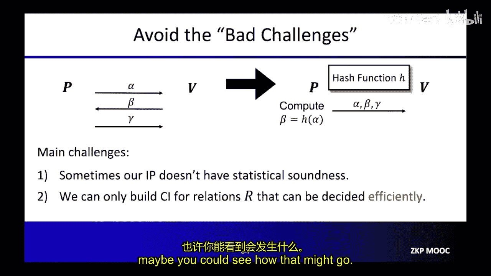

在进入构造之前，让我先介绍构造中将要用到的两个主要工具和技术。

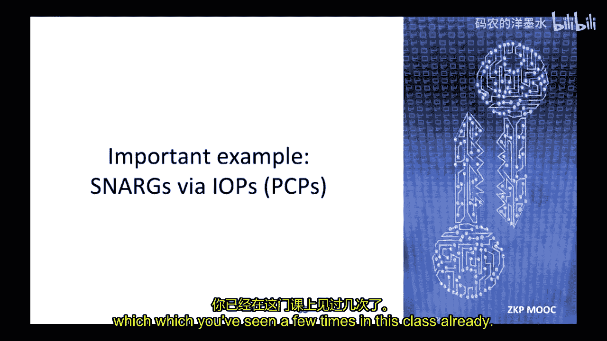

第一个是关联不可行性，我们今天早些时候已经看到。我们将使用满足某些形式关联不可行性的哈希函数，而不是在Fiat-Shamir范式中使用基于随机预言的哈希函数，这些形式被证明足以用于Fiat-Shamir，至少对于某些特定的交互式协议（而非一般情况）是如此。这是第一个工具。

第二个工具是称为“某处可提取承诺”的东西，这是一种特殊的简洁承诺方案。我们在本课程中已经见过简洁承诺，如Merkle树。但某处可提取承诺是简洁承诺方案的一种更强形式，它用于构建一个特殊的交互式协议，我们基于这些关联不可行哈希函数为该协议实例化Fiat-Shamir变换。最终构建的交互式协议看起来很像典型的基于IOP的交互式协议，但仅适用于特殊语言，并附带安全性证明。

让我们先回到关联不可行性。正如我们之前所说，给定一个函数F，如果很难找到一个输入x使得hash(x)等于f(x)，则哈希函数族对F是关联不可行的。

事实证明，你可以将其视为更强形式的关联不可行性的特例，不是针对函数，而是针对二元关系。对于每个二元关系R，你可以说哈希函数对R是关联不可行的，如果很难找到一个输入输出对(x, hash(x))满足该关系。只要该关系没有太多的点对，那么随机预言将满足这个安全概念，你可以寻找满足这个性质的显式哈希函数。尽管再次强调，我们知道存在问题。

所以让我们回到函数版本。我在讲座早些时候花了一些时间告诉你们，这个性质实际上是无法实例化的。存在一些函数，你无法拥有满足该性质的哈希函数（没有高效的）。我们通过限制哈希函数的输入长度来规避这个问题。我们将考虑具有固定输入长度的哈希函数的这个性质，并且哈希函数的描述必须略大于这个输入长度。我们知道这个限制是必要的，否则该对象无法实例化。

然后我们将进一步限制这个概念，我们只考虑那些在某个先验有界多项式时间T内可计算的函数F。我们的目标是构建一个哈希函数，它对所有在时间T内可计算的函数F都是关联不可行的。哈希函数本身将在略大于T的时间内可计算。这就是我们目前知道如何构建的。尚不清楚这个限制是否必要，但这是目前我们知道如何处理的情况。

接下来，我将实际展示一个基于可证伪假设的此类哈希函数族的构造，我们这样做的主要工具是所谓的“全同态加密”。

这是一种加密方案，你可以加密一些数据x，并且在密文（x的加密）上，可以评估你选择的任何高效可计算函数F，并获得F(x)的加密。你可以在没有密钥、不知道x是什么的情况下做到这一点，只需给定x的加密和函数，你就可以在幕后对其进行评估。同态加密方案的保证是，如果你解密评估后的密文，你将得到f(x)。这是一个非常强大的工具，不一定实用，尽管人们花了很多时间试图使其变得实用，但构建哈希函数实际上并不需要它。我将使用这个高功率工具，因为它给出了最简单或最容易解释的构造，但也有其他不使用全同态加密的构造。

尽管如此，让我们看看使用它的构造。给定一个全同态加密方案，我们将写下一个哈希函数族，然后论证它是关联不可行的。

哈希函数H的描述将是两样东西：首先是同态加密方案的一个公钥，然后是某个函数G的描述的加密。你应该把G看作某个函数，比如接收每个输入并立即输出零之类的。实际上这个函数是什么并不太重要。实际上，你可以认为我们的H的描述实际上是一个均匀随机字符串，但在我们脑海中，我们会认为它是一个公钥和一个函数G的加密。只要加密方案具有公钥和密文是伪随机的性质，那么随机字符串就与这样的哈希函数描述不可区分，因此我们可以等价地将其视为随机字符串或具有这种结构。

好的，这就是我们将如何思考哈希函数的描述。那么现在我们应该说明哈希函数实际上是什么，即给定输入x，你如何哈希它？你所做的是在G的加密上运行FHE评估算法，你使用的函数由x描述。所以你想做的是评估一个函数，该函数接收加密的G并计算G(x)。这有点像是颠倒了你通常思考输入和函数的方式，但这是你可以做的事情。是的，所以哈希密钥是G的加密。当你哈希x时，你将得到G(x)的加密。

尽管哈希x是一个公开高效可计算的操作。是的，这是一个你可以写下来的哈希函数。

那么，为什么我们会期望这个哈希函数满足任何类型的安全性质呢？原因是函数G是隐藏的。它隐含在H的描述中，但没有人真正知道它是什么。因此，你可以通过想象G是各种不同的函数来论证不同的安全性质，因为G的加密与某个其他函数G'的加密是不可区分的。你可以想象G是对你证明某个安全性质最方便的任何函数。

这有点抽象。让我们看看这个哈希函数是关联不可行的证明。我们将通过反证法来证明。假设对于某个先验固定的高效可计算函数F，敌手可以找到一个输入x，使得hash(x)等于f(x)。

那么，以下是论证安全性的关键思想。我们将选择一个非常特殊的函数G*(x)。它将计算F(x)，然后解密结果字符串。你把F(x)看作一个密文，解密它，现在你有一些明文，你可以认为明文是一个比特，然后在解密后加一。这是一个你可以定义的函数。正如我之前所说，只要我们开始的G的加密与G*的加密在计算上不可区分，前提是加密方案是安全的。这里有一个小的注意事项，即我定义的G*实际上运行加密方案的解密算法，因此它依赖于加密方案的秘密密钥。但是，如果我们知道加密方案在存在秘密密钥加密的情况下是安全的，我们仍然可以论证这种不可区分性。这称为“循环安全性”，在全同态加密中经常出现，我们对此有合理的信心。但这个假设并不是真正必要的，你可以通过更复杂的构造来避免它。

但为了最简单的构造和证明，我们现在假设循环安全性。好的，我们从一个哈希函数开始，它由G的加密描述。但由于G的加密与G'的加密不可区分，我们知道我们的攻击者即使被给予G'的加密，仍然会破坏安全性。但现在我声称，当哈希函数是G*的加密时，攻击者实际上无法破坏安全性，这是一个矛盾。

原因如下：我们知道，如果你的哈希密钥中有G*的加密，那么hash(x)将是G*(x)的加密。那么我们可以看到，另一方面，hash(x)也等于f(x)（这是我们假设攻击者找到了这样的x）。那么我们会得到，如果hash(x)等于f(x)，那么如果你解密F(x)，这应该与解密hash(x)相同。但我们也知道hash(x)是G*(x)的加密，所以解密hash(x)等于G*(x)。我们已经定义G*总是避免函数解密F(x)，它字面上是解密F(x)加一，所以这两个明文不可能相等。该方案被构造为它们永远不可能相等。因此，当哈希密钥以这种奇怪的依赖于F的方式采样时，攻击者实际上不可能破坏安全性。

但通过不可区分性，这也意味着当哈希密钥是随机字符串时，攻击者也无法做到这一点。

这是一个证明，假设你的加密方案足够安全，那么所得的哈希函数是关联不可行的。

这就是一个基于高效可计算函数的关联不可行哈希族的构造。但在过去五年左右的时间里，有许多工作致力于构建各种关联不可行哈希族，包括不仅仅是函数的关系。我将在幻灯片上列出一些。当你限制在函数时，我们有基于带错误学习假设的构造。LWE可用于构建全同态加密，但后续工作实际上能够避免我在上一张幻灯片的证明中所做的循环安全性假设，因此你可以真正基于标准的带错误学习困难性来构建它。

还有一个基于判定性Diffie-Hellman假设的构造，这更类似于你们在本课程中可能见过的一些基于群的密码学。LWE（格）和DDH（群）是理论密码学家使用的两个主要构建块和假设家族，对于这两者，我们现在知道如何利用它们来构建至少某些类型高效可计算函数的关联不可行性。基于DDH的构造实际上仅限于某些特定子类的函数，但它相当具有表达力。

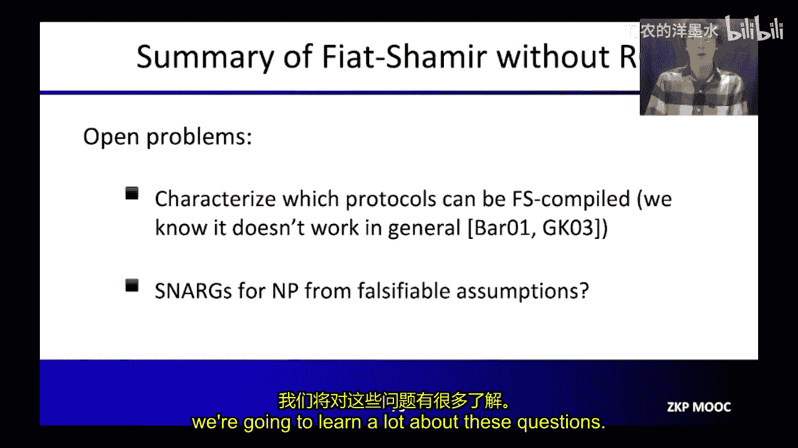

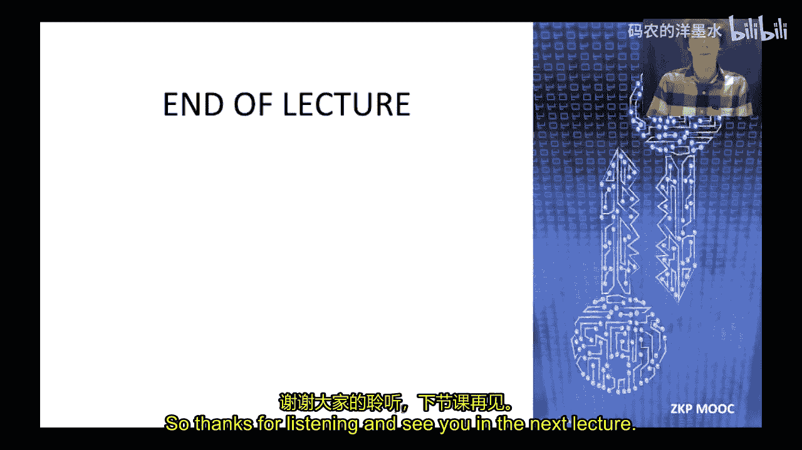

然后，你可以问，好吧，那些不是函数的关系呢？尽管仍然不清楚我们为什么问这些问题，但你可以问那些不是函数的关系。我们一般不知道是否能为有界输入长度的关系构建关联不可行性，但我们确实对满足良好组合结构的关系有一个构造。基本上，如果你将哈希值视为多个块的连接，那么你可以保证对尊重块状结构的属性具有关联不可行性，这在实例化Fiat-Shamir时被证明是相关的。不要太担心这个，但我们可以处理某些具有多个输出的关系，但如何