# 012：zkEVM 的设计、优化及应用

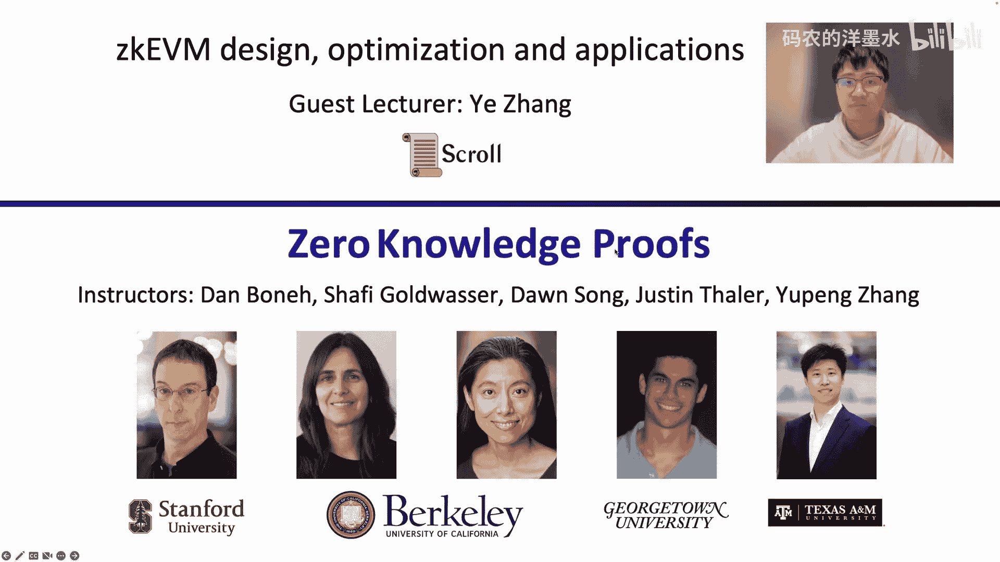

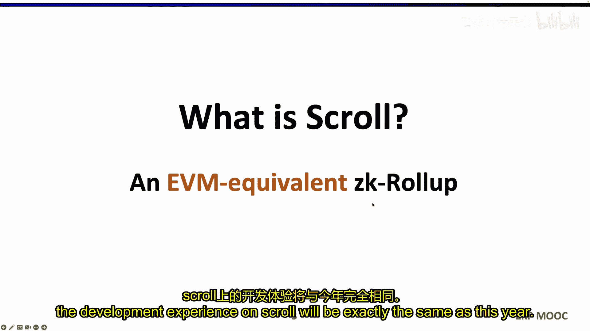

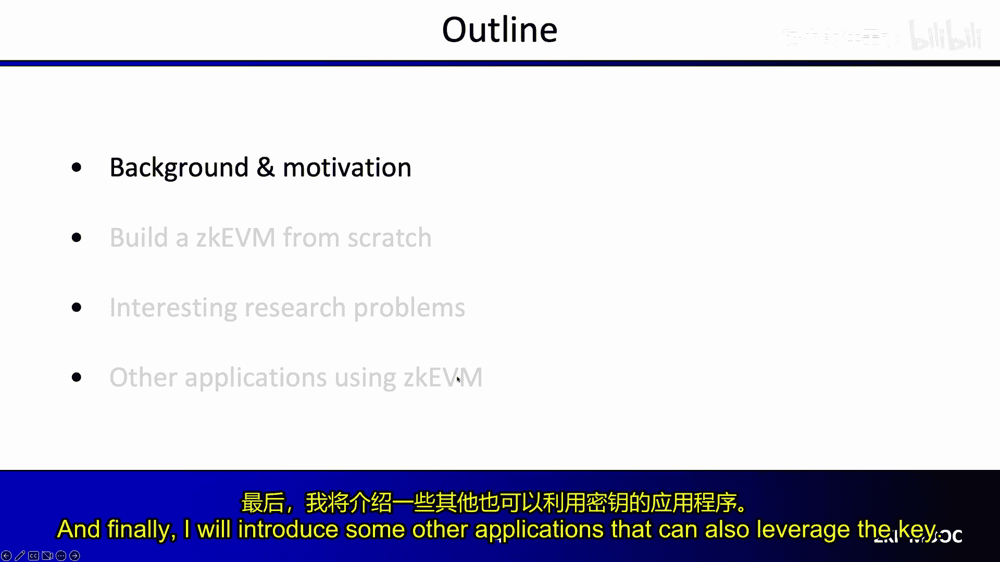

## 概述

在本节课中，我们将要学习零知识以太坊虚拟机（zkEVM）的设计、优化及其应用。我们将从理解为什么需要zkEVM开始，逐步深入到如何从零构建一个zkEVM，包括电路化、证明系统选择等核心环节。接着，我们会探讨在构建过程中遇到的有趣研究问题，并最后了解zkEVM除了作为扩容方案之外的其他应用场景。

---

## 第一部分：背景与动机

上一节我们介绍了区块链和零知识证明的基本概念，本节中我们来看看为什么需要zkEVM，以及它为何在近年来变得如此流行。

区块链网络由众多节点组成，它们通过P2P网络互联，并维护一个共享的数据库状态。用户发送交易，节点执行交易并更新状态。这种设计虽然安全、去中心化，但效率低下且成本高昂，因为所有节点都需要重复执行相同的计算。

零知识卷叠（zkRollup）是一种扩容解决方案。其核心思想是将大量交易的计算转移到链下的Layer 2网络执行，然后生成一个简洁的零知识证明（Proof）提交到Layer 1。Layer 1只需验证这个证明，而无需重新执行所有交易，从而极大地提升了网络吞吐量。

然而，为特定应用构建零知识电路非常复杂，且不同应用之间的电路缺乏可组合性。为了解决这些问题，我们转向构建通用的zkEVM。zkEVM能够证明任意类型的EVM交易的有效性，开发者无需编写复杂的零知识电路，同时保证了应用间的原子可组合性。

尽管构建zkEVM极具挑战性，但近年来多项技术的进步使其成为可能：
1.  **多项式承诺** 带来了更灵活的电路化方案（如查找表），大幅减小了电路规模。
2.  **证明算法** 的硬件加速（GPU/FPGA/ASIC）使证明生成速度提升了一到两个数量级。
3.  **递归证明** 进一步降低了链上验证的成本。

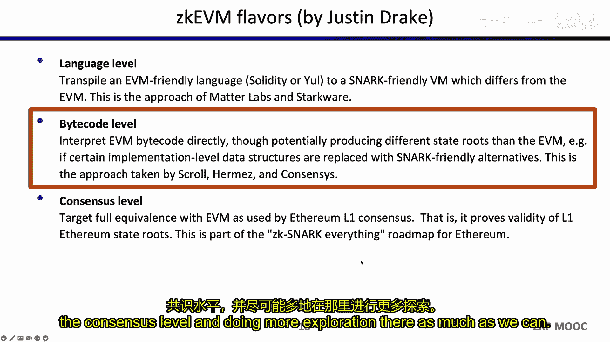

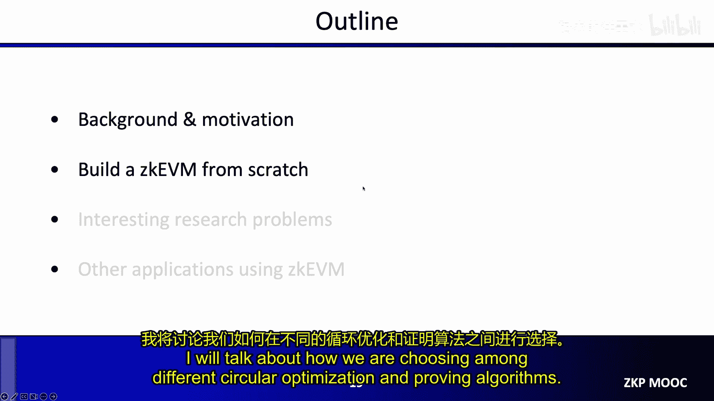

zkEVM可以根据兼容性级别进行分类：
*   **语言级别**：构建一个对ZK更友好的新虚拟机，并通过编译器将Solidity等语言编译到该虚拟机。兼容性在语言层面。
*   **字节码级别**：直接证明EVM字节码的正确执行。兼容所有EVM工具，但证明时间更长。
*   **共识级别**：完全等效于EVM，包括存储、区块头等所有细节。证明时间最长，仍在探索中。

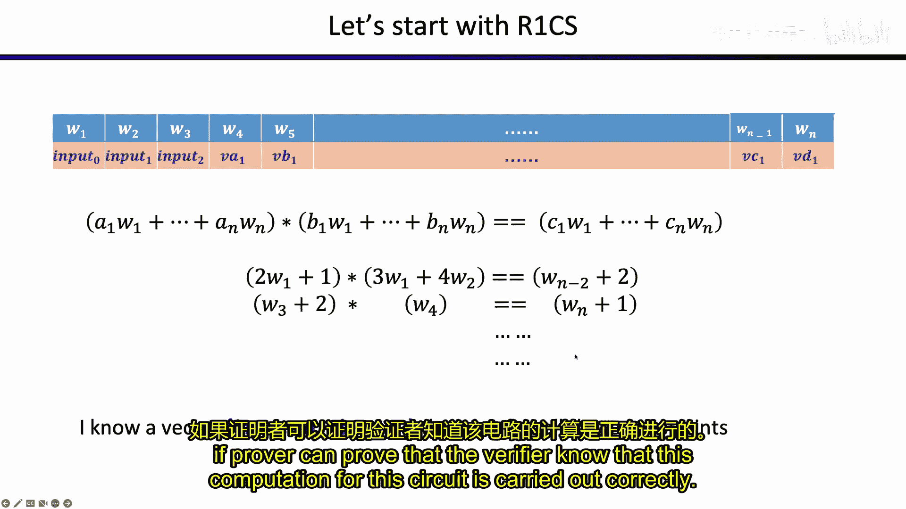

---

## 第二部分：从零构建zkEVM

上一节我们了解了zkEVM的必要性和分类，本节中我们将深入探讨如何从零开始构建一个zkEVM，包括前端电路化和后端证明系统的选择。

### 构建流程概述

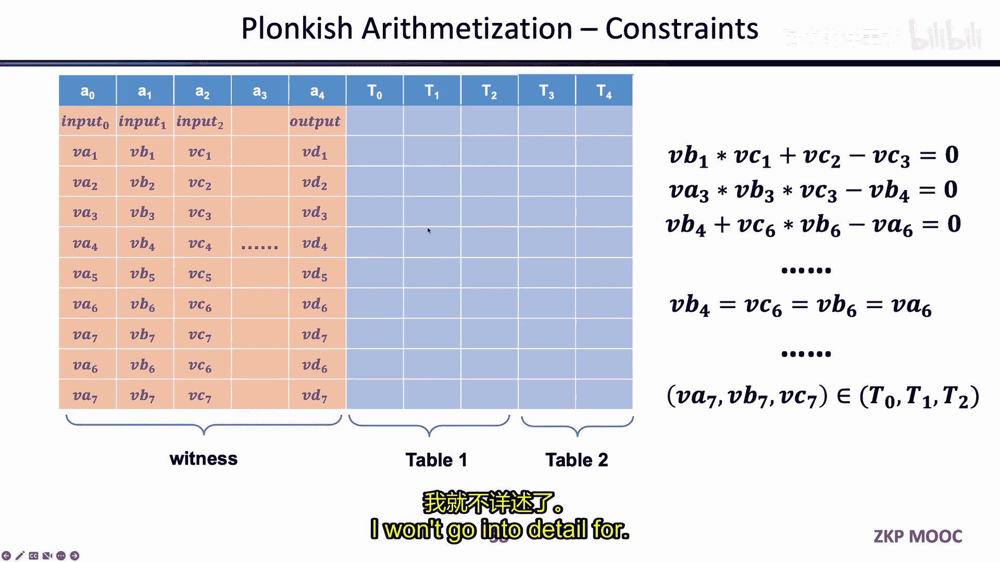

构建zkEVM证明的流程主要分为两步：
1.  **前端电路化**：将需要证明的计算（即EVM执行）表达为一组算术约束。
2.  **后端证明生成**：运行证明算法，为满足约束的赋值（即见证）生成证明。

对于zkEVM，我们选择使用 **Plonkish算术化** 作为前端，并使用 **Plonk IOP + KZG多项式承诺方案** 作为后端来生成证明。

### 前端：电路化方案选择

我们需要证明EVM中的计算，这面临几个挑战：
1.  EVM字长为256位，大于常用证明系统所基于的有限域（如254位），需要高效的范围证明。
2.  EVM包含许多对ZK不友好的操作码（如Keccak哈希）。
3.  作为虚拟机电路，需要高效处理读写一致性（如内存、堆栈）。
4.  EVM具有动态的执行轨迹，需要高效的选择器来在不同位置启用不同的约束。

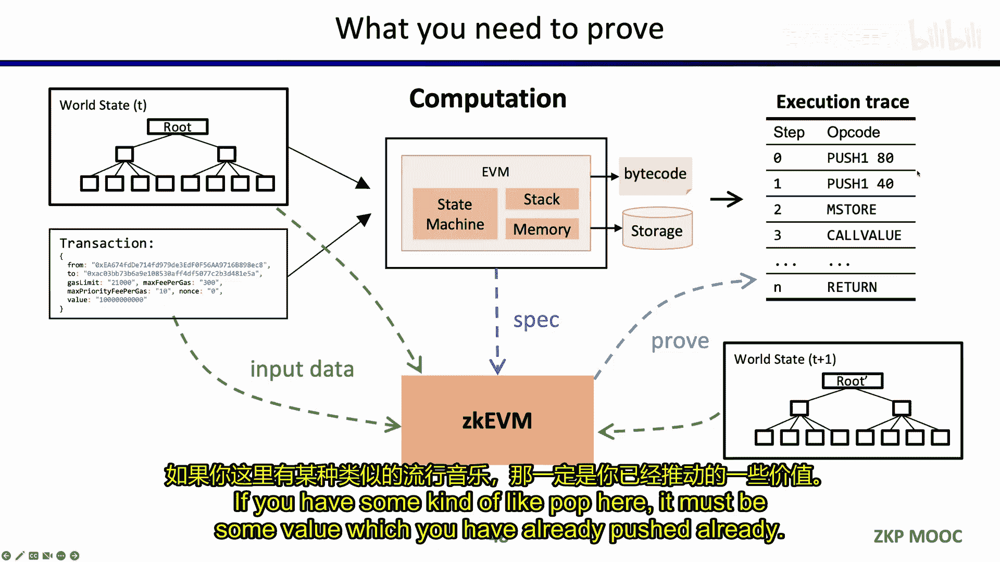

考虑到对高效范围证明、电路连接和读写一致性的需求，我们需要支持**查找表**的算术化方案。同时，为了处理动态执行轨迹，我们需要**自定义门**。因此，**Plonkish算术化** 成为更合适的选择。

以下是Plonkish中可用的约束类型：
*   **自定义门**：可以定义表中任意形状的“门”，并规定门内单元格值的任意关系。公式示例：`v3 * vB3 - vB4 = 0`。
*   **置换约束**：用于证明不同单元格的值相等，从而连接不同的门。
*   **查找表**：证明一个元组属于某个预定义或动态生成的表。这对于范围检查、位运算和证明内存读写一致性非常高效。

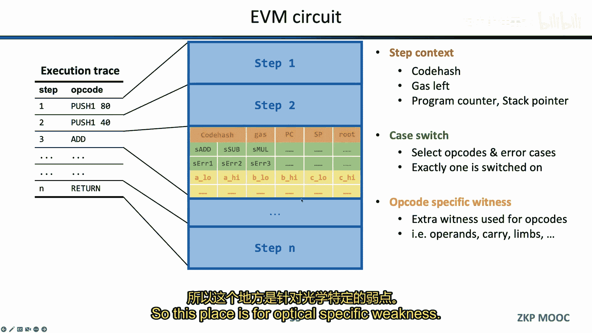

### 编写zkEVM电路

我们需要证明的计算是EVM正确执行了一批交易。公开输入是旧状态根、新状态根和交易列表。见证则是EVM执行这些交易时产生的完整执行轨迹。

执行轨迹中的每一步都需要三类见证信息：
1.  **步骤上下文**：执行此步骤时的虚拟机上下文（如剩余Gas、程序计数器）。
2.  **密钥开关**：一个one-hot编码向量，指示此步骤执行的是哪个操作码。
3.  **操作码特定见证**：执行该操作码所需的具体数据（如操作数）。

以`ADD`操作码为例，其约束包括：
*   **步骤上下文约束**：确保如果此步骤是`ADD`，则程序计数器、步骤指针等按规则更新。
*   **密钥开关约束**：确保密钥开关向量中只有一个元素为1，其余为0。
*   **操作码特定约束**：确保加法运算 `a + b = c` 正确，并处理可能的溢出。

此外，还需要证明操作数 `a` 和 `b` 确实来自堆栈顶部（即读一致性）。这里我们使用**查找表**。在EVM电路中，我们只需查找 `(a, b)` 等元组是否存在于一个“魔法表”中。而该魔法表（如RAM表）本身的正确性则由另一个专门的电路（如RAM电路）来证明。

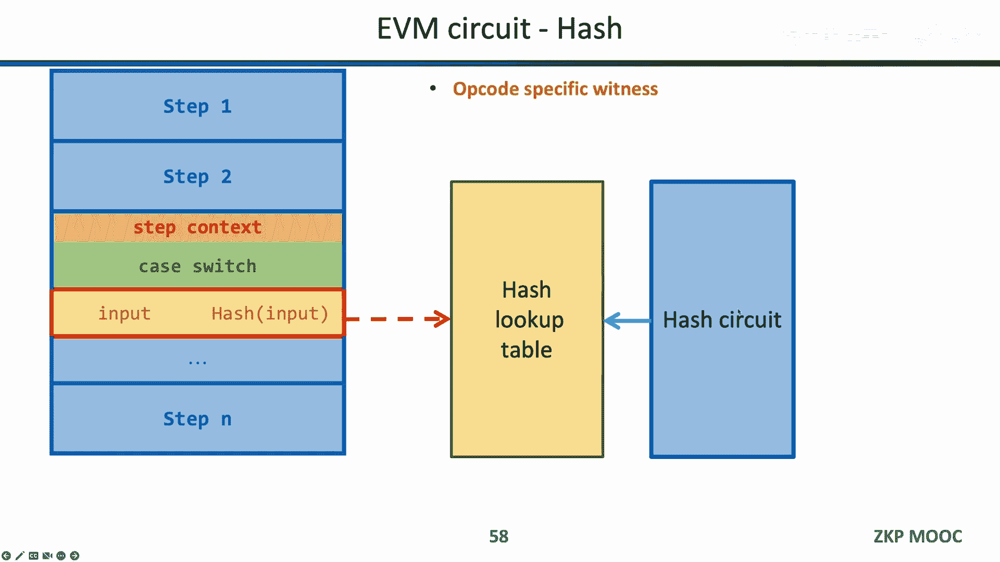

类似地，对于Keccak哈希等复杂操作，我们也在EVM电路中通过查找`(输入, 输出)`元组到专门的哈希表来“外包”证明，哈希表的正确性则由独立的哈希电路证明。

### zkEVM整体架构

zkEVM的电路架构是一个由查找表连接的电路网络：
*   **顶层是EVM电路**，约束状态机的每一步执行，并通过查找表连接到其他功能电路。
*   **多个专用子电路**：包括用于内存/堆栈/存储的RAM电路、Keccak哈希电路、交易电路、区块上下文电路、ECDSA签名电路等。
*   **连接方式**：EVM电路通过查找表“调用”这些子电路提供的功能。每个子电路负责证明其对应查找表中所有条目的有效性。

### 后端：证明系统选择

zkEVM包含多个子电路，理论上需要为每个电路生成并验证证明，但这在链上成本过高。因此，我们采用两层架构：
1.  **第一层**：为EVM逻辑及各子电路生成证明。
2.  **第二层**：一个**聚合电路**，用于证明所有第一层子电路的证明是有效的。最终只需在链上验证这一个聚合证明。

不同层对证明系统有不同要求：

**第一层要求**：
*   高度可表达，支持自定义门和查找表。
*   证明生成速度快，硬件友好（高度并行、低峰值内存）。
*   验证电路规模小（便于聚合）。
*   最好具有透明或通用可信设置。

**有希望的候选方案**：
*   `Plonky2`、`Starky`等：使用小域（如Goldilocks域），CPU计算快，支持自定义门和查找表，硬件友好，验证电路小，透明设置。
*   `Halo2 with KZG`：支持自定义门和查找表，GPU证明性能好，验证电路小（KZG），通用设置。这是我们选择的方案。
*   `Nova`/`SuperNova`：支持高效的递归证明，可能在未来支持Plonkish后成为有力候选。

**第二层要求**：
*   在EVM上验证效率极高（Gas成本低）。
*   证明体积小。
*   硬件友好。
*   理想情况下具有透明设置（但非硬性要求，因为聚合逻辑固定）。

**有希望的候选方案**：
*   `Groth16`：证明体积小，验证成本低。
*   配置为“高瘦”形态的`Plonk`（列数少）+ `KZG`/`Flink`：验证成本低。
*   `KZG` with `Keccak`：利用EVM预编译，验证高效。

我们最终选择 **Halo2 with KZG** 用于两层。在第一层，它满足了可表达性和性能需求。在第二层，我们可以将聚合电路配置得非常“瘦”（列数少），从而生成验证成本极低的证明。

### 性能数据示例

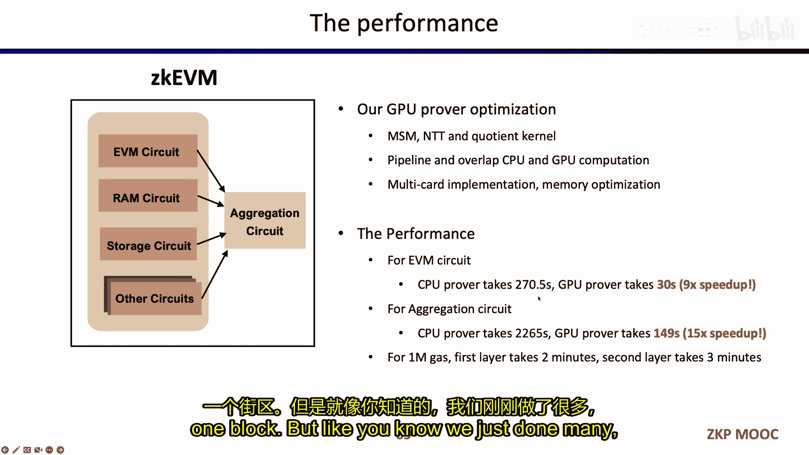

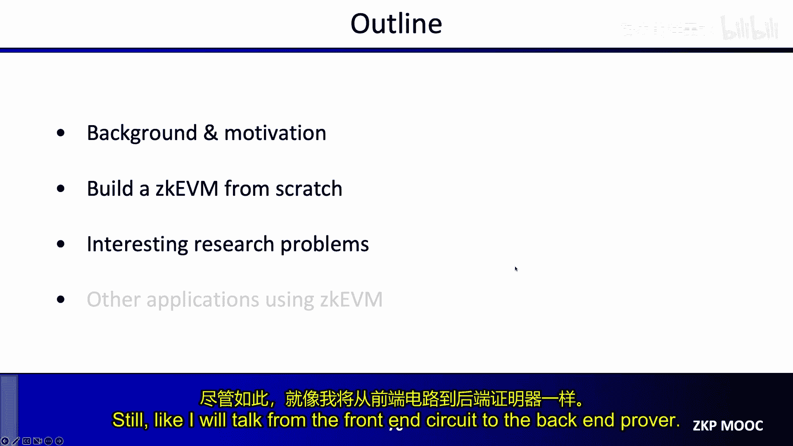

以下是一些（非最终）性能数据，展示了zkEVM的可行性：
*   **EVM电路**：约100列，200+自定义门，50个查找表。证明100万Gas的交易约需 `2^18` 行，GPU证明时间约30秒。
*   **聚合电路**：约23列，证明生成时间约3分钟。
*   通过GPU加速、流水线、内存优化等技术，证明性能已得到大幅提升。

---

## 第三部分：构建zkEVM时遇到的研究问题

上一节我们走完了构建zkEVM的完整流程，本节中我们来看看在实际构建过程中遇到的一些有趣的研究挑战，从前端电路设计到后端证明生成都有涉及。

### 电路侧的问题

**1. 随机线性组合与多阶段证明**
为了高效处理256位的EVM字，我们将其拆分为32个8位肢体，并用一个随机数`θ`进行线性组合编码为一个值。但随机数`θ`必须在所有肢体值确定后才能安全生成，这要求证明系统支持**多阶段证明**（先合成部分见证，衍生随机数，再合成剩余见证）。这虽然强大，但在多电路协作时可能导致复杂的同步开销。一个开放问题是：能否在不使用RLC的情况下实现类似的查找表布局优化？

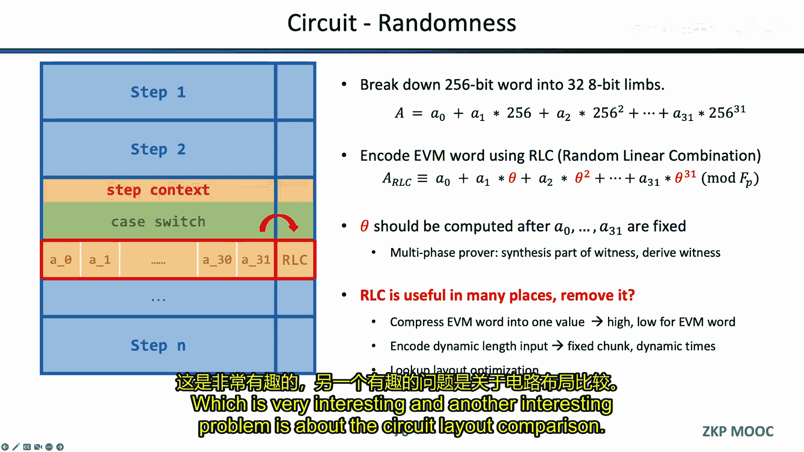

**2. 电路布局与自定义门复用**
我们利用Plonkish的自定义门来灵活支持不同的操作码，但这导致了大量（超过200个）自定义门。我们是否可以通过定义更基础的“微操作码”来复用自定义门，从而减少总数？但这可能会降低电路单元的利用率。如何在灵活性和效率之间取得最佳平衡，仍需探索。

**3. 动态电路问题**
当EVM电路将复杂操作（如哈希）“外包”给子电路时，不同子电路所需行数不同。目前我们通过填充使它们长度一致，但这带来了问题：
*   限制了单个证明中能包含的特定操作（如哈希）的最大数量。
*   为未使用的部分支付了证明成本。
*   能否支持动态大小的子电路，并按需付费？一种可能的解决方案是使用递归证明来动态聚合多个子电路证明。

### 后端证明侧的问题

**1. 硬件友好性与瓶颈转移**
通过GPU加速，多重指数运算和FFT等核心计算已非常快。但**见证生成**和**CPU与GPU间的数据拷贝**成为了新的瓶颈。未来的证明系统设计需要**软硬件协同设计**，综合考虑理论复杂度与实际硬件（GPU/ASIC）的并行化能力。

**2. 证明系统组合与递归**
第一层需要高表达性，第二层需要极高的链上验证效率。是否存在比我们当前方案（两层Halo2-KZG）更好的组合？有两个主要方向：
*   **转向更小的域**（如Goldilocks, Mersenne素数）：在CPU和专用硬件上计算更快，内存占用更低。
*   **坚持椭圆曲线构造**并利用新方案（如SuperNova）：实现更高效的递归和更小的递归阈值。
如何选择最优组合仍是一个开放问题。

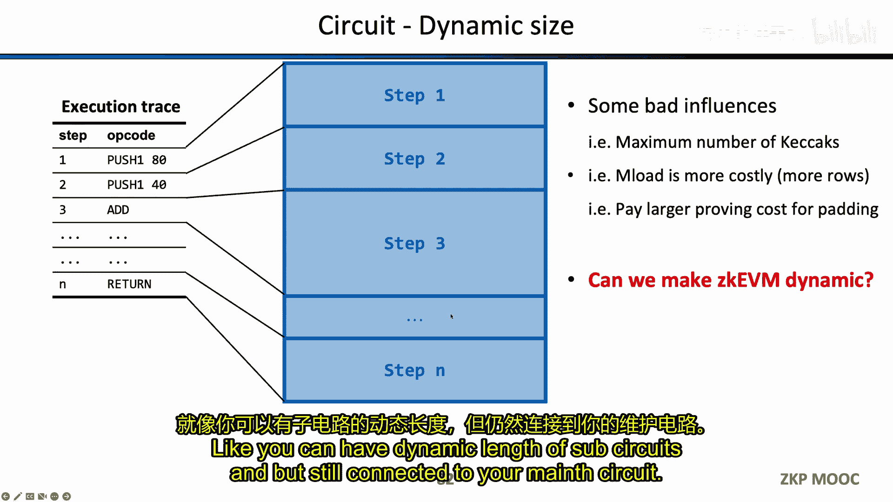

### 安全性问题

zkEVM电路极其复杂（超过3万行代码），难以保证完全没有错误。如何有效地审计基于Plonkish算术化的虚拟机电路？形式化验证、SMT求解器等自动化审计工具是否可行？这是一个关键且具有挑战性的研究方向。

---

## 第四部分：zkEVM的其他应用

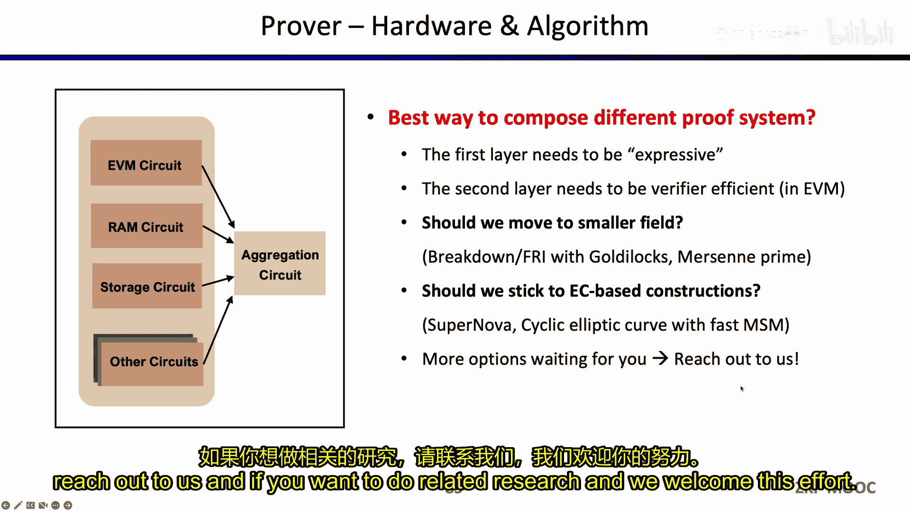

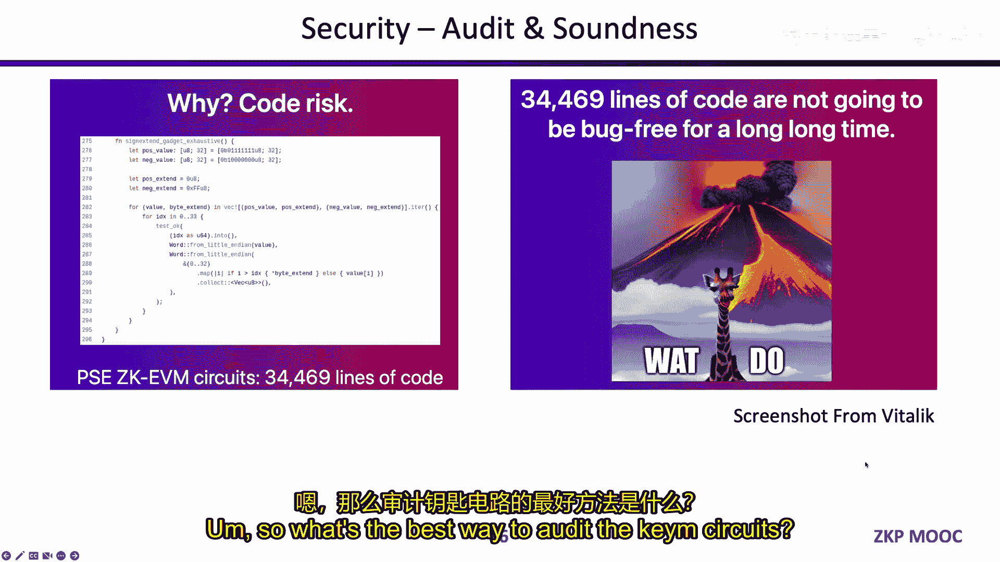

上一节我们探讨了构建zkEVM的技术挑战，本节中我们来看看zkEVM除了作为zkRollup核心之外，还有哪些有趣的应用场景。

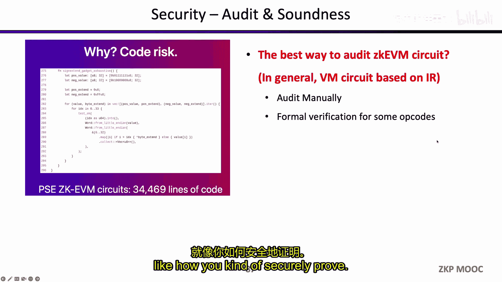

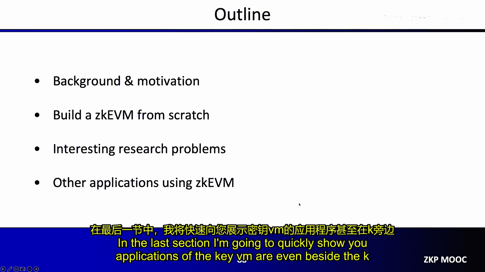

**1. 链上封装（Enshrined zkEVM）**
这个想法更为激进：在Layer 1本身，要求区块提议者为每个区块生成zkEVM证明。这样，其他节点就无需重新执行所有交易，只需验证证明即可达成共识。这可以大幅提升Layer 1的效率和去中心化程度。然而，这要求“共识级别”的zkEVM，且证明时间必须极短，目前仍是一个雄心勃勃的目标。

**2. 递归证明与历史压缩**
更进一步，每个区块的证明不仅可以证明本区块内的交易，还可以证明之前区块的证明是有效的。如此递归，最终整个区块链的历史都可以压缩为一个简洁的证明。这实现了对区块链历史的终极压缩验证。

**3. 漏洞证明（Proof of Bug）**
如果将交易内容也作为私有输入，zkEVM可以证明：“我知道某个（未公开的）交易，执行后能使状态从A变为B”。这可以用来证明智能合约中存在可导致资产损失的漏洞，而无需立即公开漏洞细节，从而有利于漏洞赏金计划的安全执行。

**4. 零知识预言机（ZK Oracle）**
智能合约有时需要访问历史链上数据（如过去一个月的平均价格）。通过zkEVM的状态证明，可以可信地获取历史某个时刻的状态（如价格），并在零知识电路中进行计算（如计算平均值），最后将结果和证明提交到链上。这实现了无需信任第三方预言机的链上数据访问与计算。

---

## 总结

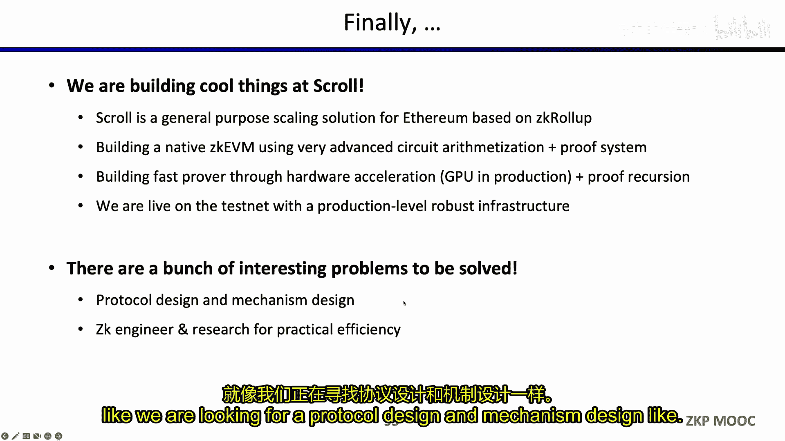

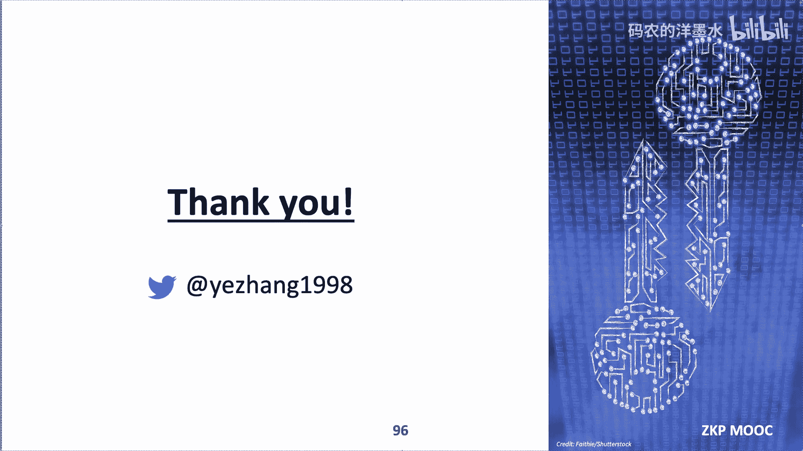

在本节课中，我们一起深入学习了zkEVM的方方面面。我们首先了解了其出现的背景和动机，即为了提供开发者友好且具备可组合性的通用zkRollup解决方案。接着，我们详细剖析了如何从零构建zkEVM，包括选择Plonkish算术化来处理EVM的独特挑战，设计由查找表连接的模块化电路架构，以及选用Halo2-KZG证明系统来平衡表达性与验证效率。然后，我们探讨了在构建过程中遇到的实际研究问题，如随机线性组合的工程实现、动态电路设计以及证明生成的硬件瓶颈等。最后，我们展望了zkEVM超越扩容的广阔应用前景，包括链上封装、历史压缩、漏洞证明和零知识预言机等。zkEVM正处于快速发展阶段，仍有许多激动人心的挑战和机遇等待探索。