# 013：采用形式方法保障ZK电路安全 🔐

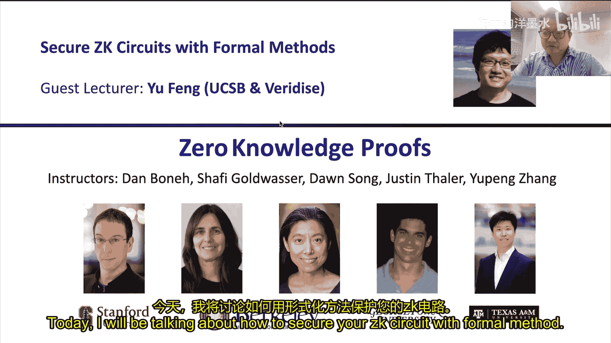

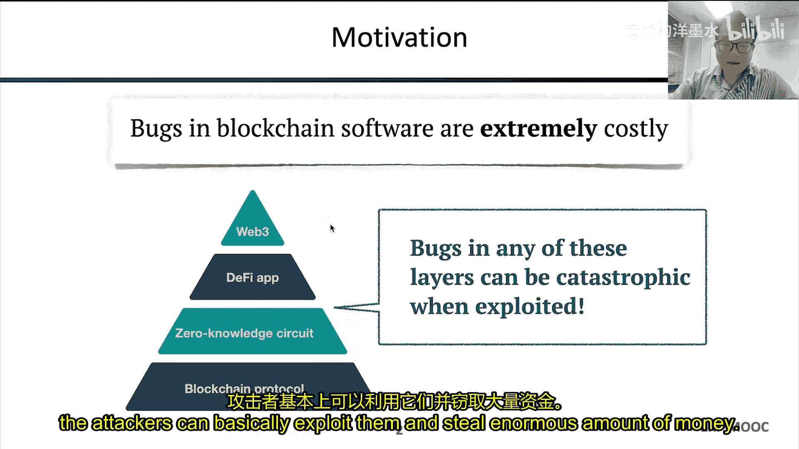

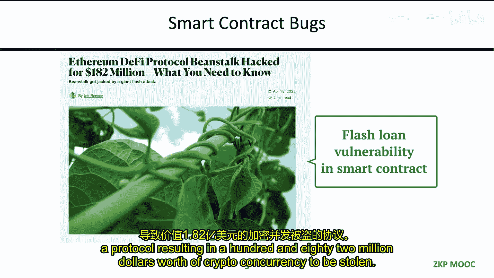

在本节课中，我们将学习如何运用形式化方法来保障零知识（ZK）电路的安全性。形式化方法是一套基于数学的严谨技术，可用于发现软件漏洞并构建关于软件正确性的证明。我们将首先介绍形式化方法的基本概念，然后探讨两个具体项目，它们分别通过静态分析和形式化验证来提升ZK电路的安全性。

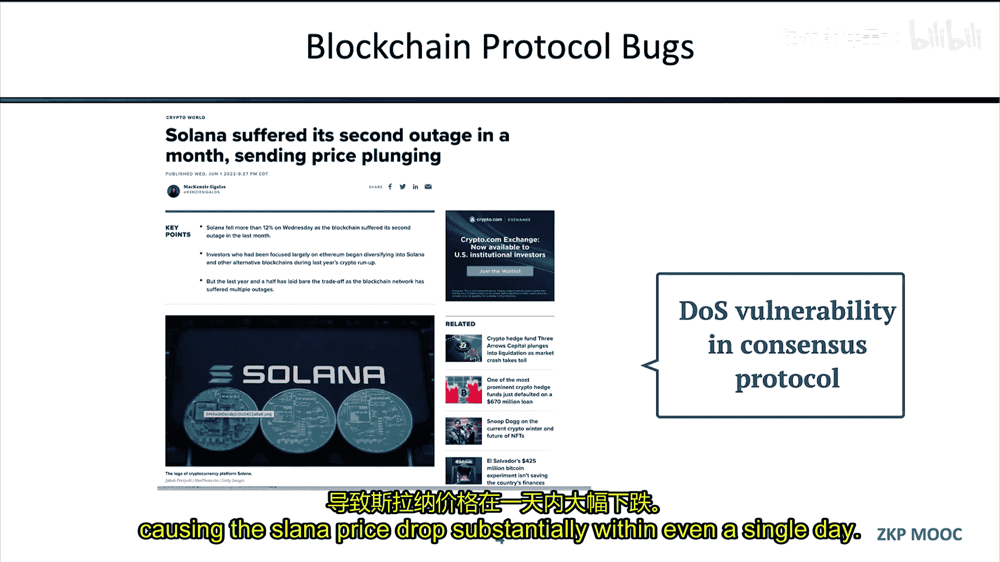

---

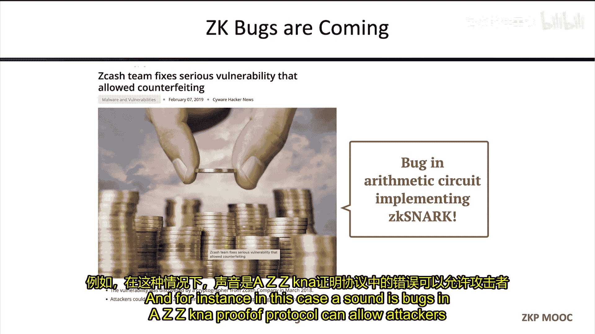

区块链软件中的漏洞可能极其危险。这里所指的区块链软件范围很广，从底层的共识协议、ZK电路、智能合约，一直到顶层的Web3应用，包括钱包、游戏、去中心化自治组织等。如果在这些层面的任何一层存在逻辑错误或安全漏洞，攻击者就可能利用这些漏洞窃取巨额资金。

为了给这一论断提供数据支持，我们可以看几个例子。例如，去年四月发生的一次闪电贷漏洞，导致价值1.82亿美元的加密货币被盗。再如，Solana协议中的拒绝服务漏洞导致了大规模网络中断，造成Solana币价在一天内大幅下跌。

最后，同样与今天主题相关的是，漏洞也可能出现在零知识证明层面。这并不奇怪，因为零知识证明也是由人编写的，而人都会犯错。例如，一个ZK证明协议中的完整性漏洞，可能允许攻击者凭空伪造出ZK代币。

虽然这听起来有些令人沮丧，但我想强调的是，漏洞并非不可避免。如果在区块链应用开发中采用恰当的形式化方法，我们实际上可以消除大部分漏洞。

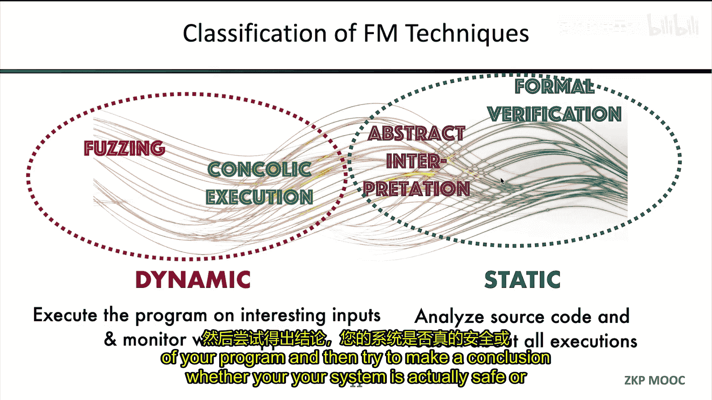

## 形式化方法概述 📊

形式化方法指的是一套数学上严谨的技术，用于发现漏洞以及构建关于软件正确性的证明。需要明确的是，这里的形式化方法并非指单一的技术或工具，而是一系列技术的统称。这些技术构成一个谱系，从左侧的系统化测试，到中间的静态分析，再到右侧的形式化验证。在这个谱系上，越往右，能获得的安全性保证就越强。然而，天下没有免费的午餐，为了获得更强的保证，也需要投入更多的人力。

在更高层次上，我们可以将形式化方法分为动态技术和静态技术。动态技术（如模糊测试）通过在某些有趣的输入上执行程序并监控其行为，通常以发现特定漏洞为目标。相比之下，静态技术（如抽象解释或形式化验证）则静态地审视源代码，尝试推理程序所有可能执行的行为，进而判断系统是否安全。

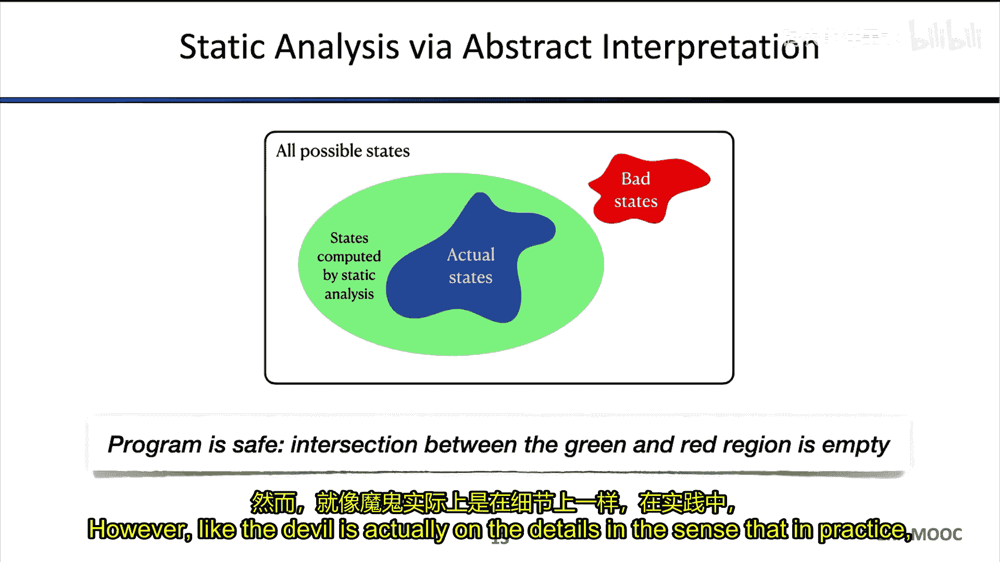

本节课我们将主要关注静态技术，包括抽象解释和形式化验证。

### 抽象解释

我们无法精确推理给定程序的所有行为，因为这本质上是一个不可判定问题。然而，这并不意味着我们不能推理程序的抽象版本。其核心思想是，获得对原始程序行为的保守性过近似，并希望这足以证明程序不存在某些漏洞或具有正确性。抽象解释就是一个用于计算程序状态过近似的流行框架。

为了理解抽象解释如何工作，让我们先回顾一个简单的具体解释器。它接收具体值和我们想要解释的代码片段作为输入，并产生具体输出。例如，给定一个简单的语句 `x = y + z`，如果 `y` 是 1，`z` 是 2，那么 `x` 将被求值为 3。

抽象解释器的工作原理与此类似，但它操作的是抽象值，这些抽象值代表一组具体值。例如，一个整数 `x` 可以有一个区间 `[A, B]` 作为其抽象值，表示 `x` 大于等于 `A` 且小于等于 `B`。对于语句 `x = y + z`，如果我们知道 `y` 的抽象值在区间 `[A, B]` 内，`z` 的抽象值在区间 `[C, D]` 内，那么通过符号化地求值表达式 `y + z`，我们可以得出结论：`x` 的抽象值在区间 `[A+C, B+D]` 内。

其核心思想是通过执行可容错的符号执行或符号推理来模拟所有可能的程序路径。对于复杂语句（如分支和循环），思路是相同的：当遇到分支或不确定选择哪条路径时，我们保守地假设两条分支都会发生，然后合并不同分支的结果，收集沿不同路径的所有值。

抽象解释可用于捕获以太坊智能合约中的许多棘手漏洞。例如，重入攻击对智能合约非常危险，因为它允许攻击者在未更新余额的情况下重复提取用户资金。即使定义协议的实际业务逻辑可能非常复杂，我们也可以使用时序顺序和读写依赖等抽象概念来编码重入行为。通过静态抽象重入攻击的行为模式（例如，是否存在外部函数调用后跟存储更新），我们可以识别此类漏洞。

抽象解释在识别特定类型的漏洞方面非常有效，例如整数溢出、交易顺序依赖、闪电贷攻击等。学术界和工业界都有大量相关研究，例如，Slither 是最流行的静态分析器之一，可以编码许多常见漏洞；Vanguard 框架则允许开发者编码和捕获分片攻击。

然而，抽象解释不能保证程序没有逻辑错误。例如，如果你有一段函数想要计算，并想推理该函数是否按预期行为执行，抽象解释无法做到。这时就需要形式化验证。

### 形式化验证

要使用形式化验证，前提是提供形式化规约来描述预期行为。形式化规约是对预期程序行为的数学精确描述，通常采用某种逻辑形式，如一阶逻辑或时序逻辑。

形式化验证工具（通常称为程序验证器）从高层视角看，接收以下输入：目标程序的源代码或字节码、描述待验证属性的形式化规约，以及可选的注解（如循环不变量、合约不变量或领域知识引理）。程序验证器将这些输入组合成一个逻辑公式，这个组件称为验证条件生成器。验证条件生成器确保代码满足规约当且仅当生成的公式是有效的。有效性检查通常通过外部定理证明器（如 SMT 求解器 Z3、CVC4）或交互式定理证明器（如 Coq、Lean）来完成。最终，形式化验证器会产生“是”或“否”的答案。如果证明成功，则从数学上保证了程序符合设计行为。

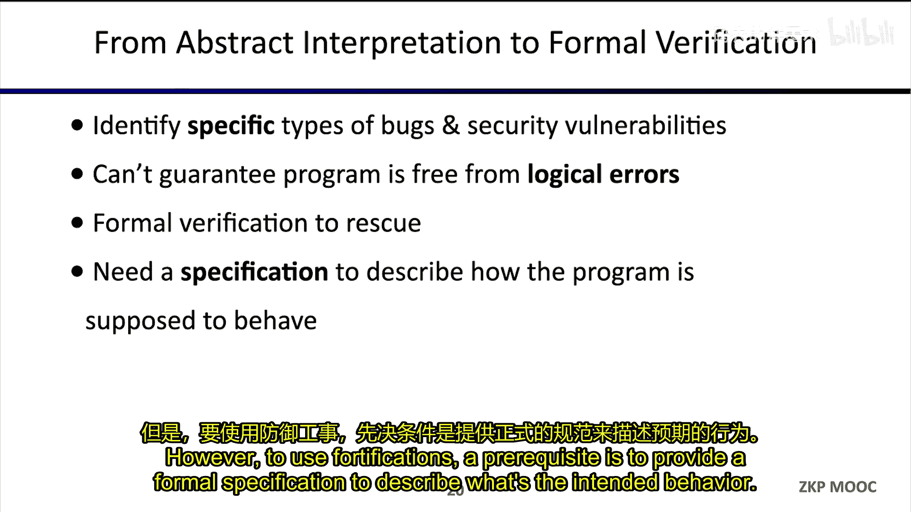

验证条件生成器像编译器一样输出逻辑公式。例如，假设我们有一个函数 `foo`，它给 `x` 和 `y` 分配不同的常量，最后断言 `x > 0`。验证条件生成器将编译这些信息和规约，生成对应的一阶逻辑公式。为了形式化验证该断言始终为真，验证器将问题简化为检查该公式是否有效。如果公式有效，则断言始终成立。

形式化验证非常强大，因为当证明成功时，它能提供最强的保证。然而，由于形式化验证的不可判定性，当证明失败时，可能属于以下几种情况之一：一是确实发现了逻辑错误（真阳性）；二是证明无法进行，因为需要人工输入（如循环不变量、缺失的引理）；三是由于现有定理证明器的不完备性或能力限制（这在ZK领域很常见）。例如，现有的定理证明器（如Z3）通常只能处理简单的线性整数算术，而ZK电路中充满了非线性算术和大素数有限域运算。

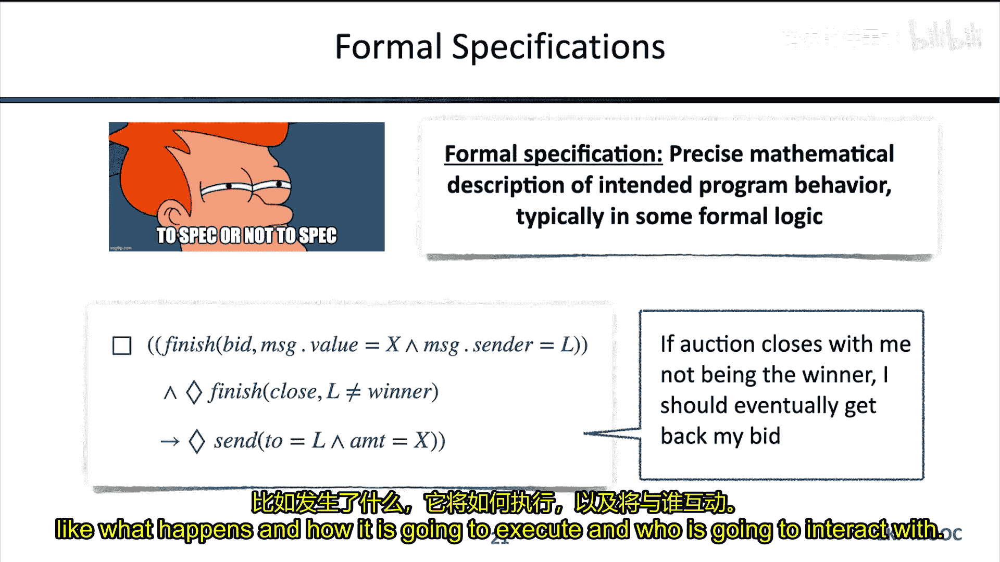

形式化验证有多种形式。我们目前讨论的是无界验证，它试图推理软件所有可能的行为空间，但这在实践中极具挑战性。另一种选择是使用有界验证来削弱保证，这在现实世界的验证工具中很常见。例如，可以限制输入大小或循环执行次数。

在智能合约和Web3领域，已有许多形式化验证工具，例如 Certora 验证框架、Mythril、Slither 等。

形式化验证技术可以检查程序是否符合提供的规约，这非常酷，因为只要你能写出形式化规约来描述想要检查的漏洞，就可以用它来证明程序不存在任何漏洞。其缺点是需要大量手动工作来编写规约。另一方面，如果你不想提供规约，可以使用其他类型的静态分析技术（如之前提到的抽象解释），它允许我们寻找特定类型的漏洞，并且不需要任何规约，因为这些漏洞模式已经作为分析的一部分被编码在抽象解释器中。

---

以上我们完成了第一节的内容。快速回顾一下，在第一节中，我们简要介绍了形式化方法中的一些基本术语和概念，特别介绍了两种静态分析技术：基于抽象解释和基于形式化验证的技术。我们还回顾了它们在实践中的优缺点和权衡。有了这些强大的工具，我们可以继续我们的旅程，看看如何实际运用这些技术来确保ZK电路的健壮性。

## ZK电路中的漏洞与静态分析 🛡️

在本节中，我们将首先回顾典型ZK电路的基本组成部分。需要指出的是，尽管大部分示例和评估基于 Circom 和 Halo2，但我们的底层技术实际上是语言无关的，因为它基于电路和证明系统的语义，而非ZK领域特定语言的语法特性。这意味着，通过足够的工程努力，所介绍的技术应该能够扩展到其他DSL和证明系统。

我们将首先分享ZK的一些基本组成部分，然后基于对现有流行ZK项目的大规模研究，分享一个ZK漏洞分类法。最后，我们将提出一个基于抽象解释的系统，使我们能够从大规模ZK项目中快速识别这些漏洞。

### ZK电路构造简介

首先，开发者用源语言（如 Circom 或 Halo2）编写他们的设计程序。源代码包含两个部分：见证计算和约束。程序随后被编译成两部分：见证生成器（通过转换原始见证计算得到）和多项式域方程。多项式域方程可以看作是一组关于输入、输出以及ZK电路中出现的中间变量的二次方程。最后，我们需要这些多项式域方程，因为它们将被转换成ZK-SNARK，后者由证明者和验证者组成。

请注意，这里的“验证者”与前一节介绍的程序验证器不同。ZK开发者的一个关键挑战是，编写设计程序需要同时编写见证生成代码和维护一组约束，编译器用这些约束来生成多项式方程。为了编写正确的ZK程序，见证生成和约束应该是等价的。

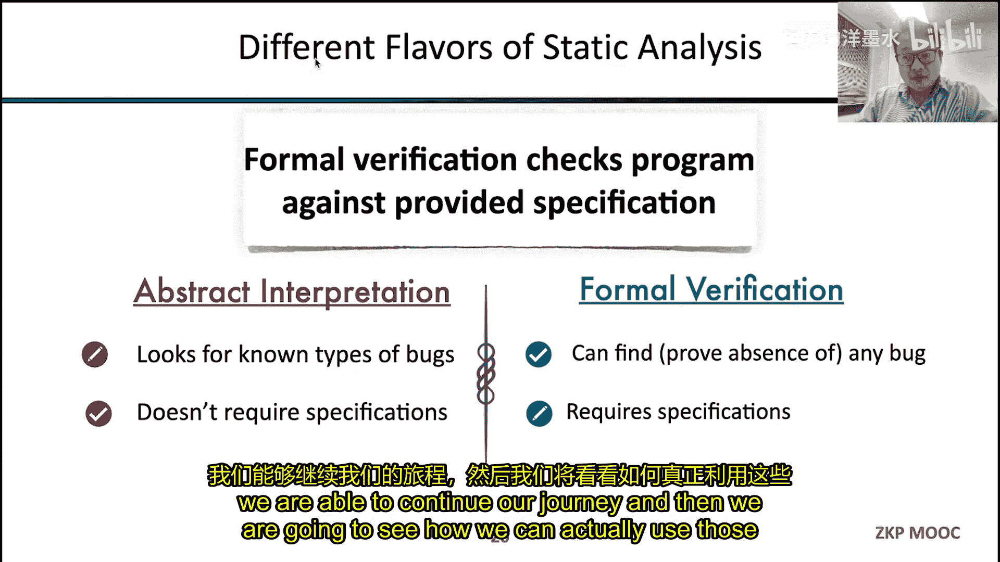

让我们正式定义一下这种等价性。我们用程序 `P` 表示见证生成代码，它接收输入变量 `x` 并返回输出变量 `y`。我们用大写 `C` 表示关于 `x` 和 `y` 的约束系统。对于 `x` 和 `y` 的具体赋值，约束系统 `C` 如果可满足则产生 `true`，否则产生 `false`。

我们说 `P` 和 `C` 是等价的，如果对于 `P` 的任何输入 `x`，使得 `P(x) = y`，并且 `x` 和 `y` 也满足约束 `C`。换句话说，定义包含两个要求：首先，对于见证计算程序 `P` 的任何输入输出对，必须满足约束系统 `C`；其次，对于任何已经满足约束 `C` 的 `x` 和 `y` 对，它也必须是原始程序 `P` 的有效输入输出对。

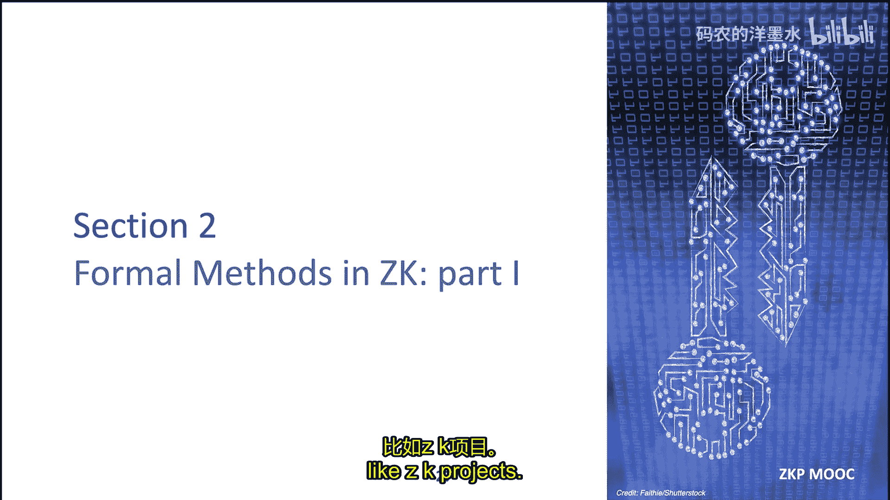

重要的问题是，这种等价性如何被违反？实际上，违反是可能发生的。我们将以更正式的方式研究这些可能的违反，并将其恰当地分解为两类，因为这实际上涉及两个方面。

第一类违反，我们称之为“过约束”漏洞，发生在存在程序的某个输入输出对（即满足见证计算 `P` 的有效输入输出对）但不满足约束 `C` 的情况下。然而，在实践中，我们很少看到这种过约束漏洞，主要有两个原因：首先，ZK开发者没有动机过度约束电路中的变量，因为这会增加证明生成成本；其次，在大多数ZK编程语言（如 Circom 和 Halo2）中，这些方程和约束在电路中是作为断言编码的，这意味着一旦发生过约束漏洞（即满足原始计算但违反约束），在电路执行期间可以立即看到断言失败，因此很多这类漏洞在开发阶段就被发现了。

另一方面，第二类漏洞，我们称之为“欠约束”漏洞，实际上要棘手得多。第二类违反发生在存在某个 `x` 和 `y` 对满足约束系统 `C`，但这个 `x` 和 `y` 不是程序的有效输入输出对（即 `P(x)` 的返回值不等于 `y`）。基本上，在这种情况下，攻击者或恶意用户可以声称任何关于随机计算的虚假事实，因为这些计算都被约束系统接受了。这种漏洞在实践中相当危险。

### 为什么欠约束漏洞很重要

为了理解这一点，让我们回顾一下从源代码到ZK-SNARK的原始工作流程。最终，ZK电路将产生一个由证明者和验证者组成的SNARK。这意味着，如果ZK电路的原始源代码中存在欠约束漏洞，验证者可能会接受本不该被接受的错误输入输出对。这不仅仅是假设性的漏洞，实际上可能导致应用程序中的严重漏洞，包括使攻击者能够耗尽协议的所有代币，或允许用户进行双花。

那么，我们如何处理这种情况呢？因为这实际上是一个根本性问题，需要推理ZK电路的见证计算和约束系统之间的等价性。在我们深入研究如何使用能提供最强数学保证的形式化验证之前，让我们先看看现有的漏洞是什么样的，以及我们是否可以用一些轻量级的静态分析来捕获其中的一些漏洞。

### ZK漏洞分类法

从前面的章节我们知道，基于抽象解释的轻量级分析在发现已知漏洞方面非常有效。然而，要使用现有的抽象解释工具，需要我们事先了解漏洞的模式（可以是语法模式或语义模式）。因此，为了应对这些问题，我们首先与ZK和以太坊基金会的研究人员合作，基于对大规模ZK开源项目的系统研究，绘制了一个ZK漏洞分类法。

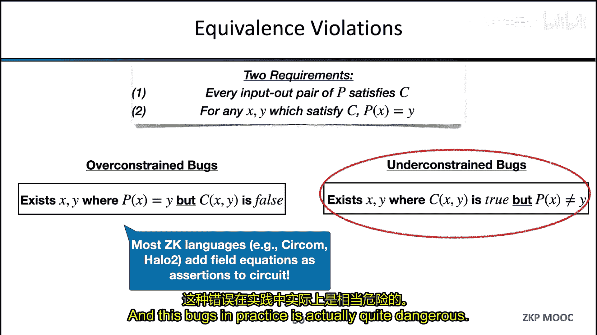

我们的分类法包含多个类别，每个类别都有我们识别出的几种漏洞变体。

**第一类：欠约束信号**
顾名思义，欠约束信号发生在约束被评估为真时，电路本质上会接受一切，因为对该信号没有约束。这个信号可以是输出信号或任何可以被参与者访问的公共信号。

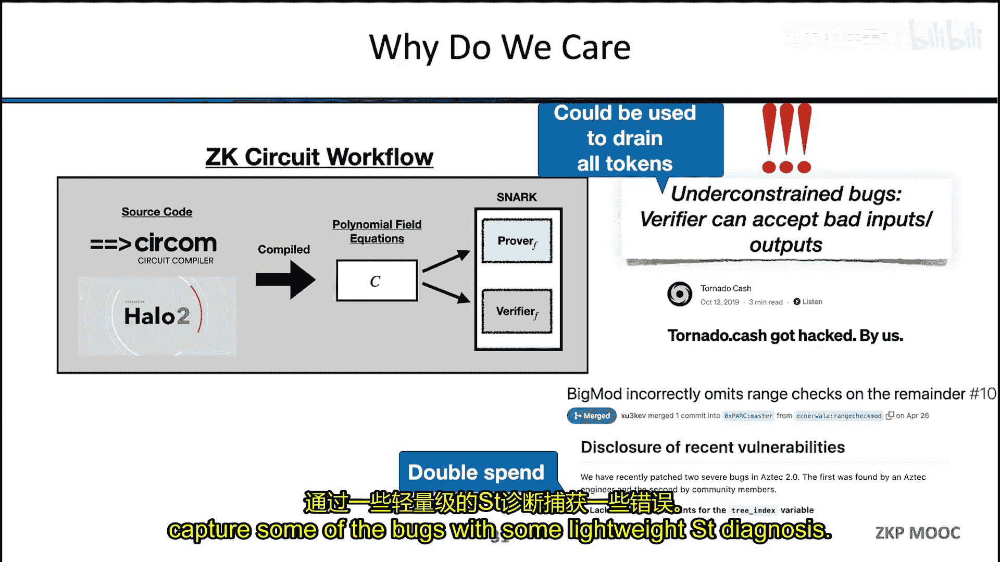

让我们看一个具体例子。这是一个来自 Circomlib 库的有漏洞的 `Num2Bits` 实现。`Num2Bits` 接收一个素域数 `n` 作为输入，并返回其对应的二进制表示（一个包含 `n` 个元素的数组，每个元素是0或1）。在代码实现中，开发者试图使用 `===` 操作符来约束输出元素的值，即数组中的每个元素应该是0或1。然而，这里存在一个细微的差一错误：循环体使用 `n-1` 作为循环边界，但正确的版本应该是 `n`。如果你将原始电路编译成对应的约束系统，对于大小为4的数组，输出0和输出1都被正确约束（即都应该是0或1），但由于源代码中引入的差一错误，对最后一个元素（输出2）没有约束。这意味着攻击者可以给数组的最后一个元素传递任何值，证明系统都会接受，因为没有约束来阻止它接受这个值。这在实践中可能极其危险。

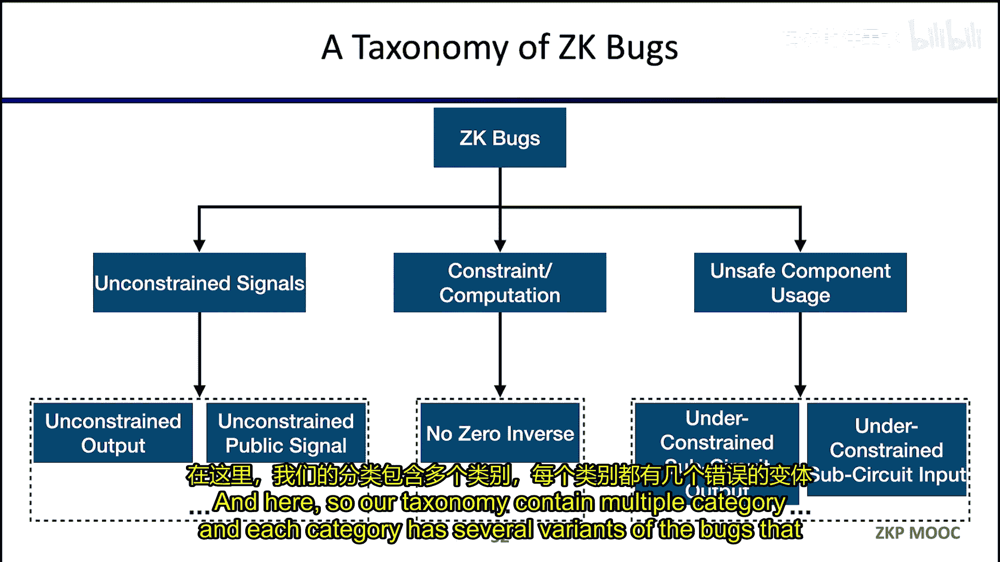

**第二类：不安全组件使用**
正如我们所知，大型ZK电路通常由许多小型可重用的组件（或称为“小工具”）组成，就像搭乐高积木一样。每个单独的组件或小工具本身看起来可能是安全的，但由于不正确的假设，漏洞仍可能出现在边界上。这就是我们所说的不安全组件使用，包括欠约束的子电路输出和欠约束的子电路输入。

让我们看一个具体例子。在这个例子中，开发者试图实现一个提款函数，该函数试图从余额中提取一定金额。开发者调用了“小于”组件来比较金额和余额。当然，你总是希望确保金额小于余额。然而，由于开发者忘记约束“小于”组件的返回值（正确的约束应该添加一个断言来强制输出值始终为0，这本质上声明了金额应始终小于余额），这意味着对提款金额没有限制。结果，攻击者可以提取超过其应得金额的资金。

**第三类：约束与见证计算之间的差异**
由于ZK-SNARK的设计，并非所有计算都能直接在证明系统中表达为约束。因此，当约束不能忠实地捕获计算语义时，就会出现漏洞。这里我以“非零倒数”为例来说明这种漏洞，在实践中存在许多此类变体。

让我们看一个非常简单的电路，它试图实现乘法逆函数。该函数非常简单，它试图计算 `a` 除以 `b`。然而，由于多项式方程不直接支持除法运算符，开发者需要使用乘法来模拟这个除法运算符。例如，`a / b = out` 等价于断言 `out * b = a`。这看起来没问题，除了它实际上遗漏了一个约束情况：当 `b` 等于0时，在原始见证计算中，除以0是未定义行为，应该在程序执行期间被拒绝和禁止。然而，由于你使用乘法来模拟这个计算，出现在当前约束系统中的乘法实际上会允许 `b` 等于0。这意味着在这种情况下，电路和证明将本质上允许一些在原始见证计算中本应是未定义的行为。

现在我们看到了问题。但我们如何检测那些可能出现在许多其他电路中的漏洞呢？特别是，我们如何使用之前学到的抽象解释技术来做到这一点？首先，我们需要一个抽象表示来量化ZK电路中可能与我们的漏洞相关的关键语义。

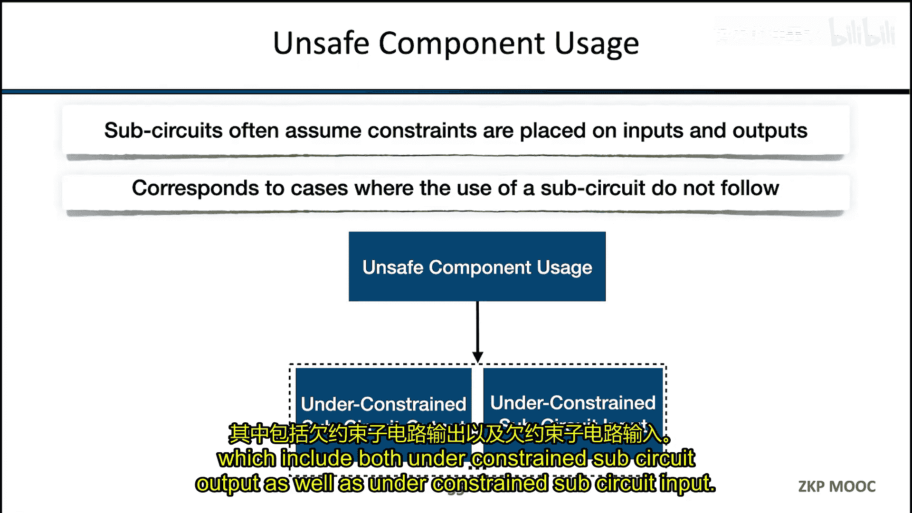

### 电路依赖图

我们引入了一种称为“电路依赖图”的语义表示。顾名思义，它是一个表示ZK电路的图，其中节点代表不同类型的信号（输入和输出），边代表依赖关系。我们使用有向实线边来表示数据依赖。例如，如果你有一个见证计算试图将 `I` 赋值给 `O`，那么我们将在 `I` 和 `O` 之间放置一条边，表示 `O` 的计算依赖于 `I`。类似地，我们引入了第二种边，称为“约束边”，用虚线表示。这条边是无向的，表示如果有一个约束系统建立了信号 `O` 和 `I` 之间的关系，那么我们将放置一条约束边来连接这两个信号。

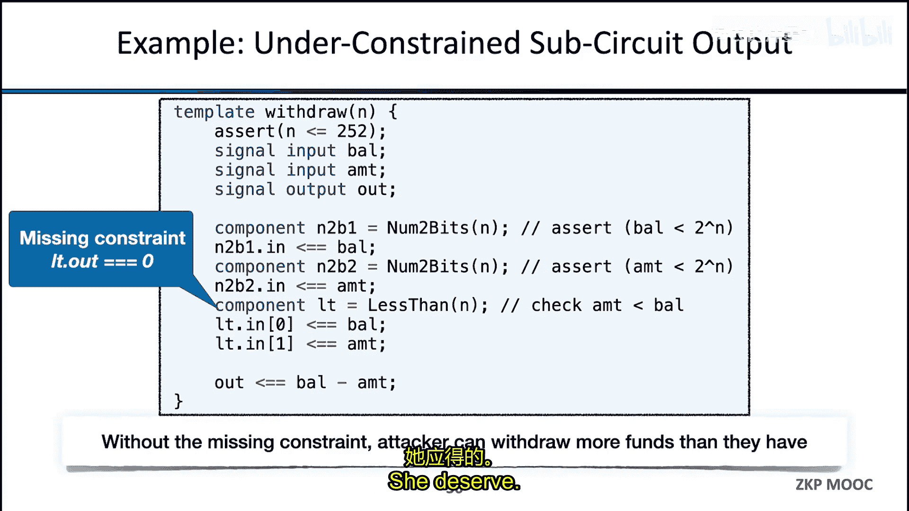

现在让我们看一个例子，看看如何用电路依赖图来表示ZK电路的某些关键语义。给定左侧的电路，我们首先为原始电路中出现的每个信号构造一个节点，并使用不同的颜色来表示它们是输入还是输出。一旦我们绘制了节点，还需要构造边。例如，我们根据见证计算构造数据依赖边：为了计算信号 `V` 的值，需要进行涉及 `B1`、`B2` 和 `carry` 的计算。因此，你可以看到从 `carry`、`B1`、`B2` 指向 `V` 的有向边。类似地，除了数据依赖边，我们还有约束边。在这种情况下，我们试图建立一个涉及变量 `V` 和其自身的约束，因此我们将在信号 `V` 上放置一个无向的自环，并对 `C_out` 做同样处理。这就是我们基于原始程序构造电路依赖图的方式。

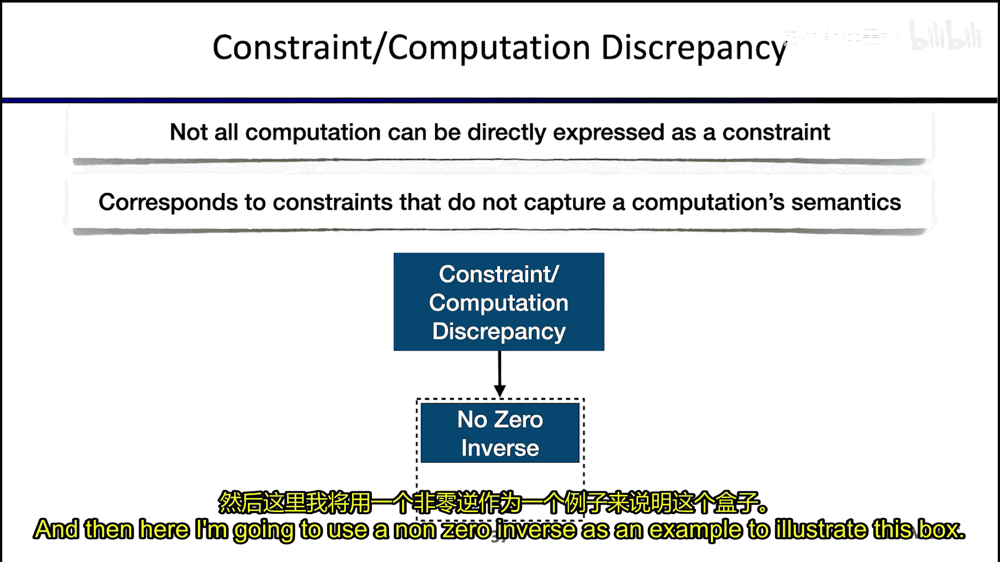

一旦我们使用电路依赖图获得了原始电路的抽象表示，就可以将漏洞检测简化为对图的查询实例。例如，底部的查询用于编码本节第一个模式中提到的欠约束输出信号的模式。我们用 Datalog 编码这个查询。其本质是，我们试图寻找是否存在一个欠约束的输出信号。为了成为一个欠约束的输出信号，我们首先寻找一个将成为输出信号的信号 `V`，然后检查这个 `V` 是否被某些常量约束。如果这个输出信号没有被任何常量约束，并且也没有直接或间接地被任何输入信号约束，那么我们就说我们识别出一个潜在的欠约束输出信号。

### Vanguard 框架实现

我们将提出的想法作为 Vanguard 框架的一部分实现。该框架接收 Circom 或 Halo2 格式的ZK电路作为输入。我们将这些输入转换成对应的电路依赖图，然后使用一系列代表我们之前学到的语义模式的查询，在生成的电路依赖图上执行查询。最后，该工具将报告源代码上的任何潜在违规。

为了评估这种方法的有效性，我们从 GitHub 上17个流行的ZK开源项目中收集了258个电路。初步结果相当有希望：该工具能够识别出一批漏洞，其中包含32个先前未知的漏洞。我们已将所有漏洞报告给项目开发者，其中大部分已得到确认。此外，除了漏洞，我们还绘制了条形图来深入了解不同漏洞的分布情况。正如你所见，开发者在维护约束系统和见证计算之间的语义一致性方面遇到最大困难，这并不奇怪。

---

现在我们已经看到了静态分析器在捕获常见ZK漏洞方面的有效性，让我们重新审视之前的 `Num2Bits` 示例。正如我之前指出的，这里存在一个导致欠约束问题的漏洞，开发者忘记约束输出数组中最后一个元素的值。结果，这将使攻击者能够为最后一个元素提供任意值，并且验证者仍然会接受。

假设开发者使用我们的工具来识别这个问题，然后她建议了右侧的修复方案。我们想要弄清楚这个修复是否正确，即它是否真的没有欠约束问题。在这种情况下，我们不能仅仅重新运行之前的静态分析器，然后基于静态分析器没有发现任何问题的事实得出结论说当前电路是安全的，因为我们知道静态分析是基于常见模式或先验知识的。然而，开发者现在想要的实际上是一个更强的保证，这需要进行形式化验证。

## 形式化验证ZK电路 ✅

这正是最后一节要讨论的内容。

### 重新审视欠约束问题

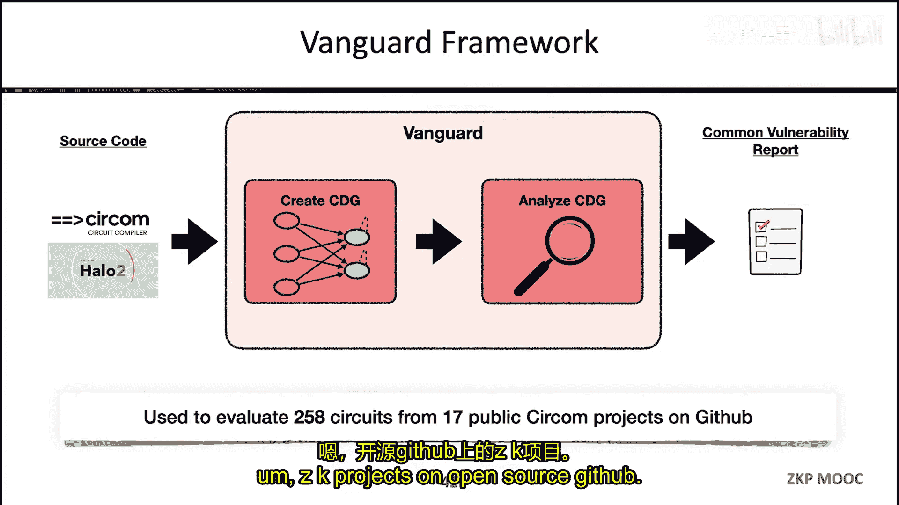

在我们提出解决方案之前，我想重新形式化地审视欠约束问题。假设我们有一个包含两部分（见证计算 `P` 和约束 `C`）的电路，两者都以 `x` 作为输入，`y` 作为输出。我们说欠约束漏洞发生在存在一对 `(x, y)` 满足约束 `C`，但它们不是程序 `P` 的有效输入输出对时。在这种情况下，我们想要做的是形式化地证明一个电路不是欠约束的。

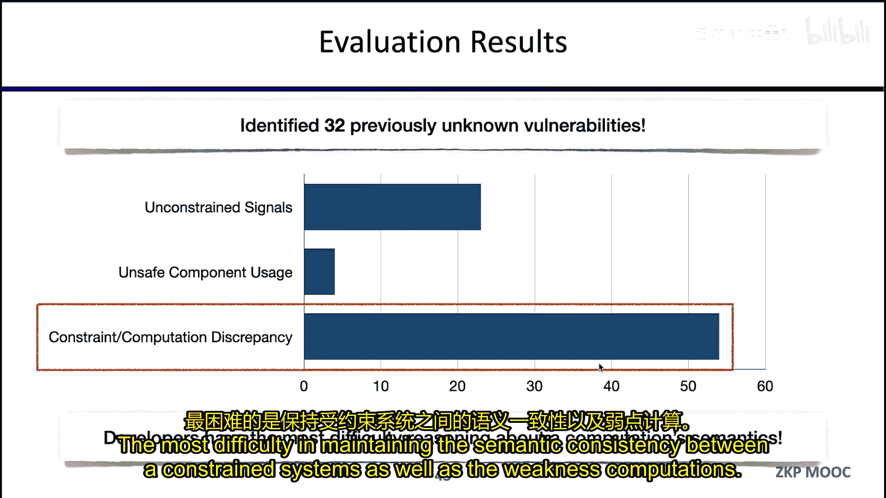

有几种方法可以做到这一点。两种朴素的方法是：一是执行静态分析，即定义一组预定义的规则，允许你推理信号变量的属性；二是将问题形式化为一个SMT查询，因为欠约束属性可以在有限域理论中形式化为一个一阶逻辑公式，求解器可以直接回答这个查询。

两种方法各有优缺点。基于静态分析的约束分析非常可扩展，可以让我们验证大型电路是否被安全约束，但它们常常遭受假阳性的困扰（即如果它们说一个电路是欠约束的，可能并非如此）。另一方面，SMT求解器没有假阳性问题，因为它基于非常精确的符号推理，但很难扩展到只有几百个约束的大型电路。

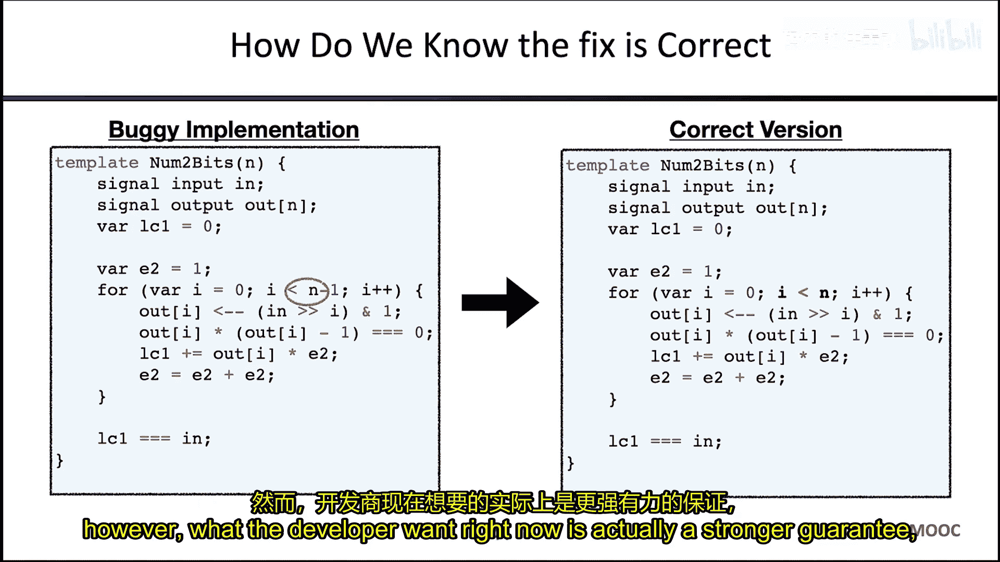

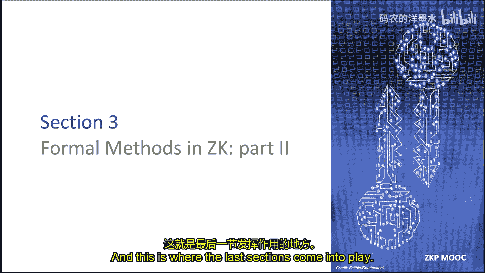

在本节中，我将提出一个名为 `Picus` 的新系统，它接收一组多项式域方程作为输入，并自动尝试验证电路是否被良好约束。如果 `Picus` 证明电路被良好约束，它将返回一个对勾，表示电路安全；如果证明电路是欠约束的，它将返回一个叉号；如果以上情况均未发生，它将返回“未知”。

`Picus` 背后的关键思想是结合静态分析和SMT求解器的优势，使其能够扩展到大型电路，同时保持合理的精度。从高层次看，静态分析阶段和SMT求解阶段在循环中交互，相互提供信息，使它们能够取得单独无法取得的进展。

让我们看看细节，了解它是如何工作的。

静态分析阶段接收多项式域方程 `P` 以及一组迄今为止已被 `P` 证明为良好约束的信号集合 `K` 作为输入。在开始时，算法将 `K` 初始化为空集。给定这些输入，静态分析引擎将生成一个更新的约束集合 `K'`，表示该集合中的所有信号已被证明为良好约束。这里的不变量是 `K'` 应始终大于 `K`，以表明在每次迭代中，它都在扩大被证明为良好约束的信号集合，从而表明它正在取得进展。如果约束集合包含输出信号，那么我们将返回一个对勾，表示 `Picus` 将终止并得出结论：电路被正确约束。

另一方面，由于某些场景无法用静态分析推理，它将把 `K'` 作为输入传递给SMT阶段。SMT阶段有类似的接口：它接收约束 `P` 以及一组已被证明为良好约束的集合 `K` 作为输入，并返回一个集合 `K''`（包含被证明为良好约束的信号）以及一个集合 `K_under`（包含被证明为欠约束的信号）。第一种情况与之前类似：如果输出信号是 `K''` 的子集，那么我们就完成了，返回电路安全。第二种情况是：如果任何输出信号与欠约束信号集合有非空交集，那么我们将返回叉号，表示电路不安全。第三种情况是：如果 `K` 实际上等于 `K'`，意味着SMT求解器无法取得进展，这通常是由于现有有限域求解器的局限性。在这种情况下，我们将返回问号表示“未知”。如果以上三种情况均未发生，我们将把这些信息 `K'` 传播回静态分析阶段，并重复此过程，直到得出决定性答案。

这是 `Picus` 在我们评估之前提到的修复版本电路时的输出。正如你所见，该工具将输出关于电路约束数量的某些统计信息，最后打印出“SAFE”。这里的“SAFE”意味着 `Picus` 已经形式化地验证了给定电路保证没有欠约束信号。

为了评估 `Picus` 的有效性，我们在从流行Circom库收集的163个电路上进行了测试，包括59个来自 Circomlib2，104个来自 Circom-core。顶部的表格显示了约束数量和输出信号数量的相关统计数据。正如我们所看到的，Circomlib2 中的电路相对较小，而 Circom-core 库中的电路实际上非常大。为了比较两者的有效性，我们还将 `Picus` 与两个基线（仅使用静态分析的中间基线和仅使用SMT的基线）进行了比较。蓝色条对应 `Picus` 的结果。条形图显示了三个工具在两个不同基准集（Circomlib2 和 Circom-core）上的性能。Y轴对应于被解决的基准的百分比，越高越好。结论是，`Picus` 始终优于基于静态分析和SMT求解器的基线。如果你仔细观察图表结果，会发现虽然SMT求解器在解决简单基准时有效，但一旦增加电路的复杂性，其性能就会急剧下降。

---

这基本上总结了今天主要想讨论的两个项目。在这里，我想再次展示程序验证器的早期图示。虽然形式化验证的思想非常通用，但在应用于ZK电路等复杂领域时面临许多挑战。例如，存在许多开放性问题，比如如何表达涉及复杂加密原语的规约？正如我们之前提到的，大多数形式化验证工具依赖其底层定理证明器来检查逻辑公式的有效性。那么，我们如何设计更高效的证明器来有效推理ZK电路中无处不在的有限域理论？在验证无法进行（即无法产生有效证明）的情况下，我们如何生成具体证据来展示电路的问题？最后，正如我之前提到的，在这个领域中，我们的技术主要应用于 Circom 和 Halo2 的上下文，支持其他系统（如 RISC Zero、Plonky2、Nova 等）也将是令人兴奋的。

## 总结 📝

本节课中，我们一起学习了如何运用形式化方法来保障零知识（ZK）电路的安全性。

我们首先对形式化方法进行了简要概述，了解了它作为一套数学上严谨的技术，如何用于发现漏洞和构建软件正确性证明。我们重点介绍了两种静态分析技术：基于抽象解释的分析，它通过过近似程序行为来高效识别已知漏洞模式；以及基于形式化验证的分析，它通过数学证明来提供最强的正确性保证，但需要编写形式化规约。

接着，我们深入探讨了ZK电路的安全问题。我们了解了ZK电路的基本构造（见证计算与约束），并学习了“欠约束”漏洞的严重性，这种漏洞可能导致验证者接受错误的证明。我们介绍了一个基于大规模研究得出的ZK漏洞分类法，包括欠约束信号、不安全组件使用以及约束与见证计算之间的差异等类别。

然后，我们看到了如何应用抽象解释技术，通过构建“电路依赖图”这一抽象表示，并对其执行模式查询，来高效地检测这些常见漏洞。Vanguard 框架的实现展示了该方法的有效性。

最后，对于需要更强保证的场景，我们介绍了 `Picus` 系统。它创新性地结合了静态分析和SMT求解，能够在可扩展的前提下，形式化地验证电路是否被良好约束，从而数学上保证不存在欠约束漏洞。

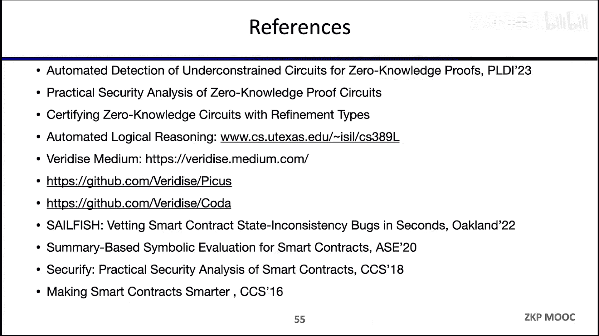

总而言之，形式化方法为保障软件（尤其是ZK电路这类安全关键系统）的健壮性提供了强大工具。通过结合轻量级的静态分析（用于快速发现常见问题）和深入的形式化验证（用于提供数学上的正确性证明），我们可以系统地提升ZK电路的安全性，为构建更可靠的Web3应用奠定基础。