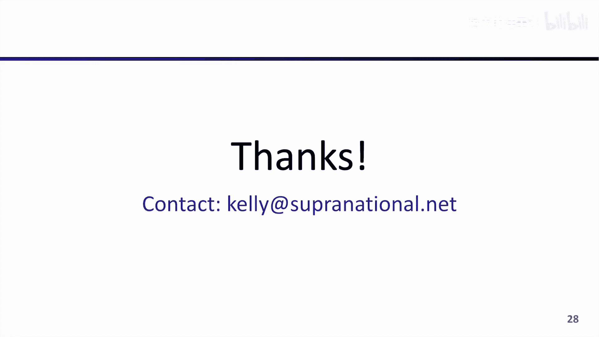

# 014：零知识证明的硬件加速 🚀

在本节课中，我们将要学习零知识证明的硬件加速。我们将探讨硬件加速的含义、当前行业现状以及未来的发展方向。

## 概述

硬件加速是指使用专用硬件来加速特定操作，使其运行更快或更高效。对于零知识证明而言，加速证明生成过程是解锁更复杂、新颖应用场景的关键。

---

## 什么是硬件加速？💡

硬件加速是利用专用硬件来加速某项操作，使其运行更快或更高效。它可能涉及优化函数和代码以利用现有硬件（通常称为商用现货硬件，COTS），也可能涉及为特定任务开发新的硬件。

商用现货硬件的例子包括CPU、GPU和FPGA。定制硬件通常被称为专用集成电路。

硬件加速与软件优化的不同之处在于，它针对特定的计算平台或硬件资源来设计和实现高效算法。

---

## 为什么需要加速零知识证明？⚡

核心原因是证明生成过程的开销非常高。虽然证明验证也很重要，但随着零知识证明的大规模部署，它将成为焦点，但目前证明生成的计算是瓶颈。

一个估计是，零知识证明生成的成本可能是原生执行计算的100万到1000万倍甚至更多。例如，为价值100万Gas的以太坊交易生成证明在CPU上可能需要约40分钟，而原生计算每秒可处理约1000万Gas。这表明证明生成的开销估计在25,000倍以上。

---

## 硬件加速的目标 🎯

硬件加速通常有以下几个目标，每个目标可能需要不同的设计或硬件平台：

*   **吞吐量**：在单位时间内执行尽可能多的操作。
*   **成本**：降低执行特定操作相关的资本和运营支出。
*   **延迟**：减少完成单个操作所需的时间。

---

## 需要加速的核心操作 🔧

不同的证明系统及其实现使用不同的密码学原语和软件库。然而，在各种证明系统中，有三个计算密集型操作反复出现：

以下是三个主要的计算密集型操作：

1.  **多标量乘法**
2.  **数论变换**
3.  **算术哈希**

---

### 多标量乘法

多标量乘法是一种计算多个标量乘法之和的算法。可以将其视为椭圆曲线点和标量的点积。

由于其性质，该操作非常容易并行化。每个标量乘法或一组标量乘法可以拆分并由不同的硬件引擎处理，最后再汇总。

对于大规模MSM，可以使用像Pippenger这样的算法将计算成本从与基数和标量数量成线性关系降低到大约O(n / log n)。

将此类高度并行化的操作从CPU等主机设备转移到GPU等更并行的架构上非常适合硬件加速。但需要注意，将数据移动到加速器上的通信带宽可能成为性能瓶颈。

---

### 数论变换

数论变换是一种用于将两个多项式相乘的算法。它类似于FFT或DFT，但独特之处在于它在有限域元素上操作。

常用的实现算法是Cooley-Tukey算法，它将多项式乘法的复杂度从O(n²)降低到O(n log n)。

与MSM类似，在主机外执行NTT时，数据也必须移动到加速器，通信带宽可能限制性能。然而，NTT的独特之处在于它不容易并行化，算法操作中每个元素需要与许多其他元素交互，这意味着问题不易分割，并且对内存要求很高。

---

### 算术哈希

在许多零知识证明用例中，需要证明者展示对哈希原像的知识，或利用哈希、默克尔根和默克尔包含路径来表示电路外存在的数据。

在零知识证明系统中，通常使用像Poseidon或Rescue Prime这样的算术哈希函数，而不是像SHA这样的传统哈希函数。选择它们是因为虽然在原生计算中成本更高，但在电路内部使用时效率更高。

高效实现此原语主要取决于模乘运算。

---

## 硬件资源需求评估 📊

上一节我们介绍了需要加速的核心操作，本节中我们来看看如何评估所需的硬件资源。

提高证明生成性能的第一步是理解你所使用的证明系统和用例的计算、内存和带宽成本。通过将MSM和NTT等高级操作分解为计算它们所需的模乘次数，通常可以在完成实现之前，估算证明系统在各种硬件平台上的性能。

为了确保估算准确，需要提前了解一些参数：

以下是评估硬件需求时需要考虑的关键参数：

*   **操作数量**：证明系统所需的每种操作的数量。
*   **操作规模**：不同用例会导致每个操作的规模不同，这会影响最高效的算法选择。
*   **域和曲线规模**：这有助于了解每个模算术运算的带宽和计算复杂度。
*   **其他因素**：例如曲线点的表示形式、模数是否具有支持更快约简的特殊结构等。

一旦确定了这些参数，就可以轻松计算执行证明或证明生成过程所需的模乘次数。有了这个数字，就可以将其与给定硬件平台的模乘性能进行比较，以得出性能估算或计算时间。

---

## 选择合适的硬件平台 🖥️

了解了需要执行的计算后，硬件加速的下一步是选择合适的工作硬件。鉴于这些工作负载主要由模乘驱动，我们应该寻找能够快速且廉价地执行大量乘法运算的硬件平台。

可以通过查看平台上的硬件乘法器数量、乘法器大小以及每个乘法器的执行速度和频率来评估给定硬件平台的估计性能。

例如，桌面CPU、服务器CPU、FPGA和GPU在乘法能力上存在显著差异。如果优化模乘吞吐量或每模乘资本成本，GPU可能是一个有吸引力的目标平台。

然而，这些分析仅突出了硬件平台的基本能力。为了实现改进的性能并达到硬件加速的目标，通常还必须考虑其他因素，例如实现理论性能的能力、部署难易度、运营成本、编程便利性等。

---

## 实现硬件加速的关键 🔑

在充分理解证明系统的计算需求并确定目标硬件平台后，成功的硬件加速有两个关键领域需要关注：

以下是实现高效硬件加速的两个关键步骤：

1.  **选择适合目标平台的硬件友好算法**：像GPU和FPGA这样的目标平台具有大量核心，最适合高度并行化的算法。同时，应选择旨在通过减少所需操作总数来降低总计算成本的算法。
2.  **创建高效的实现**：通常，算法可能需要重构以更好地匹配目标平台的硬件能力和设计。除了重构算法，通常还需要使用低级汇编原语以更充分地利用硬件资源并实现最大性能。

---

## 硬件加速的局限性与挑战 ⚠️

上一节我们讨论了实现加速的关键步骤，本节中我们来看看其中的挑战和局限。

在追求硬件加速时，需要记住乘法并不是唯一需要的资源。虽然这些高级原语主要由模乘主导，但通常还需要其他计算资源和算术单元。

此外，根据加速操作的大小和类型，非计算资源可能成为瓶颈。例如，像NTT这样的操作有时可能受内存访问速度的限制。对于问题规模较大的用例，有时所有必需的数据无法放入目标平台的内存中，从而导致性能下降。

对于连接到主机系统的加速器，通信带宽也可能成为瓶颈。目前，许多硬件加速的NTT实现（无论是GPU还是FPGA）都受限于主机和加速器之间移动数据的能力，而不是其计算资源。

这种数据移动成为瓶颈而非数据计算的趋势，不仅出现在NTT和零知识证明系统中，在整个大数据和高性能计算环境中也很普遍。对于高度并行的算法，计算通常比数据移动本身更快，因此硬件加速设计应寻求最小化数据移动。

使用主机外加速器的另一个考虑因素是数据移动到加速器并返回所需的时间。对于小问题，有时直接在主机上执行计算可能比在加速器上更高效。

硬件加速的最后一个陷阱是众所周知的阿姆达尔定律。该定律指出，通过优化系统的单个或多个部分所获得的整体性能改进，受限于被改进部分实际使用的时间比例。简单来说，对于零知识证明系统，如果MSM、NTT和算术哈希约占时间的65%，那么即使这些操作被完全消除，所能获得的最佳加速比也只有约3倍。考虑到证明生成相对于原生计算10万到100万倍的开销，显然优化不能止步于此。

---

## 现状与实例 🌟

为了总结今天对零知识证明硬件加速的介绍，我想分享一个硬件加速当前如何使用的真实例子。

过去几年，Filecoin一直是生产中最大（如果不是最大的）零知识证明系统之一，平均每天生成100万到500万个证明。Filecoin使用零知识证明进行复制证明，这是一种加密方式来证明你已创建了数据集的唯一副本。

Filecoin中使用的复制证明需要大约470GB的Poseidon哈希。如果在多核CPU系统上执行此哈希，大约需要100分钟。相比之下，Filecoin的GPU实现仅需在现代GPU上大约1分钟，性能提升了约100倍。

对于Filecoin的密码学证明部分，他们利用Groth16协议。在Filecoin网络上执行的每次复制证明，存储提供者会产生10个证明，每个证明约有1.3亿个约束，总计超过10亿个约束。仅创建这些证明所需的MSM就总计约45亿个点标量对。如果这些证明在多核CPU上计算，大约需要一小时完成。然而，相比之下，在GPU上可以在大约三分钟内完成，性能提升了约20倍。这个例子突显了硬件加速使雄心勃勃的零知识证明用例变得切实可行的能力。

---

## 未来方向 🚀

虽然过去几年零知识证明硬件加速取得了巨大进展，但仍有很大的改进空间。

以下是几个可能有助于使证明生成更快的领域：

*   **改进核心原语的算法**：例如MSM和NTT的新算法，或对现有算法的其他优化。
*   **全新的核心原语**：例如具有更低计算要求的新哈希函数。
*   **新的证明系统**：特别是简化的证明系统。简化的证明系统可以为硬件加速创造更多机会，例如具有更少不同操作、降低通信和内存要求，甚至消除当今存在的一些计算密集型操作。
*   **改进的实现**：包括完整的证明系统以及硬件加速原语的实现，目标既包括GPU和FPGA等商用现货硬件，也包括ASIC等定制硅。

---

## 总结

本节课中我们一起学习了零知识证明硬件加速的基础知识。我们探讨了硬件加速的定义、必要性、核心操作（MSM、NTT、算术哈希）、硬件资源评估方法、平台选择策略、实现关键以及面临的挑战。通过Filecoin的实际案例，我们看到了硬件加速带来的显著性能提升。最后，我们展望了未来可能的改进方向，包括算法优化、新原语、新证明系统以及更高效的实现。硬件加速是推动零知识证明走向更广泛应用的关键技术之一。