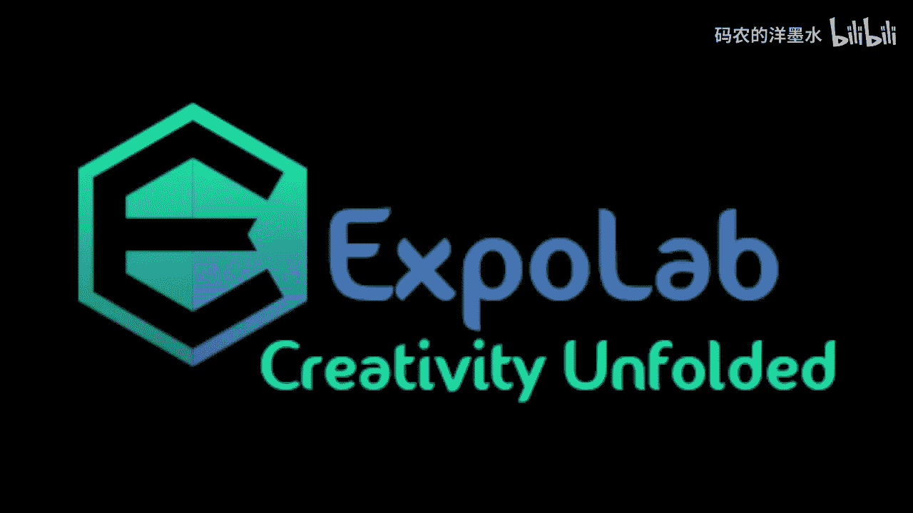
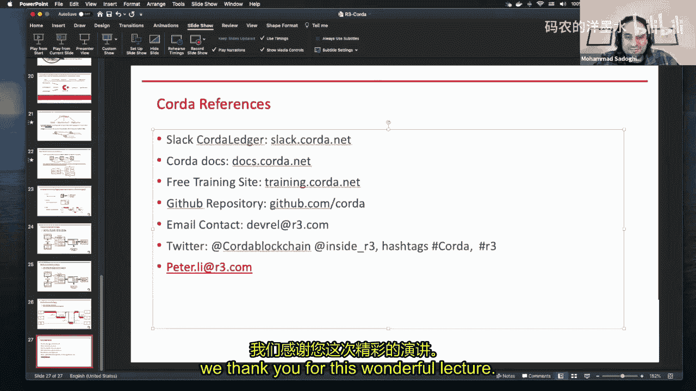
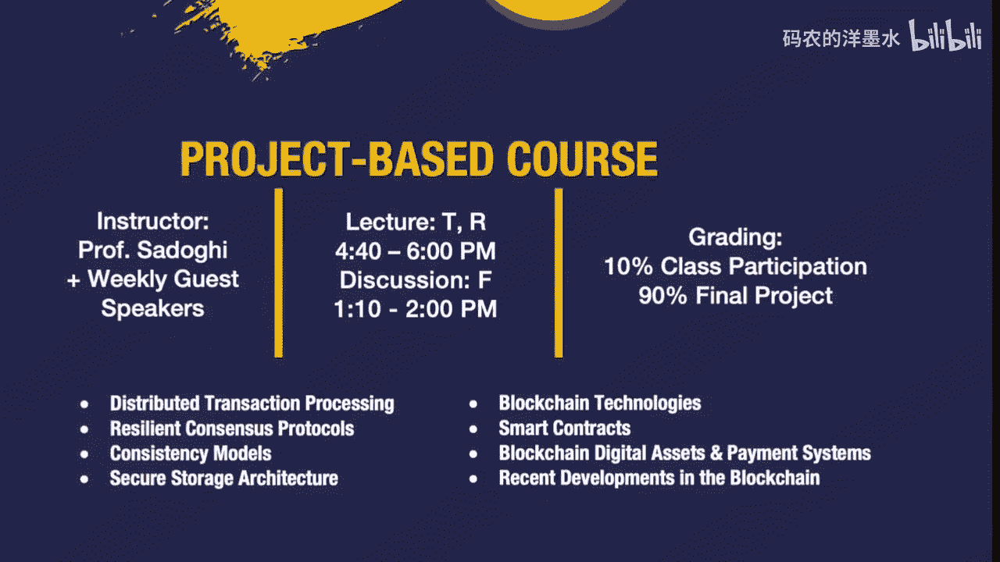

# 018：R3 Corda的核心原理 🧱

在本节课中，我们将学习R3 Corda区块链平台的核心原理。Corda是一个专为企业设计的分布式账本技术平台，它强调隐私性、互操作性和强身份验证。我们将从公司背景、平台愿景开始，逐步深入到其架构、共识机制、节点设计以及智能合约的工作原理。

## R3公司介绍与愿景 🏢

R3公司最初由8家纽约银行于2014年底组成的联盟发展而来。这些银行希望探索区块链技术如何能为其业务带来益处。到2015年底，该联盟已扩展至42家银行成员，并发布报告，将区块链定义为一种分布式账本技术，旨在建立互信和无摩擦的业务信息共享系统。

然而，银行等企业无法使用比特币或以太坊等公有网络，因为它们需要将信息广播给网络上的所有节点，这不符合其隐私和监管要求。因此，R3的使命转向研发，并于2016年第四季度开源了Corda平台。随后，为满足银行的高监管要求，R3在2018年7月推出了Corda企业版。如今，R3已与近400家金融机构合作。

R3发现了区块链的力量在于通过智能合约使机构能够直接交易，从而消除业务交易中成本高昂的摩擦。这正是Corda平台的使命和愿景。

## Corda平台概览 🚀

Corda提供两个主要产品：开源的Corda和企业版的Corda Enterprise。R3是一家平台公司，不开发具体应用，而是提供软件开发工具包。学生、公司或独立软件供应商等合作伙伴基于SDK开发应用，并部署在Corda网络上，从而构建生态系统。

Corda自称为第三代区块链平台。第一代是以比特币和以太坊为代表的公有链，缺乏强隐私性且网络效率较低。第二代是专注于隐私的联盟链，如Hyperledger Fabric，但它们容易在行业内形成数据孤岛，互操作性较差。

Corda作为第三代平台，旨在构建私密但可互操作的业务网络，支持可转移资产和实时交付与支付。其核心优势包括适用于所有行业、旨在构建跨行业生态系统，并专注于隐私和互操作性。

## Corda的核心优势与架构 🔑

Corda的核心优势体现在以下几个方面：

1.  **强身份**：Corda是一个私有许可网络，设有“守门人”（网络身份管理器）。所有客户在加入网络时都经过身份验证，确保网络参与者彼此知晓对方身份。
2.  **隐私性**：交易采用点对点通信，信息仅在相关方之间共享，不会全网广播。
3.  **双层共识机制**：
    *   **账本外共识**：基于强身份，参与者知道交易对手是谁，建立了直观的信任层。
    *   **账本上共识**：通过公证人服务实现。公证人可以部署不同的共识算法（如BFT、Raft）。
4.  **性能与可扩展性**：根据第三方报告，Corda是唯一能通过纳斯达克级别压力测试的平台。企业版网络每秒可处理数万笔交易。
5.  **全局互操作性**：
    *   **与遗留系统互操作**：Corda应用使用Kotlin/Java编写，运行在JVM上，可无缝与大量使用Java的后端系统集成。
    *   **跨应用互操作**：单个节点可部署多个Corda应用（称为CorDapp），这些应用可以相互通信，形成真正的生态系统。
6.  **开源与网络**：Corda平台是开源的。其全球网络（Corda Network）由Corda基金会运营，R3作为技术公司参与其中。

## 网络、节点与数据模型 🌐

在Corda网络中，每个节点看到的账本视图是不同的。交易信息仅在与该交易相关的节点之间共享和存储，这提供了隐私性。例如，Alice和Bob之间的交易，只有他们俩的节点会存储该交易数据，其他节点如Carl则看不到。

Corda节点抽象了更新账本的复杂性，负责消息传递、并发、存储、灾难恢复、节点发现和密钥管理等。用户编写智能合约（指令），节点负责收集签名、与公证人交互并最终更新账本。

Corda采用UTXO（未花费交易输出）模型。数据以“状态”的形式存储，并通过“交易”进行更新。数据永远不会从数据库中删除，只是被标记为“已消耗”，并由新的状态取代，从而保持了分布式账本技术的不可变性。

## 智能合约：状态、合约与流 📝

Corda智能合约包含三个核心组件：

1.  **状态**：数据的表现形式，可以被消耗、更新并最终存储到账本上。
2.  **合约**：定义了业务逻辑规则。它验证交易的有效性。例如，在借书场景中，合约会强制规定还书期限。如果规则未满足，合约将拒绝该交易更新账本。
3.  **流**：执行业务逻辑的工作流程。通常包含发起方和响应方。

交易是状态更新的载体，包含输入状态、输出状态和命令。合约会验证交易是否符合所有规则。

## 交易流程与公证人作用 🔄

一个典型的交易流程如下：

1.  **发起提案**：发起方检查并签署交易提案。
2.  **交换签名**：发起方将部分签名的交易发送给响应方。响应方检查并签署后返回。
3.  **公证验证**：发起方收集所有签名后，将交易发送给公证人进行双重花费检查。公证人维护所有已消耗交易输入的哈希列表，确保新交易的输入未被使用过。
4.  **账本更新**：公证人验证通过后，交易最终被记录到相关各方的账本上。

公证人主要提供三项功能：防止双重花费、时间戳和验证。在高度信任的环境中，可能使用简单的共识机制甚至无需共识；在需要更高信任度的场景下，可以组成公证人池并部署BFT等复杂共识算法。

## 总结 📚

本节课我们一起学习了R3 Corda平台的核心原理。我们了解到Corda是一个为企业设计的第三代区块链平台，它通过强身份验证、点对点隐私通信和可插拔的共识机制，解决了公有链的隐私和效率问题。其UTXO数据模型、由状态、合约和流构成的智能合约体系，以及独特的公证人机制，共同支撑起一个安全、高效且可互操作的分布式业务网络。Corda的设计旨在连接不同行业，构建一个无摩擦的全球商业生态系统。