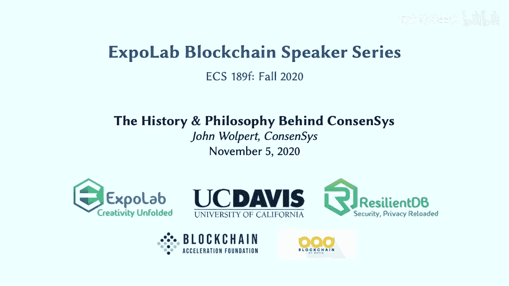
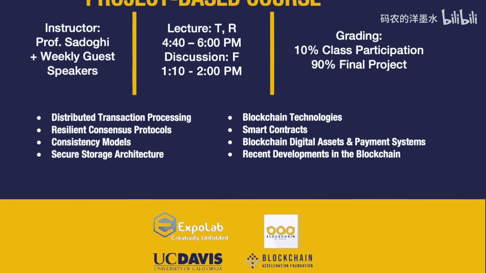

# 019：ConsenSys的发展历程与核心理念

在本节课中，我们将跟随John Wolpert的分享，回顾他从IBM区块链到ConsenSys的旅程，并深入探讨他对企业级区块链应用的批判性思考以及ConsenSys提出的“基线协议”这一新范式。我们将学习到区块链技术在企业环境中的实际挑战与可能的解决方案。

今天我们的第二位演讲嘉宾是John Wolpert。他拥有辉煌的职业生涯，在过去30年里深耕于企业界和创业领域。目前，他是ConsenSys的高级管理人员。此前，他实际上是IBM区块链的联合创始成员，特别是负责了Hyperledger Fabric本身的开源工作。今天能邀请到John与我们交流，我们深感荣幸。那么，闲话少说，有请John开始。

谢谢。很高兴能（虽然是虚拟地）来到戴维斯。我过去在那里待过很长时间。我的大部分职业生涯是在伯克利、旧金山或南湾的库珀蒂诺度过的。后来我搬离过好几次，在澳大利亚悉尼、德国、纽约和其他地方住过一段时间。但现在我们住在北卡罗来纳州的罗利。当我在加州旧金山的IBM工作时，我住在伯克利，那时我接到了我最喜欢的老上司Jerry Cuomo的电话，他是IBM区块链的创始人之一。他说：“嘿，现在外面有个叫区块链的东西。” 实际上他说：“嘿，刘易斯，我是克拉克，你想做什么？” 他说：“嗯，现在有这个区块链的东西，我们去搞清楚它吧。” 我说：“好吧，给我一支船队，我去调查一下。” 他说：“嗯，我有两支步枪，一条狗和一艘独木舟。” 于是我们开始研究区块链。我们很幸运，我的意思是，它就从那里爆炸式地发展起来了。CEO开始打电话询问，很快我们就发现，我们不再是走在通往未知的小径上，而是在建立先驱城市之类的东西。这最终促成了IBM区块链和Hyperledger Fabric。从那里开始，故事变得有趣起来。

接下来，我将谈谈从2015年我们在商业领域对区块链的认知到现在的历程。当然，你们知道，区块链的历史比那更久远。事实上，区块链技术的基础相当古老，我相信你们都知道。David Chaum会告诉你他在80年代和90年代就发明了它，他某种程度上是对的，比如数字现金。你们还记得数字现金吗？实际上我听说过。你指出的另一件有趣的事是，我从2012年到2016年在IBM TJ Watson研究中心工作。一开始有很多关于人工智能的炒作，但在我离开IBM之前，也就是2015年，区块链和Hyperledger确实成为了头号话题。你的老上司也是我的老上司，他现在是CEO，是的，Arvind Krishna。最初是John Kelly，我开始时是跟着John Kelly，然后Arvind来了。嗯，我离开时Arvind还是副总裁和研究主管。你还记得John Kelly之前是谁吗？不，我不记得了。哦，是的，是的，天哪，保罗姓什么来着，这有点尴尬。他很酷，留着马尾辫。是的，我很喜欢他。抱歉扯远了，但没错，TJ Watson是周围最酷的地方之一，仅次于Almaden研究中心，而Almaden又仅次于Hursley，对吧？Hursley研究实验室对IBM来说有点像霍格沃茨。在英国南部。嗯，我真的很喜欢在IBM工作，我三次加入IBM，创办了三家公司和一个非营利组织。离开IBM又回来，离开又回来。最后一次，我们正在构建IBM区块链和Hyperledger Fabric。其背后的理念是，加密货币和作为应用的区块链并不是企业领域的游戏，我们不认为任何公司的财务部门或治理部门会愿意涉足加密货币，至少在2015年是这样。但作为分布式系统领域的人，我们看到了比特币背后基础设施中区块链基础原语的优势和方法。于是我们四处奔走，说“区块链不是比特币”，然后人们、高管和大公司开始重复这句话，突然间至少谈论区块链变得安全了。然后我们说，哦，那我们为什么不创建一个不需要挖矿或加密货币的区块链呢？它其实不关乎加密货币，更关乎数据。接着我们投入了大量资金，构建了一个我会称之为过于复杂、在数据隔离方面存在实际问题的数据库。

我自己的“孩子”，我想我是在说它丑，Hyperledger Fabric和其他企业区块链本质上是**共享数据库**。这没什么错，我喜欢共享数据库，我也喜欢Git。这是一种拥有共享数据的好方法。但事实证明，这些也存在着有趣的问题。在我继续之前，让我问一下，了解一下在座各位的情况。我没有被详细告知谁在线上，背景是什么。你能给我介绍一下吗？我们有两门课，一门是面向高年级本科生的分布式账本导论课。所以在过去的一个半月里，你们被介绍了无需许可的比特币、以太坊。实际上，前几天Mohan做了一个讲座，上周四的上一节课，来自Zurich的Marco，也是Hyperledger的主要成员之一，他也深入概述了Hyperledger。所以我想从Hyperledger的角度，大家都有很好的背景。另一半学生来自研究生区块链课程，他们也一直在阅读从PBFT到比特币的核心论文。他们对共识协议有更广泛的理解，可能上节课我们看了HotStuff，所以他们对核心理论也相当了解。这是一个很好的群体，我想现在这个时候大家都真正理解了这些材料。太好了，因为我要在房间里扔一颗炸弹，摧毁你们一直在学的一切。这至少应该会很有趣，对吧？绝对是的。好的。那么这里的每个人都是技术背景？是的。是的，每个人都是技术背景，好的，很酷。每个人都对分布式系统感兴趣吗？至少就他们正在修的课程而言，他们都在学习分布式系统，但在这门课之后是否还会继续就不得而知了，但现在是的，每个人都在学分布式系统。我告诉你们，你们来对地方了，因为分布式系统，我的意思是，有很多计算机领域的人并不理解分布式系统。如果你不理解分布式系统，你就不理解事物的发展方向。这很难，真的很难。而且，一旦你以为自己搞懂了，它又会变得很难。分布式系统，我想一位著名的分布式系统专家说过，分布式系统的第一法则是，如果你能避免使用分布式系统，那就避免。但没错，所以我们要讨论这个。Hyperledger Fabric，我是最初提出并塑造它的六个人之一。还有其他很棒的人，比如Gary Singh和Ben N.（他现在在State Street），Gary在加密学方面也做了很棒的工作，还有Yellen和其他一些人，当然还有Jerry Cuomo和其他人。听起来你和苏黎世的加密团队交流过，那是一个很棒的密码学团队。那里有很棒的工作。但我们在构建Fabric的整个过程中，著名的Mark Andreessen（构建了Mosaic的著名人物，现在是风投）一直在嘲笑我们构建私有区块链。我过去对此有点紧张。我想，嗯，他比我聪明，那我错过了什么？我过去常把这称为Andreessen的报复。我的意思是，他的观点是，如果你不做公共的、无需许可的区块链，那么你实际上只是在构建数据库，你应该直接使用数据库。事实证明他是对的。你可以使用分布式数据库，比如Cloudant（一个类似Cassandra的变体）。如果你想防止人们篡改它，或者想确保没有人更改了那个账本或数据库中被接受的历史记录，定期对状态进行哈希处理。将哈希值发布到《纽约时报》的分类广告版，你就有了防篡改的证明。或者，如果你想更进一步，想构建像IBM著名地构建的那些东西（在我任内构建了两件重要的事情），其中一个以前为我工作的人现在负责这个项目，就是与马士基合作的TradeLens项目。不，是提单和类似的东西。我不熟悉。然后是Food Trust，沃尔玛的那个项目，我敢打赌他们提到过。是的，Food Trust，我甚至要求覆盖Food Trust的内容。是的，有一个和我同姓的人，Bob Wolpert。哦，TradeLens是Everledger的吗？不，那是Everledger，那是Le... 是的，是的。那是完全不同的一套把戏。但在Hyperledger和Fabric以及私有区块链的早期，真正的动机是，比如沃尔玛打电话给你说：“你想加入我们的区块链吗？” 你说：“什么是区块链？” 他们说：“嗯，别担心那个，但我们要让你在拉斯维加斯3万人面前，和IBM的CEO一起上台，而且，如果你想继续和我们做生意，就加入我们的区块链。” 所以，当然，很多公司不得不加入那个沃尔玛区块链。但如果你仔细想想，如果事情这样发展，你其实并不需要区块链。我们真正做的（我写过一篇文章，你可能还会读到，叫做《在区块链上保持愚蠢的价值》）是，区块链这个词解锁了很多高管的钱包，让他们去探索那些我们30年前就可以做的项目，但如果你称之为数据库，他们就不会资助。事实上，我与银行和其他公司有过不止几次坦诚的对话，他们说：“你知道，我就像在问，你们为什么用区块链做这个？” 他们回答：“因为我们一直想做这个项目，但老板除非它叫区块链，否则不会资助。” 所以有很多这样的把戏。归根结底，在一个超互联的世界里更紧密地合作，让你的系统和我的系统之间的差距更小，这是个好主意。如果我们在同一条供应链上，能够做某些事情是好的。但我认为大多数人没有抓住要点。我们需要的是良好的数据卫生，我们需要良好的机器人流程自动化之类的东西，以减少数据输入等方面的错误。每当我们出去问“你们为什么用区块链”时，他们总是说“我们需要更好的数据，我们需要这个那个”，我就想，所有这些都只是把数据库工作做得更好，对吧？这其实不关区块链的事，你们在分散自己的注意力。但人类就是这样。

所以我们赚了很多钱来构建这些花哨、极其复杂的共享数据库。有一天我醒来，心想，等等。假设你是一家公司，有一堆内部私有信息，比如你的供应信息，假设你是一个种植者。你拥有所有这些你真正不想让竞争对手知道的数据。你不想这些数据被泄露，不想它们公开。这是大多数CEO在数据安全方面担心的问题，不是篡改，而是泄露，是数据被公开。现在你要把这些数据放到一个共享的新威胁面上。假设有100家公司都有一个节点。那就是100家公司，其中那个最愚蠢的管理员可能会被黑客攻击，给所有人带来糟糕的一天。这听起来是个很糟糕的主意，不是吗？我会回答，因为我们在Zoom上，实际上没人会回答。是的，这是个糟糕的主意。所以，你知道，一旦皇帝的新装被揭穿，我开始想，等等，这不是个好主意，区块链是糟糕的数据库。主要是因为它们在隔离方面天生就很差。对于任何普通数据库，你都有良好的访问控制，对吧？你可以说这条记录在这个条件下可被这个人访问，而不可被那个人访问。你可以在公司之间做到这一点。你可以说，嗯，这家公司可以访问这个表，但不能访问那个表。借助云的SaaS技术，你可以建立一个这样的系统，你可以组建一个联盟，你可以雇佣一个管理员（所有这些联盟无论如何都会这样做，即使是区块链）。你可以说，好吧。嗯，这样吧，我们100家都在这里，我们担心我们设立的管理员，所以我们用秘密共享，我们把根密钥分片共享，这样我们中60%的人必须同时使用密钥才能更改系统。现在你几乎拥有了区块链的所有好处，而没有任何区块链，你可以使用任何你喜欢的数据库，比如MongoDB。而且你有了一个更稳定、安全、简单、不那么复杂的系统，而复杂性是安全性的敌人。Hyperledger Fabric极其复杂，这让我担心。它之所以复杂，是因为我们试图使用一种结构。我们试图使用一种倾向于破坏隔离性的结构，这就是它的作用，它不喜欢隔离，这不是它使用的工具，它不是为这个设计的工具。然后我们试图让这个工具去做隔离。于是你有了所有这些Fabric通道和一堆麻烦事。结果变成了一个阶乘级的噩梦，任何实际的实现都因为必须管理所有这些彼此不通信的通道而变得复杂。所以，这就是我对我构建的东西的抨击，然后我转投了ConsenSys。

这真的很棒，也让你对周四Mohan的讲座有了一点不同的视角。他也有完全相反的观点，这很好，我喜欢这种有争议的课堂。唯一真实的东西是许可设置。把我们都放在一个房间里，我可以和他辩论。我肯定，我肯定。但我也认为，我们能有这么好的见解，分道扬镳也是好的。但让我们也许把这个问题拆开来看。也许再进一步说，什么是许可区块链？许可区块链的核心原语是什么？我的意思是，如果以太坊要尝试回答这个问题，那就是，在传统设置中，你有一个账本。我的意思是，这个账本可以追溯到银行出现之前。在某个时候，你信任某人记下谁付钱给谁，或者谁欠谁，你必须保证那个账本的安全。所以你信任你镇上、你社区里一个值得信赖的人，你去找那个会计，让他记录所有的交易。这就是账本。在数字时代，嗯，那个账本由摩根大通持有，花旗银行持有，所有大银行都持有。但还有另一件事，所有这些银行都做，而且一千年前那个人可能也做了，那就是他可能还有一个保险箱。他也把实际的钱（你给他的，或者他需要保管的，或者黄金）放在保险箱里。再看银行，他们也有保险箱，至少到20世纪70年代。我的意思是，只要货币有黄金支持，保险箱里就有东西。今天我不确定保险箱里是否还有东西，我想可能什么都没有了。不，不，93%已经是数字化的了，对吧？是的，所以背后没什么东西了。但再次，我认为比特币所做的是，这仍然是一个迷人的想法，它说，好吧，我要以一种民主的方式来维护这个账本。每个人都拿出自己的账本，写下我们认为的事实交易。如果每个人都同意那个写在足够多副本上的事实交易，那么我们就说，好吧，那是确定的。如果我们想讨论基础知识，我们得在这里待一整晚。我相信你们正在学习基础知识。我的意思是，Paxos、拜占庭容错、PBFT、轮询制，我帮忙补充了一点。当然，还有工作量证明、权益证明等等，对吧？这些都是很好的论点。但比特币并不是这个主题历史的终结，而是历史的开始。所以以太坊出现了，现在还有更多，以太坊2.0即将在12月推出第一阶段。如果我再多说两句，我们有了这个账本，现在每个人都民主地持有这个账本。但同样，这个账本里发生了一些令人兴奋的事情。那个账本不仅成为了我们存放钱的保险库，而且账本本身嵌入了货币，所以不需要单独有一个保险库。但另一件事是，我们也将要彼此交易的合同条款，那些协议的条件，不仅数据在那里，资产在那里，而且合同的条款也嵌入其中。所以对我来说，作为一个抽象模型，我认为这相当令人兴奋。现在，如果你要过渡到许可设置，你肯定没有资产的概念，至少资产被创造的方式没有。你可以，对吧？没有理由你不能。我的意思是，我们今天就在做，对吧？你银行里的一个数据库条目就被认为是一种资产。而且，你知道，所以它是一段数据，它是一种资产，因为我们同意它是。所以它不一定非要在区块链上才能成为资产。或者不一定，但没错，所以不仅仅是资产，而是一种资产生成方式。所以你需要一种控制货币如何生成和印刷的方式，本质上你需要建立一个经济体系。如果你能做到这一点，你可以在Hyperledger上做到，你只需要让每个人都同意它是合法的。你必须让每个人都同意，当然可以。我的意思是，我们现在就有，DB2和MQ以及其他东西运行着银行系统，我们已经同意那些东西是合法的，或者传统数据库当然也可以。所以让我们也承认这一点。那么，在那个模型下，为什么任何区块链不只是另一个分布式系统呢？分布式系统，分布式系统。你说了一些我认为非常有趣的话，关于民主持有。我会更进一步说，比特币不仅仅是实现了民主容错或拜占庭容错。它所做的，而且正如我所说，在90年代甚至80年代，就有一些方案被政府迅速关闭，比如数字现金，它们试图创建数字货币。这有很长的历史。问题是你可以关闭它们，有点像Napster，对吧？你可以找到运行服务器的人并逮捕他。这确实发生过。比特币做了什么？它说它不仅让民主持有成为可能，还让它变得不可阻挡。你再也找不到所有的服务器了。它们无处不在，你无法阻止它们。你必须关闭整个互联网。是的，绝对意味着激进的去中心化。但有一个问题，所以我们总是说，或者总是说这是一种新的计算范式，是去中心化和民主的，但有一个小小的警告，至少当我们观察比特币中发生的事情时，权力真正掌握在四到五个人手中。是的，这里没有什么新东西。新的是，一群人意图以某种方式使用我们已经拥有的东西。这才是激进的，你知道，我有一支铅笔，我可以为它申请专利，我可以用它写一些无聊的东西，我可以用它写一些有趣的东西，或者我可以把它戳进你的眼睛，现在它就成了颠覆性技术。比特币所做的就是，他们只是把传统的分布式系统概念和一些新颖的东西结合起来，在2008年（做这件事的一个有趣年份）以这样的方式组合起来。他们说，我们要把这个戳进你的眼睛，他们变得具有颠覆性。但有趣的是它的应用、它的使用方式、它的部署方式。然后像我这样的人出现了，说，嘿，让我们用它做个数据库。我认为那有点愚蠢的错误，我认为很多那样的东西会消失。就像90年代末外部网作为一种东西逐渐消失一样。

我真的很喜欢你的见解，但我仍然试图理解。你指出的所有那些有趣、令人兴奋但不一定是新发现的东西，也许是将现有的旧技术打包成一种更可用的形式。但所有这些似乎也适用于Hyperledger。但你似乎站在一边，认为Hyperledger的发展方向不是正确的方向。嗯，DB2，你知道，我是说，你仍然可以卖DB2，你仍然可以卖Oracle，共享数据库是一回事，它有一些价值，但不要混淆它们是什么，它们是共享数据库。你需要理解，在共享数据库中，其他不为你工作的人拥有一个完整的节点。即使你在那个数据库上加密数据，你也有其他不为你工作的人，现在有能力没有信息隔离，知道那上面的所有东西。我认为，当我们意识到这一点并清醒过来时，你会看到公司说，等等，我真的想把所有数据都放在这个东西上吗？不，我真的不想。看看Food Trust会发生什么。Bob Wolpert（和我同姓，没有亲戚关系）不久前对我说，嗯，我们喜欢Hyperledger，因为它透明。我说，真的吗？你真的想要透明？你在处理国家的食品信息，你和国土安全部合作。你真的认为如果每个人都知道所有流通的信息，他们会高兴吗？不，他们不会。他们不想要透明。他们希望合适的人在合适的时间、合适的条件下知道他们需要知道的东西。那是隔离。你需要良好的访问控制列表。我们几十年前就有了这些，贯穿我的大部分职业生涯。是的，政策、法规。我的意思是，它是封闭数据，只有选定的个人需要访问。是的，但区块链不喜欢那样，区块链希望每个人都拥有它。每个人。如果你说，嗯，我们要把它限制在只有一些有节点的朋友。嗯，那些朋友不会永远是朋友，朋友往往会变成竞争对手。那么，当你的供应链中的交易对手突然变成了亚马逊，并且他们开始与你竞争时，你仍然希望他们拥有所有那些数据吗？可能到那时就太晚了，对吧？所以，你知道，在某种程度上，我们用“区块链”这个词在企业中欺骗了自己去做更开放的事情，这是件好事。但我认为，我们也必须欺骗自己，但这样做的时候，很多“尖头发”经理戴上了眼罩，没有意识到他们正在陷入什么境地。没有首席安全官，没有安全官员会允许敏感的内部信息（任何公司80-90%的数据要么是个人身份信息，要么是在某些条件下敏感的，你不想让竞争对手知道你的发票信息）被放上去。

说到这一点，我的意思是，可能即使在今天，人们甚至不喜欢将数据部署到云上他们自己的实例中，那些在开放空间中、没有隔离的实例。我们花了好几年才克服这一点，即使现在。但我认为，在这一点上，云之所以扭转局面，是因为意识到当中央情报局选择亚马逊，因为它比他们自己能运行的更安全时，你开始想，好吧，也许他们擅长那个，也许他们正在做那个，而且他们可能有更多资源来做好安全，比我强。所以，我认为这就是云扭转局面的原因。但我有个问题。你说你预计对它的兴趣会下降，你指的是区块链吗？你在暗示什么？很多对私有许可联盟链的兴趣，比如Food Trust和TradeLens之类的东西。它们会有它们的辉煌时期，但归根结底，几十年来一直有各种联盟。它们很难维持，很脆弱，而且往往充满问题，因为公司里充满了人类，他们往往会改变观点，突然变得不像以前那么友好了。你可以在区块链上运行一个联盟。这没问题，但它并不具有变革性。你只是部署了一个非常复杂的数据库来做同样的事情，而你本可以部署一个简单的数据库来做。

所以你认为对它的兴趣不可持续，是因为缺乏隔离性，而且正如你所说，人们通常不想把信息放在那里，即使……等等，等等，等到第一次有联盟区块链被黑客攻击，某个人的节点被黑。顺便说一下，对此的答案一直是，哦，让我们把它们都放在IBM云上的大型机上，让IBM运行所有节点。我就想，嗯，如果你能BaaS（区块链即服务），你可以SaaS（软件即服务）。如果IBM运行所有节点，那么你真正实现的是，IBM向你收取的费用是他们为同一个SaaS系统收取费用的好几倍。但现在他们可以向每个对等节点、每个节点收费，而他们本可以将其作为云实现来正确运行。如果他们运行所有节点，谁在乎呢？我实际上和一家公司合作过，这是在以太坊上，他们说，哦，是的，这是一家贸易金融公司，他们有一堆银行，他们说，是的，我们有一个区块链解决方案。我说，真的吗？嗯，你们所有的节点都在哪里？哦，它们在我们的服务器上。我说，嗯，那太好了，你们的任何银行想要自己的节点吗？他们说，嗯，是的，他们都想。我说，嗯，那进展如何？他们说，嗯，问题是没有一家银行希望其他任何银行拥有节点。你看到问题了吧。是的。哎呀，问题，检查一下。所以。

我大致理解你提出的大部分观点，我认为它们非常有趣。但也许只是一个简单的澄清问题。你提出的这些问题，它们是否同样适用于无需许可的以太坊或比特币？好的，这让我们进入了我称之为皇帝新装问题的另一面。很高兴你问了这个问题，这让我们进入了我称之为皇帝新装问题的另一面。公共区块链有一个不同的问题。公共区块链是，我的意思是，所有区块链都是数字裸体殖民地。它们不喜欢，它们喜欢透明。你放在上面的任何东西，根据定义，所有节点都必须以某种方式运行，即使你有零知识证明。我的意思是，Zcash可能是最接近真正不透明的，因为基本上那个账本只是说某人给了某人东西，某人给了某人东西，永远都是一样的，对吧？零知识集有效地使每笔交易看起来都像其他交易，所以你不会丢失信息，你无法应用人工智能或机器学习算法来挖掘分类器并查看模式，没有模式可看。所以这相当安全。但在以太坊，你知道，你可以对各种智能合约和各种活动进行形态分析，甚至代币分布，你可以挖掘元数据或追踪数据或你可能不想泄露给其他人的信息。比如，如果我有一个非常好的人工智能，我可以挖掘模式，然后说，我现在不打算买入那个市场，因为上面有太多活动，虽然我不知道具体是什么活动，但我知道比昨天多。所以你可以设置这类游戏，你可能在泄露你不想泄露的信息。当我们与DTCC（美国股票系统中非常重要的机构）在Fabric上合作时，他们实际上让我们把它扭成一团，试图让除了他们之外没有人拥有实际数据，因为股票交易所就是这样运作的。你不应该让每个人都获得所有数据，你可以做所有这些抢先交易。所以，嗯，这也是Fabric如此复杂的部分原因，因为，你知道，他们让我们使用区块链模式来做一些用数据库就能更好服务的事情。

公共区块链是公共海滩上的数字裸体殖民地。我的意思是，至少私有区块链是私人海滩上的裸体殖民地，对吧？至少你知道。但在公共区块链上，你知道，每个人总是看到一切，任何人都可以访问账本和所有事件。你可以开始挖掘所有这些以寻找各种模式。那么，作为一家企业，我真的想在上面运行任何交易吗？不。所以这听起来很黯淡，对吧？区块链在两个方向上都显得愚蠢，我设置了一个可怕的场景。每个人都很沮丧。好吧，这是我今晚最好的教训。几年前，我曾在一家公司工作，我们有一句改变了我一生的话，那就是“但是……但是……”。这是一个“但是”，它行不通。“但是”如果……。如果你在开会，尤其是在优秀的科学家和工程师之间，你知道，你在进行头脑风暴，不是说没有坏主意，坏主意多的是。但如果你要指出别人的主意是坏主意，要有尊重的态度说：“但是，如果……，它就能行。”即使你能做的最好的事是某种疯狂的事。我确实有过一次改变经历。我们在一个房间里，有人说，嗯，但是我说，嗯，“但是……但是……”，你刚刚说那是另一个人的坏主意。说什么“但是”？他说，嗯，但是如果重力不同，它就是个好主意。这引发了一系列很棒的想法，最终导致了一项新专利。我们没有改变重力，但它引发了新的思考。所以，“但是……但是……”。但是区块链是企业无法使用的数字裸体殖民地，但是，它们看起来像一条消息总线。它们看起来像是一个很好的中间件。我不能把数据放在上面，不能放任何我不想让别人知道的任何数据。但是，如果我有一个SAP系统，我有一个像采购订单这样的记录。而你公司里有一个Oracle系统。我发送给你那个采购订单。我需要一个系统集成总线作为共同的参考框架，来告诉我们，你数据库中的记录确实可验证地与我数据库中的记录相同。而且我们不能否认，你不能说你没收到备忘录，我也不能说那个采购订单多了一个零，是你欠我的。我们知道我们可验证地拥有完全相同的信息。我们真正想要的是一台机器，它尽可能地抵抗篡改、锁定和被一群人控制。那就是公共区块链，实际上只有两个，比特币和以太坊。你想要极度分布式的大型网络，它们被篡改的可能性趋近于零。如果你拥有那个，并且它始终在线，不会关闭，也不能把你锁在外面。那对我来说看起来像一个很好的、通用的、始终在线的消息集成总线。它是中间件。当我们在ConsenSys意识到这一点时，我们开始与安永、微软等公司合作。我们提出了基线协议。我不知道你们能不能看到，但我有我的“魔法巴士”。所以我们一直从这个角度称公共区块链为“魔法巴士”。这就是我认为对企业可行的区块链方法。那就是，你在传统记录系统中有记录，我在传统记录系统中有记录。我们不会把那些数据放在任何其他威胁面上。我们会把那些数据留在我们各自的数据库中。但然后我们会使用有效的巧妙证明和零知识电路、消息传递、屏蔽合约和默克尔树，以这样一种方式，我们可以逐条记录地存放一致性证明，所以那是原子性的、隔离的，只是一条记录。如果我不必……嗯，主要你的系统挖掘我的，或者我的挖掘你的，或者建立MQ或一些新的共同参考框架，那将花费我们一百万美金来为每个新的合作伙伴关系建立，然后还得运行它，然后谁来运行它？不，我们可以直接使用这个始终在线的东西，叫做主网或公共区块链。我认为有趣的是，它成为了价值互联网，成为了始终在线的互联网，只为了两件非常无聊的事情：哈希管理和排序。所以，我的意思是，我不知道有多少区块链爱好者会高兴地认为他们美妙、令人兴奋的区块链技术是，是的，世界的哈希管理器和排序服务。但这正是我要告诉你们的。这听起来很无聊，但它是变革性的，因为数十亿、数十亿、数十亿美元损失在我的价值十亿的记录系统和你的价值十亿的记录系统之间的争议和错误中，而今天这些系统或多或少只能告诉你或我认为我们知道什么，而不是我们的交易对手知道什么。因此，以巧妙的方式使用零知识，基线协议（现在是OASIS标准，并且正在由成千上万的人、数百家公司——现在很难统计，有这么多——在OASIS开放标准机构中构建为标准协议），使用公共区块链的标准技术，以一种安全官员和其他CSO、CTO们可以说，哦，是的，不，这说得通。这不是安全风险。我没有把任何信息放在区块链上。我只是以没人能知道我们在做什么的方式使用区块链，以确保我可以确信，如果这条记录被基线化了，那么我知道所有需要拥有相同信息的交易对手都拥有它，并且他们处理了它，注意到了它，并正确存储了它。而且我们都有相同的信息。如果任何一方不同步，我们知道谁错了。有点像我们今年在经历了五年关于区块链的夸张宣传后常说的：无聊是新的兴奋。所以基线化是一种相当无聊的思考区块链的方式。但它有效。它有用。而且我们可以构建它，它已经可以部署了。

我有一个关于公共区块链和基线协议的问题。我意识到它们模型中的一个关键点是需要激励，因为它们允许任何人参与。如果缺乏激励，无论是工作量证明、权益证明还是任何协议，整个想法是参与者会得到某种激励，这促使他们正确行事，因为矿工或权益持有者是理性的，他们会试图创造自己的利润。那么，在共识中，你是如何避免或是否需要激励？在基线协议中，好的，所以你说的完全正确，所有形式的共识都有权衡，因为我相信你们都是优秀的计算机科学专业学生，你们知道计算机科学中的一切都是权衡。你知道，这就像打地鼠，你解决一个问题，就会失去另一个。总是这样，而且永远不会停止，因为物理定律就是那样。所以这就是艺术，艺术形式就是做出有趣的权衡。我认为在某种程度上，有时即使是真正聪明的计算机科学人员，区块链狂热也让我们忘记了这一点。我们就像，哦，它给了我们一切。我们得到了黄金三角。不，不，不，不是那样的。你越接近……嗯，你的延迟，你知道，活性、安全性等等，你知道，就是这样。所以我对权益证明还是工作量证明哪个是正确的方式不那么感兴趣。我感兴趣的是，如果我在做交易，如果我在公共区块链上进行金融交易，那么所有这些问题都会重新出现。我不是那样使用它。基线不在乎。它只是把它用作一个公告板，我只是在那里放键值对。没错，我不做任何其他事情，只是用它来排序和哈希管理。我可以在那个区块链上放一个哈希或一个默克尔树中的证明，证明这些数据与你的数据相同。然后我可以用它来说，好吧，我要强制执行一些新的工作步骤，知道一些转换或一些新增记录遵循先前记录的规则。否则，它的证明就不能被放入那个默克尔树。这就是它变得有趣的地方，因为你可以用它来进行流程控制。你可以说，嗯，我希望所有这些采购订单按顺序到达，不重叠，因为如果重叠，我会重复计算折扣或类似的东西，所以我需要强制执行针对服务协议的所有采购订单按顺序到达，并从同一基数计算。我可以编写那个规则，并可以使用公共区块链作为排序器来强制执行。作为那个的仲裁者。所有这些都没有任何金融交易。而且实际上没有任何信息被放上去。在零知识下，我不知道你们对零知识证明了解多少，但零知识Zk-SNARK通常被描述为，我要向你证明我有一个秘密的某个特征，而不告诉你秘密。我们以稍微不同的方式使用零知识，我们说我们要证明我们有一个共享的秘密。我们要用这台机器来告诉我们我们有相同的秘密，而不告诉那台机器任何关于我们秘密的事情。而那台机器就是公共区块链。现在，那台机器是使用权益证明还是工作量证明，对于那个用例来说是次要的，只要它有效，它不会消耗地球的能源成本，并且能防止篡改。所以以太坊2.0将转向权益证明。我是以太坊的支持者，我会说我是Vitalik和他的团队的忠实粉丝。他们异常成熟，他们处理这些事情的方式，他们没有仓促行事。他们犯了一些错误，你知道，我的意思是，我不认为以太坊是世界计算机。地球上没有一台重写机器可以同时作为每个应用的后端，这根本行不通。永远不会。你可以有一个极度分片的Cassandra数据库，没有共识算法，它仍然无法处理每个人的读写。仅仅是物理定律就打破了这个想法。这对你们来说有道理吗？我看到一些人在点头，对吧？所以那从来不是，也许它不是世界计算机，也许是世界的排序和哈希管理的状态机。我可以将其扩展到这样的水平：我们估计全球公司之间每天大约有100亿个企业对企业工作流事件。所以如果你假设每一个都需要一个基线证明，那就是每天100亿个证明。那是每秒1700个证明。这比我们今天用以太坊能做的多了四个零。我可以通过批处理获得其中两个零。而以太坊2.0将在以太坊的下一次迭代效率中给我另外两个零。现在我可以处理世界上所有的交易了。但我不把它用作后端，我不把它用作我的Twitch游戏背后的数据库。它永远不会擅长那个。而且还有嘈杂邻居问题，对吧？这在加密猫上得到了很好的证明。没有人希望加密猫因为堵塞网络而拖垮他们的企业系统。但如果你只是把它用作实际后端的二级后端。你有你的传统数据库。你只是试图确保该数据库中的一些记录可验证地与另一个家伙数据库中的一些记录一致。我可以做到。所以，我的意思是，这是一个非常有趣的观点，本质上是构建一个全球时钟和签名，所以那个机器之前的每一个全局滴答都有一个相关的签名，那个签名是为他们将要进行的交易交换的签名。所以我认为，我的意思是，BFT协议或一致性协议，正如你所说，它们只不过是排序服务，它们以去中心化的方式带来顺序，这就是目的。所以如果你能……顺便说一下，嗯，如果你能像EOS和其他一些项目那样，它们修改了BFT算法，我们有PBFT，围绕它也有一些相当不错的工作。同样，Gary Singh，如果你能邀请他上节目或来你们这里，他真的很棒，他在非确定性方面做了一些非常有趣的工作，我认为他应该获得图灵奖，他真的很聪明。是的。所以我的意思是，我们在PBFT周围做了很多工作，所以我的意思是基于BFT类型的协议，我们有并发的、分片的，你现在大概能达到每秒140万笔交易，然后通过伪随机分配谁在Paxos游戏的任何给定轮次中来扩展，大致是那样。但它能防范所有潜在的拜占庭故障加上恢复。但并发的总体想法正是那个想法，但复杂的恢复是为了在出错时能够恢复。但另一种观点是，本质上你保留旧的传统数据库，我们可以把它们看作是链下的，每个人在那里持有他们的数据，只是一个未链接的数据库，或者有一个未链接的区块链，它只提供顺序，并且是签名的存储库，这些交易或任何正在这些方之间交换的东西的签名。所以现在只看那个维护这些签名并提供时钟和排序服务的实体，我的意思是，它可以是任何东西。我的意思是，它可以是有许可的，可以是无需许可的，可以是联盟的，可以是去中心化的以太坊、去中心化的比特币，或者是Hyperledger的联盟，或者是Libra的联盟，或者是ResilientDB，无论什么，只要你有一定的信任，或者那个系统有足够的冗余，你说，好吧，我可以信任，只要有足够的冗余。那个系统的冗余性，抱歉，最后一件事，那个系统的冗余性可能在于激励系统。所以Sw刚才问的是，那个系统的冗余性可能是一种行为，有激励，你得到奖励，你从中得到一些东西，或者激励是，作为一个社会，我们想要建立这个共识，因为我们需要这个排序服务，我们都需要这个哈希服务，这是一个基本服务，我们所有人需要哈希服务，所以我们为什么不都投入一点钱来为所有人的利益创建这个哈希服务呢？绝对可以，如果我们能做到，那就太好了。我的意思是，我喜欢公共区块链的地方在于，它们某种程度上为了自己的原因运行，你知道，代币和所有那些东西。所以你不必激励它们存在。所以我写了一篇文章，在我Twitter feed的顶部，我不记得了，一个关于商业主网的常识性声明。所以我倾向于谈论主网，是的，我们试图劫持那个词，事实上，我们正在为O'Reilly写一本名为《主网》的书。你知道，这里的想法是，嗯，无论是以太坊还是未来的其他东西，你知道，需要有一个互联网状态服务。我称之为主网，大写M的主网，大写I的互联网。它只是一个状态服务，是的，排序和管理哈希、状态签名令牌，那就是我们过去称之为带有哈希的令牌。而且，你知道，非常低级，像互联网一样，对吧？互联网不做太多事。来回传递数据包。一遍又一遍。它不是，它是无状态的。而且它能扩展。它很棒。我们都喜欢它，但它不做太多事。这就是为什么它能服务这么多人，因为它不做太多事。你做得越多，你能服务的上下文就越有限。所以我喜欢你说的是，是的，它不做任何事，但它只是排序，只是管理签名。通过这样做，你说，我认为我们过去五年做错的是对区块链期望过高。我们希望它是全部，因为它是一个闪亮的新玩具，我们就像，哦，让我们用它来做所有事情。不。用它来排序和哈希管理，然后用数据库做其他一切。不要试图让它成为它不是的东西。所以当你让它变得非常小时。你只把它用于那个。那么你几乎可以把它用于任何事情。通过将它与其他更传统的系统结合。所以我认为，那个主网可以是，是的。如果我们要有一个主网，它需要具备所需的属性，即它必须非常擅长不被任何人接管。并且不能阻止访问或篡改给定的历史。你想想像EOS或其他区块链，甚至是轮询制的，你知道，权益证明。它们相对容易被篡改，当然，如果一群银行想建立一个Hyperledger网络。是的，就像银行从不合谋一样，对吧？所以你知道，它们只有在没有理由让它们所有人不一起工作来篡改的情况下，才能防止篡改。所以我喜欢公共区块链的地方在于，它真的把它从人类手中拿走了，但你不想把所有东西都放进去，因为你可能会犯像DAO黑客那样的错误。不要夸大其词。只做简单的事情，比如把哈希放入默克尔树。就这样，只是那样，实际上没那么简单，但至少是直接的。而且你可能能够把它交给这台无人机器。没错，但不要给那台机器你所有的数据。这有道理吗？不，有道理，我的意思是，它只是创建一个排序服务，一个安全的排序服务，你把你的哈希放在那里，一个公证存储库，本质上验证签名，给你一个时间戳，仅此而已。然后你继续做你的事，这就像每次你与某人交易时在《纽约时报》分类广告版上登广告一样。我猜你可以把它登在《纽约时报》分类广告版上，而且我想那份报纸有足够的印刷量，你可以以某种方式追踪它。但这是做完全相同事情的一种更易管理、更有条理的方式。是的，而且它不必特别快，对吧？我的意思是，你可以等待这些东西，所以一个大的、慢的公共主网永远不会比一个真正强大的私有数据库快。但如果你不那样用它，它就不必快。而且它很笨，所以它不必做任何复杂的计算，