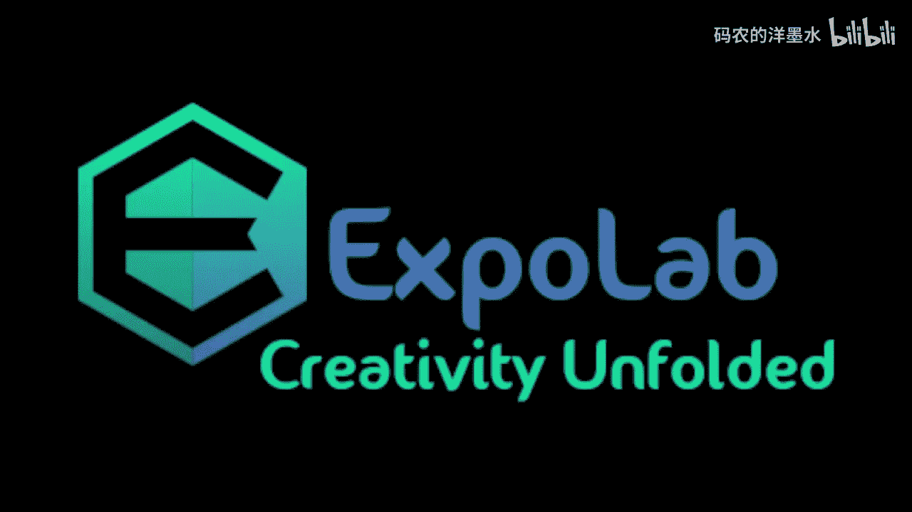
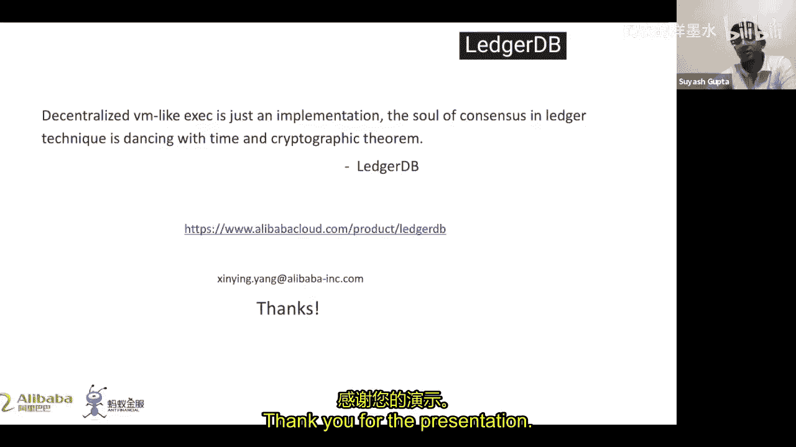
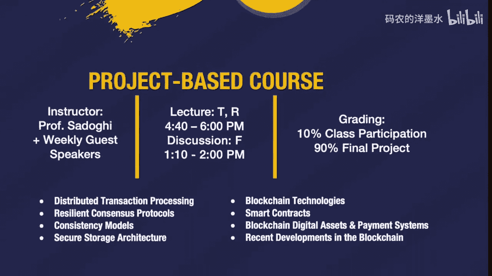

# 020：LedgerDB的核心原理

## 概述
在本节课中，我们将学习阿里巴巴LedgerDB的核心原理。LedgerDB是一种集中式账本数据库，它结合了传统数据库的高性能和区块链技术的防篡改与可审计特性。我们将探讨其设计理念、关键特性、架构以及与传统区块链系统的对比。

---

## 历史背景与技术概念

上一节我们概述了课程内容，本节中我们来看看数据库与区块链技术的发展脉络，并明确几个核心概念。

我们都很熟悉分布式账本技术。集中式账本技术是账本技术中的一个新兴分支，我们为此提出了一个新术语：**集中式账本数据库**。LedgerDB、Amazon QLDB、Oracle区块链表以及ProvenDB都属于这类数据库。

接下来，我们需要区分**不可变性**与**防篡改性**。
*   **不可变性**是一种特性或规则。
*   **防篡改性**是一种系统能力。

**可审计性**是基于预设规则的一系列验证。
*   **内部审计**确保账本的内部用户可以观察和验证所有其他（非受信）用户执行的所有操作的真实性。例如，传统DBMS中的审计表可以满足内部审计，因为DBA可以审计所有用户的历史操作日志。
*   **外部审计**是指外部第三方观察和验证所有操作的真实性。传统审计表无法满足此要求，因为第三方无法信任审计日志，DBA可能篡改数据。

---

## 传统数据库与区块链的局限性

上一节我们定义了核心概念，本节中我们来看看现有技术面临的挑战。

在Codd发表关系数据模型的论文后，DBMS进入了一个新时代。传统的OLTP DBMS（如Oracle和DB2）具备一些安全和审计功能，但它们都有一个前提：**DBA是完全可信的**。但在现实中，DBA可以通过修改事务日志来篡改历史记录，也可以伪造数据库内部时间戳。这些缺陷使得传统DBMS缺乏司法级别的可信度。同样的情况也发生在云DBMS和传统NoSQL系统中。

区块链技术的出现引起了广泛关注。比特币是第一个区块链系统，它在一个允许任何人加入的公共网络上实现了哈希链接交易和工作量证明共识范式。它是一个高度去中心化且广泛分布的系统，但其吞吐量非常低，并且存在过多副本。

对于声称用于企业协作应用的许可区块链，我们观察到许多实际应用并未从去中心化架构中受益。相反，区块链架构（如多节点共识）限制了其吞吐量，并增加了存储开销。更糟糕的是，尽管其机制看似可信，但缺乏严格的可信度和可审计性。

---

## 集中式账本数据库的兴起与价值

鉴于传统系统和区块链的局限性，集中式账本技术变得重要且有价值。

许多应用将其区块链节点部署在由单一服务提供商（如阿里云或亚马逊AWS）维护的“区块链即服务”环境中。这形成了一种**集中式部署**，而非去中心化模式。此外，许可区块链和当前的DLT系统在性能、存储开销、监管问题和有限的外部可审计性方面也存在不足。

以下是Gartner的预测趋势数据。据他们估计，CLD系统在账本系统市场中的份额将从去年的20%增长到50%以上。如果这成为现实，将是区块链应用领域的一场革命。在我们的实践中，越来越多的区块链客户（如知识产权保护、数据溯源应用和供应链金融）转向了我们的项目。

---

## LedgerDB 简介

上一节我们看到了CLD的兴起，本节中我们来详细介绍LedgerDB。

**LedgerDB** 是一种以集中式方式提供防篡改证据和不可否认性功能的账本数据库，它实现了强可审计性、高性能和数据移除功能。

以下是LedgerDB与其他账本系统的关键比较：
*   在外部可审计性方面，LedgerDB能实现类似公链（如比特币）的可信度。我们通过与时间戳机构锚定来实现可信时间戳。
*   我们指出QLDB和Fabric缺乏外部可审计性，因为其威胁模型使得联盟或账本服务提供商可以伪造时间戳，从而欺骗外部审计员。
*   我们还支持**清除**和**隐匿**操作，这打破了传统区块链的不可变性。在调查了真实世界的客户需求后，我们发现他们常常希望在**不影响数据完整性校验**的前提下删除历史数据，这是清除操作的动机。显然，非法信息应该被隐藏，这是隐匿操作的动机。
*   我们还支持客户端和服务器端的不可否认性，以及高效的原生数据溯源插入、检索和验证。

---

## LedgerDB 工作流程与架构

了解了LedgerDB是什么之后，现在我们来看看它是如何工作的。

下图展示了LedgerDB的签名框架工作流程。
1.  用户发出请求。
2.  账本代理将请求分派到账本服务器。
3.  账本服务器记录数据。
4.  服务器在签名后响应。
5.  描述如何与作为公共服务的时间戳机构交互。这是实现外部可审计性的关键协议。

这是我们的数据和控制流架构。账本客户端将请求发送到账本代理，代理接收请求并将其分派到相关的服务器。账本服务器完成请求的最终处理，并与底层存储层（包含AStream、KV存储、MPT和HCFS）交互。AStream是我们设计的线性结构平面文件系统。

---

## 核心操作与API

上一节我们了解了整体架构，本节中我们来看看用户如何与LedgerDB交互。

以下是LedgerDB中的主要操作符和API：
*   **Append API**: 用于将用户事务或系统生成的事务追加到账本中。
*   **Fetch API**: 根据账本序列号或线索获取符合条件的日志。
*   **Verify API**: 用于基于日志证明验证返回日志的完整性和真实性。
*   **Create**: 用于创建具有初始规则和成员的新账本。
*   **Purge**: 从账本中移除旧的日志。
*   **Obliviate**: 从账本中隐匿日志。
*   **Rollback API**: 用于在链接的时间窗口内回滚一次清除操作。
*   **Delete**: 用于删除系统中的实体，如账本、行、成员或线索。

我们可以在数据结构图中看到签名工作流程。该流程使得客户端和L-OP可以在客户端重新计算。日志最初被封装为称为“日志数据”的有效载荷。服务器端，日志结构称为服务器日志。服务器在日志提交后计算日志哈希，并向客户端返回包含最终广播的日志回执。

---

## 事务管理与索引

为了实现高效处理，LedgerDB实现了三阶段事务管理。
1.  **执行阶段**：在账本代理上运行，以实现更好的可扩展性。
2.  **提交阶段**：在账本服务器上运行，它收集多个执行事务，并按唯一的全局顺序（我们之前提到的全局序列号）对它们进行排序，并将其提交到存储系统。
3.  **索引阶段**：为数据检索和验证构建索引。

具体来说，我们这里有三种类型的索引：
*   线索索引
*   BMT累加器
*   区块信息

---

## 外部可审计性与数据移除

LedgerDB的强外部可审计性利用了涉及TSA日志的双向锚定协议。TSA代表时间戳机构，它提供可信时间戳。TSA日志包含提交的摘要和TSA发送的可信时间戳。这些日志相互纠缠，形成时间链。账本摘要首先被提交并发送给TSA，然后TSA日志作为TSA日志记录回账本。

我们提供时间账本服务，该服务在阿里云上可以维持更高的吞吐量。时间账本可以由可信方维护，作为公共账本的共享时间公证服务。它接受来自不同账本的摘要提交，并与TSA交互，充当公共账本和TSA之间的代理。

下图总结了确保账本不可否认性的多方签名。我们可以看到用户在提交到账本服务之前进行签名，LedgerDB在响应用户时发送回执，TSA在TSA日志上签名。

---

## 可变数据移除与原生数据溯源

现在，我们来谈谈可变数据移除。LedgerDB支持现实世界客户需求的几种数据移除操作符。它打破了传统区块链的不可变性，但仍保留了防篡改性。

在传统区块链中，数据一旦写入账本就无法删除或修改，但这导致了巨大的存储开销和现实应用中的监管问题。许多区块链用户希望清理历史记录以节省存储空间，清除操作满足了这一需求。清除操作会移除从创世区块（或最新的伪创世区块）到指定GSN之间的一组连续日志。

传统区块链不可变性的另一个缺陷是监管问题。想象一下，有人未经批准上传了他人的隐私数据（如个人身份证信息）。这在现实应用中应该被删除。隐匿操作旨在支持此类敏感信息隐藏。隐匿操作将原始日志转换为仅保留其元数据和新摘要的新日志。

我们通过提出的**线索**概念支持原生数据溯源。线索是用户指定的标签，承载着数据沿袭的业务逻辑。客户可以在插入数据时通过Append指定特定线索，通过Fetch检索特定线索记录，并通过Verify验证特定线索。

以下是一个商品订单的线索使用示例。订单ID `1,2,3,4,5,6` 是指定的线索ID。当客户下单时，一个代表“未支付”的日志被插入账本；客户支付后，记录另一个代表此信息的日志。同样的情况发生在商品发货和收货时。我们可以看到，与此订单相关的所有日志都可以使用线索进行追踪。

我们设计了一个写优化的线索索引结构和专用的验证协议，结合线索计数器和MPT，以实现快速的线索获取和验证。

---

## 性能优化与实验结果

在性能方面，我们进行了多项优化。

传统的累加器为每个交易计算根哈希，当数据量很大时，这使得我们的CPU成本相当高。我们设计了**批量累加算法**，为一批日志计算单个根哈希以提高系统吞吐量。我们可以看到，批量大小越大，吞吐量越高，但证明粒度会降低。

LedgerDB的线索索引专为写优化而设计。实验数据显示，写操作每秒可超过一百万次，并且与RocksDB相比，线索索引对点读也很友好。

从这张幻灯片中，我们可以看到LedgerDB端到端性能的实验数据。LedgerDB的写入和顺序读取吞吐量可以达到每秒30万次以上。对于现实世界的应用，我们在LedgerDB和Hyperledger Fabric 1.4上部署了相同的存证应用。实验结果表明，LedgerDB比Fabric快80倍。

---

## 应用场景与案例

在实际应用中，存在三种用户场景模式：
1.  **单账本**：最简单的模式，只存在一个参与方。
2.  **联邦账本**：有多个参与者，他们有相互审计的需求。
3.  **委托账本**：只与一个中心化代理交互，该代理进一步管理其他有相互审计需求的参与者。

这里我们将联邦账本与许可区块链进行比较。在供应链金融等应用中，LedgerDB可以获得更高的性能、更低的成本、更易用的特性以及更好的外部可审计性。

饼图显示了截至今年八月我们的客户应用分布百分比，包括物联网数据追踪、保险、供应链金融、知识产权、监管科技、零售、医疗保健、制造业和能源。一个真实世界的趋势是，越来越多的许可区块链客户正在转向CLD系统。

---

## 总结
本节课中，我们一起学习了阿里巴巴LedgerDB的核心原理。我们探讨了集中式账本数据库出现的背景，了解了LedgerDB如何通过结合数据库的高性能和区块链的防篡改、可审计特性来解决传统系统的局限性。我们详细介绍了其架构、工作流程、核心API、以及支持数据移除和原生溯源的创新功能。最后，我们通过性能对比和应用案例看到了LedgerDB在实际场景中的价值。欢迎在阿里云上尝试LedgerDB。