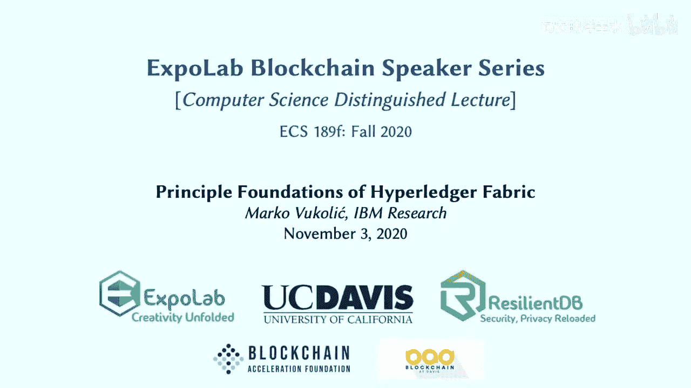
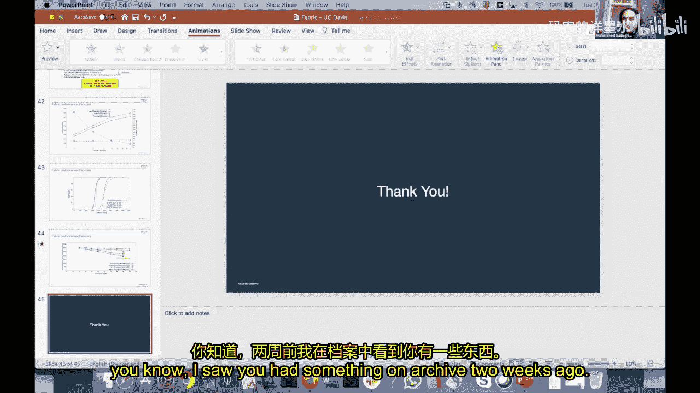
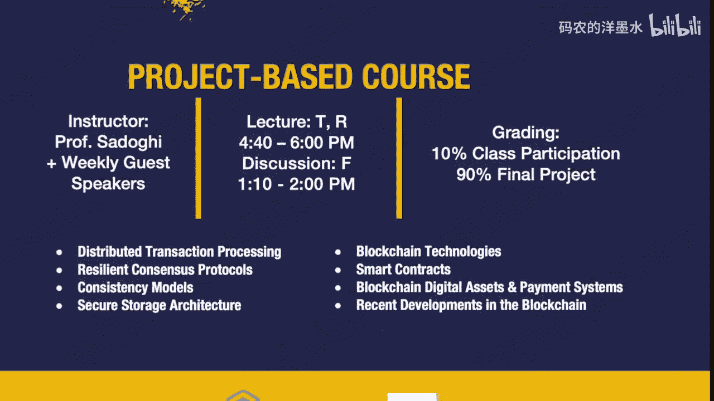

# 021：Fabric的核心原理 🔗

## 概述
在本节课中，我们将学习Hyperledger Fabric的核心原理。Fabric是一个为许可制区块链设计的分布式操作系统，其独特的“执行-排序-验证”架构解决了传统区块链在性能、隐私和灵活性方面的诸多挑战。我们将深入探讨其设计理念、关键组件和工作流程。

---

## 引言与背景

大家好，今天非常荣幸能与Marco Vcolic一起，继续我们在戴维斯分校的区块链系列讲座。Marco是IBM苏黎世研究院的研究员，也是Hyperledger Fabric背后的核心研究人员之一。他与团队发表的关于Fabric的原创论文曾获得IBM的Pat Goldberg纪念最佳论文奖，这是一项极高的荣誉。

Hyperledger Fabric是Linux基金会旗下Hyperledger项目的首个孵化项目，自2016年底以来一直非常活跃。它旨在成为一个用于开发通用区块链应用的框架，特别强调共识模块化、智能合约执行的机密性、弹性、可扩展性和可编程性。

---

## Hyperledger Fabric简介

### 市场地位与历史
根据剑桥大学替代金融中心的研究，在许可制区块链项目中，Hyperledger Fabric几乎占据了近一半的市场份额，是开发此类应用的首选平台。它于2017年6月发布了全新的V1架构，这与早期的设计有根本性不同，也是本次讲座的技术重点。

Fabric的所有代码均在Apache 2.0许可证下开源。虽然IBM是主要贡献者，但已有来自27个不同组织的超过150名开发者参与其中，形成了一个活跃的开源社区。

### 应用案例
Fabric支撑着IBM区块链平台，并被许多其他公司采用。其应用案例广泛，以下是一些代表性例子：

*   **IBM Food Trust**：一个连接食品生产者、供应商到大型零售商（如沃尔玛）的区块链网络，用于追踪食品来源。
*   **TradeLens**：由马士基和IBM开发的全球贸易数字化平台。
*   **IBM Digital Health Pass**：一个近期发布的、用于安全验证用户COVID-19健康状态的系统，注重隐私保护，不将个人身份信息存储在链上。

这些案例表明，Fabric能够支持跨多个管理域、无需信任单一实体的复杂商业应用。

---

## 技术挑战与设计目标

在深入Fabric架构之前，我们需要理解它旨在解决的核心技术挑战。传统的“排序-执行”架构（如以太坊）存在以下问题：

1.  **顺序执行阻塞**：智能合约按顺序执行，一个耗时长的合约会阻塞整个网络。
2.  **非确定性执行**：在通用编程语言（如Go、Java）中，很容易编写出非确定性的智能合约（如调用随机数），这会导致节点状态不一致。
3.  **执行缺乏机密性**：所有节点都需要执行所有交易，无法满足商业应用中对隐私的需求。
4.  **共识机制硬编码**：难以根据需求更换共识算法。
5.  **信任模型耦合**：应用层的信任假设与底层的共识信任模型绑定在一起。

Fabric的设计目标正是为了解决这些问题：
*   支持用通用编程语言编写智能合约。
*   消除原生加密货币。
*   实现模块化、可插拔的共识机制。
*   保证良好的性能。

---

## Fabric的核心架构：执行-排序-验证

为了达成上述目标，Fabric摒弃了传统的“排序-执行”架构，创新性地提出了“执行-排序-验证”架构。

### 架构概述
在这个架构中，交易流程被分为三个截然不同的阶段：

1.  **执行**：交易首先由指定的节点（背书节点）模拟执行，产生读写集（对状态的更改提议），但不实际提交。
2.  **排序**：客户端收集足够的背书后，将交易提交给排序服务。排序服务仅对交易进行全局排序并打包成块，不关心其内容。
3.  **验证**：所有节点（提交节点）收到排序后的区块后，并行验证其中的交易：检查背书策略是否满足，并验证读写集是否与当前状态冲突。只有通过验证的交易才会被提交到账本。

### 节点角色
Fabric网络中的节点有明确的角色分工：
*   **Peer节点**：维护账本状态，负责执行和验证交易。其中，**背书节点**是特定链码指定的执行节点。
*   **排序服务节点**：组成排序服务，负责对交易进行全排序并生成区块。它们不维护应用状态。
*   **客户端**：提交交易提案的实体。

### 交易流程详解
以下是“执行-排序-验证”流程的详细步骤：

1.  客户端构造交易提案（包含链码ID、参数和签名），并将其发送给指定的背书节点。
2.  每个背书节点**模拟执行**提案：基于本地状态快照运行链码，生成一个读写集（包含读取的键值版本和提议的写入内容）和背书签名，然后返回给客户端。
3.  客户端等待收集到足够多的背书，以满足该链码定义的**背书策略**（例如，“需要3个背书节点中的2个同意”）。
4.  客户端将背书后的交易提交给**排序服务**。
5.  排序服务对接收到的众多交易进行共识排序，打包成区块，并广播给所有Peer节点。
6.  所有Peer节点（包括背书节点和其他节点）对区块中的交易进行**验证**：
    *   验证交易背书是否满足背书策略。
    *   验证交易读写集中读取的键值版本是否与当前账本状态一致（防止双花或状态冲突）。
7.  通过验证的交易被提交到账本，更新世界状态；未通过验证的交易则被标记为无效，但区块结构依然保留（确保全序一致性）。

---

## 关键特性与问题解决

现在，让我们看看“执行-排序-验证”架构如何逐一应对之前提出的挑战。

### 应对非确定性与资源耗尽
*   **非确定性**：在“执行-排序-验证”架构下，非确定性执行的问题被转化为了**活性问题**而非**安全性问题**。如果一个链码是非确定性的，客户端可能无法收集到满足背书策略的、一致的执行结果，从而导致该交易无法提交。但这不会破坏整个网络或其他链码的安全性。
*   **资源耗尽/拒绝服务**：由于执行是模拟的、在背书节点本地进行的，每个背书节点可以独立决定是否执行某个客户端的请求，或者设置本地超时策略。这种本地策略的差异是另一种形式的非确定性，同样被架构所容忍。

### 实现并行执行与机密性
*   **并行执行**：在“执行”阶段，不同链码的交易可以由不同的背书节点集并行模拟执行。在“验证”阶段，签名验证等操作也可以并行化。这大大提升了系统的整体吞吐量。
*   **执行机密性**：通过**背书策略**，可以指定只有特定的、被授权的节点子集（背书节点）才能执行某个链码。这样，交易的业务逻辑和初始数据就只在有限的节点间共享，实现了基础的执行机密性。Fabric还通过诸如Intel SGX可信执行环境和零知识证明等技术来进一步增强隐私保护。

### 模块化共识与解耦信任模型
*   **模块化共识**：排序服务被设计为一个抽象的、可插拔的组件。Fabric历史上支持过基于Kafka（崩溃容错）和Raft（崩溃容错）的排序服务。目前，社区正在积极开发集成高效的拜占庭容错共识协议（如Mir-BFT），以提供更强的安全保证。
*   **解耦信任模型**：应用的信任模型由**背书策略**定义（例如，需要哪些组织同意），而底层排序服务的信任模型由其所用的共识算法定义（例如，需要2/3多数诚实）。这两者可以独立配置，实现了信任模型的解耦。

---

## 性能与总结

在论文评估中，Fabric展示了可观的性能。例如，在一个仿比特币的“Fabcoin”应用测试中，在60个节点的配置下，吞吐量可以达到每秒数千笔交易（交易大小为~3.5KB），延迟在秒级。性能受众多因素影响，如网络拓扑、背书策略复杂度、交易大小等。

### 总结
本节课我们一起学习了Hyperledger Fabric的核心原理。我们了解到：

1.  Fabric是一个为**许可制、多管理域**场景设计的分布式操作系统。
2.  其创新的**执行-排序-验证**架构解决了传统区块链在顺序执行、非确定性、隐私和灵活性方面的关键挑战。
3.  该架构通过角色分离（Peer、排序服务）、模拟执行、背书策略和读写集验证等机制，实现了并行处理、机密性保障和信任模型解耦。
4.  Fabric的设计使其成为构建企业级区块链应用的强大、灵活的基础平台。

Fabric的持续演进，如在共识协议（Mir-BFT）、分片、隐私增强等方面的研究，预示着它将继续在区块链技术领域扮演重要角色。