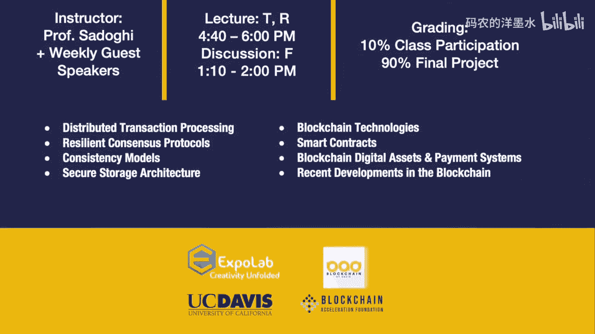

# 022：许可链的现实意义 🧠


在本节课中，我们将学习许可链（Permissioned Blockchain）的核心概念、架构设计、它与无许可链（如比特币、以太坊）的关键区别，以及其在现实世界商业应用中的实际意义和挑战。课程内容基于加州大学戴维斯分校的讲座，由数据库领域的资深专家Mohan主讲。

---

## 概述

区块链技术自比特币诞生以来，引发了广泛关注。然而，无许可的公有链存在性能低下、能源浪费、匿名性导致的非法活动等问题。相比之下，许可链为已知身份的参与者组成的网络提供了更高效、可控且符合商业法规的解决方案。本节将深入探讨许可链的设计哲学、技术架构及其在现实商业流程中的应用价值。

上一节我们介绍了区块链的基本概念，本节中我们来看看许可链如何解决公有链的诸多痛点，并构建更实用的商业网络。

---

## 许可链 vs. 无许可链：核心理念对比 🔄

许可链与无许可链的根本区别在于参与者的身份和网络的准入机制。

*   **无许可链（公有链）**：任何人均可匿名加入网络，参与交易验证（如挖矿）。其核心是试图在“无需信任”的环境中通过工作量证明（PoW）等机制建立信任。这导致了交易吞吐量低（如比特币的7 TPS）、确认时间长（约10分钟）以及巨大的能源消耗。
*   **许可链（私有链/联盟链）**：只有经过身份验证和授权的实体才能加入网络。参与者因明确的商业目的（如供应链协作、跨境支付）而聚集。这借鉴了传统数据库系统中的认证与授权机制。

许可链的优势在于：
1.  **身份与责任**：参与者身份已知，行为可追溯，符合商业和法律要求（如GDPR）。
2.  **性能与效率**：无需耗能的竞争性共识机制（如PoW），可采用更高效的共识算法（如PBFT、Raft），从而大幅提升交易吞吐量和降低延迟。
3.  **隐私与控制**：信息在授权范围内共享，保护了商业机密和敏感数据。
4.  **规则明确**：通过智能合约明确定义多方之间的业务规则（规则集），比传统的、各自为政的工作流系统更严谨。

**核心公式**：许可链的共识效率通常远高于无许可链。
`交易吞吐量（许可链） >> 交易吞吐量（无许可链）`
`交易确认延迟（许可链） << 交易确认延迟（无许可链）`

---

## 许可链的典型架构与工作流程 ⚙️

我们以Hyperledger Fabric（一个流行的许可链框架）为例，说明其核心架构。Fabric采用了一种独特的“执行-排序-验证”（Execute-Order-Validate）架构，与以太坊等系统的“排序-执行”（Order-Execute）模式不同。

以下是Fabric v1.x版本中一个交易的生命周期：

1.  **提案与模拟执行（Proposal & Simulation）**：
    *   客户端应用程序向指定的**背书节点（Endorsing Peer）** 提交交易提案，调用智能合约。
    *   背书节点在隔离环境（沙盒）中**模拟执行**智能合约。此阶段会读取当前世界状态（World State），并计算出该交易将导致的读写集（Read-Write Set），但**不会实际更新账本**。
    *   读写集和背书节点的签名被返回给客户端。

2.  **排序（Ordering）**：
    *   客户端收集到满足**背书策略**的足够响应后，将交易（包含读写集）提交给**排序服务（Ordering Service）**。
    *   排序服务（可能由单个节点或基于共识的集群组成）对所有收到的交易进行全局排序，并打包成**区块（Block）**。**排序服务不检查交易内容**，只负责确定顺序。

3.  **验证与提交（Validation & Commit）**：
    *   排序服务将新区块广播给所有**提交节点（Committing Peer，通常也是背书节点）**。
    *   每个提交节点独立地**验证**区块中的每个交易：检查背书签名是否满足策略，并验证该交易读写集中的“读集”是否与当前世界状态一致（即自模拟执行后，相关数据未被修改）。这类似于乐观并发控制（OCC）的验证阶段。
    *   验证成功的交易将被**提交**：其“写集”被应用到世界状态数据库，交易本身被追加到不可变的区块链上。验证失败的交易则被标记为无效，但其记录仍保留在链上（用于审计）。

**代码概念描述**：智能合约模拟执行过程（简化伪代码）
```python
# 在背书节点上模拟执行
def simulate_transaction(contract, args):
    # 1. 启动模拟环境
    sandbox = new Sandbox(world_state_snapshot)
    # 2. 执行合约逻辑，所有“读”操作访问sandbox中的快照
    #    所有“写”操作被记录但不生效
    read_set, write_set = sandbox.execute(contract, args)
    # 3. 返回读写集和数字签名
    return sign({‘read_set’: read_set, ‘write_set’: write_set})
```

上一节我们了解了许可链的基本工作流程，本节中我们来看看这种设计带来的优势与挑战。

---

## 许可链的优势与设计考量 ✅

许可链的设计选择使其特别适合企业环境：

*   **灵活的信任模型**：通过**背书策略**，可以精细控制交易生效所需的条件。例如，一项交易可能需要5个特定组织中的3个背书，且其中必须包含组织A。
*   **模块化与可插拔**：Fabric的组件（共识算法、成员服务、账本数据库）是可插拔的，允许根据用例需求进行定制。
*   **隐私与机密性**：通过**通道（Channel）** 机制，可以在同一个网络中创建子网络，只有通道成员才能访问该通道内的交易和数据，实现了数据隔离。

然而，这种架构也存在一些挑战和曾被诟病的低效之处：

*   **性能瓶颈**：早期的Fabric实现中，对区块交易的验证是串行进行的，且排序服务不感知交易内容，可能导致大量冲突交易（如同时递增同一个计数器）被排序后又在验证阶段失败，造成资源浪费。
*   **状态数据库的局限性**：早期版本仅支持简单的键值对数据库，限制了复杂数据模型的表达。将SQL等丰富查询下推到智能合约层需要中间层解析SQL语义，增加了复杂性。
*   **节点初始化效率低**：新节点加入网络时，需要从头回放所有交易来重建状态，而非从现有节点同步快照。

---

## 现实世界的应用场景与挑战 🌍

许可链并非万能，其适用场景需要仔细评估。

以下是判断是否应采用区块链（尤其是许可链）的决策考量因素：
1.  **多方参与**：业务涉及多个独立组织或实体。
2.  **需要共享账本**：各方需要基于一致的数据视图进行操作，且存在对账需求。
3.  **信任问题**：参与者之间不完全信任，需要防篡改的记录来建立信任。
4.  **交易可审计性**：需要不可篡改的历史记录用于审计和争议解决。
5.  **规则自动化**：业务逻辑可以通过智能合约自动执行。

**典型应用场景**：
*   **供应链溯源**：追踪商品从生产到消费的全过程，确保真实性。例如，利用“加密锚点”（Crypto Anchor）技术将物理物品（如钻石、药品）的唯一特征记录上链。
*   **贸易金融**：简化信用证、提单等流程，减少纸质文件和人工审核。
*   **身份管理**：提供可验证的数字身份，用于跨境服务。
*   **资本市场**：简化证券发行、交易和清算结算流程。

**需要与传统系统集成**：区块链网络通常不会完全取代企业现有的后端系统（如ERP）。相反，它作为跨组织的协作层，通过API与传统系统交互，触发内部业务流程。

---

## 总结与展望 🚀

本节课中我们一起学习了许可链的现实意义。核心要点如下：

1.  **定位清晰**：许可链是针对特定商业联盟的解决方案，它放弃了无许可链的“完全去中心化”和“匿名性”，换取了**性能、隐私、合规性和可控性**。
2.  **架构创新**：以Hyperledger Fabric为代表的“执行-排序-验证”架构，通过将交易执行与共识排序解耦，提供了灵活性和隐私保护，但也引入了新的性能优化课题。
3.  **实用主义**：许可链的成功在于解决真实的商业痛点（如对账成本高、流程不透明），而非追求技术乌托邦。它需要与物理世界（通过物联网、加密锚点）、法律框架和现有IT系统深度融合。
4.  **持续演进**：当前的许可链系统仍处于类似关系数据库早期的“战国时代”，在标准化、开发工具、性能优化、可维护性等方面有巨大的改进和创业空间。未来的方向包括更高效的共识算法、跨链互操作性、智能合约形式化验证以及分析型查询（区块链数据分析）等。




许可链技术正在从概念验证走向规模化生产部署，它代表了区块链技术务实化、商业化的重要方向。理解其设计权衡和适用边界，对于构建真正有价值的分布式商业应用至关重要。