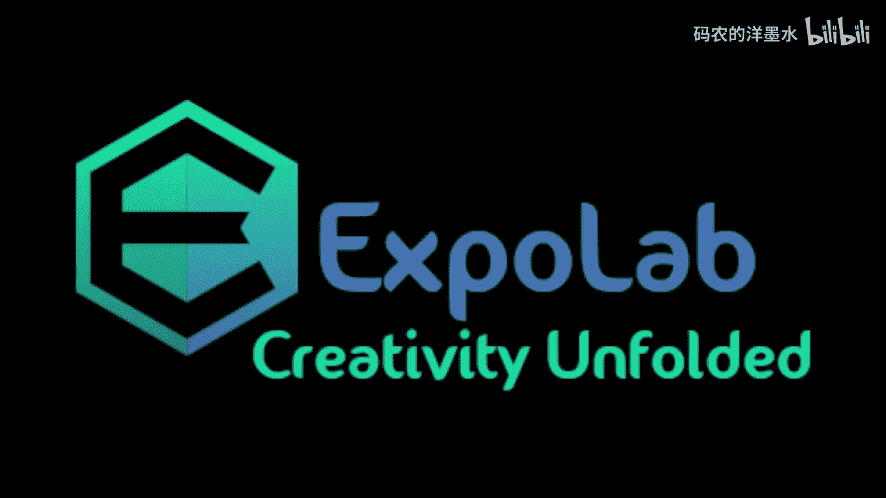
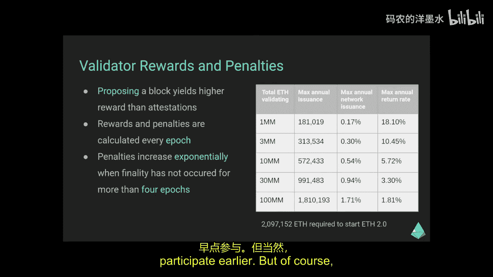
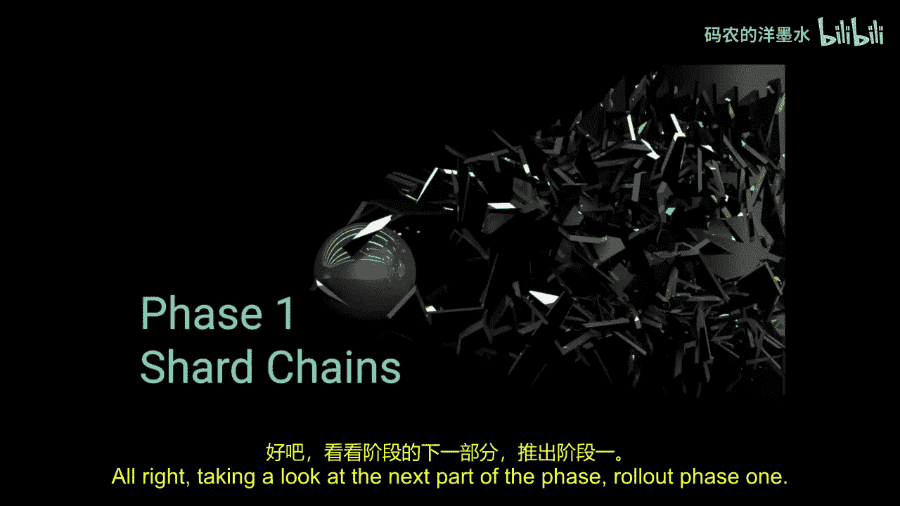
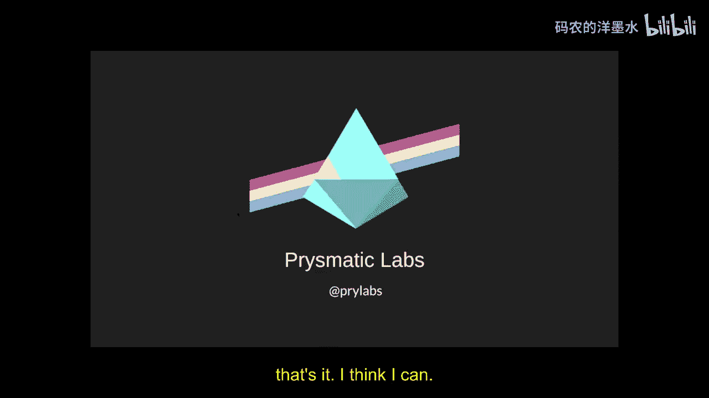
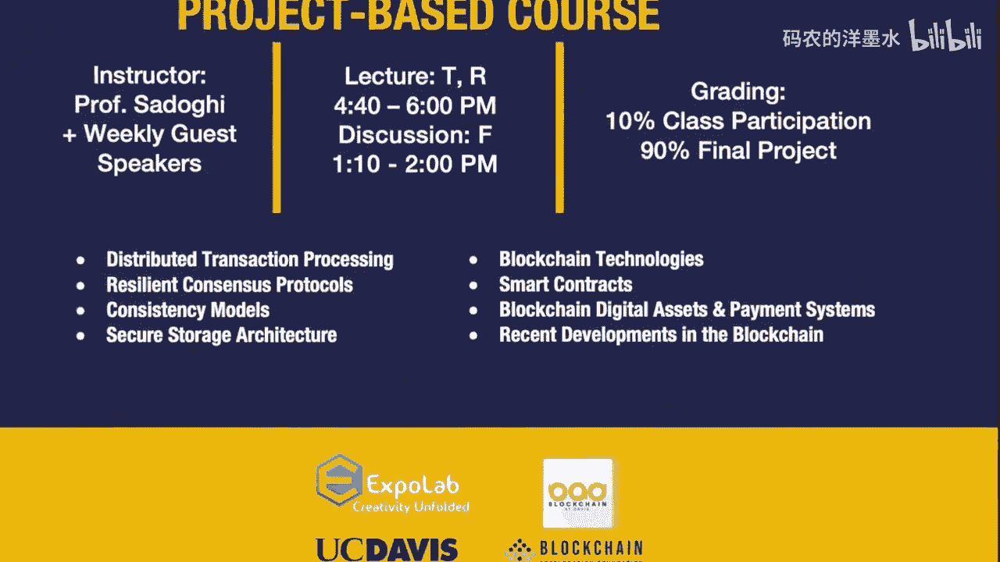

# 023：以太坊 2.0 🚀

在本节课中，我们将要学习以太坊 2.0（Serenity）的核心概念、设计目标、分阶段路线图以及它如何通过权益证明（PoS）和分片技术来解决以太坊当前面临的扩展性挑战。

## 概述

以太坊是一个去中心化的世界计算机，自2015年左右开始运行。它是一个由全球数千个节点共同维护的开源区块链，旨在支持去中心化应用（DApps）、智能合约和自主组织（DAO）。然而，当前以太坊主网（Eth1）在交易吞吐量、确认时间和扩展性方面存在限制。以太坊 2.0 是一次从底层开始的大规模升级，旨在通过引入权益证明和分片技术，在不牺牲安全性和去中心化的前提下，显著提升网络性能。

## 什么是扩展性？

扩展性是指提升区块链处理交易的能力。衡量指标主要包括交易吞吐量（每秒交易数，TPS）和出块时间（交易被确认所需的时间）。

以下是几个系统的对比：
*   **比特币**：理论最大约7 TPS，实际约3 TPS。出块时间约10分钟。
*   **以太坊（当前）**：理论最大约27 TPS（简单转账），实际约12 TPS。出块时间约14秒。
*   **Visa**：平均约1600 TPS，交易确认仅需数秒。

如果区块链技术旨在取代Visa等中心化支付处理器，现有性能仍有巨大差距。

## 区块链不可能三角

设计一个优秀的区块链需要平衡三个核心属性：**安全性**、**去中心化**和**可扩展性（速度）**。试图提升其中一项而不损害其他两项是困难的。

上一节我们介绍了扩展性的挑战，本节中我们来看看两种提升扩展性的思路及其在三角模型中的权衡。

### 思路一：大幅提高区块Gas上限

如果我们将每个区块的Gas上限从800万提高到8000万，理论上吞吐量能提升10倍。

**问题**：更大的区块需要更多的计算资源来处理和验证。这会提高运行全节点的硬件门槛，导致网络趋向中心化（牺牲了**去中心化**）。

### 思路二：大幅缩短出块时间

如果将出块时间从14秒缩短到1秒，理论上吞吐量能提升14倍。

**问题**：区块在网络中传播需要时间。如果1秒内区块无法传遍全网，可能导致同时产生多个竞争区块，增加分叉概率。频繁分叉会降低网络安全性，使确认过程不稳定（牺牲了**安全性**）。

## 扩展方案的类型

鉴于直接修改协议层（链上扩展）的挑战，扩展方案主要分为两类：

### 链上扩展（第一层）

指直接改进区块链底层协议本身。这是首选方案，因为所有应用都构建于此层之上。如果设计得当，可以在不牺牲安全性和去中心化的前提下提升性能。然而，对于已运行的以太坊主网，这如同在F1赛车上高速行驶时更换引擎，实施难度极大。

### 链下扩展（第二层）

指在区块链主协议之上构建抽象层。交易在链下处理，最终将结果批量提交到主链。这能显著减少链上操作。

以下是链下扩展的特点：
*   **易于实施**：可以独立于核心协议开发。
*   **定制化**：可为特定应用（如去中心化交易所）量身定制。
*   **权衡**：通常安全性或去中心化程度不如主链，可能需要信任某个运营者，存在服务中断或审查风险。

## 以太坊 2.0 总览

以太坊创始人Vitalik Buterin指出，以太坊 2.0 是一个长期的、多阶段的升级，旨在：
1.  通过**分片**大规模提升可扩展性。
2.  通过**权益证明**提升安全性。
3.  改进最初设计中的一些程序化技术细节。

这是一次彻底的重构，因此采用分阶段推出的策略。

## 阶段 0：信标链 🏁

阶段0是Ethereum 2.0的基石，引入了权益证明共识机制。信标链本身是一个全新的区块链，与当前的Eth1并行运行。

信标链的核心职责包括：

### 验证者注册与管理
*   想要成为验证者，需要向Eth1上的存款合约质押 **32 ETH**。
*   信标链负责维护验证者注册表，跟踪余额、奖励和退出状态。

### 奖励与惩罚
*   奖励按**时段**（Epoch，约6.5分钟）发放。
*   验证者如果积极参与（提议区块或进行 attestation），会获得小额ETH奖励。
*   如果因离线等原因未能参与，则会受到小额惩罚，罚金通常等于该时段应得的奖励。

### 罚没机制
*   这是权益证明中保证安全的关键。验证者质押的ETH作为“保证金”。
*   如果验证者被证明有恶意行为（如试图混淆区块链），其部分质押金将被**销毁**，并被踢出系统。
*   举报恶意行为的“吹哨人”可以获得奖励。

### 随机洗牌与最终性
*   每个时段，验证者会被随机分配到不同的“委员会”和出块 slot。这防止了验证者合谋攻击，因为无法提前预知自己未来的任务。
*   权益证明引入了**最终性**。在Eth1中，交易只是概率性最终确认，理论上存在通过51%算力攻击进行长程重组（reorg）的可能。
*   在Eth2中，一旦某个区块获得足够多（约三分之二）验证者的连续投票，它就被**最终确定**。根据协议规则，任何人都不能再在更早的、已最终确定的区块上构建，彻底消除了长程重组风险。

### 验证者的角色
验证者主要承担两种职责：

**1. 区块提议者**
*   被选中打包和创建一个新区块。由于验证者数量众多，单个验证者被选中的频率很低。
*   成功提议区块会获得较高的奖励。

**2. 证明者**
*   每个时段，验证者都会被分配到一个 slot 进行 attestation（投票）。
*   Attestation 的内容是表明自己认为哪个区块应该是链的头部。
*   所有 attestation 被收集和聚合。如果某个链分支获得了足够多的权重（三分之二以上验证者同意），它就可以被最终确定。

### 区块处理流程
当一个节点收到新区块时，会按以下步骤验证：
1.  从父区块获取前置状态。
2.  验证区块头中的元数据。
3.  验证随机数（RANDAO）的生成。
4.  处理区块内的所有“交易”对象（在阶段0主要是 attestations、罚没证据、存款等）。
5.  计算得到后置状态，其哈希树根必须与区块头中声明的根匹配。
6.  如果全部验证通过，则接受该区块，并可能在其上继续构建。

## 阶段 1：分片数据层 🧩

在阶段0搭建好权益证明框架后，阶段1将引入**分片**的数据层。

*   计划创建 **64 条分片链**。
*   初始阶段，分片链仅用于存储数据（约每秒共识10MB数据），不执行智能合约。
*   数据分片本身已有用途，例如：
    *   作为零知识证明Rollup的数据可用性层。
    *   存储“一次写入，多次读取”的数据，如社交媒体帖子、GPG密钥服务器或网站托管。
    *   作为企业区块链的备份数据层。

## 阶段 1.5：合并 ⚡

这是介于阶段1和阶段2之间的一个重要步骤，目标是将当前的Eth1（工作量证明链）**合并**到以太坊 2.0 的权益证明体系中。

*   合并后，Eth1将成为以太坊 2.0 的一个分片。
*   现有的以太坊交易将由信标链的验证者（而非矿工）处理。
*   对用户和开发者而言，这个过程应该是**无缝的**。现有的合约、地址和工具无需迁移即可继续工作，只是底层安全模型从PoW切换为PoS。

## 阶段 2：状态执行与eWASM 💻

阶段2将为分片链引入完整的智能合约执行功能，真正实现“世界计算机”。

*   **新的虚拟机**：计划用基于**WebAssembly**的以太坊虚拟机（eWASM）取代现有的EVM。
*   **多语言支持**：eWASM允许开发者使用任何能编译到WASM的语言（如C++、Rust等）编写智能合约，而不仅限于Solidity，这将极大改善开发体验。
*   **跨分片交易**：允许不同分片上的智能合约相互调用。
*   **可移植性**：如果某个分片的Gas费用过高，开发者可以将合约迁移到其他分片，并在原地址设置重定向。

阶段2的完整实现预计在2021年底或2022年。

## 如何参与验证？🛠️

运行一个验证者节点既有趣也有风险（非投资建议）。以下是关键考虑因素：

### 客户端架构
通常采用客户端-服务器架构：
*   **信标节点**：负责与网络通信、同步链数据、处理区块等繁重工作。
*   **验证者客户端**：连接到信标节点，使用私钥对区块进行签名和投票。一个验证者客户端可以管理多个验证者密钥。

### 收益与成本
*   **收益**：年化收益率取决于网络中的验证者总数。早期参与者收益率较高（预计在10%-18%之间），随着更多验证者加入，个体收益率会逐渐下降。
*   **成本**：
    *   **质押金**：每个验证者需要32 ETH。这是一笔可退还的押金，但存在机会成本。
    *   **硬件成本**：很低。你可以在树莓派、旧笔记本或廉价服务器上运行。运行10个验证者和运行1000个验证者的硬件成本几乎相同。
    *   **运营成本**：主要是电力和网络费用。

### 风险与注意事项
*   **长期承诺**：在阶段1.5或阶段2之前，质押的ETH无法提取或转移。
*   **离线惩罚**：如果验证者离线，会持续受到小额惩罚。但需要连续离线数年才会损失一半的质押金。短期离线（如几天）影响很小。
*   **罚没风险**：如果因配置错误或恶意行为导致被罚没，可能损失大量质押金。必须谨慎操作。
*   **网络风险**：如果大量验证者同时离线，惩罚会加剧。

### 开始测试
有兴趣的用户可以立即加入**Medalla测试网**进行零风险体验。访问 `medalla.launchpad.ethereum.org` 即可参与，测试网会提供测试用的ETH。

## 开发与实施流程

以太坊 2.0 的开发是一个全球协作、开源透明的过程：
1.  **研究**：以太坊基金会研究团队提出核心思想和规范。
2.  **讨论**：在论坛、Discord、Telegram等渠道进行社区讨论。
3.  **规范制定**：在GitHub上以开源形式编写和迭代技术规范。
4.  **实现与测试**：多个独立的客户端团队（如Prysmatic Labs的Prysm）根据规范进行实现，并进行严格的单元测试、集成测试和跨客户端测试。
5.  **发布**：定期发布新版本，并最终部署到测试网和主网。

## 总结

本节课我们一起学习了以太坊 2.0 的宏伟蓝图。它通过引入**权益证明**和**分片技术**，旨在彻底解决以太坊的扩展性难题。这是一个全新的区块链，采用**分阶段**的谨慎策略进行部署：从阶段0的**信标链**奠定PoS基础，到阶段1引入**数据分片**，再到阶段1.5**合并**现有Eth1，最后在阶段2实现**全功能分片执行**。整个升级计划在2021-2022年完成。对于开发者与用户而言，以太坊 2.0 承诺了一个更快速、更安全、且容量大幅提升的去中心化计算平台，同时通过测试网和质押机制为社区提供了早期的参与和体验机会。