# 025：去中心化应用(DApp)入门 🚀

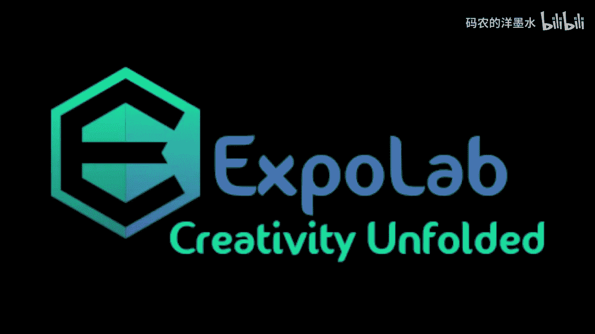

在本节课中，我们将要学习去中心化应用（DApp）的基本概念、它们与区块链技术的关系，以及如何在以太坊平台上构建这些应用。我们将从宏观的“为什么”开始，逐步深入到技术细节，包括以太坊虚拟机（EVM）和Solidity编程语言。

## 为什么需要DApp？ 💡

上一节我们介绍了区块链作为价值互联网的潜力。本节中我们来看看为什么需要在其上构建应用。

互联网实现了信息的自由流动，而区块链技术则有望为价值实现类似的功能。我们希望在数字世界中拥有一种可以安全转移和管理的价值表现形式，即数字货币或代币。然而，数字信息可以零成本复制，这给创建数字原生货币带来了挑战。区块链通过密码学证明和博弈论激励的结合，解决了数字资产的“双花”问题，使得创建可信的数字价值成为可能。

## 什么是DApp？ 🧩

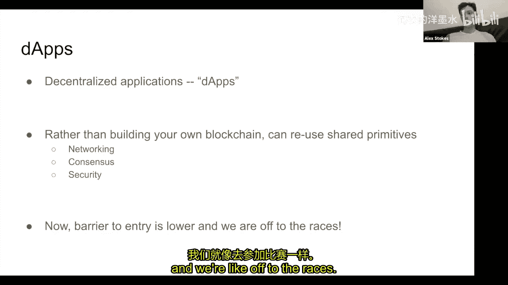

理解了区块链的价值基础后，我们来看看什么是去中心化应用。

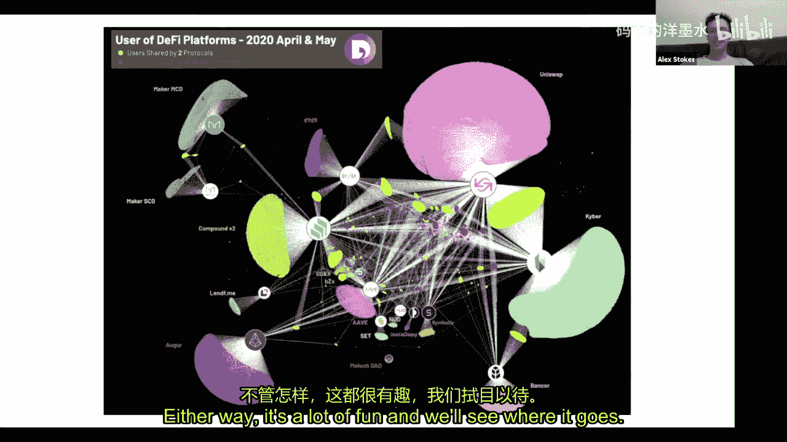

DApp是构建在区块链之上的应用程序。与比特币等单一用途的区块链不同，以太坊等平台提供了一个可编程的通用基础层。这意味着开发者无需为每个应用创建独立的区块链，而是可以共享以太坊的网络、安全和数据层。这种共享基础设施极大地降低了开发门槛，并带来了一个关键优势：**可组合性**。不同DApp之间可以轻松、廉价地相互通信和集成，从而创造出更复杂、功能更强大的生态系统。

以下是DApp的一些常见类型示例：
*   **代币**：遵循ERC-20等标准，代表可互换的数字资产。
*   **借贷协议**：如MakerDAO，允许用户抵押资产并借出稳定币。
*   **稳定币**：如DAI、USDC，其价值与法币（如美元）挂钩，以减少波动性。
*   **去中心化交易所**：如Uniswap，允许用户直接在链上交易代币。
*   **预测市场**：如Augur，允许用户对事件结果进行预测和投注。
*   **非同质化代币**：代表独一无二的数字物品，如艺术品或收藏品。
*   **去中心化自治组织**：一种通过智能合约和代币治理来协调人员和资本的新型组织形态。

## 区块链的可编程性：从比特币脚本到以太坊虚拟机 🔧

了解了DApp的种类，我们需要理解它们是如何在技术上实现的。这涉及到区块链的“可编程性”。

比特币区块链内置了一个简单的虚拟机（VM），称为**Script**。它主要用于验证交易签名和实现多签等基础功能。其设计 intentionally 保持简单，以增强安全性和稳定性，但这也限制了在其上构建复杂应用的能力。

以太坊的核心创新在于引入了**以太坊虚拟机**。EVM是一个图灵完备的、基于堆栈的虚拟机。与比特币Script相比，EVM功能强大得多：
*   它拥有临时内存和持久化存储。
*   支持完整的算术、逻辑和控制流操作。
*   允许部署任意的、状态化的字节码程序（即智能合约）。

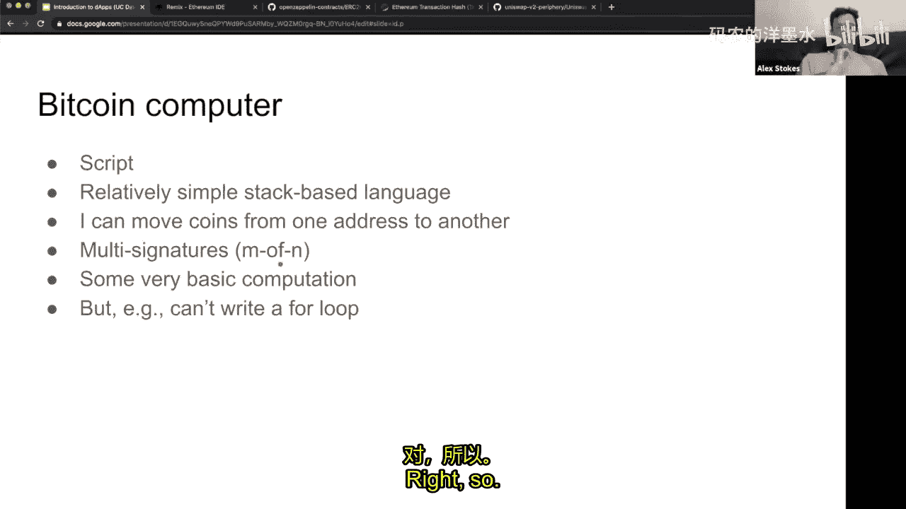

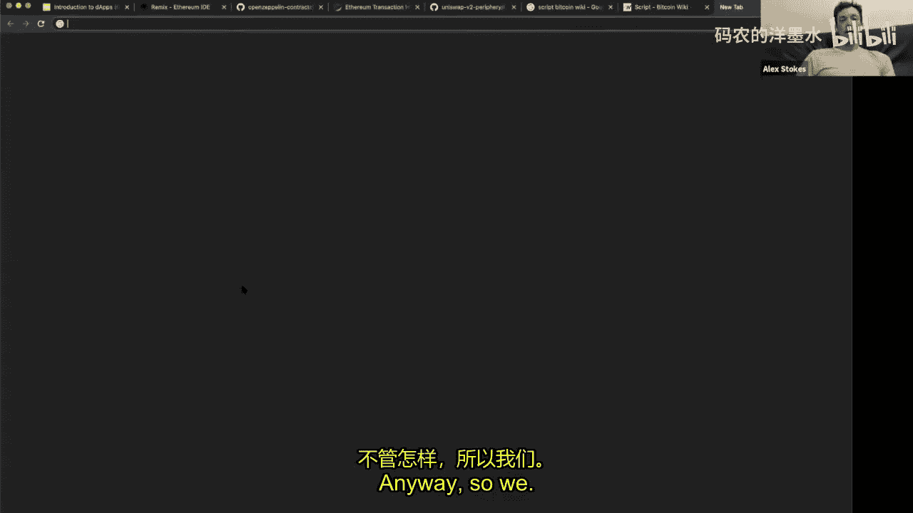

为了防止恶意代码（如无限循环）耗尽网络资源，以太坊引入了**Gas**机制。每一条EVM操作码都有其Gas成本，用户发送交易时需要支付Gas费用。这相当于为计算资源建立了市场，确保了网络的安全和可持续运行。

## Solidity：编写智能合约的高级语言 📝

直接在EVM字节码层级编程非常困难。因此，就像我们用高级语言（如Python）代替汇编语言一样，我们使用**Solidity**来编写智能合约。

Solidity是一种语法类似JavaScript和C++的静态类型语言，专为面向智能合约而设计。它被编译成EVM字节码，然后部署到区块链上。

以下是一个简单的Solidity合约示例，它允许存储和读取一个整数值：

```solidity
// SPDX-License-Identifier: MIT
pragma solidity ^0.8.0;

contract SimpleStorage {
    uint256 storedData; // 状态变量，永久存储在链上

    function set(uint256 x) public {
        storedData = x;
    }

    function get() public view returns (uint256) {
        return storedData;
    }
}
```

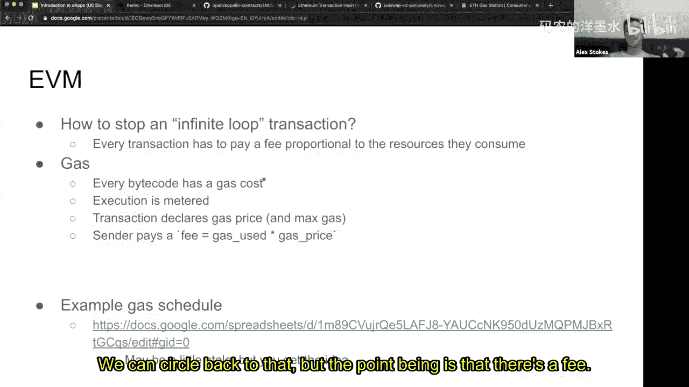


我们可以使用**Remix IDE**等工具在浏览器中编写、编译、部署和测试这样的合约。部署后，合约会获得一个唯一的地址。任何用户都可以通过向该地址发送交易（附带编码好的函数调用数据）来与合约交互，例如调用`set`函数更新数据，或调用`get`函数读取数据。

## 安全至关重要：警示与最佳实践 ⚠️

在探索了如何构建DApp之后，我们必须正视一个核心挑战：安全。

区块链应用管理着真实的价值。智能合约中的漏洞可能导致用户资金的永久损失。由于区块链的不可篡改性和去中心化特性，通常没有“撤销”按钮或中心化机构来补救。

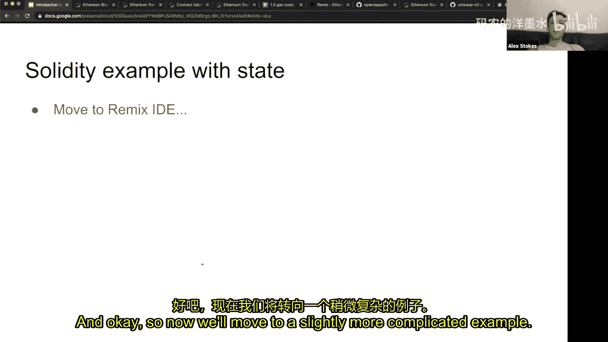

因此，对于开发者和用户而言，安全是重中之重：
*   **代码审计**：在部署涉及大量资金的合约前，必须由专业的安全团队进行审计。
*   **形式化验证**：使用数学方法证明代码符合其规范。
*   **全面测试**：覆盖各种边缘情况和攻击向量。
*   **谨慎交互**：作为用户，在将资产存入陌生合约前，应尽可能了解其代码和风险。
*   **理解风险**：这是一个新兴领域，工具和保险机制尚不完善，风险自担。

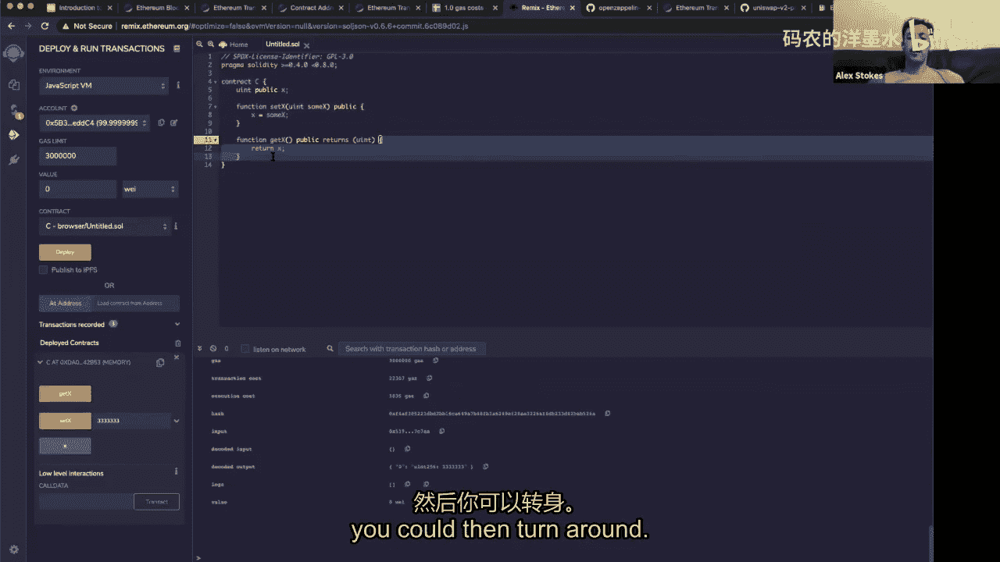

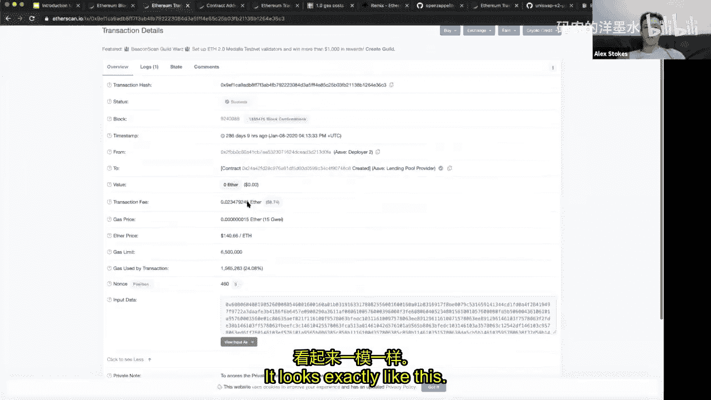

## 总结与展望 🌟

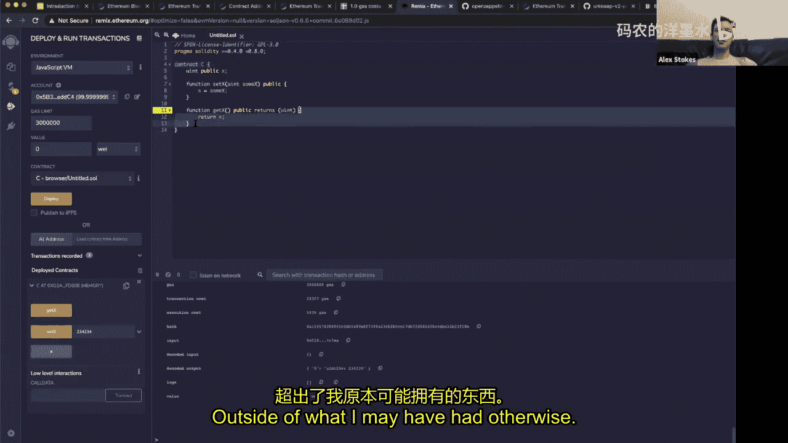

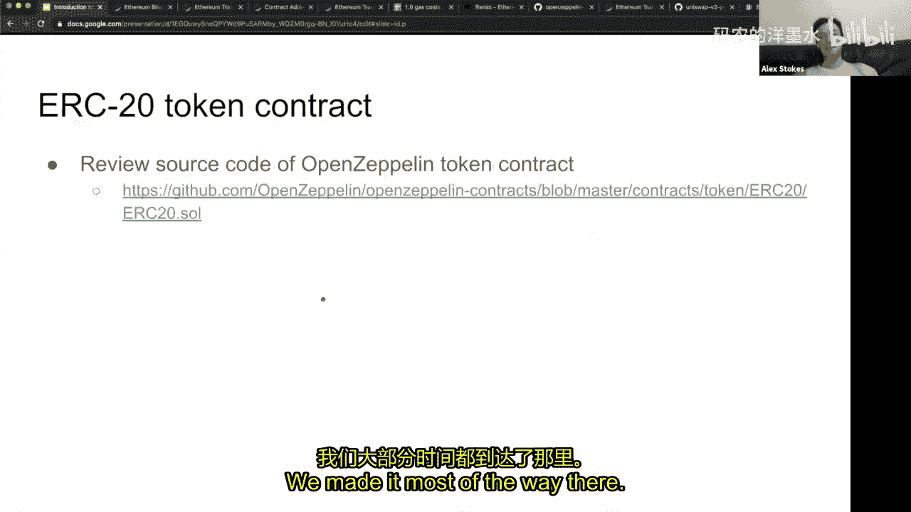

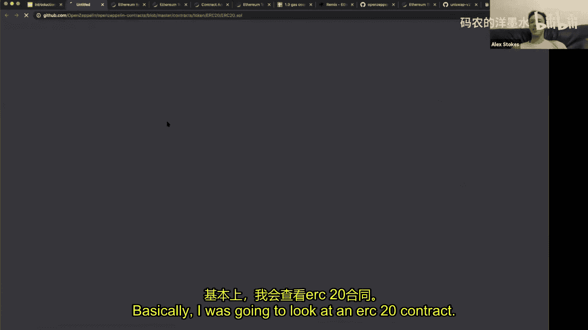

本节课中我们一起学习了去中心化应用的世界。我们从区块链作为价值传输网络的基本原理出发，探讨了DApp的概念、优势（如可组合性）以及多种类型。我们深入了解了以太坊虚拟机如何通过图灵完备性和Gas机制实现智能合约的灵活与安全执行，并介绍了使用Solidity语言进行合约开发的基础。最后，我们强调了在这个管理着数十亿美金真实价值的生态系统中，安全是首要考虑因素。

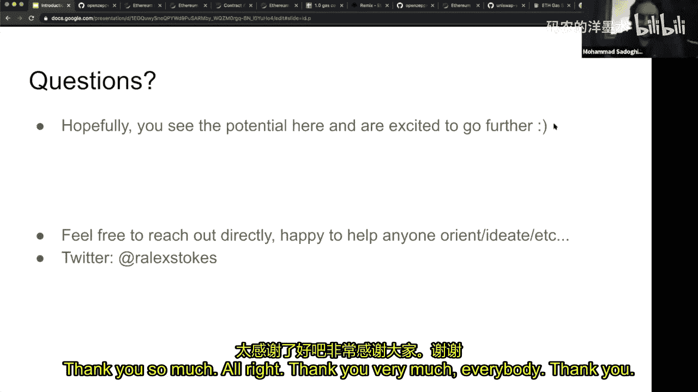

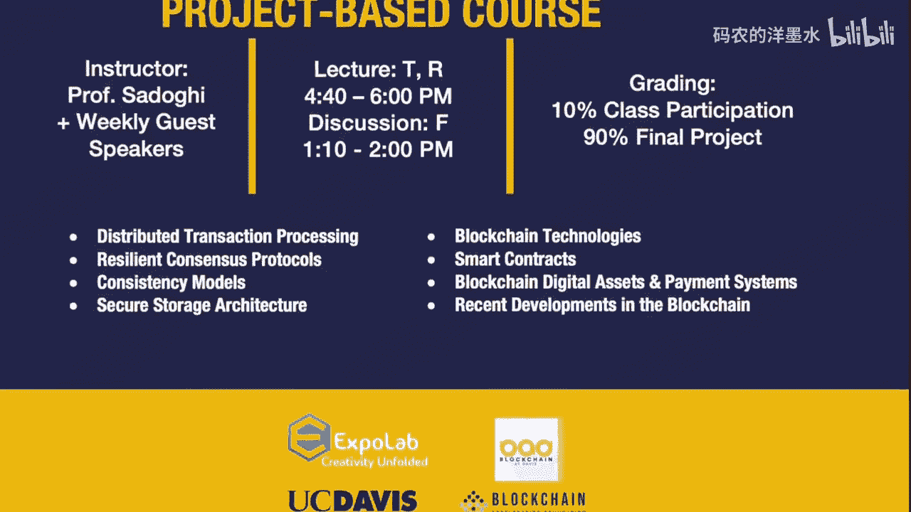

区块链和DApp领域仍处于早期阶段，充满了实验和创新机会。无论是全新的经济协调机制（如二次方投票），还是开放的金融系统（DeFi），都在重新定义我们对于价值、所有权和协作的认知。希望本次课程能激发你的兴趣，并鼓励你继续探索这个令人兴奋的技术前沿。