# 026：基于比特币的创新 🚀

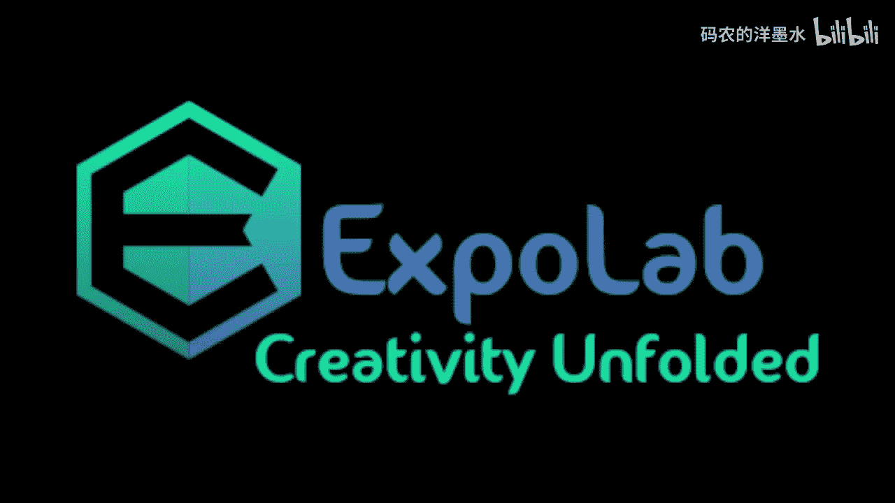

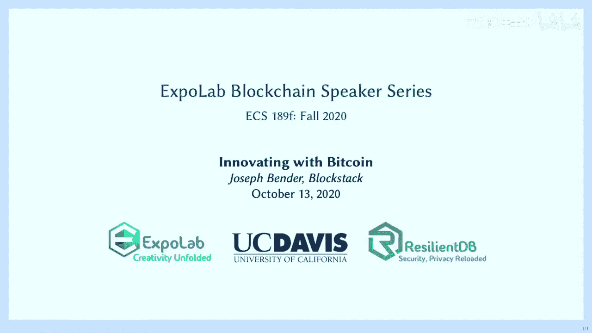

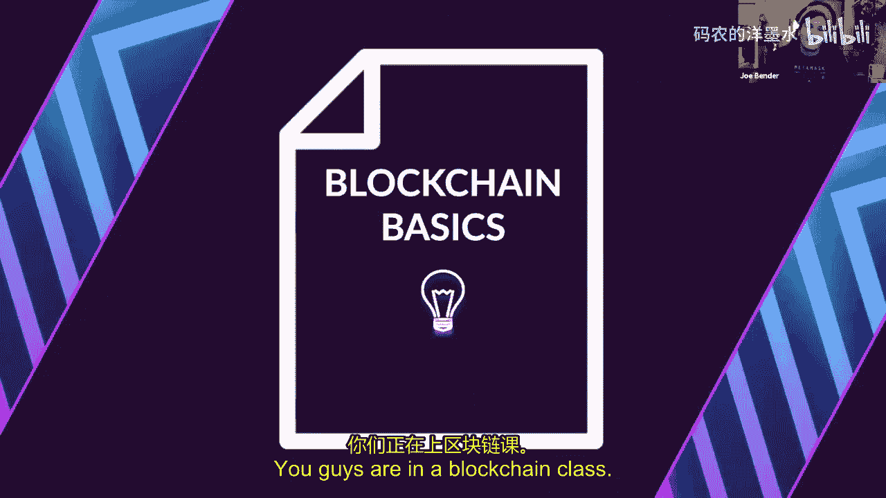

在本节课中，我们将跟随Joe Bender的分享，探讨如何在比特币这一成熟且安全的区块链基础上进行创新。我们将了解Web3的核心思想、比特币的现状与挑战，并深入解析Blockstack的Stacks 2.0如何通过创新的共识机制，为比特币生态带来智能合约和去中心化应用的可能性。

---

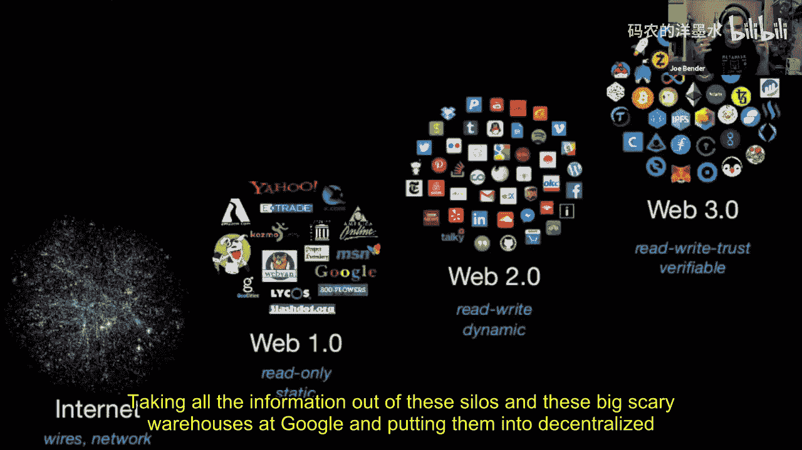

## 概述：从Web2到Web3的演变 🌐

Web3是一个常与区块链关联的流行术语，但其定义往往模糊不清。本质上，Web3是关于将网络从大型企业和国家的控制中解放出来，将权力交还给用户。

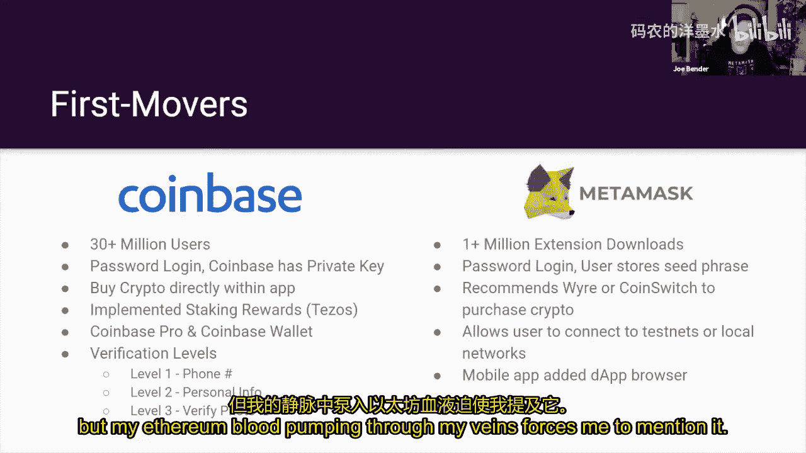

互联网最初是去中心化的，例如早期的ARPANET和点对点文件共享协议（如LimeWire、BitTorrent）。然而，如今谷歌、Facebook和苹果等巨头掌握了大部分权力。Web2.0时代的特点是“读写”交互，用户可以创造和分享内容。而Web3的核心突破在于，它为互联网引入了**原生价值**。在区块链出现之前，要在网上转移价值，必须依赖PayPal、信用卡等第三方中介。区块链技术，特别是像比特币这样的加密货币，创造了一个具有原生价值、去中心化的网络。

---

## 用户体验与主流采用：Coinbase与MetaMask的对比 🔑

为了让区块链技术被大众接受，用户体验至关重要。以下是两个关键平台的对比：

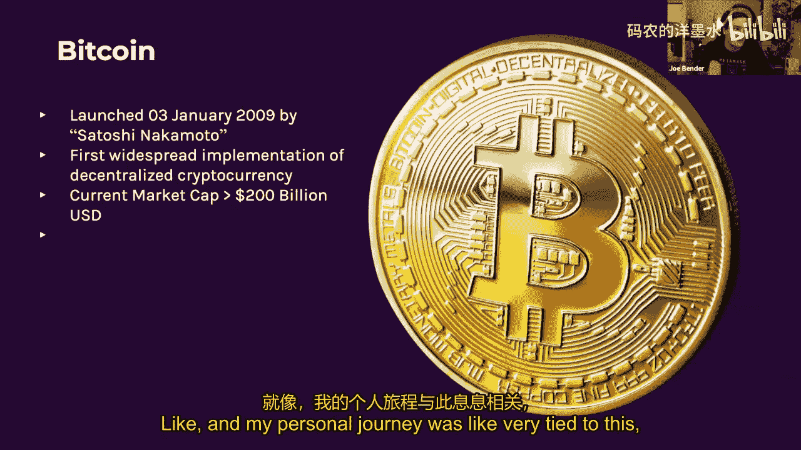

*   **Coinbase**：它通过简化流程（如使用邮箱/密码登录、托管用户私钥）极大地降低了加密货币的入门门槛，推动了主流采用。然而，它本质上是中心化的，用户并不真正掌控自己的资产。
*   **MetaMask**：这是一个浏览器插件钱包，用户需要自己保管12个单词的助记词（私钥）。它提供了真正的自我主权，是与以太坊去中心化应用交互的主要工具，但对新手来说更具挑战性。

这个对比揭示了区块链普及中的一个核心矛盾：我们应该在多大程度上教育用户理解底层技术，又应该在多大程度上将其隐藏起来，提供像使用互联网一样简单的体验？

---

## 比特币：数字黄金与不变性的基石 ₿

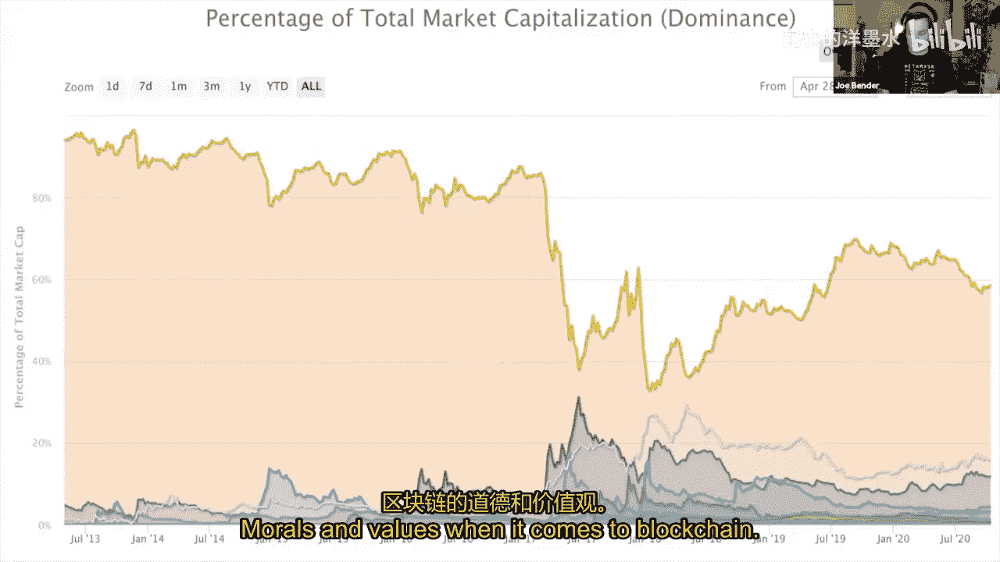

比特币由中本聪于2009年1月3日创世，其创世区块中编码了当天《泰晤士报》的头条：“财政大臣正处于实施第二轮银行紧急援助的边缘”。这巧妙地讽刺了传统金融体系的失败，并宣示了比特币的使命：创造一个不受中心化机构操控的货币系统。

比特币的核心优势在于其**强大的网络效应**和**不变性**。它是市值最高、认知度最广的加密货币。其不变性意味着历史交易记录无法被篡改，这与政府可以随意增发法币形成了鲜明对比，也是其作为“数字黄金”价值存储主张的基石。

---

## 区块链的分叉与哲学：以The DAO事件为例 🍴

区块链的不变性并非没有争议。2016年，以太坊上一个名为“The DAO”的去中心化自治组织因漏洞被攻击，损失巨大。以太坊社区最终决定通过“硬分叉”回滚区块链，挽回损失。这导致了以太坊分裂为两条链：
*   **以太坊**：接受了回滚的新链。
*   **以太坊经典**：坚持“代码即法律”、反对回滚的原链。

这个事件引发了关于区块链治理和不变性的深刻哲学讨论。比特币也因扩容等理念分歧产生了比特币现金等分叉。这些分叉体现了加密世界中价值观的多样性。

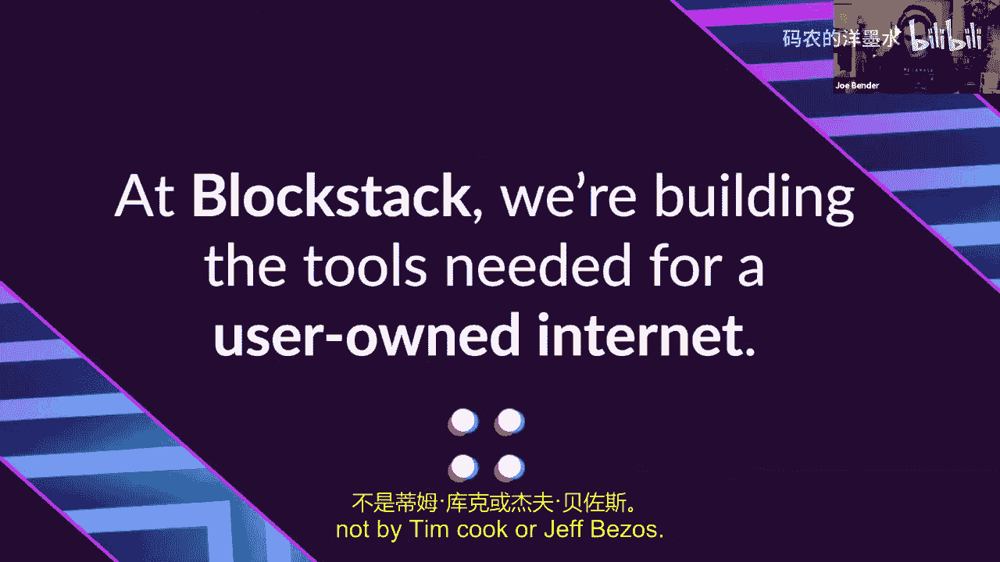

---

## 比特币的扩展性方案：闪电网络 ⚡

比特币网络交易速度较慢、费用较高，不适合小额高频支付。闪电网络是一个**第二层解决方案**，旨在解决比特币的可扩展性问题。

它的工作原理是：交易双方在比特币主链上开设一个支付通道，并存入一定资金。随后，他们可以在该通道内进行无限次、即时、几乎零费用的交易。只有当通道关闭时，最终的余额状态才会被结算到比特币主链上。这就像在GitHub上创建一个功能分支进行开发，完成后再合并回主分支。

---

## Blockstack与Stacks 2.0：赋能比特币生态 🛠️

上一节我们介绍了比特币的扩展性挑战，本节我们来看看Blockstack提出的创新解决方案。Blockstack的愿景是构建“用户拥有的互联网”，而其核心创新是Stacks 2.0协议，它旨在为比特币带来智能合约和去中心化应用功能。

Stacks 2.0的关键在于其新颖的共识机制——**转移证明**。以下是其核心组件：

1.  **转移证明**：矿工通过发送比特币来竞争生成Stacks区块，而不是像工作量证明那样燃烧电力。这利用了比特币已有的价值和安全性。
2.  **Stacking**：STX代币持有者可以通过“锁定”他们的代币来参与网络共识，作为回报，他们会获得矿工发送的比特币作为奖励。这类似于权益证明中的质押。
3.  **与比特币锚定**：Stacks区块链的每个区块都与一个比特币区块哈希绑定，确保其安全性与比特币网络同步，同时通过微区块实现更高的交易吞吐量。

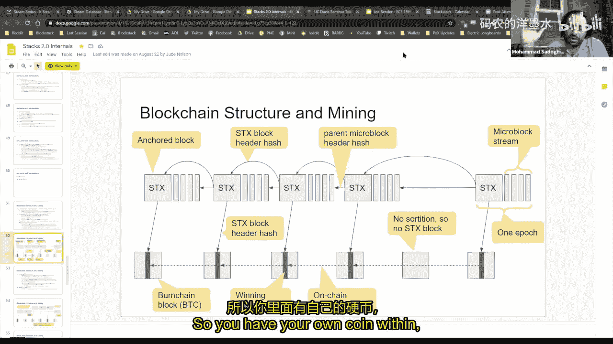

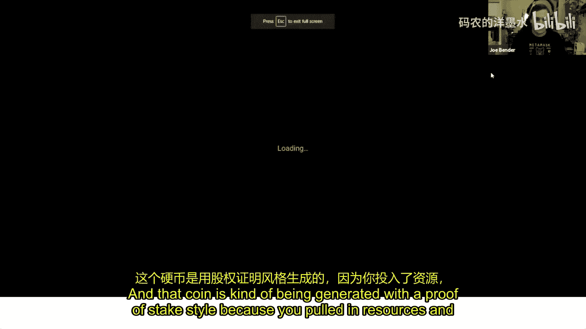

简单来说，Stacks 2.0创建了一个独立的、功能更丰富的区块链（支持智能合约），但其安全性和经济激励深深植根于比特币网络。它试图将比特币的稳定安全性与以太坊的灵活可编程性结合起来。

---

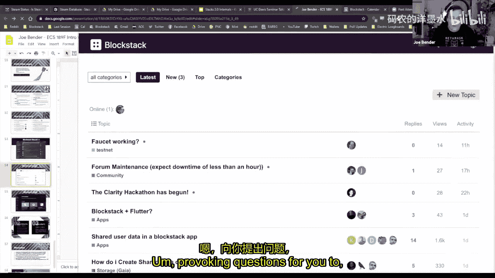

## 总结与展望 🎯

本节课我们一起探索了基于比特币进行创新的多种路径。我们回顾了Web3的愿景，分析了比特币作为价值存储基石的地位和其面临的扩展性挑战。我们深入探讨了闪电网络作为支付层解决方案的潜力，并重点学习了Blockstack的Stacks 2.0如何通过“转移证明”这一创新机制，试图为比特币生态引入智能合约和去中心化金融功能。

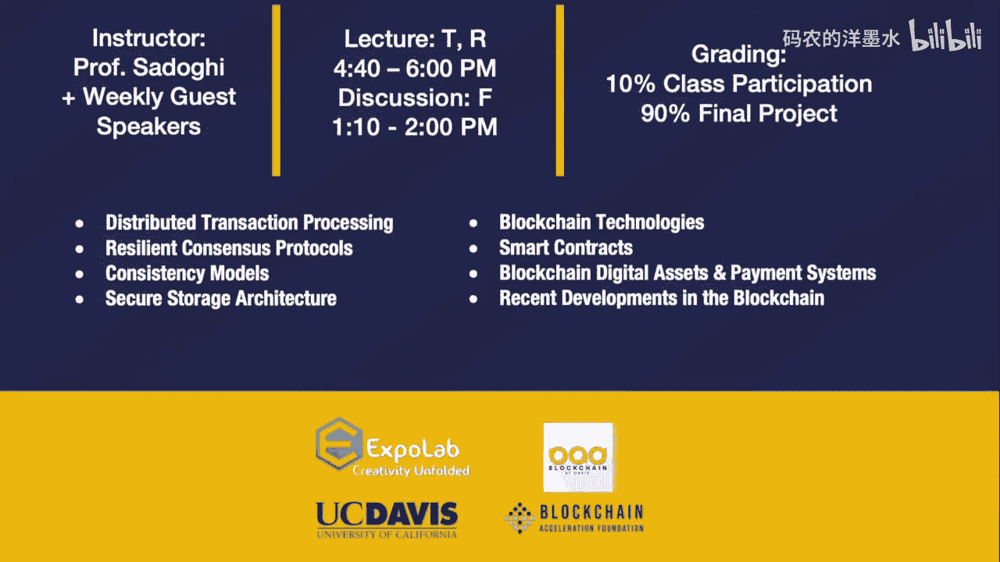

区块链领域仍在快速演变，核心在于通过精巧的机制设计（游戏理论）来协调激励，在安全性、去中心化和可扩展性之间寻找平衡。无论是专注于支付效率的闪电网络，还是旨在扩大生态能力的Stacks，这些创新都共同推动着一个更开放、由用户主导的互联网未来。