# 027：ResilientDB实操教程 🚀


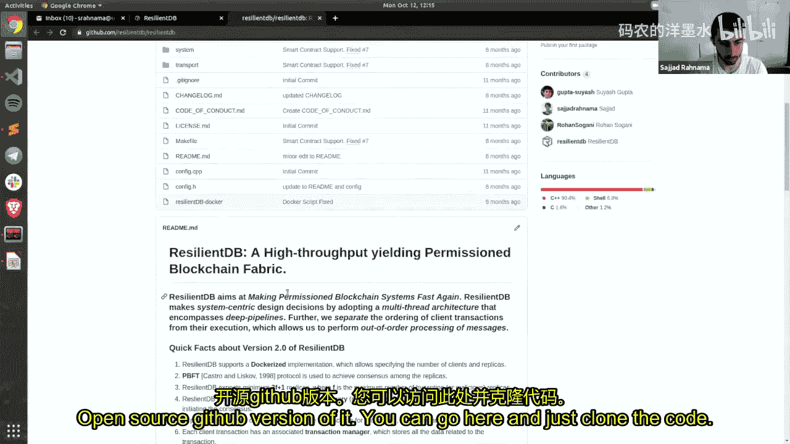

在本节课中，我们将跟随加州大学戴维斯分校的博士生Sajad Rana，学习ResilientDB区块链平台的核心概念、架构以及如何上手操作。ResilientDB是一个由UC Davis团队在过去三年中自主研发的区块链框架，已有超过100名学生通过课程使用过它。本教程将分为三个部分：平台介绍、使用Docker运行ResilientDB，以及在Google Cloud上运行并进行代码调整。

---

## 概述 📋

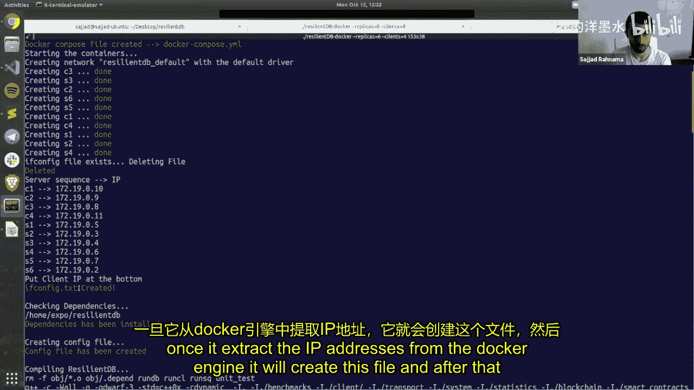

ResilientDB是一个用C++编写的分布式区块链框架。它依赖一些外部库（如CryptoPP、Boost、Nanomsg）来处理加密和网络通信，但所有依赖都已预先打包，方便用户快速上手。其核心是一个高度流水线化和多线程的架构，能够高效处理共识协议。

## 第一部分：平台介绍与配置

ResilientDB是一个分布式系统，需要在多台机器上运行。对于本地开发和测试，最简单的方法是使用Docker来模拟多节点环境。

### 核心配置文件

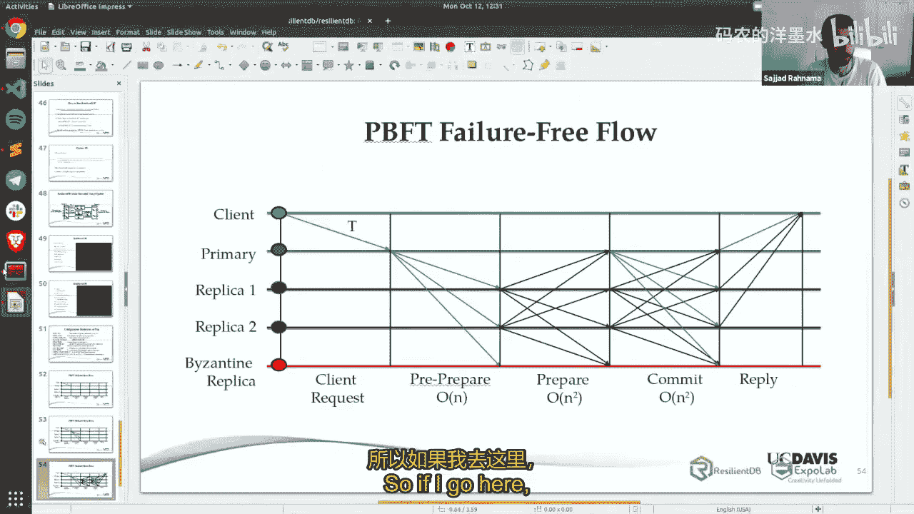

运行系统前，需要了解配置文件 `config.h` 中的几个关键参数：
*   **`NODE_CNT`**：系统中节点的总数。
*   **`CLIENT_NODE_CNT`**：系统中客户端的数量。
*   **流水线线程数**：系统为输入、输出、共识处理等任务配置的线程数量，用户通常无需修改。
*   **`TOTAL_PROCESS_TIME`** 和 **`WARMUP_PROCESS_TIME`**：系统总运行时间和预热时间。
*   **`PROTOCOL_TYPE`**：当前开源的唯一协议是 **PBFT**（实用拜占庭容错）。

上一节我们介绍了平台的基本情况，本节中我们来看看如何快速运行它。

## 第二部分：使用Docker运行ResilientDB 🐳

为了简化在多机器环境下的部署，ResilientDB提供了Docker脚本。

### 运行步骤

以下是使用Docker脚本一键运行ResilientDB的步骤：

1.  **确保Docker引擎运行**：在终端执行 `docker ps` 命令，确认Docker服务正常。
2.  **执行运行脚本**：使用 `./resilientdb_docker.sh` 脚本，并指定副本节点和客户端的数量。
    ```bash
    ./resilientdb_docker.sh -r 6 -c 4
    ```
3.  **脚本自动执行流程**：该脚本会自动完成以下工作：
    *   根据参数生成配置文件。
    *   创建Docker Compose文件，并启动对应数量的容器（例如S1-S6， C1-C4）。
    *   从Docker引擎获取各容器的IP地址，并生成 `ifconfig.txt` 文件。
    *   解压所有依赖库。
    *   编译ResilientDB源代码，生成 `runDB`（副本节点程序）和 `runCL`（客户端程序）二进制文件。
    *   通过共享文件夹将二进制文件分发到各容器。
    *   启动系统运行。

系统将首先进行预热（Warmup），然后开始正式运行并测量吞吐量和延迟。运行结束后，脚本会收集所有容器的结果并汇总展示。

### PBFT协议工作流简介

ResilientDB当前实现的PBFT协议工作流程如下：
1.  **客户端**：将请求批量发送给主节点（Primary）。
2.  **主节点**：创建 **Pre-Prepare** 消息，并广播给所有副本节点。
3.  **所有副本节点**：收到Pre-Prepare消息后，创建 **Prepare** 消息并广播给所有节点。
4.  **所有副本节点**：收到足够多的Prepare消息后，创建 **Commit** 消息并广播。
5.  **所有副本节点**：收到足够多的Commit消息后，**执行**交易，将其加入区块链，并向客户端发送回复。

**主节点** 负责为交易分配序列号以确定顺序。如果主节点出现故障（拜占庭错误或崩溃），系统内置的视图更换（view change）协议会选举新的主节点。

**拜占庭副本** 是指可能表现出任意恶意行为的故障节点，例如不发送消息、向不同节点发送不同消息等。

## 第三部分：代码结构与开发入门 💻

如果想基于ResilientDB实现自己的协议或进行修改，需要了解其代码结构和工作流程。

### 代码目录结构

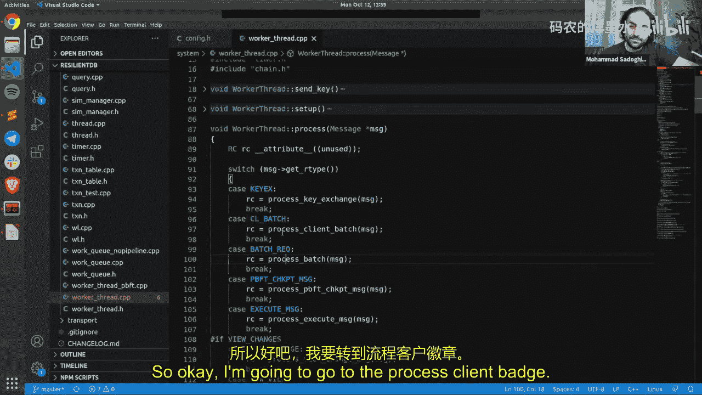

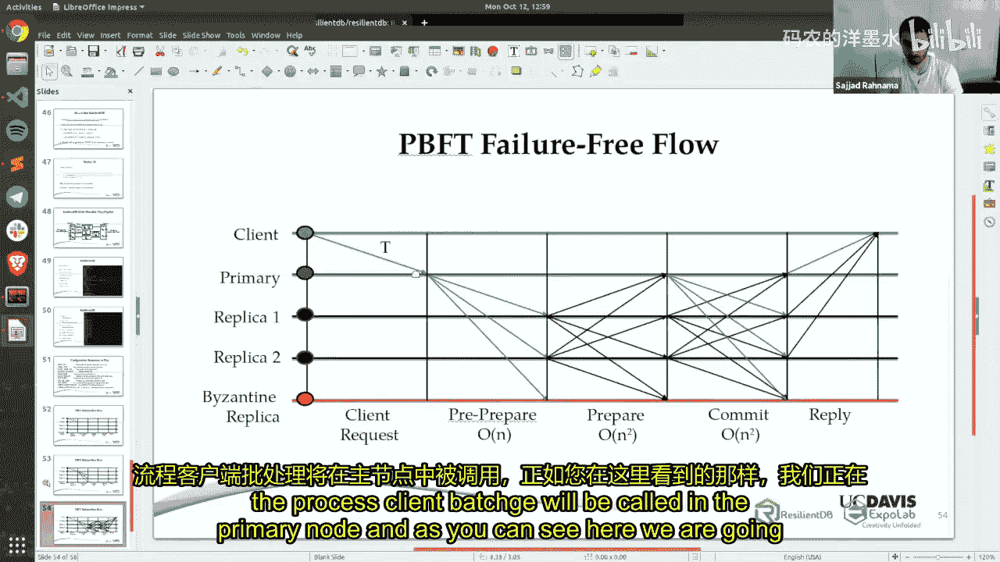

对于初学者，主要需要关注两个目录：
*   **`system/`**：包含共识协议的核心逻辑，如节点处理消息的流水线。
*   **`client/`**：包含客户端行为逻辑。

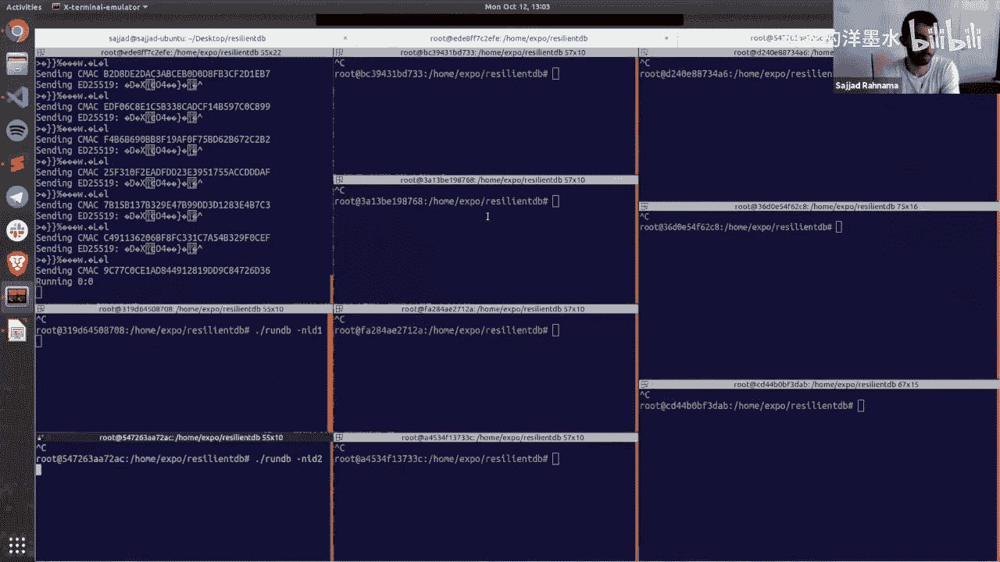

主要的入口二进制文件对应的主函数分别在 `runDB.cpp` 和 `runCL.cpp` 中。

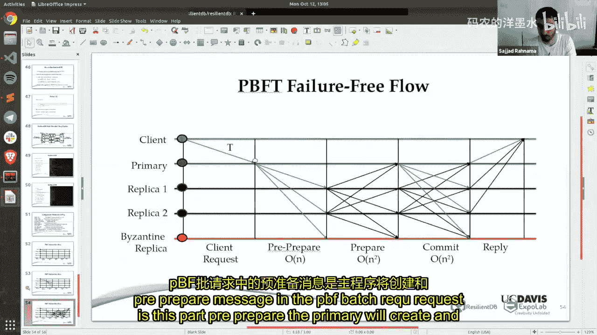

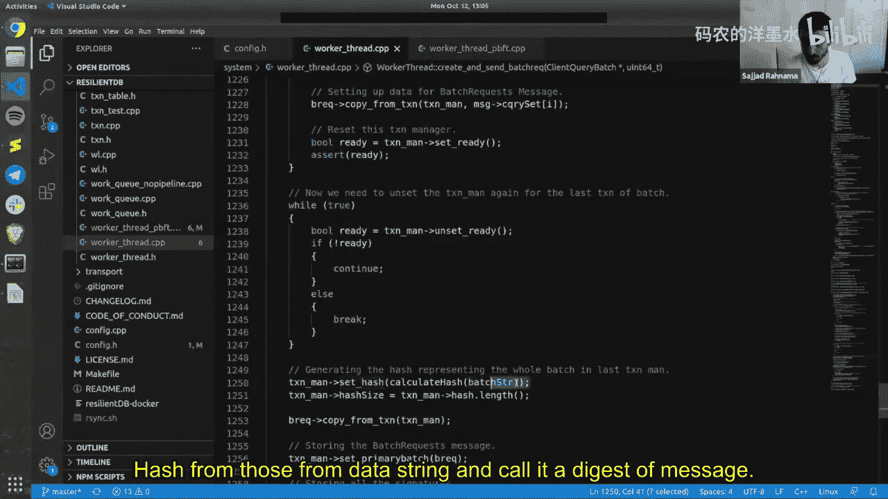

### 核心工作流程追踪

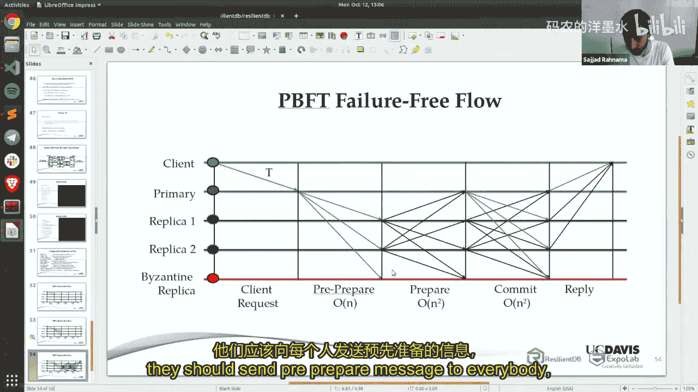

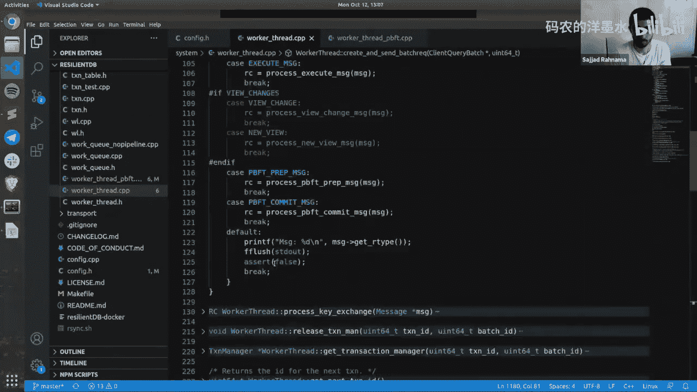

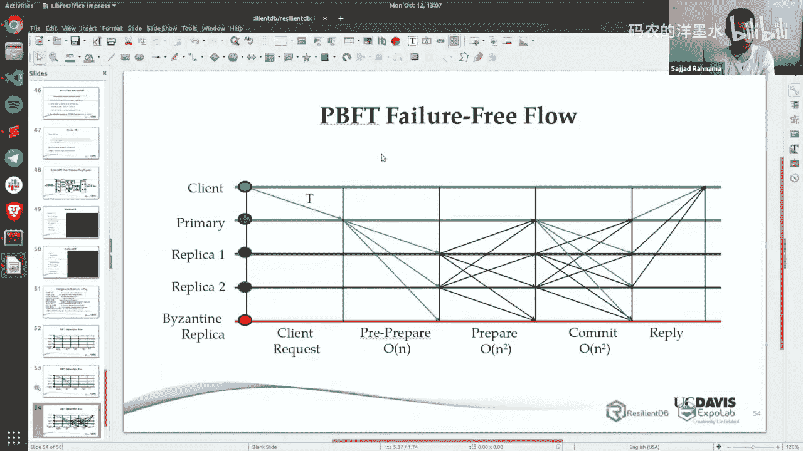

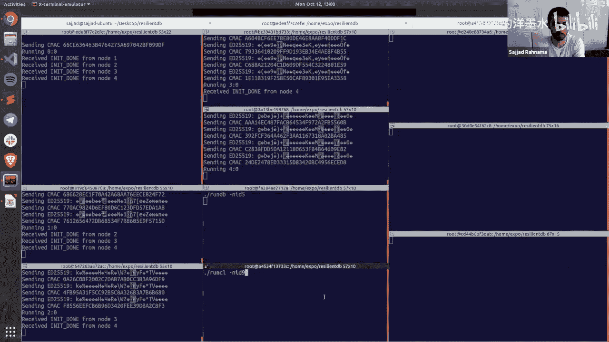

理解PBFT在代码中的实现，最佳方式是追踪一个客户端请求的完整生命周期。

1.  **客户端发起请求**：
    *   代码位于 `client/client_thread.cpp` 的 `run()` 函数中。
    *   这是一个无限循环，客户端不断创建批量请求，发送给当前视图的主节点，然后等待回复。
    *   关键函数 `create_and_send_batchreq()` 会构建请求，签名后放入消息队列，由输出线程发送。

2.  **节点处理消息（事件驱动）**：
    *   所有副本节点的核心逻辑在 `system/worker_thread.cpp` 的 `run()` 函数中。
    *   节点不断从工作队列中取出消息，并根据消息类型调用相应的处理函数。
    *   处理函数是一个大的 `switch-case` 结构，例如：
        ```cpp
        switch (msg->rtype) {
            case CLIENT_BATCH:
                process_client_batch(msg);
                break;
            case BATCH_REQ:
                process_batch(msg);
                break;
            // ... 其他消息类型
        }
        ```
    *   如果你想添加新的消息类型或协议阶段，需要在此处添加新的 `case` 并编写处理函数。

3.  **处理客户端批量请求（主节点）**：
    *   当主节点收到 `CLIENT_BATCH` 消息时，会调用 `process_client_batch()`。
    *   该函数验证请求后，会为每个请求创建交易管理器，计算整个批次的摘要（Digest），然后创建 **BATCH_REQ**（即Pre-Prepare）消息，广播给所有节点。

4.  **处理批量请求（所有副本节点）**：
    *   当任何节点收到 `BATCH_REQ` 消息时，会调用 `process_batch()`。
    *   此函数会验证消息，然后创建 **PREPARE** 消息并广播，从而进入协议的下一阶段。

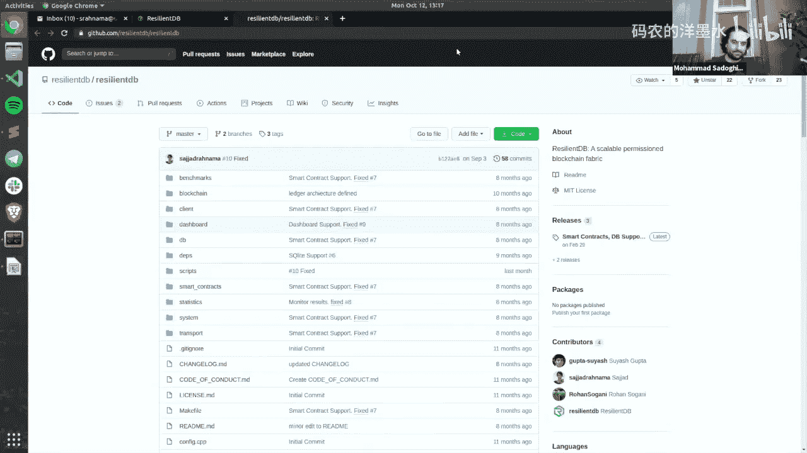

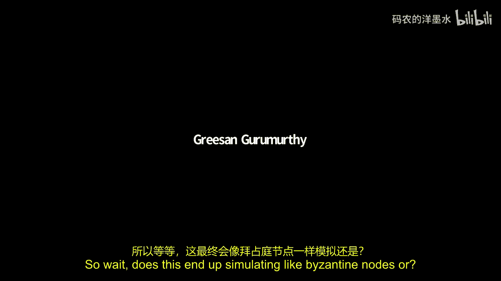

后续的 **PREPARE**、**COMMIT**、**EXECUTE** 等阶段的处理方式类似，都是通过相应的 `process_pbft_prepare_msg()`, `process_pbft_commit_msg()` 等函数推进状态。

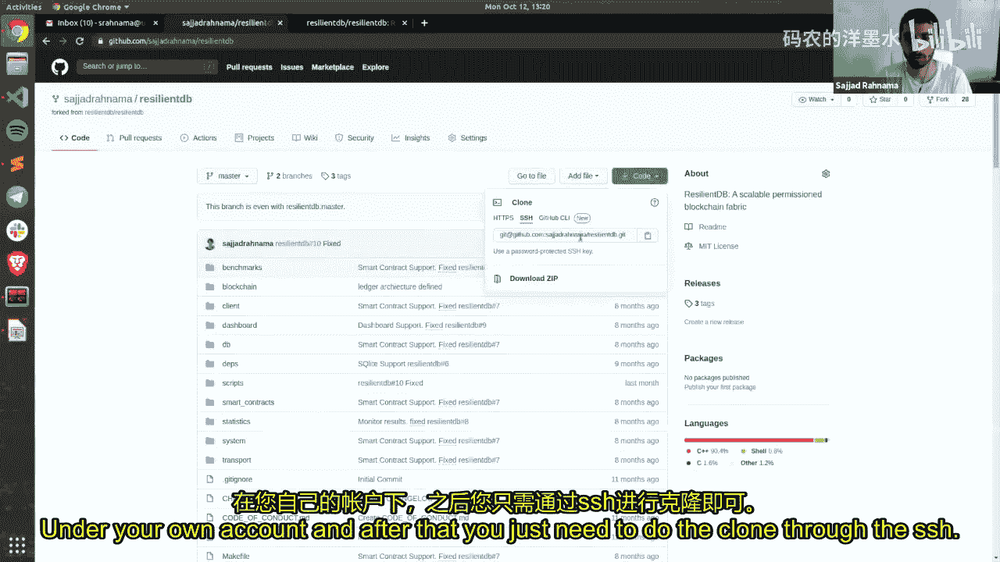

### 开发与调试技巧

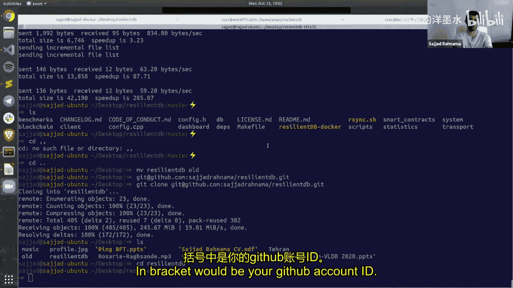

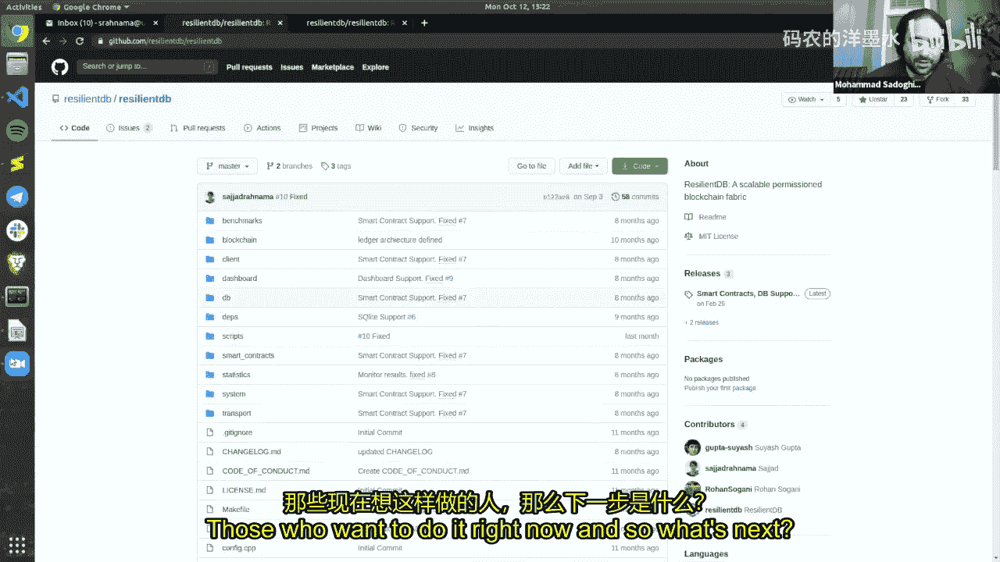

*   **添加打印语句**：在关键函数中添加 `cout` 打印（如我们演示的在 `process_client_batch` 中添加打印），是理解代码执行流的最直接方法。
*   **理解流水线**：ResilientDB采用多线程流水线设计。例如，可能有独立线程处理客户端请求、处理共识消息、执行交易等。性能统计中显示的各个线程的“空闲时间”有助于分析系统瓶颈。
*   **修改与测试**：修改代码后，只需重新编译 (`make clean && make -j`)，因为Docker容器共享工作目录，二进制文件会自动更新。然后可以像之前一样，在独立的终端中分别启动每个容器节点来观察修改效果。

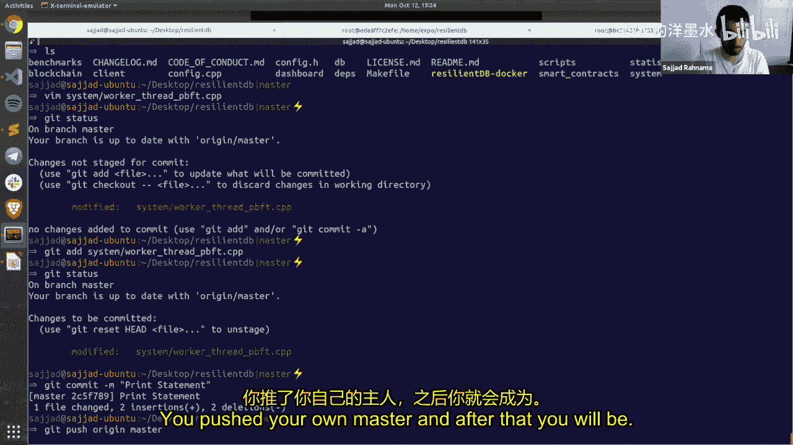

### 如何参与贡献

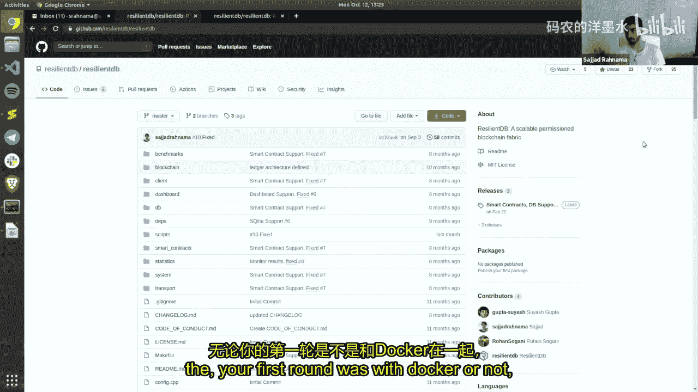

1.  **Fork代码库**：访问 [ResilientDB GitHub](https://github.com/resilientdb/resilientdb) 页面，点击Fork按钮，将代码库复制到你的账户下。
2.  **克隆与修改**：
    ```bash
    git clone git@github.com:<你的GitHub用户名>/resilientdb.git
    cd resilientdb
    # 创建新分支并进行修改
    ```
3.  **提交与推送**：
    ```bash
    git add .
    git commit -m “描述你的修改”
    git push origin <你的分支名>
    ```
4.  **发起拉取请求（PR）**：在你的GitHub仓库页面，点击 “Pull Request”，向官方ResilientDB仓库提交合并请求。经过审核后，你的代码可能被并入主分支。

---

## 总结 🎯

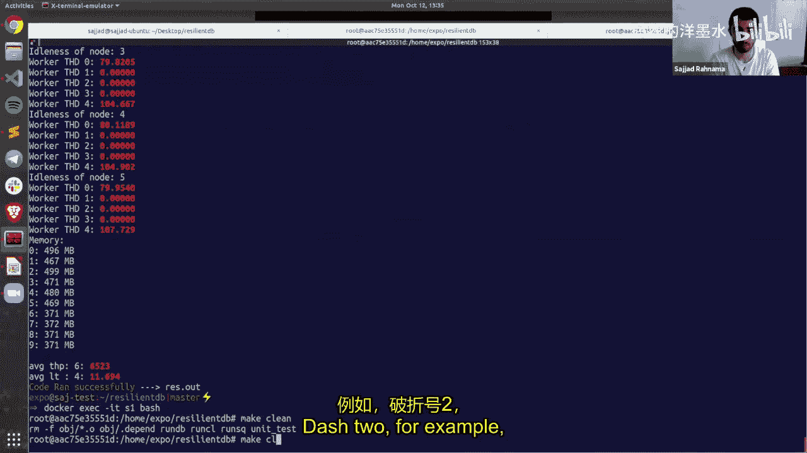

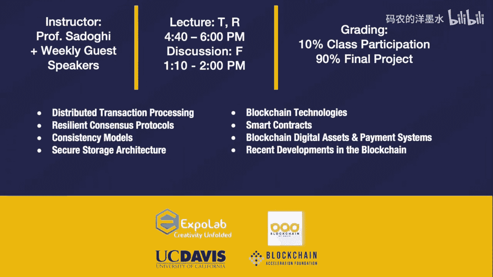

本节课我们一起学习了ResilientDB区块链平台。我们首先了解了它的背景和核心架构，特别是其多线程流水线设计。然后，我们学习了如何使用Docker脚本快速搭建一个多节点的PBFT共识网络进行演示。最后，我们深入代码层面，追踪了PBFT协议从客户端请求到交易执行的核心工作流，并介绍了如何通过添加打印语句、理解消息处理循环来开始自己的开发工作。ResilientDB作为一个研究原型，代码结构相对清晰，是学习分布式共识和区块链实现的优秀平台。