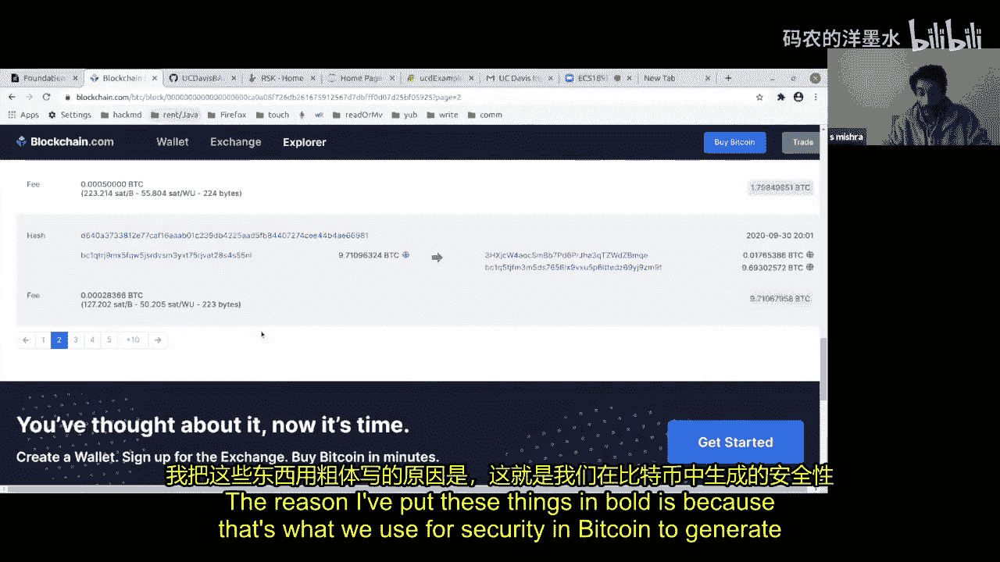
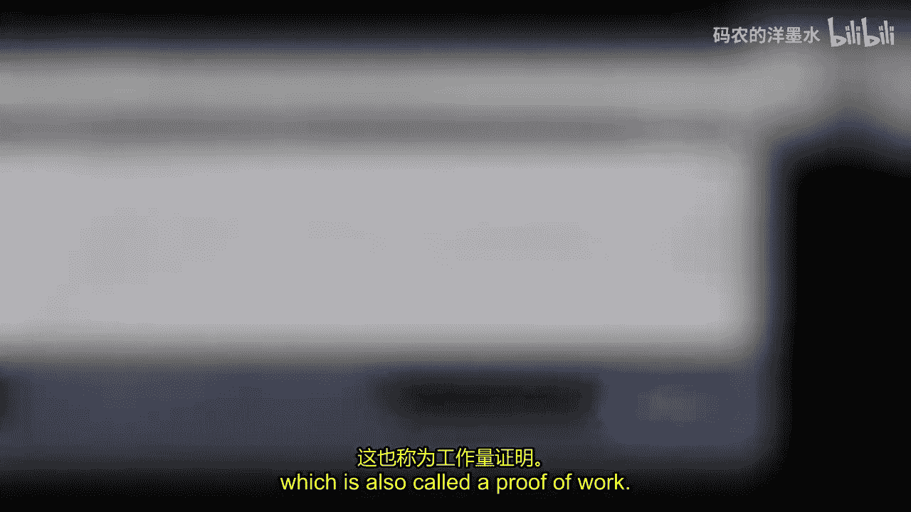
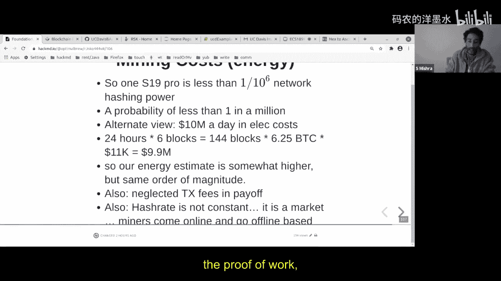
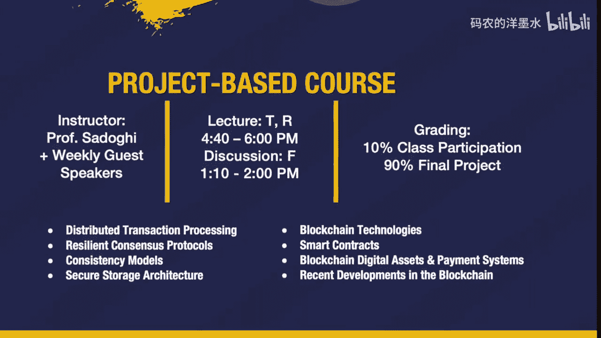

# 005：比特币的核心原理 🧱


在本节课中，我们将要学习比特币的基本原理，包括其核心概念、交易结构、工作量证明机制以及如何验证交易。我们将从密码学基础开始，逐步深入到比特币如何解决双重支付问题。

## 概述

比特币是第一个成功实现去中心化、无需信任任何中央机构的加密货币。它的核心在于利用密码学和时间戳服务器（区块链）来创建一个公开、不可篡改的交易账本。本节课将解析比特币如何运作，以及其背后的关键设计思想。

## 密码学基础

在深入比特币之前，我们需要理解两个基础的密码学概念：哈希函数和公钥密码学。

### 哈希函数

哈希函数是一种单向函数，它将任意长度的输入数据映射为固定长度的输出（哈希值）。关键特性是：
*   **单向性**：从哈希值几乎不可能反推出原始输入。
*   **抗碰撞性**：很难找到两个不同的输入产生相同的哈希值。
*   **雪崩效应**：输入的微小变化会导致输出哈希值的巨大差异。

比特币主要使用 **SHA-256** 哈希函数。以下是一个简单的Python示例，展示了输入微小变化如何导致完全不同的哈希输出：

```python
import hashlib

# 原始字符串
original = "Hello Bitcoin"
print(hashlib.sha256(original.encode()).hexdigest())

# 添加一个空格
modified1 = "Hello  Bitcoin"
print(hashlib.sha256(modified1.encode()).hexdigest())

# 删除一个字母
modified2 = "Hell Bitcoin"
print(hashlib.sha256(modified2.encode()).hexdigest())
```

### 公钥密码学与数字签名

公钥密码学使用一对密钥：**私钥**和**公钥**。
*   **私钥**：一个保密的巨大随机数，用于生成签名。
*   **公钥**：由私钥通过特定算法（如椭圆曲线加密）派生而来，可以公开。
*   **核心特性**：用私钥签名的信息，可以用对应的公钥验证，但无法从公钥推导出私钥。

在比特币中，数字签名主要用于**签署交易**，以证明你对某些比特币的所有权。签名本身通常由一对值（`r`, `s`）组成。

上一节我们介绍了支撑比特币的密码学基础，本节中我们来看看比特币本身是如何被定义和构成的。

## 比特币是什么？

根据其白皮书，比特币是一个**点对点的电子现金系统**。它并非第一个加密货币，但是第一个成功实现以下目标的：
*   完全去中心化，不依赖任何中央权威机构（如中央银行）。
*   使用密码学来控制和创建货币单位。
*   解决了电子货币中的核心安全问题——**双重支付**。

在比特币系统中，“硬币”并非物理实体，而是**数字签名的信息链**。每一枚“硬币”实际上代表一笔交易的输出，其价值可以是任意的（但有一个最小单位，即1聪，等于一亿分之一比特币）。





## 交易、区块与区块链

理解了比特币的基本定义后，我们来拆解其数据结构的三个核心组成部分。

### 交易

一笔交易（Transaction）就是一次所有权的转移。它包含：
*   **输入**：引用你之前收到的、尚未花费的比特币（称为UTXO - 未花费交易输出）。
*   **输出**：指定新的接收者地址和金额。
*   **签名**：使用你的私钥对交易进行签名，以授权这笔支出。

**关键规则**：所有输出的总价值必须**小于或等于**所有输入的总价值。差额部分将作为**交易费**奖励给打包该交易的矿工。

### 区块

区块（Block）是一个**交易容器**。矿工大约每10分钟收集网络上的交易，将它们打包成一个区块。区块中还包含一些元数据，如时间戳、前一个区块的哈希等。

### 区块链

区块链（Blockchain）通过密码学哈希将区块按顺序链接起来。每个区块的头部都包含前一个区块的哈希值，形成一条链。这种结构使得篡改历史记录变得极其困难，因为要修改一个区块，就必须重新计算该区块之后所有区块的工作量证明。

## 工作量证明与挖矿

我们知道了交易被打包进区块，区块又链接成链。那么，谁有权创建新区块并将其添加到链上呢？这就是**工作量证明**机制要解决的问题。

### 工作量证明的原理

矿工通过解决一个计算密集型难题来竞争创建新区块的权利。这个难题是：找到一个随机数（Nonce），使得区块头数据的双重SHA-256哈希值满足特定条件（例如，哈希值的前若干位是0）。

这个过程可以表示为寻找一个 `Nonce`，使得：
`SHA256(SHA256(BlockHeader)) < Target`
其中 `Target` 是一个由网络难度决定的目标值。

### 挖矿过程

以下是计算区块哈希所需的主要字段：
1.  **版本号**
2.  **前一个区块的哈希**
3.  **Merkle根**（本区块所有交易的哈希树根）
4.  **时间戳**
5.  **难度目标**
6.  **随机数**

矿工不断改变随机数（Nonce）并计算哈希，直到找到满足条件的解。第一个找到解的矿工将其区块广播到网络。其他节点验证该区块有效后，会将其接受为最长链（实为最重链，即累计工作量最大的链）的一部分，并开始基于这个新区块竞争下一个区块。

### 难度调整

网络大约每2016个区块（两周）调整一次难度目标，以确保平均出块时间保持在10分钟左右。如果全网算力增加，难度会相应提高，反之亦然。

上一节我们解释了矿工如何通过工作量证明获得记账权，本节中我们来看看网络如何利用这种机制达成共识并保证安全。

## 共识、安全与激励

比特币网络通过经济激励和密码学保证，使分散的节点能够就交易历史达成一致。

### 最长链共识

节点总是将**累计工作量最大**的区块链视为有效链。当出现临时分叉（两个矿工几乎同时找到有效区块）时，节点会在先收到的区块上继续工作。随着后续区块的添加，总有一条链会变得更长（更重），另一条就会被网络抛弃。这实质上是一种基于计算力的投票机制。

### 安全性分析

攻击者想要篡改交易（例如双重支付），需要“改写”历史。这意味着他需要从目标区块开始，重新计算所有后续区块的工作量证明，并且速度要快过诚实网络，才能使自己的链成为最长链。这需要掌握全网**超过50%** 的算力（51%攻击）。

**重要限制**：即使攻击者拥有超过50%的算力，他也只能：
*   阻止新交易被确认。
*   逆转他自己发出的交易（双重支付）。
*   **他无法盗取他人的比特币**，因为他没有他人的私钥来签署交易。

### 经济激励

矿工维护网络的动力来自**区块奖励**和**交易费**。
*   **区块奖励**：当前每个新区块奖励6.25个新比特币（约每4年减半一次，总量上限为2100万）。
*   **交易费**：由交易发起者支付，鼓励矿工优先打包其交易。

这种设计将网络安全与矿工的经济利益绑定在一起。

## 交易验证与简化支付验证

对于不运行全节点的用户（如手机钱包），如何在不下载整个区块链的情况下验证一笔交易呢？这依赖于**Merkle树**和**简化支付验证**。

### Merkle树

Merkle树是一种二叉树，其中：
*   **叶子节点**：是区块中所有交易的哈希值。
*   **非叶子节点**：是其两个子节点哈希值的哈希。
*   **根节点**：称为Merkle根，被包含在区块头中。

任何对交易的修改都会导致其哈希值变化，并层层向上传递，最终改变Merkle根。因此，Merkle根可以唯一地代表该区块中的所有交易。

### 简化支付验证

SPV钱包只存储区块头（约80字节），而不存储完整的交易数据。要验证一笔交易是否被包含在某个区块中，它只需要：
1.  获取该笔交易的哈希。
2.  从全节点获取一个**Merkle路径**（即从该交易哈希到Merkle根路径上所需的所有兄弟节点哈希）。
3.  利用这些哈希值重新计算Merkle根。
4.  将计算结果与区块头中的Merkle根进行比较，如果匹配，则证明交易确实存在于该区块中。

这种方法使得轻量级客户端能够以极小的存储和带宽开销进行有效的交易验证。

## 总结

本节课中我们一起学习了比特币的核心原理。我们从密码学基础开始，了解了哈希函数和数字签名的作用。接着，我们探讨了比特币作为点对点电子现金系统的本质，以及其通过交易、区块和区块链组织数据的方式。



我们深入分析了**工作量证明**机制，这是比特币实现去中心化共识和安全性的基石，它通过计算竞赛来决定记账权并防止双重支付。我们还了解了网络的**共识规则**（遵循最长/最重链）和**经济激励**模型（区块奖励和交易费）。



最后，我们学习了如何使用**Merkle树**和**简化支付验证**，使得用户无需运行全节点也能安全地验证交易。比特币的精妙设计在于它综合运用了密码学、博弈论和分布式系统理论，创造了一个无需信任第三方即可可靠运行的金融系统。