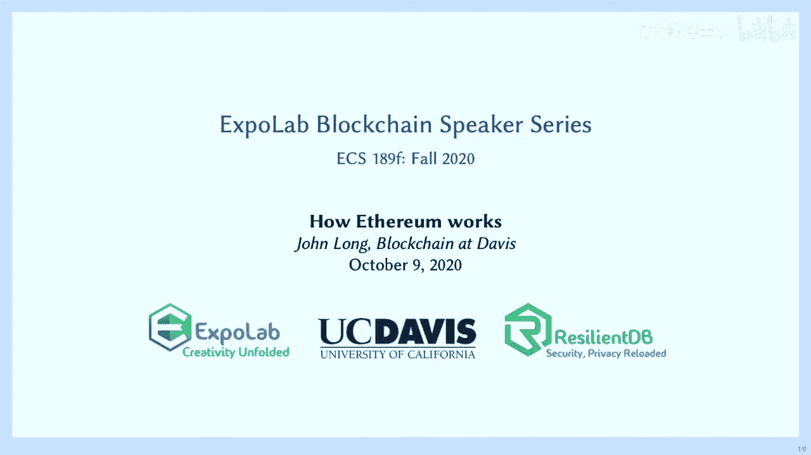
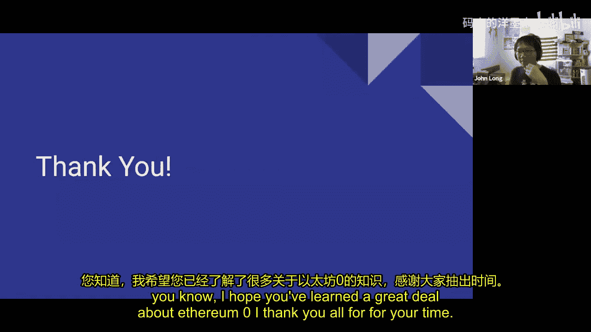
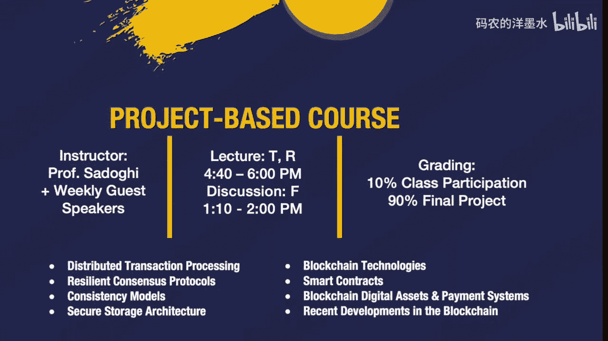

# 006：以太坊的工作原理

## 概述

在本节课中，我们将学习以太坊的工作原理。我们将从历史背景开始，了解以太坊在加密货币生态系统中的位置，然后深入探讨其核心概念，特别是智能合约。我们还将比较以太坊与比特币的异同，并分析以太坊的独特架构、优势以及当前面临的挑战。

## 历史背景与定位

上一节我们介绍了区块链的基本概念。本节中，我们来看看以太坊是如何诞生和发展的。

比特币在2008-2009年间由中本聪推出，证明了去中心化共识的可行性。随后几年，出现了大量“山寨币”，它们分叉比特币代码并尝试解决比特币的某些问题，如激励模型、中心化风险等。

2014年，以太坊由Vitalik Buterin等人创立。Buterin的想法是利用区块链技术构建**去中心化应用**。这些应用不依赖于单一服务提供商。他还认识到需要一个更强大的脚本语言。比特币的脚本语言`Script`功能有限，无法编写复杂应用。以太坊旨在提供一个功能更完备的平台。

以太坊的发展经历了一系列里程碑：
*   **前沿（Frontier）** 和 **家园（Homestead）**：初始发布阶段，旨在确保网络稳定运行。
*   **拜占庭（Byzantium）** 和 **君士坦丁堡（Constantinople）**：旨在解决可扩展性和安全性问题。
*   **宁静（Serenity / 以太坊 2.0）**：一次重大的协议升级，旨在提升网络的安全性和吞吐量。这些升级有时需要通过**硬分叉**来实现，即所有节点都必须更新协议。

## 与比特币的相似之处

如果你了解比特币的架构，会发现以太坊在某些方面与之相似。

*   两者都使用由区块通过哈希值链接而成的链式结构。篡改一个区块会使之前的所有区块失效。
*   两者都可能出现**孤块**，即同时提交两个有效区块，最终由更长的链胜出。
*   两者都采用基于挖矿的激励模型，通过消耗计算能力来验证交易。
*   两者都依赖**节点**来保存区块链副本，并负责验证和传播交易，以保持网络同步。

## 核心创新：智能合约

尽管有上述相似之处，但以太坊的“秘密武器”是**智能合约**。

首先，我们理解传统合约。传统合约是至少两方之间的协议，通常需要一个可信的第三方（如银行）来认可和执行。如果合约被违反，会有相应的惩罚机制。但传统模型有一个明显缺陷：第三方可能被贿赂或本身不可信。

1990年代，学者尼克·萨博提出了**智能合约**的概念。它仍然是多方之间的协议，但执行者不再是可能被收买的人，而是由机器或计算机自动执行。他举的例子是自动售货机：投入硬币，自动获得商品，无需人工干预。

以太坊将这一概念与区块链技术结合，实现了由区块链技术执行的智能合约。关键在于**图灵完备性**的脚本语言，这使得在区块链上开发复杂应用成为可能。

以下是智能合约在以太坊中的工作原理：
1.  **编写与编译**：开发者使用高级语言（如**Solidity**）编写合约代码，然后将其编译成以太坊虚拟机（EVM）可以理解的**操作码**。
2.  **部署**：编译后的代码会“搭载”在一笔交易中被发送到网络。节点能识别出这不是普通的转账交易，而是一个待执行的合约单元。
3.  **创建地址**：该智能合约会被分配一个唯一的**地址**。通过这个地址，用户可以调用合约的功能或与其交互。
4.  **全网执行**：**所有**以太坊节点都会执行这份合约代码，而不是仅由部分节点执行。这确保了去中心化和一致性。

智能合约的用途广泛，例如：
*   创建代表企业所有权的**代币**。
*   构建**托管**应用，在满足特定条件或多方签名后自动释放锁定的资金。

## 以太坊节点与EVM

上一节我们介绍了智能合约的概念。本节中，我们来看看运行这些合约的底层环境——以太坊节点和以太坊虚拟机。

以太坊节点不仅存储区块链副本，还能执行代码。每个节点都包含一个**以太坊虚拟机**。

EVM是一个功能极简的虚拟机：
*   它只有不到255个操作码（指令）。
*   它是**基于栈**的计算机模型。
*   它在**沙盒环境**中运行，与主机计算机隔离，以防止恶意合约攻击系统。
*   它支持**并发**但不支持**并行**。所有节点同时执行相同的合约（并发），但无法将一个计算任务拆分给不同节点同时处理以加快速度（并行）。

关于程序长度限制和防止恶意攻击：以太坊通过 **Gas** 机制来解决。用户无法上传无限循环的程序来瘫痪网络，因为执行每一步操作都需要消耗Gas，而Gas需要购买。

## Gas 与 Ether

这是一个关键概念。**Ether** 是以太坊的原生加密货币单位，就像比特币中的“BTC”。而 **Gas** 是**计算工作的计量单位**。

*   智能合约中的每一个操作（如加法、哈希计算）都有其对应的Gas成本。
*   用户需要支付Ether来购买Gas，以支付合约执行所需的计算资源。
*   网络内部处理Ether与Gas的兑换，用户不能在交易所直接交易Gas。

为什么要把计算单位（Gas）和货币单位（Ether）分开？主要是为了**将效用与市场波动性分离**。加密货币价格波动剧烈，如果应用性能直接受币价影响，会非常不稳定。Gas价格相对稳定，确保了网络计算能力不受币价短期波动的过大冲击。

一个常见的类比是：开车需要汽油（Gas），但你用钱（Ether）来购买汽油。

## 去中心化应用与DAO

智能合约可以相互调用和组合，从而构建出**去中心化应用**。DApp完全运行在以太坊区块链上，不依赖任何中心服务器。即使一半的网络节点失效，应用仍可继续运行。

DApp催生了一种新型组织：**去中心化自治组织**。DAO的组织规则被编码为智能合约。
*   例如，管理者的薪酬支付可能取决于股东投票或特定业绩指标的达成。
*   代币持有者可以通过投票决定公司的发展方向。
*   资金被锁定在智能合约中，只有在完成预定工作后才会支付。

这减少了人为干预，降低了腐败的可能性。

## 以太坊的架构特点

了解了核心组件后，我们再来看看以太坊其他一些重要的架构特点。

1.  **动态区块大小**：以太坊的区块大小不是固定的（比特币约为1MB）。它由区块内所有交易和数据的**Gas总量上限**决定（目前约为1000万Gas）。矿工可以集体投票调整每个区块的Gas上限，从而间接影响区块大小。这带来了更快的交易确认时间。
2.  **挖矿算法**：目前采用**工作量证明**，但将很快转向**权益证明**。它使用的哈希算法是**Ethash**，这是一种内存密集型算法，旨在抵制专门为挖矿设计的ASIC芯片，促进去中心化。
3.  **难度炸弹**：代码中内置了难度定期急剧上升的机制，以抑制挖矿权力的过度集中。
4.  **叔块奖励**：在比特币中，同时产生的有效孤块被丢弃，矿工得不到奖励。在以太坊中，这些区块被称为**叔块**，开采它们的矿工可以获得**部分奖励**。这降低了矿工加入大型矿池的动机，有助于防止51%攻击。

## 挑战与局限性

尽管功能强大，以太坊也面临诸多挑战。

1.  **可扩展性三难困境**：区块链难以同时完美实现**去中心化**、**安全性**和**可扩展性**。以太坊目前更侧重于前两者。
2.  **速度限制**：以太坊并非为高性能计算设计。它支持高并发（容错性好），但不支持并行计算（拆分任务加速处理）。
3.  **不可升级性与状态爆炸**：智能合约一旦部署就难以修改，发现漏洞后通常需要部署新合约并迁移用户。此外，随着DApp和交易的增长，区块链数据量已超过1TB，运行全节点的硬件要求越来越高，影响了去中心化程度。
4.  **预言机问题**：这是智能合约的一个根本性限制。**智能合约无法主动获取区块链外部的真实世界数据**。例如，一个“如果明天下雨就付款”的合约，需要可靠的方式将天气数据输入链上，而这在去中心化、需验证的环境中非常困难。

## DAO事件：一个关于不可变性的案例

2016年的“The DAO”事件是以太坊历史上的一次重大危机。一个众筹DAO的智能合约存在漏洞，被黑客盗取了大量ETH。社区面临两难选择：
*   **不进行分叉**：遵守“代码即法律”和不可变性原则，但投资者蒙受损失。
*   **执行硬分叉**：回滚交易，挽回损失，但这违背了区块链不可篡改的核心原则。

最终，以太坊社区执行了硬分叉，但一部分社区成员拒绝接受，继续维护原来的链，这就是**以太坊经典**。这一事件凸显了智能合约安全性的极端重要性，以及在实际操作中与“不可变性”原则妥协的复杂性。

## 未来展望：以太坊 2.0

最后，我们以积极的眼光看看以太坊的未来发展——以太坊 2.0。

1.  **权益证明**：将从耗能的工作量证明完全转向**权益证明**。用户通过锁定一定数量的ETH成为验证者，负责验证交易。作恶将导致质押的ETH被罚没。这更加节能，但可能带来财富集中化的问题。
2.  **分片**：这是解决可扩展性的关键方案。将主区块链拆分成多个**分片链**，交易被分配到不同的分片上并行处理，从而大幅提升网络吞吐量。
3.  **信标链**：在分片架构中，需要一个协调层来管理验证者和确保各分片之间的通信与最终一致性，这就是**信标链**的角色。

## 总结

本节课中，我们一起学习了以太坊的工作原理。我们从其历史背景和与比特币的对比入手，深入探讨了其核心创新——智能合约，以及支撑它的EVM和Gas机制。我们了解了DApp和DAO如何构建在以太坊之上，并分析了其动态区块、叔块奖励等架构特点。同时，我们也正视了以太坊在可扩展性、速度、预言机问题等方面面临的挑战。最后，我们展望了以太坊 2.0 通过权益证明和分片等技术带来的未来可能性。以太坊作为一个活跃的开发平台，仍在不断演进，以平衡去中心化、安全与效率之间的关系。