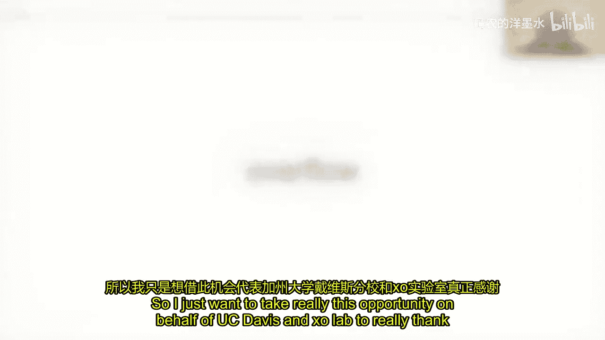
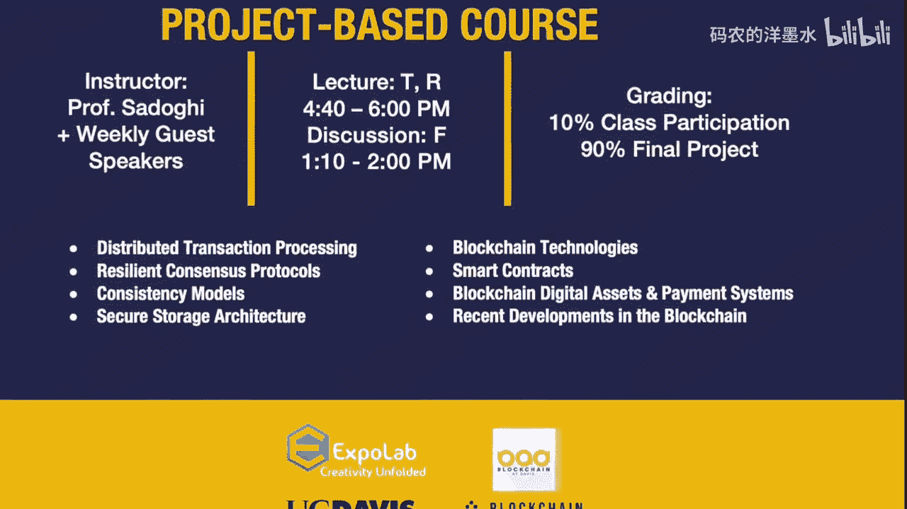

# 007：Diem (原Libra) 核心原理 🧱

在本节课中，我们将学习由Dahlia Malki主讲的Diem（原Libra）支付网络的核心原理。我们将了解Diem如何作为一个受监管、分布式且基于区块链的平台，旨在创建一个简单、包容、高效的全球支付系统。

## 概述

Diem的使命是创建一个简单、包容、高效的支付平台，让全球任何拥有智能手机的人都能使用其支持的货币和金融服务。Diem支付网络本质上是一个基于区块链的系统，用于记录支付历史、追踪账户余额，并支持一系列单币种稳定币及其相关金融服务。

为了在全球范围内实现这一颠覆性目标，Diem需要获得用户、金融界和监管机构的信任。这主要通过三个支柱来实现：创建一个高效的日常交易媒介；建立坚实的技术和经济基础；以及构建一个能够持续发展、具有分布式和包容性治理能力的框架与组织。

## 区块链架构的演变与Diem的创新

上一节我们介绍了Diem的使命和信任支柱。本节中，我们来看看Diem在区块链演进历程中的独特定位。

传统的加密货币系统（如比特币、以太坊）通常从完全去中心化、无监管的基础设施起步，其价值创造机制依赖于网络参与者的挖矿或质押，主要作为价值存储而非交易媒介。这导致了流动性和波动性问题。随后，出现了在底层去中心化基础设施之上运作的Layer 2服务（如USDC、DAI），它们以中心化、受监管的方式发行稳定币，仅将底层链用于透明结算。

Diem则完全不同，其所有三个层面（基础设施、价值创造、金融服务）都设计为分布式且从一开始就寻求获得许可。整个系统由Diem协会及其成员分布式控制和运营，旨在成为一个获得许可的全球交易媒介和支付平台。

## Diem平台技术概览

理解了Diem的定位后，我们深入其技术架构。以下是Diem平台及其组件的一个概览：

*   **Diem区块链**：位于最底层，是一个复制交易历史的机制。
*   **Diem框架**：位于区块链之上，是一组定义参与者如何与区块链交互、请求更改账本状态的规则。它由经过测试和审查的软件模块组成，使用专为金融资产安全处理而设计的Move语言编写。
*   **参与者与层级**：
    *   **Diem Networks**：运营储备金，是链上唯一可以创建和销毁代币资源的实体，通过协会运营服务进行操作。
    *   **指定交易商**：通常是银行，负责与储备金进行法币与代币的兑换（铸造和销毁操作），为网络提供流动性。
    *   **虚拟资产服务提供商**：包括钱包和流动性提供商，它们从指定交易商处获取代币并为终端用户服务。
    *   **终端消费者**：位于支付网络边界之外，通过VASP间接访问网络。

Diem通过将法币资产“代币化”引入其框架，实现了即时终结、即时结算、透明和包容性，使得资金流动不再受传统银行系统边界的限制。

## 共识、治理与系统演进

Diem区块链采用基于许可的验证者集合，每个验证者都是经过严格筛选、能够提供高可靠服务的实体。这构成了一个拜占庭容错复制系统，具备零恢复时间的高可用性，并通过合同确保部署的地理和行政多样性，避免单点故障。

系统的治理和演进能力至关重要。Diem区块链是一个自我治理的系统，其创世区块包含了更改几乎所有方面的规则（如验证者集合、网络参数、软件模块）。系统演进通过“重新配置交易”实现，有两种路径：

*   **常规路径**：像开源项目一样运作，通过Diem改进提案流程进行社区讨论和升级，需要三分之二验证者确认新软件版本后生效。
*   **紧急路径**：针对安全或合规性紧急问题，由持牌的Diem Networks公司执行快速修复。

这种设计将决策权（协会和技术指导委员会）与安全执行权（验证者节点）分离，结合了联盟治理的效率和BFT共识的安全执行保障。

## 铸造与销毁机制

为了保证代币始终有足额法币支持，Diem设计了安全的铸造与销毁协议，遵循“付款交割”原则。

以下是铸造流程：
1.  指定交易商向协会运营服务请求预铸造授权。
2.  指定交易商进行法币转账。
3.  AOS监控并确认转账后，立即在链上执行铸造操作，并将代币发送给指定交易商。

以下是销毁（赎回）流程：
1.  指定交易商向AOS发送赎回订单。
2.  AOS确认有足够法币可用于支付。
3.  指定交易商将代币转移到链上仅由储备金控制的“预销毁”账户。
4.  法币转账确认后，储备金权限将预销毁账户中的代币永久销毁。若法币转账失败，代币可被退回。

## 核心技术深度探讨：HotStuff共识与创新

Diem区块链的核心共识协议基于HotStuff。HotStuff的灵感来源于中本聪共识，它通过链式区块和需2f+1投票的法定人数证书来工作。等待连续三个这样的QC可以保证唯一性，避免分叉。该协议线性高效，且对异步网络安全。

在HotStuff基础上，Diem进一步引入了**乐观高弹性BFT协议**。通过让投票同时成为“强投票”（声明自某个区块后未对冲突区块投过票），系统可以合并多个QC中的投票，从而在实际攻击发生时，获得高于传统1/3故障容忍度的弹性（例如接近2/3）。这是一种根据实际攻击模式（主动腐败 vs. 良性崩溃）优化弹性边界的新思路。

## 系统性测试：Twins方法

测试拜占庭系统极具挑战。Diem团队提出了创新的“Twins”方法，用于系统化模拟拜占庭攻击。

其核心思想是：最有趣的攻击是内部攻击，即利用正确代码但通过微妙修改产生恶意行为。Twins方法通过为每个故障节点部署一对“双胞胎”实例来实现。它们共享相同的凭证和网络地址，但内部状态独立。这样，无需修改代码，仅通过配置就能系统化地产生诸如“双重提案”、“违背锁定规则”等复杂攻击行为。

Twins框架包含一个网络模拟器和场景生成器，可以自动生成并执行攻击场景。它已成功用于发现新协议漏洞、复现已知攻击，并对Diem自身系统进行加固验证。这为BFT协议测试开辟了新的系统化方向。

## 总结

本节课我们一起学习了Diem支付网络的核心原理。我们从其创建包容性全球支付平台的使命出发，探讨了它在区块链演进中的独特定位——一个从底层开始就寻求许可、分布式治理的体系。我们深入了解了其技术架构，包括基于HotStuff共识的许可区块链、安全的铸造销毁机制，以及支持系统演进的治理模型。最后，我们还探讨了Diem在共识协议优化（乐观高弹性BFT）和系统测试（Twins方法）方面的前沿技术贡献。Diem的设计展示了如何将区块链技术的优势与金融系统所需的合规、稳定和信任相结合。