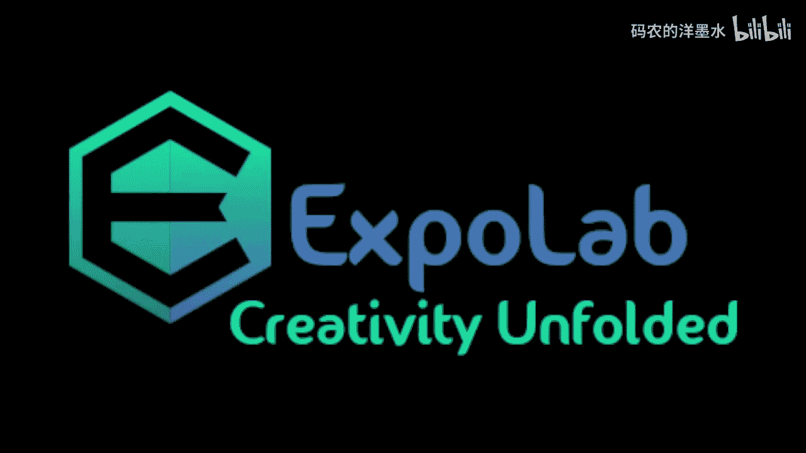
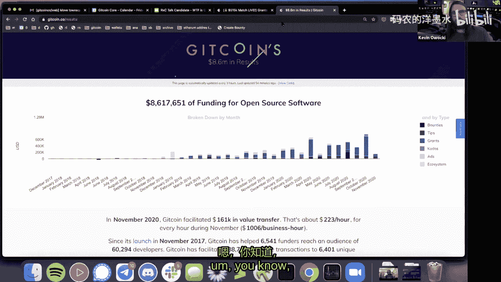
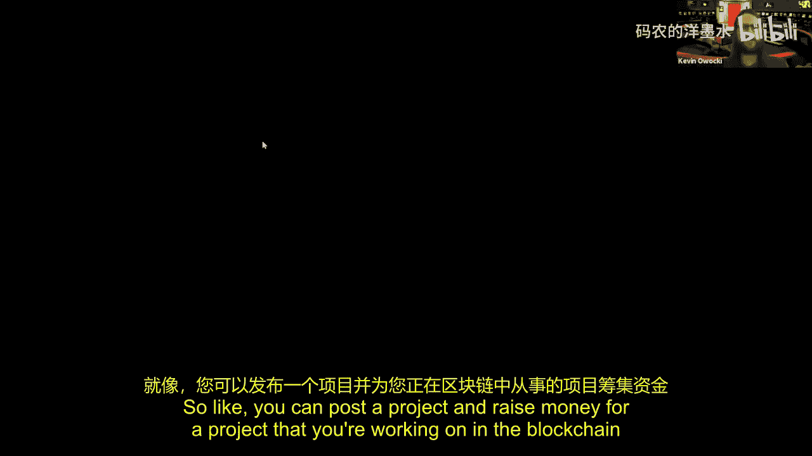
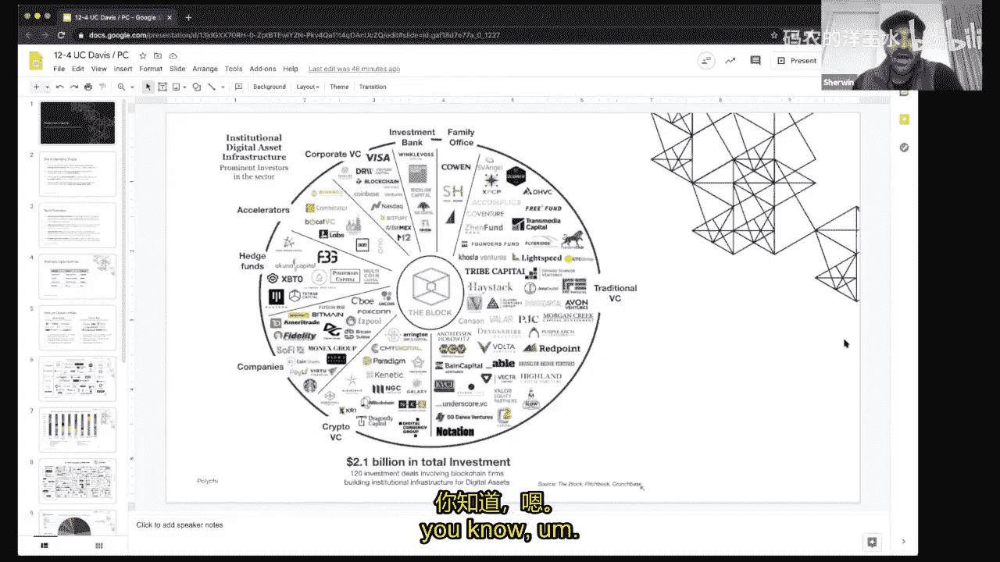
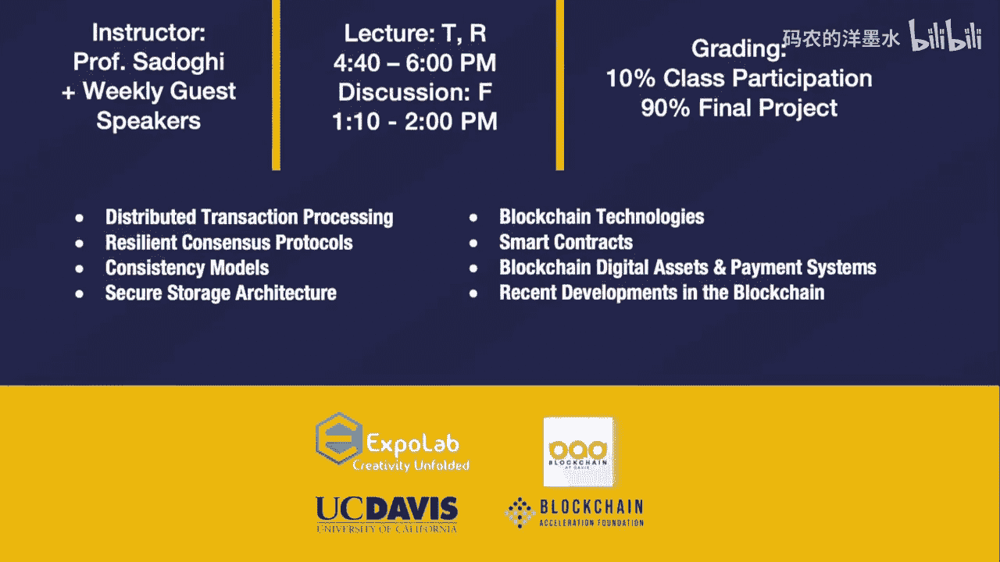

# 009：融资、Gitcoin资助与区块链投资

## 概述

在本节课中，我们将学习区块链生态系统中的融资机制与投资视角。课程将涵盖开源软件的资助模式、Gitcoin平台及其二次方融资机制，以及风险投资机构如何评估和投资区块链项目。我们将探讨这些机制如何共同支持开发者生态，并推动去中心化应用的创新。

---

## Gitcoin：为开源软件构建可持续商业模式

上一节我们介绍了区块链的基本架构，本节中我们来看看一个旨在支持开源软件和区块链开发者生态的具体平台——Gitcoin。

Gitcoin的使命是培育和维持开源软件的发展。开源软件是我们数字生态系统的基石，每年创造约5000亿美元的经济价值。Gitcoin致力于为开源软件开发者寻找可行的商业模式，目标是构建一个让每个人都有经济能力离开传统工作，全身心投入为开放互联网工作的世界。

自2017年成立以来，Gitcoin在过去24个月内已为开源软件提供了约800万美元的资助。其核心理念在于：信息互联网允许计算机在没有中介的情况下跨网络发送信息，从而颠覆了依赖信息的行业（如新闻、娱乐）。同理，金融互联网（区块链）允许在没有中介的情况下跨网络发送金融价值，这有望颠覆所有依赖金融价值的行业（如银行、投资、就业）。Gitcoin将自己视为“就业互联网”的先行者之一。

---

## 区块链的未来用例：超越DeFi

在了解了Gitcoin的使命后，我们自然会思考区块链技术除了当前的去中心化金融（DeFi）之外，还有哪些潜在的重大应用。

类比信息互联网的发展，雅虎采用图书馆卡片目录式的分类法，而谷歌则发明了搜索框，从根本上重新构想了信息的索引方式。区块链领域同样需要这种“第一性原理”思考：我们拥有区块链网络、智能合约、代币这些核心模块，如何以全新的方式组合它们，提供前所未有的价值？

一个令人兴奋的设计空间是“就业互联网”和社区工作。例如，Gitcoin运营的Kernel加速器正在探索一种模式：让同期学员的项目能够相互持有权益。这可以通过代币化实现，让每个人都能分享同期其他所有人项目的成功，从而从根本上改变团队间的激励与合作模式。这体现了区块链在协调和激励群体方面的新颖应用。

---

## Gitcoin Grants与二次方融资机制

那么，Gitcoin具体通过什么机制来资助项目呢？以下将介绍其核心平台：Gitcoin Grants。

Gitcoin Grants是一个为区块链开源项目募资的平台，类似于加密世界的Patreon。项目可以在平台上发布并筹集资金。其独特之处在于每季度进行的“匹配资金”轮次，该机制运用了“二次方融资”公式。

**二次方融资**是一种数学上最优的民主化公共物品融资方式。其核心公式是：项目获得的匹配资金与**贡献者数量的平方根之和**的平方成正比，而不是与贡献总额成正比。

简单来说，一个拥有大量小额捐助者的项目，会比一个拥有少量大额捐助者的项目获得更多的匹配资金。这种机制将权力从大型资金方分散到边缘的广大社区，使资助决策更加民主化。对于基础设施类公共产品，贡献者的广泛性比捐款总额更能体现其价值。

在Gitcoin Grants上，一笔1 DAI的小额捐赠，通过匹配池的放大，可能产生高达90美元的影响。这种机制激励了更多人参与资助，是区块链技术催生的全新融资原语。

---

## 区块链投资视角：Polychain Capital的策略

看完了社区驱动的资助模式，我们再来看看传统风险投资在区块链领域的视角和策略。

Polychain Capital是一家多策略加密基金，投资范围覆盖整个生态系统：
1.  **对冲基金**：交易比特币、以太坊等流动性加密货币。
2.  **风险投资**：投资早期公司的股权和代币。
3.  **孵化器**：从想法阶段帮助创始人孵化项目。
4.  **内部工程团队**：参与网络质押（Staking）和治理，是许多权益证明（PoS）网络最大的质押运营方之一。

其投资理念的核心是：加密货币和智能合约能够实现传统技术无法做到的事情——在没有中心化中介的情况下转移价值并协调激励。他们更关注**无需许可**的区块链，因为代币经济模型能提供传统企业区块链所缺乏的参与和安全性激励。

---

## 重点投资领域与去中心化自治组织（DAO）

Polychain的投资主要集中于几个关键领域：

以下是其重点关注的赛道：
*   **DeFi（去中心化金融）**：如借贷协议Compound、MakerDAO。
*   **交易基础设施与托管**：如托管服务商Anchorage。
*   **前沿协议**：如跨链网络Polkadot、存储网络Filecoin。
*   **隐私与密码学**：如隐私网络Oasis。
*   **研究与开发工具**：如DeFi风险建模平台Gauntlet。

其中，**去中心化自治组织（DAO）** 被认为是一个具有颠覆性的概念。DAO通过代币将网络的所有权赋予其用户和贡献者，而不是分离的公司股东。例如，在一个DAO化的“优步”中，司机会因为提供服务而实时获得网络代币奖励，其利益与网络的繁荣完全一致。这代表了“用户即所有者”的新型组织范式，与当前公司制截然不同。

---

## 无需许可区块链与代币激励的重要性

一个常被讨论的问题是：为何投资重心在无需许可的区块链，而非许可链（企业区块链）？

关键在于**经济激励与网络安全的内在联系**。在比特币或以太坊这样的网络中，矿工或质押者通过保护网络获得代币奖励。如果攻击网络，其持有的代币价值会受损，因此其经济利益与网络安全完全一致。这种经济约束使得篡改历史账本的成本极高。

相比之下，大多数许可链缺乏这种原生代币激励。参与节点没有足够的经济动力去投入资源保障网络安全，也难以形成去中心化的信任。因此，Polychain认为，将经济因素通过代币正确嵌入网络，是区块链技术发挥潜力的基础。企业区块链可能只是传统机构迈向这个新领域的过渡步骤。

---

## 总结

本节课我们一起学习了区块链生态中的关键融资与投资模式。
1.  我们探讨了**Gitcoin**如何通过社区资助和**二次方融资**支持开源软件，这是一种基于区块链的新型民主化融资机制。
2.  我们分析了风险投资机构如**Polychain Capital**的投资策略，他们专注于无需许可区块链，并看好**DeFi**、**DAO**等能够利用代币经济创造新激励模式的领域。
3.  我们理解了**代币经济模型**在协调激励、保障网络安全和推动创新方面的重要性，这是许多投资决策的核心依据。

这些机制共同构成了支撑区块链开发者生态和驱动技术前沿创新的金融基础设施。