# 010：稳定币与支付 💸

在本节课中，我们将要学习区块链领域中的两个核心主题：稳定币与支付。我们将探讨稳定币的不同类型、工作机制，并深入了解Celo网络如何利用其独特的架构和共识机制来构建一个面向移动端的、普惠的支付系统。

## 稳定币简介

上一节我们介绍了课程主题，本节中我们来看看什么是稳定币。从技术角度看，稳定币是一种加密货币，是一种设计在区块链上运行的数字货币。稳定币与其他加密货币的不同之处在于，其设计目的是为了最小化价格波动。对于比特币和以太坊等主流加密货币，价格波动是阻碍主流用户采用的最大摩擦之一。用户对价格的大幅波动感到不适。

稳定币为用户提供了一个在清算资产前暂时存放资金的场所，避免了直接兑换为法币可能产生的税务问题和高昂手续费。稳定币保持稳定的主要方式是将其价值与某种资产挂钩，目前最流行的挂钩资产是美元。

以下是几种稳定币的例子：
*   **Tether (USDT)**：目前最流行的稳定币。
*   **USD Coin (USDC)**：由Coinbase和Circle创建。
*   **MakerDAO的DAI**：最初最受欢迎的去中心化稳定币。
*   **Celo Dollar (cUSD)**：我们将在后面详细讨论。

## Tether与稳定币市场

在了解了稳定币的基本概念后，我们来看看一个具体的例子：Tether。Tether于2014年由Tether Limited公司创建。其核心理念是，每铸造1个USDT，Tether基金会（理论上）会在储备中持有1美元，以实现1:1的资产支持。

Tether在2014年发行时供应量很小，直到2017年随着比特币价格上涨，对稳定币的需求增加，它才真正流行起来。Tether的主要问题来自法律层面，例如关于其储备金是否充足的质疑，这暴露了由中心化实体持有法币储备的稳定币模型的潜在问题。

从交易量来看，稳定币市场自2017年起增长显著。根据Coin Metrics的报告，稳定币的总供应量已超过120亿美元，并且可能更高，这显示了稳定币市场的庞大规模。

## 稳定币的替代方案

上一节我们讨论了以法币为抵押的稳定币，本节中我们来看看其他替代方案。当我们谈论替代方案时，指的是那些试图使用法币支持其稳定币的1:1匹配模式，以及其他模型。

替代方案包括USDC、Gemini Dollar (GUSD) 和 MakerDAO。MakerDAO创造了第一个去中心化稳定币DAI，它最初不是由美元支持，而是由以太坊支持。用户可以将以太坊存入一个称为“抵押债仓”（CDP）的智能合约，并以此为基础借出DAI。它有一套复杂的机制来维持稳定，例如稳定费和清算机制。

Celo Dollar是去中心化稳定币的另一种变体，是Celo网络上的原生稳定币资产，同样与美元挂钩。我们将在后续讲座中详细讨论Celo。

## 市场压力下的稳定币表现

在介绍了不同类型的稳定币后，我们来看看它们在市场压力下的表现。2020年3月的事件非常有趣，当时新冠疫情、石油期货跌至负值等市场不确定性，导致一些稳定币出现了不稳定。

表现突出的例子包括Gemini USD，其价格一度跌至0.9美元左右，这是由于供应不足和流动性缺乏。DAI的价格则一度超过1.05美元，这是因为市场恐慌时，更多人想要清算他们的抵押头寸，加上网络拥堵和Gas费高昂，导致了DAI的短缺和价格上涨。MakerDAO事后对此现象进行了很多讨论，因为许多情况是之前未预料到的。

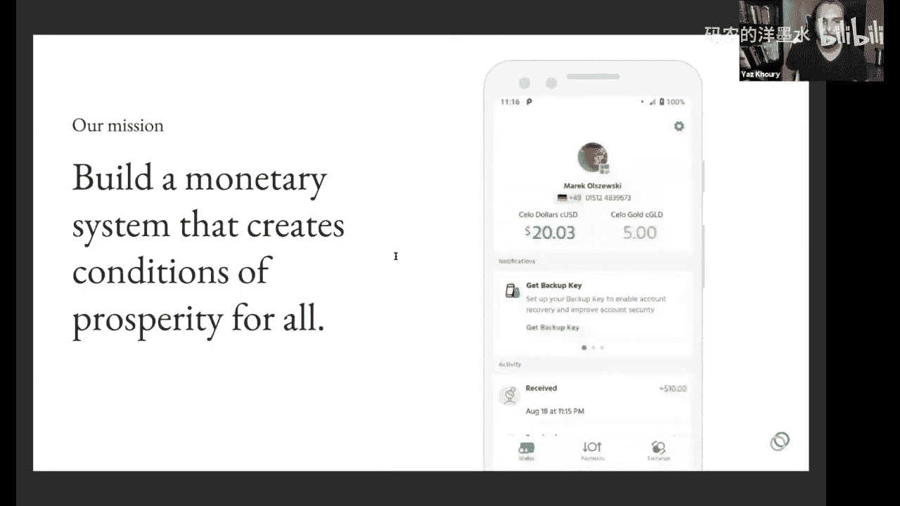

## 关于稳定币长期相关性的讨论

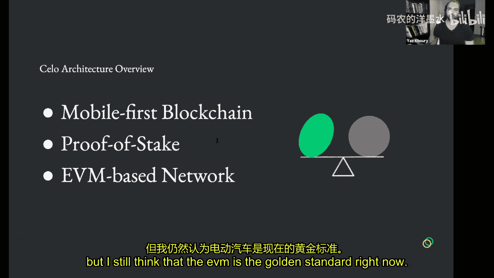

在深入Celo之前，有一个关于稳定币长期相关性的重要讨论。一个观点是，加密货币旨在取代我们现有的物理世界事物，例如不信任中心化机构。因此，投资于稳定币可能显得有些矛盾，因为稳定币似乎依赖于它试图取代的东西（如法币）。

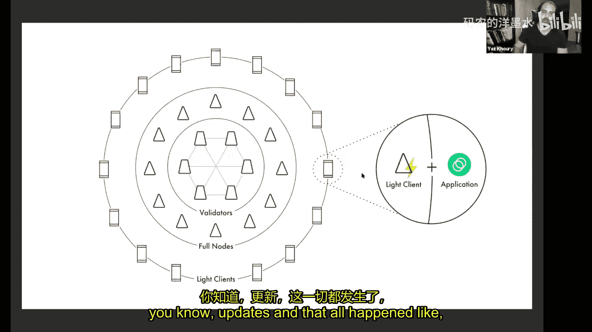

然而，稳定币的目标可能并非取代美元。从理论上讲，稳定币允许人们接触到其本国可能面临高通胀风险的稳定货币之外的选择。例如，USDC正被发送给受通货膨胀严重影响的委内瑞拉人。稳定币的承诺在于为“无银行账户者”提供银行服务，在全球那些人们无法轻易开设银行账户或购买美元的地区，提供对稳定货币的访问权限。

此外，对于交易者而言，稳定币提供了一个在不清算为法币、不产生税费的情况下，在加密生态内持有稳定价值资产的场所。

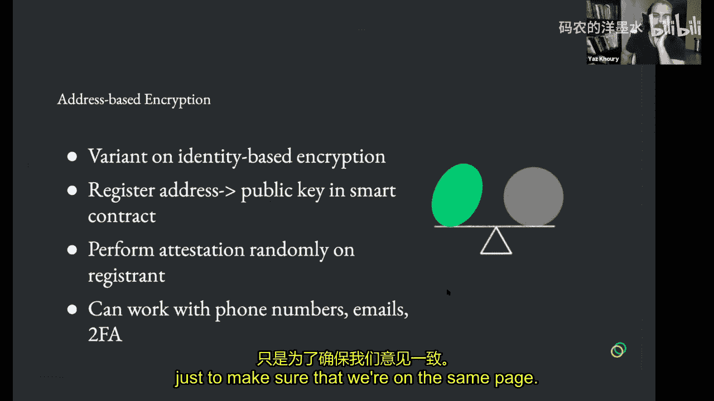

## Celo网络介绍

在讨论了稳定币的宏观背景后，我们现在将焦点转向Celo网络。Celo的使命是创建一个为繁荣创造条件货币体系。这里的“繁荣条件”是指让所有人，特别是那些受通货膨胀严重影响、无法开设美元账户或受到严格资金外流限制的人们，能够通过移动电话使用稳定币。

简而言之，Celo的产品Valora旨在创建一个“无需银行账户的Venmo”。Celo团队对这项使命的投入和 alignment 程度非常高。

## Celo架构概述

上一节我们介绍了Celo的使命，本节中我们来看看其技术架构。Celo是第一个以移动端为先的区块链，采用权益证明（PoS）共识机制。

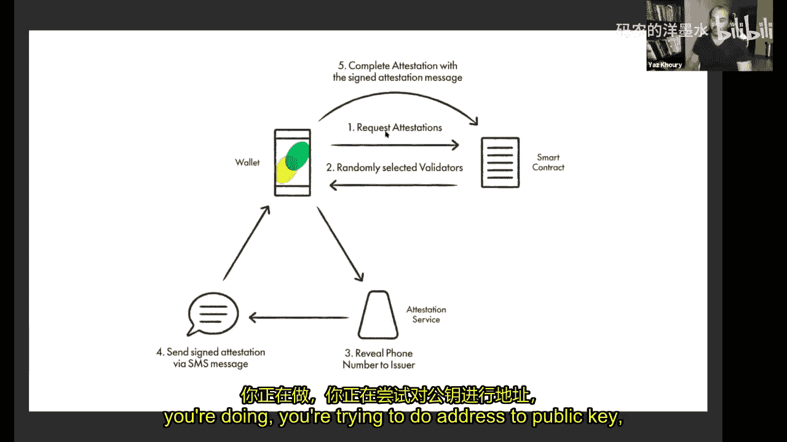

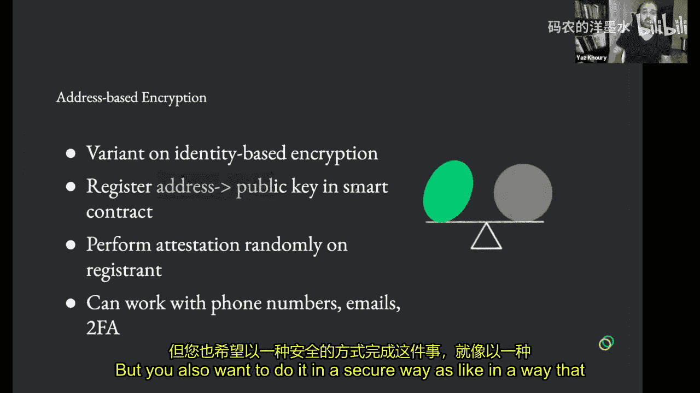

它是一个基于EVM（以太坊虚拟机）的网络，这意味着它可以运行Solidity或Vyper编写的智能合约。目前，EVM网络是智能合约的黄金标准。

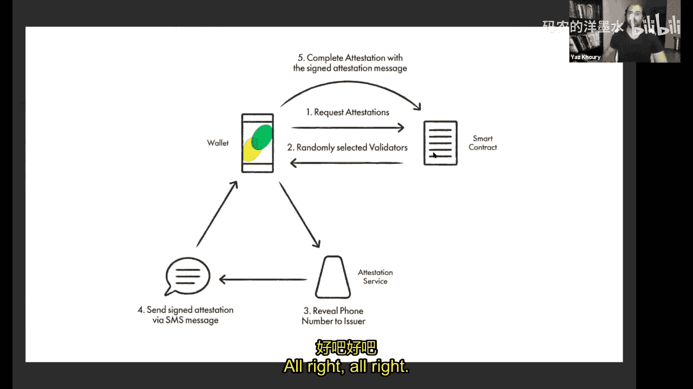

从高层架构看：
*   **验证器**：在PoS网络中，验证器负责打包交易、出块并获得奖励。
*   **全节点**：保存网络副本，使客户端能够获取交易历史。
*   **客户端**：在移动端，应用程序发起交易，交易被发送到网络，由验证器处理并最终上链。

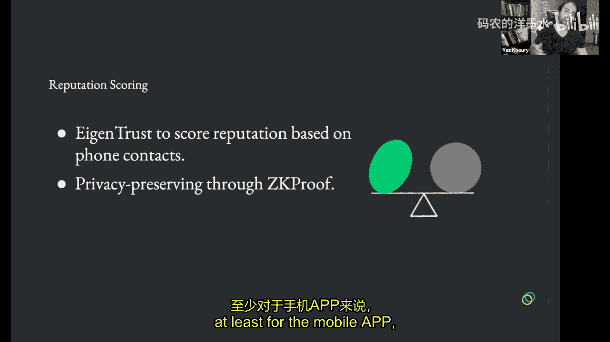

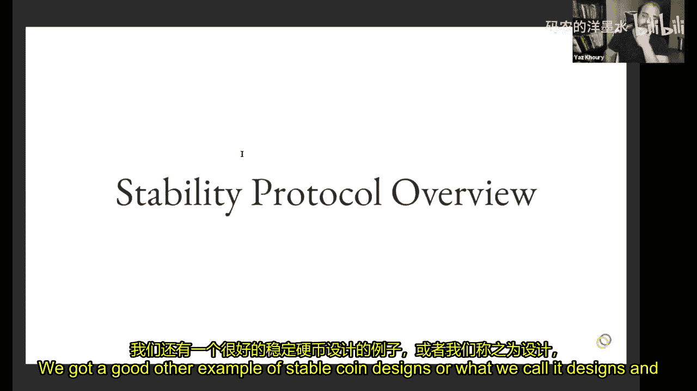

## 基于地址的加密与身份证明

Celo架构的第一个创新是**基于地址的加密**。在讨论它之前，我们先了解**基于身份的加密**。在传统的非加密服务中，系统会利用你的电子邮件等身份标识进行加密，但这引入了执行加密的第三方。

Celo提出的**基于地址的加密**是对基于身份加密的修改。用户仍然生成公私钥对。但在创建公钥后，他们会将一个地址（如电话号码）与公钥的映射注册到一个智能合约中。这个智能合约运行在去中心化的区块链上。

然后进行**身份证明**：验证器会向请求证明的用户发送一条签名短信，用户再发送一条用自己的密钥签名的消息回智能合约。合约通过验证器和用户的签名来验证地址与公钥的映射关系。

这个过程可以防止攻击者通过伪造大量电话号码来映射公钥，因为需要验证器实际发送短信并由用户完成签名确认才能完成注册。

## 共识机制：IBFT

在了解了身份验证机制后，我们深入探讨Celo的共识机制。Celo使用一种名为**IBFT（Istanbul Byzantine Fault Tolerance）** 的拜占庭容错共识机制。

IBFT的基本流程如下：
1.  **新一轮开始**：验证器以轮询方式随机被选为**提议者**。
2.  **提议区块**：提议者广播一个包含交易的区块提案，并发送 **预准备** 消息。
3.  **准备阶段**：其他验证器检查提案有效性，然后广播 **准备** 消息。系统需要等待 **2f + 1** 条准备消息（f是可容忍的故障节点数，在Celo中约为33，因此需要至少67个验证器同意）。
4.  **提交阶段**：收到足够的准备消息后，广播 **提交** 消息。同样需要等待 **f + 1** 条提交消息。
5.  **出块**：收到足够的提交消息后，将区块插入区块链，然后进入新一轮。

验证器通过**验证器组**的形式组织，每个组最多可包含5个验证器，全网最多有100个验证器席位。这有助于防止巨鲸匿名控制大量验证器席位，因为需要以组为单位进行公开组织和竞选。

## 稳定协议概述

现在，我们专门探讨Celo的稳定协议。我们已经讨论了稳定币，稳定协议特指Celo的设计。在讨论Celo的做法之前，我们先回顾几种稳定币设计模型：

1.  **法币抵押型**：如Tether、USDC。优点是最简单直接，相对稳定；缺点是依赖链下实体，可能牺牲速度和透明度。
2.  **加密货币抵押型**：如MakerDAO的DAI。优点是更去中心化；缺点是抵押资产本身波动可能影响稳定性。
3.  **算法（Seigniorage）型**：通过算法根据条件扩张或收缩稳定币供应量。它通常需要一种治理代币，该代币本身可能波动，其价值会随着稳定币系统的扩张而增长。

Celo Dollar机制从以上三种模型中汲取灵感。它依赖于 **Celo储备金**，该储备金持有一篮子加密货币，包括Celo治理代币、比特币、以太坊和DAI。储备金会定期重新平衡。

稳定比率定义为储备金价值与已发行稳定币价值的比率，目标为1。如果比率低于1，系统会通过提高转账手续费（部分归入储备金）、调整 epoch 奖励分配等机制来提高比率。

## 去中心化的1:1机制与套利

Celo采用一种**去中心化的1:1机制**，这是其法币抵押型的体现。用户可以通过链上去中心化交易所，将Celo治理代币发送到交易所，换取等值的Celo Dollar，反之亦然。

由于存在扩张和收缩周期，这为套利提供了明确的机会，从而帮助系统保持平衡。例如：
*   假设cUSD价格跌至0.95美元。用户可以在市场上以0.95美元购买1个cUSD，然后通过储备金合约将其兑换成价值1美元的Celo治理代币（例如0.2个，假设每个价值5美元），最后在市场上卖出这些治理代币获得1美元，赚取0.05美元利润。
*   反之，如果cUSD价格升至1.05美元，用户可以通过反向操作套利。

此外，Celo还采用了**恒定乘积做市商**模型来保护储备金，防止针对预言机的攻击。该模型只提供部分流动性，并通过动态调整价格来应对供需变化，避免因预言机被操纵而导致储备金被掏空。

## 移动端优先策略

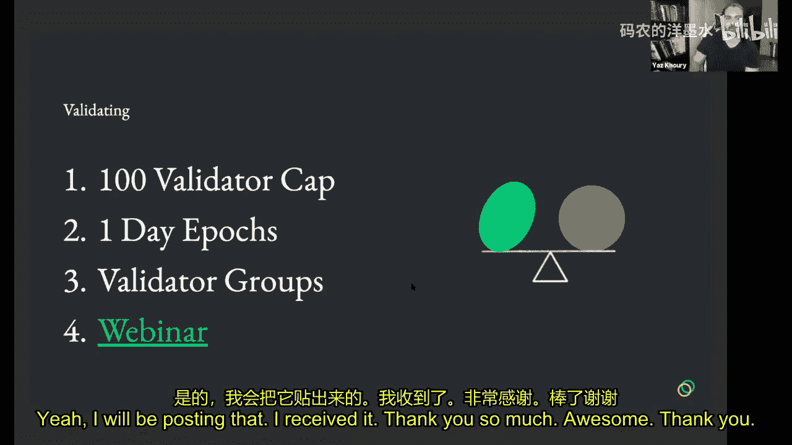

Celo与其他区块链的关键区别在于其**移动端优先**的策略。我们已经讨论过的身份证明服务就是其他网络所没有的，它极大地改善了用户体验，用户无需再依赖复杂的公钥，可以像发短信一样发送资金。

选择移动端优先的原因包括：全球移动用户更多，智能手机在发展中地区更普及；从用户体验角度看，移动端比命令行更直观，降低了使用区块链的门槛；许多新兴市场已经习惯于通过移动设备进行支付。

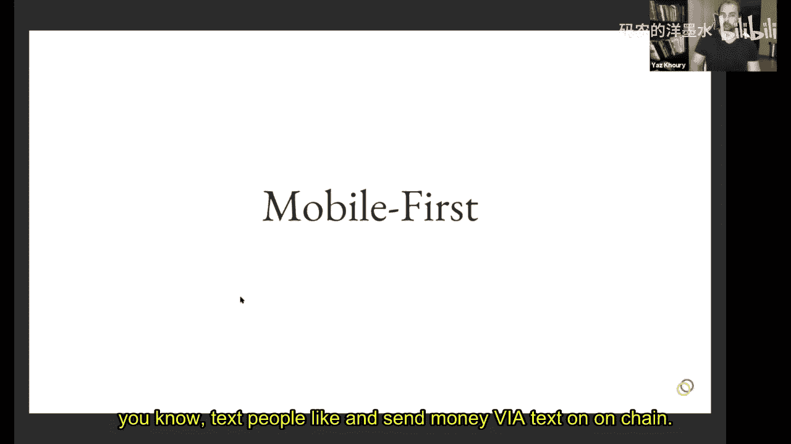

Valora是Celo的移动钱包应用，旨在提供类似Venmo的体验，目前已在iOS和Google Play商店上线。

## 与其他网络的简单比较

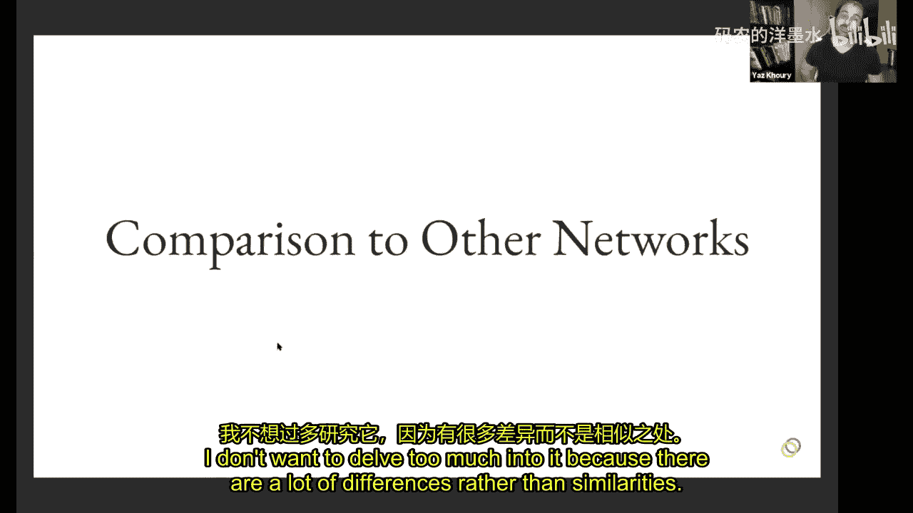

我们简要地将Celo与其他网络进行比较：

*   **Polkadot**：采用分片（平行链）架构，有中继链协调不同链之间的通信。它使用GRANDPA共识，并且平行链插槽数量有限。Celo则是一个单一的EVM兼容链，不侧重于分片。
*   **Cosmos**：旨在通过统一的IBC协议连接独立的“枢纽”，实现不同区块链间的互操作。它是无许可的，没有验证器数量限制。Celo则是一个独立的、专注于移动支付和稳定币的网络。

## 案例研究：菲律宾与肯尼亚试点

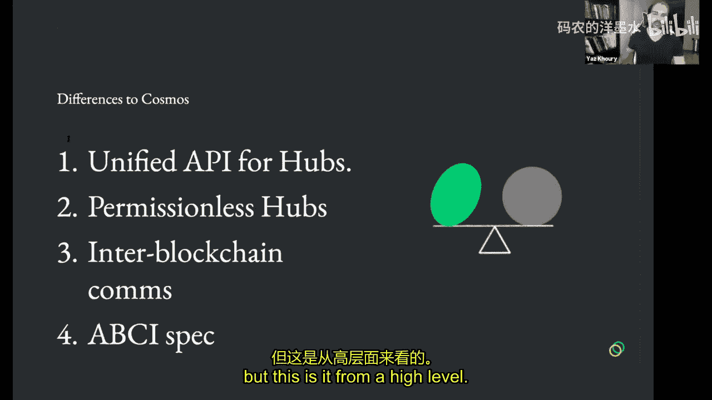

Celo团队为了理解用户需求，特别是在新兴市场，进行了一些案例研究。

**菲律宾试点**：与23名低收入快餐店工人合作。主要洞察包括：慢速网络严重影响交易确认速度；过时的智能手机可能导致兼容性问题；用户为节省流量经常关闭移动数据；用户初期对移动支付信任度较低。这些洞察促使团队优化轻客户端，以实现快速同步。

**肯尼亚试点**：肯尼亚的M-Pesa移动支付服务普及率高达86%。洞察包括：产品必须切中用户实际需求（如汇款）；用户倾向于用旧有概念理解新技术；口碑传播比机构推广更有效；用户更信任社区而非大型组织。这些信息为Valora的市场推广和用户获取策略提供了指导。

## 总结与问答

本节课中我们一起学习了稳定币的基本概念、不同类型及其工作机制，并深入探讨了Celo网络如何通过其独特的基于地址的加密、IBFT共识机制、复合型稳定协议以及移动端优先的策略，来构建一个普惠的全球支付系统。我们还通过案例研究看到了Celo在实际应用中的挑战和洞察。

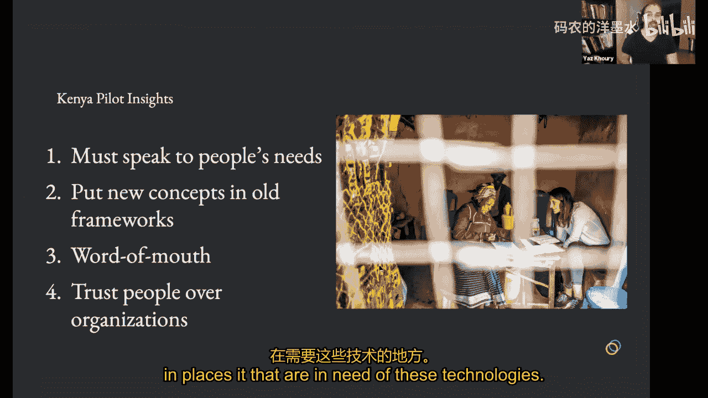

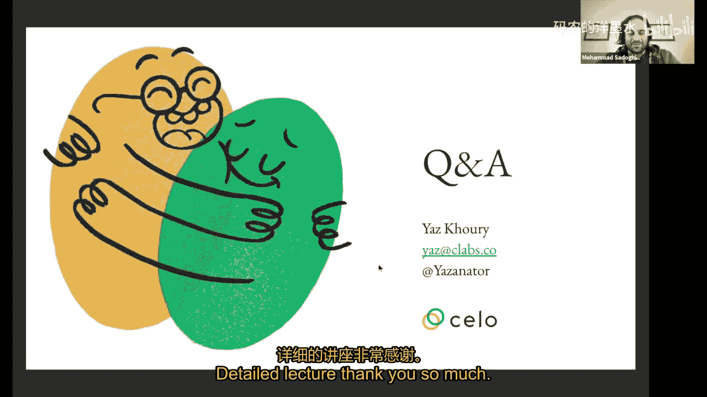

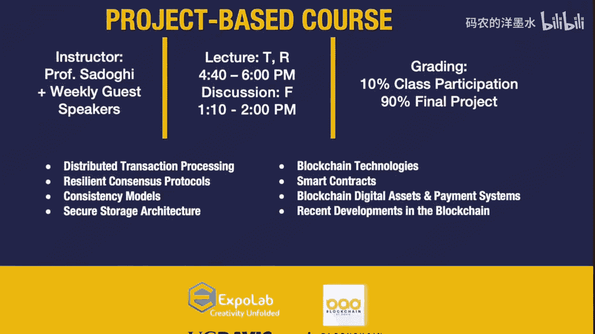

（注：教程正文结束，后续为讲座结束语，已按指令省略。）