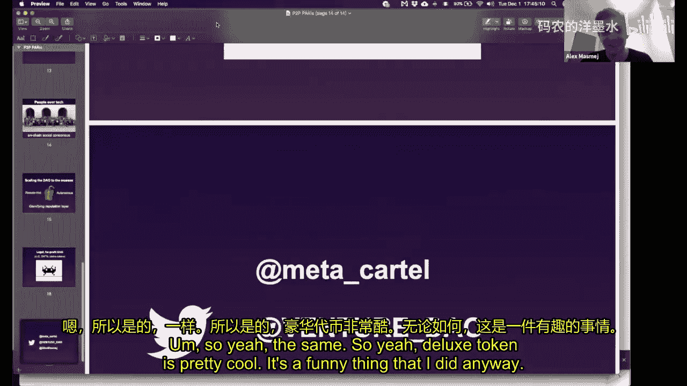
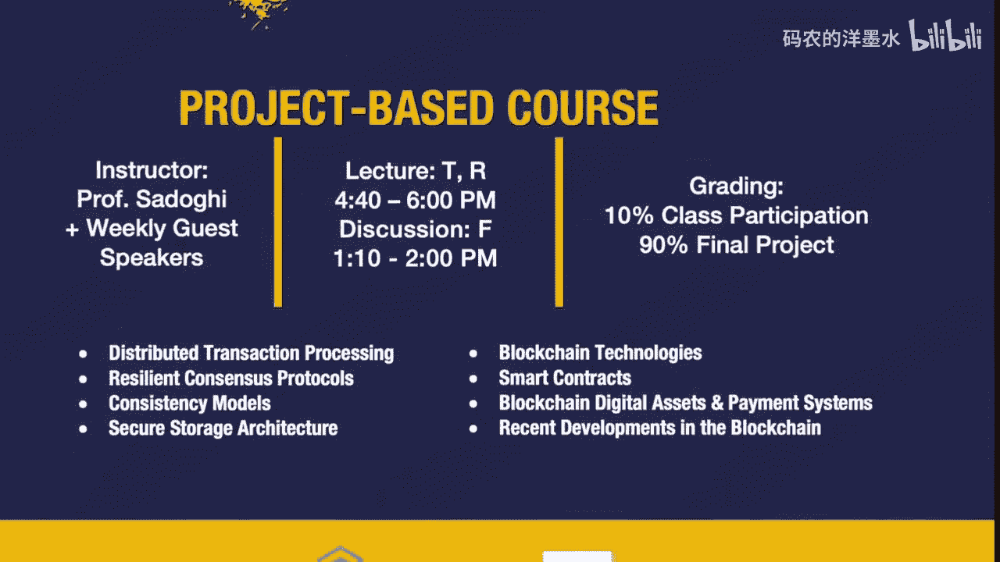

# 011：机制设计与去中心化治理

在本节课中，我们将要学习博弈论与机制设计，这是区块链技术中至关重要但常被忽视的核心组成部分。我们将探讨如何通过设计巧妙的规则来引导参与者行为，从而实现去中心化系统中的协作与治理。

---

## 什么是博弈论？🎲

上一节我们介绍了课程概述，本节中我们来看看什么是博弈论。博弈论是研究在策略性互动情境中，个体如何根据对其他参与者行为的预期来做出决策的学科。它关注的是人们的**激励**以及他们如何相互反应。

为了让大家直观理解，我们进行了一个名为“选美比赛”的小游戏。

以下是游戏规则：
*   每个人选择一个0到20之间的整数。
*   计算所有人所选数字的平均值。
*   目标是猜测一个数字，使其最接近这个平均值的75%。

这个游戏的关键在于，你的猜测不仅基于数字本身，更基于你对其他参与者会如何猜测的预判。如果所有参与者都是完全理性的，他们会进行多轮推理：既然最高可能数字是15（20的75%），那么理性的人会猜测15的75%（约11），接着其他人会猜测11的75%……最终，完全理性的均衡点将是**0或1**。

然而，在实际游戏中，答案往往不是0或1。这揭示了一个核心洞见：作为应用设计者，我们需要理解“聪明答案”（完全理性下的均衡解）与“正确答案”（实际发生的结果）之间的平衡。这就是博弈论与机制设计的起点。

---

## 从博弈论到机制设计 ⚙️

上一节我们通过游戏了解了博弈论，本节中我们来看看与之紧密相关的机制设计。如果说博弈论是分析给定规则下人们会如何行动，那么**机制设计**就是反向工程：为了达成某个期望的结果，我们应该设计怎样的规则或“机制”。

一个经典的例子是**囚徒困境**。

以下是囚徒困境的收益矩阵：
| 囚徒A \ 囚徒B | 保持沉默（合作） | 背叛（揭发） |
| :--- | :--- | :--- |
| **保持沉默（合作）** | 各判1年 | A判3年，B获释 |
| **背叛（揭发）** | A获释，B判3年 | 各判2年 |

在这个情境中，警方的**机制设计**（隔离审讯并给出特定条件）导致了对每个囚徒个体而言的最优策略（背叛）却带来了对两人整体更差的结果（各判2年）。而外部力量（如黑帮）可以通过改变机制（例如，威胁背叛者的家人）来将博弈从“单次囚徒困境”转变为“重复囚徒困境”，从而促使合作（都保持沉默）成为稳定策略。

其背后的数学逻辑是：在重复博弈中，当前作弊的净现值收益，可能无法超过未来所有合作带来的净现值收益总和。机制设计的目标，就是如何将单次博弈转化为重复博弈，以鼓励协作。

---

## 区块链中的机制设计案例 🧩

理解了基本概念后，我们来看看在区块链世界中可以构建哪些具体的机制设计。

### 1. 子博弈精炼均衡：解决票务信任问题

第一个案例是关于建立信任，例如在线购买演唱会门票。买家担心先付钱却拿不到票或拿到假票，卖家担心先给票却收不到钱。

以下是解决此问题的智能合约机制步骤：
1.  卖家将门票提交至智能合约，买家将付款提交至智能合约。
2.  双方提交后，门票转移给买家。
3.  买家可以选择**接受**门票（付款转给卖家，交易结束）或**质疑**门票真伪。
4.  若买家选择质疑，则需额外支付门票价格的50%作为保证金。
5.  随后卖家可以选择**接受质疑**（承认是假票，交易取消）或**反驳质疑**（声称是真票）。
6.  若卖家反驳，则交由仲裁员判定。若仲裁判定为假票，卖家损失；若判定为真票，则质疑的买家不仅损失门票，还损失保证金。

通过设计这个包含额外成本和仲裁环节的机制，唯一让双方都满意的稳定结局就是：卖家提供真票，买家接受真票。这迫使理性参与者只会进行真实的交易。

### 2. 拍卖机制设计

拍卖是机制设计的经典领域。不同的拍卖机制会激励不同的行为。

以下是几种常见的拍卖类型：
*   **英式拍卖**：价格公开上升，出价最高者以其最后出价获胜。
*   **荷式拍卖**：价格公开下降，第一个接受当前价格的出价者获胜。
*   **密封第二价格拍卖**：所有出价者秘密提交报价，出价最高者获胜，但只需支付第二高的报价。这有助于发现真实的支付意愿。
*   **VCG拍卖**：一种更复杂的机制，旨在最大化社会总效用，获胜者需支付其获胜对其他参与者造成的“边际损失”。

关键启示是：不存在放之四海而皆准的“最佳”机制。应用构建者的目标是理解特定场景中的利益相关者及其激励，然后设计最适合的机制来引导行为，实现从当前状态向更理想未来状态的过渡。

---

## 治理与投票机制设计 🗳️

机制设计在去中心化治理和投票领域有着激动人心的应用。

### 1. 二次方投票

传统“一人一票”无法体现偏好强度。**二次方投票**是一种允许个体表达偏好强度的集体决策机制。

其核心规则是：你可以投多票支持某个选项，但购买第 `n` 张选票的成本是 `n^2`（即1票成本1单位，2票成本4单位，3票成本9单位，以此类推）。

这种设计允许有强烈偏好的人表达意见，但通过成本的二次方增长，有效防止了财富最多的人完全主导投票结果，从而在考虑偏好强度的同时，平滑了贫富差距带来的影响。

### 2. GovernDAO：基于结果的捐赠

在政治捐款中存在囚徒困境：选民希望捐款给能解决问题的政客，政客希望专注于解决问题而非筹款，但双方因缺乏信任而陷入僵局。

GovernDAO 设计的机制叫做**基于结果的捐赠**：
1.  捐赠者的资金被锁定在智能合约托管账户中。
2.  捐赠者设定明确的可衡量成果目标（例如“旧金山无家可归者减少2%”）。
3.  只有当目标在约定时间内达成时，资金才会释放给政客，用于其下一次竞选。

这个机制改变了博弈的三要素：**概率**（通过托管和清晰条款明确资金释放条件）、**收益**（政客通过解决问题而非单纯筹款来获得资金）以及**博弈次数**（从单次交易变为基于持续成果的迭代互动）。它激励政客将更多时间用于解决问题，因为他们知道解决问题就能获得连任所需的资金。

---

## 去中心化自治组织：机制设计的集大成者 🏛️

DAO 是“去中心化自治组织”的缩写，它代表了组织形式的范式创新。DAO 利用区块链的**可信中立性**（规则不会单方面改变）和**可组合性**，旨在规模化人类协作。

### DAO 的实践案例

*   **MolochDAO**：旨在资助以太坊公共基础设施开发。它引入了 **Ragequit（愤怒退出）** 机制：成员如果不同意某项资金提案，可以在执行前随时退出并取回自己的资金份额。这迫使提案必须符合集体利益，否则成员会离开，从而解决了公共物品融资中的“搭便车”问题。
*   **MetaCartel DAO**：专注于投资早期的以太坊应用项目，展示了DAO如何作为风险基金运作。
*   **The LAO**：一个合法成立的、基于区块链的营利性DAO，它拥有美国LLC结构，其法律文件指明“请参考区块链代码作为资产”，标志着DAO开始与实体法律框架融合。

DAO 的核心在于将股权代币化，并通过程序化激励吸引全球贡献者。它预示着未来可能出现由数百万人在线协作、没有传统公司结构的新型组织。

---

## 总结与核心启示 💡

本节课中我们一起学习了博弈论与机制设计在区块链中的核心作用。

我们首先通过“选美比赛”和“囚徒困境”理解了博弈论分析激励与行为的方式。接着，我们探讨了机制设计如何作为博弈论的反向工程，通过设计规则来引导系统达到期望的均衡，例如解决票务信任的智能合约和各类拍卖机制。

然后，我们深入研究了治理领域的机制设计，如二次方投票和基于结果的捐赠，它们展示了如何通过精巧的规则设计改善集体决策和政治激励。最后，我们以DAO作为机制设计的集大成者，看到了如何利用区块链的可信中性与可组合性，创建全新、规模化、全球协作的组织形态。

**核心启示**：区块链的革命性不仅在于分布式账本或不可篡改性，更在于它首次为大规模、无信任环境下的**机制设计**提供了可编程的土壤。作为开发者，我们的目标不应仅仅是“使用区块链”，而是深刻理解所要解决问题中的激励结构，然后利用区块链的特性设计机制，从而构建出促进协作、创造信任、指向更理想未来的下一代应用。这才是Web3.0+的真正内涵。