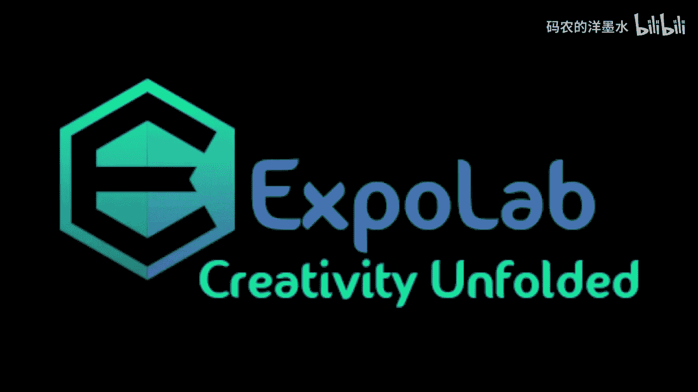
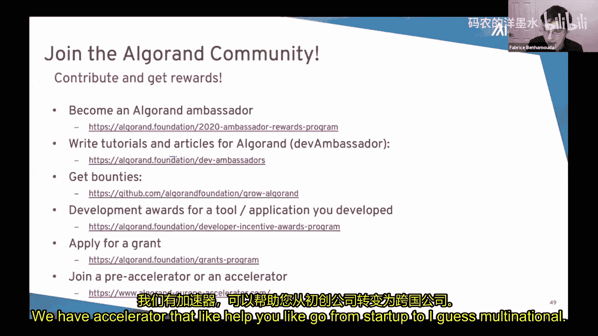
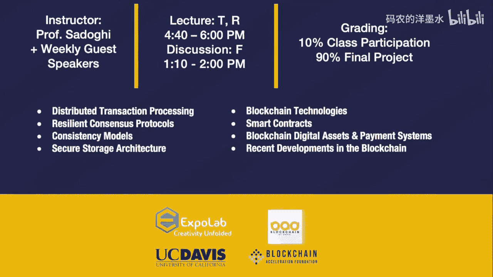

# 012：解决区块链三元悖论

## 概述

在本节课中，我们将学习区块链技术中的核心挑战——三元悖论，并深入探讨 Algorand 区块链如何通过其独特的“纯权益证明”共识机制，同时实现安全性、去中心化和可扩展性这三个目标。课程内容分为理论设计与技术实现两部分。

---

## 第一部分：区块链基础与三元悖论

区块链本质上是一个分布式、安全、高效的账本创建技术。可以将其想象成一个任何人都可以按顺序写入信息，但信息一旦写入就无法删除或篡改的公告板。这与传统中心化数据库形成对比，后者存在单点故障、访问受限和信任问题。

区块链提供了全局即时访问、低交易成本和极强的抗篡改性，这些特性在供应链管理等应用中至关重要。

然而，区块链设计面临一个核心挑战，即所谓的“三元悖论”。理想情况下，我们希望区块链同时具备：
1.  **安全性**：交易一旦被确认，就无法被篡改或移除。
2.  **可扩展性**：能够支持现实世界所需的高吞吐量交易。
3.  **去中心化**：允许广泛的参与者参与共识过程。

传统观点认为，一个区块链系统最多只能同时实现这三个目标中的两个。

---

## 第二部分：共识机制的演进

上一节我们介绍了区块链的目标与挑战，本节中我们来看看为实现这些目标，共识机制是如何演进的。

以下是主要的共识机制类型及其特点：

*   **工作量证明**：以比特币为代表。节点通过解决计算密集型难题来竞争记账权。其优点是安全性高，但缺点是能耗巨大、交易速度慢、成本高，并且可能存在分叉，缺乏最终性。
*   **权益证明**：一种改进机制。节点记账的权利与其持有的代币数量（权益）相关。这降低了能耗，但通常涉及代币抵押和委托投票，可能影响去中心化程度。
*   **纯权益证明**：这是 Algorand 采用的方法。它旨在结合前两者的优点，同时解决三元悖论。其目标是实现绿色节能、快速、低成本、具有最终性且真正去中心化。

---

## 第三部分：Algorand 的解决方案

了解了共识机制的背景后，本节我们将深入探讨 Algorand 如何具体实现其“纯权益证明”共识。

### 核心机制：可验证随机函数与秘密委员会

Algorand 共识的核心在于使用**可验证随机函数** 来秘密地选择区块提议者和共识委员会成员。

**公式/概念**：
*   **可验证随机函数**：一个密码学原语，允许持有私钥的节点独立生成一个随机数（作为“凭证”或“彩票”），并附带一个证明。其他任何人可以使用公钥验证该随机数确实是由该节点正确生成的，但无法预测其值。
*   **秘密选举**：在每个区块轮次中，每个节点独立使用 VRF 判断自己是否“中签”成为区块提议者或委员会成员。由于选举是本地和秘密进行的，攻击者无法提前知道谁将被选中，从而无法进行针对性攻击。

### 共识流程：两阶段提交

Algorand 的区块生成并非提议后直接上链，而是包含一个确认阶段：

1.  **提议阶段**：被秘密选中的提议者使用 VRF 生成凭证，并提议一个新区块。
2.  **拜占庭协议阶段**：一个由 VRF 秘密选出的**小型委员会**运行一个快速的拜占庭共识协议，对该区块进行投票。委员会成员在每个步骤后“只发言一次”即被替换，这称为**玩家可替换性**，进一步增强了安全性。
3.  **最终确认**：一旦委员会达成共识，该区块就被最终确认并添加到链上。这个过程几乎完全消除了分叉的可能性，实现了**最终性**。

### 解决三元悖论

通过上述设计，Algorand 宣称同时实现了：
*   **安全性**：基于密码学签名和秘密选举，攻击者难以篡改。
*   **可扩展性**：VRF 计算极快，且共识仅在小型委员会内进行，支持高吞吐量（约每秒1000笔交易）和大量用户。
*   **去中心化**：任何持有 ALGO 代币的人都可以参与，进入门槛低。

---

## 第四部分：Algorand 的技术特性与应用

在理解了核心共识机制后，我们来看看构建在其之上的技术特性和应用。Algorand 采用分层架构，每一层都增加功能而不损害底层的优势。

### 第一层特性

第一层功能直接内置于共识协议中，享有与基础交易相同的速度、安全性和低成本。

以下是第一层的主要功能：

*   **Algorand 标准资产**：允许任何人轻松创建自定义代币（类似 ERC-20/ERC-721），用于稳定币、奖励积分、证券化资产等。交易费用极低，且无需编写智能合约。
*   **原子传输**：允许将最多16笔交易捆绑成一个组。要么组内所有交易都成功执行，要么全部失败。这解决了跨资产交易中的信任问题，例如无需中介的原子交换。
*   **无状态智能合约**：一种简单的、基于堆栈的脚本语言（TEAL），用于批准或拒绝交易。它限制严格（无循环、计算量小），但因此非常安全、易于形式化验证，且执行成本与普通交易相同。结合 ASA 和原子传输，能实现复杂逻辑，如去中心化交易所限价单。

### 第二层智能合约

为了支持更复杂的应用，Algorand 引入了第二层智能合约。

**核心思想**：将复杂合约的执行**移出**主链共识流程。一个由 VRF 选出的专门委员会在链下执行合约。执行完成后，委员会对结果及其执行前提条件（如当时的区块链状态）进行签名，再将这个签名后的结果提交到主链。这样，复杂的合约计算不会阻塞主链的高速交易处理。

### 其他进展

*   **跨链互操作性**：开发“紧凑证书”技术，以更简单、通用的密码学形式证明 Algorand 区块的有效性，便于其他区块链（如以太坊）验证，从而实现资产跨链转移。
*   **开发者生态**：提供了全面的开发工具包、SDK、IDE插件、API服务和钱包等，以降低开发门槛。

---

## 总结

本节课我们一起学习了区块链的三元悖论挑战，并深入了解了 Algorand 区块链如何通过其创新的纯权益证明共识机制来应对这一挑战。我们探讨了其利用可验证随机函数进行秘密选举、通过小型委员会运行拜占庭协议以实现快速最终性的核心原理。此外，我们还了解了 Algorand 分层的技术架构，包括其低成本、高效的第一层功能（如标准资产、原子传输）以及为复杂应用设计的第二层智能合约。Algorand 的设计旨在不牺牲去中心化和安全性的前提下，提供可扩展、绿色且开发者友好的区块链平台。