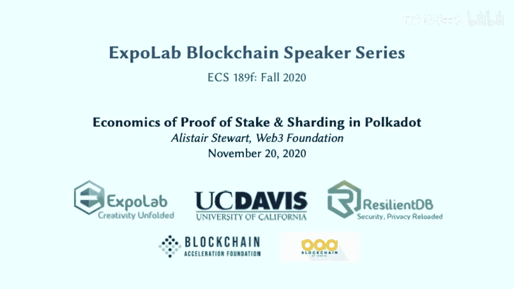
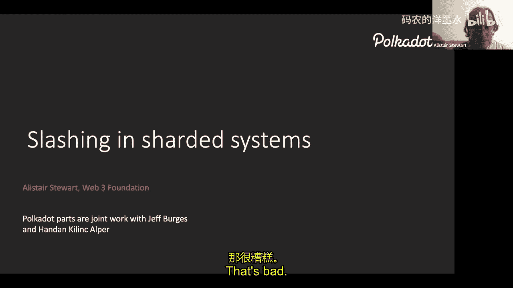
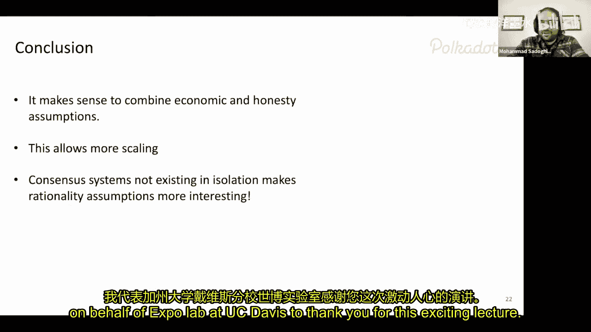
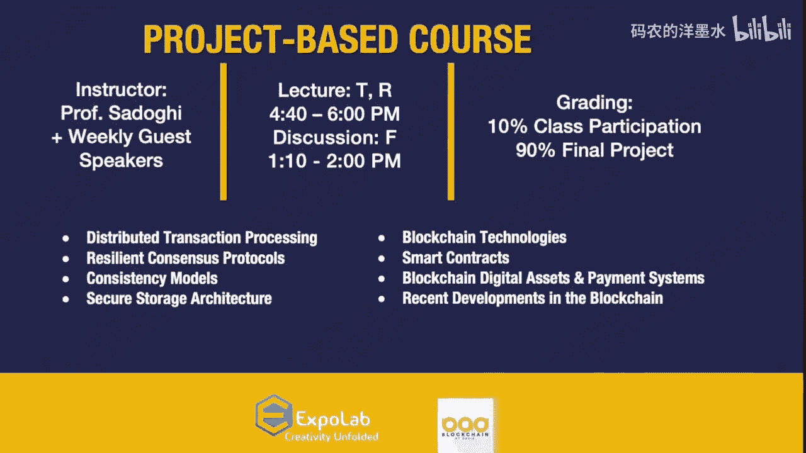

# 013：波卡的权益证明经济学与分片技术

在本节课中，我们将要学习波卡（Polkadot）网络中权益证明（PoS）的经济学原理，特别是惩罚（Slashing）机制如何与分片技术结合，以构建一个安全且可扩展的区块链系统。我们将探讨为何在单链系统中惩罚机制可能并非必要，但在多链或分片环境中却至关重要。

## 引言：去中心化系统的假设

上一节我们介绍了区块链的基本目标。在构建去中心化系统时，我们通常需要做出一些假设。主要有两种类型：

*   **诚实性假设**：我们假设系统中一定比例（例如超过三分之二）的参与者是诚实的，会遵循协议规则。
*   **理性假设**：我们假设参与者是理性的，会追求自身利益最大化，并通过设计激励机制来引导他们的行为符合系统安全目标。

权益证明区块链的目标是论证：如果系统中大部分权益由理性且活跃的参与者持有，那么系统就是安全的。与工作量证明（PoW）只能奖励参与者不同，PoS系统还可以通过罚没参与者的质押权益来惩罚不当行为。

## 单链系统中的惩罚机制争议

本节中我们来看看在单一区块链中，惩罚机制面临的争议。一个基于拜占庭容错（BFT）的协议，只要诚实的参与者达到一定比例（如同步网络中超过一半，部分同步网络中超过三分之二），系统就能安全运行。

在这种情况下，惩罚机制可能面临一个困境：

*   如果作恶者控制了足够多的节点（例如超过三分之一），他们可以合谋审查链上信息，即使诚实的参与者知道他们作恶，也无法成功提交惩罚报告，因为报告会被审查掉。
*   如果作恶者没有控制足够多的节点，他们无法成功攻击系统，因此也不会被惩罚。

因此，有人认为在单链系统中，惩罚主要针对的是因技术故障导致的“无心之失”，而非恶意攻击者。这可能会打击参与者的积极性，因为他们需要承担因设备被黑等原因导致资金损失的风险。许多源自学术界的区块链协议（如Algorand、Avalanche、Cardano）在设计时只依赖诚实性假设，不采用惩罚机制。

## 分片与跨链带来的转变

然而，当我们从单链系统转向多链系统（无论是分片还是跨链互操作）时，情况发生了根本变化。关键在于：**我们可以将一条链上的不当行为报告到另一条链上**。

这意味着，即使作恶者能审查某一条分片链，也无法阻止其他链（如中继链/主链）收到报告并执行惩罚。这正是Layer 2解决方案（如Plasma）和分片系统（如波卡、以太坊2.0）的核心思想：利用一个共同信任的主链来解决分片上的争议。

## 分片安全性的两种设计思路

以下是实现分片安全性的两种主要途径及其所需的验证者数量分析：

**1. 仅依赖诚实性假设（每分片需多数诚实）**

这种方法将全部验证者随机分配到各个分片，并假设每个分片内部都有足够多（如超过三分之二）的验证者是诚实的。根据概率计算，要保证在10年内，100个分片中任何一个被攻击的概率低于1%，整个系统需要的验证者总数约为 **338** 人。这是一个较大的数字，因为需要确保每个分片内部的诚实多数。

**2. 结合诚实性与经济惩罚（仅需少数检查者）**

这种方法利用主链进行争议解决。它不要求每个分片内部多数诚实，而是要求整个系统多数诚实，并引入一组随机选出的“批准检查者”来二次验证分片区块。如果检查者发现无效区块并报告，作恶的验证者将被罚没全部质押。

通过经济模型分析，如果我们希望攻击一个分片的期望成本高于系统中全部质押的总价值，那么每个分片所需的验证者（包括初始的“支持验证者”和随机的“批准检查者”）总数可以降低到约 **14** 人。这远低于第一种方法的要求，使得系统能够支持更多的分片。

## 波卡的分片协议设计

在波卡的具体协议中，结合了上述第二种思路，并解决了两个关键问题：**数据可用性**和**防止针对性攻击**。

*   **数据可用性**：通过纠删码技术将分片区块数据编码并分发给众多验证者，确保即使原始提交者隐藏数据，网络也能恢复出完整区块。
*   **防止针对性攻击**：使用可验证随机函数（VRF）随机、私密地选择批准检查者，使得攻击者无法提前知道将检查他们的是谁，从而无法进行针对性贿赂或腐蚀。

协议流程简述如下：
1.  一组“支持验证者”对分片区块进行初始签名背书。
2.  该区块的纠删码片段被分发，网络确认其数据可用性。
3.  一组随机选出的“批准检查者”下载数据并验证区块有效性。
4.  如果任何检查者报告无效，则争议升级，区块被回滚，作恶者被罚没。
5.  只有当成批的分片区块都通过了检查，相应的中继链区块才会被最终确定（finalized）。

这种“乐观执行，延迟最终确定”的机制，使得在最终确定前发现并回滚无效交易成为可能，从而将成功攻击的期望成本提得很高。

## 对轻客户端与跨链桥的启示

本节我们来看看这种“质押+概率性检测”的思路对其他场景的启发。例如，构建连接波卡与以太坊等外部链的轻量级桥接时，在目标链（如以太坊）上完全验证源链的所有签名成本极高。

我们可以采用一种简化方案：
1.  首先在源链上，足够多的验证者对一个已最终确定的区块头进行签名。
2.  在目标链的智能合约中，我们并不提交所有签名，而是只提交一个声称“大多数验证者已签名”的声明，并附上少量随机挑选的签名作为样本证明。
3.  目标链利用其自身的区块哈希作为随机源，随机抽查这些签名。如果作恶者试图伪造声明，随着抽查次数 `M` 的增加，其不被发现的概率按 `2^{-M}` 指数级下降。
4.  通过结合对源链验证者诚实性的假设以及对目标链矿工/验证者操纵随机源的经济成本分析，可以论证这种桥接方案的安全性。

## 总结

本节课中我们一起学习了波卡权益证明经济学与分片技术的核心内容。主要结论是：对于单链系统，惩罚机制的作用可能有限；但在分片或多链互操作场景中，惩罚机制变得至关重要。通过结合**整个系统的诚实性假设**、**随机抽样检查**以及**严厉的经济惩罚（如罚没全部质押）**，可以构建出安全性更高、可扩展性更强的分片协议。波卡的方案正是通过这种方式，在理论上用更少的每分片验证者数量，实现了更高的安全保证，从而支持更多的并行链（分片）。这种“经济安全”与“密码学安全”相结合的设计思想，也为轻客户端和跨链通信提供了新的解决方案思路。