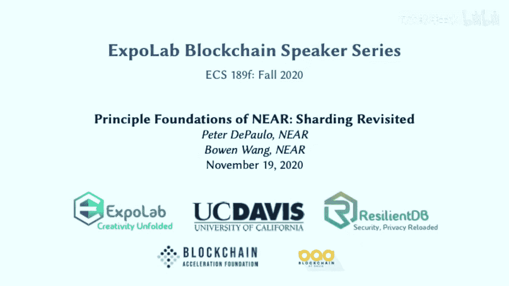
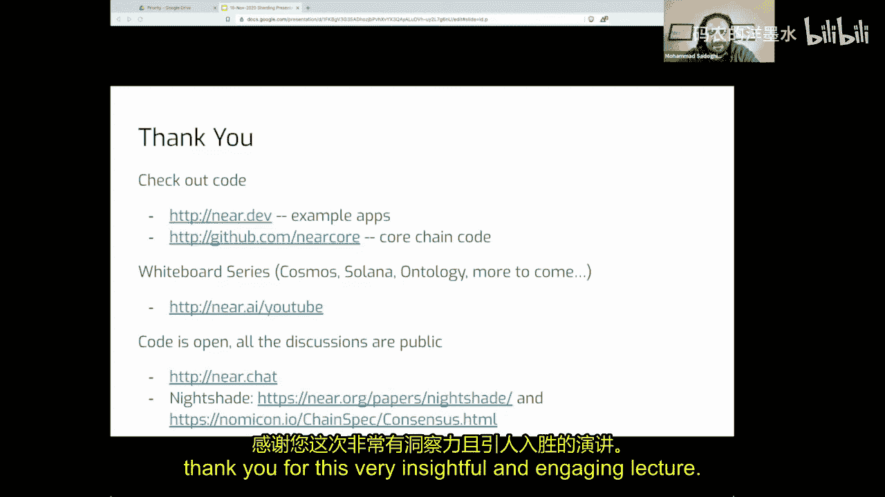

# 014：NEAR的核心原理-分片技术再探 🔗




在本节课中，我们将深入探讨区块链分片技术的核心原理与挑战，并以NEAR协议为例，分析其独特的分片架构设计。我们将从分片的基本概念入手，逐步解析其面临的安全问题、跨分片通信模型以及解决方案。

## 概述

区块链技术面临的核心挑战之一是可扩展性。传统的单链架构要求网络中的每个节点验证所有交易，这严重限制了系统的吞吐量。分片技术通过将网络状态和计算任务分割成多个并行的“分片”，旨在实现性能的线性扩展。然而，分片也引入了新的复杂性，例如跨分片通信、数据可用性和安全性问题。本节课程将系统性地剖析这些挑战，并介绍NEAR协议如何应对它们。

## 分片的基本架构

上一节我们介绍了分片旨在提升区块链吞吐量的目标，本节中我们来看看其典型的系统架构。

一个分片区块链通常由多个并行处理交易的分片链和一个负责协调的主链（或称信标链）组成。主链不处理常规交易，而是负责关键的系统级元数据管理，例如验证者选择、分片分配和区块头验证。

以下是分片架构的核心组成部分：
*   **分片链**：每个分片链独立处理自己的交易和状态更新，类似于一个独立的区块链。
*   **主链（信标链）**：作为系统的“指挥中心”，负责验证分片区块头的有效性、管理验证者集合、并最终确定跨分片交易的状态。
*   **验证者**：负责在分片上生产区块和验证交易。为了保障安全，验证者通常会被随机分配到不同的分片。

## 分片面临的核心挑战

了解了基本架构后，我们来看看分片技术必须解决的几个关键难题。

### 1. 安全性稀释与随机抽样

在非分片系统中，攻击者需要控制全网超过51%的算力或权益才能发动攻击。但在分片系统中，如果每个分片只有少量验证者，攻击单个分片所需的作恶验证者比例会大大降低，这被称为“安全性稀释”。

**解决方案**：通过在全网验证者池中为每个分片**随机抽样**选择验证者。假设全网有大量验证者，且恶意者只占少数，那么随机抽选出的小组中恶意者占多数的概率极低。这保证了每个分片区块都是由诚实多数签名的。这个过程依赖于安全的分布式随机数生成。

### 2. 无效状态转换

这是分片中最严重的攻击之一。攻击者控制一个分片后，可能在该分片上产生一个**无效的状态转换**（例如，凭空创造代币），然后将基于此无效状态的结果通过跨分片交易发送到其他分片。

**公式描述**：
*   有效交易：`Alice.balance -= 10; Bob.balance += 10`
*   无效交易：`Alice.balance -= 10; Bob.balance += 1000` （错误地增加了990）

在非分片链中，所有节点都会验证并拒绝无效交易。但在分片中，接收方分片可能无法直接验证发送方分片内部状态的正确性。

### 3. 跨分片异步通信

跨分片交易无法像单链交易那样原子性地执行。NEAR等协议采用**异步通信模型**。

**流程描述**：
1.  交易在源分片（Shard 1）执行，更新发送方状态，并生成一个包含执行结果的“收据”。
2.  该收据被发送到目标分片（Shard 2）。
3.  目标分片在后续的区块中接收并执行该收据，更新接收方状态。

这种异步性带来了复杂性，例如，如果目标分片执行失败，需要设计回滚或补偿机制。

### 4. 数据可用性问题

恶意验证者可能产生一个有效的区块头并提交到主链，但**扣留区块的实际数据（交易内容）**。这样，其他诚实验证者无法获取数据来继续构建后续区块，导致网络停滞或用户被欺诈。

## NEAR的解决方案与设计选择

面对上述挑战，不同的区块链项目提出了各自的解决方案。以下是NEAR采用的一些关键设计。

### 渔夫与挑战期

为了防范无效状态转换，NEAR引入了“渔夫”角色。渔夫是特殊的验证者，他们监控全部分片的状态。如果发现某个分片产生了无效的状态转换，他们可以在一个设定的**挑战期**内向主链提交包含密码学证明的挑战。

**代码逻辑描述**：
```pseudocode
if (渔夫检测到分片区块B存在无效状态转换) {
    向主链提交挑战证明；
}
if (挑战期内无有效挑战) {
    区块B被最终确认；
} else if (挑战被验证有效) {
    作恶验证者被罚没（Slash），区块B被回滚；
}
```
这创造了一种经济威慑：作恶的成本可能远高于收益。

### 纠删码确保数据可用性

为解决数据扣留攻击，NEAR使用**纠删码**技术。每个分片区块的数据被编码成许多片段，分发给该分片的各个验证者。只要收集到一定比例（例如1/3或1/2）的片段，就能重构出完整区块数据。

**流程**：
1.  区块生产者将区块数据通过纠删码编码成N个片段。
2.  每个片段附带一个Merkle证明，证明它属于原始区块。
3.  验证者存储并传播各自的片段。
4.  如果某些验证者离线或作恶，其他节点仍然可以从足够的片段中恢复数据，确保网络持续运行。

### NEAR的独特设计：分块而非分片链

与以太坊2.0等明确维护多条分片链的架构不同，NEAR采用了一种更集成的设计。NEAR没有独立的分片链，而是将每个分片的生产的“区块”称为**块**。这些块直接嵌入到主链的区块中。

**优势**：这种设计简化了系统状态管理，减少了分片链自身可能产生的分叉、回滚等复杂问题，降低了工程实现的复杂度。

## 行业其他方案概览

除了NEAR，其他主流项目也提出了各自的分片或类分片方案：
*   **Cosmos**：采用“枢纽与分区”模型，各分区链高度自治，通过跨链通信协议（IBC）连接。安全性由各分区自行负责。
*   **Polkadot**：采用“中继链与平行链”模型，共享中继链提供的安全性。平行链通过插槽接入。
*   **以太坊2.0**：采用信标链加分片链的架构，是目前最受关注的分片方案之一，正在逐步部署中。

## 从技术到生态：行为经济学与无限机器

最后，我们将视角从技术细节提升到生态系统层面。权益证明（PoS）区块链的安全基石不再是密码学算力，而是**行为经济学模型**。系统通过精心设计的经济激励和惩罚（如罚没）来预测并引导验证者的行为，使其诚实参与比作恶更有利可图。

这种经济模型催生了一种新的商业范式雏形——“**无限机器**”。基于PoS的DApp可以通过其收入自动重新质押网络原生代币，持续获取质押收益。这意味着即使一个应用的用户增长停滞，它也可能依靠质押收益长期维持运作，为开发者提供了前所未有的可持续性。

## 总结

本节课我们一起学习了区块链分片技术的核心原理。我们从分片的基本架构出发，深入分析了其面临的安全性稀释、无效状态转换、跨分片通信和数据可用性四大挑战。随后，我们以NEAR协议为例，探讨了通过随机抽样验证者、引入渔夫角色、采用纠删码以及独特的集成块设计等方案来应对这些挑战。最后，我们拓宽视野，认识到PoS分片区块链的安全本质是行为经济学，并展望了由此可能催生的新商业模式。分片是实现区块链大规模应用的关键路径之一，但其设计与实现充满了复杂性与权衡，仍需持续的研究与探索。




---
**相关资源**：
*   NEAR 开发门户：`near.dev`
*   NEAR 代码仓库：`github.com/nearprotocol`
*   NEAR 社区聊天：`near.chat`