# 015：Hedera Hashgraph 核心原理 🧩

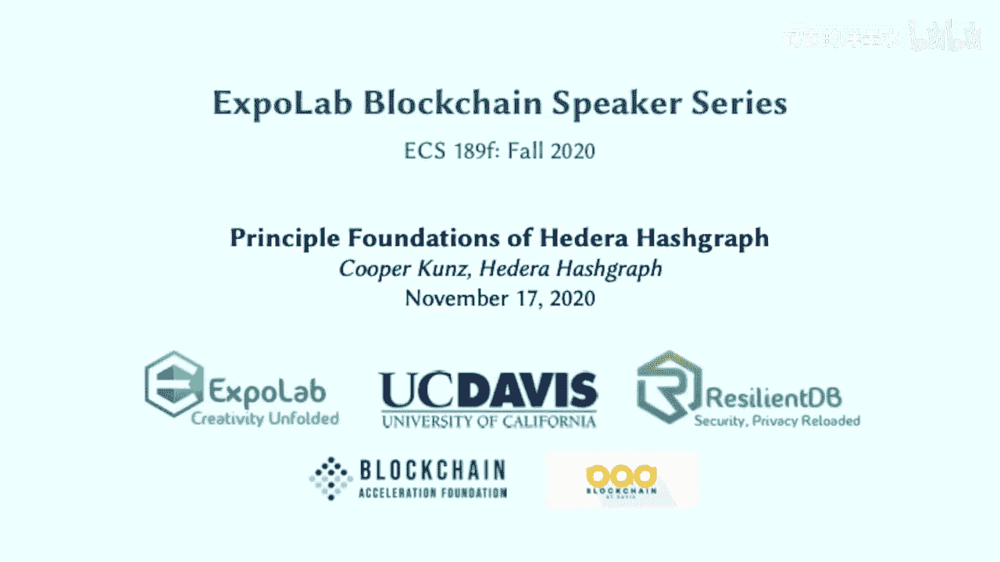

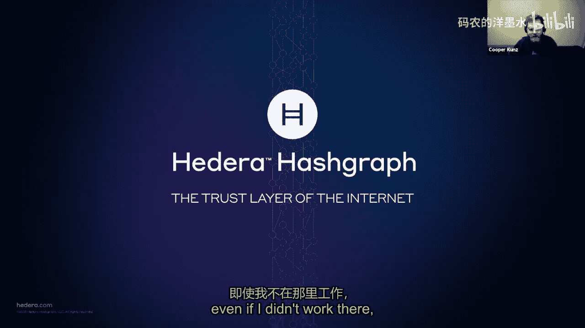

在本节课中，我们将学习Hedera Hashgraph平台的核心原理。Hedera Hashgraph是一个面向企业应用的第三代公共分布式账本，其独特之处在于采用了名为Hashgraph的共识算法，而非传统的区块链结构。我们将从平台概述、独特的治理模型，到深入探讨Hashgraph共识算法的工作原理，并了解其生态系统中的应用案例。

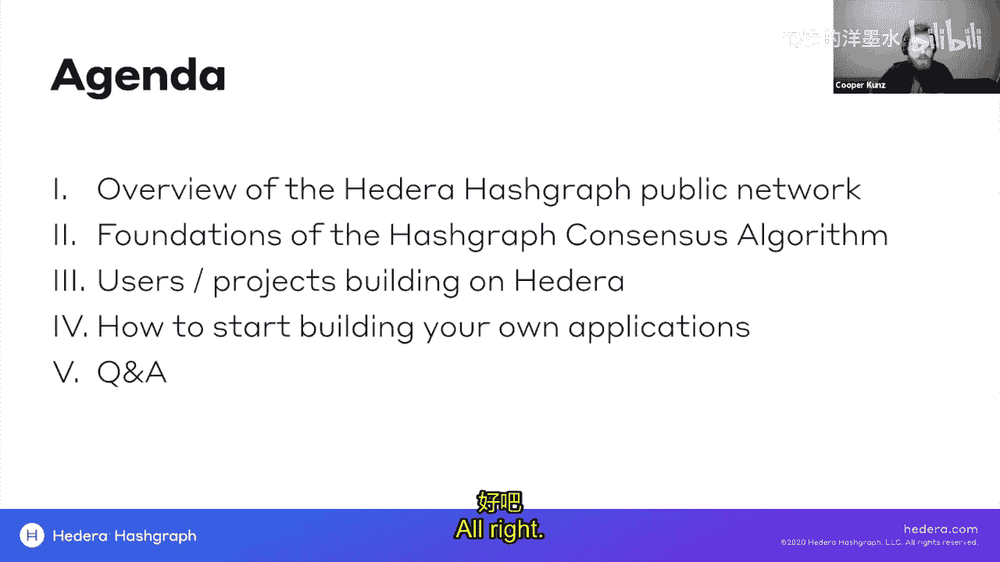

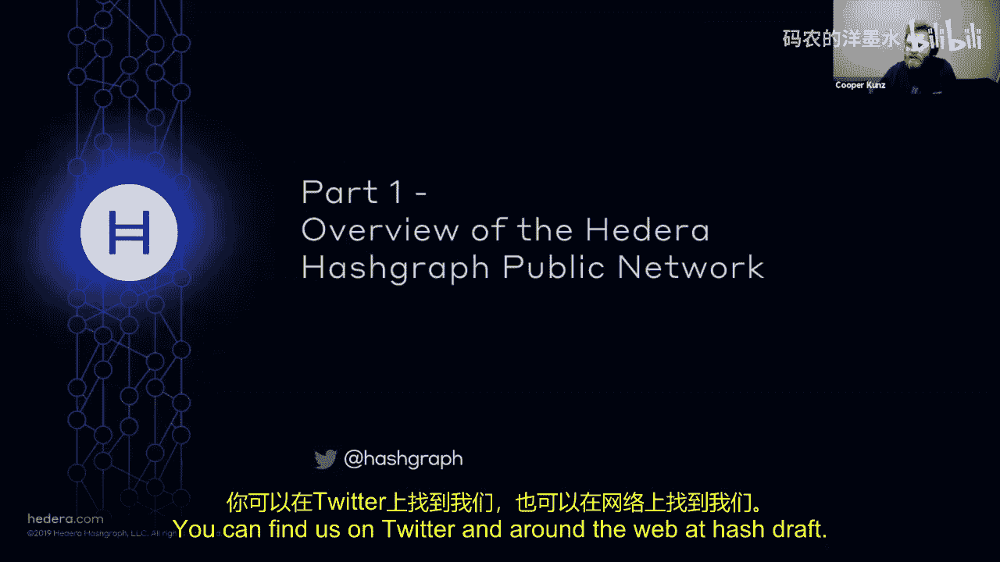

## 平台概述与企业定位 🏢

上一节我们介绍了课程主题，本节中我们来看看Hedera Hashgraph平台的总体定位和设计目标。

Hedera Hashgraph的目标是成为互联网的信任层。其核心使命是解决阻碍企业采用公共分布式账本的主要障碍。平台旨在系统性地解决性能、安全性、稳定性和治理四大问题，为企业提供一个稳定可靠、值得信赖的部署环境。

Hedera的技术栈建立在Hashgraph共识算法之上。与区块链不同，Hashgraph是一种有向无环图数据结构，它结合了八卦协议和虚拟投票机制。在此共识层之上，Hedera构建了多种网络服务。

以下是Hedera网络服务架构的核心组成部分：
*   **加密货币服务**：原生加密货币HBAR，用于支付网络使用费用。
*   **共识服务**：一种高效的数据记录服务，可作为其他分布式账本（如Hyperledger Fabric、R3 Corda）的排序或公证服务。
*   **代币服务**：支持发行自定义代币（类似ERC-20标准），并与InterWork联盟的代币分类框架兼容。
*   **智能合约服务**：支持EVM和Solidity，可运行智能合约。
*   **文件服务**：提供分布式文件存储。

网络节点分为两种类型：负责运行共识算法和处理交易的**主网节点**，以及可存储全部或部分历史交易数据的**镜像节点**。这种设计实现了处理能力与存储需求的解耦，保障了高可扩展性。

Hedera自视为第三代公共分布式账本，致力于解决前两代（如比特币、以太坊）在可扩展性和企业适用性方面的挑战。其关键性能指标包括：单分片内每秒处理超过10,000笔交易、以美元计价的稳定手续费、以及2-4秒的交易最终确定性。

## 治理模型：Hedera治理委员会 👥

了解了平台的基本架构后，我们来看看Hedera如何通过其独特的治理模型确保网络的稳定与可信。

Hedera采用了一个由全球领先企业组成的治理委员会模型，这是其市场策略中最独特的部分之一。该委员会负责监督Hashgraph共识算法和所有网络服务。

以下是Hedera治理委员会的核心运作机制：
*   **成员构成**：委员会由最多39家全球领先机构组成，这些机构需是其所在司法辖区的财富500强公司，覆盖至少11个不同行业，并包含至少一所大学和一个非营利组织。
*   **职责与运作**：委员会成员必须运行一个共识节点，并通过参与不同的委员会（如产品路线图、财务经济、法规事务等）来共同决策。他们决定平台的功能添加、手续费定价、代币经济模型以及资金库的使用。
*   **任期限制**：成员任期最长为三年，最多可连任两届。这确保了治理权的轮换，避免了权力长期集中。
*   **稳定性保障**：Hedera拥有专利和知识产权保护来防止网络分叉，并通过技术控制确保所有节点同步升级，为企业用户提供了网络不会意外分裂的稳定性保证。

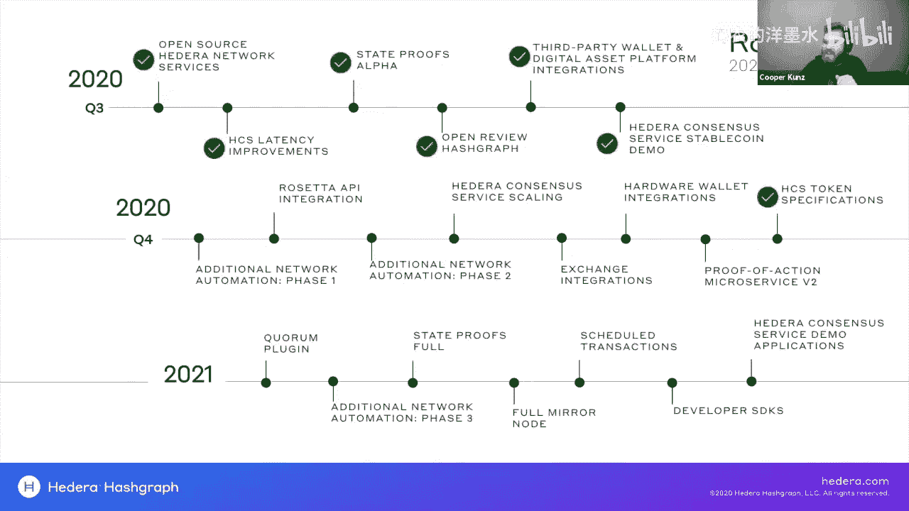

目前委员会成员包括谷歌、IBM、波音、德国电信、LG电子等知名机构。这种将平台控制权和所有权直接交给使用它的企业的模式，旨在建立企业级信任。

## Hashgraph共识算法深度解析 ⚙️

现在，我们进入本节课的核心部分：Hashgraph共识算法。正是这一算法赋予了Hedera高性能和公平性。

Hashgraph共识算法包含两个核心概念：**“八卦的八卦”** 协议和**虚拟投票**。它并非区块链，而是一种基于DAG的共识机制，旨在实现高吞吐量、公平排序和快速最终性。

虚拟投票是一种算法，它能以拜占庭容错的方式，计算出网络中超大多数节点对交易时间戳的共识。传统的投票共识算法虽然稳健但速度慢，而Hashgraph的虚拟投票在保持拜占庭容错和DDoS抵抗力的同时，实现了高吞吐量和交易排序的公平性。

“八卦的八卦”协议是一种原子广播协议。节点不仅广播交易事件本身，还广播它们所知的、其他节点之间通信的历史（即元数据）。以下是其工作流程的简化说明：
1.  **事件传播**：当一个节点（例如Alice）收到一笔交易，她会随机选择另一个节点（例如Dave），将她知道而对方不知道的所有事件（交易及元数据）发送过去。
2.  **指数级扩散**：收到信息的节点（Dave）会继续随机选择其他节点（例如Bob）进行传播。同时，Alice也可能选择另一个节点（例如Gina）进行传播。这个过程以指数级速度在网络中扩散。
3.  **构建DAG**：每次通信都会创建一个带有加密签名、时间戳和指向之前事件哈希的新事件。所有节点最终都会构建出一个结构相同、记录着“谁在何时收到了何种信息”的DAG。

由于网络延迟和随机选择，不同节点可能以不同顺序接收到多个并发交易。但这没有关系，因为DAG中包含了完整的传播历史信息。

当网络中超大多数（≥2/3 + 1）节点都知晓一个事件后，节点便可以基于本地存储的DAG运行虚拟投票协议。该协议通过分析DAG图，确定哪些事件是“著名的”，并计算出所有节点收到该事件的**时间戳中位数**。这个中位数时间戳即为该交易的**共识时间戳**。

所有交易将按照共识时间戳的顺序被最终确定和排序。这种机制保证了，除非某个实体控制了超过三分之一的网络权重，否则很难操纵交易排序，从而实现了公平性。

最终，这个排好序的交易列表会被提交给上层的网络服务（如加密货币服务），来更新账本状态。Hashgraph算法本身只负责达成共识顺序，不处理具体的账本状态。

## 应用案例与生态系统 🌱

在深入理解了核心算法之后，本节我们来看看有哪些实际项目正在Hedera网络上构建。

Hedera生态系统虽然年轻，但发展迅速，已经在多个领域出现了引人注目的用例。目前主要聚焦于数据完整性、微支付和去中心化身份三大垂直领域。

以下是部分已上线或已宣布的典型应用案例：
*   **AdsDax**：一家广告技术公司，利用Hedera共识服务实时记录广告事件，用于第三方审计和打击广告欺诈，这是一个价值数十亿美元的市场问题。
*   **The Coupon Bureau**：一个由宝洁、沃尔玛等大型零售商支持的联盟，基于Hedera构建数字优惠券系统，解决优惠券欺诈问题。
*   **Acoer**：与Safe Health合作，在亚利桑那州立大学用于追踪COVID-19检测数据；同时与梅奥诊所、达美航空合作进行医疗报告追踪。
*   **DLA Piper**：全球领先的律师事务所，正在Hedera上构建证券型代币发行产品。
*   **Hala Systems**：利用Hedera技术构建警报系统，用于向叙利亚等地的人们预警空袭或冲突区。

这些案例展示了Hedera在高吞吐、低费用和快速最终性方面的优势如何满足企业级应用的需求。

## 开发者入门与资源 🛠️

最后，如果你对在Hedera上开发应用感兴趣，本节将为你提供起步指南。

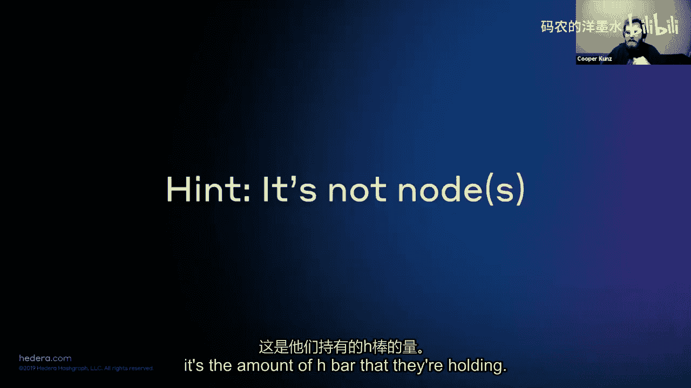

Hedera为开发者提供了便捷的入门途径和丰富的资源。你可以轻松接入测试网，开始构建应用程序。

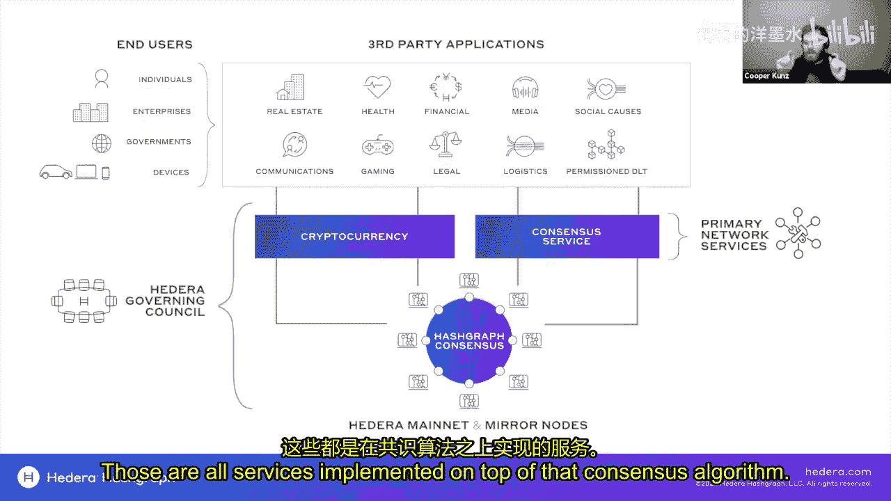

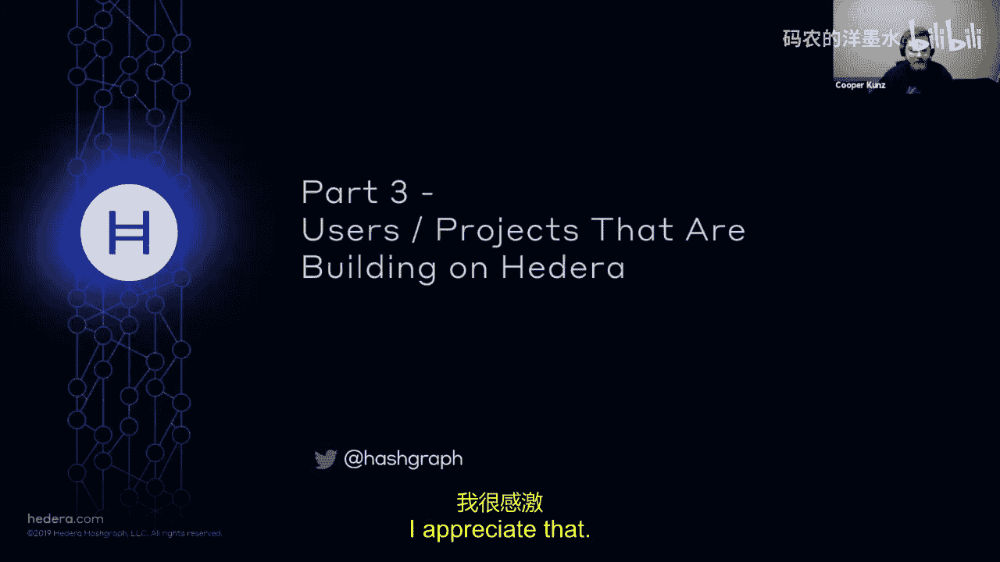

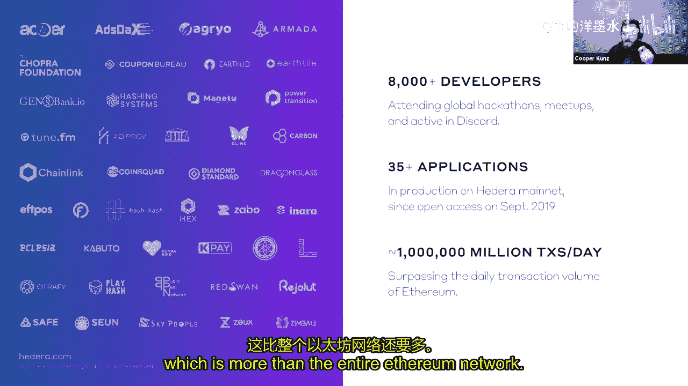

以下是开始构建所需的步骤和关键资源：
1.  **获取测试网账户**：访问 `portal.hedera.com`，只需一分钟即可注册并获得测试网账户ID及公私钥对。
2.  **选择SDK**：Hedera官方支持Java、JavaScript和Go的SDK，社区也提供了.NET、Rust等版本的支持。Python和Swift的官方支持正在开发中。
3.  **查阅文档与教程**：访问 `hedera.com/get-started`，这里有详细的用例介绍、示例应用程序和教程。
4.  **加入社区**：Hedera拥有一个活跃的Discord开发者社区，有数千名工程师在线，可以实时提问和获取帮助。
5.  **运行本地节点**：所有Hashgraph共识算法代码和网络服务代码均已开源，你可以下载并在本地运行，观察共识过程。

## 总结 📝

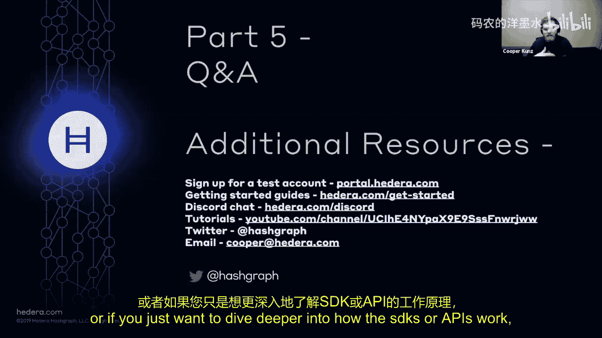

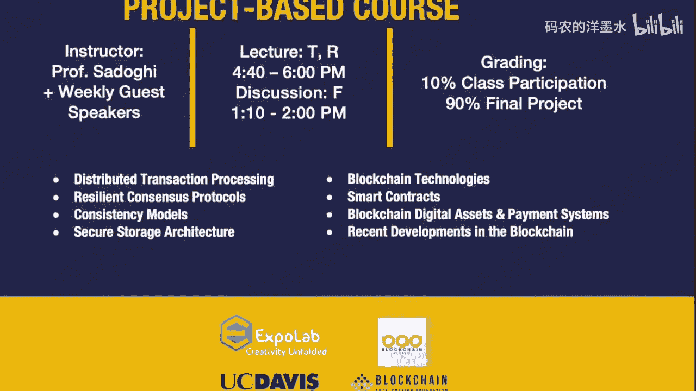

本节课中我们一起学习了Hedera Hashgraph平台的核心原理。我们从其作为企业级信任层的定位开始，探讨了其独特的由全球企业理事会管理的治理模型，这是其稳定性和可信度的基石。随后，我们深入剖析了Hashgraph共识算法的核心——“八卦的八卦”协议和虚拟投票机制，理解了它如何实现高吞吐、公平排序和快速最终性，而不依赖于传统的区块链或工作量证明。我们还浏览了其生态系统中一些高调的应用案例，看到了该技术在广告、医疗、金融等领域的实际应用。最后，我们为有意向的开发者提供了入门路径和资源指引。Hedera Hashgraph以其独特的技术路径和治理结构，为分布式账本技术的企业级应用提供了一个值得关注的选择。