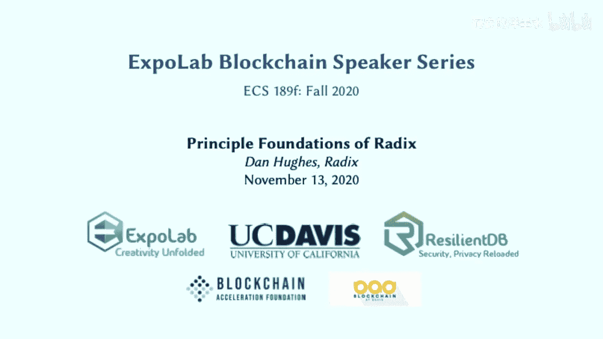
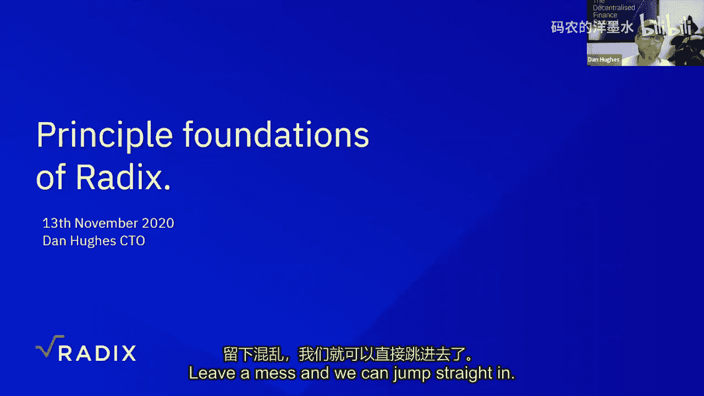
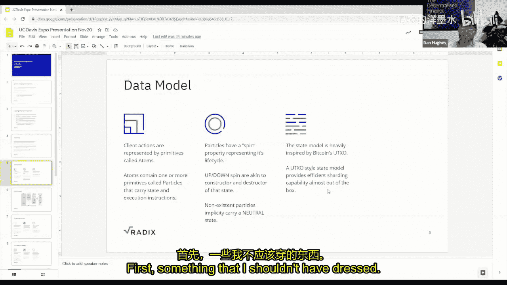
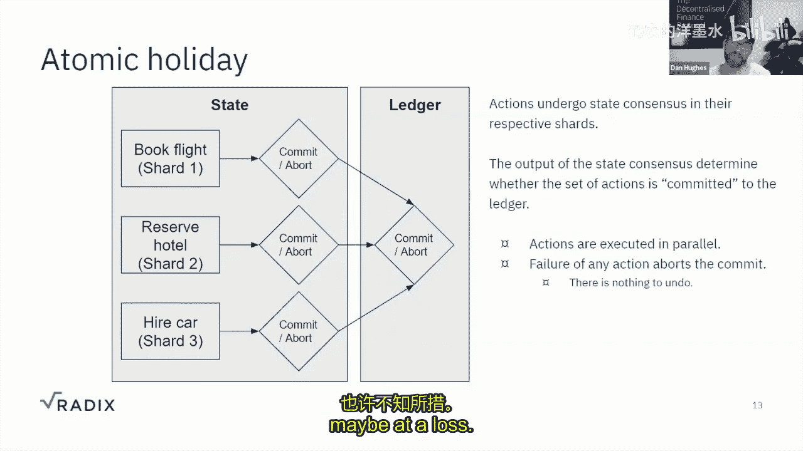
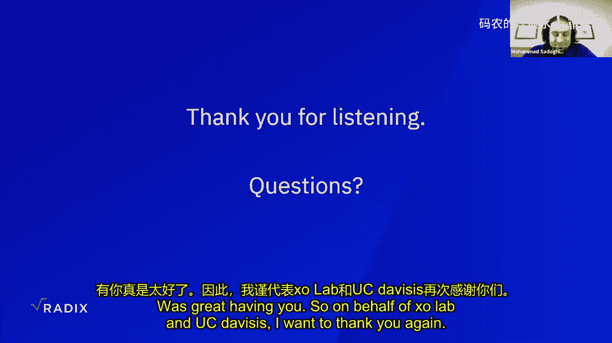
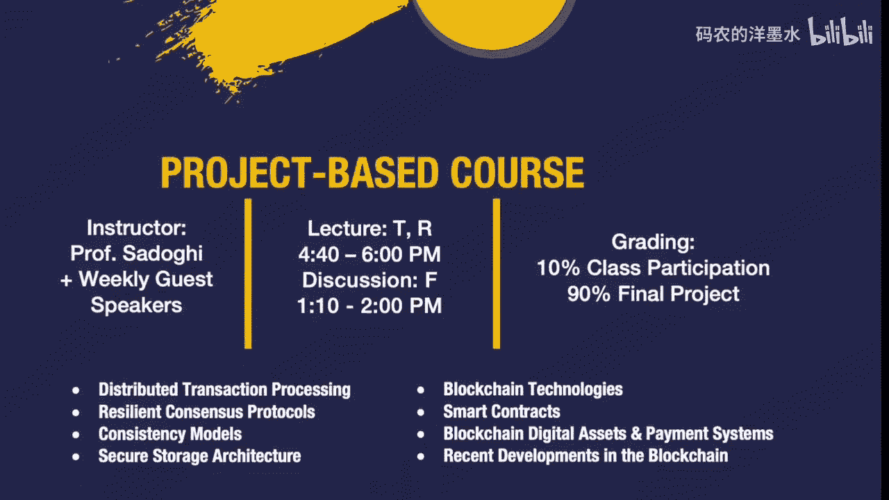

# 016：Radix的核心原理

## 概述

在本节课中，我们将学习Radix分布式账本技术的核心原理。我们将从创始人Dan Hughes的视角，了解Radix项目的发展历程、设计目标，并深入探讨构建一个无需许可、可扩展的区块链平台所需考虑的四个关键方面：数据模型、分片模型、共识机制和女巫攻击防护。课程将解释这些组件如何协同工作，最终实现一个安全、可扩展且支持复杂原子操作的平台。

---

## 项目背景与目标

大家好，欢迎来到区块链系列讲座。今天，我们很荣幸邀请到Radix的CTO兼创始人Dan Hughes。Dan在NFC移动支付领域有深厚的基础研究背景，近年来一直专注于区块链。他创立并开发了Radix项目，我们的实验室在过去一年左右也有幸与Radix团队合作。今天我们非常兴奋能请到Dan。

感谢教授的邀请。我原本希望这次演讲能更技术化一些，但Radix涉及众多领域和主题，将其纯粹技术化并归入单一主题并不合适，那样可能会让大家失去对Radix整体及其目标的背景理解。因此，我将从一个较高的层面，概述我们过去几年所做的工作、必须思考的问题，以及构建一个无需许可的区块链或分布式账本时需要考虑的关键事项。我们将探讨所有这些因素如何共同构成一个可扩展、安全、分片的共识平台。如果大家有任何问题，可以随时提问。

我的旅程和大多数人一样，始于比特币的发布。比特币最吸引我的一点是，有人成功地在无需许可的环境中解决了拜占庭将军问题，这在此前对我们计算机科学家和爱好者来说几乎是天方夜谭。之前从未有人真正接近解决这个问题，总是存在某种中心化元素或需要信任某个实体。

我是一名工程师，喜欢拆解事物、理解其工作原理、测试极限，并尝试改进或发现可以修复的低效之处。因此，在很久以前，我研究了比特币白皮书，获取源代码，进行拆解、测试，搭建网络，运行大量交易以观察会发生什么。

我发现或直觉上认为，随着时间的推移，比特币会在计算、存储、通信等方面遇到可扩展性问题；挖矿会逐渐中心化（当时还没有GPU加速卡用于工作量证明）；并且由于网络中的经济、发行和激励机制，比特币将长期保持市场波动性。

在对比特币进行了几年的研究和多次“破坏性”测试后，我认为，如果比特币想成为一种全球货币，想要去中心化全球金融并成为一个价值网络，那么它首先需要能够扩展。其他问题或许可以容忍，但如果将70亿人接入当时的比特币（即使是现在的比特币），也会导致重大问题。这大致就是Radix在2013年的起点。

我首先思考的是如何扩展区块链，这自然引向了多链、区块树和有向无环图（DAG）的路径。这主要是改变数据层，允许多个计算共识实例运行，使得网络的不同部分可以在不同时间处理不同事务。此时它还不是传统意义上的分片，每个人仍然存储所有数据，但这种数据模型允许存在多个共识实例。不过，这种方法有很大的局限性，例如无法在你所在的分支之外进行交易等。尽管如此，它是通往下一个迭代——称为“Tempo”——的垫脚石。

Tempo是第一个真正的分片模型，有1024个分片。状态中的数据被明确地彼此分离，存在一种稀疏状态树，网络中的节点可以重建它，并从需要的地方获取状态树的片段，验证状态的有效性。该模型中的验证者很大程度上是无状态的，因此存在数据孤岛和验证者，数据孤岛向验证者提供所需的状态信息。

这个模型显示出了很大的潜力，但像零知识证明、用于从稀疏默克尔树证明状态的子弹证明、阈值签名等技术，在2015年时还远未成熟到可以实际应用的程度。

因此，我们进入了下一个迭代，称为Tempo。值得注意的是，每一次迭代虽然从某种意义上说是失败的，但都带来了很多学习经验，这些经验被传承下来。每次我们在规模化和效率方面都取得了显著进展。当我们到达Tempo时，我们有了更明确和改进的分片模型，更深入地理解了数据模型和分片模型需要如何交互。我们的共识机制是异步的，它使用逻辑时钟和状态承诺来确定事件发生的顺序以及网络中哪个事件获得了多数同意。

在2019年，通过这个迭代，我们实现了每秒超过100万笔交易，并在大约15分钟内重放了整个比特币历史（4.6亿笔交易）。我们以为Tempo已经成功了，但它存在一些边缘情况，涉及相当严重的安全性和活性问题。我们花了一些时间，可以解决这些问题。但真正缺失的是**原子性**。

原子性在当前尤为重要，尤其是在各种DeFi产品中，它们都涉及跨合约交互，例如收益耕作，智能合约需要与其他地方的智能合约进行通信。

因此，我们带着从Tempo中学到的几乎所有经验，重新开始，最终得到了Cerberus。它为我们提供了可扩展性和所需的原子性，但其共识机制与Tempo有根本性的不同。

到目前为止有问题吗？大家都明白？很好。

---

## Radix的设计目标与核心组件

Cerberus是我们过去七年左右所有先前迭代和研究的结晶。我们的目标是开发一个可扩展的网络，无论其形式是分片还是其他机制，是否无状态等。我们的延伸目标是让它比工作量证明更高效，同时提供类似的安全级别。

Cerberus比我们最初设定的目标走得更远一些。它允许我们拥有一些额外、理想且有趣的功能，例如复杂操作的**可组合性**和前面提到的**原子性**。

这些功能很重要。以比特币为例，让它做其设计之外的事情非常困难。它的角色非常特定，本质上是转移价值。多年来提交了各种比特币改进提案，增加了新功能，但用它进行复杂操作仍然很困难。下一步是以太坊，它拥有图灵完备的虚拟机，开发者可以轻松组合复杂操作，但实际开发中仍然存在很多复杂性。

我们稍后也会讨论这些。在开发这项技术和Cerberus时，我们花了大量时间思考的主要有四到五个主题。

1.  **数据模型**：如何组织账本上的数据？它是如何构建的？它是否需要是通用的，以便网络不关心正在处理的信息内容，只负责达成共识、确保安全，而数据内容由应用层处理？还是像比特币那样非常特定，只有交易，因此可以拥有更简单的数据模型？
2.  **分片模型**：分片看起来如何？如何分片数据？如何分片状态？如何分配验证者来处理这些分片？是动态分片模型还是静态分片模型？这些都是需要考虑的不同问题和事项。
3.  **共识机制**：显然，你需要某种共识机制，以便状态机副本能够就发生的事件达成一致，可以重放和验证，确保一切正常。
4.  **女巫攻击防护**：或许中本聪用工作量证明和区块链解决的最困难的问题是女巫攻击防护。如何防止恶意行为者轻易控制网络？如何确保始终满足 2f+1 的保证？如何使其变得昂贵，无论是通过计算、经济还是其他声誉手段？比特币的天才之处在于，它能够使用工作量证明作为女巫攻击防护机制，同时也将其用作共识决策要素（例如，当存在多个链时，选择工作量最多的最长链），还将其用作货币分发的经济手段，一举三得，非常优雅。

由于本次演讲不会完全技术化，你可以在我们与Expo实验室合作的Cerberus共识论文中找到一些技术内容。他们帮助我们验证了我们的想法是否可行。教授和他的团队在这方面做了很多工作，我们非常感激。论文内容需要动点脑筋消化，但值得一读。此外，在 radixdlt.com 上，我们有很多内容，包括我将要讨论的一些内容的白皮书、关于Radix将采用的经济模型及其激励机制的经济学论文，以及关于Radix引擎（我们Radix技术栈的应用组件）的文档。

---

## 数据模型

首先从数据模型开始是合理的，因为一切都源于此。数据模型相当简单，这是件好事，但它非常适合分片。

如果我是客户端，想要向网络提交某个操作（例如交易）以供执行，我会创建一个称为 **Atom** 的原语。Atom是称为 **Particle** 的原语的集合。一个Particle携带状态信息以及对该状态执行操作的操作指令。

例如，假设你拥有10个比特币，并想花费给其他人。那么携带的状态就是你拥有10个比特币且尚未花费，操作指令是创建一个新的Particle，将这10个比特币转移给你要花费的对象。

Particle还可以携带消息并执行各种操作，包含状态、有效载荷和操作指令。Particle有一个 **Spin**，代表该Particle的生命周期。在上一个例子中，代表你持有的10个比特币的Particle将处于 **Spin-up** 状态。当你花费它并且Atom被执行时，该Particle将进入 **Spin-down** 状态。Spin-up 类似于构造函数，Spin-down 类似于析构函数。只有这两种明确的Spin状态。还有第三种隐式状态，基本上是中性状态，意味着Particle尚未被构造或销毁，它根本还不存在。

状态模型（或者说数据模型）深受比特币UTXO（未花费交易输出）模型的启发。它非常适合状态分片，因为你有这些输入和输出（或Spin-up和Spin-down），不需要跨分片跟踪余额，更容易让某个状态永久驻留在特定分片中，然后只在该分片内管理其生命周期。

这也意味着，如果你以确定性的方式映射你的Particle，它们将始终驻留在同一个分片。因此，给定关于Particle或某个状态的特定信息，网络中的任何人都将始终知道该特定状态片段的整个生命周期将驻留在哪个分片，从而在需要时很容易获取该状态。

为了更直观地展示，请看这个简单的示意图。绿色的Particle处于Spin-up状态，红色的处于Spin-down状态。你可以将这些想象成比特币，每个Particle代表一个比特币，这些比特币在网络中流转。从这个图中可以很容易地看到Particle如何从Spin-up状态转换到Spin-down状态，并且可能会创建新的Particle（因为接收资金的人获得了新状态）。在一系列Atom之后，所有状态的总和代表了这些Particle的总账本状态。

显然，有些操作中你不希望Particle进入Spin-down状态。例如，如果你有一条消息，你无法“花费”一条消息或将其置于任何Spin-down状态，它要么存在，要么不存在。同样，如果你在创建一种代币，那么定义该代币属性（流通量、发行曲线等）的Particle，你绝不希望它进入Spin-down状态，因为如果那样，可能会使所有已创建的这种代币失效。

关于智能合约如何融入这个模型？这正是我们整个Radix技术栈的众多组成部分之一，很难在一小时内涵盖所有内容。我们正在做的一件事是拥有一个称为 **Radix引擎** 的组件。Radix引擎是Particle的应用环境。我们当前的版本相当简单，包含一些预定义的组件，Particle可以调用它们来执行各种操作，例如消息、代币价值转移、代币定义、多重签名等。

我们正在开发Radix引擎的下一个迭代，使其更加灵活和通用，实际上允许你编写自己的状态机，Particle可以调用它来执行特定操作。例如，你可以部署一个特定的状态机，对具有特定参数或输入参数的Particle执行某些代码和功能。这样，你可以实现Particle和状态机的有趣组合，定义它们的执行顺序，完成所有这些可组合性操作。

这对开发者来说非常重要，因为目前很容易在Solidity等语言中犯错。我们更多地从另一个方向着手，提供类似乐高积木的预定义状态机，你可以将它们组合起来，满足开发者90%的需求。但如果你是硬核开发者，或者在构建去中心化应用方面进行真正的创新，你可以更深入，编写实际代码，定义状态机，然后将其作为Particle部署到网络上。

为了吸引开发者，我们还采用了这样一种模式：我可以为我提交到网络并被使用的任何Particle状态机定义收取版税。这有点像将你的依赖项货币化。我可以构建一个非常酷的东西，其他人可以利用其他可用的依赖项、Particle、内置组件以及所有这些不同的状态机定义，围绕它构建不同的应用程序，变得非常像拖放操作，在很大程度上几乎成为领域特定语言。如果你想深入底层，也可以做到。

---

## 分片模型

分片模型可能是迭代次数最多的部分。尝试创建一个能满足我们标准的模型，允许我们进行状态分片，以一种高效的方式进行，以补充数据模型和共识机制，同时还能处理所有女巫攻击防护问题，这确实花费了大量时间。

最终，我们确定了一个想法：我们应该有一个非常大的、稀疏的**分片空间**。如图所示，我们有一个 2^256 的分片空间，这是一个巨大的数字。选择固定分片空间的原因是，你可以在固定分片空间内执行这些有趣的确定性函数。如前所述，你有一个Particle，你知道它将始终驻留在哪个分片，你知道如何索引到该分片，你知道如何查找需要与谁交谈以获取该分片中的信息。

如果是动态分片空间，分片数量可能会增长或收缩，那么这些信息将不断变化，Particle和状态信息以及共识输出将随着分片空间的增长或收缩在不同分片之间转移，那么你就会遇到诸如如何针对不断变化的分片空间同步新副本、如果分片空间不断变化如何确定谁将服务哪些分片等问题。这些问题起初看似微不足道，但实际上变得非常复杂。

因此，仅仅拥有一个固定的、已知的、静态的分片空间（无论是 2^256 还是其他数字）是最好的，因为空的分片不占用任何空间、通信带宽或CPU。拥有一个非常大但稀疏的分片空间的一个优点是，当无状态验证技术进一步发展时，固定但稀疏的分片空间可以很好地映射到稀疏默克尔树等结构上，以及所有正在开发的利用数据集稀疏性来证明或证伪特定事物的各种零知识技术。

分片包含共识输出、任何状态信息、Particle生命周期内的任何参数和有效载荷。由于分片空间如此之大，两个Particle占据同一个分片的几率微乎其微。一个Particle及其分片（或者说一个分片负责一个Particle）使得你总能知道需要去哪个分片、需要与谁交谈以获取该分片的信息、确定该Particle的生命周期和状态等。映射函数相当简单，只是Atom和Particle哈希的函数，它们决定了该Particle及其生命周期内的后续信息驻留在哪里。

显然，在分片模型中，你需要验证者，需要一个机制来确定谁验证什么、他们在哪里、他们做多久、他们是否被轮换、如果验证者离开网络会发生什么、当他们加入时会发生什么。我们有一个全局的验证者集合，他们通过某种方式注册到网络。根据我们拥有的验证者数量、网络中看到的吞吐量、占用的分片数量等输入信息，我们将这些验证者放入集合中，并确定每个验证者集合负责哪些分片组。

例如，如果我们网络中有1000个可用验证者，并且我们想绝对最少维持每个集合10个验证者，那么我们最多可以有100个验证者集合。这100个验证者集合将大致负责整个分片空间。在这种情况下，分片空间将被分成100等份，一个验证者集合将负责百分之一的分片空间。

这里有一个 **Epoch** 的概念，目前是每天一次。在每个Epoch，我们会轮换验证者集合。原因有二：第一，我们不希望任何被攻破的验证者集合保持原状，因此在轮换时，我们会移出一部分验证者并用其他验证者替换，希望移除一些恶意验证者；第二，验证者可能会离开网络，如果你不轮换验证者集合并移除那些已知离开的验证者，那么之后可能会遇到活性问题。

为了能够管理验证者集合并将它们放在需要的位置，并在每个Epoch轮换它们，有一个 **根分片** 的概念，专门用于存储注册的验证者信息。稍后我们还会看到，该分片中还有一些与我们的女巫攻击防护模型相关的附加信息，这些信息决定了谁进入哪个验证者集合以及他们去哪里。但本质上，这个根分片每个人都有副本，它提供了所有验证者信息。从该根分片，对于任何给定的Epoch，你都可以确定性地计算谁在服务什么、验证者集合是什么样子、他们服务哪些分片组等。

因此，Particle和状态信息查找是高效的。当前Epoch的验证者集合充当了进入分片空间的映射。

我提到过未来某个时候转向无状态验证者。这样做的原因是，轮换验证者集合是有成本的。一些现有集合中的验证者将被移出到不同的集合，而该不同集合将服务不同的分片组，因此这些验证者将没有那些分片的信息。在每个Epoch，离开当前集合并移动到新集合的验证者需要与新集合中的验证者同步所有状态信息和Particle信息。这显然有成本，不仅对移动的验证者，也对特定集合中剩余的验证者，因为他们必须将信息传递给新加入者。因此，Epoch不能太短，否则网络将陷入无休止的验证者同步，消耗可用带宽、吞吐量和计算资源。

如果你有无状态验证，即有一种安全的方式向一组验证者提供状态，他们可以高效地验证并确信其正确性，那么他们就不需要同步状态，因为他们可以信任并验证提供给他们的任何状态。这样，你可以更自由地移动验证者，可以在不增加额外工作的情况下移除被攻破分片中的恶意部分，并且你的Epoch也可以更短。因此，如果有人想在受攻破的验证者集合内造成破坏或导致活性/安全性故障，其机会窗口也会更短。

---

## 共识机制

如果你读过Cerberus论文，你可能已经了解了大部分内容。对于那些还没读过或没时间读的人，简单来说，Cerberus有两个共识域：**状态共识域** 和 **账本共识域**。

状态共识是在验证者集合内运行的共识。这些验证者处理正在执行某个操作的特定Particle，他们查看该分片中存储该Particle所有信息的数据，并希望他们的共识机制就“该状态是否发生了此更改”达成一致或不同意。

如果你有一个包含多个Particle的Atom，那么你将涉及2、3、5、10个或任意数量的验证者集合，它们都将为各自负责的特定Particle进行状态共识。

账本共识发生在本地共识完成，并且他们就“是”或“否”达成了法定人数（例如准备提交、预提交等阶段）之后。此时，所有这些特定分片的验证者集合的领导者相互交叉通信他们的法定人数证书，以传递关于“应该发生什么”的“是”或“否”协议。

之后，所有验证者集合的领导者按顺序拥有当前阶段的所有法定人数证书。如果存在多数“是”，则他们进入下一阶段；如果没有，则不进入。这就是账本共识。具体来说，所有验证者集合必须在所有阶段获得 2f+1 个验证者的同意才能提交，但任何验证者集合在任何阶段获得 2f+1 个验证者的反对即可中止。

这意味着：如果我们有一个涉及三个分片的交易，那么为了将其提交到账本并让所有状态更改发生，你需要分片一、分片二、分片三都获得 2f+1 的“是”同意。但如果你有分片一和二分同意提交，而分片三说“不”，那么整个提交将在所有分片中止。无论你有多少个验证者集合，即使你有一个涉及100个分片的非常复杂的事件，只要这100个中有一个产生了 2f+1 的“否”法定人数证书，那么其他99个分片也不会提交。这对于原子性和DeFi及去中心化应用非常重要。

这些规则也帮助我们在女巫攻击防护方面做了很多工作。

Cerberus的另一个优点是，状态域共识实际上可以是任何东西。只要你在那里使用的任何东西都能产生符合Cerberus要求的法定人数证书，那么你可以让一些分片使用HotStuff，一些使用PBFT，一些使用Raft，甚至一些使用电话会议共识——只要你能产生法定人数证书。只要那些进行状态域共识的验证者集合能产生Cerberus可用的法定人数证书，你就可以让这些不同的共识机制在状态级别运行。如果你想放宽一些安全性和活性保证，采用概率性共识，通过一些工作，你甚至可以让一些验证者集合使用工作量证明类型的区块链混合体。

为了更直观地展示，请看这个示意图。它展示了偏向乐观的Cerberus协议的一个例子。这里有一些相当棘手的方面，比如内存池（待处理交易池）以及如何从中选择交易以获得响应性并维持低延迟网络。因为如果你有不同的验证者集合服务不同的分片组，那么处理Particle X的领导者从内存池中挑选特定内容并开始他的回合（例如预准备阶段）时，处理该Atom中Particle Y和Z的验证者可能正忙、可能有积压、可能负载很高，因此他们可能在一段时间内无法处理第一阶段，从而导致超时问题。如何处理超时？如何尽可能同步所有不同验证者集合的内存池，以确保如果出现负载或延迟问题，可以将其降至最低？这本身就是一个完整的主题领域。

这张幻灯片假设这些问题已解决。本质上，这里发生的是：分片X中Particle X的领导者启动了这个特定Atom的三阶段提交过程，该Atom涉及X、Y、Z分片中的Particle。他进行准备阶段，添加一些信息，包含一个先前的法定人数证书（这是必需的），增加视图编号，进行所有必要的内务处理，然后广播给集合中的验证者。

然后他等待这些验证者的响应一段时间。如果没收到，则超时；如果收到足够响应以形成法定人数，则一切顺利，可以继续；如果没有足够响应形成法定人数，则失败，客户端被告知此操作无效。在这个特定协议中，分片Y和Z中的验证者甚至不知道发生了什么，因为在这里就短路了。

如果确实有足够的验证者同意形成分片法定人数，那么该法定人数证书会广播给分片Y和Z的领导者。他们做同样的事情：进行准备，包含他们正在处理的上一轮的任何先前法定人数证书，包含Atom、Particle等信息，打包准备消息，发送给其验证者集合中的验证者，等待响应。

他们是否有法定人数？如果有，则将该法定人数证书通信给分片中的领导者。他们收到这些证书后，这就是Cerberus发挥作用的地方。Cerberus验证这些法定人数证书，检查我们是否在所有分片上有足够的法定人数以继续。如果不能，则失败；如果可以，则进入下一阶段。

所有这些特定分片中的领导者然后进行预提交，他们包含先前的法定人数证书（将是上一轮的准备），广播给验证者，等待响应，查看是否有状态法定人数，如果有，则将其传播给分片中的其他领导者。他们等待来自其他分片的法定人数证书，接收它们，检查是否所有验证者集合都有账本法定人数，是则继续，否则失败。

失败情况显然可能有多种：超时、分片被攻破（其中对手拥有三分之一的投票权，他告诉集合中的一组验证者“是”，另一组“否”），通信问题等。

我们使用HotStuff的另一个原因是，如果领导者失败或被怀疑是恶意的，进行视图变更非常容易简单，后续领导者可以很容易地接替该领导者离开的地方（如果他们确实提交了一些有效阶段并将其提交到账本）。例如，如果此处的领导者在预提交阶段失败且没有恢复，其他分片完成了这一轮并提交了。最终，Particle X的验证者集合中的其他验证者会得知：“我们已经做了这件事，正在等你。你还没有给我们你的提交决定。”这里可以快速进行领导者选举和视图变更，从离开的地方继续，进行一些状态级共识，然后可以向等待的分片报告结果。

所以，澄清一下，就像Cerberus一样，在分片内部，你仍然在使用PBFT（或类似机制），而Cerberus是为跨分片交换而实现的。是的，基本上是这样。Cerberus是你的跨分片协议。各个验证者集合进行实际分片级共识（可能是PBFT、HotStuff或其他）有一些要求。为了使两者协同工作，有一个规范，规定了特定分片使用特定本地共识机制的验证者必须产生什么、以什么格式、符合什么规范，然后才能通过Cerberus协议传递给其他分片的领导者，并共同决定：“我们是否就此达成账本级共识？”

---

## 女巫攻击防护

我假设这里的每个人都了解女巫攻击及其含义，以及缓解女巫身份和攻击的各种技术。但对于那些不了解的人，简单来说，女巫攻击是一种创建许多无法相互关联的身份的方法，目的是压倒或影响或控制某些资源、协议或过程。

在现实生活中，我们可能会遇到女巫攻击，例如，如果我能够为自己创建许多身份，我可以在选举中多次投票，或者我可以获得多个银行账户和多个贷款，享受仅限新客户的优惠利率，但我扮演了100个新客户。

对于工作量证明，产生那个前面有一定数量零的哈希值（你通过暴力计算找到的）是最流行的女巫攻击防护形式。因为我必须花费计算能力、电力来找到一个具有特定难度的哈希，我不能轻易创造更多的计算能力或电力，这需要我花钱（电力成本、设备成本、设备磨损成本）。而且，至少在比特币中，这是竞争性的，因此进入门槛永远越来越高。

权益证明则有所不同。权益证明使用网络的原生代币本身作为提供女巫攻击防护的手段。原因在于代币具有价值。例如，如果比特币是权益证明网络，那么每个比特币目前价值16,000美元。对于我来说，要获得我想用作网络中权益的比特币，每个将花费我16,000美元。

有趣的是，权益证明代币也用于购买东西、投机、在整个经济中作为购买力。它有多种用途。因此，它不仅用于安全，也有一定的效用。如果你分析权益证明网络，通常会发现有3%到5%的流通货币被用作权益证明。

因此，如果你想压倒一个权益证明网络（例如最终将转向权益证明的以太坊2.0），你需要购买或拥有大约1.5%的所有以太坊流通供应量。在经济方面，这开始变得有趣。在公开市场上，通常也有大约3%到5%的流通货币。因此，如果我需要购买1.5%的所有流通货币来压倒以太坊2.0，而公开市场上只有3%的流通货币可用，那么我购买这1.5%的行为将推高该代币的价值。

所以，当我试图购买更多权益来攻击网络时，我想购买的每个以太坊的成本会越来越高，因为我通过购买行为推高了以太坊的价值。因此，这开始变得相当昂贵和复杂，有很多变数，因为你不仅要对抗网络中的诚实参与者，还要对抗市场，因为我买得越多，价值就上涨得越快。这实际上激励了人们在价值快速上涨时不出售。我试图购买更多权益来压倒网络的次要后果是，市场上实际可用的权益反而更少，因为此时市场中的理性参与者会持有而不出售。

当然，我可以更隐蔽地进行，我可以慢慢积累。但那是非常长线的玩法，大多数51%攻击或双花攻击或对网络的尝试通常持续时间较短，因为展望那么远的未来（市场会如何、网络拓扑结构如何、验证者集合有哪些、有多少验证者、验证者集合在哪里、网络是否增长所以我被放入特定集合的机会更小）并不常见。长线攻击通常不是理性对手的行动方案。当然，如果我不关心双花，只想破坏网络，那么我可以慢慢积累，然后在后期释放，但这通常是你无法过多防御的，就像你无法真正防御自私挖矿和长线工作量证明攻击一样。

关于权益证明还有很多边缘情况需要考虑，尤其是在区块链中，例如 **无利害关系问题**。这是以太坊必须努力解决的问题之一，因为他们的分片实现方式以及他们的数据模型（基于余额而非UTXO）等工作方式。

无利害关系问题是指存在链的分叉。我可能会在两条链上都下注，创建区块。问题在于，在权益证明中，因为我的权益是有效的，并且在我质押权益的点之后存在分叉，那么我在所有这些分叉上都有多个我的权益副本，它们彼此同样有效，因此我可以在所有这些不同的分叉上挖矿、生产区块、验证。这没有成本，所以这就是权益证明网络中惩罚条件等发挥作用的地方。在工作量证明中，我不能那样做，如果我想在不同的链上挖矿，我必须将我的哈希算力分散到我可能感兴趣的所有链上。

无利害关系问题只是众多问题之一，还有惩罚条件可能是主观而非客观等问题。我强烈建议任何对区块链上的权益证明女巫攻击防护感兴趣的人去阅读以太坊关于Casper等的所有资料。

在我们的模型和Cerberus中，幸运的是，我们不必担心其中一些边缘情况，但我们仍然需要考虑一些。首先，我将深入探讨当你有验证者集合时权益是如何使用的，以及这意味着我们需要处理的一些边缘情况。

在此之前，网络中的验证者，其一票代表价值“1”。在基于权益证明的Cerberus网络中，验证者的投票权重由其控制的权益数量决定。因此，如果我有一个拥有100个Radix代币的验证者，另一个有10个，那么这些验证者拥有的投票权是不同的。一个是100，一个是10。

如果这两个验证者自己在一个分片组中，那么拥有100的验证者基本上控制每一票。而拥有10的验证者并不是真正需要的，因为他只能与拥有100的验证者一起投票，因为如果他自己投票，他没有该分片和验证者集合中总权益的 2f+1（因为在这个模型中，f 代表故障权益的数量）。如果总权益是110，那么他只有不到10%的权益。

因此，f 代表故障权益的数量。验证者及其投票由其控制的权益数量加权。如果你错误地生成了验证者集合，那么你可能自然就会得到一个拥有大量权益的特定验证者，他可以控制那个验证者集合，即使他不是恶意或敌对的，你也不希望这样。

因此，我们必须解决的更困难的事情之一是如何在每个Epoch生成验证者集合。它们需要负载均衡，以避免出现一个验证者有100权益而其他人都只有1权益的情况。显然，你希望这样做，因为你既不希望那个特定验证者控制验证者集合，也不希望如果他碰巧离线、崩溃或因任何原因出现故障而从该集合中消失时，导致该验证者集合想要验证的任何事物出现活性问题。

我们目前正在研究解决这个特定问题的方法，你们中的一些人也在与教授一起研究。我们目前正在研究的解决方案是**组合优化**。我相信你们许多人都听说过背包问题、旅行商问题等。这是我们用来负载均衡验证者集合的方法之一，以确保我们没有在验证者集合中拥有不成比例的投票权。

我们不能使用简单的规则，比如“将所有拥有10个Radix权益的验证者放入同一个集合”，因为那样的话，我作为对手，只需创建一堆拥有10个Radix权益的验证者，那么它们很可能最终都在同一个验证者集合中，我就可以控制那个集合。显然，我们也不希望对手能够控制他们的验证者去向。

因此，这些验证者集合的生成以及谁去哪里，最初是由任何权益活动、任何新验证者注册、我在几页前提到的根分片中验证者配置的任何更改来“播种”的。这样，如果我试图使用蛮力计算能力来计算“网络将选择哪种对我最有利的验证者集合配置，能将我的验证者放在这个特定位置”，那么如果我尝试去调整下一个Epoch将使用的输入以产生我期望的输出，我对该输入的调整（我的更改、我移动权益的位置、我移动我控制的验证者的位置）将产生不同的输出，因为我改变了输入。所以这也是一个棘手的领域，我们一直在研究如何让所有这些事情融合在一起，那里还有很多其他边缘情况。

例如，如果我有一个验证者集合，其中少数验证者拥有大量权益，并且我引入许多其他验证者来尝试负载均衡，那么我不希望该验证者集合变得太大，因为那样会有内部通信复杂性问题，并且我可能实际上没有足够的验证者来组成我需要的其他验证者集合。

关于女巫攻击防护就讲这么多，这更像是一次头脑倾倒，而不是一次有建设性的演讲，但希望它对某些人有一定意义。

---

## 原子性与用户体验

今天我想讨论的最后一件事是DeFi用户体验和原子性。原子性或许是我们从Tempo转向的主要原因，因为我们当时没有这个特性。它之所以重要，是因为分布式应用、DeFi产品正变得越来越复杂，开始对许多其他事物有很多依赖。

例如，如果我使用一个Uniswap资金池，我有一些以太坊，想兑换一些美元，可能某个地方有一个预言机提供价格信息到那个池子，然后一旦我完成，在另一个地方的另一个池子有一个套利机会，然后那又反馈到某个交易所。如今的产品和应用程序都在进行这些与所有不同移动部分之间的复杂交互。

因此，能够进行**原子性的跨分片提交**不仅仅是锦上添花，对于这些复杂的DeFi和分布式应用来说，它是必须具备的。因为它能带来更好的用户体验和开发者体验。如果开发者必须串行操作，先提交这个，再提交那个，然后在这里做这个，在那里做那个，那么每个提交、转换、检查是否成功、在哪个区块、是否发生等，都会带来很多复杂性。如果失败怎么办？如何回滚？如何进入下一阶段？然后我在这里做什么？这变得非常非常复杂。显然，如果复杂，就可能安全性较低，因为人类编写这些代码时难免出错。

从长远宏观来看，原子性的跨分片提交对网络也更高效，因为你不需要处理“出错时该怎么办”、“执行这组功能需要多少步骤”、“我将在网络上调用多少次写或读操作”等复杂性。

为了突出其中一些问题，我准备了一个简单的例子：一个非原子性的假期预订，然后在下一张幻灯片上有一个原子性的版本。

假设我有一个应用程序，可以一站式满足我所有的假期需求：预订航班、预订酒店、租车、预订一些短途旅行等。在应用程序中，我可以列出所有这些事项，然后点击“开始”。在幕后，应用程序根据我的要求选择航班、预订酒店、租车等。

在**非原子性**的情况下，你依次在分片一预订航班（提交），在分片二预订酒店（提交），在分片三租车（提交）。但如果租车时没有你想要时间的车可用，提交失败，而你已经预订了酒店和航班，也许你不在乎车，但酒店和航班已经订好了。如果酒店和车都不可用，但你已经订了航班，也许你不想去那个假期了，因为去不了想去的酒店，没有车，也不能做想做的吉普车之旅。那么应用程序必须以某种方式撤销之前的操作，否则你会留下不想要的机票。它可能需要向网络发出另一个指令说“撤销上一个操作”，但撤销可能失败，或者可能无法在账本上取消航班，你必须打电话给航空公司。那么我应该先执行哪个操作？哪个最重要？酒店最重要？航班最重要？租车最重要？如果失败，我最愿意被哪个困住？

从开发者的角度来看，实现这个功能、处理失败情况非常复杂。从用户的角度来看，体验不好，因为这需要一段时间，如果任何环节失败，可能会给我带来麻烦。因为已经订了航班，去不了那个酒店，我得打电话尝试取消，这不是良好的用户体验。

而在**原子性**的情况下，你可以在同一个状态转换（同一个Atom）中发出预订航班、预订酒店、租车的指令。所有这些不同的操作将在各自的分片中进行状态级共识。如果任何一个失败，那么它们都会失败（因为顶层的Cerberus协议）。要么全部通过，要么一个都不通过。没有需要清理的东西，开发者不需要处理回滚逻辑，用户不需要因为其他环节出错而打电话给酒店取消，没有遗留的零碎事项。

因此，展望未来，随着DeFi和去中心化应用的发展，这只是一个非常简单的例子。有些应用变得非常复杂，如果出现问题，会有很多清理或回滚工作，在某些情况下你甚至无法回滚。想象一个套利机会：我购买一些以太坊，等待提交，然后在下一个操作中，我将以太坊转移到某个交易所，因为那里有很好的套利机会，然后等待提交，然后在交易所最终抓住套利机会，出售我的以太坊，换回一些Radix。但如果中间环节失败或耗时太长，或者当到达交易所时套利机会已经消失，那么我现在手头有一些我并不真正想要的以太坊，或者因为套利机会刚刚消失。而在原子性的情况下，购买以太坊、转移到交易所、然后抓住套利机会，所有这些在一个操作中完成。如果到这些步骤完成时机会已经消失，那么整个操作取消，我不会留下一袋需要以可能亏损的价格在其他地方出售的以太坊。

---

## 总结

本节课中，我们一起学习了Radix分布式账本技术的核心原理。我们从项目背景出发，了解了其从早期迭代到当前Cerberus共识的发展历程。我们深入探讨了构建可扩展区块链平台的四个关键支柱：

1.  **数据模型**：基于类似比特币UTXO的Particle和Spin状态，实现了确定性的状态生命周期管理，为高效分片奠定了基础。
2.  **分片模型**：采用巨大的固定但稀疏的分片空间，结合验证者集合和Epoch轮换机制，实现了状态的高效定位与负载均衡。
3.  **共识机制**：结合分片内的本地共识（如HotStuff）和跨分片的Cerberus协议，确保了交易的安全提交与原子性。
4.  **女巫攻击防护**：通过权益证明和经济激励设计，使得攻击网络变得极其昂贵且不切实际，保障了网络的安全基础。

最后，我们重点讨论了**原子性**对于复杂DeFi应用和良好用户体验的至关重要性。Radix通过其整体设计，旨在提供一个可扩展、安全且开发者友好的平台，以支持下一代去中心化应用。

感谢大家的聆听。