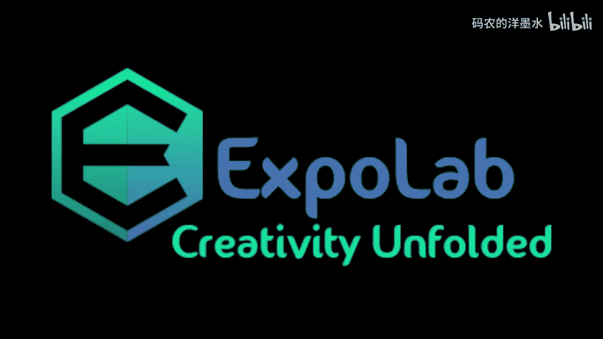
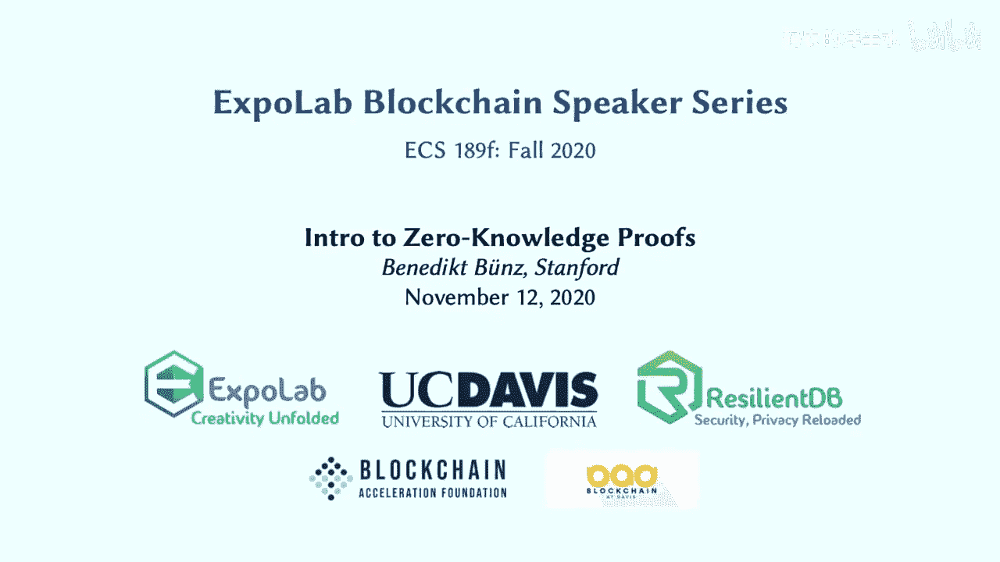
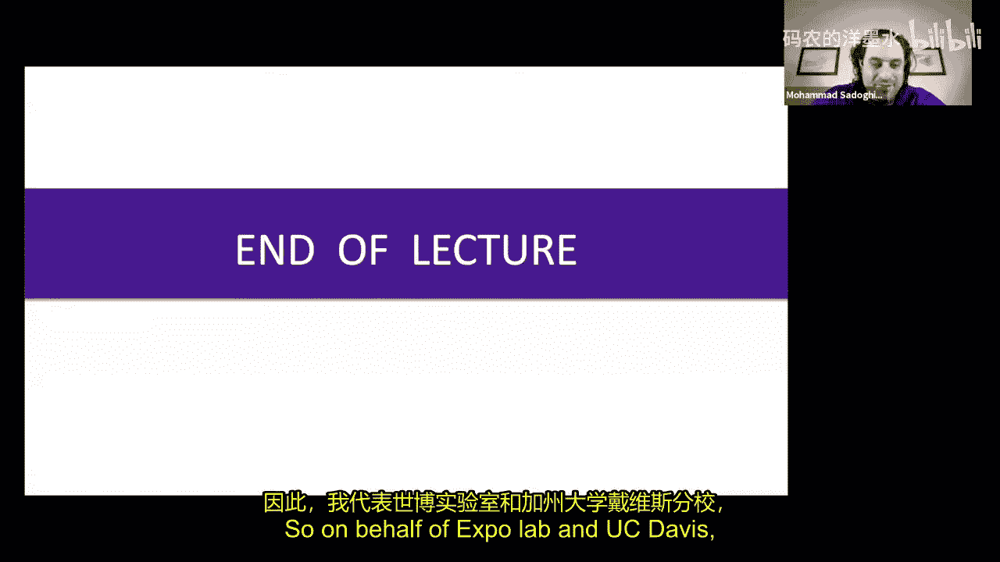
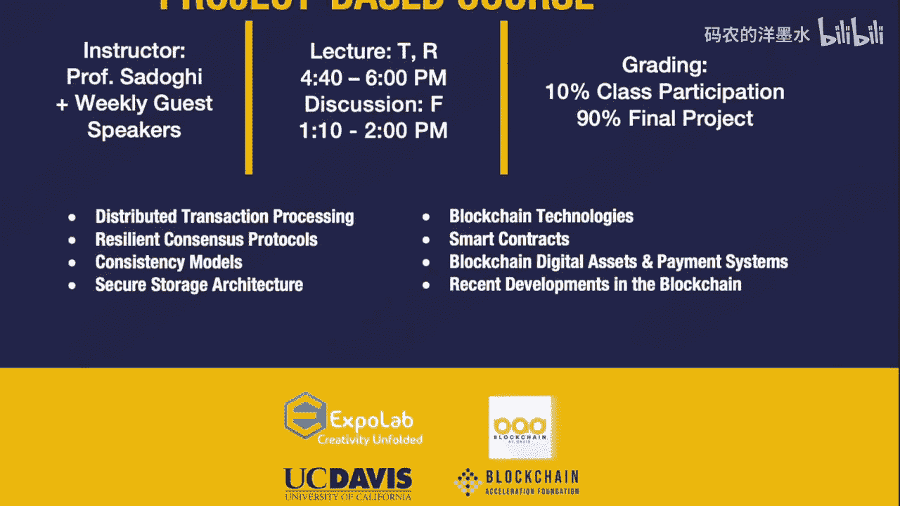

# 017：零知识证明入门 🧠

在本节课中，我们将要学习零知识证明（Zero-Knowledge Proofs, ZKP）的基本概念、工作原理及其在区块链技术中的应用。零知识证明是一种强大的密码学工具，它允许一方向另一方证明某个陈述是真实的，而无需透露任何关于该陈述本身的信息。这对于在保持区块链公开可验证性的同时，实现交易隐私至关重要。

## 概述：区块链的挑战与零知识证明的解决方案

区块链的核心原则之一是**公开可验证性**。这意味着所有写入区块链的数据都是公开的，任何人都可以验证每笔交易的有效性。然而，这一特性似乎与**隐私保护**相矛盾，因为交易细节（如发送方、接收方、金额）的公开会暴露用户信息。

零知识证明提供了一种巧妙的解决方案。它允许用户在不泄露交易细节的情况下，向网络证明其交易是有效的。这通过将交易数据加密，并附上一个证明（Proof）来实现。网络中的验证者（如矿工）只需验证这个简短的证明，而无需知晓交易的具体内容，从而在保持公开可验证性的同时，实现了隐私保护。

## 算术电路：零知识证明的计算基础

在深入零知识证明之前，我们需要理解**算术电路**的概念。算术电路是零知识证明系统所处理的计算模型。

一个算术电路接收一些数字作为输入，其中一部分是公开的，另一部分是私有的（称为“见证”Witness）。电路内部由一系列“门”（Gates）组成，这些门对输入执行加法、减法、乘法等运算。电路的布线决定了哪些输入流入哪些门。

**公式示例**：一个简单的算术电路可能计算 `输出 = (x1 * (x1 + x2 + 1)) * (x2 - 1)`。这里，`x1` 和 `x2` 是变量输入。

这些运算通常在有限域上进行（例如模一个质数 `p`），以确保所有数字都在可控范围内。电路的复杂度通常由其乘法门的数量来衡量，因为乘法运算是证明系统中开销最大的部分。

算术电路非常强大，可以表达任何计算（前提是电路大小固定，不能有依赖于输入的变长循环）。例如，我们可以设计一个电路来验证SHA-256哈希值，或者验证一个数字签名。

**代码概念示例（布尔运算转算术运算）**：
*   **与（AND）门**：`x AND y` 可以表示为 `x * y`（当输入为0或1时）。
*   **或（OR）门**：`x OR y` 可以表示为 `x + y - x*y`。
*   **非（NOT）门**：`NOT x` 可以表示为 `1 - x`。

## 零知识证明系统：定义与目标

一个零知识证明系统针对一个算术电路 `C` 工作。电路接收一个公开的**陈述（Statement）** `x` 和一个私有的**见证（Witness）** `w`。当电路输出为0时，我们称电路“接受”这个输入对 `(x, w)`。

证明系统的目标是让**证明者（Prover）** 能够向**验证者（Verifier）** 证明：“我知道一个见证 `w`，使得 `C(x, w) = 0`”。这比仅仅证明“存在一个 `w` 使得 `C(x, w) = 0`”更强，因为它要求证明者确实“知道”这个 `w`。

**最简单的证明系统（非零知识）**：证明者直接将见证 `w` 发送给验证者。验证者自行计算 `C(x, w)` 并检查结果是否为0。这种方法的问题是暴露了全部隐私信息 `w`，并且当 `w` 很大时效率低下。

我们期望的证明系统应具备以下关键属性：
1.  **完备性（Completeness）**：如果陈述为真（即存在有效的 `w`），那么诚实的证明者总能说服验证者。
2.  **知识可靠性（Proof of Knowledge）**：如果验证者被说服（接受证明），那么证明者必定知道一个有效的见证 `w`。
3.  **零知识性（Zero-Knowledge）**：证明本身（以及与公开陈述 `x` 的结合）不会泄露关于见证 `w` 的任何信息。
4.  **简洁性（Succinctness）**（可选但重要）：证明的长度很短，且验证证明所需的时间远小于直接执行电路计算所需的时间。具备简洁性的非交互式知识论证被称为 **SNARK**。

## SNARKs：简洁的非交互式知识论证

SNARK（Succinct Non-interactive Argument of Knowledge）是一种特殊的零知识证明系统，它同时具备**简洁性**和**非交互性**。

*   **非交互性**：证明者生成一个证明后，可以将其发布出去。任何验证者都可以在无需与证明者进行额外交互的情况下验证该证明。
*   **简洁性**：证明的大小非常小（例如，只有几百字节），并且验证证明所需的时间极短（例如，几毫秒），且与原始计算的复杂度仅呈对数关系。

**SNARK的工作流程**：
1.  **设置（Setup）**：针对特定的电路 `C`，运行一次性的设置算法，生成一个**证明密钥（Proving Key）** 和一个**验证密钥（Verification Key）**。
2.  **证明（Prove）**：证明者使用证明密钥、公开陈述 `x` 和私有见证 `w`，生成一个简短的证明 `π`。
3.  **验证（Verify）**：验证者使用验证密钥、公开陈述 `x` 和收到的证明 `π`，运行验证算法。算法输出“接受”或“拒绝”，而验证者完全不需要知道见证 `w`。

**SNARK的威力**：它允许我们将复杂的计算验证工作外包。例如，一个需要运行一年的计算，其正确性可以通过一个仅需20毫秒即可验证的SNARK来证明。在区块链中，这意味着节点无需重放所有历史交易来验证当前状态，只需验证一个关于状态转换有效性的SNARK即可，这极大地提升了可扩展性。

## 应用一：区块链中的隐私交易

现在，我们来看看零知识证明如何具体应用于区块链以实现隐私交易。我们将从隐藏交易金额开始。

### 机密交易（Confidential Transactions）

在比特币等系统中，交易金额是公开的。机密交易旨在隐藏这些金额。

**核心工具：密码学承诺（Commitment）**
承诺就像一个密封的信封。发送方可以将一个值（如金额）放入信封并密封（生成承诺）。这个承诺不会泄露信封内的值（**隐藏性**），但发送方日后只能打开信封展示之前放入的那个值（**绑定性**）。

**实现方式**：
1.  在交易中，将公开的金额替换为对这些金额的密码学承诺（例如，`Comm(30)`, `Comm(1)`, `Comm(29)`）。
2.  为了验证交易有效性（例如，确保输入总额等于输出总额，且没有创建负金额），发送方需要生成一个**零知识SNARK证明**。
3.  这个证明的公开陈述是这些承诺值，私有见证是实际的金额和生成承诺时使用的随机数。证明所基于的电路会验证：
    *   所有承诺都是正确生成的。
    *   输入承诺对应的金额之和等于输出承诺对应的金额之和。
    *   所有输出金额都非负（防止凭空创造价值）。

矿工收到交易后，只需验证附带的SNARK证明是否有效。如果有效，他们就接受这笔交易，并将其承诺更新到区块链状态中。这样，矿工和所有观察者都知道交易有效，但完全不知道涉及的具体金额。

## 应用二：Zcash——完全匿名的交易

机密交易隐藏了金额，但交易双方（输入和输出地址）的关联仍然可能被分析。Zcash等项目使用更强大的零知识证明（zk-SNARKs）来实现完全匿名的交易，类似于数字现金。

**核心机制**：
1.  **屏蔽地址与币**：用户拥有屏蔽地址。收到的资金被表示为一种“屏蔽币”，它是对（地址公钥，金额，随机数）的承诺。只有拥有对应私钥的人才能花费这个币。
2.  **花费币**：当用户要花费一个屏蔽币时，他需要：
    *   创建一个新的屏蔽币给接收方。
    *   生成一个“作废码（Nullifier）”（例如，基于私钥和币的索引计算出的哈希值），并公开它。每个币的作废码是唯一的。
    *   生成一个zk-SNARK证明。
3.  **零知识证明的内容**：证明的公开部分包括：新的屏蔽币承诺、作废码、以及任何非屏蔽的输出。私有见证包括：要花费的旧币的详细信息（私钥、金额等）、旧币在全局币列表（Merkle树）中的成员证明、以及新币的构成细节。证明电路验证：
    *   旧币确实存在于全局币列表中（通过Merkle证明）。
    *   用户有权花费该旧币（知道私钥）。
    *   新币被正确构造。
    *   作废码被正确计算。
    *   输入输出金额平衡等条件得到满足。
4.  **防止双花**：网络维护一个所有已公开作废码的列表。如果同一个作废码出现两次，则意味着试图双花，交易会被拒绝。

通过这种方式，矿工和网络观察者只能看到：一个新的（看似随机的）承诺被创建，一个作废码被公开，以及一个有效的zk-SNARK证明。他们无法将花费的旧币与创建的新币联系起来，也无法知道发送方、接收方和交易金额，从而实现了完全的支付隐私。

## 总结与展望

本节课我们一起学习了零知识证明的核心概念。我们从区块链面临的隐私与可验证性矛盾出发，引入了零知识证明作为解决方案。我们了解了其计算基础——算术电路，以及理想证明系统应具备的属性，特别是简洁非交互式知识论证（SNARK）。

我们探讨了零知识证明的两个关键区块链应用：**机密交易**（隐藏金额）和**Zcash式的完全匿名交易**（隐藏交易图）。这些应用展示了如何在不牺牲区块链公开可验证这一核心原则的前提下，为用户提供强大的隐私保护。

零知识证明是一个快速发展的领域，新的、更高效、无需可信设置的证明系统不断涌现。它们不仅是实现区块链隐私的关键，也在提升区块链可扩展性（如Rollup技术）、安全身份认证、去中心化机器学习等众多领域展现出巨大潜力。理解零知识证明，是深入理解现代密码学和下一代区块链架构的重要一步。