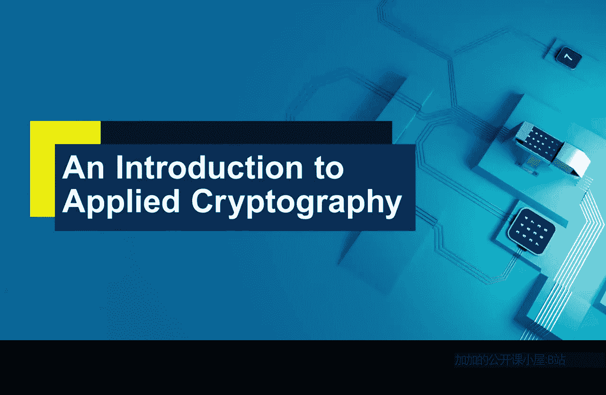
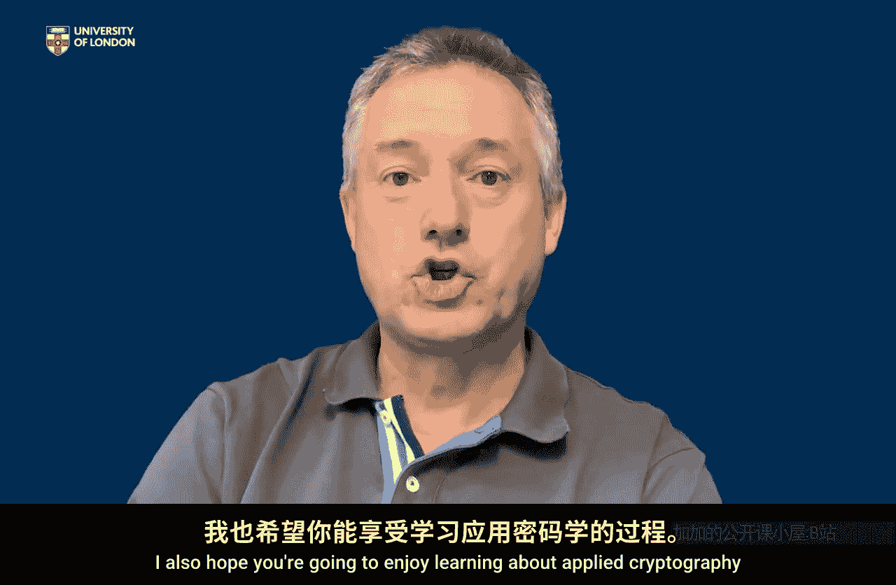
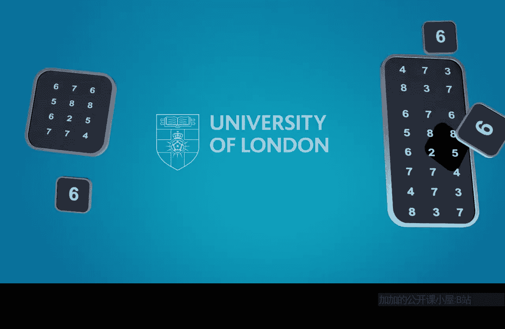

# 001：课程介绍 🎯

在本节课中，我们将要学习这门应用密码学入门课程的整体框架、学习目标以及学习方法。课程由伦敦大学皇家霍洛威学院的凯特·马丁教授主讲，旨在为非专业人士提供一个关于密码学核心概念及其在网络安全中应用的清晰概览。

## 课程概述

欢迎来到应用密码学入门课程。我是伦敦大学皇家霍洛威学院的凯特·马丁教授。本课程的目标是向您介绍密码学是什么，以及它如何在更广泛的网络安全领域中发挥作用。

密码学是网络安全众多技术与解决方案的核心基石。很少有网络安全流程或方案不依赖于密码学。因此，我们开设了这门应用密码学课程。请注意，这不是一门数学课程，也不会深入讲解具体的密码算法细节。本课程的重点在于解释密码学是什么，以及它如何被用来支持更广泛的网络安全目标。这就是我们在接下来四周内的核心目标。

## 课程内容与结构

由于四周时间有限，我们将非常有选择性地介绍内容。以下是课程的基本思路：

首先，我们将解释密码学是什么，以及它能提供哪些安全服务。

上一节我们介绍了课程的整体目标，本节中我们来看看课程的具体内容安排。以下是课程将涵盖的核心模块：

1.  **密码学基础与服务**：解释密码学的定义及其提供的核心安全服务，如机密性和完整性。
2.  **密码学应用**：展示密码学如何在实际场景中支持网络安全。
3.  **核心概念与术语**：介绍算法、密钥等基本概念，以及它们如何共同构成密码系统，并学习核心术语。
4.  **密码学的局限性与攻击**：通过分析密码系统可能遭受的攻击或失败方式，了解密码学不能做什么，审视整个密码系统的薄弱环节。

通过本课程，您将清晰理解密码学是什么、如何使用它、掌握核心术语，并能讨论密码学。同时，您也将了解密码学的脆弱性及其局限性。课程旨在全面展示密码学的能力与边界。

## 目标学员

那么，谁会觉得这门课程有用呢？您为何要继续学习？这是否符合您的兴趣和需求？

我设想您可能是以下几种情况之一：

*   **密码学完全新手**：如果您是初学者，这门课程非常适合您。它不会深入技术细节，而是展示密码学是什么、能做什么，让您对其现代应用有直观感受。
*   **寻求职业或学术方向者**：如果您已有所了解，但正在思考密码学是否应成为您职业生涯的一部分，或者您正在考虑选择相关的大学课程（例如计算机科学专业的学生在思考是否专攻网络安全），本课程能帮助您做出判断。
*   **网络安全从业者**：如果您已在网络安全领域工作，接触过密码学并希望了解更多，本课程同样适用。
*   **纯粹的好奇者**：如果您只是出于好奇，一直想知道密码学是什么，本课程也能很好地满足您。

## 学习预备知识

开始学习前您需要知道什么？实际上不需要太多。我不会从计算机和互联网的工作原理讲起，但假设您对计算机、网络以及我们使用它们做的事情有基本了解，并对安全有模糊的概念。我不假定您是任何方面的专家。

本课程尽可能自成一体，**绝不假定您具备数学背景**。我们不会涉及任何数学，也不要求您有任何数学理解。这根本不是本课程的内容。

## 课程形式与学习方法

接下来，让我们了解一下课程的具体构成和学习方法。

课程包含多种学习材料：

*   **阅读材料**：供您阅读的文本内容。
*   **短视频**：供您观看的教学视频。
*   **互动环节**：包括一些问题与答案，以及一些我称为“活动”的讨论项目。

对于互动环节，我强烈希望您能积极参与：

*   **回答问题**：当遇到有答案的问题时，请在揭示答案前认真思考并得出自己的答案。
*   **参与讨论**：对于鼓励您发表观点的讨论活动，请务必参与。这些活动旨在促进您与课程中其他学员的交流。

我设想您有一个可以称为“学习日志”的空间。这不是指一本名为“学习日志”的皮革本，而是指一个您可以记笔记、整理思路、起草要发布的解决方案草稿的地方。在整个课程中，您可以随时使用这个空间记录。

课程最后，我们会有一个“同行评审”环节。我强烈鼓励大家响应并对其他人发布的解决方案进行评论。届时会有详细说明。

## 给学习者的建议

这是一门仅为期四周的短期课程，覆盖内容有限。但要完成所有环节，您需要投入和参与。我想分享一点我自己学习慕课（MOOC）的经验：我曾选了一门与密码学无关的课程，起初满怀热情，但当遇到需要研究和思考的问题时，我开始走捷径，直接看答案；对于需要阅读和发布的内容，我以没时间为由跳过。很快我意识到自己在浪费时间，因为我没有学到多少东西。

我从中学到的教训是：**在这类课程中，无论课程多短，只有真正投入参与，才能获得价值**。

如果您想从本课程中获得我设计时希望您获得的东西，我有几点请求：

1.  **相互认识**：如果被提示，请进行自我介绍，让大家了解您和您的兴趣。
2.  **投入时间思考**：对于需要思考的问题，请花时间认真思考，不要急于揭示答案，否则该过程几乎毫无价值。
3.  **积极参与活动**：对于需要您进行一些研究、思考并发布回应的活动，请务必完成。请发布您的活动解决方案，不要只看别人的帖子。参与其中是您获得价值的关键所在。

我知道这是一门短期课程，某种意义上期望有限。但我从自身经验确知：**付出多少，收获多少**。我在课程设计中设置了许多需要您投入时间参与的环节。如果您能认真对待并参与，我确信您将从本课程中获得最大收益。这是我的请求，请您认真考虑。

## 总结

本节课中我们一起学习了《应用密码学入门》课程的整体介绍。我们明确了这不是一门数学或算法深度课程，而是一门聚焦于密码学概念、应用及其在网络安全中角色的概述性课程。课程为期四周，涵盖基础、应用、概念和局限性等内容，适合初学者、探索者、从业者和好奇者。学习成功的关键在于积极投入、认真思考并参与互动。

现在，是时候开始学习了。非常高兴您能来到这里，希望我已说服您留下并参与其中。如果您能做到以上这些，我也希望您能享受学习应用密码学的乐趣。