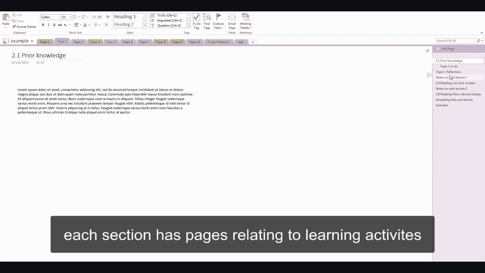
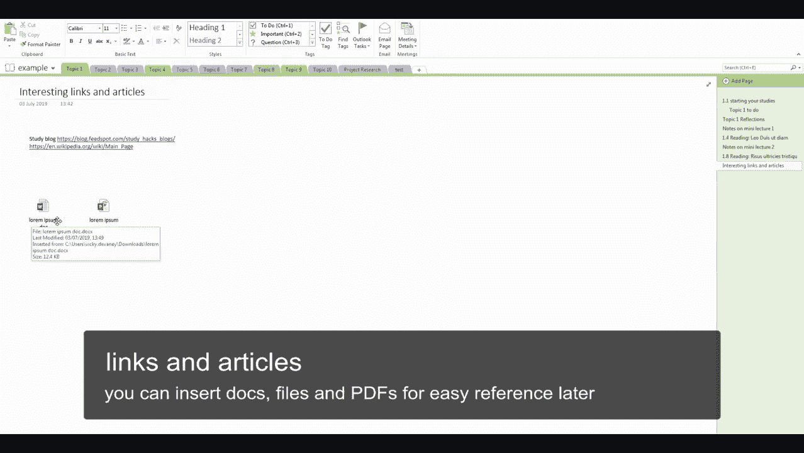
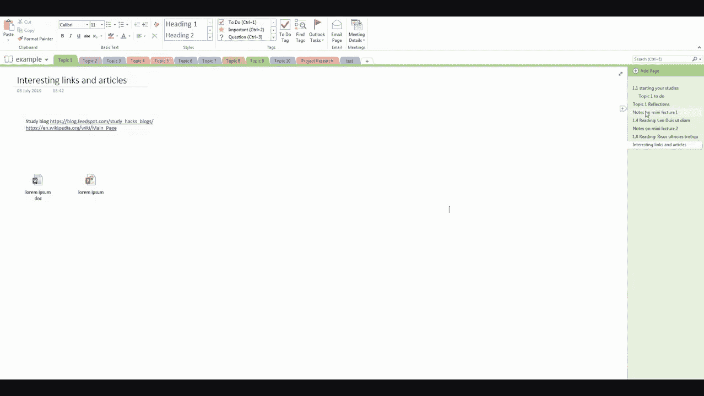
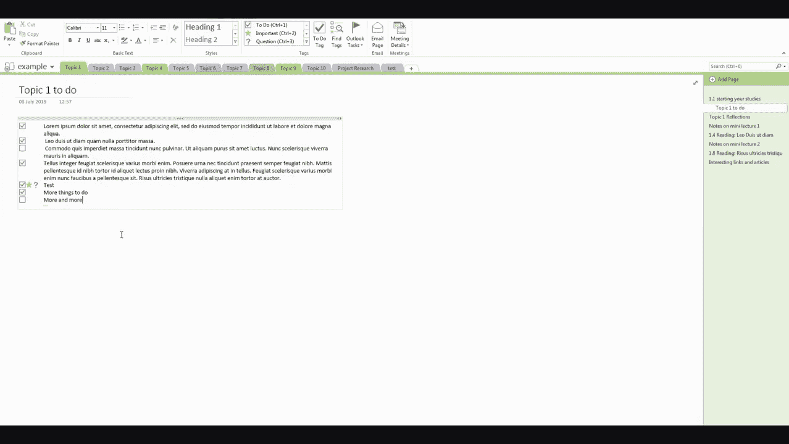

# 002：如何建立学习日志 📓

在本节课中，我们将学习如何为密码学课程建立一个有效的学习日志。学习日志是记录学习过程、加深理解和跟踪进度的强大工具。

上一节我们介绍了课程的整体框架，本节中我们来看看如何通过建立学习日志来辅助你的学习。

## 什么是学习日志？


学习日志是你个人的学习记录。它不仅仅是课堂笔记，更是你思考、提问和总结知识的地方。通过记录，你可以将新知识与已有知识联系起来，形成更深刻的理解。

## 为什么需要学习日志？



建立一个学习日志主要有以下好处：
*   **巩固记忆**：书写的过程能帮助你更好地记住概念。
*   **理清思路**：将复杂的想法写下来，有助于梳理逻辑。
*   **跟踪进度**：清晰地看到自己已经掌握了哪些内容，还有哪些需要复习。
*   **提出问题**：记录下学习时产生的疑问，便于后续寻求解答。
*   **建立知识网络**：将不同章节和概念相互关联，形成体系。

## 如何建立你的学习日志？

以下是建立学习日志的具体步骤和建议。


### 1. 选择记录工具

你可以选择数字工具或纸质笔记本。
*   **数字工具**：如Notion、OneNote、Obsidian或简单的文本编辑器。优点是易于编辑、搜索和备份。
*   **纸质笔记本**：书写感更强，有助于专注。可以选择活页本，方便调整内容顺序。



### 2. 规划日志结构

为你的日志设计一个清晰的结构，例如按周或按课程模块划分。每个主要章节可以作为一个独立的板块。

### 3. 记录核心内容



在学习每个部分后，记录以下内容：
*   **核心概念与定义**：用你自己的话重述关键术语。例如，对称加密的核心是加密和解密使用**同一把密钥K**，公式可表示为：
    *   **加密**：`C = E(K, P)`
    *   **解密**：`P = D(K, C)`
    其中，`P`是明文，`C`是密文，`E`是加密函数，`D`是解密函数。
*   **原理与流程**：描述算法或协议是如何工作的。可以绘制简单的流程图或示意图。
*   **代码示例**：如果涉及编程，记录关键的代码片段。例如，一个简单的凯撒密码移位函数：
    ```python
    def caesar_cipher(text, shift):
        result = ""
        for char in text:
            if char.isalpha():
                start = ord('A') if char.isupper() else ord('a')
                result += chr((ord(char) - start + shift) % 26 + start)
            else:
                result += char
        return result
    ```
*   **自己的话总结**：这是最重要的一步。不要照抄教材，尝试用一两句话总结该部分的精髓。

### 4. 主动思考与提问


在日志中留出空间，用于：
*   **提出问题**：记录所有不明白的地方。
*   **建立联系**：思考“这个概念和之前学的XXX有什么关联？”。
*   **举一反三**：设想这个概念还能用在什么其他场景。

### 5. 定期回顾与更新



学习不是一次性的。定期（如每周）回顾你的日志：
*   重新阅读总结，看是否仍然清晰。
*   尝试回答自己之前提出的问题。
*   用新的知识补充旧的内容，建立章节之间的联系。

---

本节课中我们一起学习了如何建立和维护一个有效的密码学学习日志。记住，日志的价值在于**你主动加工信息的过程**，而不仅仅是信息的容器。从今天开始，就为你自己的密码学学习之旅创建一份专属日志吧，它将成为你掌握这门学科最得力的助手。